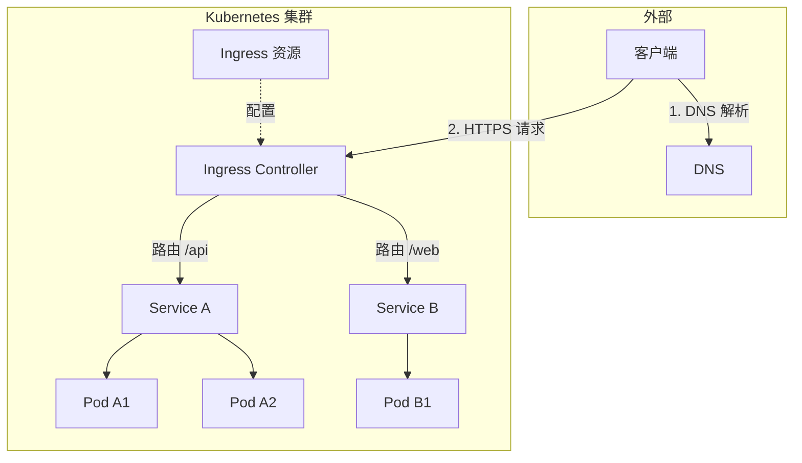
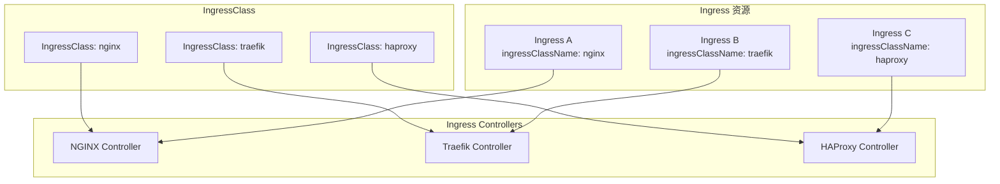
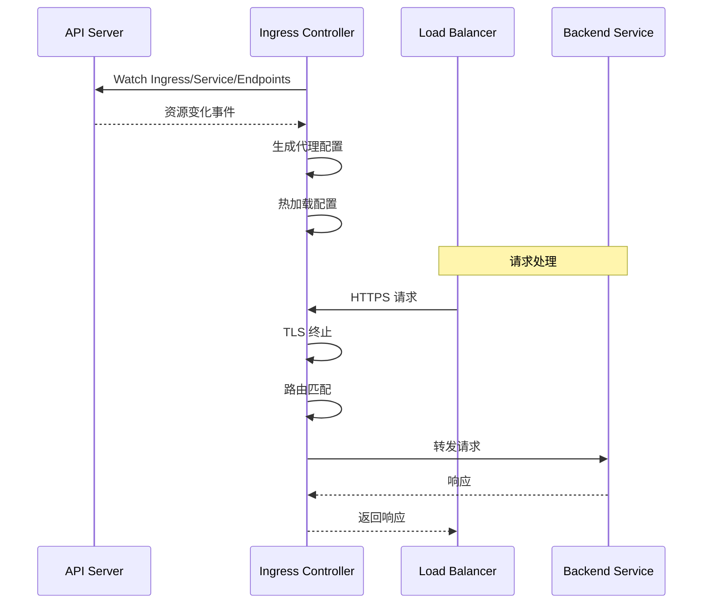

## 概述

Ingress 是 Kubernetes 中用于管理外部 HTTP/HTTPS 流量到集群内服务的 API 对象。它提供了基于主机名和路径的路由规则、TLS 终止、负载均衡等七层网络功能。Ingress 需要配合 Ingress Controller 使用才能生效。

## Ingress 核心概念

### 架构概览



### Ingress 资源结构

```yaml
apiVersion: networking.k8s.io/v1
kind: Ingress
metadata:
  name: my-ingress
  namespace: default
  annotations:
    # Controller 特定注解
    nginx.ingress.kubernetes.io/rewrite-target: /
spec:
  # 指定 IngressClass
  ingressClassName: nginx

  # TLS 配置
  tls:
    - hosts:
        - example.com
        - www.example.com
      secretName: tls-secret

  # 默认后端
  defaultBackend:
    service:
      name: default-backend
      port:
        number: 80

  # 路由规则
  rules:
    - host: example.com
      http:
        paths:
          - path: /api
            pathType: Prefix
            backend:
              service:
                name: api-service
                port:
                  number: 8080
          - path: /web
            pathType: Prefix
            backend:
              service:
                name: web-service
                port:
                  number: 80
    - host: admin.example.com
      http:
        paths:
          - path: /
            pathType: Prefix
            backend:
              service:
                name: admin-service
                port:
                  number: 80
```

### 路径类型 (pathType)

| 类型 | 行为 | 示例 |
|------|------|------|
| Exact | 精确匹配 | /foo 只匹配 /foo |
| Prefix | 前缀匹配 | /foo 匹配 /foo, /foo/, /foo/bar |
| ImplementationSpecific | 由 Controller 决定 | 取决于具体实现 |

```yaml
# 路径匹配示例
rules:
  - host: example.com
    http:
      paths:
        # 精确匹配
        - path: /exact
          pathType: Exact
          backend:
            service:
              name: exact-service
              port:
                number: 80

        # 前缀匹配
        - path: /prefix
          pathType: Prefix
          backend:
            service:
              name: prefix-service
              port:
                number: 80

        # 正则匹配（需要 Controller 支持）
        - path: /users/\d+
          pathType: ImplementationSpecific
          backend:
            service:
              name: user-service
              port:
                number: 80
```

## IngressClass

### 资源定义

```yaml
apiVersion: networking.k8s.io/v1
kind: IngressClass
metadata:
  name: nginx
  annotations:
    # 设置为默认 IngressClass
    ingressclass.kubernetes.io/is-default-class: "true"
spec:
  # Controller 标识
  controller: k8s.io/ingress-nginx
  # Controller 特定参数
  parameters:
    apiGroup: k8s.nginx.org
    kind: IngressNginxController
    name: nginx-config
```

### 多 Ingress Controller



## TLS 配置

### 创建 TLS Secret

```bash
# 创建自签名证书
openssl req -x509 -nodes -days 365 -newkey rsa:2048 \
  -keyout tls.key -out tls.crt \
  -subj "/CN=example.com"

# 创建 Secret
kubectl create secret tls tls-secret \
  --key tls.key \
  --cert tls.crt
```

```yaml
# TLS Secret 格式
apiVersion: v1
kind: Secret
metadata:
  name: tls-secret
  namespace: default
type: kubernetes.io/tls
data:
  tls.crt: <base64-encoded-cert>
  tls.key: <base64-encoded-key>
```

### TLS 终止

```yaml
apiVersion: networking.k8s.io/v1
kind: Ingress
metadata:
  name: tls-ingress
spec:
  ingressClassName: nginx
  tls:
    - hosts:
        - secure.example.com
      secretName: tls-secret
  rules:
    - host: secure.example.com
      http:
        paths:
          - path: /
            pathType: Prefix
            backend:
              service:
                name: secure-service
                port:
                  number: 80
```

### 自动证书管理

使用 cert-manager 自动获取和续订证书：

```yaml
apiVersion: networking.k8s.io/v1
kind: Ingress
metadata:
  name: auto-tls-ingress
  annotations:
    # cert-manager 注解
    cert-manager.io/cluster-issuer: letsencrypt-prod
spec:
  ingressClassName: nginx
  tls:
    - hosts:
        - auto.example.com
      secretName: auto-tls-secret  # cert-manager 自动创建
  rules:
    - host: auto.example.com
      http:
        paths:
          - path: /
            pathType: Prefix
            backend:
              service:
                name: auto-service
                port:
                  number: 80
```

## Ingress Controller

### 常见实现

| Controller | 特点 |
|------------|------|
| NGINX Ingress | 最广泛使用，功能丰富 |
| Traefik | 云原生，自动服务发现 |
| HAProxy | 高性能，企业级特性 |
| Istio Gateway | 服务网格集成 |
| Kong | API 网关功能 |
| Contour | Envoy 代理 |

### NGINX Ingress Controller

```yaml
# 安装 NGINX Ingress Controller
# helm install ingress-nginx ingress-nginx/ingress-nginx

# Controller Deployment
apiVersion: apps/v1
kind: Deployment
metadata:
  name: ingress-nginx-controller
  namespace: ingress-nginx
spec:
  replicas: 2
  selector:
    matchLabels:
      app.kubernetes.io/name: ingress-nginx
  template:
    spec:
      containers:
        - name: controller
          image: registry.k8s.io/ingress-nginx/controller:v1.9.0
          args:
            - /nginx-ingress-controller
            - --publish-service=$(POD_NAMESPACE)/ingress-nginx-controller
            - --election-id=ingress-controller-leader
            - --controller-class=k8s.io/ingress-nginx
            - --configmap=$(POD_NAMESPACE)/ingress-nginx-controller
          ports:
            - name: http
              containerPort: 80
            - name: https
              containerPort: 443
          livenessProbe:
            httpGet:
              path: /healthz
              port: 10254
          readinessProbe:
            httpGet:
              path: /healthz
              port: 10254
```

### Controller 工作流程



## 高级功能

### 注解扩展

NGINX Ingress 常用注解：

```yaml
apiVersion: networking.k8s.io/v1
kind: Ingress
metadata:
  name: advanced-ingress
  annotations:
    # SSL 重定向
    nginx.ingress.kubernetes.io/ssl-redirect: "true"

    # URL 重写
    nginx.ingress.kubernetes.io/rewrite-target: /$2
    nginx.ingress.kubernetes.io/use-regex: "true"

    # 限速
    nginx.ingress.kubernetes.io/limit-rps: "100"
    nginx.ingress.kubernetes.io/limit-connections: "10"

    # 超时配置
    nginx.ingress.kubernetes.io/proxy-connect-timeout: "30"
    nginx.ingress.kubernetes.io/proxy-read-timeout: "60"

    # CORS
    nginx.ingress.kubernetes.io/enable-cors: "true"
    nginx.ingress.kubernetes.io/cors-allow-origin: "https://example.com"

    # 认证
    nginx.ingress.kubernetes.io/auth-type: basic
    nginx.ingress.kubernetes.io/auth-secret: basic-auth
    nginx.ingress.kubernetes.io/auth-realm: "Authentication Required"

    # 会话亲和
    nginx.ingress.kubernetes.io/affinity: "cookie"
    nginx.ingress.kubernetes.io/session-cookie-name: "route"

    # 自定义响应头
    nginx.ingress.kubernetes.io/configuration-snippet: |
      add_header X-Custom-Header "value";
spec:
  ingressClassName: nginx
  rules:
    - host: example.com
      http:
        paths:
          - path: /api(/|$)(.*)
            pathType: Prefix
            backend:
              service:
                name: api-service
                port:
                  number: 80
```

### 金丝雀发布

```yaml
# 主 Ingress
apiVersion: networking.k8s.io/v1
kind: Ingress
metadata:
  name: production-ingress
spec:
  ingressClassName: nginx
  rules:
    - host: example.com
      http:
        paths:
          - path: /
            pathType: Prefix
            backend:
              service:
                name: production-service
                port:
                  number: 80
---
# 金丝雀 Ingress
apiVersion: networking.k8s.io/v1
kind: Ingress
metadata:
  name: canary-ingress
  annotations:
    nginx.ingress.kubernetes.io/canary: "true"
    # 基于权重
    nginx.ingress.kubernetes.io/canary-weight: "20"
    # 或基于 Header
    # nginx.ingress.kubernetes.io/canary-by-header: "X-Canary"
    # nginx.ingress.kubernetes.io/canary-by-header-value: "true"
    # 或基于 Cookie
    # nginx.ingress.kubernetes.io/canary-by-cookie: "canary"
spec:
  ingressClassName: nginx
  rules:
    - host: example.com
      http:
        paths:
          - path: /
            pathType: Prefix
            backend:
              service:
                name: canary-service
                port:
                  number: 80
```

### 外部认证

```yaml
apiVersion: networking.k8s.io/v1
kind: Ingress
metadata:
  name: external-auth-ingress
  annotations:
    # 外部认证服务
    nginx.ingress.kubernetes.io/auth-url: "https://auth.example.com/verify"
    nginx.ingress.kubernetes.io/auth-signin: "https://auth.example.com/login"
    nginx.ingress.kubernetes.io/auth-response-headers: "X-User-ID, X-User-Email"
spec:
  ingressClassName: nginx
  rules:
    - host: protected.example.com
      http:
        paths:
          - path: /
            pathType: Prefix
            backend:
              service:
                name: protected-service
                port:
                  number: 80
```

## 故障排查

### 常见问题

```
┌─────────────────────────────────────────────────────────────────┐
│                   Ingress 常见问题                               │
├─────────────────────────────────────────────────────────────────┤
│                                                                  │
│  问题 1: 404 Not Found                                          │
│  ├── 检查 Ingress 规则是否正确                                   │
│  ├── 验证后端 Service 和 Endpoints                               │
│  └── 检查路径匹配类型                                            │
│                                                                  │
│  问题 2: 502 Bad Gateway                                        │
│  ├── 后端 Pod 未就绪                                             │
│  ├── Service 端口配置错误                                        │
│  └── 健康检查失败                                                │
│                                                                  │
│  问题 3: 证书错误                                                │
│  ├── Secret 不存在或格式错误                                     │
│  ├── 证书与域名不匹配                                            │
│  └── 证书已过期                                                  │
│                                                                  │
│  问题 4: 配置未生效                                              │
│  ├── IngressClass 不匹配                                         │
│  ├── Controller 未监听该命名空间                                 │
│  └── 注解语法错误                                                │
│                                                                  │
└─────────────────────────────────────────────────────────────────┘
```

### 调试命令

```bash
# 查看 Ingress 状态
kubectl get ingress
kubectl describe ingress my-ingress

# 查看 Ingress Controller 日志
kubectl logs -n ingress-nginx -l app.kubernetes.io/name=ingress-nginx

# 检查 NGINX 配置
kubectl exec -n ingress-nginx <controller-pod> -- cat /etc/nginx/nginx.conf

# 测试后端连通性
kubectl run test --rm -it --image=busybox -- wget -qO- http://my-service:80

# 检查 Endpoints
kubectl get endpoints my-service

# 查看 IngressClass
kubectl get ingressclass
```

## 监控指标

### Prometheus 指标

```yaml
# NGINX Ingress Controller 关键指标
- nginx_ingress_controller_requests          # 请求总数
- nginx_ingress_controller_request_duration_seconds  # 请求延迟
- nginx_ingress_controller_response_size     # 响应大小
- nginx_ingress_controller_upstream_latency_seconds  # 上游延迟
- nginx_ingress_controller_ssl_expire_time_seconds   # 证书过期时间
```

### Grafana 仪表盘

```json
{
  "panels": [
    {
      "title": "Request Rate",
      "targets": [
        {
          "expr": "sum(rate(nginx_ingress_controller_requests[5m])) by (ingress)"
        }
      ]
    },
    {
      "title": "Error Rate",
      "targets": [
        {
          "expr": "sum(rate(nginx_ingress_controller_requests{status=~\"5..\"}[5m])) / sum(rate(nginx_ingress_controller_requests[5m]))"
        }
      ]
    },
    {
      "title": "P99 Latency",
      "targets": [
        {
          "expr": "histogram_quantile(0.99, sum(rate(nginx_ingress_controller_request_duration_seconds_bucket[5m])) by (le, ingress))"
        }
      ]
    }
  ]
}
```

## 总结

Ingress 提供了七层流量管理能力：
- **基于主机和路径的路由**：灵活的流量分发
- **TLS 终止**：HTTPS 支持和证书管理
- **可扩展性**：通过注解支持高级功能
- **多 Controller 支持**：IngressClass 实现分离

选择 Ingress Controller 时考虑：
- 功能需求（限速、认证、金丝雀等）
- 性能要求
- 社区支持和文档
- 与现有基础设施的集成
