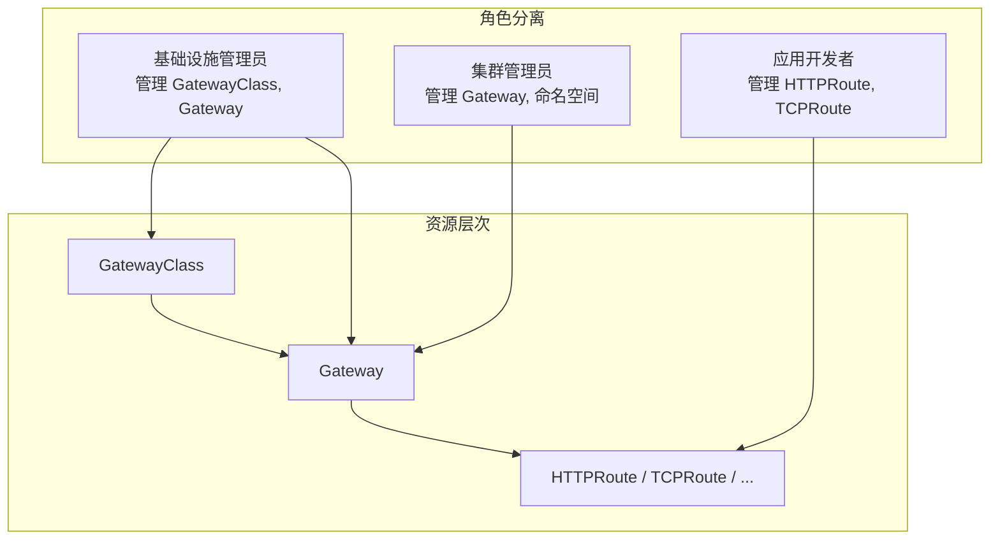
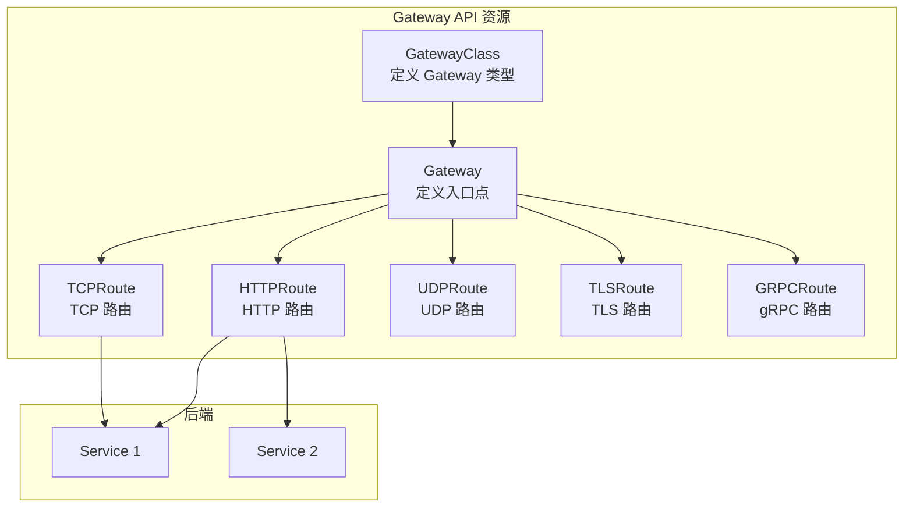

## 概述

Gateway API 是 Kubernetes 下一代的 Ingress API，旨在解决传统 Ingress 的局限性。它提供了更丰富的功能、更好的可扩展性和更清晰的角色分离。Gateway API 由 SIG-Network 社区主导开发，已成为 Kubernetes 官方推荐的流量管理方案。

## 设计目标

### Ingress 的局限性

```
┌─────────────────────────────────────────────────────────────────┐
│                   Ingress 的问题                                 │
├─────────────────────────────────────────────────────────────────┤
│                                                                  │
│  1. 功能有限                                                     │
│     - 只支持 HTTP/HTTPS                                         │
│     - 无法配置高级路由规则                                       │
│     - 依赖 Controller 特定注解                                   │
│                                                                  │
│  2. 可移植性差                                                   │
│     - 不同 Controller 注解不兼容                                 │
│     - 配置迁移困难                                               │
│                                                                  │
│  3. 角色不清晰                                                   │
│     - 基础设施管理员和应用开发者职责混淆                          │
│     - 权限控制困难                                               │
│                                                                  │
│  4. 扩展性不足                                                   │
│     - 难以支持新协议                                             │
│     - 自定义功能需要 CRD                                         │
│                                                                  │
└─────────────────────────────────────────────────────────────────┘
```

### Gateway API 的解决方案



## 核心资源

### 资源关系



### GatewayClass

定义 Gateway 的类型和控制器：

```yaml
apiVersion: gateway.networking.k8s.io/v1
kind: GatewayClass
metadata:
  name: istio
spec:
  # 控制器名称
  controllerName: istio.io/gateway-controller
  # 参数引用
  parametersRef:
    group: ""
    kind: ConfigMap
    name: istio-gateway-config
    namespace: istio-system
  # 描述
  description: "Istio Gateway Controller"
```

### Gateway

定义网络入口点：

```yaml
apiVersion: gateway.networking.k8s.io/v1
kind: Gateway
metadata:
  name: my-gateway
  namespace: default
spec:
  # 引用 GatewayClass
  gatewayClassName: istio

  # 监听器配置
  listeners:
    # HTTP 监听器
    - name: http
      protocol: HTTP
      port: 80
      hostname: "*.example.com"
      allowedRoutes:
        namespaces:
          from: All  # All, Same, Selector

    # HTTPS 监听器
    - name: https
      protocol: HTTPS
      port: 443
      hostname: "secure.example.com"
      tls:
        mode: Terminate
        certificateRefs:
          - kind: Secret
            name: tls-secret
      allowedRoutes:
        namespaces:
          from: Same

    # TCP 监听器
    - name: tcp
      protocol: TCP
      port: 9000
      allowedRoutes:
        kinds:
          - kind: TCPRoute

  # 地址配置（可选）
  addresses:
    - type: IPAddress
      value: "192.168.1.100"
```

### HTTPRoute

定义 HTTP 路由规则：

```yaml
apiVersion: gateway.networking.k8s.io/v1
kind: HTTPRoute
metadata:
  name: my-http-route
  namespace: default
spec:
  # 绑定到 Gateway
  parentRefs:
    - name: my-gateway
      namespace: default
      sectionName: http  # 可选，指定 listener

  # 主机名匹配
  hostnames:
    - "api.example.com"
    - "www.example.com"

  # 路由规则
  rules:
    # 规则 1: /api 前缀
    - matches:
        - path:
            type: PathPrefix
            value: /api
          headers:
            - name: X-Version
              value: v2
          method: GET
      filters:
        - type: RequestHeaderModifier
          requestHeaderModifier:
            add:
              - name: X-Forwarded-By
                value: gateway-api
            remove:
              - X-Deprecated
      backendRefs:
        - name: api-service
          port: 8080
          weight: 90
        - name: api-canary
          port: 8080
          weight: 10

    # 规则 2: /web 前缀
    - matches:
        - path:
            type: PathPrefix
            value: /web
      backendRefs:
        - name: web-service
          port: 80

    # 规则 3: 重定向
    - matches:
        - path:
            type: Exact
            value: /old-path
      filters:
        - type: RequestRedirect
          requestRedirect:
            scheme: https
            hostname: new.example.com
            port: 443
            statusCode: 301
```

### TCPRoute

定义 TCP 路由：

```yaml
apiVersion: gateway.networking.k8s.io/v1alpha2
kind: TCPRoute
metadata:
  name: mysql-route
  namespace: default
spec:
  parentRefs:
    - name: my-gateway
      sectionName: tcp
  rules:
    - backendRefs:
        - name: mysql-service
          port: 3306
```

### GRPCRoute

定义 gRPC 路由：

```yaml
apiVersion: gateway.networking.k8s.io/v1alpha2
kind: GRPCRoute
metadata:
  name: grpc-route
  namespace: default
spec:
  parentRefs:
    - name: my-gateway
  hostnames:
    - "grpc.example.com"
  rules:
    - matches:
        - method:
            service: myservice.v1.MyService
            method: GetUser
      backendRefs:
        - name: grpc-service
          port: 50051
```

## 高级功能

### 流量拆分

```yaml
apiVersion: gateway.networking.k8s.io/v1
kind: HTTPRoute
metadata:
  name: traffic-split
spec:
  parentRefs:
    - name: my-gateway
  rules:
    - backendRefs:
        # 80% 流量到稳定版本
        - name: stable-service
          port: 80
          weight: 80
        # 20% 流量到金丝雀版本
        - name: canary-service
          port: 80
          weight: 20
```

### 请求/响应修改

```yaml
apiVersion: gateway.networking.k8s.io/v1
kind: HTTPRoute
metadata:
  name: header-modification
spec:
  parentRefs:
    - name: my-gateway
  rules:
    - filters:
        # 添加请求头
        - type: RequestHeaderModifier
          requestHeaderModifier:
            add:
              - name: X-Request-ID
                value: "${REQUEST_ID}"
            set:
              - name: Host
                value: internal.example.com
            remove:
              - X-Deprecated-Header

        # 添加响应头
        - type: ResponseHeaderModifier
          responseHeaderModifier:
            add:
              - name: X-Response-Time
                value: "123ms"

        # URL 重写
        - type: URLRewrite
          urlRewrite:
            hostname: backend.internal
            path:
              type: ReplacePrefixMatch
              replacePrefixMatch: /v2

      backendRefs:
        - name: backend-service
          port: 80
```

### 请求镜像

```yaml
apiVersion: gateway.networking.k8s.io/v1
kind: HTTPRoute
metadata:
  name: request-mirroring
spec:
  parentRefs:
    - name: my-gateway
  rules:
    - backendRefs:
        - name: main-service
          port: 80
      filters:
        # 镜像流量到测试服务
        - type: RequestMirror
          requestMirror:
            backendRef:
              name: test-service
              port: 80
```

### 跨命名空间引用

```yaml
# 在 default 命名空间创建 HTTPRoute
apiVersion: gateway.networking.k8s.io/v1
kind: HTTPRoute
metadata:
  name: cross-namespace-route
  namespace: default
spec:
  parentRefs:
    # 引用 gateway-ns 命名空间的 Gateway
    - name: shared-gateway
      namespace: gateway-ns
  rules:
    - backendRefs:
        # 引用 backend-ns 命名空间的 Service
        - name: backend-service
          namespace: backend-ns
          port: 80
---
# 需要 ReferenceGrant 授权跨命名空间引用
apiVersion: gateway.networking.k8s.io/v1beta1
kind: ReferenceGrant
metadata:
  name: allow-default-to-backend
  namespace: backend-ns
spec:
  from:
    - group: gateway.networking.k8s.io
      kind: HTTPRoute
      namespace: default
  to:
    - group: ""
      kind: Service
```

## 路由匹配

### 匹配类型

```yaml
apiVersion: gateway.networking.k8s.io/v1
kind: HTTPRoute
metadata:
  name: matching-examples
spec:
  parentRefs:
    - name: my-gateway
  rules:
    # 路径匹配
    - matches:
        - path:
            type: Exact        # 精确匹配
            value: /exact
        - path:
            type: PathPrefix   # 前缀匹配
            value: /api/
        - path:
            type: RegularExpression  # 正则匹配
            value: /users/\d+

    # Header 匹配
    - matches:
        - headers:
            - name: X-Version
              type: Exact
              value: "v2"
            - name: X-Request-ID
              type: RegularExpression
              value: "^[a-f0-9-]+$"

    # Query 参数匹配
    - matches:
        - queryParams:
            - name: version
              type: Exact
              value: "2"

    # Method 匹配
    - matches:
        - method: POST

      backendRefs:
        - name: service
          port: 80
```

### 匹配优先级

```
优先级从高到低：
1. Exact 路径匹配
2. PathPrefix 匹配（更长的前缀优先）
3. 带有更多匹配条件的规则优先
4. 按规则定义顺序
```

## 与 Ingress 对比

### 功能对比

| 功能 | Ingress | Gateway API |
|------|---------|-------------|
| HTTP 路由 | 支持 | 支持 |
| HTTPS/TLS | 支持 | 支持（更灵活） |
| TCP/UDP | 不支持 | 支持 |
| gRPC | 通过注解 | 原生支持 |
| 流量拆分 | 通过注解 | 原生支持 |
| Header 匹配 | 有限 | 完整支持 |
| 请求修改 | 通过注解 | 原生支持 |
| 跨命名空间 | 不支持 | 支持 |
| 角色分离 | 无 | 支持 |
| 可移植性 | 差 | 好 |

### 迁移示例

```yaml
# Ingress 配置
apiVersion: networking.k8s.io/v1
kind: Ingress
metadata:
  name: my-ingress
  annotations:
    nginx.ingress.kubernetes.io/rewrite-target: /
spec:
  rules:
    - host: example.com
      http:
        paths:
          - path: /api
            pathType: Prefix
            backend:
              service:
                name: api-service
                port:
                  number: 80
---
# 等效的 Gateway API 配置
apiVersion: gateway.networking.k8s.io/v1
kind: HTTPRoute
metadata:
  name: my-http-route
spec:
  parentRefs:
    - name: my-gateway
  hostnames:
    - "example.com"
  rules:
    - matches:
        - path:
            type: PathPrefix
            value: /api
      filters:
        - type: URLRewrite
          urlRewrite:
            path:
              type: ReplacePrefixMatch
              replacePrefixMatch: /
      backendRefs:
        - name: api-service
          port: 80
```

## 实现状态

### 支持的控制器

```
┌─────────────────────────────────────────────────────────────────┐
│                Gateway API 实现状态                              │
├─────────────────────────────────────────────────────────────────┤
│                                                                  │
│  完整支持:                                                       │
│  ├── Istio                                                      │
│  ├── Contour                                                    │
│  ├── Kong                                                       │
│  ├── Traefik                                                    │
│  └── HAProxy                                                    │
│                                                                  │
│  部分支持:                                                       │
│  ├── NGINX Gateway Fabric                                       │
│  ├── Envoy Gateway                                              │
│  └── Google Cloud Gateway Controller                            │
│                                                                  │
│  实验性:                                                         │
│  ├── Cilium                                                     │
│  └── Linkerd                                                    │
│                                                                  │
└─────────────────────────────────────────────────────────────────┘
```

### API 稳定性

| 资源 | 状态 | 版本 |
|------|------|------|
| GatewayClass | GA | v1 |
| Gateway | GA | v1 |
| HTTPRoute | GA | v1 |
| ReferenceGrant | GA | v1 |
| GRPCRoute | Alpha | v1alpha2 |
| TCPRoute | Alpha | v1alpha2 |
| TLSRoute | Alpha | v1alpha2 |
| UDPRoute | Alpha | v1alpha2 |

## 最佳实践

### 安装 Gateway API CRD

```bash
# 安装标准 CRD
kubectl apply -f https://github.com/kubernetes-sigs/gateway-api/releases/download/v1.0.0/standard-install.yaml

# 安装实验性 CRD（包括 TCPRoute、UDPRoute 等）
kubectl apply -f https://github.com/kubernetes-sigs/gateway-api/releases/download/v1.0.0/experimental-install.yaml
```

### 生产配置示例

```yaml
# GatewayClass
apiVersion: gateway.networking.k8s.io/v1
kind: GatewayClass
metadata:
  name: production
spec:
  controllerName: istio.io/gateway-controller
---
# Gateway
apiVersion: gateway.networking.k8s.io/v1
kind: Gateway
metadata:
  name: production-gateway
  namespace: gateway-system
spec:
  gatewayClassName: production
  listeners:
    - name: http
      protocol: HTTP
      port: 80
      hostname: "*.example.com"
      allowedRoutes:
        namespaces:
          from: Selector
          selector:
            matchLabels:
              gateway-access: "true"

    - name: https
      protocol: HTTPS
      port: 443
      hostname: "*.example.com"
      tls:
        mode: Terminate
        certificateRefs:
          - kind: Secret
            name: wildcard-tls
      allowedRoutes:
        namespaces:
          from: Selector
          selector:
            matchLabels:
              gateway-access: "true"
---
# HTTPRoute
apiVersion: gateway.networking.k8s.io/v1
kind: HTTPRoute
metadata:
  name: production-route
  namespace: production
  labels:
    gateway-access: "true"
spec:
  parentRefs:
    - name: production-gateway
      namespace: gateway-system
  hostnames:
    - "api.example.com"
  rules:
    - matches:
        - path:
            type: PathPrefix
            value: /v1
      backendRefs:
        - name: api-v1
          port: 8080
          weight: 100
    - matches:
        - path:
            type: PathPrefix
            value: /v2
      backendRefs:
        - name: api-v2
          port: 8080
          weight: 90
        - name: api-v2-canary
          port: 8080
          weight: 10
```

## 总结

Gateway API 的优势：
- **表达力强**：原生支持高级路由、流量拆分、请求修改
- **角色分离**：清晰的资源层次和权限模型
- **可移植性**：标准化 API，跨实现兼容
- **可扩展性**：支持多协议（HTTP、TCP、UDP、gRPC）
- **跨命名空间**：支持共享基础设施

适用场景：
- 新项目或 Ingress 功能不足时
- 需要高级路由功能
- 多租户环境
- 跨命名空间流量管理
