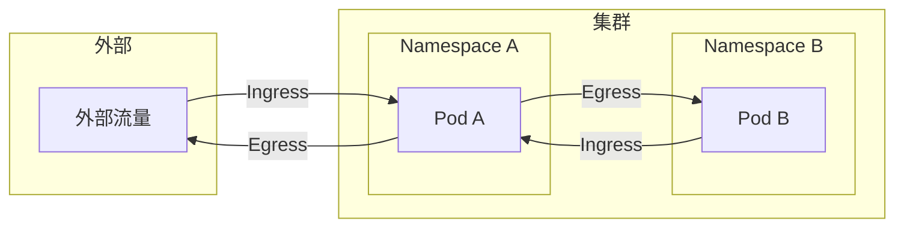
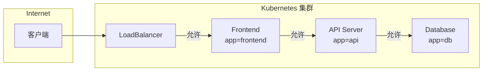
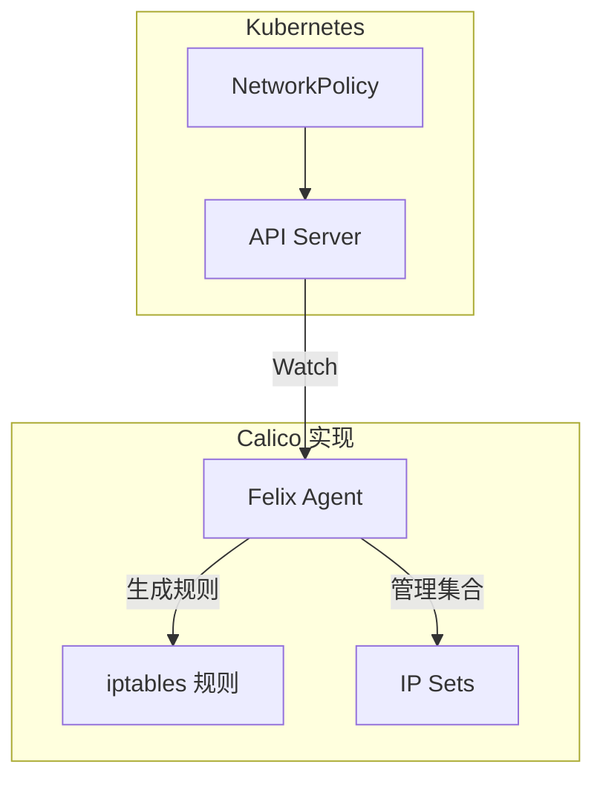
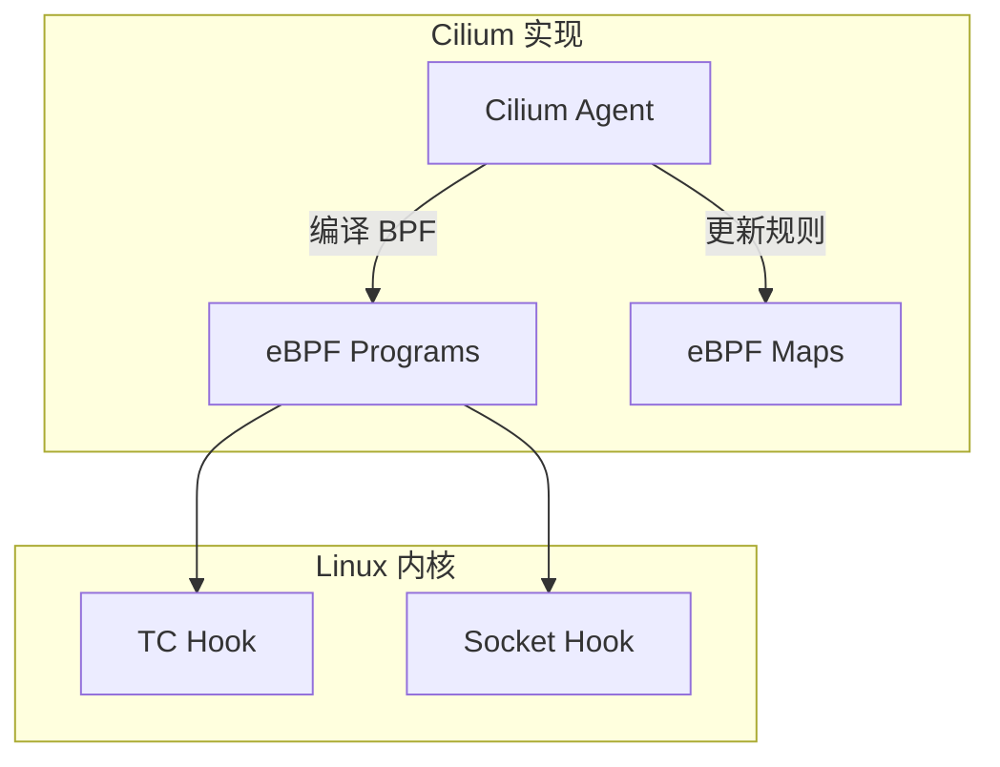
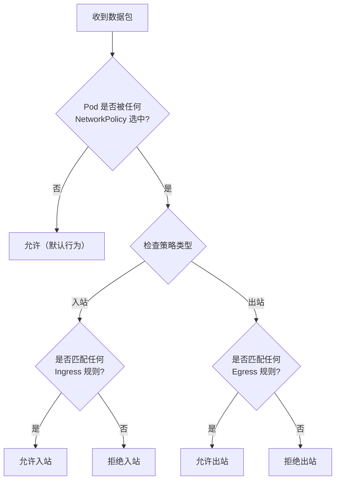

## 概述

NetworkPolicy 是 Kubernetes 中用于控制 Pod 间网络流量的资源。它采用白名单模式，允许管理员定义哪些 Pod 可以相互通信，实现网络层面的微分段和隔离。NetworkPolicy 的实际执行依赖于 CNI 插件的支持。

## 核心概念

### 默认行为

```
┌─────────────────────────────────────────────────────────────────┐
│                   Kubernetes 网络默认行为                        │
├─────────────────────────────────────────────────────────────────┤
│                                                                  │
│  无 NetworkPolicy 时:                                            │
│  ├── 所有 Pod 可以接收来自任何来源的流量（入站允许）              │
│  ├── 所有 Pod 可以向任何目标发送流量（出站允许）                  │
│  └── 集群内网络完全开放                                          │
│                                                                  │
│  有 NetworkPolicy 时:                                            │
│  ├── 被选中的 Pod 默认拒绝未明确允许的流量                       │
│  ├── 只有匹配规则的流量被允许                                    │
│  └── 未被选中的 Pod 保持默认开放                                 │
│                                                                  │
└─────────────────────────────────────────────────────────────────┘
```

### 流量方向



## NetworkPolicy 资源

### 基本结构

```yaml
apiVersion: networking.k8s.io/v1
kind: NetworkPolicy
metadata:
  name: example-policy
  namespace: default
spec:
  # 选择应用策略的 Pod
  podSelector:
    matchLabels:
      app: web

  # 策略类型
  policyTypes:
    - Ingress
    - Egress

  # 入站规则
  ingress:
    - from:
        # Pod 选择器
        - podSelector:
            matchLabels:
              role: frontend
        # 命名空间选择器
        - namespaceSelector:
            matchLabels:
              env: production
        # IP 块
        - ipBlock:
            cidr: 10.0.0.0/8
            except:
              - 10.1.0.0/16
      ports:
        - protocol: TCP
          port: 80
        - protocol: TCP
          port: 443

  # 出站规则
  egress:
    - to:
        - podSelector:
            matchLabels:
              role: database
      ports:
        - protocol: TCP
          port: 5432
```

### 选择器详解

```yaml
# podSelector - 选择 Pod
podSelector:
  matchLabels:
    app: web
    version: v1
  matchExpressions:
    - key: tier
      operator: In
      values: [frontend, backend]

# namespaceSelector - 选择命名空间
namespaceSelector:
  matchLabels:
    env: production
    team: platform

# 组合选择器（AND 关系）
from:
  - podSelector:
      matchLabels:
        role: frontend
    namespaceSelector:
      matchLabels:
        env: production

# 多个选择器（OR 关系）
from:
  - podSelector:
      matchLabels:
        role: frontend
  - namespaceSelector:
      matchLabels:
        env: monitoring
```

### ipBlock

```yaml
# IP 块配置
ipBlock:
  # CIDR 范围
  cidr: 172.16.0.0/12
  # 排除的子网
  except:
    - 172.16.1.0/24
    - 172.16.2.0/24
```

## 常见策略模式

### 1. 默认拒绝所有入站

```yaml
apiVersion: networking.k8s.io/v1
kind: NetworkPolicy
metadata:
  name: default-deny-ingress
  namespace: production
spec:
  # 选择所有 Pod
  podSelector: {}
  policyTypes:
    - Ingress
  # 无 ingress 规则 = 拒绝所有入站
```

### 2. 默认拒绝所有出站

```yaml
apiVersion: networking.k8s.io/v1
kind: NetworkPolicy
metadata:
  name: default-deny-egress
  namespace: production
spec:
  podSelector: {}
  policyTypes:
    - Egress
  # 无 egress 规则 = 拒绝所有出站
```

### 3. 默认拒绝所有流量

```yaml
apiVersion: networking.k8s.io/v1
kind: NetworkPolicy
metadata:
  name: default-deny-all
  namespace: production
spec:
  podSelector: {}
  policyTypes:
    - Ingress
    - Egress
```

### 4. 允许同命名空间通信

```yaml
apiVersion: networking.k8s.io/v1
kind: NetworkPolicy
metadata:
  name: allow-same-namespace
  namespace: production
spec:
  podSelector: {}
  policyTypes:
    - Ingress
  ingress:
    - from:
        # 空的 podSelector 匹配同命名空间所有 Pod
        - podSelector: {}
```

### 5. 允许特定服务访问

```yaml
# Web 服务只允许来自 Frontend 的流量
apiVersion: networking.k8s.io/v1
kind: NetworkPolicy
metadata:
  name: web-allow-frontend
  namespace: production
spec:
  podSelector:
    matchLabels:
      app: web
  policyTypes:
    - Ingress
  ingress:
    - from:
        - podSelector:
            matchLabels:
              app: frontend
      ports:
        - protocol: TCP
          port: 8080
```

### 6. 数据库访问控制

```yaml
apiVersion: networking.k8s.io/v1
kind: NetworkPolicy
metadata:
  name: database-policy
  namespace: production
spec:
  podSelector:
    matchLabels:
      app: database
  policyTypes:
    - Ingress
    - Egress
  ingress:
    # 只允许后端服务访问
    - from:
        - podSelector:
            matchLabels:
              role: backend
      ports:
        - protocol: TCP
          port: 5432
  egress:
    # 允许访问 DNS
    - to:
        - namespaceSelector: {}
          podSelector:
            matchLabels:
              k8s-app: kube-dns
      ports:
        - protocol: UDP
          port: 53
```

### 7. 允许监控系统访问

```yaml
apiVersion: networking.k8s.io/v1
kind: NetworkPolicy
metadata:
  name: allow-monitoring
  namespace: production
spec:
  podSelector: {}
  policyTypes:
    - Ingress
  ingress:
    - from:
        # 允许 monitoring 命名空间的 Prometheus
        - namespaceSelector:
            matchLabels:
              name: monitoring
          podSelector:
            matchLabels:
              app: prometheus
      ports:
        - protocol: TCP
          port: 9090  # metrics 端口
```

### 8. 多层应用策略



```yaml
# Frontend 策略
apiVersion: networking.k8s.io/v1
kind: NetworkPolicy
metadata:
  name: frontend-policy
spec:
  podSelector:
    matchLabels:
      app: frontend
  policyTypes:
    - Ingress
    - Egress
  ingress:
    - from:
        - ipBlock:
            cidr: 0.0.0.0/0  # 允许外部访问
      ports:
        - protocol: TCP
          port: 80
  egress:
    - to:
        - podSelector:
            matchLabels:
              app: api
      ports:
        - protocol: TCP
          port: 8080
    - to:
        - namespaceSelector: {}
          podSelector:
            matchLabels:
              k8s-app: kube-dns
      ports:
        - protocol: UDP
          port: 53
---
# API 策略
apiVersion: networking.k8s.io/v1
kind: NetworkPolicy
metadata:
  name: api-policy
spec:
  podSelector:
    matchLabels:
      app: api
  policyTypes:
    - Ingress
    - Egress
  ingress:
    - from:
        - podSelector:
            matchLabels:
              app: frontend
      ports:
        - protocol: TCP
          port: 8080
  egress:
    - to:
        - podSelector:
            matchLabels:
              app: db
      ports:
        - protocol: TCP
          port: 5432
    - to:
        - namespaceSelector: {}
          podSelector:
            matchLabels:
              k8s-app: kube-dns
      ports:
        - protocol: UDP
          port: 53
---
# Database 策略
apiVersion: networking.k8s.io/v1
kind: NetworkPolicy
metadata:
  name: db-policy
spec:
  podSelector:
    matchLabels:
      app: db
  policyTypes:
    - Ingress
    - Egress
  ingress:
    - from:
        - podSelector:
            matchLabels:
              app: api
      ports:
        - protocol: TCP
          port: 5432
  egress:
    - to:
        - namespaceSelector: {}
          podSelector:
            matchLabels:
              k8s-app: kube-dns
      ports:
        - protocol: UDP
          port: 53
```

## CNI 实现

### Calico 实现



### iptables 规则示例

```bash
# Calico 生成的 iptables 规则示例

# 入站链
-A cali-fw-eth0 -m comment --comment "cali:policy-ingress" -j cali-pi-_namespace_policy
-A cali-pi-_namespace_policy -m set --match-set cali40s:frontend src -j MARK --set-mark 0x10000/0x10000
-A cali-pi-_namespace_policy -m mark --mark 0x10000/0x10000 -j RETURN
-A cali-pi-_namespace_policy -j DROP

# 出站链
-A cali-tw-eth0 -m comment --comment "cali:policy-egress" -j cali-po-_namespace_policy
-A cali-po-_namespace_policy -m set --match-set cali40d:database dst -p tcp --dport 5432 -j MARK --set-mark 0x10000/0x10000
-A cali-po-_namespace_policy -m mark --mark 0x10000/0x10000 -j RETURN
-A cali-po-_namespace_policy -j DROP
```

### Cilium eBPF 实现



### CNI 策略能力对比

| CNI | NetworkPolicy | 高级功能 |
|-----|--------------|----------|
| Calico | 完整支持 | GlobalNetworkPolicy, 应用层策略 |
| Cilium | 完整支持 | L7 策略, DNS 策略, FQDN 策略 |
| Weave | 完整支持 | - |
| Flannel | 不支持 | - |
| Canal | 完整支持（Calico） | - |
| Antrea | 完整支持 | ClusterNetworkPolicy |

## 策略评估流程

### 评估逻辑



### 规则合并

```
多个 NetworkPolicy 作用于同一 Pod 时：
1. 所有策略的规则取并集（OR）
2. 任何一个策略允许的流量都被允许
3. 只有所有策略都不允许时才拒绝
```

```yaml
# 策略 A: 允许来自 frontend 的流量
apiVersion: networking.k8s.io/v1
kind: NetworkPolicy
metadata:
  name: policy-a
spec:
  podSelector:
    matchLabels:
      app: web
  ingress:
    - from:
        - podSelector:
            matchLabels:
              app: frontend
---
# 策略 B: 允许来自 monitoring 的流量
apiVersion: networking.k8s.io/v1
kind: NetworkPolicy
metadata:
  name: policy-b
spec:
  podSelector:
    matchLabels:
      app: web
  ingress:
    - from:
        - namespaceSelector:
            matchLabels:
              name: monitoring

# 结果：app=web 的 Pod 允许来自 frontend 或 monitoring 的流量
```

## 调试与排查

### 检查策略

```bash
# 查看命名空间的所有 NetworkPolicy
kubectl get networkpolicy -n production

# 查看策略详情
kubectl describe networkpolicy web-policy -n production

# 查看策略 YAML
kubectl get networkpolicy web-policy -n production -o yaml
```

### 测试连通性

```bash
# 创建测试 Pod
kubectl run test-pod --image=busybox --restart=Never -it --rm -- sh

# 测试 TCP 连接
nc -zv web-service 80

# 测试 DNS
nslookup kubernetes.default

# 使用 netshoot 镜像进行高级测试
kubectl run netshoot --image=nicolaka/netshoot -it --rm -- bash
```

### Calico 调试

```bash
# 查看 Calico 策略
calicoctl get networkpolicy -n production -o yaml

# 查看 Pod 的策略
calicoctl get workloadEndpoint --all-namespaces -o wide

# 检查 Felix 状态
kubectl logs -n kube-system -l k8s-app=calico-node -c calico-node

# 查看 iptables 规则
iptables-save | grep cali
```

### Cilium 调试

```bash
# 查看策略状态
cilium policy get

# 查看端点
cilium endpoint list

# 策略追踪
cilium monitor --type policy-verdict

# 连通性测试
cilium connectivity test
```

## 最佳实践

### 1. 逐步实施

```yaml
# 第一步：创建默认拒绝策略（先不应用）
# 第二步：识别并创建必要的允许规则
# 第三步：测试连通性
# 第四步：应用默认拒绝策略
```

### 2. 命名空间标签

```bash
# 为命名空间添加标签便于选择
kubectl label namespace production env=production
kubectl label namespace staging env=staging
kubectl label namespace monitoring name=monitoring
```

### 3. DNS 策略

```yaml
# 确保所有 Pod 能访问 DNS
apiVersion: networking.k8s.io/v1
kind: NetworkPolicy
metadata:
  name: allow-dns
spec:
  podSelector: {}
  policyTypes:
    - Egress
  egress:
    - to:
        - namespaceSelector: {}
          podSelector:
            matchLabels:
              k8s-app: kube-dns
      ports:
        - protocol: UDP
          port: 53
        - protocol: TCP
          port: 53
```

### 4. 审计和监控

```yaml
# 使用 Calico 策略日志
apiVersion: projectcalico.org/v3
kind: NetworkPolicy
metadata:
  name: audit-policy
spec:
  selector: app == 'sensitive'
  types:
    - Ingress
  ingress:
    - action: Log
    - action: Allow
      source:
        selector: role == 'authorized'
```

## 总结

NetworkPolicy 的核心要点：
- **白名单模式**：默认拒绝，明确允许
- **Pod 选择器**：基于标签选择策略目标
- **入站/出站控制**：分别控制两个方向
- **CNI 依赖**：需要 CNI 插件支持

实施建议：
- 从默认拒绝开始
- 逐步添加必要的允许规则
- 确保 DNS 访问
- 测试后再应用到生产环境
- 使用命名空间标签简化策略
