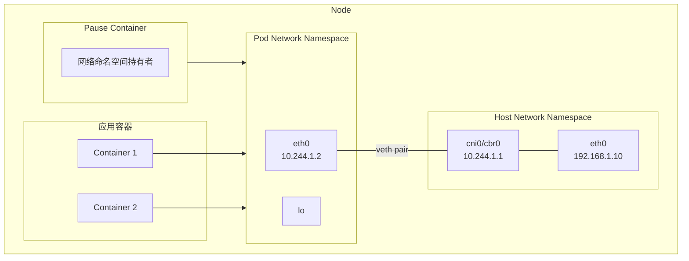
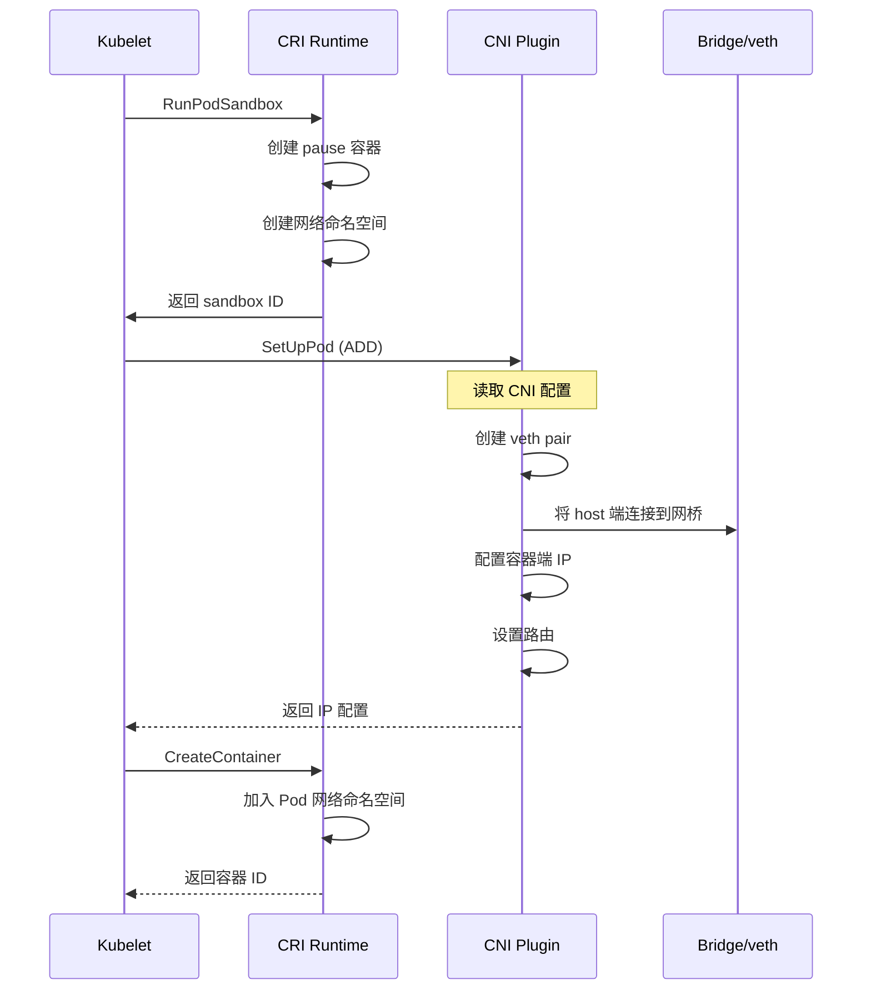
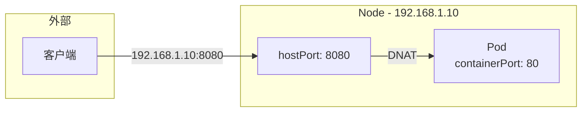
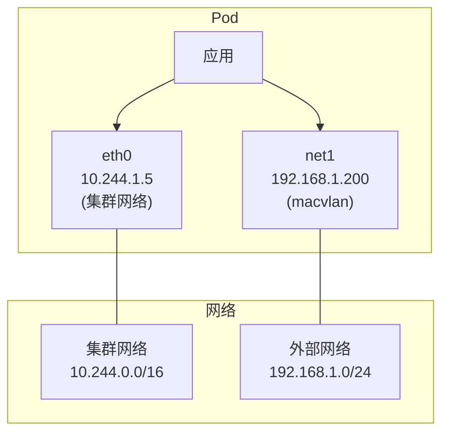

## 概述

Pod 网络是 Kubernetes 网络模型的基础。每个 Pod 拥有独立的 IP 地址和网络命名空间，Pod 内的容器共享网络栈。本章深入解析 Pod 网络的创建流程、网络命名空间机制以及常见的网络配置选项。

## Pod 网络架构

### 网络命名空间



### Pause 容器

Pause 容器是 Pod 的基础设施容器，负责持有网络命名空间：

```go
// pkg/kubelet/kuberuntime/kuberuntime_sandbox.go

// createPodSandbox 创建 Pod 沙箱
func (m *kubeGenericRuntimeManager) createPodSandbox(
    ctx context.Context,
    pod *v1.Pod,
    attempt uint32) (string, string, error) {

    // 生成沙箱配置
    podSandboxConfig, err := m.generatePodSandboxConfig(pod, attempt)
    if err != nil {
        return "", "", err
    }

    // 调用 CRI 创建沙箱
    // 这将启动 pause 容器并创建网络命名空间
    podSandBoxID, err := m.runtimeService.RunPodSandbox(
        ctx, podSandboxConfig, runtimeClassName)
    if err != nil {
        return "", "", fmt.Errorf("failed to create sandbox: %v", err)
    }

    return podSandBoxID, "", nil
}
```

Pause 容器的特点：
- 极小的镜像（约 700KB）
- 只执行 pause 系统调用
- 持有 Pod 的网络和 IPC 命名空间
- 作为 Pod 中其他容器的 init 进程

## Pod 网络创建流程

### 完整流程



### CNI 调用详情

```go
// pkg/kubelet/network/cni/cni.go

// SetUpPod 设置 Pod 网络
func (plugin *cniNetworkPlugin) SetUpPod(
    namespace string, name string,
    id kubecontainer.ContainerID,
    annotations, options map[string]string) error {

    // 检查 CNI 是否就绪
    if err := plugin.checkInitialized(); err != nil {
        return err
    }

    // 获取网络命名空间路径
    netnsPath, err := plugin.host.GetNetNS(id.ID)
    if err != nil {
        return fmt.Errorf("failed to get network namespace: %v", err)
    }

    // 构建 CNI 运行时配置
    cniConfig := plugin.buildCNIRuntimeConf(name, namespace, id, netnsPath, options)

    // 执行 CNI ADD 操作
    result, err := plugin.addToNetwork(plugin.getDefaultNetwork(), cniConfig)
    if err != nil {
        return err
    }

    // 记录 Pod IP
    klog.V(4).InfoS("Pod network configured",
        "pod", klog.KRef(namespace, name),
        "ip", result.IPs)

    return nil
}

// buildCNIRuntimeConf 构建 CNI 配置
func (plugin *cniNetworkPlugin) buildCNIRuntimeConf(
    name, namespace string,
    id kubecontainer.ContainerID,
    netnsPath string,
    options map[string]string) *libcni.RuntimeConf {

    return &libcni.RuntimeConf{
        ContainerID: id.ID,
        NetNS:       netnsPath,
        IfName:      defaultIfName, // eth0
        Args: [][2]string{
            {"IgnoreUnknown", "1"},
            {"K8S_POD_NAMESPACE", namespace},
            {"K8S_POD_NAME", name},
            {"K8S_POD_INFRA_CONTAINER_ID", id.ID},
        },
    }
}
```

### 网络命名空间操作

```go
// veth pair 创建示例
func setupVeth(netns ns.NetNS, ifName string, mtu int) (*current.Interface, *current.Interface, error) {
    hostInterface := &current.Interface{}
    containerInterface := &current.Interface{}

    err := netns.Do(func(hostNS ns.NetNS) error {
        // 在容器命名空间内创建 veth pair
        hostVeth, containerVeth, err := ip.SetupVeth(ifName, mtu, "", hostNS)
        if err != nil {
            return err
        }

        hostInterface.Name = hostVeth.Name
        hostInterface.Mac = hostVeth.HardwareAddr.String()

        containerInterface.Name = containerVeth.Name
        containerInterface.Mac = containerVeth.HardwareAddr.String()
        containerInterface.Sandbox = netns.Path()

        return nil
    })

    return hostInterface, containerInterface, err
}

// 配置容器网络接口
func configureInterface(netns ns.NetNS, ifName string, result *current.Result) error {
    return netns.Do(func(_ ns.NetNS) error {
        link, err := netlink.LinkByName(ifName)
        if err != nil {
            return err
        }

        // 配置 IP 地址
        for _, ipConfig := range result.IPs {
            addr := &netlink.Addr{
                IPNet: &ipConfig.Address,
            }
            if err := netlink.AddrAdd(link, addr); err != nil {
                return err
            }
        }

        // 配置路由
        for _, route := range result.Routes {
            rt := &netlink.Route{
                Dst:       &route.Dst,
                Gw:        route.GW,
                LinkIndex: link.Attrs().Index,
            }
            if err := netlink.RouteAdd(rt); err != nil {
                return err
            }
        }

        // 启用接口
        if err := netlink.LinkSetUp(link); err != nil {
            return err
        }

        return nil
    })
}
```

## Pod 网络配置

### hostNetwork

使用宿主机网络命名空间：

```yaml
apiVersion: v1
kind: Pod
metadata:
  name: host-network-pod
spec:
  hostNetwork: true  # 使用宿主机网络
  containers:
    - name: app
      image: nginx
      ports:
        - containerPort: 80
          hostPort: 80
```

```
hostNetwork: true 时：
- Pod 使用宿主机的网络命名空间
- Pod IP 等于 Node IP
- 不经过 CNI 配置
- 适用于系统组件（如 kube-proxy、CNI 插件）
```

### hostPort

将容器端口映射到宿主机：

```yaml
apiVersion: v1
kind: Pod
metadata:
  name: hostport-pod
spec:
  containers:
    - name: app
      image: nginx
      ports:
        - containerPort: 80
          hostPort: 8080  # 映射到宿主机 8080 端口
```



### DNS 配置

```yaml
apiVersion: v1
kind: Pod
metadata:
  name: dns-config-pod
spec:
  # DNS 策略
  dnsPolicy: ClusterFirst  # ClusterFirst | Default | ClusterFirstWithHostNet | None

  # 自定义 DNS 配置
  dnsConfig:
    nameservers:
      - 10.96.0.10
    searches:
      - my-namespace.svc.cluster.local
      - svc.cluster.local
    options:
      - name: ndots
        value: "2"

  containers:
    - name: app
      image: nginx
```

DNS 策略说明：

| 策略 | 行为 |
|------|------|
| ClusterFirst | 使用集群 DNS，不匹配则使用上游 |
| Default | 继承节点 DNS 配置 |
| ClusterFirstWithHostNet | hostNetwork 时使用集群 DNS |
| None | 忽略集群 DNS，使用 dnsConfig |

### 网络接口

```bash
# 查看 Pod 网络接口
kubectl exec my-pod -- ip addr

# 输出示例:
# 1: lo: <LOOPBACK,UP,LOWER_UP> mtu 65536
#     inet 127.0.0.1/8 scope host lo
# 3: eth0@if10: <BROADCAST,MULTICAST,UP,LOWER_UP> mtu 1450
#     inet 10.244.1.5/24 brd 10.244.1.255 scope global eth0

# 查看路由表
kubectl exec my-pod -- ip route

# 输出示例:
# default via 10.244.1.1 dev eth0
# 10.244.0.0/16 via 10.244.1.1 dev eth0
# 10.244.1.0/24 dev eth0 proto kernel scope link src 10.244.1.5
```

## 多网卡支持

### Multus CNI

```yaml
# 安装 Multus
kubectl apply -f https://raw.githubusercontent.com/k8snetworkplumbingwg/multus-cni/master/deployments/multus-daemonset.yml

# 定义额外网络
apiVersion: "k8s.cni.cncf.io/v1"
kind: NetworkAttachmentDefinition
metadata:
  name: macvlan-conf
spec:
  config: '{
    "cniVersion": "0.3.1",
    "type": "macvlan",
    "master": "eth0",
    "mode": "bridge",
    "ipam": {
      "type": "host-local",
      "subnet": "192.168.1.0/24",
      "rangeStart": "192.168.1.200",
      "rangeEnd": "192.168.1.216"
    }
  }'
---
# 使用额外网络的 Pod
apiVersion: v1
kind: Pod
metadata:
  name: multi-net-pod
  annotations:
    k8s.v1.cni.cncf.io/networks: macvlan-conf
spec:
  containers:
    - name: app
      image: nginx
```



## IPv4/IPv6 双栈

### 启用双栈

```yaml
# kubeadm 配置
apiVersion: kubeadm.k8s.io/v1beta3
kind: ClusterConfiguration
networking:
  podSubnet: "10.244.0.0/16,fd00:10:244::/48"
  serviceSubnet: "10.96.0.0/16,fd00:10:96::/112"
---
# 双栈 Service
apiVersion: v1
kind: Service
metadata:
  name: dual-stack-service
spec:
  selector:
    app: my-app
  ipFamilyPolicy: PreferDualStack  # SingleStack | PreferDualStack | RequireDualStack
  ipFamilies:
    - IPv4
    - IPv6
  ports:
    - port: 80
```

### Pod 双栈地址

```bash
# 查看 Pod 双栈地址
kubectl get pod my-pod -o jsonpath='{.status.podIPs}'

# 输出示例:
# [{"ip":"10.244.1.5"},{"ip":"fd00:10:244:1::5"}]
```

## 网络 QoS

### 带宽限制

```yaml
apiVersion: v1
kind: Pod
metadata:
  name: bandwidth-limited-pod
  annotations:
    # 入站带宽限制
    kubernetes.io/ingress-bandwidth: "10M"
    # 出站带宽限制
    kubernetes.io/egress-bandwidth: "10M"
spec:
  containers:
    - name: app
      image: nginx
```

实现原理（使用 tc）：

```bash
# CNI bandwidth 插件使用 tc 实现
# 入站使用 ingress qdisc + police
tc qdisc add dev eth0 handle ffff: ingress
tc filter add dev eth0 parent ffff: protocol ip \
   u32 match u32 0 0 police rate 10mbit burst 10k drop

# 出站使用 tbf qdisc
tc qdisc add dev eth0 root tbf rate 10mbit burst 10k latency 50ms
```

## 常见问题排查

### Pod 无法获取 IP

```bash
# 检查 CNI 插件
ls /opt/cni/bin/
ls /etc/cni/net.d/

# 查看 CNI 日志
journalctl -u kubelet | grep -i cni

# 检查节点 Pod CIDR
kubectl get node <node> -o jsonpath='{.spec.podCIDR}'
```

### Pod 网络不通

```bash
# 检查 Pod 网络接口
kubectl exec <pod> -- ip addr
kubectl exec <pod> -- ip route

# 测试连通性
kubectl exec <pod> -- ping <target-ip>
kubectl exec <pod> -- nc -zv <service> <port>

# 检查 iptables 规则
iptables-save | grep <pod-ip>

# 抓包
tcpdump -i any host <pod-ip> -nn
```

### DNS 解析失败

```bash
# 检查 DNS 配置
kubectl exec <pod> -- cat /etc/resolv.conf

# 测试 DNS
kubectl exec <pod> -- nslookup kubernetes.default

# 检查 CoreDNS
kubectl logs -n kube-system -l k8s-app=kube-dns
```

## 网络诊断工具

### 使用 netshoot

```bash
# 启动诊断 Pod
kubectl run netshoot --rm -it --image=nicolaka/netshoot -- bash

# 常用命令
# 网络探测
mtr <target>
traceroute <target>

# 抓包
tcpdump -i eth0 -nn

# 测试连接
curl -v http://service:port
nc -zv service port

# DNS 诊断
dig @10.96.0.10 kubernetes.default.svc.cluster.local
```

### ephemeralContainers 调试

```yaml
# 使用临时容器调试
kubectl debug <pod> -it --image=nicolaka/netshoot --target=<container>
```

## 总结

Pod 网络的核心要点：
- **网络命名空间**：每个 Pod 独立的网络栈
- **Pause 容器**：持有网络命名空间
- **CNI 集成**：通过 CNI 插件配置网络
- **veth pair**：连接 Pod 和主机网络

配置选项：
- hostNetwork：使用主机网络
- hostPort：端口映射
- dnsPolicy：DNS 策略
- 多网卡：Multus CNI
- 双栈：IPv4/IPv6 支持
- QoS：带宽限制
