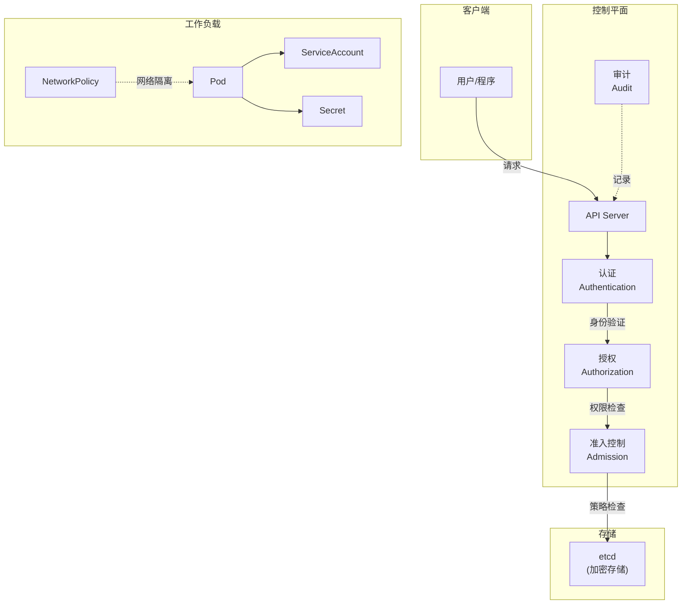
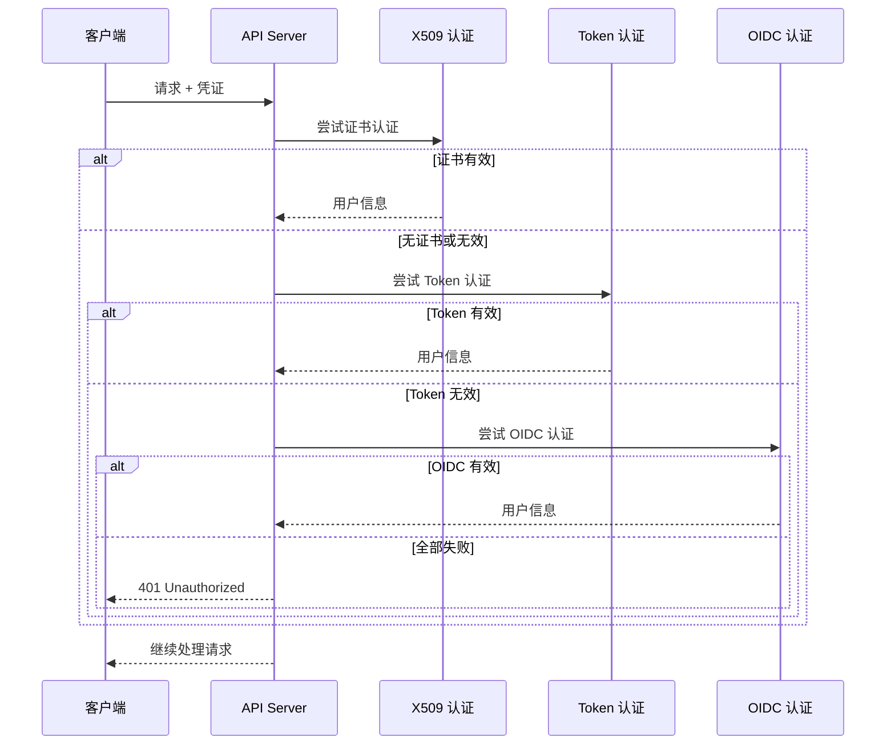
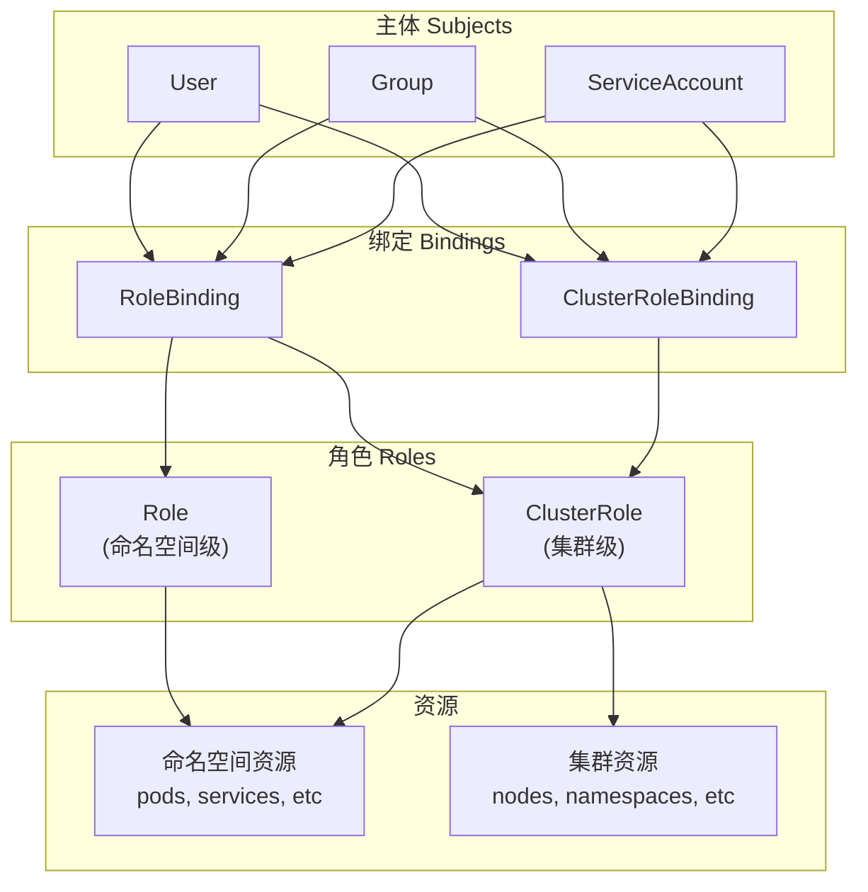
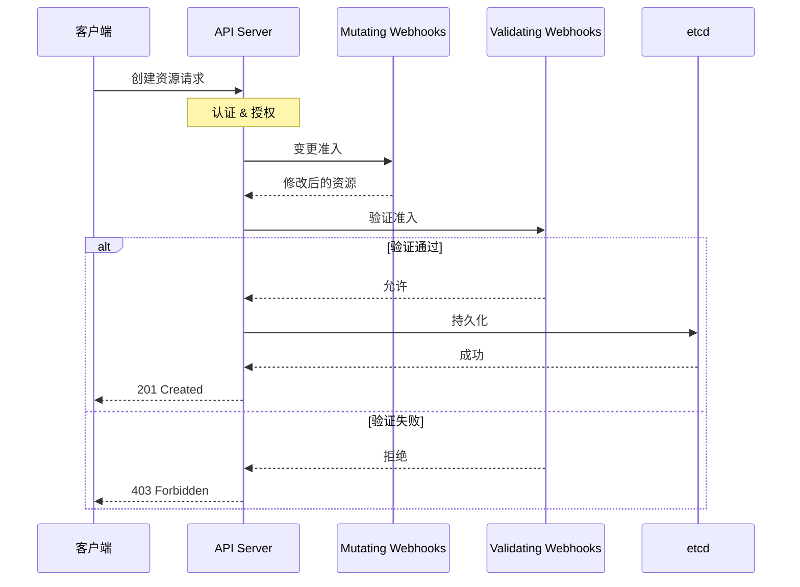
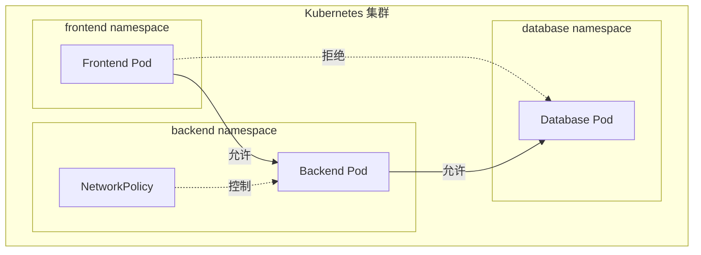

## 概述

Kubernetes 安全是一个多层次的系统工程，涉及集群基础设施、控制平面、工作负载和网络等多个维度。本章介绍 Kubernetes 安全架构的整体设计，包括认证、授权、准入控制、网络安全、Secret 管理等核心机制。

## 安全层次模型

### 4C 安全模型

```
┌─────────────────────────────────────────────────────────────────┐
│                      Cloud (云基础设施)                          │
│  ┌───────────────────────────────────────────────────────────┐  │
│  │                   Cluster (集群)                           │  │
│  │  ┌─────────────────────────────────────────────────────┐  │  │
│  │  │                Container (容器)                      │  │  │
│  │  │  ┌─────────────────────────────────────────────┐    │  │  │
│  │  │  │               Code (代码)                    │    │  │  │
│  │  │  │                                              │    │  │  │
│  │  │  │  - 应用安全                                  │    │  │  │
│  │  │  │  - 依赖安全                                  │    │  │  │
│  │  │  │  - 漏洞扫描                                  │    │  │  │
│  │  │  └─────────────────────────────────────────────┘    │  │  │
│  │  │  - 容器镜像安全                                      │  │  │
│  │  │  - 运行时安全                                        │  │  │
│  │  │  - 资源限制                                          │  │  │
│  │  └─────────────────────────────────────────────────────┘  │  │
│  │  - API Server 安全                                        │  │
│  │  - etcd 加密                                              │  │
│  │  - 网络策略                                               │  │
│  │  - RBAC                                                   │  │
│  └───────────────────────────────────────────────────────────┘  │
│  - 网络安全                                                      │
│  - IAM 权限                                                      │
│  - 节点安全                                                      │
└─────────────────────────────────────────────────────────────────┘
```

### 安全组件概览



## 认证机制

### 认证方式

| 认证方式 | 适用场景 | 配置方式 |
|----------|----------|----------|
| X509 客户端证书 | 组件间通信、管理员访问 | --client-ca-file |
| Bearer Token | ServiceAccount、外部系统 | --token-auth-file |
| Bootstrap Token | 节点加入集群 | --enable-bootstrap-token-auth |
| OIDC | 企业身份集成 | --oidc-* 参数 |
| Webhook | 外部认证系统 | --authentication-token-webhook-config-file |

### 认证流程



## 授权机制

### 授权模式

```
┌─────────────────────────────────────────────────────────────────┐
│                      授权模式                                    │
├─────────────────────────────────────────────────────────────────┤
│                                                                  │
│  RBAC (Role-Based Access Control)                               │
│  ├── 最常用的授权模式                                            │
│  ├── 基于角色的权限控制                                          │
│  └── Role/ClusterRole + RoleBinding/ClusterRoleBinding          │
│                                                                  │
│  ABAC (Attribute-Based Access Control)                          │
│  ├── 基于属性的访问控制                                          │
│  ├── 策略文件定义                                                │
│  └── 较少使用，灵活但复杂                                        │
│                                                                  │
│  Node                                                            │
│  ├── 专门用于 Kubelet 的授权                                     │
│  └── 限制节点只能访问其上运行的 Pod 相关资源                      │
│                                                                  │
│  Webhook                                                         │
│  ├── 外部授权服务                                                │
│  └── 通过 HTTP 回调进行授权决策                                  │
│                                                                  │
│  AlwaysAllow / AlwaysDeny                                       │
│  └── 测试用途                                                    │
│                                                                  │
└─────────────────────────────────────────────────────────────────┘
```

### RBAC 模型



## 准入控制

### 准入控制器类型

```yaml
# 内置准入控制器（部分）
- NamespaceLifecycle      # 命名空间生命周期
- LimitRanger             # 资源限制
- ServiceAccount          # ServiceAccount 自动注入
- DefaultStorageClass     # 默认存储类
- ResourceQuota           # 资源配额
- PodSecurity             # Pod 安全标准
- NodeRestriction         # 节点权限限制
- MutatingAdmissionWebhook   # 变更 Webhook
- ValidatingAdmissionWebhook # 验证 Webhook
```

### 准入控制流程



## Pod 安全

### Pod Security Standards

```
┌─────────────────────────────────────────────────────────────────┐
│                   Pod 安全标准                                   │
├─────────────────────────────────────────────────────────────────┤
│                                                                  │
│  Privileged (特权)                                              │
│  ├── 无限制策略                                                  │
│  ├── 允许所有特权操作                                            │
│  └── 适用于系统组件                                              │
│                                                                  │
│  Baseline (基线)                                                 │
│  ├── 最小限制策略                                                │
│  ├── 阻止已知特权升级                                            │
│  └── 适用于大多数工作负载                                        │
│                                                                  │
│  Restricted (限制)                                               │
│  ├── 严格限制策略                                                │
│  ├── 当前 Pod 加固最佳实践                                       │
│  └── 适用于安全敏感应用                                          │
│                                                                  │
└─────────────────────────────────────────────────────────────────┘
```

### 安全上下文

```yaml
apiVersion: v1
kind: Pod
metadata:
  name: security-context-demo
spec:
  securityContext:
    # Pod 级别安全上下文
    runAsUser: 1000
    runAsGroup: 3000
    fsGroup: 2000
    runAsNonRoot: true

  containers:
    - name: app
      image: nginx
      securityContext:
        # 容器级别安全上下文
        allowPrivilegeEscalation: false
        readOnlyRootFilesystem: true
        capabilities:
          drop:
            - ALL
          add:
            - NET_BIND_SERVICE
        seccompProfile:
          type: RuntimeDefault
```

## 网络安全

### 网络隔离



### TLS 加密

```
组件间 TLS 通信:

┌──────────────────────────────────────────────────────────────────┐
│                                                                   │
│  kubectl ──TLS──► API Server ──TLS──► etcd                       │
│                        │                                          │
│                        ├──TLS──► Controller Manager               │
│                        ├──TLS──► Scheduler                        │
│                        └──TLS──► Kubelet ──TLS──► Container Runtime│
│                                                                   │
└──────────────────────────────────────────────────────────────────┘
```

## Secret 管理

### Secret 类型

| 类型 | 用途 |
|------|------|
| Opaque | 通用密钥数据 |
| kubernetes.io/tls | TLS 证书 |
| kubernetes.io/dockerconfigjson | Docker 仓库认证 |
| kubernetes.io/service-account-token | ServiceAccount Token |
| kubernetes.io/basic-auth | 基本认证 |
| kubernetes.io/ssh-auth | SSH 认证 |

### Secret 保护

```yaml
# etcd 加密配置
apiVersion: apiserver.config.k8s.io/v1
kind: EncryptionConfiguration
resources:
  - resources:
      - secrets
    providers:
      - aescbc:
          keys:
            - name: key1
              secret: <base64-encoded-key>
      - identity: {}
```

## 审计日志

### 审计策略

```yaml
apiVersion: audit.k8s.io/v1
kind: Policy
rules:
  # 不记录只读请求
  - level: None
    verbs: ["get", "list", "watch"]

  # 记录 Secret 操作的完整请求和响应
  - level: RequestResponse
    resources:
      - group: ""
        resources: ["secrets"]

  # 记录其他资源的元数据
  - level: Metadata
    omitStages:
      - RequestReceived
```

### 审计级别

| 级别 | 记录内容 |
|------|----------|
| None | 不记录 |
| Metadata | 请求元数据（用户、时间、资源等） |
| Request | 元数据 + 请求体 |
| RequestResponse | 元数据 + 请求体 + 响应体 |

## 安全最佳实践

### 控制平面安全

```
1. API Server
   ├── 启用 RBAC
   ├── 禁用匿名访问
   ├── 启用审计日志
   └── 使用 TLS

2. etcd
   ├── 启用 TLS 加密通信
   ├── 启用静态加密
   ├── 限制访问权限
   └── 定期备份

3. Controller Manager / Scheduler
   ├── 使用专用 ServiceAccount
   └── 最小权限原则
```

### 工作负载安全

```yaml
# Pod 安全最佳实践
apiVersion: v1
kind: Pod
spec:
  # 使用非 root 用户
  securityContext:
    runAsNonRoot: true
    runAsUser: 1000

  containers:
    - name: app
      # 使用安全镜像
      image: myapp:v1.0.0@sha256:abc123...

      securityContext:
        # 禁止特权升级
        allowPrivilegeEscalation: false
        # 只读文件系统
        readOnlyRootFilesystem: true
        # 移除所有 capabilities
        capabilities:
          drop: ["ALL"]

      # 资源限制
      resources:
        limits:
          cpu: "1"
          memory: "512Mi"
        requests:
          cpu: "100m"
          memory: "128Mi"
```

### 网络安全

```yaml
# 默认拒绝所有流量
apiVersion: networking.k8s.io/v1
kind: NetworkPolicy
metadata:
  name: default-deny-all
spec:
  podSelector: {}
  policyTypes:
    - Ingress
    - Egress
---
# 只允许必要的通信
apiVersion: networking.k8s.io/v1
kind: NetworkPolicy
metadata:
  name: allow-specific
spec:
  podSelector:
    matchLabels:
      app: backend
  ingress:
    - from:
        - podSelector:
            matchLabels:
              app: frontend
      ports:
        - port: 8080
```

## 总结

Kubernetes 安全涉及多个层面：

**认证 (Authentication)**
- 验证用户/服务身份
- 支持多种认证方式

**授权 (Authorization)**
- RBAC 最常用
- 最小权限原则

**准入控制 (Admission)**
- 变更和验证请求
- 强制执行策略

**Pod 安全**
- Pod Security Standards
- 安全上下文配置

**网络安全**
- NetworkPolicy 隔离
- TLS 加密通信

**数据保护**
- Secret 管理
- etcd 加密

**审计**
- 记录所有操作
- 合规性要求
