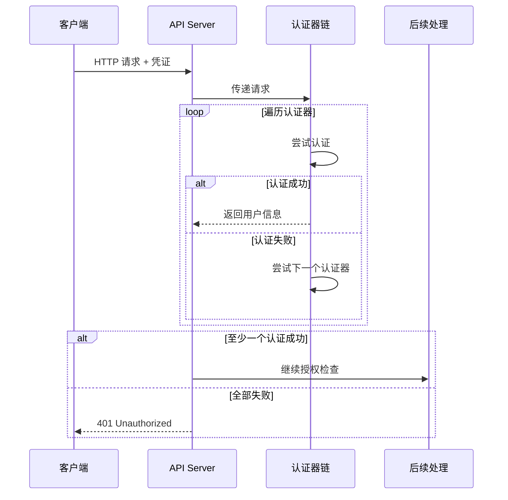
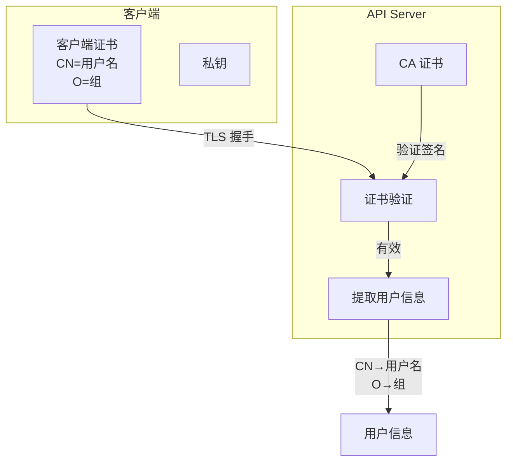
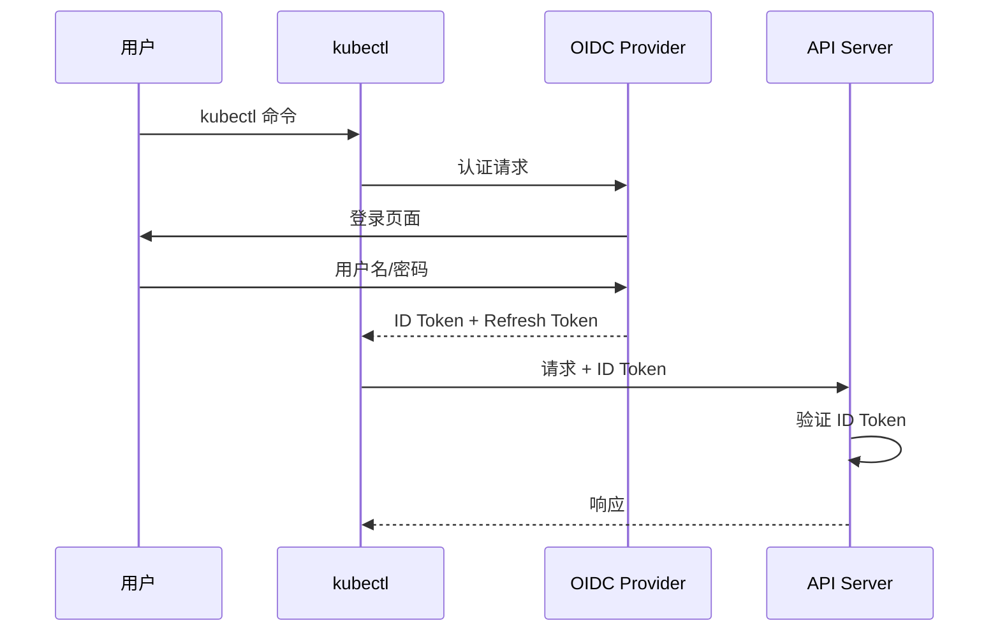

## 概述

认证（Authentication）是 Kubernetes 安全的第一道防线，负责验证请求者的身份。Kubernetes 支持多种认证方式，可以同时启用多个认证器，请求会依次尝试每个认证器直到认证成功或全部失败。

## 认证架构

### 认证流程



### 用户信息结构

```go
// staging/src/k8s.io/apiserver/pkg/authentication/user/user.go

// Info 用户信息接口
type Info interface {
    // GetName 返回用户名
    GetName() string

    // GetUID 返回用户唯一标识
    GetUID() string

    // GetGroups 返回用户所属组
    GetGroups() []string

    // GetExtra 返回额外信息
    GetExtra() map[string][]string
}

// DefaultInfo 默认实现
type DefaultInfo struct {
    Name   string
    UID    string
    Groups []string
    Extra  map[string][]string
}
```

## X509 客户端证书认证

### 工作原理



### 配置方式

```bash
# API Server 配置
kube-apiserver \
  --client-ca-file=/etc/kubernetes/pki/ca.crt \
  --tls-cert-file=/etc/kubernetes/pki/apiserver.crt \
  --tls-private-key-file=/etc/kubernetes/pki/apiserver.key
```

### 生成客户端证书

```bash
# 1. 生成私钥
openssl genrsa -out admin.key 2048

# 2. 生成证书签名请求（CSR）
# CN=用户名, O=组
openssl req -new -key admin.key -out admin.csr \
  -subj "/CN=admin/O=system:masters"

# 3. 使用 CA 签发证书
openssl x509 -req -in admin.csr -out admin.crt \
  -CA /etc/kubernetes/pki/ca.crt \
  -CAkey /etc/kubernetes/pki/ca.key \
  -CAcreateserial -days 365

# 4. 配置 kubeconfig
kubectl config set-credentials admin \
  --client-certificate=admin.crt \
  --client-key=admin.key
```

### CertificateSigningRequest

```yaml
# 使用 Kubernetes API 签发证书
apiVersion: certificates.k8s.io/v1
kind: CertificateSigningRequest
metadata:
  name: my-user-csr
spec:
  request: <base64-encoded-csr>
  signerName: kubernetes.io/kube-apiserver-client
  usages:
    - client auth
```

```bash
# 批准 CSR
kubectl certificate approve my-user-csr

# 获取签发的证书
kubectl get csr my-user-csr -o jsonpath='{.status.certificate}' | base64 -d
```

## ServiceAccount Token 认证

### Token 类型演进

```
┌─────────────────────────────────────────────────────────────────┐
│                ServiceAccount Token 演进                         │
├─────────────────────────────────────────────────────────────────┤
│                                                                  │
│  传统 Token (已废弃)                                             │
│  ├── 存储在 Secret 中                                            │
│  ├── 永不过期                                                    │
│  └── 手动创建和管理                                              │
│                                                                  │
│  Bound Token (推荐)                                              │
│  ├── 通过 TokenRequest API 动态创建                              │
│  ├── 有过期时间                                                  │
│  ├── 绑定到特定 Pod                                              │
│  └── 自动轮换                                                    │
│                                                                  │
└─────────────────────────────────────────────────────────────────┘
```

### Bound ServiceAccount Token

```yaml
# Pod 自动挂载的 Token
apiVersion: v1
kind: Pod
metadata:
  name: my-pod
spec:
  serviceAccountName: my-sa
  containers:
    - name: app
      image: myapp
      volumeMounts:
        - name: kube-api-access
          mountPath: /var/run/secrets/kubernetes.io/serviceaccount
          readOnly: true
  volumes:
    - name: kube-api-access
      projected:
        sources:
          - serviceAccountToken:
              path: token
              expirationSeconds: 3600  # 1 小时过期
              audience: https://kubernetes.default.svc
          - configMap:
              name: kube-root-ca.crt
              items:
                - key: ca.crt
                  path: ca.crt
          - downwardAPI:
              items:
                - path: namespace
                  fieldRef:
                    fieldPath: metadata.namespace
```

### TokenRequest API

```go
// 使用 TokenRequest API 获取 Token
func getServiceAccountToken(ctx context.Context, clientset *kubernetes.Clientset) (string, error) {
    tokenRequest := &authenticationv1.TokenRequest{
        Spec: authenticationv1.TokenRequestSpec{
            // 受众
            Audiences: []string{"https://kubernetes.default.svc"},
            // 过期时间（秒）
            ExpirationSeconds: ptr.To(int64(3600)),
            // 绑定到 Pod（可选）
            BoundObjectRef: &authenticationv1.BoundObjectReference{
                Kind:       "Pod",
                Name:       "my-pod",
                UID:        "pod-uid",
            },
        },
    }

    result, err := clientset.CoreV1().ServiceAccounts("default").
        CreateToken(ctx, "my-sa", tokenRequest, metav1.CreateOptions{})
    if err != nil {
        return "", err
    }

    return result.Status.Token, nil
}
```

### Token 验证

```go
// staging/src/k8s.io/apiserver/pkg/authentication/token/tokenfile/tokenfile.go

// ServiceAccountTokenAuthenticator 验证 ServiceAccount Token
type ServiceAccountTokenAuthenticator struct {
    // JWT 验证器
    jwtValidator *validator.Validator
    // 服务账号查询
    getter       serviceAccountGetter
}

func (a *ServiceAccountTokenAuthenticator) AuthenticateToken(ctx context.Context, token string) (*authenticator.Response, bool, error) {
    // 1. 解析和验证 JWT
    claims, err := a.jwtValidator.Validate(token)
    if err != nil {
        return nil, false, nil
    }

    // 2. 验证 ServiceAccount 是否存在
    sa, err := a.getter.GetServiceAccount(claims.Namespace, claims.ServiceAccountName)
    if err != nil {
        return nil, false, err
    }

    // 3. 构建用户信息
    return &authenticator.Response{
        User: &user.DefaultInfo{
            Name:   fmt.Sprintf("system:serviceaccount:%s:%s", sa.Namespace, sa.Name),
            UID:    string(sa.UID),
            Groups: []string{
                "system:serviceaccounts",
                fmt.Sprintf("system:serviceaccounts:%s", sa.Namespace),
            },
        },
    }, true, nil
}
```

## OIDC 认证

### OIDC 流程



### API Server 配置

```bash
kube-apiserver \
  # OIDC Provider URL
  --oidc-issuer-url=https://accounts.google.com \
  # 客户端 ID
  --oidc-client-id=my-kubernetes-cluster \
  # 用户名声明
  --oidc-username-claim=email \
  # 用户名前缀
  --oidc-username-prefix="oidc:" \
  # 组声明
  --oidc-groups-claim=groups \
  # 组前缀
  --oidc-groups-prefix="oidc:" \
  # CA 证书（可选）
  --oidc-ca-file=/etc/kubernetes/pki/oidc-ca.crt
```

### kubeconfig 配置

```yaml
apiVersion: v1
kind: Config
users:
  - name: oidc-user
    user:
      auth-provider:
        name: oidc
        config:
          idp-issuer-url: https://accounts.google.com
          client-id: my-kubernetes-cluster
          client-secret: <client-secret>
          refresh-token: <refresh-token>
          id-token: <id-token>
```

### 使用 kubelogin

```bash
# 安装 kubelogin
kubectl krew install oidc-login

# 配置 kubeconfig
kubectl config set-credentials oidc-user \
  --exec-api-version=client.authentication.k8s.io/v1beta1 \
  --exec-command=kubectl \
  --exec-arg=oidc-login \
  --exec-arg=get-token \
  --exec-arg=--oidc-issuer-url=https://accounts.google.com \
  --exec-arg=--oidc-client-id=my-kubernetes-cluster \
  --exec-arg=--oidc-client-secret=<secret>
```

## Webhook Token 认证

### 配置文件

```yaml
# webhook-config.yaml
apiVersion: v1
kind: Config
clusters:
  - name: auth-webhook
    cluster:
      server: https://auth.example.com/authenticate
      certificate-authority: /etc/kubernetes/pki/webhook-ca.crt
users:
  - name: api-server
    user:
      client-certificate: /etc/kubernetes/pki/apiserver-webhook-client.crt
      client-key: /etc/kubernetes/pki/apiserver-webhook-client.key
current-context: webhook
contexts:
  - context:
      cluster: auth-webhook
      user: api-server
    name: webhook
```

```bash
# API Server 配置
kube-apiserver \
  --authentication-token-webhook-config-file=/etc/kubernetes/webhook-config.yaml \
  --authentication-token-webhook-cache-ttl=5m
```

### Webhook 请求/响应

```go
// Webhook 请求
type TokenReview struct {
    APIVersion string `json:"apiVersion"` // "authentication.k8s.io/v1"
    Kind       string `json:"kind"`       // "TokenReview"
    Spec       TokenReviewSpec `json:"spec"`
}

type TokenReviewSpec struct {
    Token     string   `json:"token"`
    Audiences []string `json:"audiences,omitempty"`
}

// Webhook 响应
type TokenReviewStatus struct {
    Authenticated bool     `json:"authenticated"`
    User          UserInfo `json:"user,omitempty"`
    Error         string   `json:"error,omitempty"`
}

type UserInfo struct {
    Username string              `json:"username"`
    UID      string              `json:"uid,omitempty"`
    Groups   []string            `json:"groups,omitempty"`
    Extra    map[string][]string `json:"extra,omitempty"`
}
```

### Webhook 服务示例

```go
func handleTokenReview(w http.ResponseWriter, r *http.Request) {
    var review authv1.TokenReview
    if err := json.NewDecoder(r.Body).Decode(&review); err != nil {
        http.Error(w, err.Error(), http.StatusBadRequest)
        return
    }

    // 验证 Token
    user, authenticated, err := validateToken(review.Spec.Token)

    // 构建响应
    review.Status = authv1.TokenReviewStatus{
        Authenticated: authenticated,
    }

    if authenticated {
        review.Status.User = authv1.UserInfo{
            Username: user.Name,
            UID:      user.UID,
            Groups:   user.Groups,
        }
    } else if err != nil {
        review.Status.Error = err.Error()
    }

    json.NewEncoder(w).Encode(review)
}
```

## Bootstrap Token

### 用途

```
Bootstrap Token 用于：
1. 节点加入集群时的初始认证
2. kubeadm join 过程
3. 临时访问令牌
```

### Token 格式

```
格式: [a-z0-9]{6}.[a-z0-9]{16}
示例: abcdef.0123456789abcdef

结构:
- Token ID: abcdef (6 字符)
- Token Secret: 0123456789abcdef (16 字符)
```

### 创建 Bootstrap Token

```yaml
# bootstrap-token-secret.yaml
apiVersion: v1
kind: Secret
metadata:
  name: bootstrap-token-abcdef
  namespace: kube-system
type: bootstrap.kubernetes.io/token
stringData:
  # Token ID
  token-id: abcdef
  # Token Secret
  token-secret: "0123456789abcdef"
  # 过期时间
  expiration: "2024-12-31T23:59:59Z"
  # 允许用于认证
  usage-bootstrap-authentication: "true"
  # 允许用于签名
  usage-bootstrap-signing: "true"
  # 关联的组
  auth-extra-groups: system:bootstrappers:kubeadm:default-node-token
```

```bash
# 使用 kubeadm 创建
kubeadm token create --ttl 24h

# 列出 Token
kubeadm token list
```

## 匿名认证

### 配置

```bash
# 启用/禁用匿名认证
kube-apiserver \
  --anonymous-auth=true  # 默认启用
```

### 匿名用户

```
匿名认证用于未提供凭证的请求：
- 用户名: system:anonymous
- 组: system:unauthenticated

通常配合 RBAC 限制匿名访问范围
```

## 认证器实现

### 认证器接口

```go
// staging/src/k8s.io/apiserver/pkg/authentication/authenticator/interfaces.go

// Token 认证器
type Token interface {
    AuthenticateToken(ctx context.Context, token string) (*Response, bool, error)
}

// Request 认证器
type Request interface {
    AuthenticateRequest(req *http.Request) (*Response, bool, error)
}

// Response 认证响应
type Response struct {
    User      user.Info
    Audiences Audiences
}
```

### 认证链

```go
// staging/src/k8s.io/apiserver/pkg/authentication/request/union/union.go

// unionAuthRequestHandler 认证链
type unionAuthRequestHandler struct {
    Handlers []authenticator.Request
}

func (authHandler *unionAuthRequestHandler) AuthenticateRequest(req *http.Request) (*authenticator.Response, bool, error) {
    var errlist []error

    // 遍历所有认证器
    for _, handler := range authHandler.Handlers {
        resp, ok, err := handler.AuthenticateRequest(req)
        if err != nil {
            errlist = append(errlist, err)
            continue
        }

        // 认证成功
        if ok {
            return resp, true, nil
        }
    }

    // 全部失败
    return nil, false, utilerrors.NewAggregate(errlist)
}
```

## 总结

Kubernetes 认证机制的要点：

**多种认证方式**
- X509 客户端证书：适用于组件和管理员
- ServiceAccount Token：适用于 Pod 内应用
- OIDC：适用于企业身份集成
- Webhook：适用于外部认证系统

**最佳实践**
- 使用 Bound ServiceAccount Token
- 配置 Token 过期时间
- 启用 OIDC 集成企业身份
- 禁用不需要的认证方式
- 定期轮换证书和 Token
