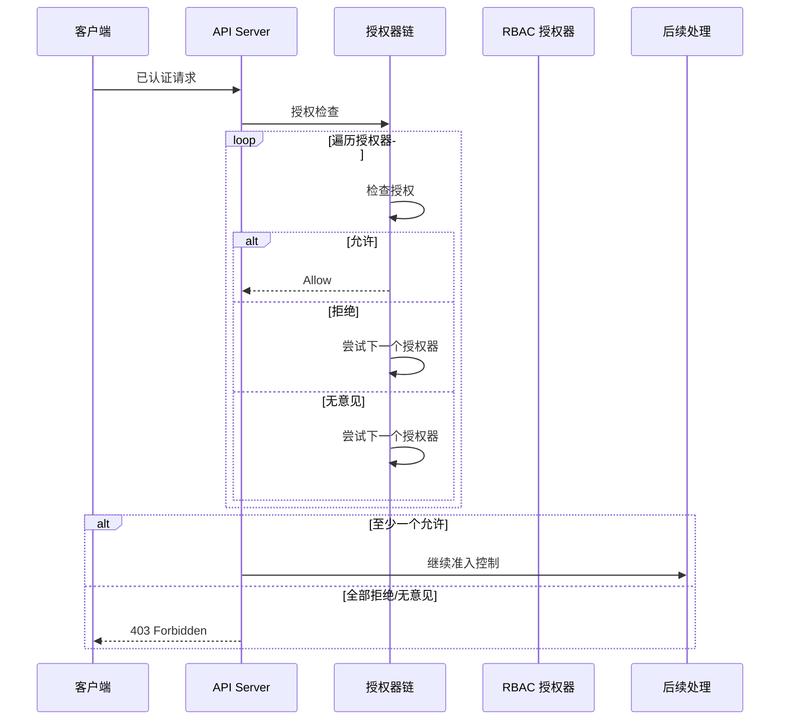
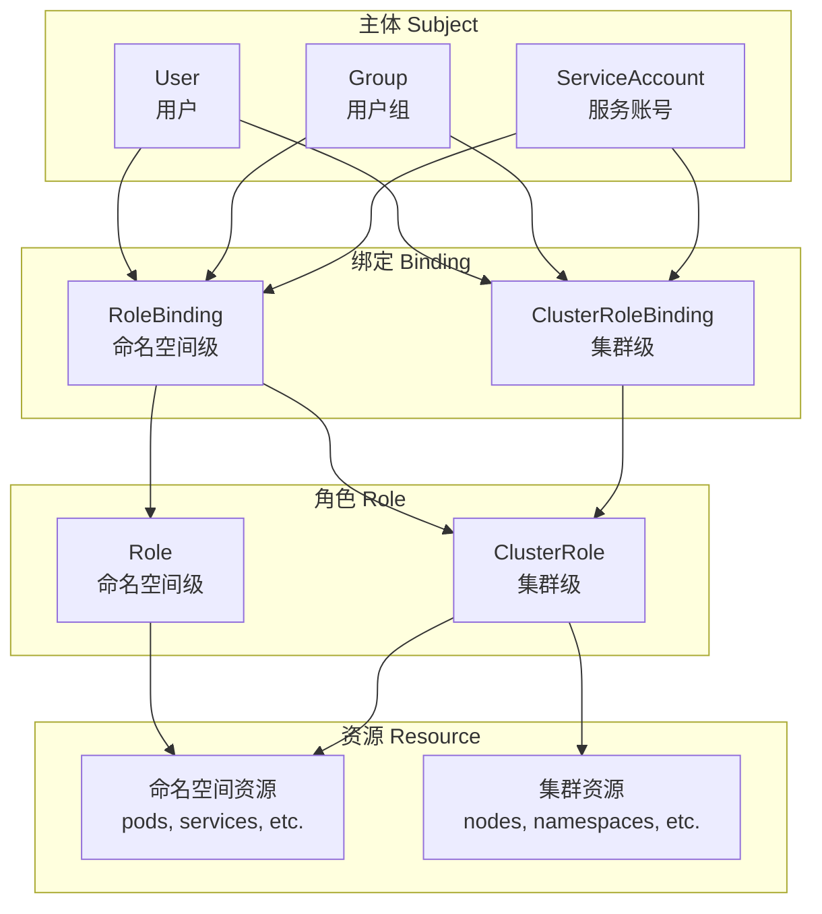

## 概述

授权（Authorization）是 Kubernetes 安全的第二道防线，在认证通过后决定用户是否有权执行特定操作。Kubernetes 支持多种授权模式，其中 RBAC（基于角色的访问控制）是最常用的方式。

## 授权架构

### 授权流程



### 授权接口

```go
// staging/src/k8s.io/apiserver/pkg/authorization/authorizer/interfaces.go

// Authorizer 授权器接口
type Authorizer interface {
    Authorize(ctx context.Context, a Attributes) (Decision, string, error)
}

// Decision 授权决策
type Decision int

const (
    // DecisionDeny 拒绝
    DecisionDeny Decision = iota
    // DecisionAllow 允许
    DecisionAllow
    // DecisionNoOpinion 无意见（交给下一个授权器）
    DecisionNoOpinion
)

// Attributes 请求属性
type Attributes interface {
    // 用户信息
    GetUser() user.Info

    // 动词: get, list, create, update, patch, delete, watch, proxy
    GetVerb() string

    // 资源信息
    GetNamespace() string
    GetResource() string
    GetSubresource() string
    GetName() string
    GetAPIGroup() string
    GetAPIVersion() string

    // 是否是资源请求
    IsResourceRequest() bool

    // 非资源请求的路径
    GetPath() string
}
```

## RBAC 授权

### RBAC 模型



### Role 与 ClusterRole

```yaml
# Role - 命名空间级角色
apiVersion: rbac.authorization.k8s.io/v1
kind: Role
metadata:
  namespace: default
  name: pod-reader
rules:
  # 允许读取 pods
  - apiGroups: [""]
    resources: ["pods"]
    verbs: ["get", "list", "watch"]
  # 允许读取 pod 日志
  - apiGroups: [""]
    resources: ["pods/log"]
    verbs: ["get"]
---
# ClusterRole - 集群级角色
apiVersion: rbac.authorization.k8s.io/v1
kind: ClusterRole
metadata:
  name: secret-reader
rules:
  # 允许读取所有命名空间的 secrets
  - apiGroups: [""]
    resources: ["secrets"]
    verbs: ["get", "list", "watch"]
  # 允许读取节点信息
  - apiGroups: [""]
    resources: ["nodes"]
    verbs: ["get", "list", "watch"]
```

### 规则定义

```go
// staging/src/k8s.io/api/rbac/v1/types.go

// PolicyRule 策略规则
type PolicyRule struct {
    // Verbs 操作动词
    // 支持: get, list, watch, create, update, patch, delete, deletecollection
    // 特殊: * 表示所有操作
    Verbs []string `json:"verbs"`

    // APIGroups API 组
    // "" 表示核心 API 组
    // "*" 表示所有 API 组
    APIGroups []string `json:"apiGroups,omitempty"`

    // Resources 资源类型
    // 如: pods, services, deployments
    // 子资源: pods/log, pods/exec
    Resources []string `json:"resources,omitempty"`

    // ResourceNames 资源名称（可选）
    // 限制只能访问特定名称的资源
    ResourceNames []string `json:"resourceNames,omitempty"`

    // NonResourceURLs 非资源 URL（仅 ClusterRole）
    // 如: /healthz, /api, /apis
    NonResourceURLs []string `json:"nonResourceURLs,omitempty"`
}
```

### RoleBinding 与 ClusterRoleBinding

```yaml
# RoleBinding - 命名空间级绑定
apiVersion: rbac.authorization.k8s.io/v1
kind: RoleBinding
metadata:
  name: read-pods
  namespace: default
subjects:
  # 绑定到用户
  - kind: User
    name: jane
    apiGroup: rbac.authorization.k8s.io
  # 绑定到用户组
  - kind: Group
    name: developers
    apiGroup: rbac.authorization.k8s.io
  # 绑定到 ServiceAccount
  - kind: ServiceAccount
    name: default
    namespace: kube-system
roleRef:
  kind: Role
  name: pod-reader
  apiGroup: rbac.authorization.k8s.io
---
# ClusterRoleBinding - 集群级绑定
apiVersion: rbac.authorization.k8s.io/v1
kind: ClusterRoleBinding
metadata:
  name: read-secrets-global
subjects:
  - kind: Group
    name: managers
    apiGroup: rbac.authorization.k8s.io
roleRef:
  kind: ClusterRole
  name: secret-reader
  apiGroup: rbac.authorization.k8s.io
```

### 绑定组合方式

```
绑定方式:

1. RoleBinding → Role
   - 仅在 RoleBinding 所在命名空间有效
   - 适用于命名空间级权限

2. RoleBinding → ClusterRole
   - ClusterRole 权限限定在 RoleBinding 命名空间
   - 复用 ClusterRole 定义，限定作用域

3. ClusterRoleBinding → ClusterRole
   - 集群范围有效
   - 适用于集群管理员、全局只读等
```

## RBAC 授权器实现

### 授权逻辑

```go
// plugin/pkg/auth/authorizer/rbac/rbac.go

type RBACAuthorizer struct {
    authorizationRuleResolver RequestToRuleMapper
}

func (r *RBACAuthorizer) Authorize(ctx context.Context, requestAttributes authorizer.Attributes) (authorizer.Decision, string, error) {
    // 获取适用的规则
    ruleCheckingVisitor := &authorizingVisitor{requestAttributes: requestAttributes}

    // 遍历用户的所有角色绑定，检查是否有匹配的规则
    r.authorizationRuleResolver.VisitRulesFor(
        requestAttributes.GetUser(),
        requestAttributes.GetNamespace(),
        ruleCheckingVisitor.visit,
    )

    if ruleCheckingVisitor.allowed {
        return authorizer.DecisionAllow, ruleCheckingVisitor.reason, nil
    }

    return authorizer.DecisionNoOpinion, "", nil
}

// 规则匹配检查
func (v *authorizingVisitor) visit(source fmt.Stringer, rule *rbacv1.PolicyRule, err error) bool {
    if err != nil {
        return true // 继续检查
    }

    if RuleAllows(v.requestAttributes, rule) {
        v.allowed = true
        v.reason = fmt.Sprintf("RBAC: allowed by %s", source.String())
        return false // 停止检查
    }

    return true // 继续检查
}
```

### 规则匹配

```go
// plugin/pkg/auth/authorizer/rbac/rbac.go

// RuleAllows 检查规则是否允许请求
func RuleAllows(requestAttributes authorizer.Attributes, rule *rbacv1.PolicyRule) bool {
    if requestAttributes.IsResourceRequest() {
        // 资源请求匹配
        combinedResource := requestAttributes.GetResource()
        if len(requestAttributes.GetSubresource()) > 0 {
            combinedResource = requestAttributes.GetResource() + "/" + requestAttributes.GetSubresource()
        }

        return VerbMatches(rule, requestAttributes.GetVerb()) &&
            APIGroupMatches(rule, requestAttributes.GetAPIGroup()) &&
            ResourceMatches(rule, combinedResource, requestAttributes.GetSubresource()) &&
            ResourceNameMatches(rule, requestAttributes.GetName())
    }

    // 非资源请求匹配
    return VerbMatches(rule, requestAttributes.GetVerb()) &&
        NonResourceURLMatches(rule, requestAttributes.GetPath())
}

// VerbMatches 动词匹配
func VerbMatches(rule *rbacv1.PolicyRule, requestedVerb string) bool {
    for _, ruleVerb := range rule.Verbs {
        if ruleVerb == rbacv1.VerbAll || ruleVerb == requestedVerb {
            return true
        }
    }
    return false
}
```

## 聚合 ClusterRole

### 聚合规则

```yaml
# 聚合 ClusterRole
apiVersion: rbac.authorization.k8s.io/v1
kind: ClusterRole
metadata:
  name: monitoring
  labels:
    rbac.example.com/aggregate-to-monitoring: "true"
aggregationRule:
  clusterRoleSelectors:
    - matchLabels:
        rbac.example.com/aggregate-to-monitoring: "true"
rules: []  # 控制器自动填充
---
# 被聚合的 ClusterRole
apiVersion: rbac.authorization.k8s.io/v1
kind: ClusterRole
metadata:
  name: monitoring-endpoints
  labels:
    rbac.example.com/aggregate-to-monitoring: "true"
rules:
  - apiGroups: [""]
    resources: ["endpoints", "pods", "services"]
    verbs: ["get", "list", "watch"]
```

### 内置聚合角色

```yaml
# admin 角色聚合
apiVersion: rbac.authorization.k8s.io/v1
kind: ClusterRole
metadata:
  name: admin
  labels:
    kubernetes.io/bootstrapping: rbac-defaults
aggregationRule:
  clusterRoleSelectors:
    - matchLabels:
        rbac.authorization.k8s.io/aggregate-to-admin: "true"

# edit 角色聚合
apiVersion: rbac.authorization.k8s.io/v1
kind: ClusterRole
metadata:
  name: edit
aggregationRule:
  clusterRoleSelectors:
    - matchLabels:
        rbac.authorization.k8s.io/aggregate-to-edit: "true"

# view 角色聚合
apiVersion: rbac.authorization.k8s.io/v1
kind: ClusterRole
metadata:
  name: view
aggregationRule:
  clusterRoleSelectors:
    - matchLabels:
        rbac.authorization.k8s.io/aggregate-to-view: "true"
```

## 其他授权模式

### Node 授权

```go
// plugin/pkg/auth/authorizer/node/node_authorizer.go

// NodeAuthorizer 节点授权器
type NodeAuthorizer struct {
    graph      *Graph
    identifier nodeidentifier.NodeIdentifier
}

func (r *NodeAuthorizer) Authorize(ctx context.Context, attrs authorizer.Attributes) (authorizer.Decision, string, error) {
    // 检查是否是节点身份
    nodeName, isNode := r.identifier.NodeIdentity(attrs.GetUser())
    if !isNode {
        return authorizer.DecisionNoOpinion, "", nil
    }

    // 检查节点请求的资源是否与该节点相关
    if attrs.IsResourceRequest() {
        switch attrs.GetResource() {
        case "configmaps", "secrets", "persistentvolumeclaims":
            // 检查是否是该节点上 Pod 使用的资源
            return r.authorizeReadNamespacedObject(nodeName, attrs)
        case "pods":
            // 检查是否是该节点上的 Pod
            return r.authorizePod(nodeName, attrs)
        }
    }

    return authorizer.DecisionNoOpinion, "", nil
}
```

### ABAC 授权

```json
// ABAC 策略文件格式
{
  "apiVersion": "abac.authorization.kubernetes.io/v1beta1",
  "kind": "Policy",
  "spec": {
    "user": "alice",
    "namespace": "*",
    "resource": "pods",
    "apiGroup": "*",
    "readonly": true
  }
}
```

### Webhook 授权

```yaml
# Webhook 配置
apiVersion: v1
kind: Config
clusters:
  - name: authz-webhook
    cluster:
      server: https://authz.example.com/authorize
      certificate-authority: /etc/kubernetes/pki/webhook-ca.crt
users:
  - name: api-server
    user:
      client-certificate: /etc/kubernetes/pki/apiserver-webhook.crt
      client-key: /etc/kubernetes/pki/apiserver-webhook.key
current-context: webhook
contexts:
  - context:
      cluster: authz-webhook
      user: api-server
    name: webhook
```

```go
// Webhook 请求/响应
type SubjectAccessReview struct {
    Spec   SubjectAccessReviewSpec   `json:"spec"`
    Status SubjectAccessReviewStatus `json:"status"`
}

type SubjectAccessReviewSpec struct {
    User   string              `json:"user"`
    Groups []string            `json:"groups"`
    Extra  map[string][]string `json:"extra"`

    // 资源属性
    ResourceAttributes *ResourceAttributes `json:"resourceAttributes,omitempty"`
    // 非资源属性
    NonResourceAttributes *NonResourceAttributes `json:"nonResourceAttributes,omitempty"`
}

type SubjectAccessReviewStatus struct {
    Allowed bool   `json:"allowed"`
    Denied  bool   `json:"denied,omitempty"`
    Reason  string `json:"reason,omitempty"`
}
```

## 授权检查 API

### SubjectAccessReview

```yaml
# 检查用户是否有特定权限
apiVersion: authorization.k8s.io/v1
kind: SubjectAccessReview
spec:
  user: jane
  groups:
    - developers
  resourceAttributes:
    namespace: production
    verb: create
    group: apps
    resource: deployments
```

```bash
# 使用 kubectl 检查权限
kubectl auth can-i create deployments --namespace production --as jane

# 列出用户的所有权限
kubectl auth can-i --list --namespace default --as jane
```

### SelfSubjectAccessReview

```go
// 检查当前用户权限
func checkPermission(clientset *kubernetes.Clientset) (bool, error) {
    review := &authorizationv1.SelfSubjectAccessReview{
        Spec: authorizationv1.SelfSubjectAccessReviewSpec{
            ResourceAttributes: &authorizationv1.ResourceAttributes{
                Namespace: "default",
                Verb:      "create",
                Group:     "",
                Resource:  "pods",
            },
        },
    }

    result, err := clientset.AuthorizationV1().
        SelfSubjectAccessReviews().
        Create(context.TODO(), review, metav1.CreateOptions{})
    if err != nil {
        return false, err
    }

    return result.Status.Allowed, nil
}
```

## 常用角色模式

### 只读角色

```yaml
apiVersion: rbac.authorization.k8s.io/v1
kind: ClusterRole
metadata:
  name: readonly-all
rules:
  - apiGroups: ["*"]
    resources: ["*"]
    verbs: ["get", "list", "watch"]
  - nonResourceURLs: ["*"]
    verbs: ["get", "list"]
```

### 命名空间管理员

```yaml
apiVersion: rbac.authorization.k8s.io/v1
kind: Role
metadata:
  name: namespace-admin
  namespace: my-namespace
rules:
  # 完全控制命名空间内的资源
  - apiGroups: ["", "apps", "batch", "extensions"]
    resources: ["*"]
    verbs: ["*"]
  # 不能修改 ResourceQuota 和 LimitRange
  - apiGroups: [""]
    resources: ["resourcequotas", "limitranges"]
    verbs: ["get", "list", "watch"]
```

### 开发者角色

```yaml
apiVersion: rbac.authorization.k8s.io/v1
kind: ClusterRole
metadata:
  name: developer
rules:
  # 管理 Deployments, StatefulSets, DaemonSets
  - apiGroups: ["apps"]
    resources: ["deployments", "statefulsets", "daemonsets", "replicasets"]
    verbs: ["get", "list", "watch", "create", "update", "patch", "delete"]
  # 管理 Pods
  - apiGroups: [""]
    resources: ["pods", "pods/log", "pods/exec"]
    verbs: ["get", "list", "watch", "create", "delete"]
  # 管理 Services
  - apiGroups: [""]
    resources: ["services", "endpoints"]
    verbs: ["get", "list", "watch", "create", "update", "patch", "delete"]
  # 管理 ConfigMaps 和 Secrets
  - apiGroups: [""]
    resources: ["configmaps", "secrets"]
    verbs: ["get", "list", "watch", "create", "update", "patch", "delete"]
```

### CI/CD 角色

```yaml
apiVersion: rbac.authorization.k8s.io/v1
kind: ClusterRole
metadata:
  name: ci-cd
rules:
  # 部署工作负载
  - apiGroups: ["apps"]
    resources: ["deployments", "statefulsets", "daemonsets"]
    verbs: ["get", "list", "watch", "create", "update", "patch"]
  # 管理 Pods（不能删除，避免误操作）
  - apiGroups: [""]
    resources: ["pods"]
    verbs: ["get", "list", "watch"]
  # 管理 Services
  - apiGroups: [""]
    resources: ["services"]
    verbs: ["get", "list", "watch", "create", "update", "patch"]
  # 查看状态
  - apiGroups: [""]
    resources: ["events"]
    verbs: ["get", "list", "watch"]
```

## 最佳实践

### 最小权限原则

```yaml
# 不好的做法 - 权限过大
apiVersion: rbac.authorization.k8s.io/v1
kind: ClusterRoleBinding
metadata:
  name: bad-practice
subjects:
  - kind: ServiceAccount
    name: my-app
    namespace: default
roleRef:
  kind: ClusterRole
  name: cluster-admin  # 不要使用 cluster-admin
  apiGroup: rbac.authorization.k8s.io
---
# 好的做法 - 最小权限
apiVersion: rbac.authorization.k8s.io/v1
kind: Role
metadata:
  name: my-app-role
  namespace: default
rules:
  - apiGroups: [""]
    resources: ["configmaps"]
    resourceNames: ["my-app-config"]  # 限定资源名称
    verbs: ["get", "watch"]
```

### 权限审计

```bash
# 查看角色绑定
kubectl get rolebindings,clusterrolebindings --all-namespaces

# 查看角色规则
kubectl describe clusterrole admin

# 检查 ServiceAccount 权限
kubectl auth can-i --list --as=system:serviceaccount:default:my-sa

# 查找过度授权
kubectl get clusterrolebindings -o json | jq '.items[] | select(.roleRef.name=="cluster-admin") | .subjects'
```

## 总结

Kubernetes 授权机制的要点：

**RBAC 核心概念**
- Role/ClusterRole：定义权限规则
- RoleBinding/ClusterRoleBinding：绑定主体和角色
- 支持用户、组、ServiceAccount 三种主体

**授权模式**
- RBAC：最常用，基于角色的访问控制
- Node：限制节点只能访问相关资源
- ABAC：基于属性的访问控制（较少使用）
- Webhook：外部授权系统集成

**最佳实践**
- 遵循最小权限原则
- 使用 resourceNames 限定具体资源
- 定期审计权限配置
- 避免使用 cluster-admin
- 利用聚合 ClusterRole 复用规则
