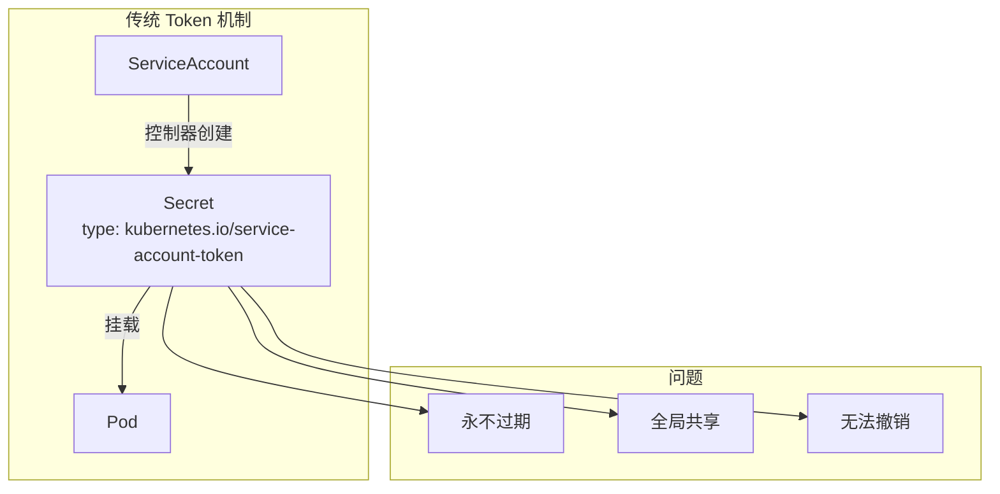
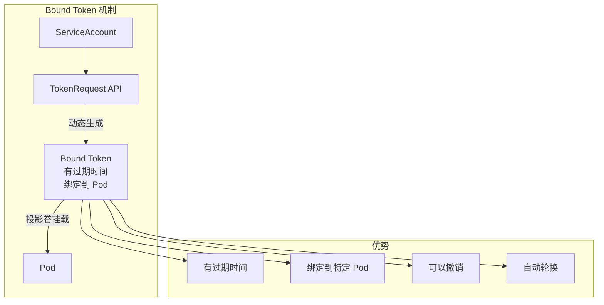

## 概述

ServiceAccount 是 Kubernetes 中 Pod 内应用程序的身份标识。与用户账户不同，ServiceAccount 是命名空间级别的资源，由 Kubernetes 自动管理。每个命名空间都有一个默认的 ServiceAccount，Pod 可以使用 ServiceAccount 的凭证访问 API Server。

## ServiceAccount 基础

### 资源结构

```yaml
apiVersion: v1
kind: ServiceAccount
metadata:
  name: my-service-account
  namespace: default
  annotations:
    # 镜像拉取 Secret 自动注入
    kubernetes.io/enforce-mountable-secrets: "true"
# 关联的 Secrets（传统方式，已废弃）
secrets:
  - name: my-service-account-token-xxxxx
# 镜像拉取 Secrets
imagePullSecrets:
  - name: my-registry-secret
# 是否自动挂载 Token
automountServiceAccountToken: true
```

### 默认 ServiceAccount

```bash
# 每个命名空间自动创建默认 ServiceAccount
kubectl get serviceaccount -n default

# NAME      SECRETS   AGE
# default   0         30d

# 查看默认 ServiceAccount
kubectl get sa default -o yaml
```

```yaml
apiVersion: v1
kind: ServiceAccount
metadata:
  name: default
  namespace: default
automountServiceAccountToken: true
```

## Token 机制演进

### 传统 Token（已废弃）



```yaml
# 传统 Secret Token（不推荐）
apiVersion: v1
kind: Secret
metadata:
  name: my-sa-token
  annotations:
    kubernetes.io/service-account.name: my-sa
type: kubernetes.io/service-account-token
# 控制器自动填充
data:
  token: <base64-encoded-jwt>
  ca.crt: <base64-encoded-ca>
  namespace: <base64-encoded-namespace>
```

### Bound Token（推荐）



## Token 投影

### Projected Volume 配置

```yaml
apiVersion: v1
kind: Pod
metadata:
  name: my-pod
spec:
  serviceAccountName: my-sa
  containers:
    - name: app
      image: myapp
      volumeMounts:
        - name: kube-api-access
          mountPath: /var/run/secrets/kubernetes.io/serviceaccount
          readOnly: true
  volumes:
    - name: kube-api-access
      projected:
        defaultMode: 0644
        sources:
          # ServiceAccount Token
          - serviceAccountToken:
              path: token
              expirationSeconds: 3600  # 1 小时过期
              audience: https://kubernetes.default.svc
          # CA 证书
          - configMap:
              name: kube-root-ca.crt
              items:
                - key: ca.crt
                  path: ca.crt
          # 命名空间信息
          - downwardAPI:
              items:
                - path: namespace
                  fieldRef:
                    apiVersion: v1
                    fieldPath: metadata.namespace
```

### 挂载内容

```bash
# Pod 内 Token 目录结构
/var/run/secrets/kubernetes.io/serviceaccount/
├── token      # JWT Token（自动轮换）
├── ca.crt     # API Server CA 证书
└── namespace  # Pod 所在命名空间

# Token 示例（JWT 格式）
eyJhbGciOiJSUzI1NiIsImtpZCI6IjEyMzQ1In0.
eyJhdWQiOlsiaHR0cHM6Ly9rdWJlcm5ldGVzLmRlZmF1bHQuc3ZjIl0s
ImV4cCI6MTcwNDEyMzQ1NiwiaWF0IjoxNzA0MTE5ODU2LCJpc3MiOi
...
```

### Token 自动轮换

```go
// pkg/kubelet/token/token_manager.go

type Manager struct {
    // Token 缓存
    cache map[string]*authenticationv1.TokenRequest
    // API Server 客户端
    client clientset.Interface
}

// GetServiceAccountToken 获取 Token
func (m *Manager) GetServiceAccountToken(
    namespace, name string,
    tr *authenticationv1.TokenRequest) (*authenticationv1.TokenRequest, error) {

    key := keyFunc(namespace, name, tr)

    // 检查缓存
    if cached := m.cache[key]; cached != nil {
        // 检查是否需要轮换（过期前 20% 时间内轮换）
        if !m.requiresRefresh(cached) {
            return cached, nil
        }
    }

    // 请求新 Token
    freshTR, err := m.client.CoreV1().ServiceAccounts(namespace).
        CreateToken(context.TODO(), name, tr, metav1.CreateOptions{})
    if err != nil {
        return nil, err
    }

    m.cache[key] = freshTR
    return freshTR, nil
}

// requiresRefresh 检查是否需要刷新
func (m *Manager) requiresRefresh(tr *authenticationv1.TokenRequest) bool {
    exp := tr.Status.ExpirationTimestamp.Time
    // 在过期时间前 20% 时刷新
    refreshTime := exp.Add(-time.Duration(float64(tr.Spec.ExpirationSeconds) * 0.2) * time.Second)
    return time.Now().After(refreshTime)
}
```

## TokenRequest API

### 创建 Token

```go
// 使用 TokenRequest API 创建 Token
func createToken(clientset *kubernetes.Clientset) (string, error) {
    tokenRequest := &authenticationv1.TokenRequest{
        Spec: authenticationv1.TokenRequestSpec{
            // 受众
            Audiences: []string{"https://kubernetes.default.svc"},
            // 过期时间（秒）
            ExpirationSeconds: ptr.To(int64(3600)),
            // 绑定到 Pod（可选）
            BoundObjectRef: &authenticationv1.BoundObjectReference{
                Kind:       "Pod",
                APIVersion: "v1",
                Name:       "my-pod",
                UID:        "pod-uid-xxx",
            },
        },
    }

    result, err := clientset.CoreV1().ServiceAccounts("default").
        CreateToken(context.TODO(), "my-sa", tokenRequest, metav1.CreateOptions{})
    if err != nil {
        return "", err
    }

    return result.Status.Token, nil
}
```

### Token 验证

```go
// staging/src/k8s.io/apiserver/pkg/authentication/serviceaccount/util.go

// 解析 JWT Token
type privateClaims struct {
    Kubernetes kubernetes `json:"kubernetes.io,omitempty"`
}

type kubernetes struct {
    Namespace string                          `json:"namespace,omitempty"`
    Svcacct   ref                             `json:"serviceaccount,omitempty"`
    Pod       *ref                            `json:"pod,omitempty"`
    Secret    *ref                            `json:"secret,omitempty"`
    Node      *ref                            `json:"node,omitempty"`
}

type ref struct {
    Name string `json:"name,omitempty"`
    UID  string `json:"uid,omitempty"`
}
```

```json
// Token Claims 示例
{
  "aud": ["https://kubernetes.default.svc"],
  "exp": 1704123456,
  "iat": 1704119856,
  "iss": "https://kubernetes.default.svc",
  "kubernetes.io": {
    "namespace": "default",
    "pod": {
      "name": "my-pod",
      "uid": "12345-67890-abcdef"
    },
    "serviceaccount": {
      "name": "my-sa",
      "uid": "sa-uid-12345"
    }
  },
  "nbf": 1704119856,
  "sub": "system:serviceaccount:default:my-sa"
}
```

## 镜像拉取凭证

### imagePullSecrets

```yaml
# 创建镜像拉取 Secret
apiVersion: v1
kind: Secret
metadata:
  name: my-registry-secret
  namespace: default
type: kubernetes.io/dockerconfigjson
data:
  .dockerconfigjson: <base64-encoded-docker-config>
---
# ServiceAccount 关联 imagePullSecrets
apiVersion: v1
kind: ServiceAccount
metadata:
  name: my-sa
  namespace: default
imagePullSecrets:
  - name: my-registry-secret
```

```bash
# 创建 Docker 仓库凭证
kubectl create secret docker-registry my-registry-secret \
  --docker-server=https://registry.example.com \
  --docker-username=user \
  --docker-password=password \
  --docker-email=user@example.com

# 将 Secret 添加到 ServiceAccount
kubectl patch serviceaccount default \
  -p '{"imagePullSecrets": [{"name": "my-registry-secret"}]}'
```

### 自动注入

```go
// pkg/controller/serviceaccount/tokens_controller.go

// 使用 ServiceAccount 的 Pod 自动获得 imagePullSecrets
func (c *Controller) syncServiceAccount(ctx context.Context, key string) error {
    // ...

    // 当 Pod 使用这个 ServiceAccount 时
    // Kubelet 会自动使用 imagePullSecrets 拉取镜像

    return nil
}
```

## 禁用自动挂载

### Pod 级别禁用

```yaml
apiVersion: v1
kind: Pod
metadata:
  name: no-auto-mount-pod
spec:
  # Pod 级别禁用自动挂载
  automountServiceAccountToken: false
  containers:
    - name: app
      image: myapp
```

### ServiceAccount 级别禁用

```yaml
apiVersion: v1
kind: ServiceAccount
metadata:
  name: no-auto-mount-sa
# ServiceAccount 级别禁用
automountServiceAccountToken: false
```

### 优先级

```
Token 挂载优先级（Pod 设置优先）：

1. Pod.spec.automountServiceAccountToken 明确设置 → 使用 Pod 设置
2. Pod 未设置 → 使用 ServiceAccount.automountServiceAccountToken
3. 都未设置 → 默认为 true（自动挂载）
```

## RBAC 集成

### 为 ServiceAccount 授权

```yaml
# 创建 ServiceAccount
apiVersion: v1
kind: ServiceAccount
metadata:
  name: my-app-sa
  namespace: default
---
# 创建 Role
apiVersion: rbac.authorization.k8s.io/v1
kind: Role
metadata:
  name: my-app-role
  namespace: default
rules:
  - apiGroups: [""]
    resources: ["configmaps"]
    verbs: ["get", "list", "watch"]
  - apiGroups: [""]
    resources: ["secrets"]
    resourceNames: ["my-app-secret"]
    verbs: ["get"]
---
# 绑定 Role 到 ServiceAccount
apiVersion: rbac.authorization.k8s.io/v1
kind: RoleBinding
metadata:
  name: my-app-rolebinding
  namespace: default
subjects:
  - kind: ServiceAccount
    name: my-app-sa
    namespace: default
roleRef:
  kind: Role
  name: my-app-role
  apiGroup: rbac.authorization.k8s.io
```

### 验证权限

```bash
# 检查 ServiceAccount 权限
kubectl auth can-i get configmaps \
  --as=system:serviceaccount:default:my-app-sa

# 列出所有权限
kubectl auth can-i --list \
  --as=system:serviceaccount:default:my-app-sa
```

## 代码中使用 ServiceAccount

### Go 客户端

```go
package main

import (
    "context"
    "fmt"

    metav1 "k8s.io/apimachinery/pkg/apis/meta/v1"
    "k8s.io/client-go/kubernetes"
    "k8s.io/client-go/rest"
)

func main() {
    // 使用 Pod 内的 ServiceAccount Token
    config, err := rest.InClusterConfig()
    if err != nil {
        panic(err)
    }

    clientset, err := kubernetes.NewForConfig(config)
    if err != nil {
        panic(err)
    }

    // 使用 ServiceAccount 权限访问 API
    configMaps, err := clientset.CoreV1().ConfigMaps("default").
        List(context.TODO(), metav1.ListOptions{})
    if err != nil {
        panic(err)
    }

    for _, cm := range configMaps.Items {
        fmt.Printf("ConfigMap: %s\n", cm.Name)
    }
}
```

### Shell 脚本

```bash
#!/bin/bash

# 读取 Token
TOKEN=$(cat /var/run/secrets/kubernetes.io/serviceaccount/token)
CA_CERT=/var/run/secrets/kubernetes.io/serviceaccount/ca.crt
NAMESPACE=$(cat /var/run/secrets/kubernetes.io/serviceaccount/namespace)

# 调用 API Server
curl -s --cacert $CA_CERT \
  -H "Authorization: Bearer $TOKEN" \
  "https://kubernetes.default.svc/api/v1/namespaces/$NAMESPACE/configmaps"
```

## ServiceAccount 控制器

### 控制器职责

```go
// pkg/controller/serviceaccount/serviceaccounts_controller.go

type ServiceAccountsController struct {
    client                  clientset.Interface
    saLister                corelisters.ServiceAccountLister
    nsLister                corelisters.NamespaceLister
    queue                   workqueue.RateLimitingInterface
}

// syncNamespace 确保命名空间有默认 ServiceAccount
func (c *ServiceAccountsController) syncNamespace(ctx context.Context, key string) error {
    ns, err := c.nsLister.Get(key)
    if err != nil {
        if errors.IsNotFound(err) {
            return nil
        }
        return err
    }

    // 检查默认 ServiceAccount 是否存在
    _, err = c.saLister.ServiceAccounts(ns.Name).Get("default")
    if err == nil {
        return nil
    }

    if !errors.IsNotFound(err) {
        return err
    }

    // 创建默认 ServiceAccount
    sa := &v1.ServiceAccount{
        ObjectMeta: metav1.ObjectMeta{
            Name:      "default",
            Namespace: ns.Name,
        },
    }

    _, err = c.client.CoreV1().ServiceAccounts(ns.Name).
        Create(ctx, sa, metav1.CreateOptions{})
    if err != nil && !errors.IsAlreadyExists(err) {
        return err
    }

    return nil
}
```

## 安全最佳实践

### 1. 使用专用 ServiceAccount

```yaml
# 不好的做法 - 使用默认 ServiceAccount
apiVersion: v1
kind: Pod
metadata:
  name: bad-practice
spec:
  # 使用默认 ServiceAccount
  containers:
    - name: app
      image: myapp
---
# 好的做法 - 使用专用 ServiceAccount
apiVersion: v1
kind: ServiceAccount
metadata:
  name: my-app-sa
---
apiVersion: v1
kind: Pod
metadata:
  name: good-practice
spec:
  serviceAccountName: my-app-sa
  containers:
    - name: app
      image: myapp
```

### 2. 禁用不需要的 Token

```yaml
apiVersion: v1
kind: Pod
metadata:
  name: no-api-access
spec:
  # 不需要访问 API 时禁用 Token
  automountServiceAccountToken: false
  containers:
    - name: app
      image: myapp
```

### 3. 限制 Token 生命周期

```yaml
apiVersion: v1
kind: Pod
metadata:
  name: short-lived-token
spec:
  serviceAccountName: my-sa
  containers:
    - name: app
      image: myapp
      volumeMounts:
        - name: token
          mountPath: /var/run/secrets/tokens
  volumes:
    - name: token
      projected:
        sources:
          - serviceAccountToken:
              path: token
              # 短生命周期
              expirationSeconds: 600  # 10 分钟
              audience: my-audience
```

### 4. 最小权限原则

```yaml
# 只授予必要的权限
apiVersion: rbac.authorization.k8s.io/v1
kind: Role
metadata:
  name: minimal-role
rules:
  # 只读特定资源
  - apiGroups: [""]
    resources: ["configmaps"]
    resourceNames: ["my-config"]  # 限定资源名称
    verbs: ["get"]
```

## 总结

ServiceAccount 的核心要点：

**Token 机制**
- Bound Token 替代传统 Secret Token
- Token 有过期时间，支持自动轮换
- 通过 Projected Volume 挂载到 Pod

**安全特性**
- 绑定到特定 Pod，增强安全性
- 支持受众限制（audience）
- 可以禁用自动挂载

**最佳实践**
- 为每个应用创建专用 ServiceAccount
- 遵循最小权限原则
- 不需要 API 访问时禁用 Token
- 使用短生命周期 Token
