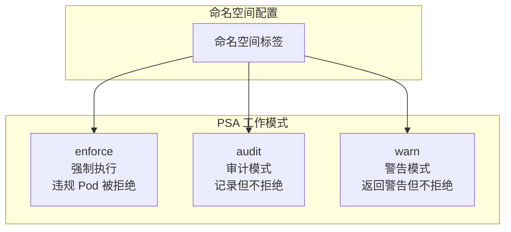
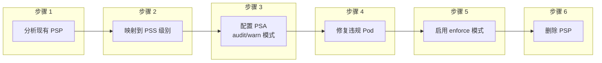

## 概述

Pod 安全是 Kubernetes 安全的重要组成部分，涉及容器运行时的安全隔离、权限控制和资源访问限制。Kubernetes 通过 Pod Security Standards（PSS）和 Pod Security Admission（PSA）提供了标准化的安全策略框架。

## Pod Security Standards

### 三个安全级别

```
┌─────────────────────────────────────────────────────────────────┐
│               Pod Security Standards (PSS)                       │
├─────────────────────────────────────────────────────────────────┤
│                                                                  │
│  Privileged（特权级）                                            │
│  ├── 无限制策略                                                  │
│  ├── 允许已知特权升级                                            │
│  └── 适用于系统组件和基础设施                                    │
│                                                                  │
│  Baseline（基线级）                                              │
│  ├── 最小化限制策略                                              │
│  ├── 防止已知特权升级                                            │
│  └── 适用于大多数工作负载                                        │
│                                                                  │
│  Restricted（限制级）                                            │
│  ├── 严格限制策略                                                │
│  ├── Pod 加固最佳实践                                            │
│  └── 适用于安全敏感应用                                          │
│                                                                  │
└─────────────────────────────────────────────────────────────────┘
```

### 策略对比

| 检查项 | Privileged | Baseline | Restricted |
|--------|------------|----------|------------|
| HostProcess | 允许 | 禁止 | 禁止 |
| Host Namespaces | 允许 | 禁止 | 禁止 |
| Privileged Containers | 允许 | 禁止 | 禁止 |
| Capabilities | 允许所有 | 限制危险能力 | 仅 NET_BIND_SERVICE |
| HostPath Volumes | 允许 | 允许 | 禁止 |
| Host Ports | 允许 | 允许 | 禁止 |
| AppArmor | 不限制 | 不限制 | 必须设置 |
| SELinux | 不限制 | 不限制 | 必须设置 |
| /proc Mount Type | 不限制 | 不限制 | Default |
| Seccomp | 不限制 | 不限制 | RuntimeDefault/Localhost |
| Sysctls | 允许所有 | 仅安全子集 | 仅安全子集 |
| Volume Types | 允许所有 | 允许所有 | 限制类型 |
| Privilege Escalation | 允许 | 允许 | 禁止 |
| Running as Non-root | 不限制 | 不限制 | 必须 |
| Running as Non-root User | 不限制 | 不限制 | 必须 |
| Seccomp Profile | 不限制 | 不限制 | 必须设置 |

## Pod Security Admission

### 工作模式



### 命名空间配置

```yaml
apiVersion: v1
kind: Namespace
metadata:
  name: my-namespace
  labels:
    # 强制执行 baseline 级别
    pod-security.kubernetes.io/enforce: baseline
    pod-security.kubernetes.io/enforce-version: v1.28

    # 审计 restricted 级别
    pod-security.kubernetes.io/audit: restricted
    pod-security.kubernetes.io/audit-version: v1.28

    # 警告 restricted 级别
    pod-security.kubernetes.io/warn: restricted
    pod-security.kubernetes.io/warn-version: v1.28
```

### 版本配置

```yaml
# 使用特定版本的策略
pod-security.kubernetes.io/enforce-version: v1.28

# 使用最新版本（随集群升级）
pod-security.kubernetes.io/enforce-version: latest
```

## Security Context

### Pod 级别 Security Context

```yaml
apiVersion: v1
kind: Pod
metadata:
  name: security-context-demo
spec:
  securityContext:
    # 运行用户
    runAsUser: 1000
    runAsGroup: 3000
    # 必须以非 root 运行
    runAsNonRoot: true
    # 文件系统组
    fsGroup: 2000
    fsGroupChangePolicy: "OnRootMismatch"
    # 补充组
    supplementalGroups: [4000]
    # SELinux 选项
    seLinuxOptions:
      level: "s0:c123,c456"
    # Seccomp 配置
    seccompProfile:
      type: RuntimeDefault
    # Sysctls
    sysctls:
      - name: net.core.somaxconn
        value: "1024"
  containers:
    - name: app
      image: myapp
```

### 容器级别 Security Context

```yaml
apiVersion: v1
kind: Pod
metadata:
  name: container-security-context
spec:
  containers:
    - name: app
      image: myapp
      securityContext:
        # 运行用户
        runAsUser: 1000
        runAsNonRoot: true
        # 只读根文件系统
        readOnlyRootFilesystem: true
        # 禁止特权升级
        allowPrivilegeEscalation: false
        # 特权容器（危险）
        privileged: false
        # Linux Capabilities
        capabilities:
          drop:
            - ALL
          add:
            - NET_BIND_SERVICE
        # Seccomp
        seccompProfile:
          type: RuntimeDefault
        # SELinux
        seLinuxOptions:
          level: "s0:c123,c456"
        # AppArmor（通过注解）
      volumeMounts:
        - name: tmp
          mountPath: /tmp
  volumes:
    - name: tmp
      emptyDir: {}
```

## Linux Capabilities

### 能力列表

```
常用 Linux Capabilities:

危险能力（应该删除）:
├── CAP_SYS_ADMIN     - 几乎等同于 root
├── CAP_NET_ADMIN     - 网络配置
├── CAP_SYS_PTRACE    - 进程跟踪
├── CAP_DAC_OVERRIDE  - 绕过文件权限
└── CAP_SETUID        - 更改 UID

安全能力（可按需添加）:
├── CAP_NET_BIND_SERVICE - 绑定低端口 (< 1024)
├── CAP_CHOWN            - 更改文件所有者
└── CAP_SETGID           - 更改 GID
```

### 能力配置

```yaml
apiVersion: v1
kind: Pod
metadata:
  name: capabilities-demo
spec:
  containers:
    - name: app
      image: nginx
      securityContext:
        capabilities:
          # 删除所有能力
          drop:
            - ALL
          # 仅添加必要能力
          add:
            - NET_BIND_SERVICE
```

## Seccomp

### Seccomp 配置

```yaml
apiVersion: v1
kind: Pod
metadata:
  name: seccomp-demo
spec:
  securityContext:
    seccompProfile:
      # RuntimeDefault - 使用容器运行时默认配置
      type: RuntimeDefault
  containers:
    - name: app
      image: myapp
---
apiVersion: v1
kind: Pod
metadata:
  name: seccomp-custom
spec:
  securityContext:
    seccompProfile:
      # 使用本地 Seccomp 配置文件
      type: Localhost
      localhostProfile: profiles/my-profile.json
  containers:
    - name: app
      image: myapp
```

### Seccomp Profile 示例

```json
// /var/lib/kubelet/seccomp/profiles/my-profile.json
{
  "defaultAction": "SCMP_ACT_ERRNO",
  "architectures": ["SCMP_ARCH_X86_64"],
  "syscalls": [
    {
      "names": [
        "read", "write", "open", "close",
        "stat", "fstat", "lstat",
        "mmap", "mprotect", "munmap",
        "brk", "access", "pipe",
        "select", "sched_yield",
        "socket", "connect", "accept",
        "sendto", "recvfrom",
        "clone", "execve", "exit",
        "wait4", "kill", "fcntl",
        "getpid", "getuid", "getgid"
      ],
      "action": "SCMP_ACT_ALLOW"
    }
  ]
}
```

## AppArmor

### AppArmor 配置

```yaml
apiVersion: v1
kind: Pod
metadata:
  name: apparmor-demo
  annotations:
    # 使用运行时默认配置
    container.apparmor.security.beta.kubernetes.io/app: runtime/default
spec:
  containers:
    - name: app
      image: myapp
---
apiVersion: v1
kind: Pod
metadata:
  name: apparmor-custom
  annotations:
    # 使用本地 AppArmor 配置文件
    container.apparmor.security.beta.kubernetes.io/app: localhost/my-profile
spec:
  containers:
    - name: app
      image: myapp
```

### AppArmor Profile 示例

```
# /etc/apparmor.d/my-profile
#include <tunables/global>

profile my-profile flags=(attach_disconnected) {
  #include <abstractions/base>

  # 允许网络访问
  network inet tcp,
  network inet udp,

  # 允许读取特定目录
  /app/** r,
  /etc/passwd r,

  # 允许写入临时目录
  /tmp/** rw,

  # 拒绝访问敏感目录
  deny /etc/shadow r,
  deny /root/** rwx,
}
```

## SELinux

### SELinux 配置

```yaml
apiVersion: v1
kind: Pod
metadata:
  name: selinux-demo
spec:
  securityContext:
    seLinuxOptions:
      # SELinux 用户
      user: system_u
      # SELinux 角色
      role: system_r
      # SELinux 类型
      type: container_t
      # SELinux 级别（MCS/MLS）
      level: s0:c123,c456
  containers:
    - name: app
      image: myapp
```

## 符合 Restricted 级别的 Pod

```yaml
apiVersion: v1
kind: Pod
metadata:
  name: restricted-pod
spec:
  securityContext:
    # 必须以非 root 运行
    runAsNonRoot: true
    runAsUser: 1000
    runAsGroup: 1000
    fsGroup: 1000
    # Seccomp 配置
    seccompProfile:
      type: RuntimeDefault
  containers:
    - name: app
      image: myapp
      securityContext:
        # 禁止特权升级
        allowPrivilegeEscalation: false
        # 只读根文件系统
        readOnlyRootFilesystem: true
        # 删除所有 capabilities
        capabilities:
          drop:
            - ALL
      # 资源限制
      resources:
        limits:
          cpu: "100m"
          memory: "128Mi"
        requests:
          cpu: "50m"
          memory: "64Mi"
      # 挂载临时目录用于写入
      volumeMounts:
        - name: tmp
          mountPath: /tmp
        - name: cache
          mountPath: /var/cache
  volumes:
    - name: tmp
      emptyDir: {}
    - name: cache
      emptyDir: {}
```

## 从 PodSecurityPolicy 迁移

### 迁移步骤



### PSP 到 PSS 映射

```yaml
# 原 PodSecurityPolicy
apiVersion: policy/v1beta1
kind: PodSecurityPolicy
metadata:
  name: restricted
spec:
  privileged: false
  allowPrivilegeEscalation: false
  runAsUser:
    rule: MustRunAsNonRoot
  seLinux:
    rule: RunAsAny
  fsGroup:
    rule: RunAsAny
  volumes:
    - 'configMap'
    - 'emptyDir'
    - 'secret'
---
# 对应的命名空间 PSA 配置
apiVersion: v1
kind: Namespace
metadata:
  name: my-namespace
  labels:
    pod-security.kubernetes.io/enforce: restricted
    pod-security.kubernetes.io/enforce-version: latest
```

## 准入控制器实现

### PSA 准入逻辑

```go
// staging/src/k8s.io/pod-security-admission/admission/admission.go

type Admission struct {
    // 策略检查器
    Checker policy.Checker
    // 命名空间缓存
    NamespaceGetter NamespaceGetter
}

func (a *Admission) Validate(ctx context.Context, attrs api.Attributes) *admissionv1.AdmissionResponse {
    // 获取命名空间的 PSA 配置
    namespace, err := a.NamespaceGetter.GetNamespace(ctx, attrs.GetNamespace())
    if err != nil {
        return allowedResponse()
    }

    // 解析命名空间标签
    nsPolicy, err := a.PolicyToEvaluate(namespace.Labels)
    if err != nil {
        return allowedResponse()
    }

    // 获取 Pod
    pod, err := a.PodSpecExtractor.ExtractPodSpec(attrs)
    if err != nil {
        return allowedResponse()
    }

    // 检查 Pod 是否符合策略
    results := a.Checker.CheckPod(nsPolicy, pod)

    // 根据模式处理结果
    if nsPolicy.Enforce.Level != policy.LevelPrivileged {
        if len(results.Enforce.Forbidden) > 0 {
            return deniedResponse(results.Enforce.Forbidden)
        }
    }

    // 添加警告
    if len(results.Warn.Forbidden) > 0 {
        warnings := formatWarnings(results.Warn.Forbidden)
        return allowedWithWarnings(warnings)
    }

    return allowedResponse()
}
```

## 豁免配置

### 豁免特定资源

```yaml
# API Server 配置
apiVersion: apiserver.config.k8s.io/v1
kind: AdmissionConfiguration
plugins:
  - name: PodSecurity
    configuration:
      apiVersion: pod-security.admission.config.k8s.io/v1
      kind: PodSecurityConfiguration
      defaults:
        enforce: "baseline"
        enforce-version: "latest"
        audit: "restricted"
        audit-version: "latest"
        warn: "restricted"
        warn-version: "latest"
      exemptions:
        # 豁免的用户
        usernames:
          - system:admin
        # 豁免的运行时类
        runtimeClasses:
          - gvisor
        # 豁免的命名空间
        namespaces:
          - kube-system
          - istio-system
```

## 最佳实践

### 逐步实施

```bash
# 1. 首先在 audit 模式下运行
kubectl label namespace my-namespace \
  pod-security.kubernetes.io/audit=restricted \
  pod-security.kubernetes.io/audit-version=latest

# 2. 检查审计日志
kubectl get events --field-selector reason=FailedCreate

# 3. 添加 warn 模式
kubectl label namespace my-namespace \
  pod-security.kubernetes.io/warn=restricted \
  pod-security.kubernetes.io/warn-version=latest

# 4. 修复违规后启用 enforce
kubectl label namespace my-namespace \
  pod-security.kubernetes.io/enforce=restricted \
  pod-security.kubernetes.io/enforce-version=latest
```

### 安全加固检查清单

```yaml
# Pod 安全加固检查清单
securityChecklist:
  - name: "使用非 root 用户"
    check: "runAsNonRoot: true"

  - name: "禁止特权升级"
    check: "allowPrivilegeEscalation: false"

  - name: "只读根文件系统"
    check: "readOnlyRootFilesystem: true"

  - name: "删除所有 Capabilities"
    check: "capabilities.drop: [ALL]"

  - name: "设置 Seccomp"
    check: "seccompProfile.type: RuntimeDefault"

  - name: "设置资源限制"
    check: "resources.limits defined"

  - name: "使用专用 ServiceAccount"
    check: "serviceAccountName != default"

  - name: "禁用 Token 自动挂载"
    check: "automountServiceAccountToken: false (if not needed)"
```

## 总结

Pod 安全的核心要点：

**Pod Security Standards**
- Privileged：无限制，用于系统组件
- Baseline：最小限制，适用于大多数应用
- Restricted：严格限制，用于安全敏感应用

**Pod Security Admission**
- enforce：强制执行，违规被拒绝
- audit：审计模式，记录违规
- warn：警告模式，返回警告

**Security Context**
- 运行用户/组配置
- 文件系统权限
- Linux Capabilities
- Seccomp/AppArmor/SELinux

**最佳实践**
- 逐步实施（audit → warn → enforce）
- 使用 Restricted 级别作为目标
- 删除不必要的 Capabilities
- 启用只读根文件系统
- 使用 Seccomp RuntimeDefault
