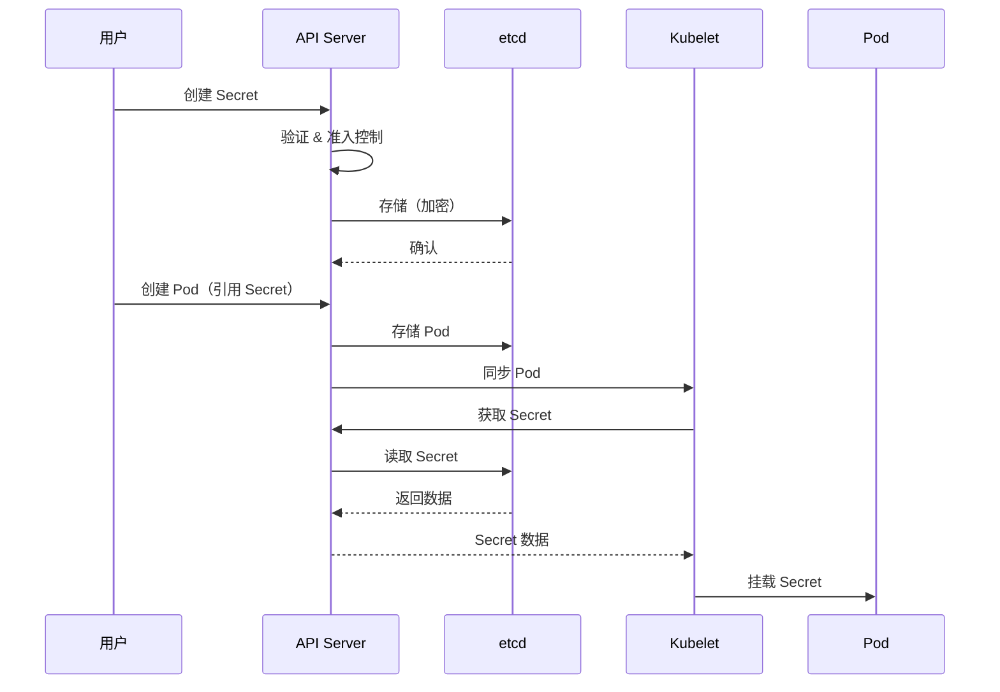

## 概述

Secret 是 Kubernetes 中用于存储敏感数据的资源对象，如密码、OAuth Token、SSH 密钥等。与 ConfigMap 类似，Secret 可以被 Pod 引用，但专门为敏感数据设计，提供了额外的安全特性。

## Secret 类型

### 内置 Secret 类型

```
┌─────────────────────────────────────────────────────────────────┐
│                     Secret 类型                                  │
├─────────────────────────────────────────────────────────────────┤
│                                                                  │
│  Opaque                                                          │
│  └── 通用 Secret，存储任意数据                                   │
│                                                                  │
│  kubernetes.io/service-account-token                             │
│  └── ServiceAccount Token（已废弃，使用 Bound Token）            │
│                                                                  │
│  kubernetes.io/dockercfg                                         │
│  └── Docker 配置（旧格式 ~/.dockercfg）                          │
│                                                                  │
│  kubernetes.io/dockerconfigjson                                  │
│  └── Docker 配置（新格式 ~/.docker/config.json）                 │
│                                                                  │
│  kubernetes.io/basic-auth                                        │
│  └── 基本认证凭证 (username/password)                            │
│                                                                  │
│  kubernetes.io/ssh-auth                                          │
│  └── SSH 认证凭证                                                │
│                                                                  │
│  kubernetes.io/tls                                               │
│  └── TLS 证书和私钥                                              │
│                                                                  │
│  bootstrap.kubernetes.io/token                                   │
│  └── Bootstrap Token                                             │
│                                                                  │
└─────────────────────────────────────────────────────────────────┘
```

### Opaque Secret

```yaml
apiVersion: v1
kind: Secret
metadata:
  name: my-secret
  namespace: default
type: Opaque
# 使用 data（Base64 编码）
data:
  username: YWRtaW4=          # admin
  password: cGFzc3dvcmQxMjM=  # password123
---
# 使用 stringData（明文，会自动编码）
apiVersion: v1
kind: Secret
metadata:
  name: my-secret-string
type: Opaque
stringData:
  username: admin
  password: password123
```

### TLS Secret

```yaml
apiVersion: v1
kind: Secret
metadata:
  name: tls-secret
type: kubernetes.io/tls
data:
  tls.crt: <base64-encoded-cert>
  tls.key: <base64-encoded-key>
```

```bash
# 使用 kubectl 创建 TLS Secret
kubectl create secret tls tls-secret \
  --cert=path/to/tls.crt \
  --key=path/to/tls.key
```

### Docker Registry Secret

```yaml
apiVersion: v1
kind: Secret
metadata:
  name: registry-secret
type: kubernetes.io/dockerconfigjson
data:
  .dockerconfigjson: <base64-encoded-docker-config>
```

```bash
# 使用 kubectl 创建 Docker Registry Secret
kubectl create secret docker-registry registry-secret \
  --docker-server=https://registry.example.com \
  --docker-username=user \
  --docker-password=password \
  --docker-email=user@example.com
```

### Basic Auth Secret

```yaml
apiVersion: v1
kind: Secret
metadata:
  name: basic-auth-secret
type: kubernetes.io/basic-auth
stringData:
  username: admin
  password: password123
```

### SSH Auth Secret

```yaml
apiVersion: v1
kind: Secret
metadata:
  name: ssh-secret
type: kubernetes.io/ssh-auth
data:
  ssh-privatekey: <base64-encoded-private-key>
```

## Secret 使用方式

### 环境变量

```yaml
apiVersion: v1
kind: Pod
metadata:
  name: secret-env-pod
spec:
  containers:
    - name: app
      image: myapp
      env:
        # 引用特定 key
        - name: DB_USERNAME
          valueFrom:
            secretKeyRef:
              name: db-secret
              key: username
        - name: DB_PASSWORD
          valueFrom:
            secretKeyRef:
              name: db-secret
              key: password
              optional: false  # 默认必须存在
      # 引用所有 key
      envFrom:
        - secretRef:
            name: app-secrets
            optional: true
```

### 卷挂载

```yaml
apiVersion: v1
kind: Pod
metadata:
  name: secret-volume-pod
spec:
  containers:
    - name: app
      image: myapp
      volumeMounts:
        - name: secret-volume
          mountPath: /etc/secrets
          readOnly: true
  volumes:
    - name: secret-volume
      secret:
        secretName: my-secret
        # 可选：设置权限
        defaultMode: 0400
        # 可选：选择特定 key
        items:
          - key: username
            path: db-username
          - key: password
            path: db-password
            mode: 0400
```

### Projected Volume

```yaml
apiVersion: v1
kind: Pod
metadata:
  name: secret-projected-pod
spec:
  containers:
    - name: app
      image: myapp
      volumeMounts:
        - name: all-secrets
          mountPath: /etc/all-secrets
          readOnly: true
  volumes:
    - name: all-secrets
      projected:
        sources:
          - secret:
              name: db-secret
              items:
                - key: username
                  path: db/username
          - secret:
              name: api-secret
              items:
                - key: api-key
                  path: api/key
          - configMap:
              name: app-config
              items:
                - key: config.yaml
                  path: config.yaml
```

### imagePullSecrets

```yaml
apiVersion: v1
kind: Pod
metadata:
  name: private-image-pod
spec:
  containers:
    - name: app
      image: registry.example.com/myapp:latest
  imagePullSecrets:
    - name: registry-secret
```

## etcd 加密

### 加密配置

```yaml
# /etc/kubernetes/encryption-config.yaml
apiVersion: apiserver.config.k8s.io/v1
kind: EncryptionConfiguration
resources:
  - resources:
      - secrets
    providers:
      # 首选加密提供者（用于新数据）
      - aescbc:
          keys:
            - name: key1
              secret: <base64-encoded-32-byte-key>
      # 备用解密提供者（用于旧数据）
      - identity: {}
```

### 加密提供者

```yaml
# 不同的加密提供者
providers:
  # AES-CBC 加密
  - aescbc:
      keys:
        - name: key1
          secret: <base64-encoded-32-byte-key>

  # AES-GCM 加密（推荐）
  - aesgcm:
      keys:
        - name: key1
          secret: <base64-encoded-32-byte-key>

  # Secretbox（NaCl）加密
  - secretbox:
      keys:
        - name: key1
          secret: <base64-encoded-32-byte-key>

  # KMS 提供者
  - kms:
      name: my-kms
      endpoint: unix:///var/run/kms-provider.sock
      cachesize: 1000
      timeout: 3s

  # 无加密（明文）
  - identity: {}
```

### API Server 配置

```bash
kube-apiserver \
  --encryption-provider-config=/etc/kubernetes/encryption-config.yaml \
  ...
```

### 验证加密

```bash
# 检查 Secret 是否加密
ETCDCTL_API=3 etcdctl get /registry/secrets/default/my-secret \
  --endpoints=https://127.0.0.1:2379 \
  --cacert=/etc/kubernetes/pki/etcd/ca.crt \
  --cert=/etc/kubernetes/pki/etcd/server.crt \
  --key=/etc/kubernetes/pki/etcd/server.key \
  | hexdump -C

# 加密的数据以 k8s:enc:aescbc:v1: 开头
```

### 密钥轮换

```yaml
# 1. 添加新密钥作为首选
apiVersion: apiserver.config.k8s.io/v1
kind: EncryptionConfiguration
resources:
  - resources:
      - secrets
    providers:
      - aescbc:
          keys:
            - name: key2  # 新密钥
              secret: <new-key>
            - name: key1  # 旧密钥
              secret: <old-key>
      - identity: {}
```

```bash
# 2. 重启 API Server

# 3. 重新加密所有 Secrets
kubectl get secrets --all-namespaces -o json | kubectl replace -f -

# 4. 移除旧密钥
# 更新配置，只保留 key2
```

## 外部 Secret 管理

### External Secrets Operator

```yaml
# 安装 External Secrets Operator
# helm install external-secrets external-secrets/external-secrets

# 配置 SecretStore（AWS Secrets Manager）
apiVersion: external-secrets.io/v1beta1
kind: SecretStore
metadata:
  name: aws-secrets-manager
  namespace: default
spec:
  provider:
    aws:
      service: SecretsManager
      region: us-east-1
      auth:
        secretRef:
          accessKeyIDSecretRef:
            name: aws-credentials
            key: access-key-id
          secretAccessKeySecretRef:
            name: aws-credentials
            key: secret-access-key
---
# 定义 ExternalSecret
apiVersion: external-secrets.io/v1beta1
kind: ExternalSecret
metadata:
  name: db-credentials
  namespace: default
spec:
  refreshInterval: 1h
  secretStoreRef:
    name: aws-secrets-manager
    kind: SecretStore
  target:
    name: db-secret
    creationPolicy: Owner
  data:
    - secretKey: username
      remoteRef:
        key: prod/db/credentials
        property: username
    - secretKey: password
      remoteRef:
        key: prod/db/credentials
        property: password
```

### HashiCorp Vault 集成

```yaml
# Vault SecretStore
apiVersion: external-secrets.io/v1beta1
kind: SecretStore
metadata:
  name: vault
spec:
  provider:
    vault:
      server: "https://vault.example.com"
      path: "secret"
      version: "v2"
      auth:
        kubernetes:
          mountPath: "kubernetes"
          role: "my-role"
          serviceAccountRef:
            name: vault-auth
---
# 从 Vault 获取 Secret
apiVersion: external-secrets.io/v1beta1
kind: ExternalSecret
metadata:
  name: vault-secret
spec:
  refreshInterval: 15m
  secretStoreRef:
    name: vault
    kind: SecretStore
  target:
    name: my-vault-secret
  data:
    - secretKey: api-key
      remoteRef:
        key: secret/data/myapp
        property: api_key
```

### Sealed Secrets

```yaml
# 安装 Sealed Secrets Controller
# kubectl apply -f https://github.com/bitnami-labs/sealed-secrets/releases/download/v0.24.0/controller.yaml

# 使用 kubeseal 加密 Secret
# kubeseal --format yaml < secret.yaml > sealed-secret.yaml

apiVersion: bitnami.com/v1alpha1
kind: SealedSecret
metadata:
  name: my-sealed-secret
  namespace: default
spec:
  encryptedData:
    username: AgBy8BL...
    password: AgBy8BL...
  template:
    metadata:
      name: my-sealed-secret
    type: Opaque
```

## Secret 生命周期

### 创建流程



### 更新传播

```go
// Secret 更新传播机制

// 环境变量方式：
// - 更新不会自动传播
// - 需要重启 Pod

// 卷挂载方式：
// - Kubelet 周期性同步（默认 1 分钟）
// - 使用符号链接原子更新
// - 应用需要监听文件变化
```

```bash
# 检查 Secret 挂载更新
# Pod 内的 Secret 文件结构
/etc/secrets/
├── ..data -> ..2024_01_15_10_30_00.123456789
├── ..2024_01_15_10_30_00.123456789/
│   ├── username
│   └── password
├── username -> ..data/username
└── password -> ..data/password

# 更新时创建新目录，然后原子切换 ..data 符号链接
```

## 安全最佳实践

### 1. 最小权限 RBAC

```yaml
# 限制 Secret 访问权限
apiVersion: rbac.authorization.k8s.io/v1
kind: Role
metadata:
  name: secret-reader
  namespace: default
rules:
  # 只允许访问特定 Secret
  - apiGroups: [""]
    resources: ["secrets"]
    resourceNames: ["my-app-secret"]
    verbs: ["get"]
```

### 2. 使用外部 Secret 管理

```yaml
# 推荐的架构
# 1. 敏感数据存储在外部系统（Vault、AWS Secrets Manager 等）
# 2. 使用 External Secrets Operator 同步到 Kubernetes
# 3. 启用自动轮换

apiVersion: external-secrets.io/v1beta1
kind: ExternalSecret
metadata:
  name: rotating-secret
spec:
  refreshInterval: 1h  # 每小时刷新
  # ...
```

### 3. 启用 etcd 加密

```yaml
# 必须启用 etcd 静态加密
apiVersion: apiserver.config.k8s.io/v1
kind: EncryptionConfiguration
resources:
  - resources:
      - secrets
    providers:
      - aescbc:
          keys:
            - name: key1
              secret: <32-byte-key>
```

### 4. 审计 Secret 访问

```yaml
# 审计策略
apiVersion: audit.k8s.io/v1
kind: Policy
rules:
  # 记录所有 Secret 访问
  - level: RequestResponse
    resources:
      - group: ""
        resources: ["secrets"]
    # 排除 Token 检查
    omitStages:
      - RequestReceived
```

### 5. 避免在日志中泄露

```go
// 应用代码中避免记录 Secret
func processSecret(secret string) {
    // 错误做法
    // log.Printf("Processing secret: %s", secret)

    // 正确做法
    log.Printf("Processing secret: [REDACTED]")
}
```

### 6. 使用 Secret 而非 ConfigMap

```yaml
# 敏感数据使用 Secret
apiVersion: v1
kind: Secret
metadata:
  name: db-credentials
type: Opaque
stringData:
  password: sensitive-password

# 非敏感配置使用 ConfigMap
apiVersion: v1
kind: ConfigMap
metadata:
  name: app-config
data:
  log_level: info
```

## Secret 控制器

### Secret 同步

```go
// pkg/controller/serviceaccount/tokens_controller.go

type TokensController struct {
    client    clientset.Interface
    saLister  corelisters.ServiceAccountLister
    secretLister corelisters.SecretLister
}

// 确保 ServiceAccount 有对应的 Token Secret（传统模式）
func (c *TokensController) syncServiceAccount(ctx context.Context, key string) error {
    namespace, name, err := cache.SplitMetaNamespaceKey(key)
    if err != nil {
        return err
    }

    sa, err := c.saLister.ServiceAccounts(namespace).Get(name)
    if err != nil {
        if errors.IsNotFound(err) {
            return nil
        }
        return err
    }

    // 检查是否需要创建 Token Secret
    // ...

    return nil
}
```

## 总结

Kubernetes Secret 管理要点：

**Secret 类型**
- Opaque：通用 Secret
- TLS：证书和私钥
- Docker Registry：镜像拉取凭证
- Basic Auth/SSH Auth：认证凭证

**使用方式**
- 环境变量：简单但更新需重启
- 卷挂载：支持自动更新
- imagePullSecrets：私有镜像拉取

**安全措施**
- 启用 etcd 加密
- 使用外部 Secret 管理器
- 最小权限 RBAC
- 审计 Secret 访问
- 定期轮换密钥

**最佳实践**
- 敏感数据必须使用 Secret
- 考虑使用 External Secrets Operator
- 不在日志中记录 Secret 内容
- 定期审计和清理未使用的 Secret
