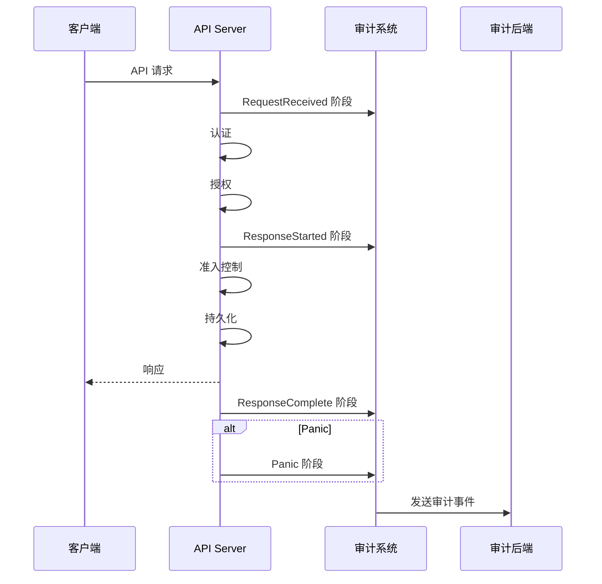

## 概述

审计（Audit）是 Kubernetes 安全的重要组成部分，记录了集群中发生的所有 API 请求。通过审计日志，管理员可以追踪谁在什么时间对什么资源执行了什么操作，这对于安全分析、合规性要求和故障排查都至关重要。

## 审计架构

### 审计流程



### 审计阶段

```
审计阶段（Stages）:

1. RequestReceived
   - 请求被 API Server 接收
   - 还未进行任何处理

2. ResponseStarted
   - 响应头已发送
   - 响应体尚未发送
   - 仅适用于长时间运行的请求（watch）

3. ResponseComplete
   - 响应完全发送
   - 请求处理完成

4. Panic
   - 请求处理过程中发生 panic
   - 用于记录错误情况
```

## 审计级别

### 级别定义

```yaml
审计级别（Levels）:

None
├── 不记录任何事件
└── 用于不需要审计的资源

Metadata
├── 记录请求元数据
├── 用户、时间戳、资源、动词等
└── 不记录请求/响应体

Request
├── 记录元数据和请求体
├── 不记录响应体
└── 适用于非资源 URL

RequestResponse
├── 记录元数据、请求体和响应体
├── 最详细的审计级别
└── 适用于需要完整审计的场景
```

### 级别对比

| 级别 | 元数据 | 请求体 | 响应体 | 使用场景 |
|------|--------|--------|--------|----------|
| None | ❌ | ❌ | ❌ | 不审计 |
| Metadata | ✅ | ❌ | ❌ | 基本审计 |
| Request | ✅ | ✅ | ❌ | 写操作审计 |
| RequestResponse | ✅ | ✅ | ✅ | 完整审计 |

## 审计策略

### 策略文件结构

```yaml
apiVersion: audit.k8s.io/v1
kind: Policy
# 忽略的阶段（全局）
omitStages:
  - "RequestReceived"
# 审计规则（按顺序匹配）
rules:
  # 规则 1: 不记录只读请求的 RequestReceived 阶段
  - level: None
    verbs: ["get", "watch", "list"]

  # 规则 2: 不记录健康检查
  - level: None
    nonResourceURLs:
      - /healthz*
      - /version
      - /swagger*

  # 规则 3: 记录 Secret 的完整信息
  - level: RequestResponse
    resources:
      - group: ""
        resources: ["secrets"]

  # 规则 4: 记录 ConfigMap 的元数据
  - level: Metadata
    resources:
      - group: ""
        resources: ["configmaps"]

  # 规则 5: 默认记录元数据
  - level: Metadata
```

### 完整策略示例

```yaml
apiVersion: audit.k8s.io/v1
kind: Policy
omitStages:
  - "RequestReceived"

rules:
  # 不审计系统组件的请求
  - level: None
    users:
      - "system:kube-scheduler"
      - "system:kube-controller-manager"
      - "system:kube-proxy"
    verbs: ["get", "watch", "list"]

  # 不审计 kubelet 读取节点和 Pod 状态
  - level: None
    userGroups: ["system:nodes"]
    verbs: ["get", "watch", "list"]
    resources:
      - group: ""
        resources: ["nodes", "nodes/status"]
      - group: ""
        resources: ["pods", "pods/status"]

  # 不审计 kube-system 命名空间的 endpoints 更新
  - level: None
    users: ["system:kube-controller-manager"]
    namespaces: ["kube-system"]
    verbs: ["update"]
    resources:
      - group: ""
        resources: ["endpoints"]

  # 不审计健康检查和指标端点
  - level: None
    nonResourceURLs:
      - /healthz*
      - /livez*
      - /readyz*
      - /metrics
      - /version

  # Secret 变更需要完整记录
  - level: RequestResponse
    resources:
      - group: ""
        resources: ["secrets"]
    omitStages:
      - "RequestReceived"

  # RBAC 变更需要完整记录
  - level: RequestResponse
    resources:
      - group: "rbac.authorization.k8s.io"
        resources: ["roles", "rolebindings", "clusterroles", "clusterrolebindings"]

  # Pod exec/attach/portforward 完整记录
  - level: RequestResponse
    resources:
      - group: ""
        resources: ["pods/exec", "pods/attach", "pods/portforward"]

  # 认证相关完整记录
  - level: RequestResponse
    resources:
      - group: "authentication.k8s.io"
        resources: ["tokenreviews"]
      - group: "authorization.k8s.io"
        resources: ["subjectaccessreviews"]

  # 删除操作记录请求体
  - level: Request
    verbs: ["delete", "deletecollection"]

  # 写操作记录请求体
  - level: Request
    verbs: ["create", "update", "patch"]
    resources:
      - group: ""
        resources: ["configmaps", "persistentvolumeclaims"]
      - group: "apps"
        resources: ["deployments", "statefulsets", "daemonsets"]

  # 默认只记录元数据
  - level: Metadata
```

## 审计后端

### 日志后端

```bash
# API Server 配置
kube-apiserver \
  --audit-policy-file=/etc/kubernetes/audit-policy.yaml \
  --audit-log-path=/var/log/kubernetes/audit.log \
  --audit-log-maxage=30 \
  --audit-log-maxbackup=10 \
  --audit-log-maxsize=100 \
  --audit-log-format=json
```

### Webhook 后端

```yaml
# audit-webhook-config.yaml
apiVersion: v1
kind: Config
clusters:
  - name: audit-webhook
    cluster:
      server: https://audit.example.com/webhook
      certificate-authority: /etc/kubernetes/pki/audit-ca.crt
users:
  - name: api-server
    user:
      client-certificate: /etc/kubernetes/pki/apiserver-audit.crt
      client-key: /etc/kubernetes/pki/apiserver-audit.key
current-context: webhook
contexts:
  - context:
      cluster: audit-webhook
      user: api-server
    name: webhook
```

```bash
# API Server 配置
kube-apiserver \
  --audit-policy-file=/etc/kubernetes/audit-policy.yaml \
  --audit-webhook-config-file=/etc/kubernetes/audit-webhook-config.yaml \
  --audit-webhook-initial-backoff=5s \
  --audit-webhook-batch-max-size=1000 \
  --audit-webhook-batch-max-wait=5s
```

### 动态后端

```yaml
# 使用 AuditSink 资源（需要启用 DynamicAuditing 特性）
apiVersion: auditregistration.k8s.io/v1alpha1
kind: AuditSink
metadata:
  name: my-audit-sink
spec:
  policy:
    level: Metadata
    stages:
      - "ResponseComplete"
  webhook:
    throttle:
      qps: 10
      burst: 15
    clientConfig:
      url: "https://audit.example.com/webhook"
      caBundle: <base64-ca-bundle>
```

## 审计事件结构

### 事件格式

```json
{
  "kind": "Event",
  "apiVersion": "audit.k8s.io/v1",
  "level": "RequestResponse",
  "auditID": "12345678-1234-1234-1234-123456789012",
  "stage": "ResponseComplete",
  "requestURI": "/api/v1/namespaces/default/pods",
  "verb": "create",
  "user": {
    "username": "admin",
    "uid": "user-uid-123",
    "groups": ["system:masters", "system:authenticated"],
    "extra": {
      "authentication.kubernetes.io/pod-name": ["my-pod"]
    }
  },
  "impersonatedUser": null,
  "sourceIPs": ["192.168.1.100"],
  "userAgent": "kubectl/v1.28.0 (linux/amd64) kubernetes/abc123",
  "objectRef": {
    "resource": "pods",
    "namespace": "default",
    "name": "my-pod",
    "apiGroup": "",
    "apiVersion": "v1"
  },
  "responseStatus": {
    "metadata": {},
    "code": 201
  },
  "requestObject": {
    "kind": "Pod",
    "apiVersion": "v1",
    "metadata": {
      "name": "my-pod",
      "namespace": "default"
    },
    "spec": {
      "containers": [
        {
          "name": "app",
          "image": "nginx:latest"
        }
      ]
    }
  },
  "responseObject": {
    "kind": "Pod",
    "apiVersion": "v1",
    "metadata": {
      "name": "my-pod",
      "namespace": "default",
      "uid": "pod-uid-456",
      "creationTimestamp": "2024-01-15T10:30:00Z"
    }
  },
  "requestReceivedTimestamp": "2024-01-15T10:30:00.000000Z",
  "stageTimestamp": "2024-01-15T10:30:00.100000Z",
  "annotations": {
    "authorization.k8s.io/decision": "allow",
    "authorization.k8s.io/reason": "RBAC: allowed by ClusterRoleBinding \"cluster-admin\""
  }
}
```

### 关键字段说明

```go
// staging/src/k8s.io/apiserver/pkg/apis/audit/types.go

type Event struct {
    // 审计级别
    Level Level

    // 唯一审计 ID
    AuditID types.UID

    // 审计阶段
    Stage Stage

    // 请求 URI
    RequestURI string

    // 操作动词
    Verb string

    // 发起请求的用户
    User UserInfo

    // 被模拟的用户（如果有）
    ImpersonatedUser *UserInfo

    // 源 IP 地址
    SourceIPs []string

    // User-Agent
    UserAgent string

    // 目标资源引用
    ObjectRef *ObjectReference

    // 响应状态
    ResponseStatus *metav1.Status

    // 请求对象（根据级别）
    RequestObject *runtime.Unknown

    // 响应对象（根据级别）
    ResponseObject *runtime.Unknown

    // 时间戳
    RequestReceivedTimestamp metav1.MicroTime
    StageTimestamp          metav1.MicroTime

    // 附加注解
    Annotations map[string]string
}
```

## 日志分析

### 使用 jq 分析

```bash
# 查找所有失败的请求
cat audit.log | jq 'select(.responseStatus.code >= 400)'

# 查找特定用户的操作
cat audit.log | jq 'select(.user.username == "admin")'

# 查找 Secret 访问
cat audit.log | jq 'select(.objectRef.resource == "secrets")'

# 查找删除操作
cat audit.log | jq 'select(.verb == "delete")'

# 统计每个用户的请求数
cat audit.log | jq -r '.user.username' | sort | uniq -c | sort -rn

# 查找特定时间范围的事件
cat audit.log | jq 'select(.requestReceivedTimestamp >= "2024-01-15T10:00:00Z" and .requestReceivedTimestamp <= "2024-01-15T11:00:00Z")'

# 查找 RBAC 拒绝的请求
cat audit.log | jq 'select(.annotations["authorization.k8s.io/decision"] == "deny")'
```

### 使用 Elasticsearch 分析

```yaml
# Filebeat 配置
filebeat.inputs:
  - type: log
    enabled: true
    paths:
      - /var/log/kubernetes/audit.log
    json.keys_under_root: true
    json.add_error_key: true

output.elasticsearch:
  hosts: ["elasticsearch:9200"]
  index: "kubernetes-audit-%{+yyyy.MM.dd}"

setup.template.name: "kubernetes-audit"
setup.template.pattern: "kubernetes-audit-*"
```

### Kibana 查询示例

```
# 查找所有 Secret 访问
objectRef.resource: "secrets"

# 查找失败的认证
responseStatus.code: 401

# 查找 exec 操作
objectRef.subresource: "exec"

# 查找特定命名空间的变更
objectRef.namespace: "production" AND verb: (create OR update OR delete)
```

## 告警配置

### Prometheus 告警规则

```yaml
groups:
  - name: kubernetes-audit
    rules:
      # 大量失败的 API 请求
      - alert: HighAPIErrorRate
        expr: |
          sum(rate(apiserver_request_total{code=~"4.."}[5m])) /
          sum(rate(apiserver_request_total[5m])) > 0.1
        for: 5m
        labels:
          severity: warning
        annotations:
          summary: "High API error rate"

      # Secret 被频繁访问
      - alert: SecretAccessAnomaly
        expr: |
          sum(rate(apiserver_request_total{resource="secrets"}[5m])) > 100
        for: 5m
        labels:
          severity: warning
        annotations:
          summary: "Unusual Secret access pattern detected"

      # 删除操作异常
      - alert: HighDeleteRate
        expr: |
          sum(rate(apiserver_request_total{verb="delete"}[5m])) > 50
        for: 5m
        labels:
          severity: warning
        annotations:
          summary: "High delete operation rate"
```

### Webhook 告警服务

```go
// 审计 Webhook 服务示例
func handleAuditWebhook(w http.ResponseWriter, r *http.Request) {
    var eventList auditv1.EventList
    if err := json.NewDecoder(r.Body).Decode(&eventList); err != nil {
        http.Error(w, err.Error(), http.StatusBadRequest)
        return
    }

    for _, event := range eventList.Items {
        // 检查敏感操作
        if shouldAlert(event) {
            sendAlert(event)
        }

        // 存储到数据库
        storeEvent(event)
    }

    w.WriteHeader(http.StatusOK)
}

func shouldAlert(event auditv1.Event) bool {
    // Secret 修改
    if event.ObjectRef != nil &&
       event.ObjectRef.Resource == "secrets" &&
       event.Verb != "get" && event.Verb != "list" && event.Verb != "watch" {
        return true
    }

    // RBAC 变更
    if event.ObjectRef != nil &&
       event.ObjectRef.APIGroup == "rbac.authorization.k8s.io" {
        return true
    }

    // exec/attach 操作
    if event.ObjectRef != nil &&
       (event.ObjectRef.Subresource == "exec" ||
        event.ObjectRef.Subresource == "attach") {
        return true
    }

    // 认证失败
    if event.ResponseStatus != nil && event.ResponseStatus.Code == 401 {
        return true
    }

    return false
}
```

## 合规性要求

### 常见合规标准

```
审计日志合规要求:

SOC 2
├── 记录所有访问尝试
├── 保留日志至少 1 年
└── 防止日志篡改

PCI DSS
├── 记录所有管理员操作
├── 记录所有认证尝试
├── 日志保留至少 1 年
└── 每日审查日志

HIPAA
├── 记录所有 PHI 访问
├── 保留日志至少 6 年
└── 实施访问控制

GDPR
├── 记录个人数据访问
├── 支持数据主体请求
└── 数据保留策略
```

### 合规策略示例

```yaml
apiVersion: audit.k8s.io/v1
kind: Policy
rules:
  # 记录所有认证尝试
  - level: RequestResponse
    resources:
      - group: "authentication.k8s.io"
        resources: ["tokenreviews"]
      - group: "authorization.k8s.io"
        resources: ["subjectaccessreviews"]

  # 记录所有管理员操作
  - level: RequestResponse
    userGroups: ["system:masters"]

  # 记录敏感资源访问
  - level: RequestResponse
    resources:
      - group: ""
        resources: ["secrets", "configmaps"]

  # 记录 RBAC 变更
  - level: RequestResponse
    resources:
      - group: "rbac.authorization.k8s.io"
        resources: ["*"]

  # 记录删除操作
  - level: Request
    verbs: ["delete", "deletecollection"]

  # 默认记录元数据
  - level: Metadata
```

## 最佳实践

### 1. 分层审计策略

```yaml
# 针对不同环境使用不同策略
# 生产环境：更详细的审计
# 开发环境：最小审计以减少性能影响
```

### 2. 日志轮换配置

```bash
# 配置日志轮换防止磁盘满
kube-apiserver \
  --audit-log-maxage=30 \    # 保留 30 天
  --audit-log-maxbackup=10 \ # 保留 10 个备份
  --audit-log-maxsize=100    # 单文件最大 100MB
```

### 3. 安全存储

```bash
# 日志应存储到安全位置
# - 使用独立存储
# - 启用加密
# - 限制访问权限
# - 考虑使用 WORM 存储（防篡改）
```

### 4. 定期审查

```bash
# 定期审查审计日志
# - 每日自动化异常检测
# - 每周人工审查关键操作
# - 每月合规性报告
```

## 总结

Kubernetes 审计的核心要点：

**审计级别**
- None：不记录
- Metadata：记录元数据
- Request：记录元数据和请求体
- RequestResponse：完整记录

**审计后端**
- 日志后端：写入文件
- Webhook 后端：发送到外部系统
- 动态后端：通过 AuditSink 配置

**策略设计**
- 按重要性分级审计
- 过滤无关请求减少噪音
- 敏感操作完整记录
- 考虑性能影响

**合规要求**
- 满足行业标准（SOC 2、PCI DSS 等）
- 适当的日志保留期
- 防篡改存储
- 定期审查和报告
