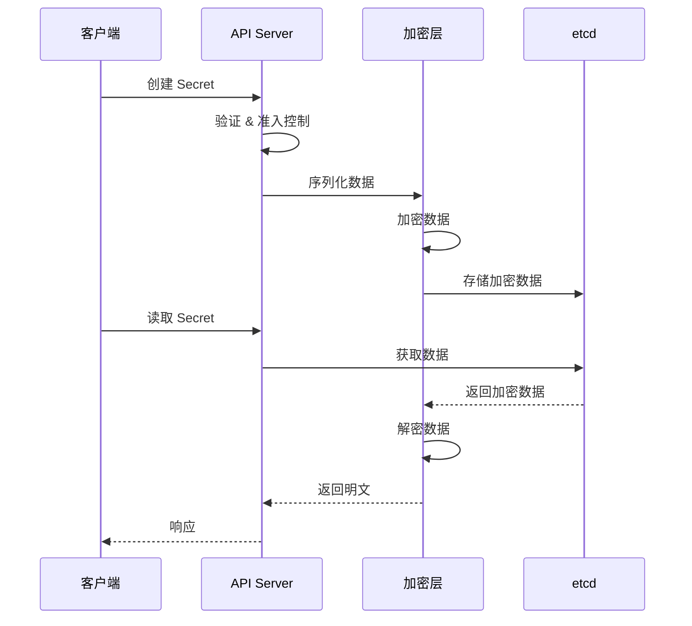
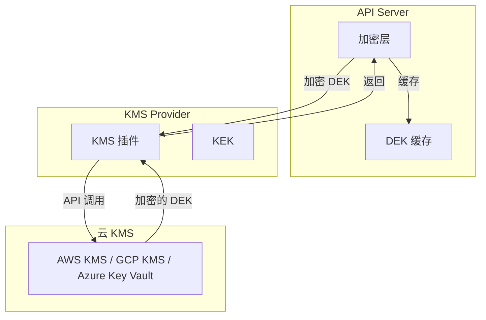
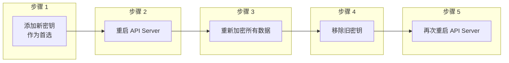

## 概述

静态加密（Encryption at Rest）是指对存储在 etcd 中的数据进行加密保护。默认情况下，Kubernetes 资源以明文形式存储在 etcd 中，通过启用静态加密，可以确保即使 etcd 数据被未授权访问，敏感信息也不会泄露。

## 加密架构

### 加密流程



### 加密层位置

```
数据流向:

Client → API Server → 认证 → 授权 → 准入控制
                                        ↓
                                    序列化
                                        ↓
                                   [加密层]  ← 加密/解密发生在这里
                                        ↓
                                    etcd 存储
```

## 加密配置

### EncryptionConfiguration

```yaml
# /etc/kubernetes/encryption-config.yaml
apiVersion: apiserver.config.k8s.io/v1
kind: EncryptionConfiguration
resources:
  # 要加密的资源列表
  - resources:
      - secrets
      - configmaps
    providers:
      # 提供者列表（按顺序）
      # 第一个用于加密新数据
      # 所有提供者都用于解密
      - aescbc:
          keys:
            - name: key1
              secret: c2VjcmV0LWtleS0xMjM0NTY3ODkwMTIzNDU2
      # identity 用于解密未加密的旧数据
      - identity: {}
```

### API Server 配置

```bash
# 启用加密配置
kube-apiserver \
  --encryption-provider-config=/etc/kubernetes/encryption-config.yaml \
  --encryption-provider-config-automatic-reload=true \
  ...
```

## 加密提供者

### 提供者类型

```
┌─────────────────────────────────────────────────────────────────┐
│                    加密提供者类型                                │
├─────────────────────────────────────────────────────────────────┤
│                                                                  │
│  identity                                                        │
│  ├── 无加密（明文存储）                                          │
│  └── 用于解密旧数据或禁用加密                                    │
│                                                                  │
│  aescbc                                                          │
│  ├── AES-CBC 加密                                                │
│  ├── 256 位密钥                                                  │
│  └── PKCS#7 填充                                                 │
│                                                                  │
│  aesgcm                                                          │
│  ├── AES-GCM 加密（推荐）                                        │
│  ├── 256 位密钥                                                  │
│  ├── 认证加密（完整性保护）                                      │
│  └── 需要定期轮换（每 20 万次写入）                              │
│                                                                  │
│  secretbox                                                       │
│  ├── NaCl secretbox 加密                                         │
│  ├── XSalsa20 + Poly1305                                         │
│  └── 256 位密钥                                                  │
│                                                                  │
│  kms (v1/v2)                                                     │
│  ├── 外部 KMS 集成                                               │
│  ├── 信封加密                                                    │
│  └── 支持云 KMS 服务                                             │
│                                                                  │
└─────────────────────────────────────────────────────────────────┘
```

### aescbc 配置

```yaml
apiVersion: apiserver.config.k8s.io/v1
kind: EncryptionConfiguration
resources:
  - resources:
      - secrets
    providers:
      - aescbc:
          keys:
            # 32 字节（256 位）密钥的 Base64 编码
            - name: key1
              secret: YWJjZGVmZ2hpamtsbW5vcHFyc3R1dnd4eXoxMjM0NTY=
```

```bash
# 生成 32 字节随机密钥
head -c 32 /dev/urandom | base64
```

### aesgcm 配置

```yaml
apiVersion: apiserver.config.k8s.io/v1
kind: EncryptionConfiguration
resources:
  - resources:
      - secrets
    providers:
      - aesgcm:
          keys:
            # AES-GCM 需要 16、24 或 32 字节密钥
            - name: key1
              secret: YWJjZGVmZ2hpamtsbW5vcHFyc3R1dnd4eXoxMjM0NTY=
```

### secretbox 配置

```yaml
apiVersion: apiserver.config.k8s.io/v1
kind: EncryptionConfiguration
resources:
  - resources:
      - secrets
    providers:
      - secretbox:
          keys:
            # 32 字节密钥
            - name: key1
              secret: YWJjZGVmZ2hpamtsbW5vcHFyc3R1dnd4eXoxMjM0NTY=
```

## KMS 集成

### KMS v2 架构



### KMS v2 配置

```yaml
apiVersion: apiserver.config.k8s.io/v1
kind: EncryptionConfiguration
resources:
  - resources:
      - secrets
    providers:
      - kms:
          apiVersion: v2
          name: my-kms-provider
          endpoint: unix:///var/run/kms-provider.sock
          # 可选：超时配置
          timeout: 3s
          # 可选：DEK 缓存大小
          cachesize: 1000
```

### KMS 插件示例

```go
// KMS gRPC 服务实现
type kmsPlugin struct {
    keyID string
    kmsClient *kms.Client
}

// Encrypt 加密 DEK
func (p *kmsPlugin) Encrypt(ctx context.Context, req *kmspb.EncryptRequest) (*kmspb.EncryptResponse, error) {
    // 使用 KMS 加密 DEK
    result, err := p.kmsClient.Encrypt(ctx, &kms.EncryptInput{
        KeyId:     aws.String(p.keyID),
        Plaintext: req.Plaintext,
    })
    if err != nil {
        return nil, err
    }

    return &kmspb.EncryptResponse{
        Ciphertext:  result.CiphertextBlob,
        KeyId:       p.keyID,
        Annotations: map[string][]byte{
            "kms.io/key-id": []byte(p.keyID),
        },
    }, nil
}

// Decrypt 解密 DEK
func (p *kmsPlugin) Decrypt(ctx context.Context, req *kmspb.DecryptRequest) (*kmspb.DecryptResponse, error) {
    result, err := p.kmsClient.Decrypt(ctx, &kms.DecryptInput{
        CiphertextBlob: req.Ciphertext,
        KeyId:          aws.String(p.keyID),
    })
    if err != nil {
        return nil, err
    }

    return &kmspb.DecryptResponse{
        Plaintext: result.Plaintext,
    }, nil
}

// Status 返回 KMS 状态
func (p *kmsPlugin) Status(ctx context.Context, req *kmspb.StatusRequest) (*kmspb.StatusResponse, error) {
    return &kmspb.StatusResponse{
        Version: "v2",
        Healthz: "ok",
        KeyId:   p.keyID,
    }, nil
}
```

### 云 KMS 集成

```yaml
# AWS KMS
apiVersion: apiserver.config.k8s.io/v1
kind: EncryptionConfiguration
resources:
  - resources:
      - secrets
    providers:
      - kms:
          apiVersion: v2
          name: aws-kms
          endpoint: unix:///var/run/aws-kms-provider.sock
---
# GCP KMS
apiVersion: apiserver.config.k8s.io/v1
kind: EncryptionConfiguration
resources:
  - resources:
      - secrets
    providers:
      - kms:
          apiVersion: v2
          name: gcp-kms
          endpoint: unix:///var/run/gcp-kms-provider.sock
---
# Azure Key Vault
apiVersion: apiserver.config.k8s.io/v1
kind: EncryptionConfiguration
resources:
  - resources:
      - secrets
    providers:
      - kms:
          apiVersion: v2
          name: azure-kms
          endpoint: unix:///var/run/azure-kms-provider.sock
```

## 密钥轮换

### 轮换流程



### 轮换步骤

```yaml
# 步骤 1: 原始配置
apiVersion: apiserver.config.k8s.io/v1
kind: EncryptionConfiguration
resources:
  - resources:
      - secrets
    providers:
      - aescbc:
          keys:
            - name: key1
              secret: <old-key>
      - identity: {}
---
# 步骤 2: 添加新密钥作为首选
apiVersion: apiserver.config.k8s.io/v1
kind: EncryptionConfiguration
resources:
  - resources:
      - secrets
    providers:
      - aescbc:
          keys:
            - name: key2  # 新密钥在前
              secret: <new-key>
            - name: key1  # 旧密钥保留用于解密
              secret: <old-key>
      - identity: {}
```

```bash
# 步骤 3: 重启 API Server

# 步骤 4: 重新加密所有 Secrets
kubectl get secrets --all-namespaces -o json | kubectl replace -f -

# 步骤 5: 验证所有数据已使用新密钥加密
ETCDCTL_API=3 etcdctl get /registry/secrets/default/my-secret \
  --endpoints=https://127.0.0.1:2379 \
  --cacert=/etc/kubernetes/pki/etcd/ca.crt \
  --cert=/etc/kubernetes/pki/etcd/server.crt \
  --key=/etc/kubernetes/pki/etcd/server.key \
  | hexdump -C | head
# 应该看到 k8s:enc:aescbc:v1:key2: 前缀

# 步骤 6: 移除旧密钥
```

```yaml
# 步骤 6: 最终配置（移除旧密钥）
apiVersion: apiserver.config.k8s.io/v1
kind: EncryptionConfiguration
resources:
  - resources:
      - secrets
    providers:
      - aescbc:
          keys:
            - name: key2
              secret: <new-key>
      - identity: {}
```

## 验证加密

### 检查加密状态

```bash
# 检查 Secret 是否加密
ETCDCTL_API=3 etcdctl get /registry/secrets/default/my-secret \
  --endpoints=https://127.0.0.1:2379 \
  --cacert=/etc/kubernetes/pki/etcd/ca.crt \
  --cert=/etc/kubernetes/pki/etcd/server.crt \
  --key=/etc/kubernetes/pki/etcd/server.key

# 加密的数据以 k8s:enc:<provider>:v1:<key-name>: 开头
# 例如: k8s:enc:aescbc:v1:key1:...

# 未加密的数据以 k8s:enc:identity:: 开头或者是明文 JSON
```

### 验证脚本

```bash
#!/bin/bash
# verify-encryption.sh

ETCD_ENDPOINTS="https://127.0.0.1:2379"
ETCD_CACERT="/etc/kubernetes/pki/etcd/ca.crt"
ETCD_CERT="/etc/kubernetes/pki/etcd/server.crt"
ETCD_KEY="/etc/kubernetes/pki/etcd/server.key"

# 获取所有 Secrets
secrets=$(kubectl get secrets --all-namespaces -o jsonpath='{range .items[*]}{.metadata.namespace}/{.metadata.name}{"\n"}{end}')

encrypted=0
unencrypted=0

for secret in $secrets; do
  ns=$(echo $secret | cut -d'/' -f1)
  name=$(echo $secret | cut -d'/' -f2)

  # 从 etcd 读取原始数据
  data=$(ETCDCTL_API=3 etcdctl get "/registry/secrets/$ns/$name" \
    --endpoints=$ETCD_ENDPOINTS \
    --cacert=$ETCD_CACERT \
    --cert=$ETCD_CERT \
    --key=$ETCD_KEY \
    --print-value-only 2>/dev/null | head -c 50)

  if [[ $data == *"k8s:enc:aescbc"* ]] || [[ $data == *"k8s:enc:aesgcm"* ]] || [[ $data == *"k8s:enc:secretbox"* ]] || [[ $data == *"k8s:enc:kms"* ]]; then
    ((encrypted++))
  else
    ((unencrypted++))
    echo "未加密: $ns/$name"
  fi
done

echo ""
echo "加密统计:"
echo "  已加密: $encrypted"
echo "  未加密: $unencrypted"
```

## 性能考虑

### 加密开销

```
性能影响因素:

1. 加密算法选择
   - aescbc: 中等性能
   - aesgcm: 较好性能（硬件加速）
   - secretbox: 好性能
   - kms: 取决于网络延迟

2. KMS 缓存
   - 启用 DEK 缓存减少 KMS 调用
   - 适当设置 cachesize

3. 批量操作
   - 大规模重新加密时分批处理
   - 避免高峰期执行
```

### 优化建议

```yaml
# KMS 性能优化配置
apiVersion: apiserver.config.k8s.io/v1
kind: EncryptionConfiguration
resources:
  - resources:
      - secrets
    providers:
      - kms:
          apiVersion: v2
          name: my-kms
          endpoint: unix:///var/run/kms.sock
          # 增加 DEK 缓存大小
          cachesize: 10000
          # 设置合理的超时
          timeout: 3s
```

## 故障排查

### 常见问题

```bash
# 问题 1: API Server 无法启动
# 检查加密配置文件语法
cat /etc/kubernetes/encryption-config.yaml | python3 -c "import yaml, sys; yaml.safe_load(sys.stdin)"

# 问题 2: 解密失败
# 确保所有旧密钥都在配置中
# 检查 API Server 日志
journalctl -u kube-apiserver | grep -i encrypt

# 问题 3: KMS 插件连接失败
# 检查 socket 文件权限
ls -la /var/run/kms-provider.sock

# 问题 4: 性能问题
# 检查 KMS 缓存命中率
# 监控加密操作延迟
```

### 恢复步骤

```bash
# 如果加密配置损坏，需要恢复

# 1. 如果有备份密钥，更新配置
# 2. 如果密钥丢失，从 etcd 备份恢复

# 紧急情况：禁用加密
apiVersion: apiserver.config.k8s.io/v1
kind: EncryptionConfiguration
resources:
  - resources:
      - secrets
    providers:
      - identity: {}  # 回退到明文

# 然后重新加密数据
kubectl get secrets --all-namespaces -o json | kubectl replace -f -
```

## 最佳实践

### 1. 密钥管理

```yaml
# 使用 KMS 而非本地密钥
# 定期轮换密钥
# 安全存储密钥备份
```

### 2. 加密范围

```yaml
# 至少加密 Secrets
resources:
  - resources:
      - secrets
    providers:
      - aescbc:
          keys:
            - name: key1
              secret: <key>

# 考虑加密 ConfigMaps（如果包含敏感数据）
  - resources:
      - configmaps
    providers:
      - aescbc:
          keys:
            - name: key1
              secret: <key>
```

### 3. 监控和告警

```yaml
# 监控加密状态
# - 定期验证数据是否加密
# - 监控 KMS 可用性
# - 告警密钥即将过期
```

### 4. 备份策略

```bash
# 备份加密密钥
# 备份加密配置
# 定期测试恢复流程
```

## 总结

Kubernetes 静态加密的核心要点：

**加密提供者**
- aescbc：标准 AES-CBC 加密
- aesgcm：推荐，带完整性保护
- secretbox：NaCl 加密
- kms：外部 KMS 集成

**关键操作**
- 配置 EncryptionConfiguration
- 定期轮换加密密钥
- 验证数据加密状态
- 监控和告警

**最佳实践**
- 使用 KMS 进行密钥管理
- 至少加密 Secrets 资源
- 建立密钥轮换流程
- 做好备份和恢复计划

**安全考虑**
- 保护加密配置文件
- 限制 etcd 访问
- 传输加密（TLS）配合使用
- 定期安全审计
