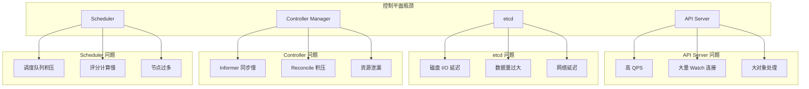
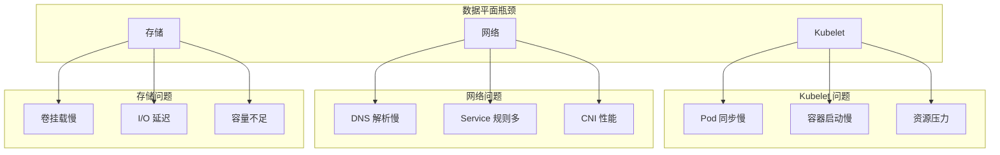
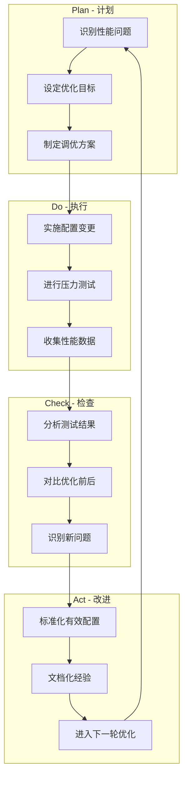

## 概述

Kubernetes 性能优化是确保集群高效运行的关键。随着集群规模增长和工作负载复杂化，性能问题会逐渐显现。本章介绍 Kubernetes 性能优化的整体方法论、关键指标和常见瓶颈。

## 性能维度

### 核心指标

```
┌─────────────────────────────────────────────────────────────────┐
│                    性能核心维度                                  │
├─────────────────────────────────────────────────────────────────┤
│                                                                  │
│  延迟 (Latency)                                                  │
│  ├── API 请求延迟                                                │
│  ├── 调度延迟                                                    │
│  ├── Pod 启动延迟                                                │
│  └── 网络延迟                                                    │
│                                                                  │
│  吞吐量 (Throughput)                                             │
│  ├── API QPS                                                     │
│  ├── 调度吞吐量                                                  │
│  └── 网络吞吐量                                                  │
│                                                                  │
│  资源利用率 (Utilization)                                        │
│  ├── CPU 使用率                                                  │
│  ├── 内存使用率                                                  │
│  ├── 磁盘 I/O                                                    │
│  └── 网络带宽                                                    │
│                                                                  │
│  可扩展性 (Scalability)                                          │
│  ├── 节点数量                                                    │
│  ├── Pod 数量                                                    │
│  └── 资源对象数量                                                │
│                                                                  │
└─────────────────────────────────────────────────────────────────┘
```

### SLI/SLO 定义

```yaml
# Kubernetes SLIs (Service Level Indicators)

API Server SLIs:
  - api_request_latency_seconds:
      description: "API 请求延迟"
      p99_target: 1s (mutating), 3s (non-mutating)

  - api_request_total:
      description: "API 请求成功率"
      success_rate_target: 99%

Scheduler SLIs:
  - scheduler_scheduling_duration_seconds:
      description: "调度延迟"
      p99_target: 5s

  - scheduler_pending_pods:
      description: "待调度 Pod 数量"
      target: < 100

Pod Startup SLIs:
  - pod_startup_latency_seconds:
      description: "Pod 启动延迟"
      p99_target: 5s (不含镜像拉取)
```

## 性能瓶颈分析

### 控制平面瓶颈



### 数据平面瓶颈



## 性能基准

### 官方 SLO

```
Kubernetes 官方 SLO (v1.28):

API 调用延迟 (单对象):
├── mutating API 调用: p99 < 1s
└── non-mutating API 调用: p99 < 1s

API 调用延迟 (列表):
├── 命名空间范围: p99 < 5s
└── 集群范围: p99 < 30s

Pod 启动延迟:
├── 无 init 容器: p99 < 5s
└── 不含镜像拉取时间

调度吞吐量:
└── > 100 pods/s (5000 节点集群)

Watch 通知延迟:
└── p99 < 5s
```

### 规模限制参考

| 维度 | 官方测试值 | 建议值 |
|------|-----------|--------|
| 节点数 | 5,000 | 根据实际调整 |
| Pod 总数 | 150,000 | 每节点 30 |
| Pod 数/节点 | 110 | 100 |
| Service 数 | 10,000 | 根据实际 |
| Endpoints/Service | 5,000 | 避免过大 |
| Secret/ConfigMap 数 | 100,000 | 按需 |
| 命名空间数 | 10,000 | 按需 |

## 性能测试工具

### clusterloader2

```bash
# Kubernetes 官方性能测试工具
# https://github.com/kubernetes/perf-tests

# 运行性能测试
./clusterloader2 \
  --testconfig=testing/load/config.yaml \
  --provider=local \
  --kubeconfig=$KUBECONFIG \
  --v=2

# 测试配置示例
apiVersion: config.k8s.io/v1alpha1
kind: TestConfig
name: load-test
namespace:
  number: 100
tuningSets:
  - name: Uniform100qps
    qpsLoad:
      qps: 100
steps:
  - measurements:
      - Identifier: APIResponsivenessPrometheus
        Method: APIResponsivenessPrometheus
        Params:
          prometheusFramework: default
  - phases:
      - namespaceRange:
          min: 1
          max: 100
        replicasPerNamespace: 10
        tuningSet: Uniform100qps
        objectBundle:
          - basename: deployment
            objectTemplatePath: deployment.yaml
```

### kube-burner

```bash
# 高性能工作负载生成器
# https://github.com/cloud-bulldozer/kube-burner

# 安装
go install github.com/cloud-bulldozer/kube-burner@latest

# 运行测试
kube-burner init -c config.yaml --uuid $(uuidgen)

# 配置示例
---
global:
  writeToFile: true
  indexerConfig:
    esServers: ["https://elasticsearch:9200"]
    defaultIndex: kube-burner
  measurements:
    - name: podLatency

jobs:
  - name: create-deployments
    jobIterations: 100
    qps: 20
    burst: 20
    namespacedIterations: true
    namespace: kube-burner
    objects:
      - objectTemplate: deployment.yaml
        replicas: 10
        inputVars:
          containerImage: nginx:alpine
```

### k6 API 测试

```javascript
// k6 脚本测试 API Server
import http from 'k6/http';
import { check, sleep } from 'k6';

export const options = {
  stages: [
    { duration: '30s', target: 100 },
    { duration: '1m', target: 100 },
    { duration: '30s', target: 0 },
  ],
};

const KUBE_API = 'https://kubernetes.default.svc';
const TOKEN = __ENV.KUBE_TOKEN;

export default function () {
  const params = {
    headers: {
      'Authorization': `Bearer ${TOKEN}`,
    },
  };

  // 测试 list pods
  const res = http.get(`${KUBE_API}/api/v1/pods?limit=100`, params);

  check(res, {
    'status is 200': (r) => r.status === 200,
    'response time < 500ms': (r) => r.timings.duration < 500,
  });

  sleep(0.1);
}
```

## 性能监控

### Prometheus 指标

```yaml
# API Server 关键指标
- apiserver_request_duration_seconds_bucket  # 请求延迟分布
- apiserver_current_inflight_requests        # 当前并发请求
- apiserver_request_total                    # 请求总数
- etcd_request_duration_seconds_bucket       # etcd 请求延迟

# Scheduler 关键指标
- scheduler_scheduling_duration_seconds      # 调度延迟
- scheduler_pending_pods                     # 待调度 Pod
- scheduler_schedule_attempts_total          # 调度尝试次数

# Controller Manager 关键指标
- workqueue_depth                            # 工作队列深度
- workqueue_adds_total                       # 队列添加次数
- workqueue_retries_total                    # 重试次数

# Kubelet 关键指标
- kubelet_pod_start_duration_seconds         # Pod 启动延迟
- kubelet_container_operations_duration_seconds # 容器操作延迟
- kubelet_volume_stats_used_bytes            # 卷使用量
```

### Grafana 仪表盘

```json
// API Server 仪表盘面板
{
  "panels": [
    {
      "title": "API Request Rate",
      "targets": [{
        "expr": "sum(rate(apiserver_request_total[5m])) by (verb)"
      }]
    },
    {
      "title": "API Request Latency p99",
      "targets": [{
        "expr": "histogram_quantile(0.99, sum(rate(apiserver_request_duration_seconds_bucket[5m])) by (le, verb))"
      }]
    },
    {
      "title": "etcd Request Latency p99",
      "targets": [{
        "expr": "histogram_quantile(0.99, sum(rate(etcd_request_duration_seconds_bucket[5m])) by (le, operation))"
      }]
    }
  ]
}
```

## 性能调优方法论

### PDCA 循环



### 优化优先级

```
性能优化优先级:

1. 架构层面
   - 组件部署拓扑
   - 资源规格调整
   - 集群分片

2. 配置层面
   - 参数调优
   - 特性开关
   - 缓存配置

3. 代码层面
   - 客户端优化
   - 自定义控制器优化
   - 应用层优化

4. 基础设施层面
   - 硬件升级
   - 网络优化
   - 存储优化
```

## 常见优化策略

### 控制平面优化

```yaml
# API Server 优化
kube-apiserver:
  # 增加并发限制
  --max-requests-inflight=800
  --max-mutating-requests-inflight=400
  # 启用优先级和公平性
  --enable-priority-and-fairness=true
  # Watch 缓存优化
  --watch-cache-sizes=pods#1000,nodes#500

# etcd 优化
etcd:
  # 使用 SSD
  # 增加快照阈值
  --snapshot-count=10000
  # 调整心跳间隔
  --heartbeat-interval=100
  --election-timeout=1000

# Scheduler 优化
kube-scheduler:
  # 减少评分节点比例
  --percentageOfNodesToScore=50
```

### 数据平面优化

```yaml
# Kubelet 优化
kubelet:
  # 调整同步周期
  --sync-frequency=1m
  # 限制并行镜像拉取
  --serialize-image-pulls=false
  --max-parallel-image-pulls=5
  # 资源预留
  --kube-reserved=cpu=500m,memory=1Gi
  --system-reserved=cpu=500m,memory=1Gi

# kube-proxy 优化
kube-proxy:
  # 使用 IPVS 模式
  mode: ipvs
  # 减少同步间隔
  iptables:
    syncPeriod: 30s
    minSyncPeriod: 1s
```

## 总结

Kubernetes 性能优化的核心要点：

**性能指标**
- 延迟（API、调度、Pod 启动）
- 吞吐量（QPS、调度速率）
- 资源利用率
- 可扩展性

**瓶颈定位**
- 控制平面：API Server、etcd、调度器
- 数据平面：Kubelet、网络、存储

**优化方法**
- 建立基准和 SLO
- 持续监控和测试
- 分层优化（架构→配置→代码）
- PDCA 循环改进

**工具链**
- clusterloader2 性能测试
- Prometheus + Grafana 监控
- pprof 性能分析
