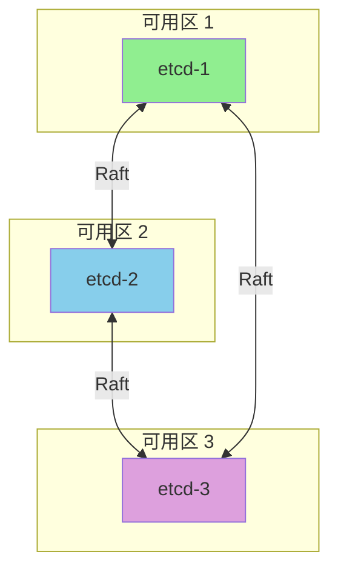

## 概述

etcd 是 Kubernetes 的后端存储，所有集群状态数据都存储在 etcd 中。etcd 的性能直接影响 API Server 的响应速度和整个集群的稳定性。本章介绍 etcd 的性能调优策略。

## 硬件要求

### 推荐配置

```
┌─────────────────────────────────────────────────────────────────┐
│                    etcd 硬件要求                                 │
├─────────────────────────────────────────────────────────────────┤
│                                                                  │
│  磁盘 (最关键):                                                  │
│  ├── 必须使用 SSD                                                │
│  ├── 推荐 NVMe SSD                                               │
│  ├── 随机 IOPS > 1000                                            │
│  └── 延迟 < 10ms (p99)                                           │
│                                                                  │
│  CPU:                                                            │
│  ├── 小集群: 2-4 核                                              │
│  ├── 中集群: 4-8 核                                              │
│  └── 大集群: 8-16 核                                             │
│                                                                  │
│  内存:                                                           │
│  ├── 小集群: 8 GB                                                │
│  ├── 中集群: 16 GB                                               │
│  └── 大集群: 32+ GB                                              │
│                                                                  │
│  网络:                                                           │
│  ├── 低延迟 (< 10ms RTT)                                         │
│  ├── 高带宽 (> 1 Gbps)                                           │
│  └── 成员间独立网络更佳                                          │
│                                                                  │
└─────────────────────────────────────────────────────────────────┘
```

### 磁盘性能测试

```bash
# 使用 fio 测试磁盘性能
fio --name=etcd-test \
  --filename=/var/lib/etcd/test \
  --ioengine=sync \
  --direct=1 \
  --bs=4k \
  --rw=write \
  --size=1g \
  --numjobs=1 \
  --fdatasync=1

# 关键指标:
# - fsync 延迟 < 10ms
# - 吞吐量 > 50 MB/s

# etcd 内置磁盘检测
etcd --wal-dir=/var/lib/etcd/wal \
  --data-dir=/var/lib/etcd/data \
  --experimental-backend-bbolt-freelist-type=map
```

## 参数调优

### 核心参数

```bash
# etcd 启动配置
etcd \
  # 数据目录
  --data-dir=/var/lib/etcd \
  # WAL 目录（建议独立 SSD）
  --wal-dir=/var/lib/etcd/wal \

  # 心跳间隔（毫秒）
  --heartbeat-interval=100 \
  # 选举超时（毫秒）
  --election-timeout=1000 \

  # 快照阈值
  --snapshot-count=10000 \
  # 自动压缩
  --auto-compaction-retention=1h \
  --auto-compaction-mode=periodic \

  # 配额限制
  --quota-backend-bytes=8589934592 \  # 8GB

  # gRPC 配置
  --max-request-bytes=1572864 \  # 1.5MB
  --grpc-keepalive-min-time=5s \
  --grpc-keepalive-interval=2h \
  --grpc-keepalive-timeout=20s
```

### 参数说明

```
关键参数说明:

heartbeat-interval (心跳间隔):
├── 默认: 100ms
├── 影响: Leader 发送心跳频率
├── 建议: 网络延迟的 0.5-1.5 倍
└── 跨数据中心: 可增加到 500ms

election-timeout (选举超时):
├── 默认: 1000ms
├── 影响: Leader 失效检测时间
├── 建议: heartbeat-interval 的 5-10 倍
└── 必须大于网络往返时间

snapshot-count (快照阈值):
├── 默认: 100000
├── 影响: WAL 大小和恢复时间
├── 建议: 大集群可降到 10000
└── 越小 WAL 越小，但 I/O 更频繁

quota-backend-bytes (存储配额):
├── 默认: 2GB
├── 影响: 最大数据量
├── 建议: 8GB (大集群)
└── 超过会触发告警和只读
```

### 网络参数

```bash
# 网络相关配置
etcd \
  # 客户端 URL
  --listen-client-urls=https://0.0.0.0:2379 \
  --advertise-client-urls=https://etcd1.example.com:2379 \

  # 集群成员 URL
  --listen-peer-urls=https://0.0.0.0:2380 \
  --initial-advertise-peer-urls=https://etcd1.example.com:2380 \

  # TLS 配置
  --client-cert-auth=true \
  --trusted-ca-file=/etc/etcd/pki/ca.crt \
  --cert-file=/etc/etcd/pki/server.crt \
  --key-file=/etc/etcd/pki/server.key \
  --peer-client-cert-auth=true \
  --peer-trusted-ca-file=/etc/etcd/pki/ca.crt \
  --peer-cert-file=/etc/etcd/pki/peer.crt \
  --peer-key-file=/etc/etcd/pki/peer.key
```

## 存储优化

### 数据压缩

```bash
# 自动压缩配置
etcd \
  --auto-compaction-retention=1h \
  --auto-compaction-mode=periodic

# 手动压缩
# 获取当前 revision
ETCDCTL_API=3 etcdctl endpoint status --write-out=json | jq '.[].Status.header.revision'

# 执行压缩
ETCDCTL_API=3 etcdctl compact <revision>
```

### 碎片整理

```bash
# 检查碎片情况
ETCDCTL_API=3 etcdctl endpoint status --write-out=table

# 碎片整理（会导致短暂不可用）
ETCDCTL_API=3 etcdctl defrag --endpoints=https://etcd1:2379

# 集群碎片整理（逐个节点）
for endpoint in etcd1:2379 etcd2:2379 etcd3:2379; do
  ETCDCTL_API=3 etcdctl defrag --endpoints=https://$endpoint
  sleep 10  # 等待节点恢复
done
```

### 空间管理

```bash
# 检查空间使用
ETCDCTL_API=3 etcdctl endpoint status --write-out=table

# 输出示例:
# +------------------------+------------------+---------+---------+-----------+
# |        ENDPOINT        |        ID        | VERSION | DB SIZE | IS LEADER |
# +------------------------+------------------+---------+---------+-----------+
# | https://etcd1:2379     | 8e9e05c52164694d |  3.5.9  |  1.2 GB |     true  |
# | https://etcd2:2379     | 91bc3c398fb3c146 |  3.5.9  |  1.2 GB |    false  |
# | https://etcd3:2379     | fd422379fda50e48 |  3.5.9  |  1.2 GB |    false  |
# +------------------------+------------------+---------+---------+-----------+

# 检查配额告警
ETCDCTL_API=3 etcdctl alarm list

# 解除配额告警（需要先压缩和碎片整理）
ETCDCTL_API=3 etcdctl alarm disarm
```

## 集群优化

### 部署拓扑



### 成员数量

```
etcd 集群成员数量建议:

3 成员集群:
├── 容忍 1 节点故障
├── 推荐用于大多数场景
└── 性能最佳

5 成员集群:
├── 容忍 2 节点故障
├── 适用于跨区域部署
└── 写入性能略有下降

7 成员集群:
├── 容忍 3 节点故障
├── 很少使用
└── 写入延迟增加明显

注意:
- 不推荐偶数成员（可能脑裂）
- 成员越多写入越慢
- 读取可以扩展
```

### Learner 节点

```bash
# 添加 Learner 节点（不参与投票）
ETCDCTL_API=3 etcdctl member add etcd4 \
  --peer-urls=https://etcd4:2380 \
  --learner

# 提升为正式成员
ETCDCTL_API=3 etcdctl member promote <member-id>
```

## 客户端优化

### 连接池配置

```go
// Kubernetes API Server 中的 etcd 客户端配置
config := clientv3.Config{
    Endpoints:   []string{"https://etcd1:2379", "https://etcd2:2379", "https://etcd3:2379"},
    DialTimeout: 5 * time.Second,

    // TLS 配置
    TLS: tlsConfig,

    // 连接池
    MaxCallSendMsgSize: 2 * 1024 * 1024,  // 2MB
    MaxCallRecvMsgSize: 4 * 1024 * 1024,  // 4MB

    // 自动同步成员列表
    AutoSyncInterval: 30 * time.Second,

    // 拨号选项
    DialOptions: []grpc.DialOption{
        grpc.WithBlock(),
        grpc.WithKeepaliveParams(keepalive.ClientParameters{
            Time:                10 * time.Second,
            Timeout:             2 * time.Second,
            PermitWithoutStream: true,
        }),
    },
}
```

### 重试策略

```go
// 配置重试策略
import "go.etcd.io/etcd/client/v3/concurrency"

// 使用重试
ctx, cancel := context.WithTimeout(context.Background(), 5*time.Second)
defer cancel()

// 带重试的操作
_, err := client.Put(ctx, key, value)
if err != nil {
    // 根据错误类型决定是否重试
    switch {
    case err == context.DeadlineExceeded:
        // 超时，可以重试
    case err == rpctypes.ErrLeaderChanged:
        // Leader 变更，可以重试
    default:
        // 其他错误
    }
}
```

## 监控指标

### 关键指标

```yaml
# etcd Prometheus 指标

# 领导者信息
- etcd_server_is_leader
- etcd_server_leader_changes_seen_total

# 请求延迟
- etcd_disk_wal_fsync_duration_seconds_bucket
- etcd_disk_backend_commit_duration_seconds_bucket
- etcd_network_peer_round_trip_time_seconds_bucket

# 存储
- etcd_mvcc_db_total_size_in_bytes
- etcd_mvcc_db_total_size_in_use_in_bytes
- etcd_debugging_mvcc_keys_total

# gRPC
- grpc_server_handled_total
- grpc_server_handling_seconds_bucket

# 提案
- etcd_server_proposals_committed_total
- etcd_server_proposals_applied_total
- etcd_server_proposals_pending
- etcd_server_proposals_failed_total
```

### 告警规则

```yaml
groups:
  - name: etcd
    rules:
      # etcd 没有 Leader
      - alert: EtcdNoLeader
        expr: etcd_server_has_leader == 0
        for: 1m
        labels:
          severity: critical
        annotations:
          summary: "etcd 集群没有 Leader"

      # Leader 频繁切换
      - alert: EtcdHighLeaderChanges
        expr: increase(etcd_server_leader_changes_seen_total[1h]) > 3
        for: 5m
        labels:
          severity: warning
        annotations:
          summary: "etcd Leader 频繁切换"

      # 磁盘 fsync 延迟高
      - alert: EtcdFsyncDurationHigh
        expr: |
          histogram_quantile(0.99, rate(etcd_disk_wal_fsync_duration_seconds_bucket[5m])) > 0.5
        for: 10m
        labels:
          severity: warning
        annotations:
          summary: "etcd WAL fsync 延迟过高"

      # 存储空间接近配额
      - alert: EtcdDatabaseSizeHigh
        expr: |
          etcd_mvcc_db_total_size_in_bytes / etcd_server_quota_backend_bytes > 0.8
        for: 10m
        labels:
          severity: warning
        annotations:
          summary: "etcd 存储空间接近配额"

      # 网络延迟高
      - alert: EtcdNetworkLatencyHigh
        expr: |
          histogram_quantile(0.99, rate(etcd_network_peer_round_trip_time_seconds_bucket[5m])) > 0.15
        for: 10m
        labels:
          severity: warning
        annotations:
          summary: "etcd 成员间网络延迟过高"
```

## 故障排查

### 常见问题

```bash
# 1. 磁盘 I/O 问题
# 检查磁盘延迟
iostat -x 1

# 检查 etcd 日志中的 slow fdatasync
journalctl -u etcd | grep -i "slow"

# 2. 网络问题
# 检查成员间延迟
for ep in etcd1:2379 etcd2:2379 etcd3:2379; do
  ping -c 3 $(echo $ep | cut -d: -f1)
done

# 3. 存储空间问题
# 检查配额
ETCDCTL_API=3 etcdctl endpoint status

# 检查 key 数量
ETCDCTL_API=3 etcdctl get "" --prefix --keys-only | wc -l

# 4. 性能问题
# 检查慢查询
ETCDCTL_API=3 etcdctl check perf
```

### 恢复步骤

```bash
# 从备份恢复单节点
ETCDCTL_API=3 etcdctl snapshot restore snapshot.db \
  --data-dir=/var/lib/etcd-restored \
  --name=etcd1 \
  --initial-cluster=etcd1=https://etcd1:2380 \
  --initial-advertise-peer-urls=https://etcd1:2380

# 验证恢复
ETCDCTL_API=3 etcdctl --endpoints=https://localhost:2379 endpoint health
```

## 最佳实践

### 运维建议

```yaml
日常运维:
  - 监控磁盘空间和 I/O 延迟
  - 定期备份（每小时或更频繁）
  - 定期压缩和碎片整理
  - 监控成员健康状态

升级策略:
  - 逐个节点滚动升级
  - 先升级 Follower，最后升级 Leader
  - 每次升级后验证集群健康

容量规划:
  - 数据量 < 8GB
  - 监控 key 数量增长
  - 预留 20% 空间余量
```

### 安全建议

```bash
# 启用 TLS
etcd \
  --client-cert-auth=true \
  --peer-client-cert-auth=true

# 定期轮换证书
# 备份私钥安全存储
```

## 总结

etcd 调优核心要点：

**硬件要求**
- 必须使用 SSD
- 独立的 WAL 目录
- 低延迟网络

**参数调优**
- 根据网络延迟调整心跳和选举超时
- 配置自动压缩
- 设置合理的存储配额

**运维管理**
- 定期备份
- 监控关键指标
- 执行压缩和碎片整理

**集群配置**
- 奇数成员（推荐 3 或 5）
- 跨可用区部署
- 使用 Learner 安全扩容
