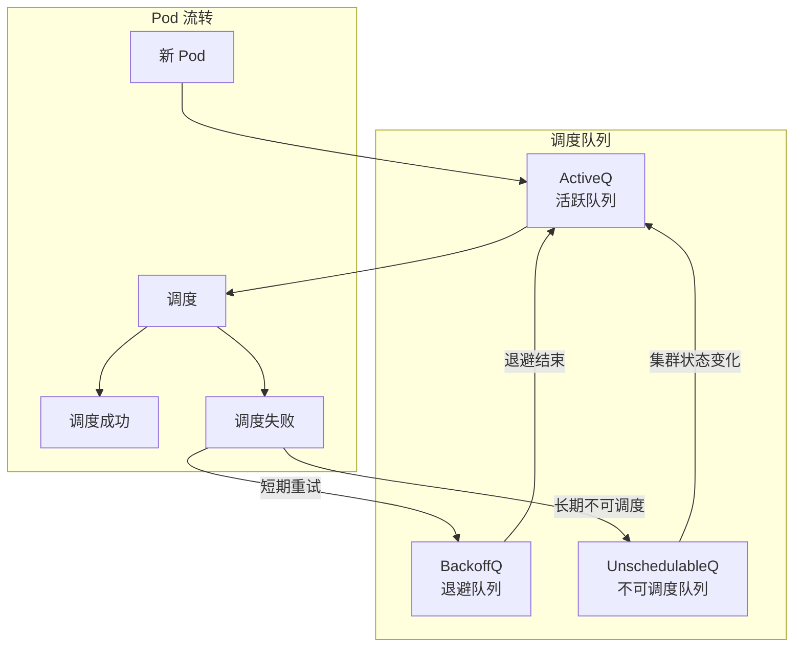

## 概述

Kubernetes Scheduler 负责将 Pod 调度到合适的节点上。在大规模集群中，调度器的性能直接影响 Pod 的创建速度。本章介绍调度器的性能调优策略。

## 调度性能指标

### 关键指标

```
┌─────────────────────────────────────────────────────────────────┐
│                    调度性能指标                                  │
├─────────────────────────────────────────────────────────────────┤
│                                                                  │
│  调度延迟:                                                       │
│  ├── e2e_scheduling_duration: 端到端调度时间                     │
│  ├── scheduling_algorithm_duration: 算法执行时间                 │
│  └── binding_duration: 绑定时间                                  │
│                                                                  │
│  调度吞吐量:                                                     │
│  ├── schedule_attempts_total: 调度尝试次数                       │
│  └── pods_scheduled: 每秒调度 Pod 数                             │
│                                                                  │
│  队列状态:                                                       │
│  ├── pending_pods: 待调度 Pod 数量                               │
│  ├── queue_depth: 各队列深度                                     │
│  └── unschedulable_pods: 不可调度 Pod 数量                       │
│                                                                  │
└─────────────────────────────────────────────────────────────────┘
```

### SLO 目标

```yaml
调度 SLO:
  # 调度延迟
  scheduling_latency_p99: < 5s

  # 调度吞吐量
  scheduling_throughput: > 100 pods/s (5000 节点集群)

  # 队列深度
  pending_pods: < 100 (正常情况)
```

## 参数调优

### percentageOfNodesToScore

```bash
# 评分节点比例
kube-scheduler \
  --percentageOfNodesToScore=50

# 说明:
# - 控制参与评分的节点比例
# - 当找到足够多的可行节点后停止过滤
# - 减少大集群中的评分开销
```

```yaml
# 配置文件方式
apiVersion: kubescheduler.config.k8s.io/v1
kind: KubeSchedulerConfiguration
percentageOfNodesToScore: 50

# 动态计算公式 (当未设置时):
# percentage = max(5, 50 - numNodes/125)
# 例如:
# - 100 节点: 50%
# - 5000 节点: 10%
```

### 并行处理

```yaml
# 调度器配置
apiVersion: kubescheduler.config.k8s.io/v1
kind: KubeSchedulerConfiguration
parallelism: 16  # 并行调度的 goroutine 数量

# 说明:
# - 默认值: 16
# - 影响预选和优选阶段的并行度
# - 增加可提升大集群调度吞吐量
```

### Profile 配置

```yaml
apiVersion: kubescheduler.config.k8s.io/v1
kind: KubeSchedulerConfiguration
profiles:
  - schedulerName: default-scheduler
    plugins:
      # 禁用不需要的插件
      score:
        disabled:
          - name: PodTopologySpread  # 如果不使用拓扑分布
          - name: InterPodAffinity   # 如果不使用 Pod 亲和性
        enabled:
          - name: NodeResourcesFit
            weight: 1
          - name: ImageLocality
            weight: 1
    pluginConfig:
      - name: NodeResourcesFit
        args:
          scoringStrategy:
            type: LeastAllocated
            resources:
              - name: cpu
                weight: 1
              - name: memory
                weight: 1
```

## 插件优化

### Filter 插件优化

```yaml
# 优化 Filter 插件顺序
# 快速失败的插件放在前面

profiles:
  - schedulerName: default-scheduler
    plugins:
      preFilter:
        enabled:
          - name: NodeResourcesFit    # 先检查资源
          - name: NodePorts          # 快速检查端口
          - name: PodTopologySpread  # 复杂检查放后面
      filter:
        enabled:
          - name: NodeUnschedulable  # 快速检查
          - name: NodeResourcesFit
          - name: NodeAffinity
          - name: TaintToleration
```

### Score 插件优化

```yaml
# 调整评分插件权重
profiles:
  - schedulerName: default-scheduler
    plugins:
      score:
        enabled:
          # 资源均衡
          - name: NodeResourcesBalancedAllocation
            weight: 1
          # 资源利用
          - name: NodeResourcesFit
            weight: 2
          # 镜像本地性 (如果集群节点存储镜像)
          - name: ImageLocality
            weight: 1
```

### 禁用不需要的插件

```yaml
# 根据实际需求禁用插件
profiles:
  - schedulerName: default-scheduler
    plugins:
      filter:
        disabled:
          # 如果不使用 VolumeBinding
          - name: VolumeBinding
          # 如果不使用 CSI 存储
          - name: CSILimits
      score:
        disabled:
          # 如果不关心镜像本地性
          - name: ImageLocality
          # 如果不使用 Pod 亲和性
          - name: InterPodAffinity
```

## 队列优化

### 队列配置

```yaml
apiVersion: kubescheduler.config.k8s.io/v1
kind: KubeSchedulerConfiguration
profiles:
  - schedulerName: default-scheduler
    # Pod 优先级排序
    plugins:
      queueSort:
        enabled:
          - name: PrioritySort

# Pod 优先级配置
apiVersion: scheduling.k8s.io/v1
kind: PriorityClass
metadata:
  name: high-priority
value: 1000000
globalDefault: false
description: "高优先级 Pod"
---
apiVersion: scheduling.k8s.io/v1
kind: PriorityClass
metadata:
  name: low-priority
value: 1000
globalDefault: true
description: "低优先级 Pod"
```

### 队列行为



## 缓存优化

### NodeInfo 缓存

```go
// 调度器使用 NodeInfo 缓存节点状态
// 避免每次调度都查询 API Server

type NodeInfo struct {
    node         *v1.Node
    pods         []*PodInfo
    requested    *Resource
    allocatable  *Resource
    // ...
}

// 缓存更新策略:
// - Informer 监听 Node 和 Pod 变化
// - 增量更新减少计算
```

### 快照机制

```go
// 调度器使用快照进行调度决策
// 快照在每个调度周期开始时创建

type Snapshot struct {
    nodeInfoMap  map[string]*NodeInfo
    nodeInfoList []*NodeInfo
    generation   int64
}

// 调度周期:
// 1. 创建快照
// 2. 使用快照进行预选和优选
// 3. 绑定使用最新状态
```

## 大规模集群优化

### 节点分组

```yaml
# 使用节点标签分组
# 减少每次调度的候选节点数

# 节点标签
kubectl label nodes node-1 topology.kubernetes.io/zone=zone-a
kubectl label nodes node-2 topology.kubernetes.io/zone=zone-b

# Pod 调度约束
apiVersion: v1
kind: Pod
spec:
  nodeSelector:
    topology.kubernetes.io/zone: zone-a
```

### 多调度器

```yaml
# 部署多个调度器实例
# 不同工作负载使用不同调度器

# 调度器 1: 处理普通工作负载
apiVersion: kubescheduler.config.k8s.io/v1
kind: KubeSchedulerConfiguration
profiles:
  - schedulerName: default-scheduler
---
# 调度器 2: 处理批处理工作负载
apiVersion: kubescheduler.config.k8s.io/v1
kind: KubeSchedulerConfiguration
profiles:
  - schedulerName: batch-scheduler
    plugins:
      score:
        enabled:
          - name: NodeResourcesFit
            weight: 1
          # 批处理优化的评分
```

```yaml
# Pod 指定调度器
apiVersion: v1
kind: Pod
spec:
  schedulerName: batch-scheduler
  containers:
    - name: batch-job
      image: batch-job:latest
```

### Extender 优化

```yaml
# 避免使用 Extender（性能开销大）
# 优先使用调度框架插件

# 如果必须使用 Extender:
apiVersion: kubescheduler.config.k8s.io/v1
kind: KubeSchedulerConfiguration
extenders:
  - urlPrefix: https://my-extender:443
    filterVerb: filter
    prioritizeVerb: prioritize
    # 设置合理的超时
    httpTimeout: 5s
    # 启用 TLS
    enableHTTPS: true
    # 缓存结果
    weight: 1
    # 限制调用
    managedResources:
      - name: example.com/gpu
        ignoredByScheduler: true
```

## 监控指标

### Prometheus 指标

```yaml
# 调度器关键指标

# 调度延迟
- scheduler_e2e_scheduling_duration_seconds_bucket
- scheduler_scheduling_algorithm_duration_seconds_bucket
- scheduler_binding_duration_seconds_bucket

# 调度结果
- scheduler_schedule_attempts_total{result="scheduled"}
- scheduler_schedule_attempts_total{result="unschedulable"}
- scheduler_schedule_attempts_total{result="error"}

# 队列深度
- scheduler_pending_pods{queue="active"}
- scheduler_pending_pods{queue="backoff"}
- scheduler_pending_pods{queue="unschedulable"}

# 抢占
- scheduler_preemption_attempts_total
- scheduler_preemption_victims
```

### 告警规则

```yaml
groups:
  - name: scheduler
    rules:
      # 调度延迟高
      - alert: SchedulerLatencyHigh
        expr: |
          histogram_quantile(0.99,
            sum(rate(scheduler_e2e_scheduling_duration_seconds_bucket[5m])) by (le)
          ) > 5
        for: 10m
        labels:
          severity: warning
        annotations:
          summary: "调度延迟过高"

      # 待调度 Pod 积压
      - alert: PendingPodsHigh
        expr: scheduler_pending_pods{queue="active"} > 100
        for: 10m
        labels:
          severity: warning
        annotations:
          summary: "待调度 Pod 数量过多"

      # 调度失败率高
      - alert: SchedulingFailureRateHigh
        expr: |
          rate(scheduler_schedule_attempts_total{result="error"}[5m]) /
          rate(scheduler_schedule_attempts_total[5m]) > 0.1
        for: 10m
        labels:
          severity: warning
        annotations:
          summary: "调度失败率过高"

      # 不可调度 Pod 过多
      - alert: UnschedulablePodsHigh
        expr: scheduler_pending_pods{queue="unschedulable"} > 50
        for: 30m
        labels:
          severity: warning
        annotations:
          summary: "不可调度 Pod 数量过多"
```

## 调优配置示例

### 小规模集群

```yaml
# < 100 节点
apiVersion: kubescheduler.config.k8s.io/v1
kind: KubeSchedulerConfiguration
parallelism: 16
percentageOfNodesToScore: 100  # 评分所有节点
profiles:
  - schedulerName: default-scheduler
```

### 中规模集群

```yaml
# 100-1000 节点
apiVersion: kubescheduler.config.k8s.io/v1
kind: KubeSchedulerConfiguration
parallelism: 16
percentageOfNodesToScore: 50
profiles:
  - schedulerName: default-scheduler
    plugins:
      score:
        disabled:
          - name: ImageLocality  # 减少评分开销
```

### 大规模集群

```yaml
# > 1000 节点
apiVersion: kubescheduler.config.k8s.io/v1
kind: KubeSchedulerConfiguration
parallelism: 32
percentageOfNodesToScore: 10
profiles:
  - schedulerName: default-scheduler
    plugins:
      filter:
        disabled:
          - name: VolumeBinding  # 如不需要
      score:
        disabled:
          - name: ImageLocality
          - name: InterPodAffinity  # 如不需要
          - name: PodTopologySpread  # 如不需要
```

## 故障排查

### 调度问题诊断

```bash
# 查看待调度 Pod
kubectl get pods --field-selector=status.phase=Pending

# 查看 Pod 调度事件
kubectl describe pod <pod-name>

# 查看调度器日志
kubectl logs -n kube-system <scheduler-pod> | grep -i "Unable to schedule"

# 检查节点资源
kubectl describe nodes | grep -A 5 "Allocated resources"

# 检查调度器指标
kubectl get --raw /metrics | grep scheduler_
```

### 性能分析

```bash
# 启用 profiling
kube-scheduler --profiling=true

# 获取 CPU profile
curl http://localhost:10251/debug/pprof/profile?seconds=30 > cpu.prof
go tool pprof cpu.prof

# 获取内存 profile
curl http://localhost:10251/debug/pprof/heap > heap.prof
go tool pprof heap.prof
```

## 总结

Scheduler 调优核心要点：

**参数调优**
- percentageOfNodesToScore 控制评分节点比例
- parallelism 控制并行度
- 根据集群规模调整

**插件优化**
- 禁用不需要的插件
- 调整 Filter 插件顺序
- 优化 Score 插件权重

**大规模优化**
- 使用节点分组
- 考虑多调度器
- 避免 Extender

**监控告警**
- 监控调度延迟
- 监控队列深度
- 监控调度失败率
