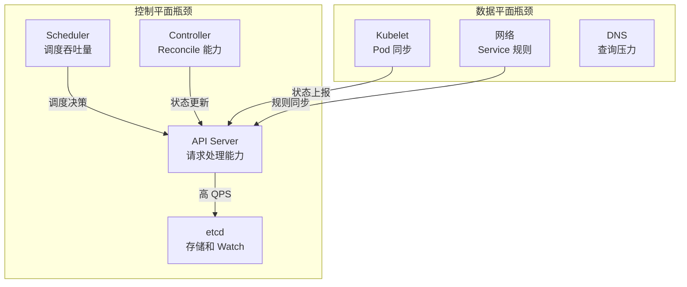
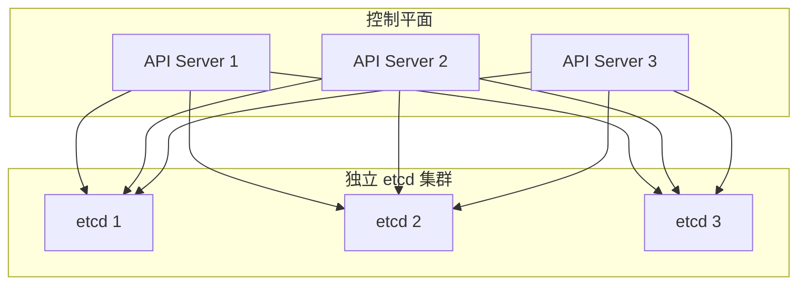
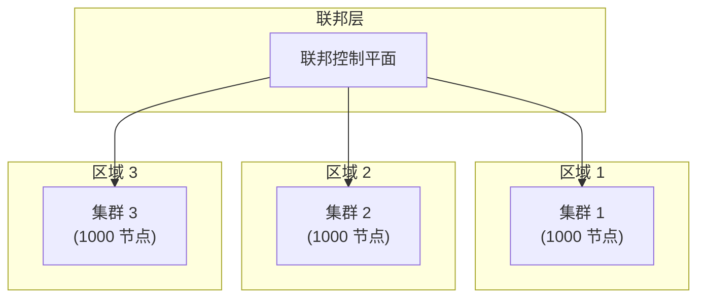

## 概述

Kubernetes 官方测试支持 5000 节点的集群规模。但在实际生产环境中，大规模集群面临诸多挑战：API Server 压力、etcd 性能、调度效率、网络开销等。本章介绍大规模集群的优化策略。

## 规模限制

### 官方测试规模

```
┌─────────────────────────────────────────────────────────────────┐
│                    Kubernetes 规模限制                           │
├─────────────────────────────────────────────────────────────────┤
│                                                                  │
│  官方测试规模 (v1.28):                                           │
│  ├── 节点数: 5000                                                │
│  ├── Pod 总数: 150000                                            │
│  ├── Pod/节点: 30 (压测) / 110 (限制)                            │
│  ├── Service 数: 10000                                           │
│  └── 后端 Pod/Service: 5000                                      │
│                                                                  │
│  单节点限制:                                                     │
│  ├── Pod 数: 110 (默认)                                          │
│  ├── 容器数: 无硬限制                                            │
│  └── 取决于节点资源                                              │
│                                                                  │
│  API 对象限制:                                                   │
│  ├── 单对象大小: 1.5 MB                                          │
│  ├── etcd 值大小: 1.5 MB                                         │
│  └── 总 etcd 数据: 建议 < 8 GB                                   │
│                                                                  │
└─────────────────────────────────────────────────────────────────┘
```

### 常见瓶颈



## 控制平面优化

### API Server 扩展

```yaml
# 多实例部署
# 至少 3 个 API Server 实例

# 资源配置
apiVersion: v1
kind: Pod
metadata:
  name: kube-apiserver
spec:
  containers:
    - name: kube-apiserver
      resources:
        requests:
          cpu: "4"
          memory: "8Gi"
        limits:
          cpu: "8"
          memory: "16Gi"

# 启动参数
kube-apiserver \
  --max-requests-inflight=1600 \
  --max-mutating-requests-inflight=800 \
  --watch-cache-sizes=pods#5000,nodes#1000 \
  --enable-priority-and-fairness=true
```

### etcd 优化

```bash
# etcd 集群配置
# 3 或 5 节点集群

# 硬件要求
# - NVMe SSD (必须)
# - 16+ GB 内存
# - 低延迟网络

# 启动参数
etcd \
  --quota-backend-bytes=8589934592 \
  --snapshot-count=10000 \
  --auto-compaction-retention=1h \
  --heartbeat-interval=100 \
  --election-timeout=1000
```

### Controller Manager 分片

```yaml
# 水平分片 (按命名空间)
# 启动多个 Controller Manager 实例
# 每个实例负责一部分命名空间

# 方案 1: 使用 leader election 命名空间分区
# (需要自定义实现)

# 方案 2: 使用外部调度器如 Gardener
# 支持 sharded controller manager
```

### Scheduler 扩展

```yaml
# 多调度器
# 不同工作负载使用不同调度器

apiVersion: kubescheduler.config.k8s.io/v1
kind: KubeSchedulerConfiguration
profiles:
  - schedulerName: default-scheduler
    # 配置...
  - schedulerName: batch-scheduler
    # 批处理优化配置
```

## etcd 分离部署

### 独立 etcd 集群



### etcd 事件分离

```bash
# 分离事件存储
kube-apiserver \
  --etcd-servers=https://etcd1:2379,https://etcd2:2379,https://etcd3:2379 \
  --etcd-servers-overrides=/events#https://etcd-events1:2379,https://etcd-events2:2379,https://etcd-events3:2379

# 事件 etcd 集群
# - 独立的 etcd 集群存储 events
# - 减少主 etcd 压力
# - 可以使用较低配置
```

## 网络优化

### kube-proxy 替代方案

```yaml
# 使用 Cilium 替代 kube-proxy
# Cilium eBPF 实现 Service

cilium:
  kubeProxyReplacement: strict
  k8sServiceHost: api.example.com
  k8sServicePort: 6443
  # eBPF 优化
  bpf:
    masquerade: true
    lbMapMax: 65536
```

### EndpointSlice 优化

```yaml
# 确保使用 EndpointSlice
# 减少大 Service 的更新开销

# 每个 EndpointSlice 最多 100 个端点
# 自动分片大 Service
```

### 网络策略

```yaml
# 大规模集群的网络策略建议

# 1. 使用命名空间级默认策略
apiVersion: networking.k8s.io/v1
kind: NetworkPolicy
metadata:
  name: default-deny
  namespace: production
spec:
  podSelector: {}
  policyTypes:
    - Ingress
    - Egress

# 2. 避免过于复杂的策略
# 3. 使用 namespaceSelector 而非 podSelector
```

## 调度优化

### 节点分组

```yaml
# 使用标签分组节点
kubectl label nodes node-1 pool=general
kubectl label nodes node-2 pool=gpu
kubectl label nodes node-3 pool=highmem

# Pod 使用 nodeSelector
apiVersion: v1
kind: Pod
spec:
  nodeSelector:
    pool: general
```

### 拓扑分布

```yaml
# 使用 topologySpreadConstraints
apiVersion: apps/v1
kind: Deployment
spec:
  template:
    spec:
      topologySpreadConstraints:
        - maxSkew: 1
          topologyKey: topology.kubernetes.io/zone
          whenUnsatisfiable: DoNotSchedule
          labelSelector:
            matchLabels:
              app: my-app
```

### 调度器配置

```yaml
apiVersion: kubescheduler.config.k8s.io/v1
kind: KubeSchedulerConfiguration
# 减少评分节点比例
percentageOfNodesToScore: 10
# 增加并行度
parallelism: 32
profiles:
  - schedulerName: default-scheduler
    plugins:
      # 禁用不需要的插件
      score:
        disabled:
          - name: ImageLocality
          - name: InterPodAffinity
```

## 存储优化

### StorageClass 优化

```yaml
apiVersion: storage.k8s.io/v1
kind: StorageClass
metadata:
  name: fast-storage
provisioner: kubernetes.io/aws-ebs
parameters:
  type: gp3
  iops: "3000"
  throughput: "125"
# 延迟绑定
volumeBindingMode: WaitForFirstConsumer
# 允许扩展
allowVolumeExpansion: true
```

### CSI 优化

```yaml
# CSI 驱动配置
# 增加超时和重试

# 控制器部署
args:
  - --timeout=300s
  - --retry-interval-start=1s
  - --retry-interval-max=5m
```

## 监控和可观测性

### 采样策略

```yaml
# 大规模集群监控优化

# 1. 使用采样
# Prometheus 配置
global:
  scrape_interval: 30s  # 增加采集间隔
  evaluation_interval: 30s

# 2. 联邦和分片
# 多个 Prometheus 实例，按命名空间分片

# 3. 指标过滤
# 只采集必要的指标
```

### 日志聚合

```yaml
# 日志优化

# 1. 使用 DaemonSet 采集
# 而非 Sidecar

# 2. 本地缓冲
# 减少网络传输

# 3. 结构化日志
# 便于过滤和分析
```

## 多集群架构

### 集群联邦



### 集群分片

```yaml
# 按业务线或租户分片

# 集群 1: 生产环境 A
# 集群 2: 生产环境 B
# 集群 3: 开发/测试

# 使用工具:
# - Karmada
# - Clusternet
# - Liqo
```

## 配置示例

### 5000 节点集群配置

```yaml
# API Server
kube-apiserver:
  max-requests-inflight: 1600
  max-mutating-requests-inflight: 800
  watch-cache-sizes: "pods#5000,nodes#1000,services#1000"
  enable-priority-and-fairness: true

# etcd
etcd:
  quota-backend-bytes: 8589934592
  snapshot-count: 10000
  auto-compaction-retention: 1h
  # 独立事件存储

# Controller Manager
controller-manager:
  concurrent-deployment-syncs: 10
  concurrent-replicaset-syncs: 10
  concurrent-statefulset-syncs: 10

# Scheduler
scheduler:
  percentageOfNodesToScore: 10
  parallelism: 32

# Kubelet
kubelet:
  max-pods: 110
  serialize-image-pulls: false
  max-parallel-image-pulls: 5
  kube-reserved:
    cpu: "1"
    memory: "2Gi"
  system-reserved:
    cpu: "1"
    memory: "2Gi"
```

## 最佳实践

### 容量规划

```yaml
# 容量规划检查清单

控制平面:
  - API Server 实例数 >= 3
  - etcd 节点数 = 3 或 5
  - 网络延迟 < 10ms (etcd 成员间)

节点规划:
  - 每节点 Pod 数 < 100
  - 预留系统资源 (kube-reserved + system-reserved)
  - 监控资源使用趋势

存储规划:
  - etcd 数据量 < 8GB
  - 定期压缩和碎片整理
  - 备份策略
```

### 渐进式扩展

```bash
# 扩展步骤

# 1. 基准测试
# - 测量当前性能指标
# - 识别瓶颈

# 2. 配置优化
# - 调整参数
# - 验证效果

# 3. 扩展基础设施
# - 增加 API Server
# - 升级 etcd 硬件

# 4. 扩展节点
# - 分批添加节点
# - 监控稳定性

# 5. 持续监控
# - 设置告警
# - 定期审查
```

## 总结

大规模集群优化要点：

**控制平面**
- 多 API Server 实例
- 独立 etcd 集群
- 分离事件存储
- Controller 分片

**网络**
- 使用 IPVS 或 eBPF
- EndpointSlice
- 合理的网络策略

**调度**
- 节点分组
- 减少评分节点比例
- 多调度器

**运维**
- 容量规划
- 渐进式扩展
- 持续监控

**架构**
- 考虑多集群
- 集群联邦
- 业务分片
