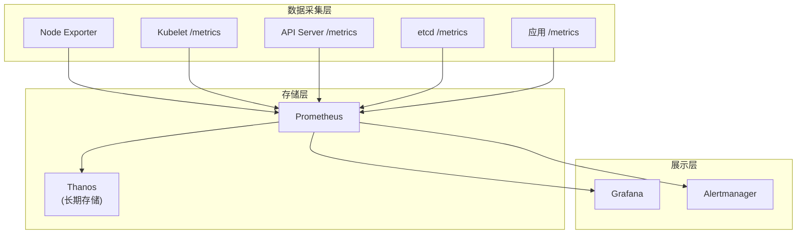

## 概述

有效的性能监控是 Kubernetes 集群运维的基础。通过监控关键指标，可以及时发现性能瓶颈、预测容量需求、指导调优决策。本章介绍 Kubernetes 性能监控的完整方案。

## 监控体系架构

### 监控栈组成



### 指标来源

```
Kubernetes 指标来源:

1. API Server (/metrics)
   - 请求延迟和吞吐量
   - etcd 请求指标
   - 认证授权指标

2. Kubelet (/metrics, /metrics/cadvisor, /metrics/probes)
   - Pod 启动延迟
   - 容器资源使用
   - 卷操作指标

3. kube-scheduler (/metrics)
   - 调度延迟
   - 队列深度
   - 调度结果

4. kube-controller-manager (/metrics)
   - 工作队列指标
   - Reconcile 延迟
   - 控制器状态

5. etcd (/metrics)
   - Raft 状态
   - 存储指标
   - 网络指标

6. kube-proxy (/metrics)
   - 规则同步延迟
   - 网络编程时间

7. CoreDNS (/metrics)
   - DNS 请求延迟
   - 缓存命中率
```

## 关键指标

### API Server 指标

```yaml
# API Server 关键指标

# 请求延迟 (SLI)
- apiserver_request_duration_seconds_bucket
- apiserver_request_duration_seconds_sum
- apiserver_request_duration_seconds_count

# 计算 p99 延迟
expr: |
  histogram_quantile(0.99,
    sum(rate(apiserver_request_duration_seconds_bucket{verb!~"WATCH|CONNECT"}[5m])) by (le, verb, resource)
  )

# 请求计数
- apiserver_request_total{code, verb, resource}

# 当前并发
- apiserver_current_inflight_requests{request_kind}

# etcd 请求延迟
- etcd_request_duration_seconds_bucket

# Watch 连接数
- apiserver_longrunning_requests{verb="WATCH"}

# 错误率
expr: |
  sum(rate(apiserver_request_total{code=~"5.."}[5m])) /
  sum(rate(apiserver_request_total[5m]))
```

### Scheduler 指标

```yaml
# Scheduler 关键指标

# 调度延迟 (端到端)
- scheduler_e2e_scheduling_duration_seconds_bucket

# 调度算法延迟
- scheduler_scheduling_algorithm_duration_seconds_bucket

# 绑定延迟
- scheduler_binding_duration_seconds_bucket

# 待调度 Pod
- scheduler_pending_pods{queue}

# 调度尝试
- scheduler_schedule_attempts_total{result}

# 抢占指标
- scheduler_preemption_attempts_total
- scheduler_preemption_victims

# 计算调度吞吐量
expr: |
  sum(rate(scheduler_schedule_attempts_total{result="scheduled"}[5m]))
```

### Kubelet 指标

```yaml
# Kubelet 关键指标

# Pod 启动延迟
- kubelet_pod_start_duration_seconds_bucket

# Pod Worker 延迟
- kubelet_pod_worker_duration_seconds_bucket

# 容器操作延迟
- kubelet_container_operations_duration_seconds_bucket
- kubelet_container_operations_errors_total

# 运行时操作
- kubelet_runtime_operations_duration_seconds_bucket
- kubelet_runtime_operations_errors_total

# PLEG 指标
- kubelet_pleg_relist_duration_seconds_bucket
- kubelet_pleg_relist_interval_seconds_bucket

# 卷操作
- storage_operation_duration_seconds_bucket

# 节点资源
- kubelet_node_status_capacity
- kubelet_node_status_allocatable
```

### etcd 指标

```yaml
# etcd 关键指标

# Leader 状态
- etcd_server_is_leader
- etcd_server_leader_changes_seen_total

# 磁盘操作
- etcd_disk_wal_fsync_duration_seconds_bucket
- etcd_disk_backend_commit_duration_seconds_bucket

# 存储大小
- etcd_mvcc_db_total_size_in_bytes
- etcd_mvcc_db_total_size_in_use_in_bytes

# 键数量
- etcd_debugging_mvcc_keys_total

# 网络延迟
- etcd_network_peer_round_trip_time_seconds_bucket

# 提案指标
- etcd_server_proposals_committed_total
- etcd_server_proposals_applied_total
- etcd_server_proposals_pending
- etcd_server_proposals_failed_total
```

## Prometheus 配置

### 采集配置

```yaml
# prometheus.yml
global:
  scrape_interval: 15s
  evaluation_interval: 15s

scrape_configs:
  # API Server
  - job_name: 'kubernetes-apiservers'
    kubernetes_sd_configs:
      - role: endpoints
    scheme: https
    tls_config:
      ca_file: /var/run/secrets/kubernetes.io/serviceaccount/ca.crt
    bearer_token_file: /var/run/secrets/kubernetes.io/serviceaccount/token
    relabel_configs:
      - source_labels: [__meta_kubernetes_namespace, __meta_kubernetes_service_name, __meta_kubernetes_endpoint_port_name]
        action: keep
        regex: default;kubernetes;https

  # Kubelet
  - job_name: 'kubernetes-nodes'
    kubernetes_sd_configs:
      - role: node
    scheme: https
    tls_config:
      ca_file: /var/run/secrets/kubernetes.io/serviceaccount/ca.crt
    bearer_token_file: /var/run/secrets/kubernetes.io/serviceaccount/token
    relabel_configs:
      - action: labelmap
        regex: __meta_kubernetes_node_label_(.+)

  # cAdvisor
  - job_name: 'kubernetes-cadvisor'
    kubernetes_sd_configs:
      - role: node
    scheme: https
    tls_config:
      ca_file: /var/run/secrets/kubernetes.io/serviceaccount/ca.crt
    bearer_token_file: /var/run/secrets/kubernetes.io/serviceaccount/token
    metrics_path: /metrics/cadvisor
```

### 记录规则

```yaml
# recording_rules.yml
groups:
  - name: kubernetes-performance
    interval: 30s
    rules:
      # API Server 请求延迟 p99
      - record: apiserver:request_latency:p99
        expr: |
          histogram_quantile(0.99,
            sum(rate(apiserver_request_duration_seconds_bucket{verb!~"WATCH|CONNECT"}[5m])) by (le)
          )

      # 调度吞吐量
      - record: scheduler:scheduling_throughput:rate5m
        expr: |
          sum(rate(scheduler_schedule_attempts_total{result="scheduled"}[5m]))

      # Pod 启动延迟 p99
      - record: kubelet:pod_start_latency:p99
        expr: |
          histogram_quantile(0.99,
            sum(rate(kubelet_pod_start_duration_seconds_bucket[5m])) by (le)
          )

      # etcd 磁盘延迟 p99
      - record: etcd:disk_latency:p99
        expr: |
          histogram_quantile(0.99,
            sum(rate(etcd_disk_wal_fsync_duration_seconds_bucket[5m])) by (le)
          )

      # 集群 Pod 总数
      - record: cluster:pod_count:total
        expr: sum(kubelet_running_pods)

      # 集群节点数
      - record: cluster:node_count:total
        expr: count(kube_node_info)
```

## 告警规则

### 控制平面告警

```yaml
groups:
  - name: control-plane-alerts
    rules:
      # API Server 延迟高
      - alert: APIServerLatencyP99High
        expr: apiserver:request_latency:p99 > 1
        for: 10m
        labels:
          severity: warning
        annotations:
          summary: "API Server p99 延迟超过 1 秒"
          description: "API Server 请求 p99 延迟为 {{ $value | humanizeDuration }}"

      # API Server 错误率高
      - alert: APIServerErrorRateHigh
        expr: |
          sum(rate(apiserver_request_total{code=~"5.."}[5m])) /
          sum(rate(apiserver_request_total[5m])) > 0.01
        for: 10m
        labels:
          severity: warning
        annotations:
          summary: "API Server 错误率超过 1%"

      # etcd 没有 Leader
      - alert: EtcdNoLeader
        expr: etcd_server_has_leader == 0
        for: 1m
        labels:
          severity: critical
        annotations:
          summary: "etcd 集群没有 Leader"

      # etcd 磁盘延迟高
      - alert: EtcdDiskLatencyHigh
        expr: etcd:disk_latency:p99 > 0.5
        for: 10m
        labels:
          severity: warning
        annotations:
          summary: "etcd 磁盘延迟过高"

      # Scheduler 延迟高
      - alert: SchedulerLatencyHigh
        expr: |
          histogram_quantile(0.99,
            sum(rate(scheduler_e2e_scheduling_duration_seconds_bucket[5m])) by (le)
          ) > 5
        for: 10m
        labels:
          severity: warning
        annotations:
          summary: "调度延迟 p99 超过 5 秒"

      # 待调度 Pod 积压
      - alert: PendingPodsHigh
        expr: scheduler_pending_pods{queue="active"} > 100
        for: 15m
        labels:
          severity: warning
        annotations:
          summary: "待调度 Pod 数量过多"
```

### 节点告警

```yaml
groups:
  - name: node-alerts
    rules:
      # Pod 启动延迟高
      - alert: PodStartLatencyHigh
        expr: kubelet:pod_start_latency:p99 > 30
        for: 10m
        labels:
          severity: warning
        annotations:
          summary: "Pod 启动延迟 p99 超过 30 秒"

      # PLEG 不健康
      - alert: PLEGNotHealthy
        expr: |
          histogram_quantile(0.99,
            sum(rate(kubelet_pleg_relist_duration_seconds_bucket[5m])) by (le, instance)
          ) > 10
        for: 5m
        labels:
          severity: critical
        annotations:
          summary: "PLEG 不健康，可能导致节点 NotReady"

      # 容器运行时错误
      - alert: ContainerRuntimeErrors
        expr: rate(kubelet_runtime_operations_errors_total[5m]) > 0.1
        for: 10m
        labels:
          severity: warning
        annotations:
          summary: "容器运行时错误率过高"

      # 节点内存压力
      - alert: NodeMemoryPressure
        expr: |
          (1 - (node_memory_MemAvailable_bytes / node_memory_MemTotal_bytes)) > 0.9
        for: 5m
        labels:
          severity: warning
        annotations:
          summary: "节点内存使用率超过 90%"

      # 节点磁盘压力
      - alert: NodeDiskPressure
        expr: |
          (1 - (node_filesystem_avail_bytes{fstype!~"tmpfs|overlay"} / node_filesystem_size_bytes)) > 0.85
        for: 5m
        labels:
          severity: warning
        annotations:
          summary: "节点磁盘使用率超过 85%"
```

## Grafana 仪表盘

### 控制平面仪表盘

```json
{
  "dashboard": {
    "title": "Kubernetes Control Plane",
    "panels": [
      {
        "title": "API Server Request Latency p99",
        "type": "timeseries",
        "targets": [{
          "expr": "histogram_quantile(0.99, sum(rate(apiserver_request_duration_seconds_bucket{verb!~\"WATCH|CONNECT\"}[5m])) by (le, verb))"
        }]
      },
      {
        "title": "API Server Request Rate",
        "type": "timeseries",
        "targets": [{
          "expr": "sum(rate(apiserver_request_total[5m])) by (verb)"
        }]
      },
      {
        "title": "API Server Inflight Requests",
        "type": "gauge",
        "targets": [{
          "expr": "apiserver_current_inflight_requests"
        }]
      },
      {
        "title": "etcd Request Latency p99",
        "type": "timeseries",
        "targets": [{
          "expr": "histogram_quantile(0.99, sum(rate(etcd_request_duration_seconds_bucket[5m])) by (le, operation))"
        }]
      },
      {
        "title": "Scheduler E2E Latency p99",
        "type": "timeseries",
        "targets": [{
          "expr": "histogram_quantile(0.99, sum(rate(scheduler_e2e_scheduling_duration_seconds_bucket[5m])) by (le))"
        }]
      },
      {
        "title": "Pending Pods",
        "type": "stat",
        "targets": [{
          "expr": "scheduler_pending_pods"
        }]
      }
    ]
  }
}
```

### 节点性能仪表盘

```json
{
  "dashboard": {
    "title": "Node Performance",
    "panels": [
      {
        "title": "Pod Start Latency p99",
        "type": "timeseries",
        "targets": [{
          "expr": "histogram_quantile(0.99, sum(rate(kubelet_pod_start_duration_seconds_bucket[5m])) by (le, instance))"
        }]
      },
      {
        "title": "Container Operations Rate",
        "type": "timeseries",
        "targets": [{
          "expr": "sum(rate(kubelet_container_operations_duration_seconds_count[5m])) by (operation_type)"
        }]
      },
      {
        "title": "PLEG Relist Duration p99",
        "type": "timeseries",
        "targets": [{
          "expr": "histogram_quantile(0.99, sum(rate(kubelet_pleg_relist_duration_seconds_bucket[5m])) by (le, instance))"
        }]
      },
      {
        "title": "Running Pods per Node",
        "type": "timeseries",
        "targets": [{
          "expr": "kubelet_running_pods"
        }]
      }
    ]
  }
}
```

## 性能分析工具

### pprof 分析

```bash
# 获取 CPU profile
kubectl get --raw /debug/pprof/profile?seconds=30 > cpu.prof

# 获取堆内存 profile
kubectl get --raw /debug/pprof/heap > heap.prof

# 获取 goroutine 信息
kubectl get --raw /debug/pprof/goroutine?debug=2 > goroutines.txt

# 分析 profile
go tool pprof -http=:8080 cpu.prof
```

### 追踪分析

```yaml
# 启用 API Server 追踪
kube-apiserver \
  --tracing-config-file=/etc/kubernetes/tracing-config.yaml

# tracing-config.yaml
apiVersion: apiserver.config.k8s.io/v1alpha1
kind: TracingConfiguration
endpoint: otel-collector:4317
samplingRatePerMillion: 1000
```

## 容量规划

### 资源趋势分析

```yaml
# 资源使用趋势查询

# CPU 使用趋势
expr: |
  avg_over_time(
    sum(rate(container_cpu_usage_seconds_total{namespace!="kube-system"}[5m]))[7d:1h]
  )

# 内存使用趋势
expr: |
  avg_over_time(
    sum(container_memory_working_set_bytes{namespace!="kube-system"})[7d:1h]
  )

# Pod 数量趋势
expr: |
  avg_over_time(cluster:pod_count:total[7d:1h])
```

### 预测查询

```yaml
# 使用 PromQL 预测

# 磁盘空间预测 (线性回归)
expr: |
  predict_linear(
    node_filesystem_avail_bytes{fstype!~"tmpfs|overlay"}[7d],
    30 * 24 * 3600
  )

# 预测 30 天后的值
```

## 总结

性能监控核心要点：

**指标体系**
- API Server 指标（延迟、吞吐、错误率）
- Scheduler 指标（调度延迟、队列深度）
- Kubelet 指标（Pod 启动、PLEG）
- etcd 指标（磁盘、网络、存储）

**告警策略**
- 基于 SLO 设置告警阈值
- 分级告警（warning/critical）
- 避免告警疲劳

**可视化**
- 控制平面仪表盘
- 节点性能仪表盘
- 资源趋势仪表盘

**分析工具**
- pprof 性能分析
- 分布式追踪
- 容量规划预测
