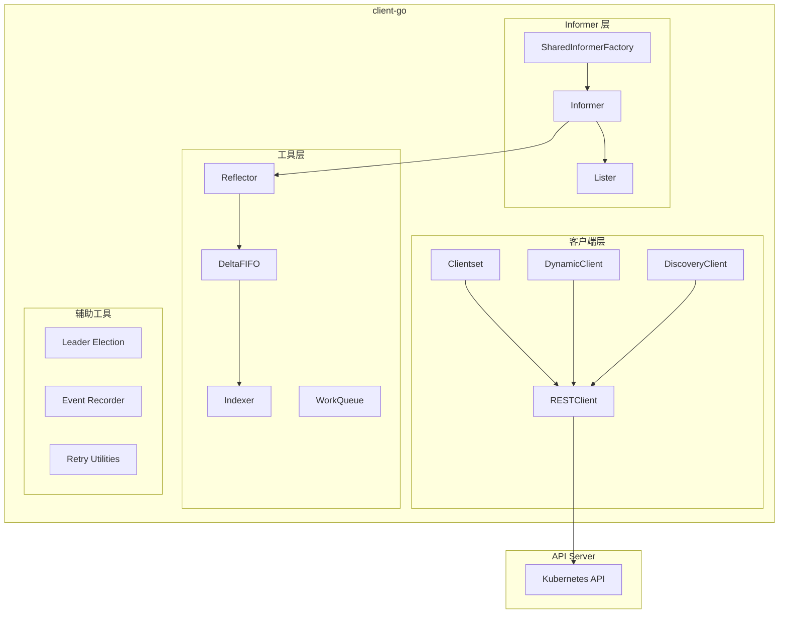
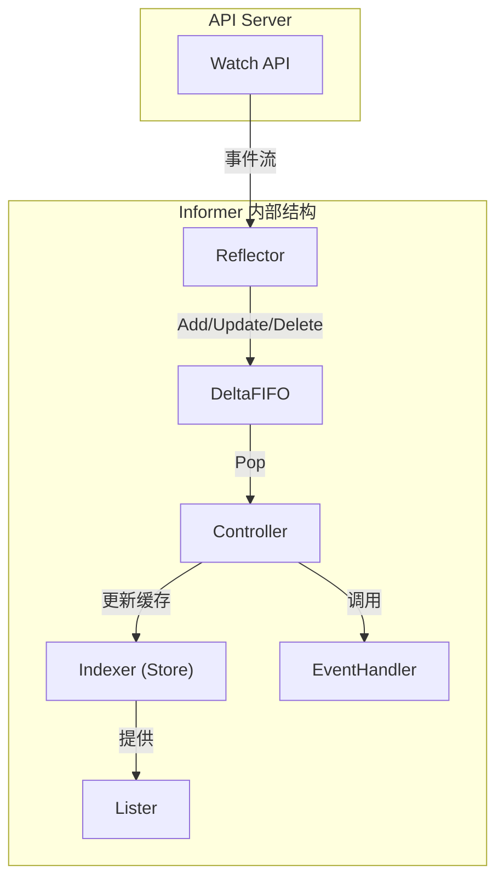

## 概述

client-go 是 Kubernetes 官方提供的 Go 语言客户端库，用于与 Kubernetes API Server 进行交互。它是开发 Kubernetes 控制器、Operator 和各种集成工具的基础。本章介绍 client-go 的整体架构和核心组件。

## 整体架构

### 组件结构



### 代码目录结构

```
staging/src/k8s.io/client-go/
├── discovery/         # 资源发现客户端
├── dynamic/           # 动态客户端
├── informers/         # SharedInformerFactory
├── kubernetes/        # 类型化 Clientset
├── listers/           # Lister 接口
├── plugin/            # 认证插件
├── rest/              # REST 客户端
├── scale/             # Scale 客户端
├── tools/
│   ├── cache/         # Informer、Reflector、DeltaFIFO
│   ├── clientcmd/     # kubeconfig 处理
│   ├── leaderelection/# Leader 选举
│   ├── record/        # 事件记录
│   └── watch/         # Watch 工具
├── transport/         # HTTP 传输层
└── util/
    ├── retry/         # 重试工具
    └── workqueue/     # 工作队列
```

## 客户端类型

### RESTClient

```go
// RESTClient 是最底层的客户端
// 直接与 API Server 进行 HTTP 交互

import "k8s.io/client-go/rest"

// 创建 RESTClient
config, err := rest.InClusterConfig()
if err != nil {
    panic(err)
}

// 设置 API 路径
config.APIPath = "/api"
config.GroupVersion = &v1.SchemeGroupVersion
config.NegotiatedSerializer = scheme.Codecs

restClient, err := rest.RESTClientFor(config)
if err != nil {
    panic(err)
}

// 发送请求
result := &v1.PodList{}
err = restClient.Get().
    Namespace("default").
    Resource("pods").
    Do(context.TODO()).
    Into(result)
```

### Clientset

```go
// Clientset 是类型化客户端
// 提供所有内置资源的类型安全访问

import "k8s.io/client-go/kubernetes"

// 创建 Clientset
clientset, err := kubernetes.NewForConfig(config)
if err != nil {
    panic(err)
}

// 访问核心 API
pods, err := clientset.CoreV1().Pods("default").List(context.TODO(), metav1.ListOptions{})

// 访问 apps API
deployments, err := clientset.AppsV1().Deployments("default").List(context.TODO(), metav1.ListOptions{})

// 访问 batch API
jobs, err := clientset.BatchV1().Jobs("default").List(context.TODO(), metav1.ListOptions{})
```

### DynamicClient

```go
// DynamicClient 是非类型化客户端
// 用于访问任意资源（包括 CRD）

import (
    "k8s.io/client-go/dynamic"
    "k8s.io/apimachinery/pkg/runtime/schema"
)

// 创建 DynamicClient
dynamicClient, err := dynamic.NewForConfig(config)
if err != nil {
    panic(err)
}

// 定义 GVR
gvr := schema.GroupVersionResource{
    Group:    "apps",
    Version:  "v1",
    Resource: "deployments",
}

// 获取资源
unstructuredList, err := dynamicClient.Resource(gvr).
    Namespace("default").
    List(context.TODO(), metav1.ListOptions{})
```

### DiscoveryClient

```go
// DiscoveryClient 用于发现 API 资源

import "k8s.io/client-go/discovery"

// 创建 DiscoveryClient
discoveryClient, err := discovery.NewDiscoveryClientForConfig(config)
if err != nil {
    panic(err)
}

// 获取 API 组
apiGroups, err := discoveryClient.ServerGroups()

// 获取 API 资源
resources, err := discoveryClient.ServerResources()

// 获取服务器版本
version, err := discoveryClient.ServerVersion()
```

## Informer 机制

### SharedInformerFactory

```go
// SharedInformerFactory 管理所有 Informer
// 确保每种资源只有一个 Informer

import (
    "k8s.io/client-go/informers"
    "time"
)

// 创建 SharedInformerFactory
factory := informers.NewSharedInformerFactory(clientset, 30*time.Second)

// 获取特定资源的 Informer
podInformer := factory.Core().V1().Pods()
deploymentInformer := factory.Apps().V1().Deployments()

// 启动所有 Informer
stopCh := make(chan struct{})
factory.Start(stopCh)

// 等待缓存同步
factory.WaitForCacheSync(stopCh)
```

### Informer 组件



## 工具组件

### WorkQueue

```go
// WorkQueue 用于控制器的工作队列

import "k8s.io/client-go/util/workqueue"

// 基本队列
queue := workqueue.New()

// 延迟队列
delayingQueue := workqueue.NewDelayingQueue()

// 限速队列（最常用）
rateLimitingQueue := workqueue.NewRateLimitingQueue(
    workqueue.DefaultControllerRateLimiter(),
)

// 添加元素
queue.Add("key")

// 延迟添加
delayingQueue.AddAfter("key", 5*time.Second)

// 获取元素
key, shutdown := queue.Get()
if shutdown {
    return
}
defer queue.Done(key)

// 处理失败，重新入队
if err := process(key); err != nil {
    queue.AddRateLimited(key)
}
```

### Leader Election

```go
// Leader Election 用于高可用控制器

import (
    "k8s.io/client-go/tools/leaderelection"
    "k8s.io/client-go/tools/leaderelection/resourcelock"
)

// 创建锁
lock := &resourcelock.LeaseLock{
    LeaseMeta: metav1.ObjectMeta{
        Name:      "my-controller-lock",
        Namespace: "default",
    },
    Client: clientset.CoordinationV1(),
    LockConfig: resourcelock.ResourceLockConfig{
        Identity: hostname,
    },
}

// 配置选举
leaderelection.RunOrDie(ctx, leaderelection.LeaderElectionConfig{
    Lock:          lock,
    LeaseDuration: 15 * time.Second,
    RenewDeadline: 10 * time.Second,
    RetryPeriod:   2 * time.Second,
    Callbacks: leaderelection.LeaderCallbacks{
        OnStartedLeading: func(ctx context.Context) {
            // 成为 Leader，开始工作
            run(ctx)
        },
        OnStoppedLeading: func() {
            // 失去 Leader，停止工作
            log.Fatal("lost leader election")
        },
        OnNewLeader: func(identity string) {
            // 新 Leader 当选
            log.Printf("new leader: %s", identity)
        },
    },
})
```

## 配置管理

### kubeconfig 加载

```go
// 从文件加载配置
import "k8s.io/client-go/tools/clientcmd"

// 从默认位置加载
config, err := clientcmd.BuildConfigFromFlags("", clientcmd.RecommendedHomeFile)

// 从指定路径加载
config, err := clientcmd.BuildConfigFromFlags("", "/path/to/kubeconfig")

// 从集群内部加载（Pod 内）
config, err := rest.InClusterConfig()

// 通用加载（优先使用 kubeconfig，回退到 in-cluster）
config, err := clientcmd.BuildConfigFromFlags("", "")
if err != nil {
    config, err = rest.InClusterConfig()
}
```

### 配置选项

```go
// 配置 REST 客户端
config := &rest.Config{
    Host: "https://api.example.com:6443",
    TLSClientConfig: rest.TLSClientConfig{
        CAFile:   "/path/to/ca.crt",
        CertFile: "/path/to/client.crt",
        KeyFile:  "/path/to/client.key",
    },
    // 或使用 Bearer Token
    BearerToken: "my-token",

    // 超时设置
    Timeout: 30 * time.Second,

    // QPS 限制
    QPS:   50,
    Burst: 100,

    // 内容类型
    ContentType: "application/json",
    // 或使用 Protobuf
    // ContentType: "application/vnd.kubernetes.protobuf",
}
```

## 版本兼容性

### 版本对应关系

```
client-go 与 Kubernetes 版本对应:

client-go版本    Kubernetes版本
v0.28.x         v1.28.x
v0.27.x         v1.27.x
v0.26.x         v1.26.x
...

兼容性规则:
- client-go v0.N 与 Kubernetes v1.N 兼容
- client-go 可以与 +/- 2 个次版本的 API Server 交互
- 建议使用与集群版本匹配的 client-go
```

### 导入方式

```go
// Go modules 导入
// go.mod
module mycontroller

go 1.21

require (
    k8s.io/api v0.28.0
    k8s.io/apimachinery v0.28.0
    k8s.io/client-go v0.28.0
)

// 代码中导入
import (
    "k8s.io/api/core/v1"
    metav1 "k8s.io/apimachinery/pkg/apis/meta/v1"
    "k8s.io/client-go/kubernetes"
)
```

## 最佳实践

### 客户端选择

```go
// 选择合适的客户端

// 1. 内置资源 → Clientset
clientset.CoreV1().Pods(ns).Get(ctx, name, opts)

// 2. CRD 资源 → DynamicClient
dynamicClient.Resource(gvr).Namespace(ns).Get(ctx, name, opts)

// 3. 资源发现 → DiscoveryClient
discoveryClient.ServerResources()

// 4. 底层控制 → RESTClient
restClient.Get().Resource("pods").Do(ctx).Into(result)
```

### 错误处理

```go
// 处理常见错误
import "k8s.io/apimachinery/pkg/api/errors"

pod, err := clientset.CoreV1().Pods(ns).Get(ctx, name, metav1.GetOptions{})
if err != nil {
    if errors.IsNotFound(err) {
        // 资源不存在
        return nil
    }
    if errors.IsConflict(err) {
        // 版本冲突，需要重新获取并重试
        return retry()
    }
    if errors.IsForbidden(err) {
        // 权限不足
        return err
    }
    // 其他错误
    return err
}
```

## 总结

client-go 核心组件：

**客户端类型**
- RESTClient：底层 HTTP 客户端
- Clientset：类型化客户端
- DynamicClient：非类型化客户端
- DiscoveryClient：资源发现客户端

**Informer 机制**
- SharedInformerFactory：Informer 工厂
- Reflector：List-Watch 实现
- DeltaFIFO：增量队列
- Indexer：带索引的缓存
- Lister：缓存访问接口

**工具组件**
- WorkQueue：工作队列
- Leader Election：选举机制
- Event Recorder：事件记录
