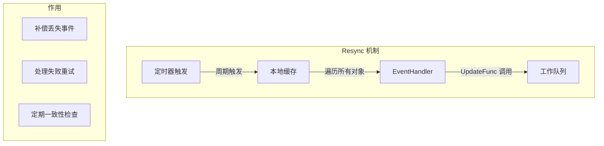

## 概述

Informer 是 client-go 中最重要的组件之一，它提供了高效的本地缓存和事件通知机制，是构建 Kubernetes 控制器的核心。本章深入讲解 Informer 的高级使用技巧。

## SharedInformerFactory

### 工厂模式

```go
// staging/src/k8s.io/client-go/informers/factory.go

// SharedInformerFactory 管理所有资源的 Informer
type SharedInformerFactory interface {
    // 获取内部 Informer 映射（用于测试）
    InformerFor(obj runtime.Object, newFunc NewInformerFunc) cache.SharedIndexInformer

    // 启动所有注册的 Informer
    Start(stopCh <-chan struct{})

    // 等待所有 Informer 缓存同步完成
    WaitForCacheSync(stopCh <-chan struct{}) map[reflect.Type]bool

    // 关闭工厂
    Shutdown()

    // 各 API 组访问器
    Core() core.Interface
    Apps() apps.Interface
    Batch() batch.Interface
    // ... 其他 API 组
}
```

### 创建工厂

```go
import (
    "time"

    "k8s.io/client-go/informers"
    "k8s.io/client-go/kubernetes"
)

// 基本创建
func createInformerFactory(clientset kubernetes.Interface) informers.SharedInformerFactory {
    // resyncPeriod 是定期完全同步的间隔
    // 0 表示禁用 resync
    return informers.NewSharedInformerFactory(clientset, 30*time.Second)
}

// 带选项创建
func createInformerFactoryWithOptions(clientset kubernetes.Interface) informers.SharedInformerFactory {
    return informers.NewSharedInformerFactoryWithOptions(
        clientset,
        30*time.Second,
        // 仅监听特定命名空间
        informers.WithNamespace("production"),
        // 添加自定义 Tweaks
        informers.WithTweakListOptions(func(opts *metav1.ListOptions) {
            opts.LabelSelector = "app=myapp"
        }),
    )
}

// 多命名空间工厂
func createMultiNamespaceFactory(clientset kubernetes.Interface, namespaces []string) map[string]informers.SharedInformerFactory {
    factories := make(map[string]informers.SharedInformerFactory)
    for _, ns := range namespaces {
        factories[ns] = informers.NewSharedInformerFactoryWithOptions(
            clientset,
            30*time.Second,
            informers.WithNamespace(ns),
        )
    }
    return factories
}
```

### 获取 Informer

```go
// 获取各种资源的 Informer
func getInformers(factory informers.SharedInformerFactory) {
    // Core API 组
    podInformer := factory.Core().V1().Pods()
    nodeInformer := factory.Core().V1().Nodes()
    serviceInformer := factory.Core().V1().Services()
    configMapInformer := factory.Core().V1().ConfigMaps()
    secretInformer := factory.Core().V1().Secrets()

    // Apps API 组
    deploymentInformer := factory.Apps().V1().Deployments()
    statefulSetInformer := factory.Apps().V1().StatefulSets()
    daemonSetInformer := factory.Apps().V1().DaemonSets()
    replicaSetInformer := factory.Apps().V1().ReplicaSets()

    // Batch API 组
    jobInformer := factory.Batch().V1().Jobs()
    cronJobInformer := factory.Batch().V1().CronJobs()

    // Networking API 组
    ingressInformer := factory.Networking().V1().Ingresses()
    networkPolicyInformer := factory.Networking().V1().NetworkPolicies()

    // 使用 Informer 和 Lister
    _ = podInformer.Informer()  // 获取底层 SharedIndexInformer
    _ = podInformer.Lister()    // 获取 Lister
}
```

## 事件处理

### EventHandler 接口

```go
// staging/src/k8s.io/client-go/tools/cache/shared_informer.go

// ResourceEventHandler 处理资源事件
type ResourceEventHandler interface {
    OnAdd(obj interface{}, isInInitialList bool)
    OnUpdate(oldObj, newObj interface{})
    OnDelete(obj interface{})
}

// ResourceEventHandlerFuncs 是便捷实现
type ResourceEventHandlerFuncs struct {
    AddFunc    func(obj interface{})
    UpdateFunc func(oldObj, newObj interface{})
    DeleteFunc func(obj interface{})
}
```

### 注册事件处理器

```go
import (
    corev1 "k8s.io/api/core/v1"
    "k8s.io/client-go/tools/cache"
)

func setupEventHandlers(podInformer cache.SharedIndexInformer) {
    // 方式 1: 使用 ResourceEventHandlerFuncs
    podInformer.AddEventHandler(cache.ResourceEventHandlerFuncs{
        AddFunc: func(obj interface{}) {
            pod := obj.(*corev1.Pod)
            fmt.Printf("Pod Added: %s/%s\n", pod.Namespace, pod.Name)
        },
        UpdateFunc: func(oldObj, newObj interface{}) {
            oldPod := oldObj.(*corev1.Pod)
            newPod := newObj.(*corev1.Pod)
            if oldPod.ResourceVersion == newPod.ResourceVersion {
                // 没有实际变化（可能是 resync）
                return
            }
            fmt.Printf("Pod Updated: %s/%s\n", newPod.Namespace, newPod.Name)
        },
        DeleteFunc: func(obj interface{}) {
            // 处理 DeletedFinalStateUnknown
            pod, ok := obj.(*corev1.Pod)
            if !ok {
                tombstone, ok := obj.(cache.DeletedFinalStateUnknown)
                if !ok {
                    return
                }
                pod, ok = tombstone.Obj.(*corev1.Pod)
                if !ok {
                    return
                }
            }
            fmt.Printf("Pod Deleted: %s/%s\n", pod.Namespace, pod.Name)
        },
    })

    // 方式 2: 带 Resync 周期的处理器
    podInformer.AddEventHandlerWithResyncPeriod(
        cache.ResourceEventHandlerFuncs{
            AddFunc:    func(obj interface{}) { /* ... */ },
            UpdateFunc: func(old, new interface{}) { /* ... */ },
            DeleteFunc: func(obj interface{}) { /* ... */ },
        },
        60*time.Second, // 独立的 resync 周期
    )
}
```

### 过滤事件处理器

```go
// FilteringResourceEventHandler 过滤不需要的事件
func setupFilteredHandler(informer cache.SharedIndexInformer) {
    informer.AddEventHandler(cache.FilteringResourceEventHandler{
        // 过滤函数
        FilterFunc: func(obj interface{}) bool {
            pod, ok := obj.(*corev1.Pod)
            if !ok {
                return false
            }
            // 只处理带有特定标签的 Pod
            return pod.Labels["managed-by"] == "my-controller"
        },
        // 实际处理器
        Handler: cache.ResourceEventHandlerFuncs{
            AddFunc: func(obj interface{}) {
                pod := obj.(*corev1.Pod)
                fmt.Printf("Filtered Pod Added: %s/%s\n", pod.Namespace, pod.Name)
            },
            UpdateFunc: func(oldObj, newObj interface{}) {
                // 只有通过过滤的对象才会到达这里
            },
            DeleteFunc: func(obj interface{}) {
                // 处理删除
            },
        },
    })
}
```

### 详细事件处理器

```go
// ResourceEventHandlerDetailedFuncs 提供更多上下文
type ResourceEventHandlerDetailedFuncs struct {
    AddFunc    func(obj interface{}, isInInitialList bool)
    UpdateFunc func(oldObj, newObj interface{})
    DeleteFunc func(obj interface{})
}

func setupDetailedHandler(informer cache.SharedIndexInformer) {
    informer.AddEventHandler(cache.ResourceEventHandlerDetailedFuncs{
        AddFunc: func(obj interface{}, isInInitialList bool) {
            pod := obj.(*corev1.Pod)
            if isInInitialList {
                // 这是初始 List 同步的对象
                fmt.Printf("Initial Pod: %s/%s\n", pod.Namespace, pod.Name)
            } else {
                // 这是新创建的对象
                fmt.Printf("New Pod: %s/%s\n", pod.Namespace, pod.Name)
            }
        },
        UpdateFunc: func(oldObj, newObj interface{}) {
            // 处理更新
        },
        DeleteFunc: func(obj interface{}) {
            // 处理删除
        },
    })
}
```

## 索引机制

### 内置索引

```go
// staging/src/k8s.io/client-go/tools/cache/index.go

// 常用索引函数
const (
    NamespaceIndex string = "namespace"
)

// MetaNamespaceIndexFunc 按命名空间索引
func MetaNamespaceIndexFunc(obj interface{}) ([]string, error) {
    meta, err := meta.Accessor(obj)
    if err != nil {
        return nil, err
    }
    return []string{meta.GetNamespace()}, nil
}
```

### 自定义索引

```go
// 定义自定义索引
const (
    NodeNameIndex = "spec.nodeName"
    OwnerIndex    = "metadata.ownerReferences"
    LabelIndex    = "metadata.labels.app"
)

// 按节点名称索引 Pod
func PodNodeNameIndexFunc(obj interface{}) ([]string, error) {
    pod, ok := obj.(*corev1.Pod)
    if !ok {
        return nil, fmt.Errorf("object is not a Pod")
    }
    if pod.Spec.NodeName == "" {
        return nil, nil
    }
    return []string{pod.Spec.NodeName}, nil
}

// 按 OwnerReference 索引
func OwnerReferenceIndexFunc(obj interface{}) ([]string, error) {
    meta, err := meta.Accessor(obj)
    if err != nil {
        return nil, err
    }
    var owners []string
    for _, ref := range meta.GetOwnerReferences() {
        owners = append(owners, string(ref.UID))
    }
    return owners, nil
}

// 按标签索引
func LabelAppIndexFunc(obj interface{}) ([]string, error) {
    meta, err := meta.Accessor(obj)
    if err != nil {
        return nil, err
    }
    if app, ok := meta.GetLabels()["app"]; ok {
        return []string{app}, nil
    }
    return nil, nil
}
```

### 添加索引

```go
func setupIndexers(podInformer cache.SharedIndexInformer) error {
    // 添加自定义索引器
    err := podInformer.AddIndexers(cache.Indexers{
        NodeNameIndex: PodNodeNameIndexFunc,
        OwnerIndex:    OwnerReferenceIndexFunc,
        LabelIndex:    LabelAppIndexFunc,
    })
    if err != nil {
        return fmt.Errorf("failed to add indexers: %w", err)
    }
    return nil
}
```

### 使用索引查询

```go
func queryByIndex(podInformer cache.SharedIndexInformer) {
    indexer := podInformer.GetIndexer()

    // 按命名空间查询
    pods, err := indexer.ByIndex(cache.NamespaceIndex, "default")
    if err != nil {
        panic(err)
    }
    fmt.Printf("Pods in default namespace: %d\n", len(pods))

    // 按节点名称查询
    nodePods, err := indexer.ByIndex(NodeNameIndex, "node-1")
    if err != nil {
        panic(err)
    }
    for _, obj := range nodePods {
        pod := obj.(*corev1.Pod)
        fmt.Printf("Pod on node-1: %s/%s\n", pod.Namespace, pod.Name)
    }

    // 按标签查询
    appPods, err := indexer.ByIndex(LabelIndex, "nginx")
    if err != nil {
        panic(err)
    }
    fmt.Printf("Pods with app=nginx: %d\n", len(appPods))

    // 获取索引键
    keys := indexer.ListIndexFuncValues(NodeNameIndex)
    fmt.Printf("All nodes with pods: %v\n", keys)
}
```

## Lister 使用

### Lister 接口

```go
// staging/src/k8s.io/client-go/listers/core/v1/pod.go

// PodLister 提供 Pod 的只读缓存访问
type PodLister interface {
    // List 列出所有 Pod
    List(selector labels.Selector) ([]*corev1.Pod, error)
    // Pods 返回命名空间范围的 Lister
    Pods(namespace string) PodNamespaceLister
}

// PodNamespaceLister 命名空间范围的 Lister
type PodNamespaceLister interface {
    // List 列出命名空间内的 Pod
    List(selector labels.Selector) ([]*corev1.Pod, error)
    // Get 获取指定 Pod
    Get(name string) (*corev1.Pod, error)
}
```

### Lister 使用示例

```go
import (
    "k8s.io/apimachinery/pkg/labels"
    corev1listers "k8s.io/client-go/listers/core/v1"
)

func useLister(podLister corev1listers.PodLister) {
    // 列出所有 Pod
    allPods, err := podLister.List(labels.Everything())
    if err != nil {
        panic(err)
    }
    fmt.Printf("Total pods: %d\n", len(allPods))

    // 使用选择器过滤
    selector, _ := labels.Parse("app=nginx,env=production")
    filteredPods, err := podLister.List(selector)
    if err != nil {
        panic(err)
    }
    fmt.Printf("Filtered pods: %d\n", len(filteredPods))

    // 获取特定命名空间的 Pod
    namespaceLister := podLister.Pods("default")

    // 列出命名空间内所有 Pod
    nsPods, err := namespaceLister.List(labels.Everything())
    if err != nil {
        panic(err)
    }
    fmt.Printf("Pods in default: %d\n", len(nsPods))

    // 获取特定 Pod
    pod, err := namespaceLister.Get("my-pod")
    if err != nil {
        if errors.IsNotFound(err) {
            fmt.Println("Pod not found in cache")
        } else {
            panic(err)
        }
    } else {
        fmt.Printf("Found pod: %s\n", pod.Name)
    }
}
```

### GenericLister

```go
// 用于动态类型的 Lister
import "k8s.io/client-go/tools/cache"

func useGenericLister(informer cache.SharedIndexInformer) {
    // 创建 GenericLister
    lister := cache.NewGenericLister(informer.GetIndexer(), schema.GroupResource{
        Group:    "",
        Resource: "pods",
    })

    // 列出所有对象
    objects, err := lister.List(labels.Everything())
    if err != nil {
        panic(err)
    }
    fmt.Printf("Objects: %d\n", len(objects))

    // 按命名空间
    nsLister := lister.ByNamespace("default")
    nsObjects, err := nsLister.List(labels.Everything())
    if err != nil {
        panic(err)
    }
    fmt.Printf("Namespace objects: %d\n", len(nsObjects))

    // 获取特定对象
    obj, err := nsLister.Get("my-pod")
    if err != nil {
        panic(err)
    }
    fmt.Printf("Object: %v\n", obj)
}
```

## Resync 机制

### Resync 原理



### 配置 Resync

```go
// 全局 Resync 周期
factory := informers.NewSharedInformerFactory(clientset, 30*time.Second)

// 禁用全局 Resync
factoryNoResync := informers.NewSharedInformerFactory(clientset, 0)

// 单个处理器的 Resync 周期
informer.AddEventHandlerWithResyncPeriod(
    cache.ResourceEventHandlerFuncs{
        AddFunc: func(obj interface{}) {
            // 处理添加
        },
        UpdateFunc: func(old, new interface{}) {
            // Resync 时也会调用 UpdateFunc
            // old 和 new 可能是同一个对象
            oldPod := old.(*corev1.Pod)
            newPod := new.(*corev1.Pod)
            if oldPod.ResourceVersion == newPod.ResourceVersion {
                // 这是 Resync，没有实际变化
                return
            }
            // 处理实际更新
        },
        DeleteFunc: func(obj interface{}) {
            // 处理删除
        },
    },
    60*time.Second, // 这个处理器每 60 秒 Resync 一次
)
```

### Resync 最佳实践

```go
// 区分真实更新和 Resync
func handleUpdate(oldObj, newObj interface{}) {
    oldPod := oldObj.(*corev1.Pod)
    newPod := newObj.(*corev1.Pod)

    // 方式 1: 比较 ResourceVersion
    if oldPod.ResourceVersion == newPod.ResourceVersion {
        // Resync 事件
        return
    }

    // 方式 2: 比较 Generation（仅限 spec 变化）
    if oldPod.Generation == newPod.Generation {
        // 只有 status 或 metadata 变化
    }

    // 方式 3: DeepEqual 比较
    if reflect.DeepEqual(oldPod.Spec, newPod.Spec) {
        // Spec 没有变化
        return
    }

    // 处理真实更新
    processUpdate(oldPod, newPod)
}
```

## 多资源协调

### 多 Informer 控制器

```go
type MultiResourceController struct {
    podInformer        cache.SharedIndexInformer
    deploymentInformer cache.SharedIndexInformer
    serviceInformer    cache.SharedIndexInformer

    podLister        corev1listers.PodLister
    deploymentLister appsv1listers.DeploymentLister
    serviceLister    corev1listers.ServiceLister

    podSynced        cache.InformerSynced
    deploymentSynced cache.InformerSynced
    serviceSynced    cache.InformerSynced

    workqueue workqueue.RateLimitingInterface
}

func NewMultiResourceController(
    factory informers.SharedInformerFactory,
) *MultiResourceController {
    podInformer := factory.Core().V1().Pods()
    deploymentInformer := factory.Apps().V1().Deployments()
    serviceInformer := factory.Core().V1().Services()

    c := &MultiResourceController{
        podInformer:        podInformer.Informer(),
        deploymentInformer: deploymentInformer.Informer(),
        serviceInformer:    serviceInformer.Informer(),

        podLister:        podInformer.Lister(),
        deploymentLister: deploymentInformer.Lister(),
        serviceLister:    serviceInformer.Lister(),

        podSynced:        podInformer.Informer().HasSynced,
        deploymentSynced: deploymentInformer.Informer().HasSynced,
        serviceSynced:    serviceInformer.Informer().HasSynced,

        workqueue: workqueue.NewRateLimitingQueue(
            workqueue.DefaultControllerRateLimiter(),
        ),
    }

    // 注册事件处理器
    c.setupEventHandlers()

    return c
}

func (c *MultiResourceController) setupEventHandlers() {
    // Pod 事件 -> 查找关联的 Deployment
    c.podInformer.AddEventHandler(cache.ResourceEventHandlerFuncs{
        AddFunc: func(obj interface{}) {
            pod := obj.(*corev1.Pod)
            c.enqueuePodOwner(pod)
        },
        UpdateFunc: func(old, new interface{}) {
            newPod := new.(*corev1.Pod)
            c.enqueuePodOwner(newPod)
        },
        DeleteFunc: func(obj interface{}) {
            pod, ok := obj.(*corev1.Pod)
            if !ok {
                tombstone, ok := obj.(cache.DeletedFinalStateUnknown)
                if ok {
                    pod, _ = tombstone.Obj.(*corev1.Pod)
                }
            }
            if pod != nil {
                c.enqueuePodOwner(pod)
            }
        },
    })

    // Deployment 事件
    c.deploymentInformer.AddEventHandler(cache.ResourceEventHandlerFuncs{
        AddFunc: func(obj interface{}) {
            c.enqueueDeployment(obj)
        },
        UpdateFunc: func(old, new interface{}) {
            c.enqueueDeployment(new)
        },
        DeleteFunc: func(obj interface{}) {
            c.enqueueDeployment(obj)
        },
    })

    // Service 事件 -> 查找关联的 Deployment
    c.serviceInformer.AddEventHandler(cache.ResourceEventHandlerFuncs{
        AddFunc: func(obj interface{}) {
            c.enqueueServiceRelatedDeployments(obj)
        },
        UpdateFunc: func(old, new interface{}) {
            c.enqueueServiceRelatedDeployments(new)
        },
        DeleteFunc: func(obj interface{}) {
            c.enqueueServiceRelatedDeployments(obj)
        },
    })
}

func (c *MultiResourceController) enqueuePodOwner(pod *corev1.Pod) {
    // 查找 Pod 的 OwnerReference
    for _, ref := range pod.OwnerReferences {
        if ref.Kind == "ReplicaSet" {
            // 通过 ReplicaSet 查找 Deployment
            rs, err := c.factory.Apps().V1().ReplicaSets().Lister().
                ReplicaSets(pod.Namespace).Get(ref.Name)
            if err != nil {
                continue
            }
            for _, rsRef := range rs.OwnerReferences {
                if rsRef.Kind == "Deployment" {
                    c.workqueue.Add(pod.Namespace + "/" + rsRef.Name)
                }
            }
        }
    }
}
```

### 等待缓存同步

```go
func (c *MultiResourceController) Run(workers int, stopCh <-chan struct{}) error {
    defer c.workqueue.ShutDown()

    // 等待所有 Informer 缓存同步
    if !cache.WaitForCacheSync(stopCh,
        c.podSynced,
        c.deploymentSynced,
        c.serviceSynced,
    ) {
        return fmt.Errorf("failed to wait for caches to sync")
    }

    fmt.Println("All caches synced, starting workers")

    // 启动 Worker
    for i := 0; i < workers; i++ {
        go wait.Until(c.runWorker, time.Second, stopCh)
    }

    <-stopCh
    return nil
}
```

## 错误处理

### Watch 错误恢复

```go
// Informer 内部已经处理了大部分错误
// 包括连接断开、Watch 过期等

// 自定义错误处理
func setupWithErrorHandler(informer cache.SharedIndexInformer) {
    informer.SetWatchErrorHandler(func(r *cache.Reflector, err error) {
        // 自定义错误处理
        if apierrors.IsResourceExpired(err) || apierrors.IsGone(err) {
            // 资源版本过期，Reflector 会自动重新 List
            fmt.Println("Watch expired, re-listing")
        } else if apierrors.IsUnauthorized(err) {
            // 认证失败
            fmt.Println("Unauthorized, check credentials")
        } else {
            // 其他错误
            fmt.Printf("Watch error: %v\n", err)
        }
    })
}
```

### 事件处理器错误

```go
func safeEventHandler() cache.ResourceEventHandlerFuncs {
    return cache.ResourceEventHandlerFuncs{
        AddFunc: func(obj interface{}) {
            defer func() {
                if r := recover(); r != nil {
                    fmt.Printf("Panic in AddFunc: %v\n", r)
                }
            }()

            pod, ok := obj.(*corev1.Pod)
            if !ok {
                fmt.Printf("Expected Pod, got %T\n", obj)
                return
            }

            // 处理 Pod
            processPod(pod)
        },
        UpdateFunc: func(old, new interface{}) {
            defer func() {
                if r := recover(); r != nil {
                    fmt.Printf("Panic in UpdateFunc: %v\n", r)
                }
            }()

            // 安全处理
        },
        DeleteFunc: func(obj interface{}) {
            defer func() {
                if r := recover(); r != nil {
                    fmt.Printf("Panic in DeleteFunc: %v\n", r)
                }
            }()

            // 处理 DeletedFinalStateUnknown
            pod, ok := obj.(*corev1.Pod)
            if !ok {
                tombstone, ok := obj.(cache.DeletedFinalStateUnknown)
                if !ok {
                    fmt.Printf("Unexpected delete object: %T\n", obj)
                    return
                }
                pod, ok = tombstone.Obj.(*corev1.Pod)
                if !ok {
                    fmt.Printf("Tombstone contains unexpected object: %T\n", tombstone.Obj)
                    return
                }
            }

            // 处理删除
            handleDelete(pod)
        },
    }
}
```

## 完整示例

### 控制器实现

```go
package main

import (
    "context"
    "fmt"
    "time"

    corev1 "k8s.io/api/core/v1"
    "k8s.io/apimachinery/pkg/labels"
    "k8s.io/apimachinery/pkg/util/wait"
    "k8s.io/client-go/informers"
    "k8s.io/client-go/kubernetes"
    corev1listers "k8s.io/client-go/listers/core/v1"
    "k8s.io/client-go/tools/cache"
    "k8s.io/client-go/tools/clientcmd"
    "k8s.io/client-go/util/workqueue"
)

const (
    NodeNameIndex = "spec.nodeName"
)

type PodController struct {
    clientset  kubernetes.Interface
    informer   cache.SharedIndexInformer
    lister     corev1listers.PodLister
    hasSynced  cache.InformerSynced
    workqueue  workqueue.RateLimitingInterface
}

func NewPodController(clientset kubernetes.Interface) *PodController {
    // 创建 Informer 工厂
    factory := informers.NewSharedInformerFactory(clientset, 30*time.Second)
    podInformer := factory.Core().V1().Pods()

    c := &PodController{
        clientset:  clientset,
        informer:   podInformer.Informer(),
        lister:     podInformer.Lister(),
        hasSynced:  podInformer.Informer().HasSynced,
        workqueue:  workqueue.NewRateLimitingQueue(workqueue.DefaultControllerRateLimiter()),
    }

    // 添加自定义索引
    c.informer.AddIndexers(cache.Indexers{
        NodeNameIndex: func(obj interface{}) ([]string, error) {
            pod := obj.(*corev1.Pod)
            if pod.Spec.NodeName == "" {
                return nil, nil
            }
            return []string{pod.Spec.NodeName}, nil
        },
    })

    // 注册事件处理器
    c.informer.AddEventHandler(cache.ResourceEventHandlerFuncs{
        AddFunc: c.handleAdd,
        UpdateFunc: c.handleUpdate,
        DeleteFunc: c.handleDelete,
    })

    return c
}

func (c *PodController) handleAdd(obj interface{}) {
    key, err := cache.MetaNamespaceKeyFunc(obj)
    if err != nil {
        return
    }
    c.workqueue.Add(key)
}

func (c *PodController) handleUpdate(old, new interface{}) {
    oldPod := old.(*corev1.Pod)
    newPod := new.(*corev1.Pod)

    // 跳过 Resync
    if oldPod.ResourceVersion == newPod.ResourceVersion {
        return
    }

    key, err := cache.MetaNamespaceKeyFunc(new)
    if err != nil {
        return
    }
    c.workqueue.Add(key)
}

func (c *PodController) handleDelete(obj interface{}) {
    key, err := cache.DeletionHandlingMetaNamespaceKeyFunc(obj)
    if err != nil {
        return
    }
    c.workqueue.Add(key)
}

func (c *PodController) Run(ctx context.Context, workers int) error {
    defer c.workqueue.ShutDown()

    // 启动 Informer
    go c.informer.Run(ctx.Done())

    // 等待缓存同步
    if !cache.WaitForCacheSync(ctx.Done(), c.hasSynced) {
        return fmt.Errorf("failed to sync cache")
    }

    fmt.Println("Cache synced, starting workers")

    // 启动 Worker
    for i := 0; i < workers; i++ {
        go wait.UntilWithContext(ctx, c.runWorker, time.Second)
    }

    <-ctx.Done()
    return nil
}

func (c *PodController) runWorker(ctx context.Context) {
    for c.processNextItem(ctx) {
    }
}

func (c *PodController) processNextItem(ctx context.Context) bool {
    key, shutdown := c.workqueue.Get()
    if shutdown {
        return false
    }
    defer c.workqueue.Done(key)

    err := c.syncHandler(ctx, key.(string))
    if err == nil {
        c.workqueue.Forget(key)
        return true
    }

    if c.workqueue.NumRequeues(key) < 5 {
        c.workqueue.AddRateLimited(key)
    } else {
        c.workqueue.Forget(key)
        fmt.Printf("Dropping key %s after max retries\n", key)
    }

    return true
}

func (c *PodController) syncHandler(ctx context.Context, key string) error {
    namespace, name, err := cache.SplitMetaNamespaceKey(key)
    if err != nil {
        return err
    }

    // 从缓存获取 Pod
    pod, err := c.lister.Pods(namespace).Get(name)
    if err != nil {
        if errors.IsNotFound(err) {
            fmt.Printf("Pod %s deleted\n", key)
            return nil
        }
        return err
    }

    // 处理 Pod
    fmt.Printf("Processing pod: %s/%s (Phase: %s)\n",
        pod.Namespace, pod.Name, pod.Status.Phase)

    // 使用索引查询同节点的 Pod
    if pod.Spec.NodeName != "" {
        pods, _ := c.informer.GetIndexer().ByIndex(NodeNameIndex, pod.Spec.NodeName)
        fmt.Printf("  Pods on same node (%s): %d\n", pod.Spec.NodeName, len(pods))
    }

    return nil
}

func main() {
    // 加载配置
    config, err := clientcmd.BuildConfigFromFlags("", clientcmd.RecommendedHomeFile)
    if err != nil {
        panic(err)
    }

    // 创建客户端
    clientset, err := kubernetes.NewForConfig(config)
    if err != nil {
        panic(err)
    }

    // 创建控制器
    controller := NewPodController(clientset)

    // 运行
    ctx, cancel := context.WithCancel(context.Background())
    defer cancel()

    if err := controller.Run(ctx, 2); err != nil {
        panic(err)
    }
}
```

## 总结

Informer 深度使用要点：

**SharedInformerFactory**
- 统一管理所有 Informer
- 支持命名空间过滤
- 支持标签选择器

**事件处理**
- AddFunc/UpdateFunc/DeleteFunc
- FilteringResourceEventHandler 过滤
- ResourceEventHandlerDetailedFuncs 详细信息
- 处理 DeletedFinalStateUnknown

**索引机制**
- 内置命名空间索引
- 自定义索引函数
- ByIndex 高效查询

**Lister 使用**
- 本地缓存只读访问
- 命名空间范围 Lister
- 选择器过滤

**Resync 机制**
- 定期同步补偿
- 区分 Resync 和真实更新
- 合理配置周期

**多资源协调**
- 多 Informer 联合
- OwnerReference 关联
- 统一等待缓存同步
