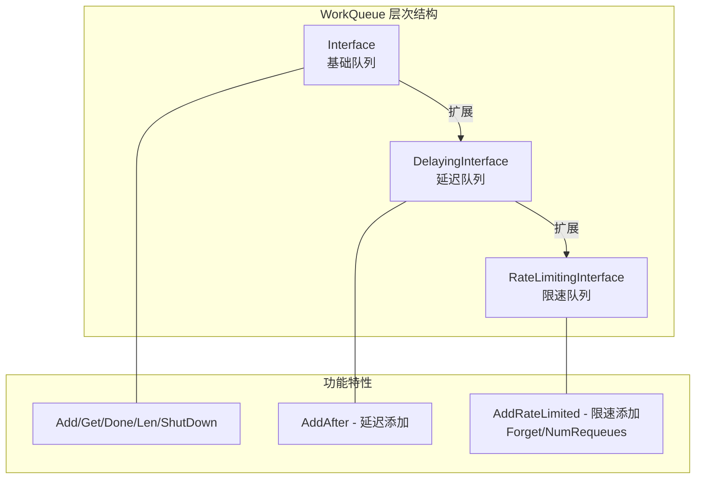

## 概述

WorkQueue 是 client-go 中用于控制器的工作队列实现，提供了去重、延迟、限速等功能。它是构建 Kubernetes 控制器的核心组件之一，确保事件处理的可靠性和效率。

## 队列类型

### 队列层次结构



### 基础队列接口

```go
// staging/src/k8s.io/client-go/util/workqueue/queue.go

// Interface 基础队列接口
type Interface interface {
    // Add 添加元素
    // 如果元素已在队列中（dirty），不会重复添加
    // 如果元素正在处理中（processing），标记为 dirty
    Add(item interface{})

    // Len 返回队列长度
    Len() int

    // Get 获取元素，阻塞直到有元素可用或队列关闭
    Get() (item interface{}, shutdown bool)

    // Done 标记元素处理完成
    // 如果元素被标记为 dirty，重新入队
    Done(item interface{})

    // ShutDown 关闭队列
    ShutDown()

    // ShutDownWithDrain 关闭并等待所有元素处理完成
    ShutDownWithDrain()

    // ShuttingDown 检查队列是否正在关闭
    ShuttingDown() bool
}
```

### 延迟队列接口

```go
// staging/src/k8s.io/client-go/util/workqueue/delaying_queue.go

// DelayingInterface 延迟队列接口
type DelayingInterface interface {
    Interface
    // AddAfter 在指定延迟后添加元素
    AddAfter(item interface{}, duration time.Duration)
}
```

### 限速队列接口

```go
// staging/src/k8s.io/client-go/util/workqueue/rate_limiting_queue.go

// RateLimitingInterface 限速队列接口
type RateLimitingInterface interface {
    DelayingInterface
    // AddRateLimited 根据限速器计算延迟后添加
    AddRateLimited(item interface{})
    // Forget 清除元素的失败计数
    Forget(item interface{})
    // NumRequeues 返回元素的重试次数
    NumRequeues(item interface{}) int
}
```

## 基础队列实现

### 创建和使用

```go
import "k8s.io/client-go/util/workqueue"

func useBasicQueue() {
    // 创建基础队列
    queue := workqueue.New()

    // 添加元素
    queue.Add("key1")
    queue.Add("key2")
    queue.Add("key1") // 去重，不会重复添加

    fmt.Printf("Queue length: %d\n", queue.Len()) // 输出: 2

    // 获取元素
    item, shutdown := queue.Get()
    if shutdown {
        return
    }
    fmt.Printf("Got item: %v\n", item)

    // 处理完成后必须调用 Done
    queue.Done(item)

    // 关闭队列
    queue.ShutDown()
}
```

### 去重机制

```go
// 队列内部数据结构
type Type struct {
    // queue 是有序的待处理元素列表
    queue []t

    // dirty 是需要处理的元素集合
    // 包括队列中的和正在处理的
    dirty set

    // processing 是正在处理的元素集合
    processing set

    // 条件变量
    cond *sync.Cond
    // ...
}

func (q *Type) Add(item interface{}) {
    q.cond.L.Lock()
    defer q.cond.L.Unlock()

    if q.shuttingDown {
        return
    }

    // 如果已在 dirty 集合中，跳过
    if q.dirty.has(item) {
        return
    }

    q.dirty.insert(item)

    // 如果正在处理，不加入队列（Done 时会重新加入）
    if q.processing.has(item) {
        return
    }

    q.queue = append(q.queue, item)
    q.cond.Signal()
}

func (q *Type) Done(item interface{}) {
    q.cond.L.Lock()
    defer q.cond.L.Unlock()

    q.processing.delete(item)

    // 如果在处理期间又被标记为 dirty，重新入队
    if q.dirty.has(item) {
        q.queue = append(q.queue, item)
        q.cond.Signal()
    }
}
```

### 去重示例

```go
func demonstrateDeDup() {
    queue := workqueue.New()

    // 场景 1: 普通去重
    queue.Add("key1")
    queue.Add("key1") // 被去重
    fmt.Printf("After double add: %d\n", queue.Len()) // 1

    // 场景 2: 处理中再次添加
    item, _ := queue.Get() // 开始处理 key1
    fmt.Printf("After get: %d\n", queue.Len()) // 0

    queue.Add("key1") // 标记为 dirty，但不入队
    fmt.Printf("During processing: %d\n", queue.Len()) // 0

    queue.Done(item) // 完成处理，key1 重新入队
    fmt.Printf("After done: %d\n", queue.Len()) // 1
}
```

## 延迟队列实现

### 创建和使用

```go
func useDelayingQueue() {
    // 创建延迟队列
    queue := workqueue.NewDelayingQueue()
    // 或带名称（用于监控）
    queue = workqueue.NewNamedDelayingQueue("my-queue")

    // 立即添加
    queue.Add("immediate")

    // 延迟添加
    queue.AddAfter("delayed-5s", 5*time.Second)
    queue.AddAfter("delayed-10s", 10*time.Second)

    fmt.Printf("Queue length: %d\n", queue.Len()) // 1（只有立即添加的）

    // 处理元素
    for {
        item, shutdown := queue.Get()
        if shutdown {
            break
        }
        fmt.Printf("Got: %v at %v\n", item, time.Now())
        queue.Done(item)
    }
}
```

### 延迟机制实现

```go
// 延迟队列内部结构
type delayingType struct {
    Interface
    // 时钟接口（便于测试）
    clock clock.WithTicker
    // 停止信号
    stopCh chan struct{}
    // 心跳间隔
    heartbeat clock.Ticker
    // 等待添加的元素（按时间排序）
    waitingForAddCh chan *waitFor
}

type waitFor struct {
    data    t
    readyAt time.Time
    index   int // 在堆中的索引
}

// waitForPriorityQueue 是按时间排序的最小堆
type waitForPriorityQueue []*waitFor

func (q *delayingType) AddAfter(item interface{}, duration time.Duration) {
    if q.ShuttingDown() {
        return
    }

    if duration <= 0 {
        q.Add(item)
        return
    }

    // 发送到等待通道
    q.waitingForAddCh <- &waitFor{
        data:    item,
        readyAt: q.clock.Now().Add(duration),
    }
}
```

### 延迟队列工作循环

```go
func (q *delayingType) waitingLoop() {
    var nextReadyAt time.Time
    waitingForQueue := &waitForPriorityQueue{}
    heap.Init(waitingForQueue)

    for {
        if q.Interface.ShuttingDown() {
            return
        }

        now := q.clock.Now()

        // 将到期的元素添加到队列
        for waitingForQueue.Len() > 0 {
            entry := waitingForQueue.Peek().(*waitFor)
            if entry.readyAt.After(now) {
                break
            }

            entry = heap.Pop(waitingForQueue).(*waitFor)
            q.Add(entry.data)
        }

        // 计算下次唤醒时间
        nextReadyAt = never
        if waitingForQueue.Len() > 0 {
            entry := waitingForQueue.Peek().(*waitFor)
            nextReadyAt = entry.readyAt
        }

        select {
        case <-q.stopCh:
            return
        case <-q.heartbeat.C():
            // 定期检查
        case waitEntry := <-q.waitingForAddCh:
            // 新的延迟元素
            if waitEntry.readyAt.After(now) {
                heap.Push(waitingForQueue, waitEntry)
            } else {
                q.Add(waitEntry.data)
            }
        case <-time.After(nextReadyAt.Sub(now)):
            // 等待到下一个到期时间
        }
    }
}
```

## 限速队列实现

### 创建和使用

```go
func useRateLimitingQueue() {
    // 使用默认限速器
    queue := workqueue.NewRateLimitingQueue(
        workqueue.DefaultControllerRateLimiter(),
    )

    // 添加元素（根据限速器计算延迟）
    queue.AddRateLimited("key1")

    // 模拟处理失败
    for i := 0; i < 3; i++ {
        item, _ := queue.Get()
        fmt.Printf("Processing %v (attempt %d)\n", item, queue.NumRequeues(item)+1)

        // 模拟失败，重新入队
        queue.AddRateLimited(item)
        queue.Done(item)

        time.Sleep(100 * time.Millisecond)
    }

    // 处理成功后清除计数
    item, _ := queue.Get()
    queue.Forget(item) // 清除失败计数
    queue.Done(item)
}
```

### 限速器类型

```go
// staging/src/k8s.io/client-go/util/workqueue/default_rate_limiters.go

// RateLimiter 限速器接口
type RateLimiter interface {
    // When 返回元素应该等待的时间
    When(item interface{}) time.Duration
    // Forget 清除元素的失败记录
    Forget(item interface{})
    // NumRequeues 返回重试次数
    NumRequeues(item interface{}) int
}
```

### 指数退避限速器

```go
// ItemExponentialFailureRateLimiter 指数退避
type ItemExponentialFailureRateLimiter struct {
    failuresLock sync.Mutex
    failures     map[interface{}]int

    baseDelay time.Duration
    maxDelay  time.Duration
}

func NewItemExponentialFailureRateLimiter(baseDelay, maxDelay time.Duration) RateLimiter {
    return &ItemExponentialFailureRateLimiter{
        failures:  map[interface{}]int{},
        baseDelay: baseDelay,
        maxDelay:  maxDelay,
    }
}

func (r *ItemExponentialFailureRateLimiter) When(item interface{}) time.Duration {
    r.failuresLock.Lock()
    defer r.failuresLock.Unlock()

    exp := r.failures[item]
    r.failures[item]++

    // 计算延迟: baseDelay * 2^failures
    backoff := float64(r.baseDelay.Nanoseconds()) * math.Pow(2, float64(exp))
    if backoff > float64(r.maxDelay.Nanoseconds()) {
        backoff = float64(r.maxDelay.Nanoseconds())
    }

    return time.Duration(backoff)
}

// 使用示例
func exponentialBackoff() {
    limiter := workqueue.NewItemExponentialFailureRateLimiter(
        5*time.Millisecond,   // 基础延迟
        1000*time.Second,     // 最大延迟
    )

    // 连续失败的延迟：5ms, 10ms, 20ms, 40ms, 80ms, ...
    for i := 0; i < 5; i++ {
        delay := limiter.When("key1")
        fmt.Printf("Attempt %d: delay %v\n", i+1, delay)
    }

    // 清除失败记录
    limiter.Forget("key1")
}
```

### 令牌桶限速器

```go
// BucketRateLimiter 令牌桶限速器
type BucketRateLimiter struct {
    *rate.Limiter
}

func NewBucketRateLimiter(limiter *rate.Limiter) RateLimiter {
    return &BucketRateLimiter{Limiter: limiter}
}

func (r *BucketRateLimiter) When(item interface{}) time.Duration {
    return r.Limiter.Reserve().Delay()
}

// 使用示例
func bucketRateLimiter() {
    // 每秒 10 个请求，突发 100 个
    limiter := workqueue.NewBucketRateLimiter(
        rate.NewLimiter(rate.Limit(10), 100),
    )

    queue := workqueue.NewRateLimitingQueue(limiter)

    // 所有元素使用相同的限速
    for i := 0; i < 20; i++ {
        queue.AddRateLimited(fmt.Sprintf("key%d", i))
    }
}
```

### 最大值限速器

```go
// MaxOfRateLimiter 取多个限速器的最大延迟
type MaxOfRateLimiter struct {
    limiters []RateLimiter
}

func NewMaxOfRateLimiter(limiters ...RateLimiter) RateLimiter {
    return &MaxOfRateLimiter{limiters: limiters}
}

func (r *MaxOfRateLimiter) When(item interface{}) time.Duration {
    ret := time.Duration(0)
    for _, limiter := range r.limiters {
        delay := limiter.When(item)
        if delay > ret {
            ret = delay
        }
    }
    return ret
}
```

### 默认控制器限速器

```go
// DefaultControllerRateLimiter 是控制器推荐使用的限速器
func DefaultControllerRateLimiter() RateLimiter {
    return NewMaxOfRateLimiter(
        // 指数退避：5ms 到 1000s
        NewItemExponentialFailureRateLimiter(5*time.Millisecond, 1000*time.Second),
        // 总体限速：每秒 10 个请求，突发 100 个
        NewBucketRateLimiter(rate.NewLimiter(rate.Limit(10), 100)),
    )
}

// DefaultTypedControllerRateLimiter 类型化版本
func DefaultTypedControllerRateLimiter[T comparable]() TypedRateLimiter[T] {
    return NewTypedMaxOfRateLimiter[T](
        NewTypedItemExponentialFailureRateLimiter[T](5*time.Millisecond, 1000*time.Second),
        NewTypedBucketRateLimiter[T](rate.NewLimiter(rate.Limit(10), 100)),
    )
}
```

## Worker 模式

### 单 Worker 模式

```go
type SingleWorkerController struct {
    queue workqueue.RateLimitingInterface
}

func (c *SingleWorkerController) Run(stopCh <-chan struct{}) {
    defer c.queue.ShutDown()

    // 单个 Worker
    go wait.Until(c.runWorker, time.Second, stopCh)

    <-stopCh
}

func (c *SingleWorkerController) runWorker() {
    for c.processNextItem() {
    }
}

func (c *SingleWorkerController) processNextItem() bool {
    item, shutdown := c.queue.Get()
    if shutdown {
        return false
    }
    defer c.queue.Done(item)

    err := c.syncHandler(item.(string))
    if err == nil {
        c.queue.Forget(item)
        return true
    }

    c.queue.AddRateLimited(item)
    return true
}
```

### 多 Worker 模式

```go
type MultiWorkerController struct {
    queue   workqueue.RateLimitingInterface
    workers int
}

func (c *MultiWorkerController) Run(ctx context.Context) error {
    defer c.queue.ShutDown()

    // 启动多个 Worker
    for i := 0; i < c.workers; i++ {
        go wait.UntilWithContext(ctx, c.runWorker, time.Second)
    }

    <-ctx.Done()
    return nil
}

func (c *MultiWorkerController) runWorker(ctx context.Context) {
    for {
        select {
        case <-ctx.Done():
            return
        default:
            if !c.processNextItem(ctx) {
                return
            }
        }
    }
}

func (c *MultiWorkerController) processNextItem(ctx context.Context) bool {
    item, shutdown := c.queue.Get()
    if shutdown {
        return false
    }
    defer c.queue.Done(item)

    // 处理可以并发执行
    err := c.syncHandler(ctx, item.(string))
    c.handleError(err, item)
    return true
}
```

### 带超时的 Worker

```go
func (c *Controller) processWithTimeout(item interface{}) error {
    ctx, cancel := context.WithTimeout(context.Background(), 30*time.Second)
    defer cancel()

    done := make(chan error, 1)
    go func() {
        done <- c.syncHandler(ctx, item.(string))
    }()

    select {
    case err := <-done:
        return err
    case <-ctx.Done():
        return fmt.Errorf("sync timeout for %v", item)
    }
}
```

## 错误处理

### 基本重试模式

```go
func (c *Controller) handleError(err error, item interface{}) {
    if err == nil {
        // 成功，清除重试计数
        c.queue.Forget(item)
        return
    }

    // 检查重试次数
    if c.queue.NumRequeues(item) < 5 {
        fmt.Printf("Error syncing %v: %v, requeuing\n", item, err)
        c.queue.AddRateLimited(item)
        return
    }

    // 超过最大重试次数
    c.queue.Forget(item)
    fmt.Printf("Dropping %v after max retries: %v\n", item, err)

    // 可以记录事件或告警
    c.recorder.Event(nil, corev1.EventTypeWarning, "SyncFailed",
        fmt.Sprintf("Failed to sync %v after retries", item))
}
```

### 区分错误类型

```go
import (
    apierrors "k8s.io/apimachinery/pkg/api/errors"
)

func (c *Controller) handleErrorByType(err error, item interface{}) {
    if err == nil {
        c.queue.Forget(item)
        return
    }

    key := item.(string)

    switch {
    case apierrors.IsNotFound(err):
        // 资源不存在，可能已被删除
        c.queue.Forget(item)
        fmt.Printf("Resource %s not found, skipping\n", key)

    case apierrors.IsConflict(err):
        // 冲突，立即重试
        c.queue.Add(item)
        fmt.Printf("Conflict on %s, immediate retry\n", key)

    case apierrors.IsServerTimeout(err), apierrors.IsTooManyRequests(err):
        // 服务器繁忙，使用限速重试
        c.queue.AddRateLimited(item)
        fmt.Printf("Server busy for %s, rate limited retry\n", key)

    case apierrors.IsForbidden(err), apierrors.IsUnauthorized(err):
        // 权限问题，不重试
        c.queue.Forget(item)
        fmt.Printf("Permission denied for %s, dropping\n", key)

    default:
        // 其他错误，限速重试
        if c.queue.NumRequeues(item) < 10 {
            c.queue.AddRateLimited(item)
        } else {
            c.queue.Forget(item)
        }
    }
}
```

### 永久失败处理

```go
// PermanentError 标记永久失败
type PermanentError struct {
    Err error
}

func (e *PermanentError) Error() string {
    return e.Err.Error()
}

func IsPermanent(err error) bool {
    _, ok := err.(*PermanentError)
    return ok
}

func (c *Controller) handleWithPermanent(err error, item interface{}) {
    if err == nil {
        c.queue.Forget(item)
        return
    }

    if IsPermanent(err) {
        // 永久失败，不重试
        c.queue.Forget(item)
        fmt.Printf("Permanent error for %v: %v\n", item, err)
        return
    }

    // 临时失败，重试
    c.queue.AddRateLimited(item)
}
```

## 队列监控

### 内置指标

```go
import (
    "k8s.io/client-go/util/workqueue"
    "k8s.io/component-base/metrics"
    "k8s.io/component-base/metrics/legacyregistry"
)

// 创建带监控的队列
func createMonitoredQueue(name string) workqueue.RateLimitingInterface {
    // 注册 Prometheus 指标
    workqueue.SetProvider(workqueue.MetricsProvider{
        NewDepthMetric: func(name string) workqueue.GaugeMetric {
            return metrics.NewGauge(&metrics.GaugeOpts{
                Subsystem: "workqueue",
                Name:      "depth",
                Help:      "Current depth of workqueue",
            })
        },
        NewAddsMetric: func(name string) workqueue.CounterMetric {
            return metrics.NewCounter(&metrics.CounterOpts{
                Subsystem: "workqueue",
                Name:      "adds_total",
                Help:      "Total number of adds handled by workqueue",
            })
        },
        // ... 其他指标
    })

    return workqueue.NewNamedRateLimitingQueue(
        workqueue.DefaultControllerRateLimiter(),
        name,
    )
}
```

### 自定义监控

```go
type MonitoredQueue struct {
    workqueue.RateLimitingInterface
    name string

    // 指标
    depth       prometheus.Gauge
    addTotal    prometheus.Counter
    retryTotal  prometheus.Counter
    latency     prometheus.Histogram
    workSeconds prometheus.Histogram
}

func NewMonitoredQueue(name string) *MonitoredQueue {
    q := &MonitoredQueue{
        RateLimitingInterface: workqueue.NewRateLimitingQueue(
            workqueue.DefaultControllerRateLimiter(),
        ),
        name: name,
        depth: prometheus.NewGauge(prometheus.GaugeOpts{
            Name: "workqueue_depth",
            Help: "Current depth of workqueue",
            ConstLabels: prometheus.Labels{"name": name},
        }),
        addTotal: prometheus.NewCounter(prometheus.CounterOpts{
            Name: "workqueue_adds_total",
            Help: "Total adds to workqueue",
            ConstLabels: prometheus.Labels{"name": name},
        }),
        // ... 初始化其他指标
    }

    // 注册指标
    prometheus.MustRegister(q.depth, q.addTotal)

    // 启动指标更新
    go q.updateMetrics()

    return q
}

func (q *MonitoredQueue) Add(item interface{}) {
    q.RateLimitingInterface.Add(item)
    q.addTotal.Inc()
}

func (q *MonitoredQueue) updateMetrics() {
    ticker := time.NewTicker(time.Second)
    for range ticker.C {
        q.depth.Set(float64(q.Len()))
    }
}
```

## 完整控制器示例

```go
package main

import (
    "context"
    "fmt"
    "time"

    corev1 "k8s.io/api/core/v1"
    "k8s.io/apimachinery/pkg/api/errors"
    metav1 "k8s.io/apimachinery/pkg/apis/meta/v1"
    "k8s.io/apimachinery/pkg/util/wait"
    "k8s.io/client-go/informers"
    "k8s.io/client-go/kubernetes"
    corev1listers "k8s.io/client-go/listers/core/v1"
    "k8s.io/client-go/tools/cache"
    "k8s.io/client-go/tools/clientcmd"
    "k8s.io/client-go/util/workqueue"
)

const (
    maxRetries = 5
)

type PodController struct {
    clientset kubernetes.Interface
    lister    corev1listers.PodLister
    hasSynced cache.InformerSynced
    queue     workqueue.RateLimitingInterface
}

func NewPodController(clientset kubernetes.Interface, factory informers.SharedInformerFactory) *PodController {
    podInformer := factory.Core().V1().Pods()

    c := &PodController{
        clientset: clientset,
        lister:    podInformer.Lister(),
        hasSynced: podInformer.Informer().HasSynced,
        queue: workqueue.NewRateLimitingQueueWithConfig(
            workqueue.DefaultControllerRateLimiter(),
            workqueue.RateLimitingQueueConfig{
                Name: "pods",
            },
        ),
    }

    podInformer.Informer().AddEventHandler(cache.ResourceEventHandlerFuncs{
        AddFunc: func(obj interface{}) {
            c.enqueue(obj)
        },
        UpdateFunc: func(old, new interface{}) {
            oldPod := old.(*corev1.Pod)
            newPod := new.(*corev1.Pod)
            if oldPod.ResourceVersion != newPod.ResourceVersion {
                c.enqueue(new)
            }
        },
        DeleteFunc: func(obj interface{}) {
            c.enqueue(obj)
        },
    })

    return c
}

func (c *PodController) enqueue(obj interface{}) {
    key, err := cache.MetaNamespaceKeyFunc(obj)
    if err != nil {
        return
    }
    c.queue.Add(key)
}

func (c *PodController) Run(ctx context.Context, workers int) error {
    defer c.queue.ShutDown()

    fmt.Println("Starting controller")

    if !cache.WaitForCacheSync(ctx.Done(), c.hasSynced) {
        return fmt.Errorf("failed to sync caches")
    }

    fmt.Printf("Cache synced, starting %d workers\n", workers)

    for i := 0; i < workers; i++ {
        go wait.UntilWithContext(ctx, c.runWorker, time.Second)
    }

    <-ctx.Done()
    fmt.Println("Shutting down controller")
    return nil
}

func (c *PodController) runWorker(ctx context.Context) {
    for c.processNextItem(ctx) {
    }
}

func (c *PodController) processNextItem(ctx context.Context) bool {
    item, shutdown := c.queue.Get()
    if shutdown {
        return false
    }

    // 记录开始时间
    startTime := time.Now()
    defer func() {
        fmt.Printf("Processed %v in %v\n", item, time.Since(startTime))
    }()

    defer c.queue.Done(item)

    key := item.(string)
    err := c.syncHandler(ctx, key)
    c.handleError(err, key)

    return true
}

func (c *PodController) syncHandler(ctx context.Context, key string) error {
    namespace, name, err := cache.SplitMetaNamespaceKey(key)
    if err != nil {
        return fmt.Errorf("invalid key: %s", key)
    }

    pod, err := c.lister.Pods(namespace).Get(name)
    if err != nil {
        if errors.IsNotFound(err) {
            fmt.Printf("Pod %s deleted\n", key)
            return nil
        }
        return err
    }

    // 处理 Pod
    fmt.Printf("Syncing pod: %s/%s (Phase: %s)\n",
        pod.Namespace, pod.Name, pod.Status.Phase)

    // 模拟一些处理逻辑
    // ...

    return nil
}

func (c *PodController) handleError(err error, key string) {
    if err == nil {
        c.queue.Forget(key)
        return
    }

    retries := c.queue.NumRequeues(key)

    if retries < maxRetries {
        fmt.Printf("Error syncing %s (attempt %d/%d): %v\n",
            key, retries+1, maxRetries, err)
        c.queue.AddRateLimited(key)
        return
    }

    c.queue.Forget(key)
    fmt.Printf("Dropping %s after %d retries: %v\n", key, maxRetries, err)
}

func main() {
    config, err := clientcmd.BuildConfigFromFlags("", clientcmd.RecommendedHomeFile)
    if err != nil {
        panic(err)
    }

    clientset, err := kubernetes.NewForConfig(config)
    if err != nil {
        panic(err)
    }

    factory := informers.NewSharedInformerFactory(clientset, 30*time.Second)
    controller := NewPodController(clientset, factory)

    ctx, cancel := context.WithCancel(context.Background())
    defer cancel()

    // 启动 Informer
    factory.Start(ctx.Done())

    // 运行控制器
    if err := controller.Run(ctx, 2); err != nil {
        panic(err)
    }
}
```

## 最佳实践

### Key 设计

```go
// 推荐：使用 namespace/name 格式
key, _ := cache.MetaNamespaceKeyFunc(obj)
// 结果: "default/my-pod"

// 非命名空间资源
key, _ := cache.MetaNamespaceKeyFunc(node)
// 结果: "my-node"

// 自定义 Key（包含更多信息）
func customKeyFunc(obj interface{}) (string, error) {
    pod := obj.(*corev1.Pod)
    return fmt.Sprintf("%s/%s/%s", pod.Namespace, pod.Name, pod.UID), nil
}
```

### 关闭处理

```go
func (c *Controller) Run(ctx context.Context) error {
    // 使用 ShutDownWithDrain 确保所有项目处理完成
    defer func() {
        c.queue.ShutDownWithDrain()
        fmt.Println("Queue drained")
    }()

    // ... 运行逻辑

    <-ctx.Done()
    return nil
}
```

### 性能调优

```go
// 1. 合理设置 Worker 数量
workers := runtime.NumCPU() // 或根据实际负载调整

// 2. 自定义限速器
limiter := workqueue.NewMaxOfRateLimiter(
    // 更激进的退避策略
    workqueue.NewItemExponentialFailureRateLimiter(1*time.Millisecond, 100*time.Second),
    // 更高的总体限速
    workqueue.NewBucketRateLimiter(rate.NewLimiter(rate.Limit(100), 1000)),
)

// 3. 监控队列深度和延迟
go func() {
    ticker := time.NewTicker(10 * time.Second)
    for range ticker.C {
        depth := queue.Len()
        if depth > 1000 {
            log.Printf("Warning: queue depth %d exceeds threshold", depth)
        }
    }
}()
```

## 总结

WorkQueue 核心要点：

**队列类型**
- Interface：基础去重队列
- DelayingInterface：支持延迟添加
- RateLimitingInterface：支持限速重试

**限速器**
- ItemExponentialFailureRateLimiter：指数退避
- BucketRateLimiter：令牌桶
- MaxOfRateLimiter：组合限速

**Worker 模式**
- 单 Worker/多 Worker
- 并发安全
- 优雅关闭

**错误处理**
- 区分错误类型
- 合理重试次数
- 永久失败处理

**最佳实践**
- 使用 namespace/name 作为 Key
- 监控队列指标
- 合理配置限速参数
