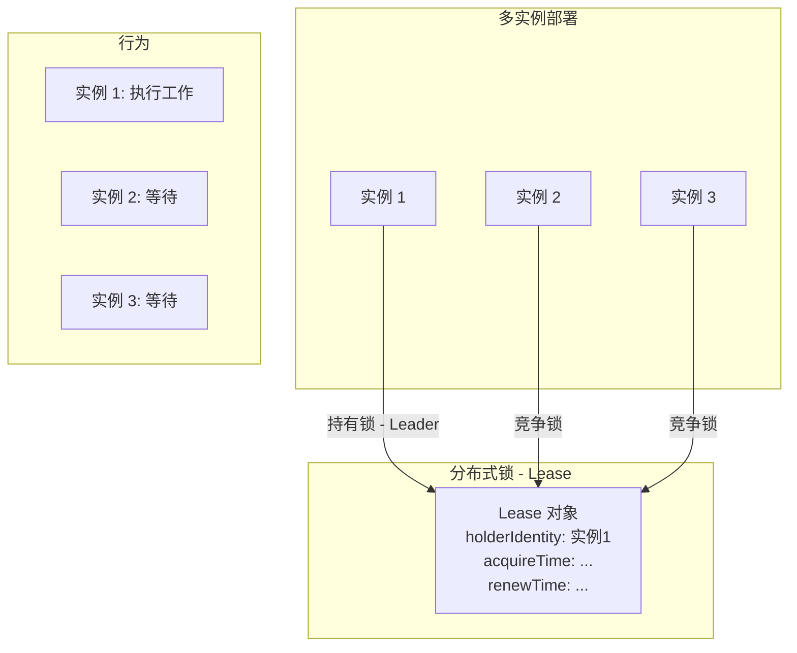
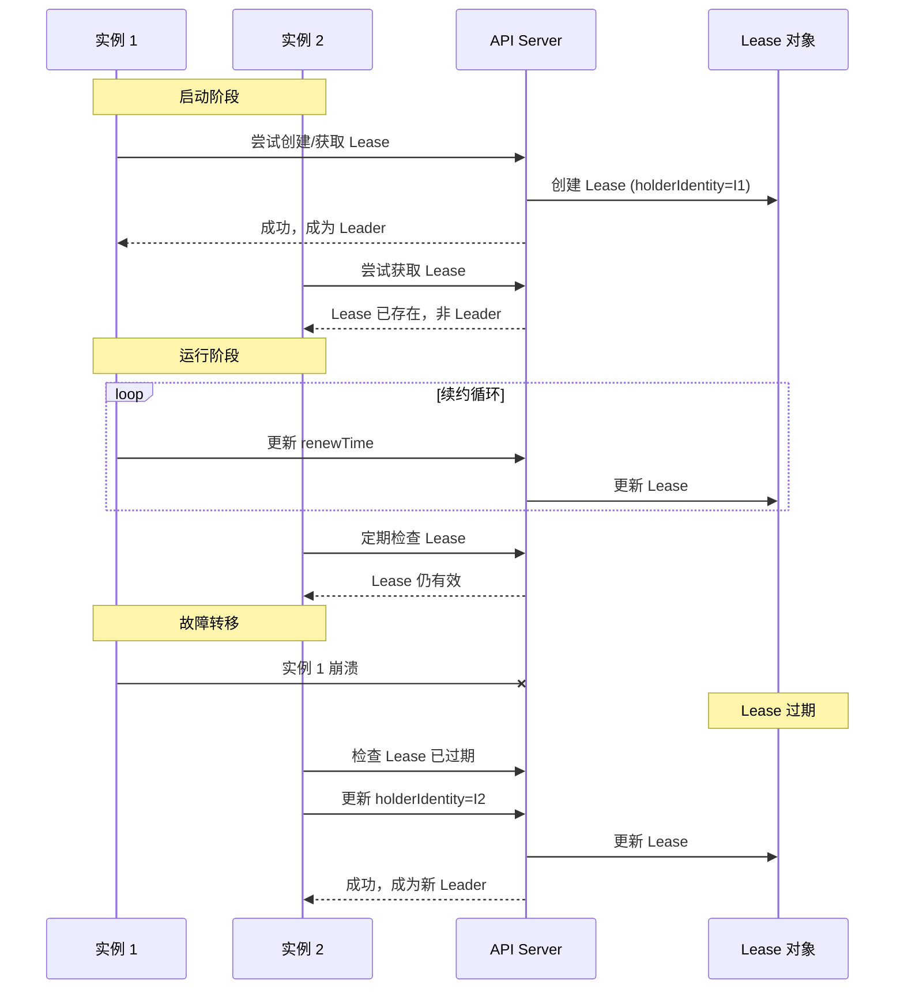
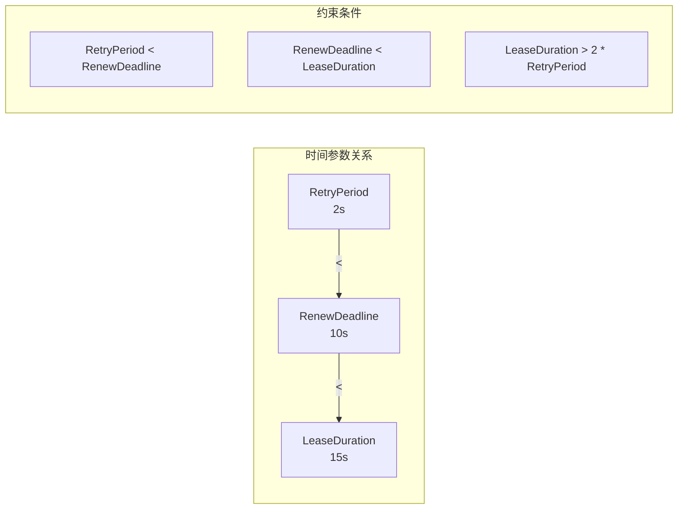
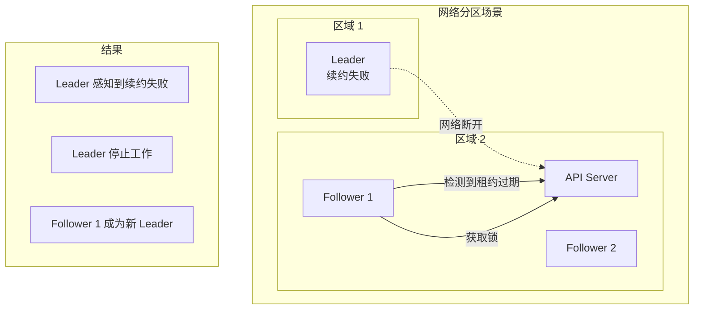

## 概述

Leader Election（领导者选举）是在分布式系统中确保只有一个实例执行关键任务的机制。Kubernetes 控制平面组件（如 Controller Manager、Scheduler）和自定义控制器都使用这一机制实现高可用。

## 选举原理

### 分布式锁概念



### 选举流程



## 锁资源类型

### Lease 资源（推荐）

```go
// staging/src/k8s.io/client-go/tools/leaderelection/resourcelock/leaselock.go

// LeaseLock 使用 Lease 资源作为锁
type LeaseLock struct {
    // Lease 的元数据
    LeaseMeta metav1.ObjectMeta
    // 客户端
    Client coordinationv1client.LeasesGetter
    // 锁配置
    LockConfig ResourceLockConfig
    // 当前持有的 Lease
    lease *coordinationv1.Lease
}

// Lease 资源示例
// apiVersion: coordination.k8s.io/v1
// kind: Lease
// metadata:
//   name: my-controller-lock
//   namespace: kube-system
// spec:
//   holderIdentity: controller-pod-abc
//   leaseDurationSeconds: 15
//   acquireTime: "2024-01-01T00:00:00Z"
//   renewTime: "2024-01-01T00:00:10Z"
//   leaseTransitions: 5
```

### ConfigMap 资源（传统）

```go
// ConfigMapLock 使用 ConfigMap 的 annotation 存储锁信息
type ConfigMapLock struct {
    ConfigMapMeta metav1.ObjectMeta
    Client        corev1client.ConfigMapsGetter
    LockConfig    ResourceLockConfig
    cm            *corev1.ConfigMap
}

// 锁信息存储在 annotation 中
// metadata:
//   annotations:
//     control-plane.alpha.kubernetes.io/leader: |
//       {"holderIdentity":"...","leaseDurationSeconds":15,...}
```

### Endpoints 资源（传统）

```go
// EndpointsLock 使用 Endpoints 的 annotation 存储锁信息
type EndpointsLock struct {
    EndpointsMeta metav1.ObjectMeta
    Client        corev1client.EndpointsGetter
    LockConfig    ResourceLockConfig
    e             *corev1.Endpoints
}
```

### 锁类型对比

| 特性 | Lease | ConfigMap | Endpoints |
|-----|-------|-----------|-----------|
| 专用性 | 专为锁设计 | 通用配置存储 | 服务发现 |
| 性能 | 最优 | 一般 | 一般 |
| 副作用 | 无 | 可能触发 ConfigMap Watch | 可能影响服务发现 |
| 推荐程度 | 强烈推荐 | 不推荐 | 不推荐 |
| Kubernetes 版本 | 1.14+ | 所有版本 | 所有版本 |

## 配置详解

### LeaderElectionConfig

```go
// staging/src/k8s.io/client-go/tools/leaderelection/leaderelection.go

// LeaderElectionConfig 选举配置
type LeaderElectionConfig struct {
    // Lock 是用于选举的资源锁
    Lock resourcelock.Interface

    // LeaseDuration 是锁的有效期
    // 如果 Leader 在此期间内没有续约，其他实例可以获取锁
    // 默认 15 秒
    LeaseDuration time.Duration

    // RenewDeadline 是 Leader 续约的截止时间
    // 必须小于 LeaseDuration
    // 默认 10 秒
    RenewDeadline time.Duration

    // RetryPeriod 是非 Leader 重试获取锁的间隔
    // 默认 2 秒
    RetryPeriod time.Duration

    // Callbacks 是选举状态变化的回调
    Callbacks LeaderCallbacks

    // WatchDog 是看门狗，用于健康检查
    WatchDog *HealthzAdaptor

    // ReleaseOnCancel 在 context 取消时是否释放锁
    ReleaseOnCancel bool

    // Name 是选举的名称，用于日志
    Name string

    // Coordinated 是否使用协调式选举（实验性）
    Coordinated bool
}
```

### LeaderCallbacks

```go
// LeaderCallbacks 选举回调
type LeaderCallbacks struct {
    // OnStartedLeading 当成为 Leader 时调用
    // 在独立的 goroutine 中运行
    OnStartedLeading func(ctx context.Context)

    // OnStoppedLeading 当失去 Leader 时调用
    // 通常应该退出进程
    OnStoppedLeading func()

    // OnNewLeader 当观察到新 Leader 时调用
    // identity 是新 Leader 的标识
    OnNewLeader func(identity string)
}
```

### 时间参数关系



## 基本使用

### 创建 Leader Election

```go
import (
    "context"
    "os"
    "time"

    metav1 "k8s.io/apimachinery/pkg/apis/meta/v1"
    "k8s.io/client-go/kubernetes"
    "k8s.io/client-go/tools/leaderelection"
    "k8s.io/client-go/tools/leaderelection/resourcelock"
)

func runWithLeaderElection(clientset kubernetes.Interface) {
    // 获取实例标识（通常是 Pod 名称）
    id, err := os.Hostname()
    if err != nil {
        panic(err)
    }

    // 创建锁
    lock := &resourcelock.LeaseLock{
        LeaseMeta: metav1.ObjectMeta{
            Name:      "my-controller-lock",
            Namespace: "default",
        },
        Client: clientset.CoordinationV1(),
        LockConfig: resourcelock.ResourceLockConfig{
            Identity: id,
        },
    }

    // 配置选举
    ctx, cancel := context.WithCancel(context.Background())
    defer cancel()

    leaderelection.RunOrDie(ctx, leaderelection.LeaderElectionConfig{
        Lock:            lock,
        LeaseDuration:   15 * time.Second,
        RenewDeadline:   10 * time.Second,
        RetryPeriod:     2 * time.Second,
        ReleaseOnCancel: true,
        Callbacks: leaderelection.LeaderCallbacks{
            OnStartedLeading: func(ctx context.Context) {
                // 成为 Leader，开始工作
                fmt.Printf("[%s] Started leading\n", id)
                runController(ctx)
            },
            OnStoppedLeading: func() {
                // 失去 Leader
                fmt.Printf("[%s] Stopped leading\n", id)
                // 通常应该退出进程
                os.Exit(0)
            },
            OnNewLeader: func(identity string) {
                if identity == id {
                    return
                }
                fmt.Printf("[%s] New leader elected: %s\n", id, identity)
            },
        },
    })
}
```

### 使用 New 方式

```go
func runWithLeaderElectionNew(clientset kubernetes.Interface) error {
    id, _ := os.Hostname()

    lock, err := resourcelock.New(
        resourcelock.LeasesResourceLock,
        "default",
        "my-controller-lock",
        clientset.CoreV1(),
        clientset.CoordinationV1(),
        resourcelock.ResourceLockConfig{
            Identity: id,
        },
    )
    if err != nil {
        return err
    }

    ctx, cancel := context.WithCancel(context.Background())
    defer cancel()

    le, err := leaderelection.NewLeaderElector(leaderelection.LeaderElectionConfig{
        Lock:          lock,
        LeaseDuration: 15 * time.Second,
        RenewDeadline: 10 * time.Second,
        RetryPeriod:   2 * time.Second,
        Callbacks: leaderelection.LeaderCallbacks{
            OnStartedLeading: func(ctx context.Context) {
                runController(ctx)
            },
            OnStoppedLeading: func() {
                fmt.Println("Lost leadership")
            },
        },
    })
    if err != nil {
        return err
    }

    // 运行选举
    le.Run(ctx)
    return nil
}
```

## 健康检查集成

### HealthzAdaptor

```go
import (
    "net/http"
    "k8s.io/client-go/tools/leaderelection"
)

func setupWithHealthCheck(clientset kubernetes.Interface) {
    // 创建健康检查适配器
    healthCheck := leaderelection.NewLeaderHealthzAdaptor(20 * time.Second)

    // 配置选举
    config := leaderelection.LeaderElectionConfig{
        Lock:          lock,
        LeaseDuration: 15 * time.Second,
        RenewDeadline: 10 * time.Second,
        RetryPeriod:   2 * time.Second,
        WatchDog:      healthCheck,
        Callbacks: leaderelection.LeaderCallbacks{
            OnStartedLeading: func(ctx context.Context) {
                runController(ctx)
            },
            OnStoppedLeading: func() {
                os.Exit(0)
            },
        },
    }

    // 启动健康检查服务器
    go func() {
        http.HandleFunc("/healthz", func(w http.ResponseWriter, r *http.Request) {
            if healthCheck.Check(nil) == nil {
                w.WriteHeader(http.StatusOK)
                w.Write([]byte("ok"))
            } else {
                w.WriteHeader(http.StatusServiceUnavailable)
                w.Write([]byte("not ready"))
            }
        })
        http.ListenAndServe(":8080", nil)
    }()

    // 运行选举
    ctx := context.Background()
    leaderelection.RunOrDie(ctx, config)
}
```

### Kubernetes 探针配置

```yaml
apiVersion: v1
kind: Pod
metadata:
  name: my-controller
spec:
  containers:
    - name: controller
      image: my-controller:latest
      livenessProbe:
        httpGet:
          path: /healthz
          port: 8080
        initialDelaySeconds: 15
        periodSeconds: 10
      readinessProbe:
        httpGet:
          path: /healthz
          port: 8080
        initialDelaySeconds: 5
        periodSeconds: 5
```

## 高级用法

### 带元数据的锁

```go
// 在锁中存储额外信息
func createLockWithMetadata(clientset kubernetes.Interface, id string) resourcelock.Interface {
    return &resourcelock.LeaseLock{
        LeaseMeta: metav1.ObjectMeta{
            Name:      "my-controller-lock",
            Namespace: "default",
            // 添加标签
            Labels: map[string]string{
                "app":        "my-controller",
                "controller": "leader-election",
            },
            // 添加注解
            Annotations: map[string]string{
                "version": "v1.0.0",
            },
        },
        Client: clientset.CoordinationV1(),
        LockConfig: resourcelock.ResourceLockConfig{
            Identity: id,
        },
    }
}
```

### 多锁协调

```go
// 不同组件使用不同的锁
func setupMultipleLocks(clientset kubernetes.Interface) {
    id, _ := os.Hostname()

    // 主控制器锁
    mainLock := &resourcelock.LeaseLock{
        LeaseMeta: metav1.ObjectMeta{
            Name:      "main-controller-lock",
            Namespace: "kube-system",
        },
        Client:     clientset.CoordinationV1(),
        LockConfig: resourcelock.ResourceLockConfig{Identity: id},
    }

    // 清理任务锁
    cleanupLock := &resourcelock.LeaseLock{
        LeaseMeta: metav1.ObjectMeta{
            Name:      "cleanup-controller-lock",
            Namespace: "kube-system",
        },
        Client:     clientset.CoordinationV1(),
        LockConfig: resourcelock.ResourceLockConfig{Identity: id},
    }

    ctx := context.Background()

    // 并行运行两个选举
    go leaderelection.RunOrDie(ctx, leaderelection.LeaderElectionConfig{
        Lock:          mainLock,
        LeaseDuration: 15 * time.Second,
        RenewDeadline: 10 * time.Second,
        RetryPeriod:   2 * time.Second,
        Callbacks: leaderelection.LeaderCallbacks{
            OnStartedLeading: func(ctx context.Context) {
                runMainController(ctx)
            },
            OnStoppedLeading: func() { os.Exit(0) },
        },
    })

    go leaderelection.RunOrDie(ctx, leaderelection.LeaderElectionConfig{
        Lock:          cleanupLock,
        LeaseDuration: 30 * time.Second, // 清理任务可以用更长的租约
        RenewDeadline: 20 * time.Second,
        RetryPeriod:   5 * time.Second,
        Callbacks: leaderelection.LeaderCallbacks{
            OnStartedLeading: func(ctx context.Context) {
                runCleanupController(ctx)
            },
            OnStoppedLeading: func() { /* 清理任务丢失可以不退出 */ },
        },
    })

    select {}
}
```

### 优雅释放锁

```go
func gracefulShutdown(clientset kubernetes.Interface) {
    id, _ := os.Hostname()
    lock := &resourcelock.LeaseLock{
        LeaseMeta: metav1.ObjectMeta{
            Name:      "my-controller-lock",
            Namespace: "default",
        },
        Client:     clientset.CoordinationV1(),
        LockConfig: resourcelock.ResourceLockConfig{Identity: id},
    }

    ctx, cancel := context.WithCancel(context.Background())

    // 监听信号
    sigCh := make(chan os.Signal, 1)
    signal.Notify(sigCh, syscall.SIGTERM, syscall.SIGINT)

    go func() {
        <-sigCh
        fmt.Println("Received shutdown signal")
        cancel() // 触发优雅释放
    }()

    leaderelection.RunOrDie(ctx, leaderelection.LeaderElectionConfig{
        Lock:            lock,
        LeaseDuration:   15 * time.Second,
        RenewDeadline:   10 * time.Second,
        RetryPeriod:     2 * time.Second,
        ReleaseOnCancel: true, // 关键：取消时释放锁
        Callbacks: leaderelection.LeaderCallbacks{
            OnStartedLeading: func(ctx context.Context) {
                runController(ctx)
            },
            OnStoppedLeading: func() {
                fmt.Println("Released leadership gracefully")
                os.Exit(0)
            },
        },
    })
}
```

### 观察 Leader 变化

```go
func observeLeadership(clientset kubernetes.Interface, namespace, name string) {
    // 创建 Informer 监听 Lease 变化
    factory := informers.NewSharedInformerFactoryWithOptions(
        clientset,
        0,
        informers.WithNamespace(namespace),
    )

    leaseInformer := factory.Coordination().V1().Leases().Informer()

    leaseInformer.AddEventHandler(cache.ResourceEventHandlerFuncs{
        UpdateFunc: func(old, new interface{}) {
            newLease := new.(*coordinationv1.Lease)
            if newLease.Name != name {
                return
            }

            oldLease := old.(*coordinationv1.Lease)
            if oldLease.Spec.HolderIdentity != newLease.Spec.HolderIdentity {
                fmt.Printf("Leader changed from %s to %s\n",
                    *oldLease.Spec.HolderIdentity,
                    *newLease.Spec.HolderIdentity)
            }
        },
    })

    stopCh := make(chan struct{})
    factory.Start(stopCh)
    <-stopCh
}
```

## 实现原理

### 选举循环

```go
// staging/src/k8s.io/client-go/tools/leaderelection/leaderelection.go

func (le *LeaderElector) Run(ctx context.Context) {
    defer runtime.HandleCrash()
    defer func() {
        le.config.Callbacks.OnStoppedLeading()
    }()

    // 获取锁
    if !le.acquire(ctx) {
        return // 被取消
    }

    ctx, cancel := context.WithCancel(ctx)
    defer cancel()

    // 成为 Leader，启动工作
    go le.config.Callbacks.OnStartedLeading(ctx)

    // 续约循环
    le.renew(ctx)
}
```

### 获取锁

```go
func (le *LeaderElector) acquire(ctx context.Context) bool {
    ctx, cancel := context.WithCancel(ctx)
    defer cancel()

    succeeded := false
    desc := le.config.Lock.Describe()

    // 持续尝试获取锁
    wait.JitterUntil(func() {
        succeeded = le.tryAcquireOrRenew(ctx)
        le.maybeReportTransition()

        if !succeeded {
            return
        }

        // 成功获取
        cancel()
    }, le.config.RetryPeriod, JitterFactor, true, ctx.Done())

    return succeeded
}
```

### 续约

```go
func (le *LeaderElector) renew(ctx context.Context) {
    ctx, cancel := context.WithCancel(ctx)
    defer cancel()

    wait.Until(func() {
        timeoutCtx, timeoutCancel := context.WithTimeout(ctx, le.config.RenewDeadline)
        defer timeoutCancel()

        err := wait.PollImmediateUntil(le.config.RetryPeriod, func() (bool, error) {
            return le.tryAcquireOrRenew(timeoutCtx), nil
        }, timeoutCtx.Done())

        le.maybeReportTransition()

        if err == nil {
            return
        }

        // 续约失败，失去 Leader
        cancel()
    }, le.config.RetryPeriod, ctx.Done())

    // 通知观察者
    if le.config.Callbacks.OnNewLeader != nil {
        le.config.Callbacks.OnNewLeader("")
    }
}
```

### 尝试获取或续约

```go
func (le *LeaderElector) tryAcquireOrRenew(ctx context.Context) bool {
    now := metav1.Now()
    leaderElectionRecord := resourcelock.LeaderElectionRecord{
        HolderIdentity:       le.config.Lock.Identity(),
        LeaseDurationSeconds: int(le.config.LeaseDuration / time.Second),
        RenewTime:            now,
        AcquireTime:          now,
    }

    // 获取当前锁状态
    oldLeaderElectionRecord, oldLeaderElectionRawRecord, err := le.config.Lock.Get(ctx)
    if err != nil {
        if !errors.IsNotFound(err) {
            return false
        }
        // 锁不存在，尝试创建
        if err = le.config.Lock.Create(ctx, leaderElectionRecord); err != nil {
            return false
        }
        le.setObservedRecord(&leaderElectionRecord)
        return true
    }

    // 检查是否是自己持有
    if !bytes.Equal(le.observedRawRecord, oldLeaderElectionRawRecord) {
        le.setObservedRecord(oldLeaderElectionRecord)
        le.observedRawRecord = oldLeaderElectionRawRecord
    }

    // 检查锁是否过期
    if len(oldLeaderElectionRecord.HolderIdentity) > 0 &&
        le.observedTime.Add(time.Duration(oldLeaderElectionRecord.LeaseDurationSeconds)*time.Second).After(now.Time) &&
        !le.IsLeader() {
        // 锁未过期，且不是自己持有
        return false
    }

    // 保留原始获取时间
    if le.IsLeader() {
        leaderElectionRecord.AcquireTime = oldLeaderElectionRecord.AcquireTime
        leaderElectionRecord.LeaderTransitions = oldLeaderElectionRecord.LeaderTransitions
    } else {
        leaderElectionRecord.LeaderTransitions = oldLeaderElectionRecord.LeaderTransitions + 1
    }

    // 更新锁
    if err = le.config.Lock.Update(ctx, leaderElectionRecord); err != nil {
        return false
    }

    le.setObservedRecord(&leaderElectionRecord)
    return true
}
```

## 故障场景

### 网络分区



### 脑裂处理

```go
// 通过 ResourceVersion 防止脑裂
func (l *LeaseLock) Update(ctx context.Context, ler LeaderElectionRecord) error {
    // 使用乐观锁更新
    l.lease.Spec.HolderIdentity = &ler.HolderIdentity
    l.lease.Spec.LeaseDurationSeconds = &leaseDuration
    l.lease.Spec.RenewTime = &renewTime
    l.lease.Spec.AcquireTime = &acquireTime
    l.lease.Spec.LeaseTransitions = &ler.LeaderTransitions

    // Update 会检查 ResourceVersion
    // 如果版本不匹配，更新失败
    lease, err := l.Client.Leases(l.LeaseMeta.Namespace).Update(ctx, l.lease, metav1.UpdateOptions{})
    if err != nil {
        return err
    }

    l.lease = lease
    return nil
}
```

## 最佳实践

### 参数调优

```go
// 生产环境推荐配置
config := leaderelection.LeaderElectionConfig{
    Lock:          lock,
    // 租约时间：影响故障转移速度
    // 太短：频繁续约，API Server 压力大
    // 太长：故障转移慢
    LeaseDuration: 15 * time.Second,

    // 续约截止：给续约操作的时间
    // 应该小于 LeaseDuration
    RenewDeadline: 10 * time.Second,

    // 重试间隔：非 Leader 检查锁的频率
    // 影响故障转移响应时间
    RetryPeriod: 2 * time.Second,

    // 优雅释放
    ReleaseOnCancel: true,
}

// 对于延迟敏感的场景
sensitiveConfig := leaderelection.LeaderElectionConfig{
    LeaseDuration: 10 * time.Second,
    RenewDeadline: 8 * time.Second,
    RetryPeriod:   1 * time.Second,
}

// 对于稳定性优先的场景
stableConfig := leaderelection.LeaderElectionConfig{
    LeaseDuration: 30 * time.Second,
    RenewDeadline: 20 * time.Second,
    RetryPeriod:   5 * time.Second,
}
```

### 身份标识

```go
// 使用唯一标识
func getIdentity() string {
    // 方式 1: Pod 名称（推荐）
    if name := os.Getenv("POD_NAME"); name != "" {
        return name
    }

    // 方式 2: 主机名 + 进程 ID
    hostname, _ := os.Hostname()
    return fmt.Sprintf("%s_%d", hostname, os.Getpid())

    // 方式 3: UUID（不推荐，重启后变化）
    // return uuid.New().String()
}

// Kubernetes Deployment 中注入 Pod 名称
// env:
//   - name: POD_NAME
//     valueFrom:
//       fieldRef:
//         fieldPath: metadata.name
```

### 错误处理

```go
func robustLeaderElection(clientset kubernetes.Interface) {
    id := getIdentity()

    for {
        func() {
            lock := &resourcelock.LeaseLock{
                LeaseMeta: metav1.ObjectMeta{
                    Name:      "my-controller-lock",
                    Namespace: "default",
                },
                Client:     clientset.CoordinationV1(),
                LockConfig: resourcelock.ResourceLockConfig{Identity: id},
            }

            ctx, cancel := context.WithCancel(context.Background())

            // 处理 panic
            defer func() {
                if r := recover(); r != nil {
                    fmt.Printf("Recovered from panic: %v\n", r)
                }
                cancel()
            }()

            leaderelection.RunOrDie(ctx, leaderelection.LeaderElectionConfig{
                Lock:            lock,
                LeaseDuration:   15 * time.Second,
                RenewDeadline:   10 * time.Second,
                RetryPeriod:     2 * time.Second,
                ReleaseOnCancel: true,
                Callbacks: leaderelection.LeaderCallbacks{
                    OnStartedLeading: func(ctx context.Context) {
                        runController(ctx)
                    },
                    OnStoppedLeading: func() {
                        fmt.Println("Lost leadership, will retry")
                    },
                },
            })
        }()

        // 短暂等待后重试
        time.Sleep(5 * time.Second)
        fmt.Println("Retrying leader election...")
    }
}
```

## 完整示例

```go
package main

import (
    "context"
    "flag"
    "fmt"
    "os"
    "os/signal"
    "syscall"
    "time"

    metav1 "k8s.io/apimachinery/pkg/apis/meta/v1"
    "k8s.io/client-go/kubernetes"
    "k8s.io/client-go/tools/clientcmd"
    "k8s.io/client-go/tools/leaderelection"
    "k8s.io/client-go/tools/leaderelection/resourcelock"
)

var (
    lockName      = flag.String("lock-name", "my-controller-lock", "Name of the lock")
    lockNamespace = flag.String("lock-namespace", "default", "Namespace of the lock")
    id            = flag.String("id", "", "Identity of this instance")
)

func main() {
    flag.Parse()

    // 获取身份标识
    if *id == "" {
        hostname, _ := os.Hostname()
        *id = hostname
    }

    fmt.Printf("Starting with identity: %s\n", *id)

    // 加载配置
    config, err := clientcmd.BuildConfigFromFlags("", clientcmd.RecommendedHomeFile)
    if err != nil {
        panic(err)
    }

    clientset, err := kubernetes.NewForConfig(config)
    if err != nil {
        panic(err)
    }

    // 创建锁
    lock := &resourcelock.LeaseLock{
        LeaseMeta: metav1.ObjectMeta{
            Name:      *lockName,
            Namespace: *lockNamespace,
        },
        Client: clientset.CoordinationV1(),
        LockConfig: resourcelock.ResourceLockConfig{
            Identity: *id,
        },
    }

    // 设置上下文和信号处理
    ctx, cancel := context.WithCancel(context.Background())

    sigCh := make(chan os.Signal, 1)
    signal.Notify(sigCh, syscall.SIGTERM, syscall.SIGINT)

    go func() {
        sig := <-sigCh
        fmt.Printf("Received signal: %v\n", sig)
        cancel()
    }()

    // 运行选举
    leaderelection.RunOrDie(ctx, leaderelection.LeaderElectionConfig{
        Lock:            lock,
        LeaseDuration:   15 * time.Second,
        RenewDeadline:   10 * time.Second,
        RetryPeriod:     2 * time.Second,
        ReleaseOnCancel: true,
        Callbacks: leaderelection.LeaderCallbacks{
            OnStartedLeading: func(ctx context.Context) {
                fmt.Printf("[%s] I am the leader!\n", *id)
                runController(ctx)
            },
            OnStoppedLeading: func() {
                fmt.Printf("[%s] I am no longer the leader\n", *id)
            },
            OnNewLeader: func(identity string) {
                if identity == *id {
                    return
                }
                fmt.Printf("[%s] New leader: %s\n", *id, identity)
            },
        },
    })

    fmt.Println("Exiting")
}

func runController(ctx context.Context) {
    ticker := time.NewTicker(5 * time.Second)
    defer ticker.Stop()

    for {
        select {
        case <-ctx.Done():
            fmt.Println("Controller stopping")
            return
        case <-ticker.C:
            fmt.Println("Controller working...")
            // 执行控制器逻辑
        }
    }
}
```

## 总结

Leader Election 核心要点：

**锁资源选择**
- Lease（推荐）：专用、高效
- ConfigMap/Endpoints：传统方式，不推荐

**时间参数**
- LeaseDuration：租约有效期
- RenewDeadline：续约截止时间
- RetryPeriod：重试间隔

**回调处理**
- OnStartedLeading：成为 Leader
- OnStoppedLeading：失去 Leader
- OnNewLeader：观察 Leader 变化

**最佳实践**
- 使用唯一身份标识
- 合理配置时间参数
- 启用 ReleaseOnCancel
- 集成健康检查
