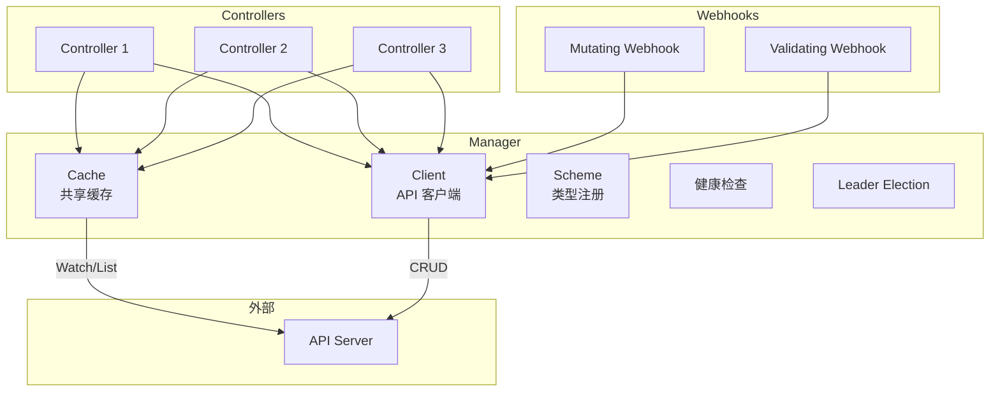

## 概述

controller-runtime 是 Kubernetes SIG API Machinery 提供的高层控制器开发框架，是 Kubebuilder 和 Operator SDK 的基础。它封装了 client-go 的底层细节，提供了更简洁的 API 来构建 Kubernetes 控制器。

## 架构概览

### 组件结构



### 与 client-go 对比

| 特性 | client-go | controller-runtime |
|-----|-----------|-------------------|
| 抽象级别 | 低 | 高 |
| Informer 管理 | 手动 | 自动 |
| WorkQueue | 手动配置 | 内置 |
| 缓存/客户端 | 分离 | 统一接口 |
| Webhook | 无 | 内置支持 |
| 指标/健康检查 | 手动 | 内置 |
| Leader Election | 手动 | 配置即用 |
| 学习曲线 | 陡峭 | 平缓 |

## Manager

### 创建 Manager

```go
import (
    "sigs.k8s.io/controller-runtime/pkg/manager"
    "sigs.k8s.io/controller-runtime/pkg/client/config"
)

func createManager() (manager.Manager, error) {
    // 获取 kubeconfig
    cfg, err := config.GetConfig()
    if err != nil {
        return nil, err
    }

    // 创建 Manager
    mgr, err := manager.New(cfg, manager.Options{
        // Scheme 包含所有要管理的类型
        Scheme: scheme,

        // 指标绑定地址
        Metrics: metricsserver.Options{
            BindAddress: ":8080",
        },

        // 健康检查地址
        HealthProbeBindAddress: ":8081",

        // Leader Election 配置
        LeaderElection:          true,
        LeaderElectionID:        "my-controller-lock",
        LeaderElectionNamespace: "default",

        // Webhook 服务器
        WebhookServer: webhook.NewServer(webhook.Options{
            Port: 9443,
        }),

        // 缓存配置
        Cache: cache.Options{
            DefaultNamespaces: map[string]cache.Config{
                "production": {},
                "staging":    {},
            },
        },
    })
    if err != nil {
        return nil, err
    }

    return mgr, nil
}
```

### Manager Options 详解

```go
// Manager 配置选项
type Options struct {
    // Scheme 类型注册表
    Scheme *runtime.Scheme

    // Cache 配置
    Cache cache.Options

    // Client 配置
    Client client.Options

    // 指标服务器
    Metrics metricsserver.Options

    // 健康检查
    HealthProbeBindAddress string

    // 就绪检查
    ReadinessEndpointName string
    LivenessEndpointName  string

    // Leader Election
    LeaderElection                bool
    LeaderElectionResourceLock    string
    LeaderElectionNamespace       string
    LeaderElectionID              string
    LeaderElectionReleaseOnCancel bool
    LeaseDuration                 *time.Duration
    RenewDeadline                 *time.Duration
    RetryPeriod                   *time.Duration

    // Webhook 服务器
    WebhookServer webhook.Server

    // 优雅关闭超时
    GracefulShutdownTimeout *time.Duration

    // 自定义 Logger
    Logger logr.Logger

    // 基础上下文
    BaseContext func() context.Context

    // 控制器配置
    Controller controllerconfig.Controller
}
```

### 缓存配置

```go
import "sigs.k8s.io/controller-runtime/pkg/cache"

// 命名空间过滤
cacheOpts := cache.Options{
    // 仅缓存特定命名空间
    DefaultNamespaces: map[string]cache.Config{
        "production": {},
    },

    // 不同资源不同配置
    ByObject: map[client.Object]cache.ByObject{
        &corev1.Pod{}: {
            // Pod 只缓存特定命名空间
            Namespaces: map[string]cache.Config{
                "default": {},
            },
        },
        &corev1.ConfigMap{}: {
            // ConfigMap 使用标签选择器
            Label: labels.SelectorFromSet(labels.Set{"managed": "true"}),
        },
        &corev1.Secret{}: {
            // Secret 使用字段选择器
            Field: fields.SelectorFromSet(fields.Set{"type": "Opaque"}),
        },
    },

    // 默认选择器
    DefaultLabelSelector: labels.SelectorFromSet(labels.Set{"app": "myapp"}),

    // 同步周期
    SyncPeriod: ptr.To(10 * time.Minute),
}

mgr, err := manager.New(cfg, manager.Options{
    Cache: cacheOpts,
})
```

## Controller

### Reconciler 接口

```go
// sigs.k8s.io/controller-runtime/pkg/reconcile

// Reconciler 是控制器的核心接口
type Reconciler interface {
    // Reconcile 执行协调逻辑
    // Request 包含资源的命名空间和名称
    // Result 控制重新入队行为
    Reconcile(context.Context, Request) (Result, error)
}

// Request 包含触发 Reconcile 的资源信息
type Request struct {
    types.NamespacedName
}

// Result 控制 Reconcile 的重试行为
type Result struct {
    // Requeue 是否重新入队
    Requeue bool
    // RequeueAfter 延迟重新入队
    RequeueAfter time.Duration
}
```

### 实现 Reconciler

```go
import (
    "context"

    appsv1 "k8s.io/api/apps/v1"
    corev1 "k8s.io/api/core/v1"
    "k8s.io/apimachinery/pkg/api/errors"
    ctrl "sigs.k8s.io/controller-runtime"
    "sigs.k8s.io/controller-runtime/pkg/client"
    "sigs.k8s.io/controller-runtime/pkg/log"
)

// DeploymentReconciler 协调 Deployment
type DeploymentReconciler struct {
    client.Client
    Scheme *runtime.Scheme
}

func (r *DeploymentReconciler) Reconcile(ctx context.Context, req ctrl.Request) (ctrl.Result, error) {
    logger := log.FromContext(ctx)
    logger.Info("Reconciling Deployment", "name", req.Name, "namespace", req.Namespace)

    // 获取 Deployment
    var deployment appsv1.Deployment
    if err := r.Get(ctx, req.NamespacedName, &deployment); err != nil {
        if errors.IsNotFound(err) {
            // 资源已删除
            logger.Info("Deployment not found, ignoring")
            return ctrl.Result{}, nil
        }
        logger.Error(err, "Failed to get Deployment")
        return ctrl.Result{}, err
    }

    // 检查是否需要处理
    if deployment.DeletionTimestamp != nil {
        // 正在删除
        return r.handleDeletion(ctx, &deployment)
    }

    // 执行协调逻辑
    if err := r.reconcileDeployment(ctx, &deployment); err != nil {
        logger.Error(err, "Failed to reconcile Deployment")
        return ctrl.Result{}, err
    }

    // 更新状态
    if err := r.updateStatus(ctx, &deployment); err != nil {
        logger.Error(err, "Failed to update status")
        return ctrl.Result{}, err
    }

    logger.Info("Successfully reconciled Deployment")
    return ctrl.Result{}, nil
}

func (r *DeploymentReconciler) reconcileDeployment(ctx context.Context, deploy *appsv1.Deployment) error {
    // 实现具体的协调逻辑
    return nil
}

func (r *DeploymentReconciler) handleDeletion(ctx context.Context, deploy *appsv1.Deployment) (ctrl.Result, error) {
    // 处理删除逻辑
    return ctrl.Result{}, nil
}

func (r *DeploymentReconciler) updateStatus(ctx context.Context, deploy *appsv1.Deployment) error {
    // 更新状态
    return r.Status().Update(ctx, deploy)
}
```

### 注册 Controller

```go
// SetupWithManager 注册控制器到 Manager
func (r *DeploymentReconciler) SetupWithManager(mgr ctrl.Manager) error {
    return ctrl.NewControllerManagedBy(mgr).
        // 主要监听的资源
        For(&appsv1.Deployment{}).
        // 同时监听关联的 Pod
        Owns(&corev1.Pod{}).
        // 完成注册
        Complete(r)
}

// 在 main 中设置
func main() {
    mgr, err := ctrl.NewManager(cfg, ctrl.Options{})
    if err != nil {
        panic(err)
    }

    if err := (&DeploymentReconciler{
        Client: mgr.GetClient(),
        Scheme: mgr.GetScheme(),
    }).SetupWithManager(mgr); err != nil {
        panic(err)
    }

    if err := mgr.Start(ctrl.SetupSignalHandler()); err != nil {
        panic(err)
    }
}
```

### Builder 模式

```go
// 使用 Builder 配置控制器
func (r *MyReconciler) SetupWithManager(mgr ctrl.Manager) error {
    return ctrl.NewControllerManagedBy(mgr).
        // 主资源
        For(&myv1.MyResource{}).
        // 拥有的子资源（自动设置 OwnerReference）
        Owns(&corev1.ConfigMap{}).
        Owns(&corev1.Service{}).
        // 监听其他资源（需要手动映射）
        Watches(
            &corev1.Secret{},
            handler.EnqueueRequestsFromMapFunc(r.findObjectsForSecret),
        ).
        // 配置选项
        WithOptions(controller.Options{
            MaxConcurrentReconciles: 2,
            RateLimiter:             workqueue.DefaultControllerRateLimiter(),
        }).
        // 事件过滤
        WithEventFilter(predicate.GenerationChangedPredicate{}).
        // 完成
        Complete(r)
}

// 映射函数：Secret -> MyResource
func (r *MyReconciler) findObjectsForSecret(ctx context.Context, secret client.Object) []ctrl.Request {
    // 查找引用此 Secret 的 MyResource
    var myResources myv1.MyResourceList
    if err := r.List(ctx, &myResources, client.MatchingFields{
        "spec.secretRef": secret.GetName(),
    }); err != nil {
        return nil
    }

    var requests []ctrl.Request
    for _, item := range myResources.Items {
        requests = append(requests, ctrl.Request{
            NamespacedName: types.NamespacedName{
                Name:      item.Name,
                Namespace: item.Namespace,
            },
        })
    }
    return requests
}
```

## Client

### 统一客户端接口

```go
// sigs.k8s.io/controller-runtime/pkg/client

// Client 统一的客户端接口
type Client interface {
    Reader
    Writer
    StatusClient
    SubResourceClientConstructor
    Scheme() *runtime.Scheme
    RESTMapper() meta.RESTMapper
    GroupVersionKindFor(obj runtime.Object) (schema.GroupVersionKind, error)
    IsObjectNamespaced(obj runtime.Object) (bool, error)
}

// Reader 读取接口
type Reader interface {
    Get(ctx context.Context, key ObjectKey, obj Object, opts ...GetOption) error
    List(ctx context.Context, list ObjectList, opts ...ListOption) error
}

// Writer 写入接口
type Writer interface {
    Create(ctx context.Context, obj Object, opts ...CreateOption) error
    Delete(ctx context.Context, obj Object, opts ...DeleteOption) error
    Update(ctx context.Context, obj Object, opts ...UpdateOption) error
    Patch(ctx context.Context, obj Object, patch Patch, opts ...PatchOption) error
    DeleteAllOf(ctx context.Context, obj Object, opts ...DeleteAllOfOption) error
}
```

### Client 使用示例

```go
func (r *MyReconciler) example(ctx context.Context) error {
    // Get - 获取单个资源
    var pod corev1.Pod
    if err := r.Get(ctx, types.NamespacedName{
        Name:      "my-pod",
        Namespace: "default",
    }, &pod); err != nil {
        return err
    }

    // List - 列出资源
    var pods corev1.PodList
    if err := r.List(ctx, &pods,
        client.InNamespace("default"),
        client.MatchingLabels{"app": "nginx"},
        client.Limit(100),
    ); err != nil {
        return err
    }

    // Create - 创建资源
    newPod := &corev1.Pod{
        ObjectMeta: metav1.ObjectMeta{
            Name:      "new-pod",
            Namespace: "default",
        },
        Spec: corev1.PodSpec{
            Containers: []corev1.Container{
                {Name: "nginx", Image: "nginx:latest"},
            },
        },
    }
    if err := r.Create(ctx, newPod); err != nil {
        return err
    }

    // Update - 更新资源
    pod.Labels["updated"] = "true"
    if err := r.Update(ctx, &pod); err != nil {
        return err
    }

    // Patch - 补丁更新
    patch := client.MergeFrom(pod.DeepCopy())
    pod.Annotations["patched"] = "true"
    if err := r.Patch(ctx, &pod, patch); err != nil {
        return err
    }

    // Delete - 删除资源
    if err := r.Delete(ctx, &pod); err != nil {
        return err
    }

    // DeleteAllOf - 批量删除
    if err := r.DeleteAllOf(ctx, &corev1.Pod{},
        client.InNamespace("default"),
        client.MatchingLabels{"cleanup": "true"},
    ); err != nil {
        return err
    }

    return nil
}
```

### Status 子资源

```go
func (r *MyReconciler) updateStatus(ctx context.Context, obj *myv1.MyResource) error {
    // 更新 Status
    obj.Status.Phase = "Running"
    obj.Status.Conditions = append(obj.Status.Conditions, metav1.Condition{
        Type:               "Ready",
        Status:             metav1.ConditionTrue,
        Reason:             "ReconcileSuccess",
        Message:            "Resource is ready",
        LastTransitionTime: metav1.Now(),
    })

    // 使用 Status 客户端更新
    return r.Status().Update(ctx, obj)

    // 或使用 Patch
    // return r.Status().Patch(ctx, obj, patch)
}
```

### 缓存与直接读取

```go
// 默认从缓存读取
func (r *MyReconciler) readFromCache(ctx context.Context) error {
    var pod corev1.Pod
    // 从缓存读取（最终一致）
    return r.Get(ctx, types.NamespacedName{Name: "pod", Namespace: "ns"}, &pod)
}

// 直接从 API Server 读取
func (r *MyReconciler) readDirect(ctx context.Context, mgr ctrl.Manager) error {
    // 获取非缓存客户端
    apiReader := mgr.GetAPIReader()

    var pod corev1.Pod
    // 直接从 API Server 读取（强一致）
    return apiReader.Get(ctx, types.NamespacedName{Name: "pod", Namespace: "ns"}, &pod)
}
```

## Predicate

### 内置 Predicate

```go
import "sigs.k8s.io/controller-runtime/pkg/predicate"

func (r *MyReconciler) SetupWithManager(mgr ctrl.Manager) error {
    return ctrl.NewControllerManagedBy(mgr).
        For(&myv1.MyResource{}).
        // Generation 变化才触发（忽略 status 变化）
        WithEventFilter(predicate.GenerationChangedPredicate{}).
        Complete(r)
}

// 常用 Predicate
var (
    // 只处理 Generation 变化
    _ = predicate.GenerationChangedPredicate{}

    // 只处理 Label 变化
    _ = predicate.LabelChangedPredicate{}

    // 只处理 Annotation 变化
    _ = predicate.AnnotationChangedPredicate{}

    // 资源版本变化
    _ = predicate.ResourceVersionChangedPredicate{}
)
```

### 自定义 Predicate

```go
import (
    "sigs.k8s.io/controller-runtime/pkg/event"
    "sigs.k8s.io/controller-runtime/pkg/predicate"
)

// 自定义 Predicate
type MyPredicate struct {
    predicate.Funcs
}

func (p *MyPredicate) Create(e event.CreateEvent) bool {
    // 只处理带有特定标签的创建事件
    return e.Object.GetLabels()["managed"] == "true"
}

func (p *MyPredicate) Update(e event.UpdateEvent) bool {
    // 只处理 Spec 变化
    oldObj := e.ObjectOld.(*myv1.MyResource)
    newObj := e.ObjectNew.(*myv1.MyResource)
    return !reflect.DeepEqual(oldObj.Spec, newObj.Spec)
}

func (p *MyPredicate) Delete(e event.DeleteEvent) bool {
    // 处理所有删除事件
    return true
}

func (p *MyPredicate) Generic(e event.GenericEvent) bool {
    // 忽略通用事件
    return false
}

// 使用
func (r *MyReconciler) SetupWithManager(mgr ctrl.Manager) error {
    return ctrl.NewControllerManagedBy(mgr).
        For(&myv1.MyResource{}).
        WithEventFilter(&MyPredicate{}).
        Complete(r)
}
```

### 组合 Predicate

```go
import "sigs.k8s.io/controller-runtime/pkg/predicate"

func (r *MyReconciler) SetupWithManager(mgr ctrl.Manager) error {
    return ctrl.NewControllerManagedBy(mgr).
        For(&myv1.MyResource{}).
        WithEventFilter(predicate.And(
            // 必须有 managed 标签
            predicate.NewPredicateFuncs(func(obj client.Object) bool {
                return obj.GetLabels()["managed"] == "true"
            }),
            // 且 Generation 变化
            predicate.GenerationChangedPredicate{},
        )).
        Complete(r)
}

// Or 组合
filter := predicate.Or(
    predicate.GenerationChangedPredicate{},
    predicate.LabelChangedPredicate{},
)

// Not 取反
filter := predicate.Not(predicate.NewPredicateFuncs(func(obj client.Object) bool {
    return obj.GetNamespace() == "kube-system"
}))
```

## Webhook

### Mutating Webhook

```go
import (
    "context"
    "encoding/json"
    "net/http"

    "sigs.k8s.io/controller-runtime/pkg/webhook/admission"
)

// +kubebuilder:webhook:path=/mutate-mygroup-v1-myresource,mutating=true,failurePolicy=fail,groups=mygroup.example.com,resources=myresources,verbs=create;update,versions=v1,name=mmyresource.kb.io,admissionReviewVersions=v1

type MyResourceMutator struct {
    decoder *admission.Decoder
}

func (m *MyResourceMutator) Handle(ctx context.Context, req admission.Request) admission.Response {
    myResource := &myv1.MyResource{}

    err := m.decoder.Decode(req, myResource)
    if err != nil {
        return admission.Errored(http.StatusBadRequest, err)
    }

    // 添加默认值
    if myResource.Spec.Replicas == nil {
        myResource.Spec.Replicas = ptr.To(int32(1))
    }

    // 添加标签
    if myResource.Labels == nil {
        myResource.Labels = make(map[string]string)
    }
    myResource.Labels["mutated"] = "true"

    // 序列化修改后的对象
    marshaledResource, err := json.Marshal(myResource)
    if err != nil {
        return admission.Errored(http.StatusInternalServerError, err)
    }

    return admission.PatchResponseFromRaw(req.Object.Raw, marshaledResource)
}

func (m *MyResourceMutator) InjectDecoder(d *admission.Decoder) error {
    m.decoder = d
    return nil
}

// 注册
func SetupWebhookWithManager(mgr ctrl.Manager) error {
    return ctrl.NewWebhookManagedBy(mgr).
        For(&myv1.MyResource{}).
        WithDefaulter(&MyResourceDefaulter{}).
        WithValidator(&MyResourceValidator{}).
        Complete()
}
```

### Validating Webhook

```go
// +kubebuilder:webhook:path=/validate-mygroup-v1-myresource,mutating=false,failurePolicy=fail,groups=mygroup.example.com,resources=myresources,verbs=create;update,versions=v1,name=vmyresource.kb.io,admissionReviewVersions=v1

type MyResourceValidator struct {
    decoder *admission.Decoder
}

func (v *MyResourceValidator) Handle(ctx context.Context, req admission.Request) admission.Response {
    myResource := &myv1.MyResource{}

    err := v.decoder.Decode(req, myResource)
    if err != nil {
        return admission.Errored(http.StatusBadRequest, err)
    }

    // 验证规则
    var allErrs field.ErrorList

    // 验证 Replicas
    if myResource.Spec.Replicas != nil && *myResource.Spec.Replicas < 0 {
        allErrs = append(allErrs, field.Invalid(
            field.NewPath("spec").Child("replicas"),
            *myResource.Spec.Replicas,
            "replicas must be non-negative",
        ))
    }

    // 验证名称
    if len(myResource.Name) > 63 {
        allErrs = append(allErrs, field.TooLong(
            field.NewPath("metadata").Child("name"),
            myResource.Name,
            63,
        ))
    }

    if len(allErrs) > 0 {
        return admission.Denied(allErrs.ToAggregate().Error())
    }

    return admission.Allowed("")
}

func (v *MyResourceValidator) InjectDecoder(d *admission.Decoder) error {
    v.decoder = d
    return nil
}
```

### 使用接口方式

```go
import "sigs.k8s.io/controller-runtime/pkg/webhook/admission"

// Defaulter 接口
type MyResourceDefaulter struct{}

func (d *MyResourceDefaulter) Default(ctx context.Context, obj runtime.Object) error {
    r := obj.(*myv1.MyResource)

    // 设置默认值
    if r.Spec.Replicas == nil {
        r.Spec.Replicas = ptr.To(int32(1))
    }

    return nil
}

// Validator 接口
type MyResourceValidator struct{}

func (v *MyResourceValidator) ValidateCreate(ctx context.Context, obj runtime.Object) (admission.Warnings, error) {
    r := obj.(*myv1.MyResource)
    return v.validate(r)
}

func (v *MyResourceValidator) ValidateUpdate(ctx context.Context, oldObj, newObj runtime.Object) (admission.Warnings, error) {
    newR := newObj.(*myv1.MyResource)
    oldR := oldObj.(*myv1.MyResource)

    // 不允许修改某些字段
    if newR.Spec.Immutable != oldR.Spec.Immutable {
        return nil, fmt.Errorf("immutable field cannot be changed")
    }

    return v.validate(newR)
}

func (v *MyResourceValidator) ValidateDelete(ctx context.Context, obj runtime.Object) (admission.Warnings, error) {
    return nil, nil
}

func (v *MyResourceValidator) validate(r *myv1.MyResource) (admission.Warnings, error) {
    var warnings admission.Warnings

    if r.Spec.Replicas != nil && *r.Spec.Replicas > 10 {
        warnings = append(warnings, "high replica count may cause resource issues")
    }

    if r.Spec.Replicas != nil && *r.Spec.Replicas < 0 {
        return warnings, fmt.Errorf("replicas must be non-negative")
    }

    return warnings, nil
}
```

## 完整示例

```go
package main

import (
    "context"
    "flag"
    "os"

    "k8s.io/apimachinery/pkg/runtime"
    utilruntime "k8s.io/apimachinery/pkg/util/runtime"
    clientgoscheme "k8s.io/client-go/kubernetes/scheme"
    ctrl "sigs.k8s.io/controller-runtime"
    "sigs.k8s.io/controller-runtime/pkg/client"
    "sigs.k8s.io/controller-runtime/pkg/healthz"
    "sigs.k8s.io/controller-runtime/pkg/log/zap"
    metricsserver "sigs.k8s.io/controller-runtime/pkg/metrics/server"

    myv1 "example.com/api/v1"
)

var (
    scheme   = runtime.NewScheme()
    setupLog = ctrl.Log.WithName("setup")
)

func init() {
    utilruntime.Must(clientgoscheme.AddToScheme(scheme))
    utilruntime.Must(myv1.AddToScheme(scheme))
}

func main() {
    var metricsAddr string
    var probeAddr string
    var enableLeaderElection bool

    flag.StringVar(&metricsAddr, "metrics-bind-address", ":8080", "metrics endpoint")
    flag.StringVar(&probeAddr, "health-probe-bind-address", ":8081", "health probe endpoint")
    flag.BoolVar(&enableLeaderElection, "leader-elect", false, "Enable leader election")
    opts := zap.Options{Development: true}
    opts.BindFlags(flag.CommandLine)
    flag.Parse()

    ctrl.SetLogger(zap.New(zap.UseFlagOptions(&opts)))

    mgr, err := ctrl.NewManager(ctrl.GetConfigOrDie(), ctrl.Options{
        Scheme: scheme,
        Metrics: metricsserver.Options{
            BindAddress: metricsAddr,
        },
        HealthProbeBindAddress: probeAddr,
        LeaderElection:         enableLeaderElection,
        LeaderElectionID:       "my-controller-lock",
    })
    if err != nil {
        setupLog.Error(err, "unable to start manager")
        os.Exit(1)
    }

    // 注册控制器
    if err := (&MyResourceReconciler{
        Client: mgr.GetClient(),
        Scheme: mgr.GetScheme(),
    }).SetupWithManager(mgr); err != nil {
        setupLog.Error(err, "unable to create controller")
        os.Exit(1)
    }

    // 注册 Webhook
    if err := (&myv1.MyResource{}).SetupWebhookWithManager(mgr); err != nil {
        setupLog.Error(err, "unable to create webhook")
        os.Exit(1)
    }

    // 添加健康检查
    if err := mgr.AddHealthzCheck("healthz", healthz.Ping); err != nil {
        setupLog.Error(err, "unable to set up health check")
        os.Exit(1)
    }
    if err := mgr.AddReadyzCheck("readyz", healthz.Ping); err != nil {
        setupLog.Error(err, "unable to set up ready check")
        os.Exit(1)
    }

    setupLog.Info("starting manager")
    if err := mgr.Start(ctrl.SetupSignalHandler()); err != nil {
        setupLog.Error(err, "problem running manager")
        os.Exit(1)
    }
}

// MyResourceReconciler 协调 MyResource
type MyResourceReconciler struct {
    client.Client
    Scheme *runtime.Scheme
}

func (r *MyResourceReconciler) Reconcile(ctx context.Context, req ctrl.Request) (ctrl.Result, error) {
    log := ctrl.LoggerFrom(ctx)
    log.Info("Reconciling MyResource")

    // 获取资源
    var myResource myv1.MyResource
    if err := r.Get(ctx, req.NamespacedName, &myResource); err != nil {
        return ctrl.Result{}, client.IgnoreNotFound(err)
    }

    // 处理 Finalizer
    if !myResource.DeletionTimestamp.IsZero() {
        return r.reconcileDelete(ctx, &myResource)
    }

    // 添加 Finalizer
    if !controllerutil.ContainsFinalizer(&myResource, "myresource.example.com/finalizer") {
        controllerutil.AddFinalizer(&myResource, "myresource.example.com/finalizer")
        if err := r.Update(ctx, &myResource); err != nil {
            return ctrl.Result{}, err
        }
    }

    // 协调逻辑
    if err := r.reconcile(ctx, &myResource); err != nil {
        return ctrl.Result{}, err
    }

    return ctrl.Result{}, nil
}

func (r *MyResourceReconciler) reconcile(ctx context.Context, obj *myv1.MyResource) error {
    // 实现协调逻辑
    return nil
}

func (r *MyResourceReconciler) reconcileDelete(ctx context.Context, obj *myv1.MyResource) (ctrl.Result, error) {
    // 清理逻辑

    // 移除 Finalizer
    controllerutil.RemoveFinalizer(obj, "myresource.example.com/finalizer")
    if err := r.Update(ctx, obj); err != nil {
        return ctrl.Result{}, err
    }

    return ctrl.Result{}, nil
}

func (r *MyResourceReconciler) SetupWithManager(mgr ctrl.Manager) error {
    return ctrl.NewControllerManagedBy(mgr).
        For(&myv1.MyResource{}).
        Owns(&corev1.ConfigMap{}).
        WithEventFilter(predicate.GenerationChangedPredicate{}).
        Complete(r)
}
```

## 最佳实践

### Reconcile 结果处理

```go
func (r *MyReconciler) Reconcile(ctx context.Context, req ctrl.Request) (ctrl.Result, error) {
    // 成功，不重新入队
    return ctrl.Result{}, nil

    // 立即重新入队
    return ctrl.Result{Requeue: true}, nil

    // 延迟重新入队
    return ctrl.Result{RequeueAfter: 30 * time.Second}, nil

    // 错误，自动重新入队（带退避）
    return ctrl.Result{}, fmt.Errorf("some error")

    // 注意：RequeueAfter 优先于 Requeue
    // 下面等同于 RequeueAfter: 10 * time.Second
    return ctrl.Result{Requeue: true, RequeueAfter: 10 * time.Second}, nil
}
```

### OwnerReference 管理

```go
import "sigs.k8s.io/controller-runtime/pkg/controller/controllerutil"

func (r *MyReconciler) createConfigMap(ctx context.Context, owner *myv1.MyResource) error {
    cm := &corev1.ConfigMap{
        ObjectMeta: metav1.ObjectMeta{
            Name:      owner.Name + "-config",
            Namespace: owner.Namespace,
        },
        Data: map[string]string{
            "key": "value",
        },
    }

    // 设置 OwnerReference
    if err := controllerutil.SetControllerReference(owner, cm, r.Scheme); err != nil {
        return err
    }

    return r.Create(ctx, cm)
}
```

### Finalizer 处理

```go
import "sigs.k8s.io/controller-runtime/pkg/controller/controllerutil"

const finalizerName = "myresource.example.com/finalizer"

func (r *MyReconciler) Reconcile(ctx context.Context, req ctrl.Request) (ctrl.Result, error) {
    var obj myv1.MyResource
    if err := r.Get(ctx, req.NamespacedName, &obj); err != nil {
        return ctrl.Result{}, client.IgnoreNotFound(err)
    }

    // 检查是否正在删除
    if !obj.DeletionTimestamp.IsZero() {
        if controllerutil.ContainsFinalizer(&obj, finalizerName) {
            // 执行清理
            if err := r.cleanup(ctx, &obj); err != nil {
                return ctrl.Result{}, err
            }

            // 移除 Finalizer
            controllerutil.RemoveFinalizer(&obj, finalizerName)
            if err := r.Update(ctx, &obj); err != nil {
                return ctrl.Result{}, err
            }
        }
        return ctrl.Result{}, nil
    }

    // 添加 Finalizer
    if !controllerutil.ContainsFinalizer(&obj, finalizerName) {
        controllerutil.AddFinalizer(&obj, finalizerName)
        if err := r.Update(ctx, &obj); err != nil {
            return ctrl.Result{}, err
        }
    }

    // 正常协调
    return r.reconcile(ctx, &obj)
}
```

## 总结

controller-runtime 核心要点：

**Manager**
- 统一管理 Controller、Cache、Client
- 内置 Leader Election 和健康检查
- 支持 Webhook 服务器

**Controller**
- Reconciler 接口简洁
- Builder 模式配置
- 支持多资源监听

**Client**
- 统一读写接口
- 缓存读/直接读
- Status 子资源支持

**Predicate**
- 内置常用过滤器
- 支持组合和自定义
- 减少不必要的 Reconcile

**Webhook**
- Mutating/Validating
- 接口化实现
- 自动证书管理

**最佳实践**
- 正确处理 Reconcile 结果
- 使用 OwnerReference
- 正确实现 Finalizer
