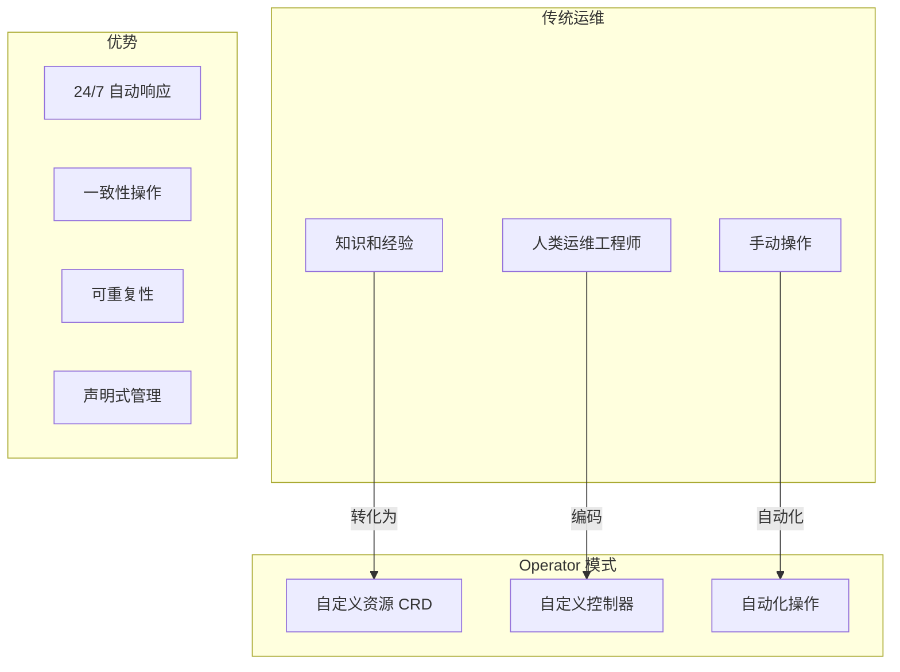
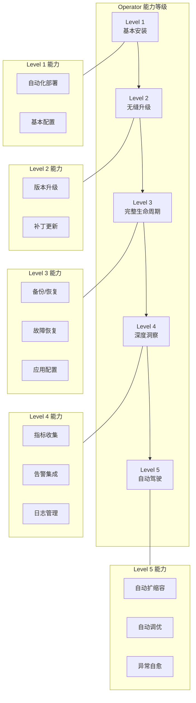
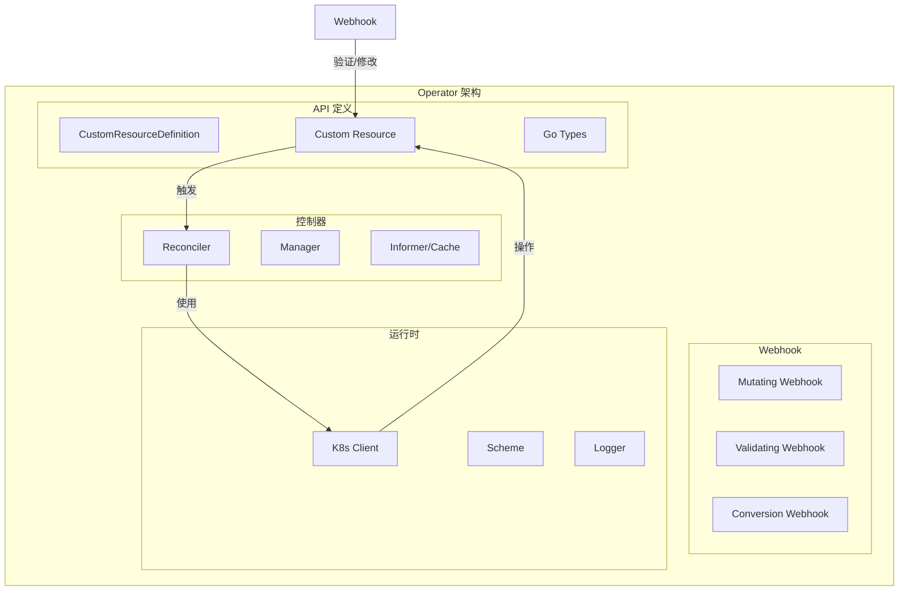
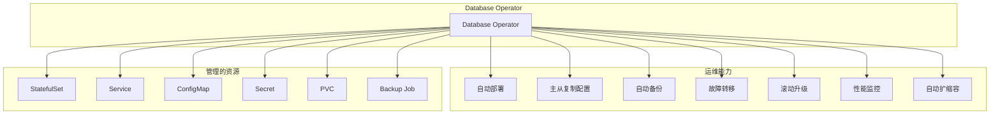
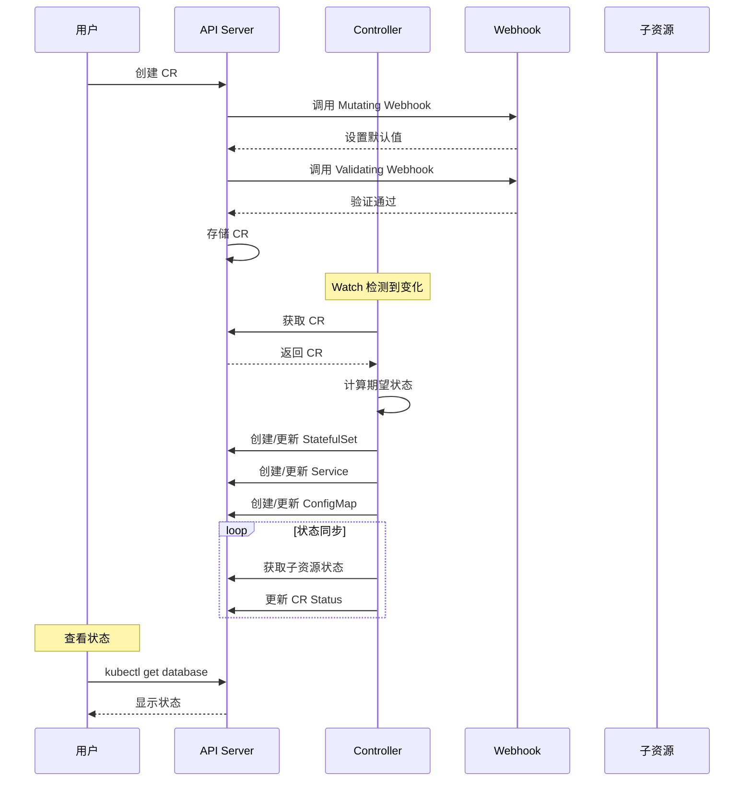

## 概述

Operator 是 Kubernetes 的一种扩展模式，将人类运维知识编码为软件，实现复杂应用的自动化管理。它通过自定义资源（CRD）和自定义控制器来扩展 Kubernetes 的能力。

## Operator 模式

### 核心理念



### 设计原则

```
┌─────────────────────────────────────────────────────────────────┐
│                      Operator 设计原则                           │
├─────────────────────────────────────────────────────────────────┤
│                                                                  │
│  1. 声明式 API                                                   │
│     - 用户声明期望状态                                            │
│     - Operator 负责达成状态                                       │
│     - 不暴露过程细节                                              │
│                                                                  │
│  2. 控制循环                                                     │
│     - 持续监听资源变化                                            │
│     - 比较期望与实际状态                                          │
│     - 执行必要的操作                                              │
│                                                                  │
│  3. 领域知识编码                                                  │
│     - 封装应用运维最佳实践                                        │
│     - 自动处理复杂场景                                            │
│     - 减少人工干预                                                │
│                                                                  │
│  4. Kubernetes 原生                                              │
│     - 利用 K8s 原语                                               │
│     - 遵循 K8s 模式                                               │
│     - 与生态系统集成                                              │
│                                                                  │
└─────────────────────────────────────────────────────────────────┘
```

## 能力模型

### Operator 成熟度等级



### 各级别详解

| 级别 | 名称 | 能力描述 | 示例 |
|-----|------|---------|------|
| Level 1 | Basic Install | 自动化安装和基本配置 | Helm 等价功能 |
| Level 2 | Seamless Upgrades | 无缝升级，补丁应用 | 滚动升级、版本管理 |
| Level 3 | Full Lifecycle | 备份恢复、应用调优、故障处理 | 数据备份、配置热更新 |
| Level 4 | Deep Insights | 指标、日志、告警、分析 | Prometheus 集成 |
| Level 5 | Auto Pilot | 自动扩缩容、异常检测、自愈 | HPA 集成、自动修复 |

## 核心组件

### 组件架构



### CRD - 自定义资源定义

```yaml
# 定义新的资源类型
apiVersion: apiextensions.k8s.io/v1
kind: CustomResourceDefinition
metadata:
  name: databases.example.com
spec:
  group: example.com
  names:
    kind: Database
    listKind: DatabaseList
    plural: databases
    singular: database
    shortNames:
      - db
  scope: Namespaced
  versions:
    - name: v1
      served: true
      storage: true
      schema:
        openAPIV3Schema:
          type: object
          properties:
            spec:
              type: object
              properties:
                engine:
                  type: string
                  enum: ["mysql", "postgresql", "mongodb"]
                version:
                  type: string
                replicas:
                  type: integer
                  minimum: 1
                  maximum: 10
                storage:
                  type: string
                  pattern: "^[0-9]+Gi$"
              required:
                - engine
                - version
            status:
              type: object
              properties:
                phase:
                  type: string
                readyReplicas:
                  type: integer
                conditions:
                  type: array
                  items:
                    type: object
                    properties:
                      type:
                        type: string
                      status:
                        type: string
                      reason:
                        type: string
                      message:
                        type: string
                      lastTransitionTime:
                        type: string
                        format: date-time
      subresources:
        status: {}
        scale:
          specReplicasPath: .spec.replicas
          statusReplicasPath: .status.readyReplicas
      additionalPrinterColumns:
        - name: Engine
          type: string
          jsonPath: .spec.engine
        - name: Version
          type: string
          jsonPath: .spec.version
        - name: Replicas
          type: integer
          jsonPath: .spec.replicas
        - name: Status
          type: string
          jsonPath: .status.phase
        - name: Age
          type: date
          jsonPath: .metadata.creationTimestamp
```

### Custom Resource 实例

```yaml
# 使用自定义资源
apiVersion: example.com/v1
kind: Database
metadata:
  name: my-database
  namespace: production
spec:
  engine: postgresql
  version: "14.5"
  replicas: 3
  storage: 100Gi
```

### Controller 控制器

```go
// 控制器核心逻辑
type DatabaseReconciler struct {
    client.Client
    Scheme *runtime.Scheme
}

func (r *DatabaseReconciler) Reconcile(ctx context.Context, req ctrl.Request) (ctrl.Result, error) {
    log := log.FromContext(ctx)

    // 1. 获取 CR
    var database examplev1.Database
    if err := r.Get(ctx, req.NamespacedName, &database); err != nil {
        return ctrl.Result{}, client.IgnoreNotFound(err)
    }

    // 2. 处理删除
    if !database.DeletionTimestamp.IsZero() {
        return r.reconcileDelete(ctx, &database)
    }

    // 3. 确保 Finalizer
    if err := r.ensureFinalizer(ctx, &database); err != nil {
        return ctrl.Result{}, err
    }

    // 4. 协调子资源
    if err := r.reconcileStatefulSet(ctx, &database); err != nil {
        return ctrl.Result{}, err
    }

    if err := r.reconcileService(ctx, &database); err != nil {
        return ctrl.Result{}, err
    }

    // 5. 更新状态
    if err := r.updateStatus(ctx, &database); err != nil {
        return ctrl.Result{}, err
    }

    return ctrl.Result{}, nil
}
```

### Webhook

```go
// Mutating Webhook - 设置默认值
func (r *Database) Default() {
    if r.Spec.Replicas == 0 {
        r.Spec.Replicas = 1
    }
    if r.Spec.Storage == "" {
        r.Spec.Storage = "10Gi"
    }
}

// Validating Webhook - 验证
func (r *Database) ValidateCreate() (admission.Warnings, error) {
    return r.validate()
}

func (r *Database) ValidateUpdate(old runtime.Object) (admission.Warnings, error) {
    oldDB := old.(*Database)

    // 不允许修改引擎类型
    if r.Spec.Engine != oldDB.Spec.Engine {
        return nil, fmt.Errorf("engine type is immutable")
    }

    return r.validate()
}

func (r *Database) validate() (admission.Warnings, error) {
    var warnings admission.Warnings

    // 验证副本数
    if r.Spec.Replicas > 10 {
        return warnings, fmt.Errorf("replicas cannot exceed 10")
    }

    return warnings, nil
}
```

## 开发框架

### 框架对比

| 框架 | 描述 | 适用场景 |
|-----|------|---------|
| Kubebuilder | 官方推荐，最常用 | 通用 Operator 开发 |
| Operator SDK | Red Hat 维护，基于 Kubebuilder | 企业级 Operator |
| KUDO | 声明式 Operator 开发 | 简单场景 |
| Metacontroller | 使用脚本编写控制器 | 快速原型 |
| kopf | Python 框架 | Python 开发者 |
| kubeops | Go 简化框架 | 轻量级场景 |

### Kubebuilder

```bash
# 初始化项目
kubebuilder init --domain example.com --repo example.com/database-operator

# 创建 API
kubebuilder create api --group cache --version v1 --kind Database

# 创建 Webhook
kubebuilder create webhook --group cache --version v1 --kind Database --defaulting --validation

# 生成 CRD 清单
make manifests

# 安装 CRD
make install

# 运行控制器
make run

# 构建镜像
make docker-build docker-push IMG=example.com/database-operator:v1.0.0

# 部署到集群
make deploy IMG=example.com/database-operator:v1.0.0
```

### Operator SDK

```bash
# 初始化项目
operator-sdk init --domain example.com --repo example.com/database-operator

# 创建 API（与 Kubebuilder 相同）
operator-sdk create api --group cache --version v1 --kind Database

# 创建 Webhook
operator-sdk create webhook --group cache --version v1 --kind Database --defaulting --validation

# 生成 Bundle（OLM 格式）
make bundle

# Scorecard 测试
operator-sdk scorecard bundle
```

## 使用场景

### 数据库运维



### 常见 Operator 示例

| Operator | 用途 | 成熟度 |
|----------|------|--------|
| Prometheus Operator | 监控系统管理 | Level 4 |
| Strimzi (Kafka) | Kafka 集群管理 | Level 4 |
| MySQL Operator | MySQL 集群管理 | Level 3 |
| MongoDB Community | MongoDB 管理 | Level 3 |
| Elastic Cloud on K8s | Elasticsearch 管理 | Level 4 |
| Redis Operator | Redis 集群管理 | Level 3 |
| Cert-Manager | 证书管理 | Level 3 |
| ArgoCD | GitOps 部署 | Level 4 |

## Operator 工作流程

### 完整流程



## 最佳实践

### 设计原则

```go
// 1. 幂等性 - 多次执行结果相同
func (r *Reconciler) Reconcile(ctx context.Context, req ctrl.Request) (ctrl.Result, error) {
    // 使用 CreateOrUpdate 确保幂等
    _, err := controllerutil.CreateOrUpdate(ctx, r.Client, resource, func() error {
        // 设置期望状态
        return nil
    })
    return ctrl.Result{}, err
}

// 2. 所有者引用 - 级联删除
func (r *Reconciler) setOwnerReference(owner, owned metav1.Object) error {
    return controllerutil.SetControllerReference(owner, owned, r.Scheme)
}

// 3. 状态条件 - 清晰的状态报告
func setCondition(conditions *[]metav1.Condition, condType string, status metav1.ConditionStatus, reason, message string) {
    meta.SetStatusCondition(conditions, metav1.Condition{
        Type:               condType,
        Status:             status,
        Reason:             reason,
        Message:            message,
        LastTransitionTime: metav1.Now(),
    })
}

// 4. Finalizer - 清理外部资源
const finalizerName = "database.example.com/finalizer"

func (r *Reconciler) reconcileDelete(ctx context.Context, db *examplev1.Database) (ctrl.Result, error) {
    if controllerutil.ContainsFinalizer(db, finalizerName) {
        // 清理外部资源
        if err := r.cleanupExternalResources(ctx, db); err != nil {
            return ctrl.Result{}, err
        }

        // 移除 Finalizer
        controllerutil.RemoveFinalizer(db, finalizerName)
        if err := r.Update(ctx, db); err != nil {
            return ctrl.Result{}, err
        }
    }
    return ctrl.Result{}, nil
}
```

### 错误处理

```go
func (r *Reconciler) Reconcile(ctx context.Context, req ctrl.Request) (ctrl.Result, error) {
    // 临时错误 - 重试
    if err := r.doSomething(); err != nil {
        if isTemporary(err) {
            return ctrl.Result{RequeueAfter: 30 * time.Second}, nil
        }
        return ctrl.Result{}, err
    }

    // 需要等待外部条件
    if !r.isReady() {
        return ctrl.Result{RequeueAfter: 10 * time.Second}, nil
    }

    // 成功
    return ctrl.Result{}, nil
}
```

## 总结

Operator 核心要点：

**模式理念**
- 将运维知识编码为软件
- 声明式 API + 控制循环
- Kubernetes 原生扩展

**核心组件**
- CRD：定义新资源类型
- Controller：实现协调逻辑
- Webhook：验证和默认值

**能力等级**
- Level 1-5 递进式能力
- 根据需求选择目标等级

**开发框架**
- Kubebuilder：官方推荐
- Operator SDK：企业特性
- 选择适合的框架

**最佳实践**
- 幂等性设计
- OwnerReference 级联删除
- 清晰的状态条件
- Finalizer 清理资源
