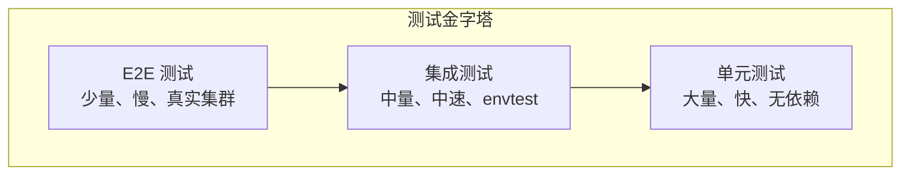

## 概述

Operator 测试是确保控制器正确性和可靠性的关键。本章介绍 Operator 的测试策略，包括单元测试、集成测试和端到端测试。

## 测试金字塔



## 单元测试

### 测试 Reconcile 逻辑

```go
// internal/controller/database_controller_test.go

package controller

import (
    "context"
    "testing"

    "github.com/stretchr/testify/assert"
    "github.com/stretchr/testify/require"
    appsv1 "k8s.io/api/apps/v1"
    corev1 "k8s.io/api/core/v1"
    metav1 "k8s.io/apimachinery/pkg/apis/meta/v1"
    "k8s.io/apimachinery/pkg/runtime"
    "k8s.io/apimachinery/pkg/types"
    ctrl "sigs.k8s.io/controller-runtime"
    "sigs.k8s.io/controller-runtime/pkg/client/fake"

    databasev1 "github.com/example/database-operator/api/v1"
)

func TestDatabaseReconciler_Reconcile(t *testing.T) {
    // 创建 Scheme
    scheme := runtime.NewScheme()
    _ = databasev1.AddToScheme(scheme)
    _ = corev1.AddToScheme(scheme)
    _ = appsv1.AddToScheme(scheme)

    tests := []struct {
        name           string
        existingObjs   []runtime.Object
        request        ctrl.Request
        expectedResult ctrl.Result
        expectedError  bool
        validate       func(t *testing.T, client client.Client)
    }{
        {
            name: "创建新的 Database",
            existingObjs: []runtime.Object{
                &databasev1.Database{
                    ObjectMeta: metav1.ObjectMeta{
                        Name:      "test-db",
                        Namespace: "default",
                    },
                    Spec: databasev1.DatabaseSpec{
                        Engine:   "postgresql",
                        Version:  "14.5",
                        Replicas: 1,
                        Storage: databasev1.StorageSpec{
                            Size: "10Gi",
                        },
                    },
                },
            },
            request: ctrl.Request{
                NamespacedName: types.NamespacedName{
                    Name:      "test-db",
                    Namespace: "default",
                },
            },
            expectedResult: ctrl.Result{Requeue: true},
            expectedError:  false,
            validate: func(t *testing.T, c client.Client) {
                // 验证 Finalizer 已添加
                db := &databasev1.Database{}
                err := c.Get(context.Background(), types.NamespacedName{
                    Name:      "test-db",
                    Namespace: "default",
                }, db)
                require.NoError(t, err)
                assert.Contains(t, db.Finalizers, "database.example.com/finalizer")
            },
        },
        {
            name: "Database 不存在",
            existingObjs: []runtime.Object{},
            request: ctrl.Request{
                NamespacedName: types.NamespacedName{
                    Name:      "non-existent",
                    Namespace: "default",
                },
            },
            expectedResult: ctrl.Result{},
            expectedError:  false,
        },
        {
            name: "Database 正在删除",
            existingObjs: []runtime.Object{
                &databasev1.Database{
                    ObjectMeta: metav1.ObjectMeta{
                        Name:              "test-db",
                        Namespace:         "default",
                        DeletionTimestamp: &metav1.Time{Time: time.Now()},
                        Finalizers:        []string{"database.example.com/finalizer"},
                    },
                    Spec: databasev1.DatabaseSpec{
                        Engine:  "postgresql",
                        Version: "14.5",
                    },
                },
            },
            request: ctrl.Request{
                NamespacedName: types.NamespacedName{
                    Name:      "test-db",
                    Namespace: "default",
                },
            },
            expectedResult: ctrl.Result{},
            expectedError:  false,
            validate: func(t *testing.T, c client.Client) {
                // 验证 Finalizer 已移除
                db := &databasev1.Database{}
                err := c.Get(context.Background(), types.NamespacedName{
                    Name:      "test-db",
                    Namespace: "default",
                }, db)
                require.NoError(t, err)
                assert.NotContains(t, db.Finalizers, "database.example.com/finalizer")
            },
        },
    }

    for _, tt := range tests {
        t.Run(tt.name, func(t *testing.T) {
            // 创建 Fake Client
            fakeClient := fake.NewClientBuilder().
                WithScheme(scheme).
                WithRuntimeObjects(tt.existingObjs...).
                Build()

            // 创建 Reconciler
            r := &DatabaseReconciler{
                Client: fakeClient,
                Scheme: scheme,
            }

            // 执行 Reconcile
            result, err := r.Reconcile(context.Background(), tt.request)

            // 验证结果
            if tt.expectedError {
                assert.Error(t, err)
            } else {
                assert.NoError(t, err)
            }
            assert.Equal(t, tt.expectedResult, result)

            // 执行自定义验证
            if tt.validate != nil {
                tt.validate(t, fakeClient)
            }
        })
    }
}
```

### 测试辅助函数

```go
func TestGenerateConfig(t *testing.T) {
    tests := []struct {
        name     string
        database *databasev1.Database
        expected string
    }{
        {
            name: "PostgreSQL 配置",
            database: &databasev1.Database{
                Spec: databasev1.DatabaseSpec{
                    Engine:  "postgresql",
                    Version: "14.5",
                },
            },
            expected: "# Configuration for postgresql 14.5\n",
        },
        {
            name: "MySQL 配置",
            database: &databasev1.Database{
                Spec: databasev1.DatabaseSpec{
                    Engine:  "mysql",
                    Version: "8.0",
                },
            },
            expected: "# Configuration for mysql 8.0\n",
        },
    }

    r := &DatabaseReconciler{}
    for _, tt := range tests {
        t.Run(tt.name, func(t *testing.T) {
            result := r.generateConfig(tt.database)
            assert.Equal(t, tt.expected, result)
        })
    }
}

func TestGetDefaultPort(t *testing.T) {
    tests := []struct {
        engine   string
        expected int32
    }{
        {"mysql", 3306},
        {"postgresql", 5432},
        {"mongodb", 27017},
        {"unknown", 0},
    }

    for _, tt := range tests {
        t.Run(tt.engine, func(t *testing.T) {
            result := getDefaultPort(tt.engine)
            assert.Equal(t, tt.expected, result)
        })
    }
}
```

### 测试 Webhook

```go
// api/v1/database_webhook_test.go

package v1

import (
    "context"
    "testing"

    "github.com/stretchr/testify/assert"
    metav1 "k8s.io/apimachinery/pkg/apis/meta/v1"
)

func TestDatabase_Default(t *testing.T) {
    tests := []struct {
        name     string
        input    *Database
        expected *Database
    }{
        {
            name: "设置默认副本数",
            input: &Database{
                Spec: DatabaseSpec{
                    Engine:  "postgresql",
                    Version: "14.5",
                },
            },
            expected: &Database{
                ObjectMeta: metav1.ObjectMeta{
                    Labels: map[string]string{
                        "app.kubernetes.io/managed-by": "database-operator",
                        "app.kubernetes.io/name":       "database",
                        "app.kubernetes.io/instance":   "",
                    },
                },
                Spec: DatabaseSpec{
                    Engine:   "postgresql",
                    Version:  "14.5",
                    Replicas: 1,
                    Storage: StorageSpec{
                        StorageClass: "standard",
                    },
                },
            },
        },
        {
            name: "保留已设置的值",
            input: &Database{
                Spec: DatabaseSpec{
                    Engine:   "postgresql",
                    Version:  "14.5",
                    Replicas: 3,
                    Storage: StorageSpec{
                        StorageClass: "fast",
                    },
                },
            },
            expected: &Database{
                ObjectMeta: metav1.ObjectMeta{
                    Labels: map[string]string{
                        "app.kubernetes.io/managed-by": "database-operator",
                        "app.kubernetes.io/name":       "database",
                        "app.kubernetes.io/instance":   "",
                    },
                },
                Spec: DatabaseSpec{
                    Engine:   "postgresql",
                    Version:  "14.5",
                    Replicas: 3,
                    Storage: StorageSpec{
                        StorageClass: "fast",
                    },
                },
            },
        },
    }

    for _, tt := range tests {
        t.Run(tt.name, func(t *testing.T) {
            tt.input.Default()
            assert.Equal(t, tt.expected.Spec.Replicas, tt.input.Spec.Replicas)
            assert.Equal(t, tt.expected.Spec.Storage.StorageClass, tt.input.Spec.Storage.StorageClass)
        })
    }
}

func TestDatabase_ValidateCreate(t *testing.T) {
    tests := []struct {
        name        string
        database    *Database
        expectError bool
    }{
        {
            name: "有效的 Database",
            database: &Database{
                Spec: DatabaseSpec{
                    Engine:   "postgresql",
                    Version:  "14.5",
                    Replicas: 3,
                },
            },
            expectError: false,
        },
        {
            name: "无效的引擎",
            database: &Database{
                Spec: DatabaseSpec{
                    Engine:   "oracle",
                    Version:  "19c",
                    Replicas: 1,
                },
            },
            expectError: true,
        },
        {
            name: "副本数过大",
            database: &Database{
                Spec: DatabaseSpec{
                    Engine:   "postgresql",
                    Version:  "14.5",
                    Replicas: 100,
                },
            },
            expectError: true,
        },
    }

    for _, tt := range tests {
        t.Run(tt.name, func(t *testing.T) {
            _, err := tt.database.ValidateCreate(context.Background(), tt.database)
            if tt.expectError {
                assert.Error(t, err)
            } else {
                assert.NoError(t, err)
            }
        })
    }
}

func TestDatabase_ValidateUpdate(t *testing.T) {
    tests := []struct {
        name        string
        oldDB       *Database
        newDB       *Database
        expectError bool
    }{
        {
            name: "允许的更新",
            oldDB: &Database{
                Spec: DatabaseSpec{
                    Engine:   "postgresql",
                    Version:  "14.5",
                    Replicas: 1,
                },
            },
            newDB: &Database{
                Spec: DatabaseSpec{
                    Engine:   "postgresql",
                    Version:  "14.5",
                    Replicas: 3,
                },
            },
            expectError: false,
        },
        {
            name: "不允许修改引擎",
            oldDB: &Database{
                Spec: DatabaseSpec{
                    Engine:   "postgresql",
                    Version:  "14.5",
                    Replicas: 1,
                },
            },
            newDB: &Database{
                Spec: DatabaseSpec{
                    Engine:   "mysql",
                    Version:  "8.0",
                    Replicas: 1,
                },
            },
            expectError: true,
        },
    }

    for _, tt := range tests {
        t.Run(tt.name, func(t *testing.T) {
            _, err := tt.newDB.ValidateUpdate(context.Background(), tt.oldDB, tt.newDB)
            if tt.expectError {
                assert.Error(t, err)
            } else {
                assert.NoError(t, err)
            }
        })
    }
}
```

## 集成测试

### envtest 设置

```go
// internal/controller/suite_test.go

package controller

import (
    "context"
    "path/filepath"
    "testing"
    "time"

    . "github.com/onsi/ginkgo/v2"
    . "github.com/onsi/gomega"

    "k8s.io/client-go/kubernetes/scheme"
    "k8s.io/client-go/rest"
    ctrl "sigs.k8s.io/controller-runtime"
    "sigs.k8s.io/controller-runtime/pkg/client"
    "sigs.k8s.io/controller-runtime/pkg/envtest"
    logf "sigs.k8s.io/controller-runtime/pkg/log"
    "sigs.k8s.io/controller-runtime/pkg/log/zap"
    metricsserver "sigs.k8s.io/controller-runtime/pkg/metrics/server"

    databasev1 "github.com/example/database-operator/api/v1"
)

var (
    cfg       *rest.Config
    k8sClient client.Client
    testEnv   *envtest.Environment
    ctx       context.Context
    cancel    context.CancelFunc
)

func TestControllers(t *testing.T) {
    RegisterFailHandler(Fail)
    RunSpecs(t, "Controller Suite")
}

var _ = BeforeSuite(func() {
    logf.SetLogger(zap.New(zap.WriteTo(GinkgoWriter), zap.UseDevMode(true)))

    ctx, cancel = context.WithCancel(context.TODO())

    By("bootstrapping test environment")
    testEnv = &envtest.Environment{
        CRDDirectoryPaths:     []string{filepath.Join("..", "..", "config", "crd", "bases")},
        ErrorIfCRDPathMissing: true,
        // 使用已存在的集群（可选）
        // UseExistingCluster: ptr.To(true),
    }

    var err error
    cfg, err = testEnv.Start()
    Expect(err).NotTo(HaveOccurred())
    Expect(cfg).NotTo(BeNil())

    err = databasev1.AddToScheme(scheme.Scheme)
    Expect(err).NotTo(HaveOccurred())

    k8sClient, err = client.New(cfg, client.Options{Scheme: scheme.Scheme})
    Expect(err).NotTo(HaveOccurred())
    Expect(k8sClient).NotTo(BeNil())

    // 启动 Controller Manager
    mgr, err := ctrl.NewManager(cfg, ctrl.Options{
        Scheme: scheme.Scheme,
        Metrics: metricsserver.Options{
            BindAddress: "0", // 禁用指标
        },
    })
    Expect(err).ToNot(HaveOccurred())

    err = (&DatabaseReconciler{
        Client: mgr.GetClient(),
        Scheme: mgr.GetScheme(),
    }).SetupWithManager(mgr)
    Expect(err).ToNot(HaveOccurred())

    go func() {
        defer GinkgoRecover()
        err = mgr.Start(ctx)
        Expect(err).ToNot(HaveOccurred())
    }()
})

var _ = AfterSuite(func() {
    cancel()
    By("tearing down the test environment")
    err := testEnv.Stop()
    Expect(err).NotTo(HaveOccurred())
})
```

### 集成测试用例

```go
// internal/controller/database_controller_integration_test.go

package controller

import (
    "time"

    . "github.com/onsi/ginkgo/v2"
    . "github.com/onsi/gomega"
    appsv1 "k8s.io/api/apps/v1"
    corev1 "k8s.io/api/core/v1"
    "k8s.io/apimachinery/pkg/api/errors"
    metav1 "k8s.io/apimachinery/pkg/apis/meta/v1"
    "k8s.io/apimachinery/pkg/types"

    databasev1 "github.com/example/database-operator/api/v1"
)

var _ = Describe("Database Controller", func() {
    const (
        timeout  = time.Second * 30
        interval = time.Millisecond * 250
    )

    Context("When creating a Database", func() {
        It("Should create all required resources", func() {
            By("Creating a new Database")
            database := &databasev1.Database{
                ObjectMeta: metav1.ObjectMeta{
                    Name:      "test-database",
                    Namespace: "default",
                },
                Spec: databasev1.DatabaseSpec{
                    Engine:   "postgresql",
                    Version:  "14.5",
                    Replicas: 1,
                    Storage: databasev1.StorageSpec{
                        Size: "10Gi",
                    },
                },
            }
            Expect(k8sClient.Create(ctx, database)).Should(Succeed())

            By("Checking the Database has a finalizer")
            Eventually(func() bool {
                db := &databasev1.Database{}
                err := k8sClient.Get(ctx, types.NamespacedName{
                    Name:      "test-database",
                    Namespace: "default",
                }, db)
                if err != nil {
                    return false
                }
                return containsString(db.Finalizers, "database.example.com/finalizer")
            }, timeout, interval).Should(BeTrue())

            By("Checking ConfigMap is created")
            Eventually(func() bool {
                cm := &corev1.ConfigMap{}
                err := k8sClient.Get(ctx, types.NamespacedName{
                    Name:      "test-database-config",
                    Namespace: "default",
                }, cm)
                return err == nil
            }, timeout, interval).Should(BeTrue())

            By("Checking Secret is created")
            Eventually(func() bool {
                secret := &corev1.Secret{}
                err := k8sClient.Get(ctx, types.NamespacedName{
                    Name:      "test-database-credentials",
                    Namespace: "default",
                }, secret)
                return err == nil
            }, timeout, interval).Should(BeTrue())

            By("Checking Service is created")
            Eventually(func() bool {
                svc := &corev1.Service{}
                err := k8sClient.Get(ctx, types.NamespacedName{
                    Name:      "test-database",
                    Namespace: "default",
                }, svc)
                return err == nil
            }, timeout, interval).Should(BeTrue())

            By("Checking StatefulSet is created")
            Eventually(func() bool {
                sts := &appsv1.StatefulSet{}
                err := k8sClient.Get(ctx, types.NamespacedName{
                    Name:      "test-database",
                    Namespace: "default",
                }, sts)
                return err == nil
            }, timeout, interval).Should(BeTrue())

            By("Cleaning up")
            Expect(k8sClient.Delete(ctx, database)).Should(Succeed())

            By("Checking Database is deleted")
            Eventually(func() bool {
                db := &databasev1.Database{}
                err := k8sClient.Get(ctx, types.NamespacedName{
                    Name:      "test-database",
                    Namespace: "default",
                }, db)
                return errors.IsNotFound(err)
            }, timeout, interval).Should(BeTrue())
        })
    })

    Context("When updating a Database", func() {
        It("Should update the StatefulSet replicas", func() {
            By("Creating a Database")
            database := &databasev1.Database{
                ObjectMeta: metav1.ObjectMeta{
                    Name:      "update-test-db",
                    Namespace: "default",
                },
                Spec: databasev1.DatabaseSpec{
                    Engine:   "postgresql",
                    Version:  "14.5",
                    Replicas: 1,
                    Storage: databasev1.StorageSpec{
                        Size: "10Gi",
                    },
                },
            }
            Expect(k8sClient.Create(ctx, database)).Should(Succeed())

            By("Waiting for StatefulSet creation")
            Eventually(func() bool {
                sts := &appsv1.StatefulSet{}
                err := k8sClient.Get(ctx, types.NamespacedName{
                    Name:      "update-test-db",
                    Namespace: "default",
                }, sts)
                return err == nil
            }, timeout, interval).Should(BeTrue())

            By("Updating Database replicas")
            Eventually(func() error {
                db := &databasev1.Database{}
                err := k8sClient.Get(ctx, types.NamespacedName{
                    Name:      "update-test-db",
                    Namespace: "default",
                }, db)
                if err != nil {
                    return err
                }
                db.Spec.Replicas = 3
                return k8sClient.Update(ctx, db)
            }, timeout, interval).Should(Succeed())

            By("Checking StatefulSet replicas updated")
            Eventually(func() int32 {
                sts := &appsv1.StatefulSet{}
                err := k8sClient.Get(ctx, types.NamespacedName{
                    Name:      "update-test-db",
                    Namespace: "default",
                }, sts)
                if err != nil {
                    return 0
                }
                return *sts.Spec.Replicas
            }, timeout, interval).Should(Equal(int32(3)))

            By("Cleaning up")
            Expect(k8sClient.Delete(ctx, database)).Should(Succeed())
        })
    })

    Context("When deleting a Database with dependent resources", func() {
        It("Should delete all owned resources", func() {
            By("Creating a Database")
            database := &databasev1.Database{
                ObjectMeta: metav1.ObjectMeta{
                    Name:      "delete-test-db",
                    Namespace: "default",
                },
                Spec: databasev1.DatabaseSpec{
                    Engine:   "postgresql",
                    Version:  "14.5",
                    Replicas: 1,
                    Storage: databasev1.StorageSpec{
                        Size: "10Gi",
                    },
                },
            }
            Expect(k8sClient.Create(ctx, database)).Should(Succeed())

            By("Waiting for all resources")
            Eventually(func() bool {
                sts := &appsv1.StatefulSet{}
                return k8sClient.Get(ctx, types.NamespacedName{
                    Name:      "delete-test-db",
                    Namespace: "default",
                }, sts) == nil
            }, timeout, interval).Should(BeTrue())

            By("Deleting the Database")
            Expect(k8sClient.Delete(ctx, database)).Should(Succeed())

            By("Checking all resources are deleted")
            Eventually(func() bool {
                sts := &appsv1.StatefulSet{}
                err := k8sClient.Get(ctx, types.NamespacedName{
                    Name:      "delete-test-db",
                    Namespace: "default",
                }, sts)
                return errors.IsNotFound(err)
            }, timeout, interval).Should(BeTrue())
        })
    })
})

func containsString(slice []string, s string) bool {
    for _, item := range slice {
        if item == s {
            return true
        }
    }
    return false
}
```

## E2E 测试

### 使用 Kind 集群

```go
// test/e2e/e2e_test.go

package e2e

import (
    "context"
    "os"
    "testing"
    "time"

    . "github.com/onsi/ginkgo/v2"
    . "github.com/onsi/gomega"
    "k8s.io/client-go/kubernetes/scheme"
    "sigs.k8s.io/controller-runtime/pkg/client"
    "sigs.k8s.io/controller-runtime/pkg/client/config"

    databasev1 "github.com/example/database-operator/api/v1"
)

var (
    k8sClient client.Client
    ctx       context.Context
)

func TestE2E(t *testing.T) {
    RegisterFailHandler(Fail)
    RunSpecs(t, "E2E Suite")
}

var _ = BeforeSuite(func() {
    ctx = context.Background()

    // 加载 kubeconfig
    cfg, err := config.GetConfig()
    Expect(err).NotTo(HaveOccurred())

    // 注册 Scheme
    err = databasev1.AddToScheme(scheme.Scheme)
    Expect(err).NotTo(HaveOccurred())

    // 创建客户端
    k8sClient, err = client.New(cfg, client.Options{Scheme: scheme.Scheme})
    Expect(err).NotTo(HaveOccurred())
})

var _ = Describe("Database Operator E2E", func() {
    const (
        timeout  = time.Minute * 5
        interval = time.Second * 5
    )

    It("Should deploy a database and make it ready", func() {
        By("Creating a Database CR")
        database := &databasev1.Database{
            ObjectMeta: metav1.ObjectMeta{
                Name:      "e2e-test-db",
                Namespace: "default",
            },
            Spec: databasev1.DatabaseSpec{
                Engine:   "postgresql",
                Version:  "14.5",
                Replicas: 1,
                Storage: databasev1.StorageSpec{
                    Size: "1Gi",
                },
            },
        }
        Expect(k8sClient.Create(ctx, database)).Should(Succeed())

        By("Waiting for Database to be Running")
        Eventually(func() string {
            db := &databasev1.Database{}
            err := k8sClient.Get(ctx, types.NamespacedName{
                Name:      "e2e-test-db",
                Namespace: "default",
            }, db)
            if err != nil {
                return ""
            }
            return string(db.Status.Phase)
        }, timeout, interval).Should(Equal("Running"))

        By("Verifying the endpoint is set")
        db := &databasev1.Database{}
        Expect(k8sClient.Get(ctx, types.NamespacedName{
            Name:      "e2e-test-db",
            Namespace: "default",
        }, db)).Should(Succeed())
        Expect(db.Status.Endpoint).NotTo(BeEmpty())

        By("Cleaning up")
        Expect(k8sClient.Delete(ctx, database)).Should(Succeed())
    })
})
```

### 测试脚本

```bash
#!/bin/bash
# test/e2e/run_e2e.sh

set -e

# 创建 Kind 集群
kind create cluster --name e2e-test --wait 60s

# 安装 Operator
make docker-build IMG=test/database-operator:e2e
kind load docker-image test/database-operator:e2e --name e2e-test
make deploy IMG=test/database-operator:e2e

# 等待 Operator 就绪
kubectl wait --for=condition=available --timeout=60s deployment/database-operator-controller-manager -n database-operator-system

# 运行 E2E 测试
go test ./test/e2e/... -v -ginkgo.v

# 清理
kind delete cluster --name e2e-test
```

## Mock 测试

### Mock Client

```go
// internal/controller/mock_client_test.go

package controller

import (
    "context"
    "testing"

    "github.com/golang/mock/gomock"
    "github.com/stretchr/testify/assert"
    "sigs.k8s.io/controller-runtime/pkg/client"

    databasev1 "github.com/example/database-operator/api/v1"
)

//go:generate mockgen -destination=mocks/mock_client.go -package=mocks sigs.k8s.io/controller-runtime/pkg/client Client

func TestReconcilerWithMock(t *testing.T) {
    ctrl := gomock.NewController(t)
    defer ctrl.Finish()

    mockClient := mocks.NewMockClient(ctrl)

    // 设置期望
    mockClient.EXPECT().
        Get(gomock.Any(), gomock.Any(), gomock.Any()).
        DoAndReturn(func(ctx context.Context, key client.ObjectKey, obj client.Object, opts ...client.GetOption) error {
            db := obj.(*databasev1.Database)
            db.Name = key.Name
            db.Namespace = key.Namespace
            db.Spec.Engine = "postgresql"
            return nil
        })

    // 测试代码
    r := &DatabaseReconciler{
        Client: mockClient,
    }

    // 执行测试...
}
```

### Fake API Server

```go
// 使用 fake client 进行更复杂的场景测试
func TestComplexScenario(t *testing.T) {
    scheme := runtime.NewScheme()
    _ = databasev1.AddToScheme(scheme)
    _ = corev1.AddToScheme(scheme)
    _ = appsv1.AddToScheme(scheme)

    // 创建带有初始状态的 fake client
    existingDB := &databasev1.Database{
        ObjectMeta: metav1.ObjectMeta{
            Name:       "existing-db",
            Namespace:  "default",
            Finalizers: []string{"database.example.com/finalizer"},
        },
        Spec: databasev1.DatabaseSpec{
            Engine:   "postgresql",
            Version:  "14.5",
            Replicas: 3,
        },
        Status: databasev1.DatabaseStatus{
            Phase:         databasev1.DatabasePhaseRunning,
            ReadyReplicas: 3,
        },
    }

    existingSTS := &appsv1.StatefulSet{
        ObjectMeta: metav1.ObjectMeta{
            Name:      "existing-db",
            Namespace: "default",
            OwnerReferences: []metav1.OwnerReference{
                {
                    APIVersion: "database.example.com/v1",
                    Kind:       "Database",
                    Name:       "existing-db",
                    UID:        existingDB.UID,
                    Controller: ptr.To(true),
                },
            },
        },
        Spec: appsv1.StatefulSetSpec{
            Replicas: ptr.To(int32(3)),
        },
        Status: appsv1.StatefulSetStatus{
            Replicas:      3,
            ReadyReplicas: 3,
        },
    }

    fakeClient := fake.NewClientBuilder().
        WithScheme(scheme).
        WithObjects(existingDB, existingSTS).
        WithStatusSubresource(existingDB).
        Build()

    // 测试扩容场景
    t.Run("Scale up replicas", func(t *testing.T) {
        // 更新 Database
        db := &databasev1.Database{}
        err := fakeClient.Get(context.Background(), types.NamespacedName{
            Name:      "existing-db",
            Namespace: "default",
        }, db)
        require.NoError(t, err)

        db.Spec.Replicas = 5
        err = fakeClient.Update(context.Background(), db)
        require.NoError(t, err)

        // 运行 Reconcile
        r := &DatabaseReconciler{
            Client: fakeClient,
            Scheme: scheme,
        }
        _, err = r.Reconcile(context.Background(), ctrl.Request{
            NamespacedName: types.NamespacedName{
                Name:      "existing-db",
                Namespace: "default",
            },
        })
        require.NoError(t, err)

        // 验证 StatefulSet 副本数已更新
        sts := &appsv1.StatefulSet{}
        err = fakeClient.Get(context.Background(), types.NamespacedName{
            Name:      "existing-db",
            Namespace: "default",
        }, sts)
        require.NoError(t, err)
        assert.Equal(t, int32(5), *sts.Spec.Replicas)
    })
}
```

## 测试最佳实践

### 测试覆盖率

```bash
# 运行测试并生成覆盖率报告
go test ./... -coverprofile=coverage.out
go tool cover -html=coverage.out -o coverage.html

# 查看覆盖率摘要
go tool cover -func=coverage.out
```

### CI 配置

```yaml
# .github/workflows/test.yaml
name: Test

on:
  push:
    branches: [main]
  pull_request:
    branches: [main]

jobs:
  unit-test:
    runs-on: ubuntu-latest
    steps:
      - uses: actions/checkout@v4

      - uses: actions/setup-go@v5
        with:
          go-version: '1.22'

      - name: Run unit tests
        run: make test

      - name: Upload coverage
        uses: codecov/codecov-action@v4
        with:
          files: ./coverage.out

  integration-test:
    runs-on: ubuntu-latest
    steps:
      - uses: actions/checkout@v4

      - uses: actions/setup-go@v5
        with:
          go-version: '1.22'

      - name: Install envtest
        run: make envtest

      - name: Run integration tests
        run: make test-integration

  e2e-test:
    runs-on: ubuntu-latest
    steps:
      - uses: actions/checkout@v4

      - uses: actions/setup-go@v5
        with:
          go-version: '1.22'

      - name: Create Kind cluster
        uses: helm/kind-action@v1

      - name: Build and load image
        run: |
          make docker-build IMG=test/operator:e2e
          kind load docker-image test/operator:e2e

      - name: Deploy operator
        run: make deploy IMG=test/operator:e2e

      - name: Run E2E tests
        run: make test-e2e
```

## 总结

Operator 测试核心要点：

**单元测试**
- 使用 fake client
- 测试 Reconcile 逻辑
- 测试辅助函数
- 测试 Webhook

**集成测试**
- 使用 envtest
- Ginkgo/Gomega 框架
- 测试资源创建和更新
- 测试删除和清理

**E2E 测试**
- Kind 集群
- 真实环境验证
- 完整工作流测试

**最佳实践**
- 测试金字塔
- 覆盖率目标
- CI 集成
- Mock 复杂依赖
