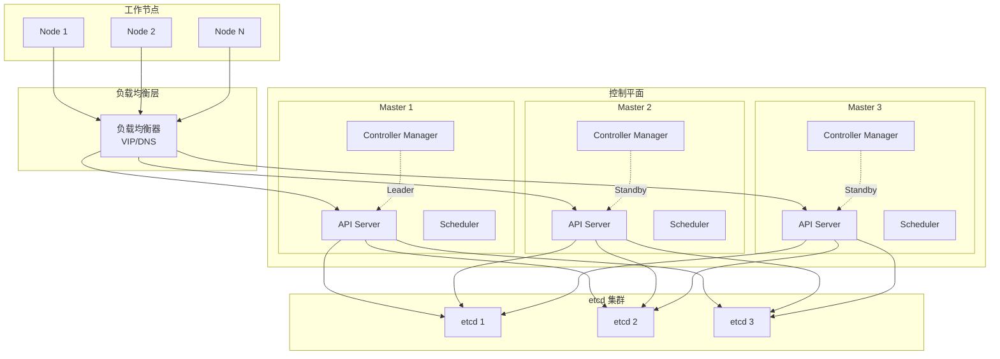
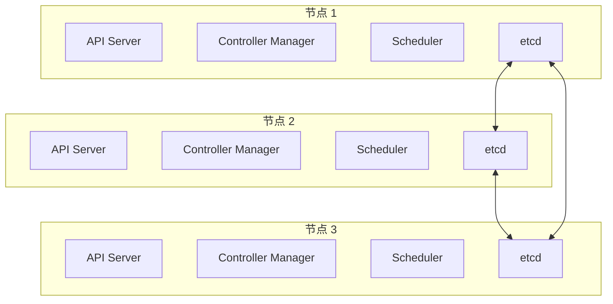
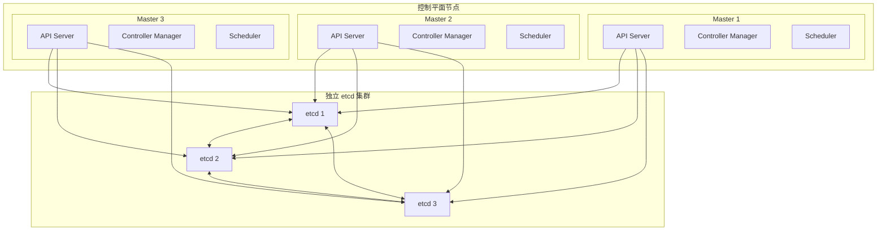
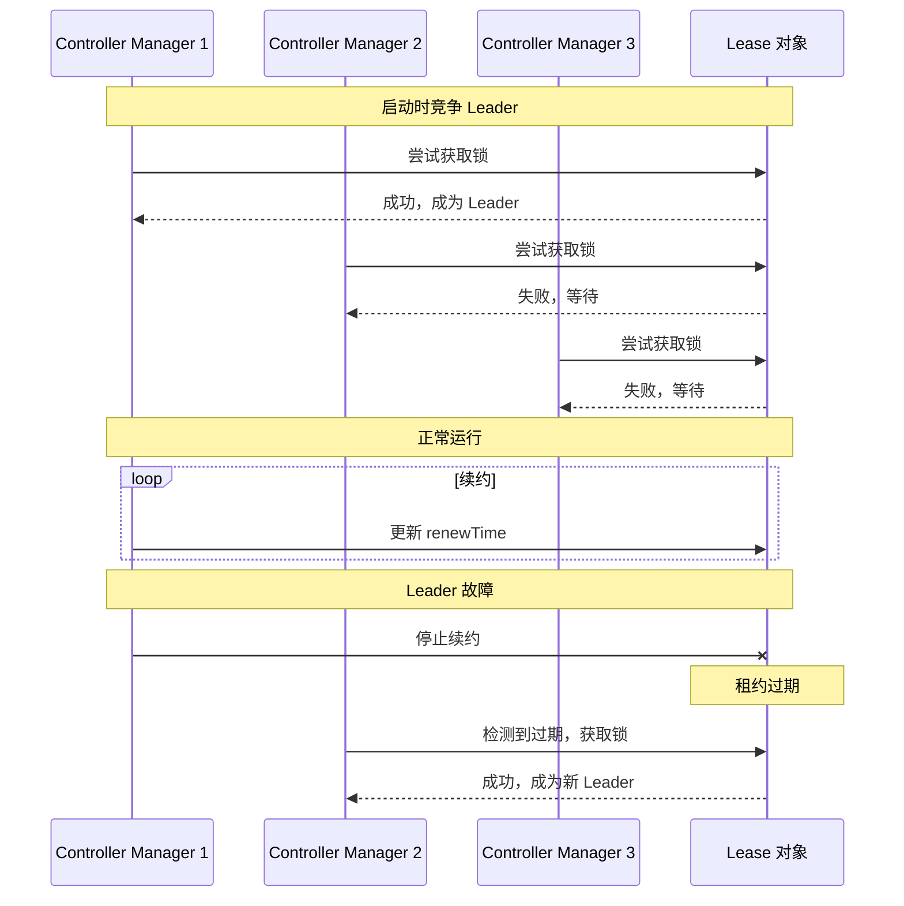
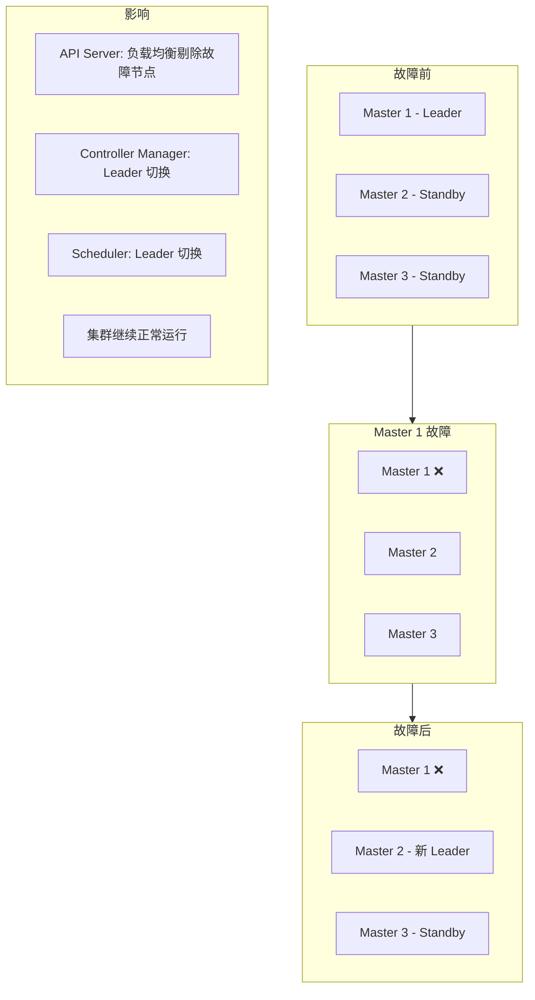

## 概述

Kubernetes 控制平面的高可用性是生产环境的基本要求。本章介绍如何设计和部署高可用的 Kubernetes 控制平面。

## HA 架构

### 整体架构



### 部署拓扑选择

| 拓扑 | 描述 | 优势 | 劣势 |
|-----|------|-----|-----|
| 堆叠 etcd | etcd 与控制平面节点共存 | 简单、资源少 | 耦合度高、故障影响大 |
| 外部 etcd | etcd 独立集群 | 隔离性好、扩展灵活 | 复杂、资源多 |

#### 堆叠 etcd 拓扑



#### 外部 etcd 拓扑



## API Server HA

### 多实例部署

```yaml
# API Server 配置
apiVersion: v1
kind: Pod
metadata:
  name: kube-apiserver
  namespace: kube-system
spec:
  containers:
    - name: kube-apiserver
      image: registry.k8s.io/kube-apiserver:v1.29.0
      command:
        - kube-apiserver
        # etcd 配置
        - --etcd-servers=https://etcd1:2379,https://etcd2:2379,https://etcd3:2379
        - --etcd-cafile=/etc/kubernetes/pki/etcd/ca.crt
        - --etcd-certfile=/etc/kubernetes/pki/apiserver-etcd-client.crt
        - --etcd-keyfile=/etc/kubernetes/pki/apiserver-etcd-client.key
        # TLS 配置
        - --tls-cert-file=/etc/kubernetes/pki/apiserver.crt
        - --tls-private-key-file=/etc/kubernetes/pki/apiserver.key
        - --client-ca-file=/etc/kubernetes/pki/ca.crt
        # 认证配置
        - --service-account-key-file=/etc/kubernetes/pki/sa.pub
        - --service-account-signing-key-file=/etc/kubernetes/pki/sa.key
        - --service-account-issuer=https://kubernetes.default.svc
        # 授权配置
        - --authorization-mode=Node,RBAC
        # 准入控制
        - --enable-admission-plugins=NodeRestriction
        # 服务配置
        - --service-cluster-ip-range=10.96.0.0/12
        - --secure-port=6443
        # HA 相关
        - --advertise-address=<节点 IP>
        - --endpoint-reconciler-type=lease
      livenessProbe:
        httpGet:
          path: /livez
          port: 6443
          scheme: HTTPS
        initialDelaySeconds: 10
        periodSeconds: 10
      readinessProbe:
        httpGet:
          path: /readyz
          port: 6443
          scheme: HTTPS
        initialDelaySeconds: 10
        periodSeconds: 10
      resources:
        requests:
          cpu: 250m
          memory: 512Mi
```

### 负载均衡配置

#### HAProxy 配置

```bash
# /etc/haproxy/haproxy.cfg

global
    log /dev/log local0
    maxconn 4096
    daemon

defaults
    mode tcp
    log global
    option tcplog
    option dontlognull
    timeout connect 5s
    timeout client 50s
    timeout server 50s

frontend kubernetes-api
    bind *:6443
    default_backend kubernetes-api-backend

backend kubernetes-api-backend
    balance roundrobin
    option tcp-check
    tcp-check connect port 6443 ssl
    server master1 192.168.1.11:6443 check fall 3 rise 2
    server master2 192.168.1.12:6443 check fall 3 rise 2
    server master3 192.168.1.13:6443 check fall 3 rise 2

# 可选：统计页面
listen stats
    bind *:8080
    mode http
    stats enable
    stats uri /stats
    stats auth admin:password
```

#### Keepalived + HAProxy

```bash
# /etc/keepalived/keepalived.conf

global_defs {
    router_id LVS_K8S
}

vrrp_script check_haproxy {
    script "/usr/bin/killall -0 haproxy"
    interval 2
    weight 2
}

vrrp_instance VI_1 {
    state MASTER  # BACKUP on other nodes
    interface eth0
    virtual_router_id 51
    priority 100  # 99, 98 on other nodes
    advert_int 1
    authentication {
        auth_type PASS
        auth_pass K8SHA
    }
    virtual_ipaddress {
        192.168.1.10/24  # VIP
    }
    track_script {
        check_haproxy
    }
}
```

#### 云负载均衡

```yaml
# AWS NLB 示例（使用 Terraform）
resource "aws_lb" "k8s_api" {
  name               = "k8s-api-lb"
  internal           = true
  load_balancer_type = "network"
  subnets            = var.private_subnet_ids

  enable_cross_zone_load_balancing = true
}

resource "aws_lb_target_group" "k8s_api" {
  name     = "k8s-api-tg"
  port     = 6443
  protocol = "TCP"
  vpc_id   = var.vpc_id

  health_check {
    protocol = "TCP"
    port     = "6443"
  }
}

resource "aws_lb_listener" "k8s_api" {
  load_balancer_arn = aws_lb.k8s_api.arn
  port              = "6443"
  protocol          = "TCP"

  default_action {
    type             = "forward"
    target_group_arn = aws_lb_target_group.k8s_api.arn
  }
}
```

## Controller Manager HA

### Leader Election 配置

```yaml
# Controller Manager 配置
apiVersion: v1
kind: Pod
metadata:
  name: kube-controller-manager
  namespace: kube-system
spec:
  containers:
    - name: kube-controller-manager
      image: registry.k8s.io/kube-controller-manager:v1.29.0
      command:
        - kube-controller-manager
        # kubeconfig
        - --kubeconfig=/etc/kubernetes/controller-manager.conf
        # 认证
        - --authentication-kubeconfig=/etc/kubernetes/controller-manager.conf
        - --authorization-kubeconfig=/etc/kubernetes/controller-manager.conf
        # 签名
        - --cluster-signing-cert-file=/etc/kubernetes/pki/ca.crt
        - --cluster-signing-key-file=/etc/kubernetes/pki/ca.key
        - --service-account-private-key-file=/etc/kubernetes/pki/sa.key
        - --root-ca-file=/etc/kubernetes/pki/ca.crt
        # 服务
        - --cluster-cidr=10.244.0.0/16
        - --service-cluster-ip-range=10.96.0.0/12
        - --allocate-node-cidrs=true
        # Leader Election
        - --leader-elect=true
        - --leader-elect-lease-duration=15s
        - --leader-elect-renew-deadline=10s
        - --leader-elect-retry-period=2s
        - --leader-elect-resource-lock=leases
        - --leader-elect-resource-name=kube-controller-manager
        - --leader-elect-resource-namespace=kube-system
      livenessProbe:
        httpGet:
          path: /healthz
          port: 10257
          scheme: HTTPS
        initialDelaySeconds: 10
        periodSeconds: 10
```

### Leader Election 原理



### 查看 Leader

```bash
# 查看 Controller Manager Leader
kubectl get lease kube-controller-manager -n kube-system -o yaml

# 输出示例
apiVersion: coordination.k8s.io/v1
kind: Lease
metadata:
  name: kube-controller-manager
  namespace: kube-system
spec:
  acquireTime: "2024-01-01T00:00:00.000000Z"
  holderIdentity: master1_xxxxxxxx-xxxx-xxxx-xxxx-xxxxxxxxxxxx
  leaseDurationSeconds: 15
  leaseTransitions: 3
  renewTime: "2024-01-01T00:01:00.000000Z"
```

## Scheduler HA

### 配置

```yaml
# Scheduler 配置
apiVersion: v1
kind: Pod
metadata:
  name: kube-scheduler
  namespace: kube-system
spec:
  containers:
    - name: kube-scheduler
      image: registry.k8s.io/kube-scheduler:v1.29.0
      command:
        - kube-scheduler
        - --kubeconfig=/etc/kubernetes/scheduler.conf
        - --authentication-kubeconfig=/etc/kubernetes/scheduler.conf
        - --authorization-kubeconfig=/etc/kubernetes/scheduler.conf
        # Leader Election
        - --leader-elect=true
        - --leader-elect-lease-duration=15s
        - --leader-elect-renew-deadline=10s
        - --leader-elect-retry-period=2s
        - --leader-elect-resource-lock=leases
        - --leader-elect-resource-name=kube-scheduler
        - --leader-elect-resource-namespace=kube-system
      livenessProbe:
        httpGet:
          path: /healthz
          port: 10259
          scheme: HTTPS
        initialDelaySeconds: 10
        periodSeconds: 10
```

## 证书管理

### 证书列表

```
/etc/kubernetes/pki/
├── ca.crt                        # 集群 CA
├── ca.key
├── apiserver.crt                 # API Server 服务端证书
├── apiserver.key
├── apiserver-kubelet-client.crt  # API Server 访问 Kubelet 的客户端证书
├── apiserver-kubelet-client.key
├── apiserver-etcd-client.crt     # API Server 访问 etcd 的客户端证书
├── apiserver-etcd-client.key
├── front-proxy-ca.crt            # 前端代理 CA
├── front-proxy-ca.key
├── front-proxy-client.crt        # 前端代理客户端证书
├── front-proxy-client.key
├── sa.key                        # ServiceAccount 签名密钥
├── sa.pub
└── etcd/
    ├── ca.crt                    # etcd CA
    ├── ca.key
    ├── server.crt                # etcd 服务端证书
    ├── server.key
    ├── peer.crt                  # etcd peer 证书
    ├── peer.key
    ├── healthcheck-client.crt    # 健康检查客户端证书
    └── healthcheck-client.key
```

### 证书轮换

```bash
# 查看证书过期时间
kubeadm certs check-expiration

# 手动轮换证书
kubeadm certs renew all

# 轮换特定证书
kubeadm certs renew apiserver
kubeadm certs renew controller-manager.conf

# 自动轮换（需要重启组件）
systemctl restart kubelet
```

## 使用 kubeadm 部署 HA

### 初始化第一个控制平面

```bash
# kubeadm-config.yaml
apiVersion: kubeadm.k8s.io/v1beta3
kind: ClusterConfiguration
kubernetesVersion: v1.29.0
controlPlaneEndpoint: "lb.example.com:6443"  # 负载均衡器地址
networking:
  podSubnet: "10.244.0.0/16"
  serviceSubnet: "10.96.0.0/12"
etcd:
  local:
    dataDir: /var/lib/etcd
apiServer:
  certSANs:
    - "lb.example.com"
    - "192.168.1.10"  # VIP
    - "192.168.1.11"
    - "192.168.1.12"
    - "192.168.1.13"
---
apiVersion: kubeadm.k8s.io/v1beta3
kind: InitConfiguration
localAPIEndpoint:
  advertiseAddress: "192.168.1.11"
  bindPort: 6443

# 初始化
kubeadm init --config=kubeadm-config.yaml --upload-certs
```

### 加入其他控制平面

```bash
# 从 init 输出获取 join 命令
kubeadm join lb.example.com:6443 \
    --token <token> \
    --discovery-token-ca-cert-hash sha256:<hash> \
    --control-plane \
    --certificate-key <certificate-key>
```

## 健康检查

### 组件健康端点

| 组件 | 健康端点 | 默认端口 |
|-----|---------|---------|
| API Server | /healthz, /livez, /readyz | 6443 |
| Controller Manager | /healthz | 10257 |
| Scheduler | /healthz | 10259 |
| etcd | /health | 2379 |

### 监控脚本

```bash
#!/bin/bash
# check-control-plane.sh

# API Server
curl -k https://localhost:6443/healthz
echo "API Server: $?"

# Controller Manager
curl -k https://localhost:10257/healthz
echo "Controller Manager: $?"

# Scheduler
curl -k https://localhost:10259/healthz
echo "Scheduler: $?"

# etcd
ETCDCTL_API=3 etcdctl \
    --endpoints=https://localhost:2379 \
    --cacert=/etc/kubernetes/pki/etcd/ca.crt \
    --cert=/etc/kubernetes/pki/etcd/healthcheck-client.crt \
    --key=/etc/kubernetes/pki/etcd/healthcheck-client.key \
    endpoint health
echo "etcd: $?"
```

## 故障场景

### 单个控制平面节点故障



### 恢复流程

```bash
# 1. 检查节点状态
kubectl get nodes

# 2. 检查组件状态
kubectl get componentstatuses

# 3. 如果节点可恢复
# 重启 kubelet
systemctl restart kubelet

# 4. 如果节点不可恢复，移除并重新加入
kubectl delete node <failed-node>
kubeadm reset
kubeadm join ...
```

## 总结

控制平面 HA 核心要点：

**架构选择**
- 堆叠 etcd：简单但耦合
- 外部 etcd：隔离但复杂
- 至少 3 个控制平面节点

**API Server**
- 多实例并行运行
- 负载均衡器分发请求
- 健康检查自动剔除

**Controller Manager / Scheduler**
- Leader Election 机制
- 只有 Leader 执行工作
- 自动故障转移

**负载均衡**
- HAProxy + Keepalived
- 云提供商 LB
- DNS 轮询

**证书管理**
- 定期检查过期
- 自动或手动轮换
- 备份证书文件
