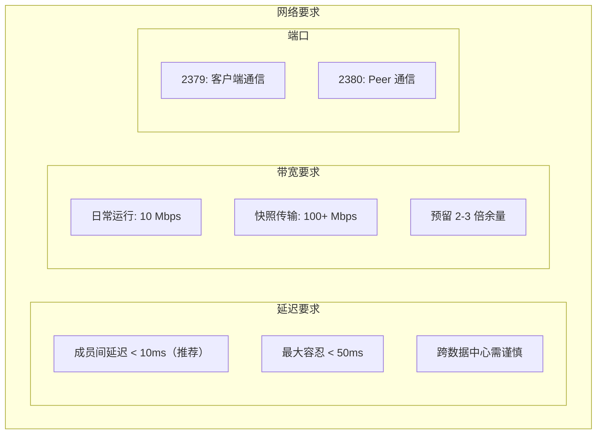
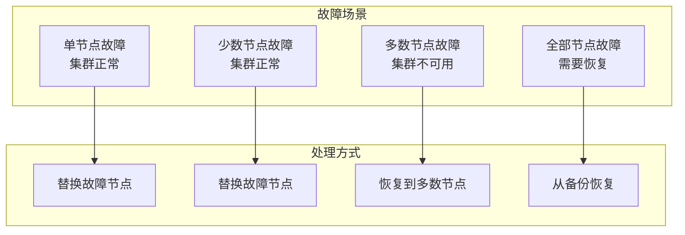

## 概述

etcd 是 Kubernetes 的核心数据存储，其高可用性直接影响整个集群的稳定性。本章详细介绍 etcd 集群的高可用部署和运维。

## 集群规划

### 节点数量选择

```
┌─────────────────────────────────────────────────────────────────┐
│                    etcd 集群节点数量选择                          │
├─────────────────────────────────────────────────────────────────┤
│                                                                  │
│  节点数    容错数    法定人数    推荐场景                         │
│  ─────────────────────────────────────────────                   │
│    1        0          1       开发/测试                         │
│    3        1          2       生产环境（推荐）                   │
│    5        2          3       大规模/高可用要求                  │
│    7        3          4       极高可用要求（少见）               │
│                                                                  │
│  计算公式:                                                       │
│  - 容错数 = (N-1)/2                                              │
│  - 法定人数 = N/2 + 1                                            │
│                                                                  │
│  注意:                                                           │
│  - 建议使用奇数节点                                              │
│  - 超过 7 节点性能下降明显                                       │
│  - 跨数据中心部署考虑延迟                                        │
│                                                                  │
└─────────────────────────────────────────────────────────────────┘
```

### 硬件要求

| 集群规模 | CPU | 内存 | 磁盘 | 网络 |
|---------|-----|------|-----|------|
| 小型 (<100 节点) | 2 核 | 8 GB | SSD 50 GB | 1 Gbps |
| 中型 (<500 节点) | 4 核 | 16 GB | SSD 100 GB | 1 Gbps |
| 大型 (<1000 节点) | 8 核 | 32 GB | NVMe 200 GB | 10 Gbps |
| 超大型 (>1000 节点) | 16 核 | 64 GB | NVMe 500 GB | 10 Gbps |

### 网络要求



## 部署模式

### 静态配置部署

```bash
# etcd 节点 1
etcd \
  --name=etcd1 \
  --data-dir=/var/lib/etcd \
  --listen-client-urls=https://192.168.1.11:2379 \
  --advertise-client-urls=https://192.168.1.11:2379 \
  --listen-peer-urls=https://192.168.1.11:2380 \
  --initial-advertise-peer-urls=https://192.168.1.11:2380 \
  --initial-cluster=etcd1=https://192.168.1.11:2380,etcd2=https://192.168.1.12:2380,etcd3=https://192.168.1.13:2380 \
  --initial-cluster-token=etcd-cluster-token \
  --initial-cluster-state=new \
  --client-cert-auth=true \
  --trusted-ca-file=/etc/etcd/pki/ca.crt \
  --cert-file=/etc/etcd/pki/server.crt \
  --key-file=/etc/etcd/pki/server.key \
  --peer-client-cert-auth=true \
  --peer-trusted-ca-file=/etc/etcd/pki/ca.crt \
  --peer-cert-file=/etc/etcd/pki/peer.crt \
  --peer-key-file=/etc/etcd/pki/peer.key

# etcd 节点 2
etcd \
  --name=etcd2 \
  --data-dir=/var/lib/etcd \
  --listen-client-urls=https://192.168.1.12:2379 \
  --advertise-client-urls=https://192.168.1.12:2379 \
  --listen-peer-urls=https://192.168.1.12:2380 \
  --initial-advertise-peer-urls=https://192.168.1.12:2380 \
  --initial-cluster=etcd1=https://192.168.1.11:2380,etcd2=https://192.168.1.12:2380,etcd3=https://192.168.1.13:2380 \
  --initial-cluster-token=etcd-cluster-token \
  --initial-cluster-state=new \
  # ... TLS 配置同上

# etcd 节点 3
etcd \
  --name=etcd3 \
  --data-dir=/var/lib/etcd \
  --listen-client-urls=https://192.168.1.13:2379 \
  --advertise-client-urls=https://192.168.1.13:2379 \
  --listen-peer-urls=https://192.168.1.13:2380 \
  --initial-advertise-peer-urls=https://192.168.1.13:2380 \
  --initial-cluster=etcd1=https://192.168.1.11:2380,etcd2=https://192.168.1.12:2380,etcd3=https://192.168.1.13:2380 \
  --initial-cluster-token=etcd-cluster-token \
  --initial-cluster-state=new \
  # ... TLS 配置同上
```

### Systemd 服务配置

```ini
# /etc/systemd/system/etcd.service
[Unit]
Description=etcd key-value store
Documentation=https://github.com/etcd-io/etcd
After=network.target

[Service]
Type=notify
User=etcd
EnvironmentFile=/etc/etcd/etcd.conf
ExecStart=/usr/local/bin/etcd
Restart=always
RestartSec=10s
LimitNOFILE=40000

[Install]
WantedBy=multi-user.target
```

```bash
# /etc/etcd/etcd.conf
ETCD_NAME=etcd1
ETCD_DATA_DIR=/var/lib/etcd
ETCD_LISTEN_CLIENT_URLS=https://192.168.1.11:2379
ETCD_ADVERTISE_CLIENT_URLS=https://192.168.1.11:2379
ETCD_LISTEN_PEER_URLS=https://192.168.1.11:2380
ETCD_INITIAL_ADVERTISE_PEER_URLS=https://192.168.1.11:2380
ETCD_INITIAL_CLUSTER=etcd1=https://192.168.1.11:2380,etcd2=https://192.168.1.12:2380,etcd3=https://192.168.1.13:2380
ETCD_INITIAL_CLUSTER_TOKEN=etcd-cluster-token
ETCD_INITIAL_CLUSTER_STATE=new
ETCD_CLIENT_CERT_AUTH=true
ETCD_TRUSTED_CA_FILE=/etc/etcd/pki/ca.crt
ETCD_CERT_FILE=/etc/etcd/pki/server.crt
ETCD_KEY_FILE=/etc/etcd/pki/server.key
ETCD_PEER_CLIENT_CERT_AUTH=true
ETCD_PEER_TRUSTED_CA_FILE=/etc/etcd/pki/ca.crt
ETCD_PEER_CERT_FILE=/etc/etcd/pki/peer.crt
ETCD_PEER_KEY_FILE=/etc/etcd/pki/peer.key
```

## 成员管理

### 查看成员

```bash
# 设置环境变量
export ETCDCTL_API=3
export ETCDCTL_ENDPOINTS=https://192.168.1.11:2379,https://192.168.1.12:2379,https://192.168.1.13:2379
export ETCDCTL_CACERT=/etc/etcd/pki/ca.crt
export ETCDCTL_CERT=/etc/etcd/pki/client.crt
export ETCDCTL_KEY=/etc/etcd/pki/client.key

# 查看成员列表
etcdctl member list -w table

# 输出
+------------------+---------+-------+----------------------------+----------------------------+------------+
|        ID        | STATUS  | NAME  |         PEER ADDRS         |        CLIENT ADDRS        | IS LEARNER |
+------------------+---------+-------+----------------------------+----------------------------+------------+
| 8e9e05c52164694d | started | etcd1 | https://192.168.1.11:2380  | https://192.168.1.11:2379  |      false |
| 91bc3c398fb3c146 | started | etcd2 | https://192.168.1.12:2380  | https://192.168.1.12:2379  |      false |
| fd422379fda50e48 | started | etcd3 | https://192.168.1.13:2380  | https://192.168.1.13:2379  |      false |
+------------------+---------+-------+----------------------------+----------------------------+------------+

# 查看端点状态
etcdctl endpoint status -w table

# 查看端点健康
etcdctl endpoint health
```

### 添加成员

```bash
# 1. 在现有集群中添加成员（不启动新节点）
etcdctl member add etcd4 --peer-urls=https://192.168.1.14:2380

# 输出
Member 3a57933972cb5131 added to cluster 123456789

ETCD_NAME="etcd4"
ETCD_INITIAL_CLUSTER="etcd1=https://192.168.1.11:2380,etcd2=https://192.168.1.12:2380,etcd3=https://192.168.1.13:2380,etcd4=https://192.168.1.14:2380"
ETCD_INITIAL_ADVERTISE_PEER_URLS="https://192.168.1.14:2380"
ETCD_INITIAL_CLUSTER_STATE="existing"

# 2. 在新节点上启动 etcd（使用上面的配置）
etcd \
  --name=etcd4 \
  --data-dir=/var/lib/etcd \
  --listen-client-urls=https://192.168.1.14:2379 \
  --advertise-client-urls=https://192.168.1.14:2379 \
  --listen-peer-urls=https://192.168.1.14:2380 \
  --initial-advertise-peer-urls=https://192.168.1.14:2380 \
  --initial-cluster=etcd1=https://192.168.1.11:2380,etcd2=https://192.168.1.12:2380,etcd3=https://192.168.1.13:2380,etcd4=https://192.168.1.14:2380 \
  --initial-cluster-state=existing \
  # ... TLS 配置
```

### 移除成员

```bash
# 1. 获取成员 ID
etcdctl member list

# 2. 移除成员
etcdctl member remove 3a57933972cb5131

# 3. 停止被移除节点上的 etcd
systemctl stop etcd

# 4. 清理数据目录（如果需要重新加入）
rm -rf /var/lib/etcd/*
```

### 更新成员

```bash
# 更新成员的 peer URL
etcdctl member update 8e9e05c52164694d --peer-urls=https://192.168.1.11:2380
```

## 故障处理

### 故障场景分析



### 单节点恢复

```bash
# 场景：etcd2 节点故障

# 1. 从集群中移除故障成员
etcdctl member remove <etcd2-member-id>

# 2. 清理故障节点数据
ssh etcd2 "rm -rf /var/lib/etcd/*"

# 3. 重新添加成员
etcdctl member add etcd2 --peer-urls=https://192.168.1.12:2380

# 4. 在恢复节点上启动 etcd
etcd \
  --name=etcd2 \
  --initial-cluster-state=existing \
  # ... 其他配置
```

### 多数节点故障恢复

```bash
# 场景：3 节点集群中 2 节点故障，需要强制恢复

# 在存活节点上执行
# 1. 停止 etcd
systemctl stop etcd

# 2. 强制创建新集群（单节点）
etcd \
  --name=etcd1 \
  --force-new-cluster \
  --data-dir=/var/lib/etcd \
  # ... 其他配置

# 3. 验证集群状态
etcdctl member list

# 4. 重新添加其他节点
etcdctl member add etcd2 --peer-urls=https://192.168.1.12:2380
etcdctl member add etcd3 --peer-urls=https://192.168.1.13:2380

# 5. 启动其他节点
```

### 从备份恢复

```bash
# 1. 在所有节点上停止 etcd
systemctl stop etcd

# 2. 清理数据目录
rm -rf /var/lib/etcd/*

# 3. 在第一个节点上恢复快照
etcdctl snapshot restore /path/to/snapshot.db \
  --name=etcd1 \
  --data-dir=/var/lib/etcd \
  --initial-cluster=etcd1=https://192.168.1.11:2380,etcd2=https://192.168.1.12:2380,etcd3=https://192.168.1.13:2380 \
  --initial-cluster-token=etcd-cluster-restored \
  --initial-advertise-peer-urls=https://192.168.1.11:2380

# 4. 在其他节点上恢复
# etcd2
etcdctl snapshot restore /path/to/snapshot.db \
  --name=etcd2 \
  --data-dir=/var/lib/etcd \
  --initial-cluster=etcd1=https://192.168.1.11:2380,etcd2=https://192.168.1.12:2380,etcd3=https://192.168.1.13:2380 \
  --initial-cluster-token=etcd-cluster-restored \
  --initial-advertise-peer-urls=https://192.168.1.12:2380

# etcd3
etcdctl snapshot restore /path/to/snapshot.db \
  --name=etcd3 \
  --data-dir=/var/lib/etcd \
  --initial-cluster=etcd1=https://192.168.1.11:2380,etcd2=https://192.168.1.12:2380,etcd3=https://192.168.1.13:2380 \
  --initial-cluster-token=etcd-cluster-restored \
  --initial-advertise-peer-urls=https://192.168.1.13:2380

# 5. 启动所有节点
systemctl start etcd
```

## 监控告警

### 关键指标

```yaml
# Prometheus 抓取配置
- job_name: 'etcd'
  scheme: https
  tls_config:
    ca_file: /etc/prometheus/etcd-ca.crt
    cert_file: /etc/prometheus/etcd-client.crt
    key_file: /etc/prometheus/etcd-client.key
  static_configs:
    - targets:
      - 192.168.1.11:2379
      - 192.168.1.12:2379
      - 192.168.1.13:2379
```

### 告警规则

```yaml
groups:
  - name: etcd
    rules:
      # 成员数量异常
      - alert: EtcdMembersMismatch
        expr: etcd_server_has_leader{job="etcd"} == 0
        for: 1m
        labels:
          severity: critical
        annotations:
          summary: "etcd 集群没有 Leader"
          description: "etcd 成员 {{ $labels.instance }} 报告集群没有 Leader"

      # Leader 变更频繁
      - alert: EtcdHighLeaderChanges
        expr: increase(etcd_server_leader_changes_seen_total{job="etcd"}[1h]) > 3
        for: 5m
        labels:
          severity: warning
        annotations:
          summary: "etcd Leader 变更频繁"
          description: "etcd 集群在 1 小时内 Leader 变更超过 3 次"

      # 后端配额使用率高
      - alert: EtcdBackendQuotaLowSpace
        expr: (etcd_mvcc_db_total_size_in_bytes / etcd_server_quota_backend_bytes) > 0.8
        for: 5m
        labels:
          severity: warning
        annotations:
          summary: "etcd 存储配额使用率高"
          description: "etcd {{ $labels.instance }} 存储配额使用率超过 80%"

      # 提交延迟高
      - alert: EtcdHighCommitDurations
        expr: histogram_quantile(0.99, rate(etcd_disk_wal_fsync_duration_seconds_bucket{job="etcd"}[5m])) > 0.5
        for: 5m
        labels:
          severity: warning
        annotations:
          summary: "etcd WAL fsync 延迟高"
          description: "etcd {{ $labels.instance }} P99 WAL fsync 延迟超过 500ms"

      # Peer 通信延迟高
      - alert: EtcdHighPeerRTT
        expr: histogram_quantile(0.99, rate(etcd_network_peer_round_trip_time_seconds_bucket{job="etcd"}[5m])) > 0.15
        for: 5m
        labels:
          severity: warning
        annotations:
          summary: "etcd Peer RTT 延迟高"
          description: "etcd {{ $labels.instance }} P99 Peer RTT 超过 150ms"

      # 待处理提案数量高
      - alert: EtcdHighNumberOfFailedProposals
        expr: increase(etcd_server_proposals_failed_total{job="etcd"}[1h]) > 5
        for: 5m
        labels:
          severity: warning
        annotations:
          summary: "etcd 提案失败数量高"
          description: "etcd {{ $labels.instance }} 在 1 小时内有超过 5 个失败的提案"
```

### Grafana 仪表板

```json
{
  "dashboard": {
    "title": "etcd Dashboard",
    "panels": [
      {
        "title": "Leader",
        "type": "stat",
        "targets": [
          {
            "expr": "max(etcd_server_is_leader{job=\"etcd\"})"
          }
        ]
      },
      {
        "title": "DB Size",
        "type": "graph",
        "targets": [
          {
            "expr": "etcd_mvcc_db_total_size_in_bytes{job=\"etcd\"}",
            "legendFormat": "{{ instance }}"
          }
        ]
      },
      {
        "title": "WAL Fsync Latency",
        "type": "graph",
        "targets": [
          {
            "expr": "histogram_quantile(0.99, rate(etcd_disk_wal_fsync_duration_seconds_bucket{job=\"etcd\"}[5m]))",
            "legendFormat": "{{ instance }} P99"
          }
        ]
      },
      {
        "title": "Peer RTT",
        "type": "graph",
        "targets": [
          {
            "expr": "histogram_quantile(0.99, rate(etcd_network_peer_round_trip_time_seconds_bucket{job=\"etcd\"}[5m]))",
            "legendFormat": "{{ instance }} P99"
          }
        ]
      }
    ]
  }
}
```

## 运维最佳实践

### 定期维护

```bash
#!/bin/bash
# etcd-maintenance.sh

# 设置环境变量
export ETCDCTL_API=3
export ETCDCTL_ENDPOINTS=https://192.168.1.11:2379
export ETCDCTL_CACERT=/etc/etcd/pki/ca.crt
export ETCDCTL_CERT=/etc/etcd/pki/client.crt
export ETCDCTL_KEY=/etc/etcd/pki/client.key

# 1. 检查集群健康
echo "Checking cluster health..."
etcdctl endpoint health

# 2. 查看存储使用
echo "Checking database size..."
etcdctl endpoint status -w table

# 3. 执行压缩
echo "Compacting..."
rev=$(etcdctl endpoint status -w json | jq -r '.[0].Status.header.revision')
etcdctl compact $rev

# 4. 碎片整理
echo "Defragmenting..."
etcdctl defrag

# 5. 创建快照
echo "Creating snapshot..."
etcdctl snapshot save /backup/etcd-$(date +%Y%m%d).db

# 6. 验证快照
echo "Verifying snapshot..."
etcdctl snapshot status /backup/etcd-$(date +%Y%m%d).db -w table
```

### 容量规划

```bash
# 查看当前数据量
etcdctl endpoint status -w table

# 估算增长
# - 每个 Pod 约 1-2 KB
# - 每个 Secret/ConfigMap 约 1-10 KB
# - 每个 Event 约 0.5 KB

# 设置合理的配额
etcd --quota-backend-bytes=8589934592  # 8 GB

# 监控使用率
etcdctl alarm list
```

## 总结

etcd HA 核心要点：

**集群规划**
- 3 或 5 节点（奇数）
- SSD/NVMe 磁盘
- 低延迟网络

**部署配置**
- TLS 加密通信
- 静态或动态发现
- 合理的心跳和选举超时

**成员管理**
- 添加前先注册
- 移除后再停止
- 保持法定人数

**故障恢复**
- 单节点：重新加入
- 多数故障：force-new-cluster
- 全部故障：从备份恢复

**监控告警**
- Leader 状态
- 延迟指标
- 存储使用率
