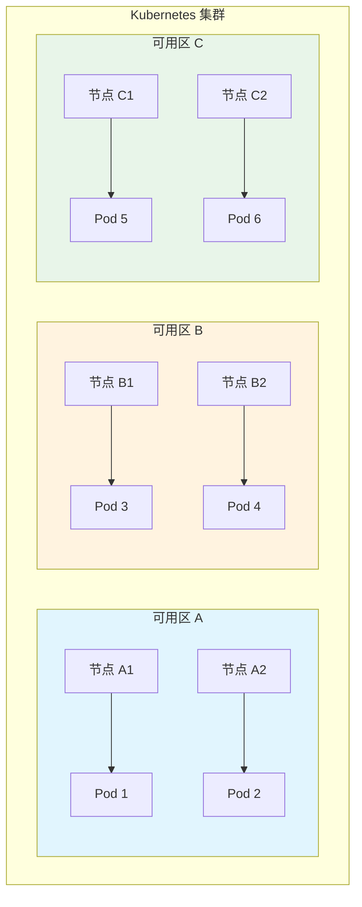
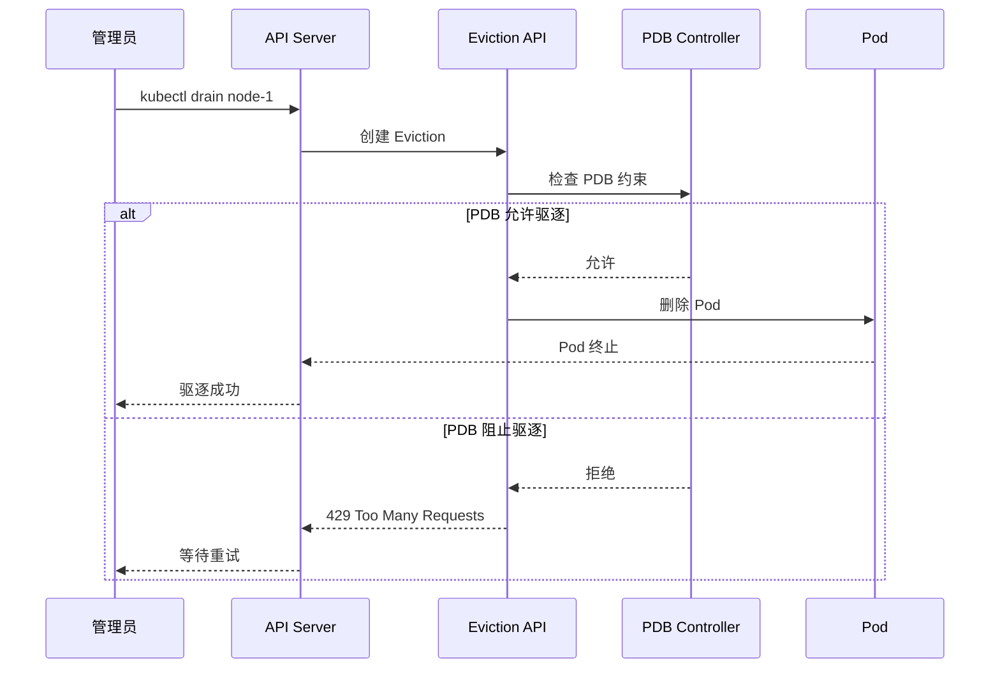
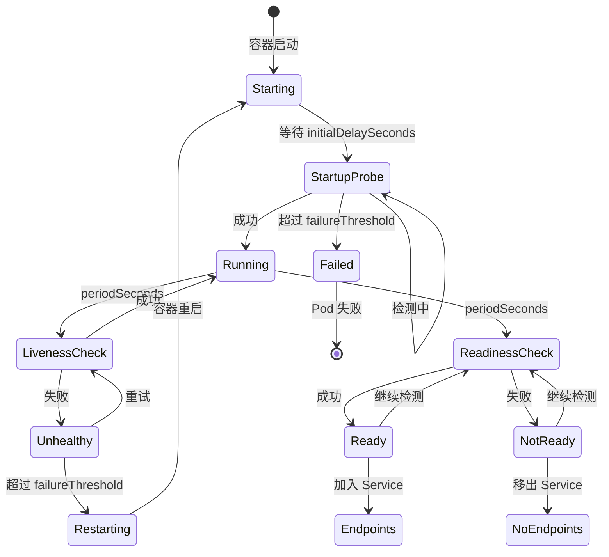
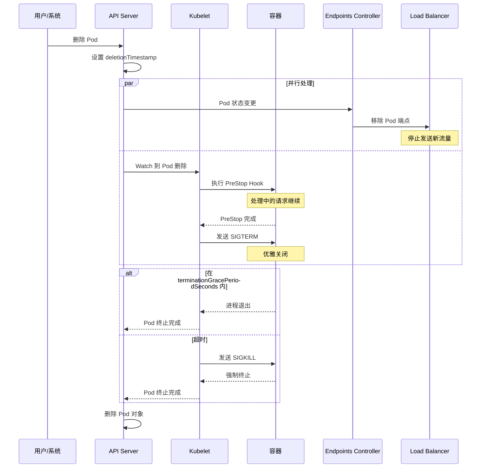
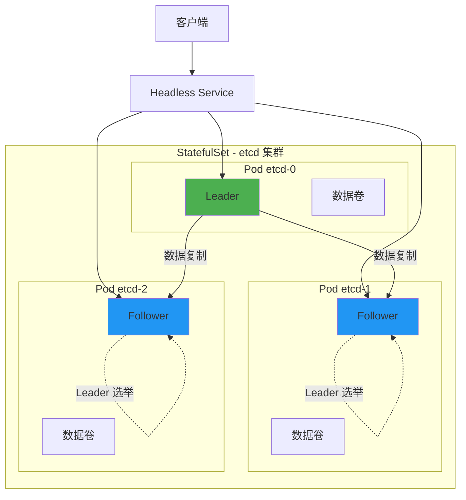

## 概述

工作负载高可用是 Kubernetes 应用可靠性的核心保障。本文深入解析 Kubernetes 提供的各种工作负载高可用机制，包括多副本策略、Pod 中断预算、健康检查、优雅终止等关键技术，帮助读者构建高可用的应用架构。

## 多副本部署策略

### 副本数量规划

```yaml
# 生产环境推荐的多副本配置
apiVersion: apps/v1
kind: Deployment
metadata:
  name: web-app
  namespace: production
spec:
  # 副本数量建议：
  # - 无状态应用：至少 3 个副本
  # - 关键服务：5-7 个副本
  # - 计算型服务：根据负载动态调整
  replicas: 3

  strategy:
    type: RollingUpdate
    rollingUpdate:
      # 滚动更新时最多额外创建的 Pod 数量
      maxSurge: 1
      # 滚动更新时最多不可用的 Pod 数量
      maxUnavailable: 0  # 保证零停机更新

  selector:
    matchLabels:
      app: web-app

  template:
    metadata:
      labels:
        app: web-app
    spec:
      # 副本分布策略
      topologySpreadConstraints:
        # 跨可用区分布
        - maxSkew: 1
          topologyKey: topology.kubernetes.io/zone
          whenUnsatisfiable: DoNotSchedule
          labelSelector:
            matchLabels:
              app: web-app
        # 跨节点分布
        - maxSkew: 1
          topologyKey: kubernetes.io/hostname
          whenUnsatisfiable: ScheduleAnyway
          labelSelector:
            matchLabels:
              app: web-app

      containers:
        - name: web-app
          image: web-app:v1.0
          resources:
            requests:
              cpu: "100m"
              memory: "128Mi"
            limits:
              cpu: "500m"
              memory: "512Mi"
```

### 反亲和性配置

```yaml
apiVersion: apps/v1
kind: Deployment
metadata:
  name: critical-service
spec:
  replicas: 3
  template:
    spec:
      affinity:
        # Pod 反亲和性 - 避免副本集中在同一节点
        podAntiAffinity:
          # 强制要求 - 不同节点
          requiredDuringSchedulingIgnoredDuringExecution:
            - labelSelector:
                matchExpressions:
                  - key: app
                    operator: In
                    values:
                      - critical-service
              topologyKey: kubernetes.io/hostname

          # 软性要求 - 尽量不同可用区
          preferredDuringSchedulingIgnoredDuringExecution:
            - weight: 100
              podAffinityTerm:
                labelSelector:
                  matchExpressions:
                    - key: app
                      operator: In
                      values:
                        - critical-service
                topologyKey: topology.kubernetes.io/zone

        # 节点亲和性 - 选择特定节点
        nodeAffinity:
          requiredDuringSchedulingIgnoredDuringExecution:
            nodeSelectorTerms:
              - matchExpressions:
                  - key: node-type
                    operator: In
                    values:
                      - production
          preferredDuringSchedulingIgnoredDuringExecution:
            - weight: 50
              preference:
                matchExpressions:
                  - key: disk-type
                    operator: In
                    values:
                      - ssd

      containers:
        - name: app
          image: critical-service:v1.0
```

### 拓扑分布约束



```yaml
apiVersion: apps/v1
kind: Deployment
metadata:
  name: distributed-app
spec:
  replicas: 6
  template:
    spec:
      topologySpreadConstraints:
        # 约束 1：跨可用区均匀分布
        - maxSkew: 1
          topologyKey: topology.kubernetes.io/zone
          whenUnsatisfiable: DoNotSchedule
          labelSelector:
            matchLabels:
              app: distributed-app
          # 仅计算匹配 Pod
          matchLabelKeys:
            - pod-template-hash

        # 约束 2：跨节点均匀分布
        - maxSkew: 2
          topologyKey: kubernetes.io/hostname
          whenUnsatisfiable: ScheduleAnyway
          labelSelector:
            matchLabels:
              app: distributed-app
          # 节点选择器（可选）
          nodeAffinityPolicy: Honor
          nodeTaintsPolicy: Honor

      containers:
        - name: app
          image: distributed-app:v1.0
```

## Pod 中断预算

### PDB 配置策略

Pod Disruption Budget（PDB）保护应用在自愿中断期间的可用性：

```yaml
# 基于最小可用副本数
apiVersion: policy/v1
kind: PodDisruptionBudget
metadata:
  name: web-app-pdb
  namespace: production
spec:
  # 至少保持 2 个 Pod 可用
  minAvailable: 2
  selector:
    matchLabels:
      app: web-app
---
# 基于最大不可用副本数
apiVersion: policy/v1
kind: PodDisruptionBudget
metadata:
  name: api-server-pdb
  namespace: production
spec:
  # 最多允许 1 个 Pod 不可用
  maxUnavailable: 1
  selector:
    matchLabels:
      app: api-server
---
# 使用百分比
apiVersion: policy/v1
kind: PodDisruptionBudget
metadata:
  name: worker-pdb
  namespace: production
spec:
  # 最多 25% 的 Pod 不可用
  maxUnavailable: "25%"
  selector:
    matchLabels:
      app: worker
  # 排除不健康的 Pod（v1.26+）
  unhealthyPodEvictionPolicy: IfHealthyBudget
```

### PDB 工作原理



### PDB 状态监控

```go
// pkg/controller/disruption/disruption.go

// PDB 控制器计算可用性
func (dc *DisruptionController) getExpectedPodCount(pdb *policy.PodDisruptionBudget, pods []*v1.Pod) (int32, int32, error) {
    // 计算期望的 Pod 数量
    expectedCount, err := dc.getExpectedScale(pdb, pods)
    if err != nil {
        return 0, 0, err
    }

    // 计算健康的 Pod 数量
    healthyCount := int32(0)
    for _, pod := range pods {
        if dc.isPodHealthy(pod) {
            healthyCount++
        }
    }

    return expectedCount, healthyCount, nil
}

// 计算允许的中断数量
func (dc *DisruptionController) calculateDisruptionsAllowed(pdb *policy.PodDisruptionBudget) int32 {
    // 获取当前健康 Pod 数量
    currentHealthy := pdb.Status.CurrentHealthy

    // 计算最小可用数
    var minAvailable int32
    if pdb.Spec.MinAvailable != nil {
        minAvailable, _ = intstr.GetScaledValueFromIntOrPercent(
            pdb.Spec.MinAvailable,
            int(pdb.Status.ExpectedPods),
            true,
        )
    } else if pdb.Spec.MaxUnavailable != nil {
        maxUnavailable, _ := intstr.GetScaledValueFromIntOrPercent(
            pdb.Spec.MaxUnavailable,
            int(pdb.Status.ExpectedPods),
            true,
        )
        minAvailable = pdb.Status.ExpectedPods - maxUnavailable
    }

    // 允许中断数 = 当前健康数 - 最小可用数
    disruptionsAllowed := currentHealthy - minAvailable
    if disruptionsAllowed < 0 {
        return 0
    }
    return disruptionsAllowed
}
```

### PDB 最佳实践

| 场景 | 推荐配置 | 说明 |
|------|----------|------|
| 无状态 Web 服务 | minAvailable: 50% 或 maxUnavailable: 1 | 保证服务容量 |
| 数据库主从 | minAvailable: 2 | 保证至少主从各一个 |
| 单副本服务 | maxUnavailable: 0 | 完全阻止驱逐 |
| 批处理任务 | 不设置 PDB | 允许任意驱逐 |
| Kafka 集群 | minAvailable: N-1 | N 为副本因子 |

## 健康检查机制

### 探针类型与配置

```yaml
apiVersion: v1
kind: Pod
metadata:
  name: app-with-probes
spec:
  containers:
    - name: app
      image: app:v1.0
      ports:
        - containerPort: 8080

      # 启动探针 - 用于慢启动应用
      startupProbe:
        httpGet:
          path: /healthz/startup
          port: 8080
        # 初始延迟
        initialDelaySeconds: 0
        # 检测间隔
        periodSeconds: 10
        # 超时时间
        timeoutSeconds: 5
        # 成功阈值
        successThreshold: 1
        # 失败阈值 - 30 * 10 = 300 秒启动窗口
        failureThreshold: 30

      # 存活探针 - 检测容器是否正常运行
      livenessProbe:
        httpGet:
          path: /healthz/live
          port: 8080
          httpHeaders:
            - name: Custom-Header
              value: Awesome
        initialDelaySeconds: 0
        periodSeconds: 10
        timeoutSeconds: 5
        successThreshold: 1
        failureThreshold: 3

      # 就绪探针 - 检测容器是否可以接收流量
      readinessProbe:
        httpGet:
          path: /healthz/ready
          port: 8080
        initialDelaySeconds: 0
        periodSeconds: 5
        timeoutSeconds: 3
        successThreshold: 1
        failureThreshold: 3
```

### 探针执行流程



### 探针实现方式

```yaml
# HTTP 探针
livenessProbe:
  httpGet:
    path: /healthz
    port: 8080
    scheme: HTTP  # 或 HTTPS

# TCP 探针
livenessProbe:
  tcpSocket:
    port: 3306

# gRPC 探针（v1.24+）
livenessProbe:
  grpc:
    port: 50051
    service: "health"  # 可选

# Exec 探针
livenessProbe:
  exec:
    command:
      - cat
      - /tmp/healthy
```

### 健康检查端点实现

```go
// 应用程序健康检查实现示例

package main

import (
    "encoding/json"
    "net/http"
    "sync/atomic"
    "time"
)

type HealthChecker struct {
    // 启动状态
    started atomic.Bool
    // 就绪状态
    ready atomic.Bool
    // 依赖检查
    dependencies []DependencyChecker
}

type DependencyChecker interface {
    Name() string
    Check() error
}

type HealthResponse struct {
    Status       string            `json:"status"`
    Timestamp    time.Time         `json:"timestamp"`
    Dependencies map[string]string `json:"dependencies,omitempty"`
}

func (h *HealthChecker) SetupRoutes(mux *http.ServeMux) {
    // 启动探针端点
    mux.HandleFunc("/healthz/startup", h.StartupHandler)
    // 存活探针端点
    mux.HandleFunc("/healthz/live", h.LivenessHandler)
    // 就绪探针端点
    mux.HandleFunc("/healthz/ready", h.ReadinessHandler)
}

// 启动探针 - 检查应用是否完成初始化
func (h *HealthChecker) StartupHandler(w http.ResponseWriter, r *http.Request) {
    if !h.started.Load() {
        h.respondError(w, http.StatusServiceUnavailable, "Application starting")
        return
    }
    h.respondOK(w, nil)
}

// 存活探针 - 检查应用是否存活
func (h *HealthChecker) LivenessHandler(w http.ResponseWriter, r *http.Request) {
    // 存活检查应该简单快速
    // 仅检查应用自身是否正常运行
    h.respondOK(w, nil)
}

// 就绪探针 - 检查应用是否可以接收流量
func (h *HealthChecker) ReadinessHandler(w http.ResponseWriter, r *http.Request) {
    if !h.ready.Load() {
        h.respondError(w, http.StatusServiceUnavailable, "Application not ready")
        return
    }

    // 检查所有依赖
    depStatus := make(map[string]string)
    allHealthy := true

    for _, dep := range h.dependencies {
        if err := dep.Check(); err != nil {
            depStatus[dep.Name()] = err.Error()
            allHealthy = false
        } else {
            depStatus[dep.Name()] = "healthy"
        }
    }

    if !allHealthy {
        h.respondError(w, http.StatusServiceUnavailable, "Dependencies unhealthy")
        return
    }

    h.respondOK(w, depStatus)
}

func (h *HealthChecker) respondOK(w http.ResponseWriter, deps map[string]string) {
    resp := HealthResponse{
        Status:       "healthy",
        Timestamp:    time.Now(),
        Dependencies: deps,
    }
    w.Header().Set("Content-Type", "application/json")
    w.WriteHeader(http.StatusOK)
    json.NewEncoder(w).Encode(resp)
}

func (h *HealthChecker) respondError(w http.ResponseWriter, code int, msg string) {
    resp := HealthResponse{
        Status:    msg,
        Timestamp: time.Now(),
    }
    w.Header().Set("Content-Type", "application/json")
    w.WriteHeader(code)
    json.NewEncoder(w).Encode(resp)
}
```

## 优雅终止

### 终止流程详解



### 优雅终止配置

```yaml
apiVersion: v1
kind: Pod
metadata:
  name: graceful-shutdown-app
spec:
  # 优雅终止等待时间（默认 30 秒）
  terminationGracePeriodSeconds: 60

  containers:
    - name: app
      image: app:v1.0

      lifecycle:
        # PreStop Hook - 在 SIGTERM 之前执行
        preStop:
          exec:
            command:
              - /bin/sh
              - -c
              - |
                # 通知应用开始优雅关闭
                echo "Starting graceful shutdown..."

                # 停止接受新连接
                touch /tmp/shutdown

                # 等待现有请求完成
                # 给负载均衡器时间移除端点
                sleep 10

                # 通知应用可以关闭了
                kill -SIGTERM 1

                echo "PreStop hook completed"

      # 也可以使用 HTTP 钩子
      # lifecycle:
      #   preStop:
      #     httpGet:
      #       path: /shutdown
      #       port: 8080
```

### 应用程序优雅关闭实现

```go
package main

import (
    "context"
    "log"
    "net/http"
    "os"
    "os/signal"
    "syscall"
    "time"
)

func main() {
    // 创建 HTTP 服务器
    server := &http.Server{
        Addr:    ":8080",
        Handler: setupRoutes(),
    }

    // 启动服务器（非阻塞）
    go func() {
        log.Println("Server starting on :8080")
        if err := server.ListenAndServe(); err != http.ErrServerClosed {
            log.Fatalf("Server error: %v", err)
        }
    }()

    // 等待终止信号
    quit := make(chan os.Signal, 1)
    signal.Notify(quit, syscall.SIGTERM, syscall.SIGINT)

    <-quit
    log.Println("Received shutdown signal")

    // 创建超时上下文用于优雅关闭
    // 时间应小于 terminationGracePeriodSeconds
    ctx, cancel := context.WithTimeout(context.Background(), 55*time.Second)
    defer cancel()

    // 停止接受新连接，等待现有连接完成
    log.Println("Shutting down server...")
    if err := server.Shutdown(ctx); err != nil {
        log.Printf("Server shutdown error: %v", err)
    }

    // 清理其他资源
    cleanup()

    log.Println("Server gracefully stopped")
}

func cleanup() {
    // 关闭数据库连接
    // 刷新缓存
    // 关闭消息队列连接
    // 等待后台任务完成
    log.Println("Cleanup completed")
}
```

### 连接排空配置

```yaml
apiVersion: v1
kind: Service
metadata:
  name: web-service
  annotations:
    # 云提供商特定的连接排空配置
    # AWS NLB
    service.beta.kubernetes.io/aws-load-balancer-connection-draining-enabled: "true"
    service.beta.kubernetes.io/aws-load-balancer-connection-draining-timeout: "60"
    # GCP
    cloud.google.com/neg: '{"ingress": true}'
spec:
  type: LoadBalancer
  selector:
    app: web
  ports:
    - port: 80
      targetPort: 8080
```

## 服务发现与负载均衡

### Headless Service 高可用

```yaml
# Headless Service 用于有状态应用
apiVersion: v1
kind: Service
metadata:
  name: database
  labels:
    app: database
spec:
  clusterIP: None  # Headless Service
  selector:
    app: database
  ports:
    - port: 5432
      name: postgresql
---
apiVersion: apps/v1
kind: StatefulSet
metadata:
  name: database
spec:
  serviceName: database  # 关联 Headless Service
  replicas: 3
  selector:
    matchLabels:
      app: database
  template:
    metadata:
      labels:
        app: database
    spec:
      containers:
        - name: postgresql
          image: postgres:15
          ports:
            - containerPort: 5432
          env:
            - name: POSTGRES_PASSWORD
              valueFrom:
                secretKeyRef:
                  name: database-secret
                  key: password
```

### 客户端负载均衡

```go
package main

import (
    "context"
    "fmt"
    "net"
    "sort"
    "sync"
    "time"
)

// 客户端负载均衡器
type ClientLB struct {
    serviceName string
    namespace   string
    endpoints   []string
    current     int
    mu          sync.RWMutex
    resolver    *net.Resolver
}

func NewClientLB(serviceName, namespace string) *ClientLB {
    lb := &ClientLB{
        serviceName: serviceName,
        namespace:   namespace,
        resolver:    net.DefaultResolver,
    }

    // 启动后台刷新
    go lb.refreshLoop()

    return lb
}

// 刷新端点列表
func (lb *ClientLB) refreshEndpoints() error {
    // DNS 查询 Headless Service
    // 格式: <service-name>.<namespace>.svc.cluster.local
    host := fmt.Sprintf("%s.%s.svc.cluster.local", lb.serviceName, lb.namespace)

    ctx, cancel := context.WithTimeout(context.Background(), 5*time.Second)
    defer cancel()

    addrs, err := lb.resolver.LookupHost(ctx, host)
    if err != nil {
        return fmt.Errorf("DNS lookup failed: %w", err)
    }

    // 排序保证一致性
    sort.Strings(addrs)

    lb.mu.Lock()
    lb.endpoints = addrs
    lb.mu.Unlock()

    return nil
}

// 后台刷新循环
func (lb *ClientLB) refreshLoop() {
    ticker := time.NewTicker(10 * time.Second)
    defer ticker.Stop()

    for {
        if err := lb.refreshEndpoints(); err != nil {
            fmt.Printf("Failed to refresh endpoints: %v\n", err)
        }
        <-ticker.C
    }
}

// 轮询选择端点
func (lb *ClientLB) Next() (string, error) {
    lb.mu.Lock()
    defer lb.mu.Unlock()

    if len(lb.endpoints) == 0 {
        return "", fmt.Errorf("no endpoints available")
    }

    endpoint := lb.endpoints[lb.current%len(lb.endpoints)]
    lb.current++

    return endpoint, nil
}

// 获取所有端点（用于并行请求）
func (lb *ClientLB) All() []string {
    lb.mu.RLock()
    defer lb.mu.RUnlock()

    result := make([]string, len(lb.endpoints))
    copy(result, lb.endpoints)
    return result
}
```

### 拓扑感知路由

```yaml
apiVersion: v1
kind: Service
metadata:
  name: web-service
  annotations:
    # 启用拓扑感知路由（v1.21+）
    service.kubernetes.io/topology-mode: Auto
spec:
  selector:
    app: web
  ports:
    - port: 80
      targetPort: 8080
---
# EndpointSlice 示例（自动生成）
apiVersion: discovery.k8s.io/v1
kind: EndpointSlice
metadata:
  name: web-service-abc123
  labels:
    kubernetes.io/service-name: web-service
addressType: IPv4
endpoints:
  - addresses:
      - "10.0.1.10"
    conditions:
      ready: true
    zone: us-east-1a  # 拓扑信息
    hints:
      forZones:
        - name: us-east-1a  # 优先路由到同可用区
  - addresses:
      - "10.0.2.10"
    conditions:
      ready: true
    zone: us-east-1b
    hints:
      forZones:
        - name: us-east-1b
ports:
  - port: 8080
    protocol: TCP
```

## StatefulSet 高可用

### 有状态应用高可用配置

```yaml
apiVersion: apps/v1
kind: StatefulSet
metadata:
  name: etcd
spec:
  serviceName: etcd
  replicas: 3

  # 有序滚动更新
  updateStrategy:
    type: RollingUpdate
    rollingUpdate:
      # 分区更新：仅更新序号 >= partition 的 Pod
      partition: 0

  # Pod 管理策略
  podManagementPolicy: Parallel  # 或 OrderedReady

  # 持久卷保留策略
  persistentVolumeClaimRetentionPolicy:
    whenDeleted: Retain    # StatefulSet 删除时保留 PVC
    whenScaled: Delete     # 缩容时删除 PVC

  selector:
    matchLabels:
      app: etcd

  template:
    metadata:
      labels:
        app: etcd
    spec:
      affinity:
        podAntiAffinity:
          requiredDuringSchedulingIgnoredDuringExecution:
            - labelSelector:
                matchLabels:
                  app: etcd
              topologyKey: kubernetes.io/hostname

      containers:
        - name: etcd
          image: quay.io/coreos/etcd:v3.5.9
          ports:
            - containerPort: 2379
              name: client
            - containerPort: 2380
              name: peer

          env:
            - name: ETCD_NAME
              valueFrom:
                fieldRef:
                  fieldPath: metadata.name
            - name: ETCD_INITIAL_CLUSTER
              value: "etcd-0=http://etcd-0.etcd:2380,etcd-1=http://etcd-1.etcd:2380,etcd-2=http://etcd-2.etcd:2380"
            - name: ETCD_INITIAL_CLUSTER_STATE
              value: "new"
            - name: ETCD_INITIAL_CLUSTER_TOKEN
              value: "etcd-cluster"

          volumeMounts:
            - name: data
              mountPath: /var/lib/etcd

          livenessProbe:
            httpGet:
              path: /health
              port: 2379
            initialDelaySeconds: 15
            periodSeconds: 10

          readinessProbe:
            httpGet:
              path: /health
              port: 2379
            initialDelaySeconds: 5
            periodSeconds: 5

  volumeClaimTemplates:
    - metadata:
        name: data
      spec:
        accessModes: ["ReadWriteOnce"]
        storageClassName: fast-ssd
        resources:
          requests:
            storage: 10Gi
```

### 数据复制与故障转移



## 高可用最佳实践

### 清单总结

| 方面 | 最佳实践 | 配置建议 |
|------|----------|----------|
| 副本数量 | 至少 3 个副本 | 关键服务 5+ |
| 拓扑分布 | 跨可用区部署 | topologySpreadConstraints |
| 反亲和性 | 避免同节点 | podAntiAffinity |
| PDB | 设置最小可用 | minAvailable >= 50% |
| 启动探针 | 慢启动应用必配 | startupProbe |
| 存活探针 | 所有应用必配 | livenessProbe |
| 就绪探针 | 有依赖的应用必配 | readinessProbe |
| 优雅终止 | 根据业务设置时间 | 30-60 秒 |
| PreStop | 等待连接排空 | sleep + cleanup |
| 资源限制 | 设置合理的资源 | requests/limits |

### 高可用检查清单

```yaml
# 高可用应用完整配置示例
apiVersion: apps/v1
kind: Deployment
metadata:
  name: ha-application
  namespace: production
spec:
  replicas: 3

  strategy:
    type: RollingUpdate
    rollingUpdate:
      maxSurge: 1
      maxUnavailable: 0

  selector:
    matchLabels:
      app: ha-application

  template:
    metadata:
      labels:
        app: ha-application
    spec:
      # 1. 拓扑分布
      topologySpreadConstraints:
        - maxSkew: 1
          topologyKey: topology.kubernetes.io/zone
          whenUnsatisfiable: DoNotSchedule
          labelSelector:
            matchLabels:
              app: ha-application

      # 2. 反亲和性
      affinity:
        podAntiAffinity:
          preferredDuringSchedulingIgnoredDuringExecution:
            - weight: 100
              podAffinityTerm:
                labelSelector:
                  matchLabels:
                    app: ha-application
                topologyKey: kubernetes.io/hostname

      # 3. 优雅终止
      terminationGracePeriodSeconds: 60

      containers:
        - name: app
          image: ha-application:v1.0
          ports:
            - containerPort: 8080

          # 4. 资源限制
          resources:
            requests:
              cpu: "100m"
              memory: "128Mi"
            limits:
              cpu: "500m"
              memory: "512Mi"

          # 5. 健康检查
          startupProbe:
            httpGet:
              path: /healthz/startup
              port: 8080
            periodSeconds: 10
            failureThreshold: 30

          livenessProbe:
            httpGet:
              path: /healthz/live
              port: 8080
            periodSeconds: 10
            failureThreshold: 3

          readinessProbe:
            httpGet:
              path: /healthz/ready
              port: 8080
            periodSeconds: 5
            failureThreshold: 3

          # 6. PreStop Hook
          lifecycle:
            preStop:
              exec:
                command:
                  - /bin/sh
                  - -c
                  - "sleep 10 && /app/shutdown.sh"
---
# 7. PDB 配置
apiVersion: policy/v1
kind: PodDisruptionBudget
metadata:
  name: ha-application-pdb
  namespace: production
spec:
  minAvailable: 2
  selector:
    matchLabels:
      app: ha-application
```

## 总结

工作负载高可用是一个系统性工程，需要从多个维度进行保障：

1. **副本策略**：合理规划副本数量，使用拓扑分布和反亲和性确保副本分散
2. **中断预算**：通过 PDB 保护应用在维护期间的可用性
3. **健康检查**：配置合适的探针确保流量只发往健康的 Pod
4. **优雅终止**：给应用足够的时间完成清理和连接排空
5. **服务发现**：利用 DNS 和 Endpoints 实现可靠的服务发现
6. **有状态应用**：使用 StatefulSet 的有序部署和持久存储特性

掌握这些机制，能够帮助你构建真正高可用的 Kubernetes 应用。
