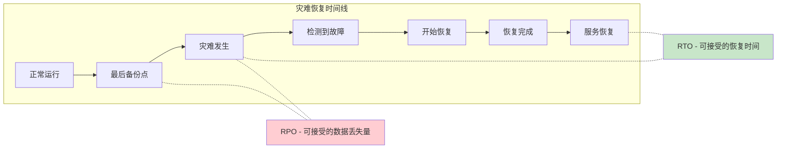
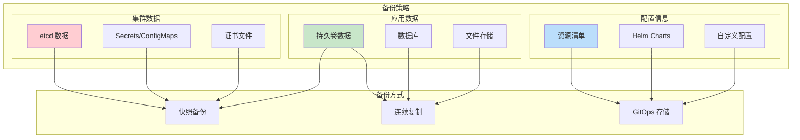
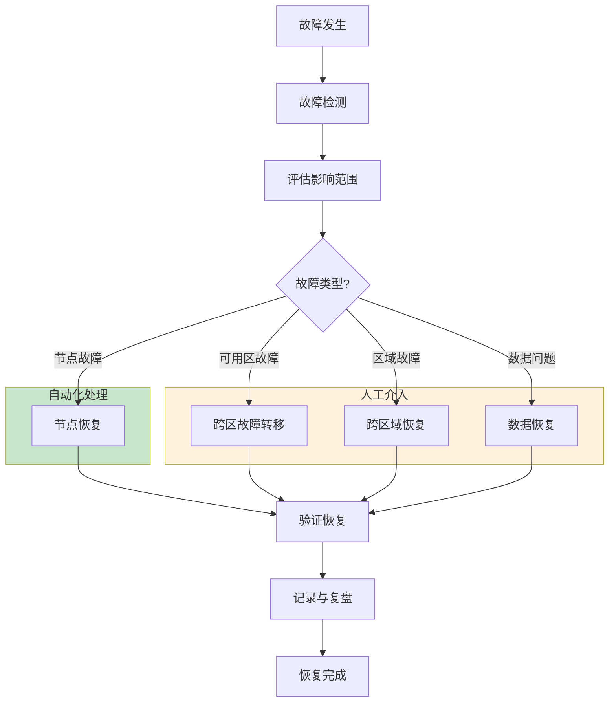
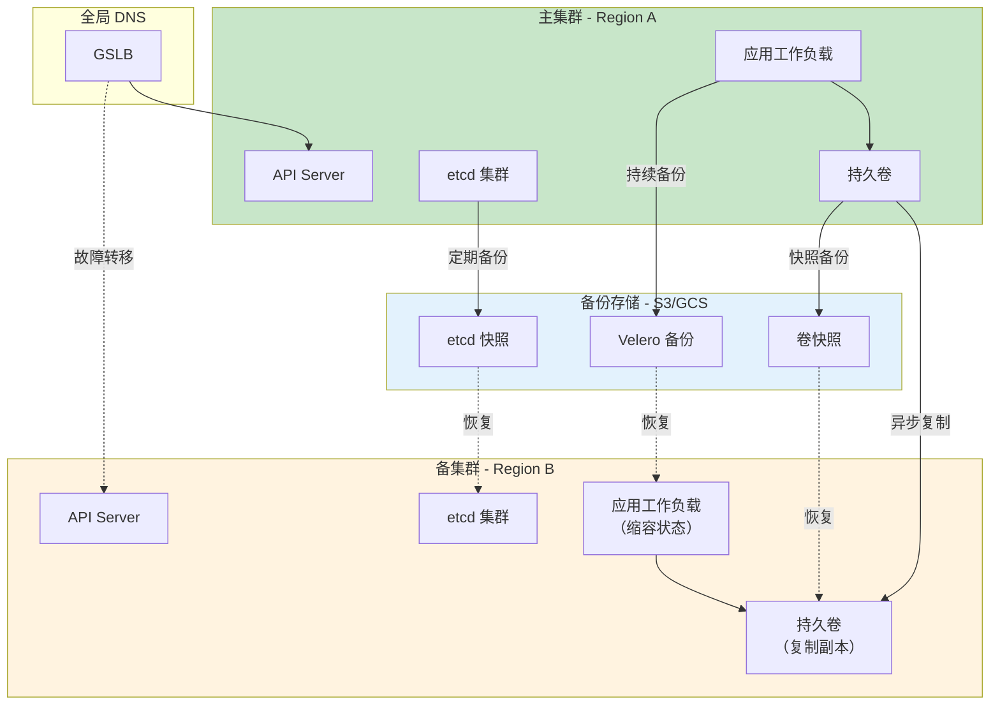

## 概述

灾难恢复（Disaster Recovery, DR）是 Kubernetes 集群运维中至关重要的一环。本文深入解析 Kubernetes 灾难恢复的策略设计、恢复流程、多集群 DR 方案，以及如何通过演练验证恢复能力，帮助读者建立完善的灾难恢复体系。

## DR 策略设计

### RPO 与 RTO 定义



| 指标 | 定义 | 典型目标 | 影响因素 |
|------|------|----------|----------|
| RPO (Recovery Point Objective) | 可接受的最大数据丢失量 | 1-24 小时 | 备份频率、复制延迟 |
| RTO (Recovery Time Objective) | 可接受的最大恢复时间 | 15分钟-4小时 | 恢复流程、自动化程度 |

### DR 级别规划

```yaml
# DR 级别定义
# Level 1: 基础恢复 - 手动恢复，可接受数据丢失
rpo: 24h
rto: 4h
strategy: cold-standby
backup: daily-snapshot

# Level 2: 标准恢复 - 半自动化，最小数据丢失
rpo: 1h
rto: 1h
strategy: warm-standby
backup: hourly-snapshot + continuous-wal

# Level 3: 快速恢复 - 自动化，近零数据丢失
rpo: 5min
rto: 15min
strategy: hot-standby
backup: continuous-replication

# Level 4: 零停机 - 多活，零数据丢失
rpo: 0
rto: 0
strategy: active-active
backup: synchronous-replication
```

### 备份策略矩阵



## 灾难类型与响应

### 故障分类

| 故障类型 | 描述 | 影响范围 | 恢复策略 |
|----------|------|----------|----------|
| 节点故障 | 单个或多个节点不可用 | 部分 Pod | 自动重调度 |
| 可用区故障 | 整个可用区不可用 | 该区域所有资源 | 跨区域故障转移 |
| 区域故障 | 整个区域不可用 | 整个集群 | 跨区域恢复 |
| 数据损坏 | 数据被意外修改或删除 | 特定资源 | 从备份恢复 |
| 配置错误 | 错误配置导致服务中断 | 受影响服务 | 回滚配置 |
| 安全事件 | 集群被入侵 | 可能全部 | 重建集群 |

### 故障响应流程



## etcd 灾难恢复

### 快照恢复流程

```bash
#!/bin/bash
# etcd-disaster-recovery.sh

set -e

# 配置参数
BACKUP_DIR="/var/backups/etcd"
ETCD_DATA_DIR="/var/lib/etcd"
ETCD_NAME="etcd-0"
INITIAL_CLUSTER="etcd-0=https://10.0.1.10:2380,etcd-1=https://10.0.1.11:2380,etcd-2=https://10.0.1.12:2380"
INITIAL_ADVERTISE_PEER_URLS="https://10.0.1.10:2380"

# 1. 停止 etcd 服务
echo "Stopping etcd service..."
systemctl stop etcd

# 2. 备份当前数据目录（以防万一）
echo "Backing up current data directory..."
if [ -d "$ETCD_DATA_DIR" ]; then
    mv "$ETCD_DATA_DIR" "${ETCD_DATA_DIR}.backup.$(date +%Y%m%d%H%M%S)"
fi

# 3. 获取最新的快照文件
LATEST_SNAPSHOT=$(ls -t ${BACKUP_DIR}/snapshot-*.db 2>/dev/null | head -1)
if [ -z "$LATEST_SNAPSHOT" ]; then
    echo "Error: No snapshot found in ${BACKUP_DIR}"
    exit 1
fi
echo "Using snapshot: ${LATEST_SNAPSHOT}"

# 4. 验证快照完整性
echo "Verifying snapshot integrity..."
etcdutl snapshot status "$LATEST_SNAPSHOT" --write-out=table

# 5. 从快照恢复
echo "Restoring from snapshot..."
etcdutl snapshot restore "$LATEST_SNAPSHOT" \
    --name "$ETCD_NAME" \
    --data-dir "$ETCD_DATA_DIR" \
    --initial-cluster "$INITIAL_CLUSTER" \
    --initial-cluster-token "etcd-cluster-recovery" \
    --initial-advertise-peer-urls "$INITIAL_ADVERTISE_PEER_URLS"

# 6. 设置正确的权限
echo "Setting permissions..."
chown -R etcd:etcd "$ETCD_DATA_DIR"
chmod 700 "$ETCD_DATA_DIR"

# 7. 启动 etcd 服务
echo "Starting etcd service..."
systemctl start etcd

# 8. 等待集群就绪
echo "Waiting for cluster to become healthy..."
for i in {1..30}; do
    if etcdctl endpoint health --cluster 2>/dev/null; then
        echo "Cluster is healthy!"
        break
    fi
    echo "Waiting... (${i}/30)"
    sleep 5
done

# 9. 验证恢复结果
echo "Verifying recovery..."
etcdctl member list --write-out=table
etcdctl endpoint status --cluster --write-out=table

echo "etcd disaster recovery completed!"
```

### 单节点到集群恢复

```bash
#!/bin/bash
# etcd-single-to-cluster-restore.sh

# 适用于从备份恢复到全新集群的场景

SNAPSHOT="/var/backups/etcd/snapshot-latest.db"
CLUSTER_TOKEN="etcd-cluster-new"

# 节点信息
declare -A NODES=(
    ["etcd-0"]="10.0.1.10"
    ["etcd-1"]="10.0.1.11"
    ["etcd-2"]="10.0.1.12"
)

# 构建 initial-cluster 参数
INITIAL_CLUSTER=""
for name in "${!NODES[@]}"; do
    if [ -n "$INITIAL_CLUSTER" ]; then
        INITIAL_CLUSTER="${INITIAL_CLUSTER},"
    fi
    INITIAL_CLUSTER="${INITIAL_CLUSTER}${name}=https://${NODES[$name]}:2380"
done

echo "Initial cluster: $INITIAL_CLUSTER"

# 在每个节点上执行恢复
for name in "${!NODES[@]}"; do
    ip="${NODES[$name]}"
    echo "Restoring $name ($ip)..."

    ssh root@$ip << EOF
        # 停止 etcd
        systemctl stop etcd 2>/dev/null || true

        # 清理旧数据
        rm -rf /var/lib/etcd

        # 从快照恢复
        etcdutl snapshot restore /tmp/snapshot.db \\
            --name "$name" \\
            --data-dir /var/lib/etcd \\
            --initial-cluster "$INITIAL_CLUSTER" \\
            --initial-cluster-token "$CLUSTER_TOKEN" \\
            --initial-advertise-peer-urls "https://${ip}:2380"

        # 设置权限
        chown -R etcd:etcd /var/lib/etcd
        chmod 700 /var/lib/etcd
EOF
done

# 按顺序启动所有节点
for name in "${!NODES[@]}"; do
    ip="${NODES[$name]}"
    echo "Starting $name..."
    ssh root@$ip "systemctl start etcd"
    sleep 5
done

# 验证集群状态
echo "Verifying cluster health..."
etcdctl --endpoints=https://10.0.1.10:2379 endpoint health --cluster
```

## Kubernetes 资源恢复

### Velero 恢复流程

```yaml
# velero-restore-schedule.yaml
apiVersion: velero.io/v1
kind: Schedule
metadata:
  name: daily-backup
  namespace: velero
spec:
  schedule: "0 2 * * *"  # 每天凌晨 2 点
  template:
    # 包含的命名空间
    includedNamespaces:
      - production
      - staging
    # 排除的命名空间
    excludedNamespaces:
      - kube-system
      - velero
    # 包含的资源类型
    includedResources:
      - deployments
      - services
      - configmaps
      - secrets
      - persistentvolumeclaims
    # 标签选择器
    labelSelector:
      matchLabels:
        backup: enabled
    # 存储位置
    storageLocation: default
    # 卷快照位置
    volumeSnapshotLocations:
      - default
    # 保留时间
    ttl: 720h  # 30 天
    # 包含集群资源
    includeClusterResources: true
    # Hooks
    hooks:
      resources:
        - name: backup-hook
          includedNamespaces:
            - production
          labelSelector:
            matchLabels:
              app: database
          pre:
            - exec:
                container: database
                command:
                  - /bin/sh
                  - -c
                  - "pg_dump -U postgres > /backup/pre-backup.sql"
                onError: Fail
                timeout: 300s
          post:
            - exec:
                container: database
                command:
                  - /bin/sh
                  - -c
                  - "rm -f /backup/pre-backup.sql"
                onError: Continue
                timeout: 60s
```

### 命名空间恢复

```bash
#!/bin/bash
# namespace-restore.sh

# Velero 恢复指定命名空间

BACKUP_NAME="daily-backup-20240115020000"
NAMESPACE="production"
RESTORE_NAME="restore-${NAMESPACE}-$(date +%Y%m%d%H%M%S)"

# 1. 查看可用备份
echo "Available backups:"
velero backup get

# 2. 查看备份详情
echo "Backup details:"
velero backup describe "$BACKUP_NAME" --details

# 3. 创建恢复
echo "Creating restore..."
velero restore create "$RESTORE_NAME" \
    --from-backup "$BACKUP_NAME" \
    --include-namespaces "$NAMESPACE" \
    --restore-volumes=true \
    --preserve-nodeports=true

# 4. 等待恢复完成
echo "Waiting for restore to complete..."
while true; do
    STATUS=$(velero restore get "$RESTORE_NAME" -o jsonpath='{.status.phase}')
    echo "Status: $STATUS"
    if [ "$STATUS" = "Completed" ] || [ "$STATUS" = "PartiallyFailed" ] || [ "$STATUS" = "Failed" ]; then
        break
    fi
    sleep 10
done

# 5. 查看恢复详情
echo "Restore details:"
velero restore describe "$RESTORE_NAME" --details

# 6. 查看恢复日志
echo "Restore logs:"
velero restore logs "$RESTORE_NAME"

# 7. 验证恢复结果
echo "Verifying restoration..."
kubectl get all -n "$NAMESPACE"
kubectl get pvc -n "$NAMESPACE"
```

### 选择性资源恢复

```bash
#!/bin/bash
# selective-restore.sh

# 恢复特定资源

BACKUP_NAME="daily-backup-20240115020000"

# 1. 仅恢复 Deployments
velero restore create restore-deployments \
    --from-backup "$BACKUP_NAME" \
    --include-resources deployments

# 2. 恢复特定标签的资源
velero restore create restore-app \
    --from-backup "$BACKUP_NAME" \
    --selector app=my-app

# 3. 恢复到不同的命名空间
velero restore create restore-to-staging \
    --from-backup "$BACKUP_NAME" \
    --include-namespaces production \
    --namespace-mappings production:staging

# 4. 排除特定资源
velero restore create restore-no-secrets \
    --from-backup "$BACKUP_NAME" \
    --exclude-resources secrets

# 5. 使用资源修改器
cat > /tmp/restore-modifier.yaml << 'EOF'
version: v1
resourceModifierRules:
  - conditions:
      groupResource: deployments.apps
      namespaces:
        - production
    patches:
      - operation: replace
        path: "/spec/replicas"
        value: "1"
      - operation: remove
        path: "/metadata/annotations/kubectl.kubernetes.io~1last-applied-configuration"
EOF

velero restore create restore-modified \
    --from-backup "$BACKUP_NAME" \
    --resource-modifier-configmap restore-modifier
```

## 持久卷恢复

### CSI 快照恢复

```yaml
# 从快照恢复 PVC
apiVersion: v1
kind: PersistentVolumeClaim
metadata:
  name: database-restore
  namespace: production
spec:
  accessModes:
    - ReadWriteOnce
  storageClassName: fast-ssd
  resources:
    requests:
      storage: 100Gi
  # 从快照恢复
  dataSource:
    name: database-snapshot-20240115
    kind: VolumeSnapshot
    apiGroup: snapshot.storage.k8s.io
---
# 快照定义
apiVersion: snapshot.storage.k8s.io/v1
kind: VolumeSnapshot
metadata:
  name: database-snapshot-20240115
  namespace: production
spec:
  volumeSnapshotClassName: csi-snapshot-class
  source:
    persistentVolumeClaimName: database-pvc
```

### 跨集群卷恢复

```bash
#!/bin/bash
# cross-cluster-volume-restore.sh

# 从源集群导出快照到目标集群

SOURCE_CLUSTER="cluster-a"
TARGET_CLUSTER="cluster-b"
SNAPSHOT_NAME="database-snapshot"
NAMESPACE="production"

# 1. 在源集群创建快照内容导出
kubectl --context="$SOURCE_CLUSTER" get volumesnapshotcontent \
    -o jsonpath='{.items[?(@.spec.volumeSnapshotRef.name=="'"$SNAPSHOT_NAME"'")].spec.source.snapshotHandle}' \
    > /tmp/snapshot-handle.txt

SNAPSHOT_HANDLE=$(cat /tmp/snapshot-handle.txt)
echo "Snapshot handle: $SNAPSHOT_HANDLE"

# 2. 在目标集群创建 VolumeSnapshotContent（预配置）
cat << EOF | kubectl --context="$TARGET_CLUSTER" apply -f -
apiVersion: snapshot.storage.k8s.io/v1
kind: VolumeSnapshotContent
metadata:
  name: imported-snapshot-content
spec:
  deletionPolicy: Retain
  driver: ebs.csi.aws.com
  source:
    snapshotHandle: "${SNAPSHOT_HANDLE}"
  volumeSnapshotRef:
    name: imported-snapshot
    namespace: ${NAMESPACE}
EOF

# 3. 在目标集群创建 VolumeSnapshot
cat << EOF | kubectl --context="$TARGET_CLUSTER" apply -f -
apiVersion: snapshot.storage.k8s.io/v1
kind: VolumeSnapshot
metadata:
  name: imported-snapshot
  namespace: ${NAMESPACE}
spec:
  source:
    volumeSnapshotContentName: imported-snapshot-content
EOF

# 4. 从导入的快照创建 PVC
cat << EOF | kubectl --context="$TARGET_CLUSTER" apply -f -
apiVersion: v1
kind: PersistentVolumeClaim
metadata:
  name: restored-database-pvc
  namespace: ${NAMESPACE}
spec:
  accessModes:
    - ReadWriteOnce
  storageClassName: fast-ssd
  resources:
    requests:
      storage: 100Gi
  dataSource:
    name: imported-snapshot
    kind: VolumeSnapshot
    apiGroup: snapshot.storage.k8s.io
EOF

echo "Cross-cluster volume restore initiated"
```

## 多集群灾难恢复

### 主备模式架构



### 故障转移流程

```bash
#!/bin/bash
# failover-to-standby.sh

# 从主集群故障转移到备集群

PRIMARY_CLUSTER="primary"
STANDBY_CLUSTER="standby"
DNS_ZONE="example.com"
SERVICE_DOMAIN="api.example.com"

echo "Starting failover from $PRIMARY_CLUSTER to $STANDBY_CLUSTER"

# 1. 确认主集群状态
echo "Step 1: Checking primary cluster status..."
if kubectl --context="$PRIMARY_CLUSTER" get nodes &>/dev/null; then
    echo "Warning: Primary cluster is still reachable!"
    read -p "Continue with failover? (yes/no): " confirm
    if [ "$confirm" != "yes" ]; then
        exit 1
    fi
fi

# 2. 获取最新备份
echo "Step 2: Finding latest backup..."
LATEST_BACKUP=$(velero --kubecontext="$STANDBY_CLUSTER" backup get \
    --selector velero.io/storage-location=default \
    -o jsonpath='{.items[-1].metadata.name}')
echo "Latest backup: $LATEST_BACKUP"

# 3. 在备集群恢复资源
echo "Step 3: Restoring resources in standby cluster..."
velero --kubecontext="$STANDBY_CLUSTER" restore create failover-restore \
    --from-backup "$LATEST_BACKUP" \
    --include-namespaces production,staging \
    --restore-volumes=true

# 等待恢复完成
while true; do
    STATUS=$(velero --kubecontext="$STANDBY_CLUSTER" restore get failover-restore \
        -o jsonpath='{.status.phase}')
    echo "Restore status: $STATUS"
    if [ "$STATUS" = "Completed" ]; then
        break
    elif [ "$STATUS" = "Failed" ]; then
        echo "Restore failed!"
        exit 1
    fi
    sleep 30
done

# 4. 扩容备集群工作负载
echo "Step 4: Scaling up workloads..."
kubectl --context="$STANDBY_CLUSTER" -n production get deployment -o name | \
    xargs -I {} kubectl --context="$STANDBY_CLUSTER" -n production scale {} --replicas=3

# 5. 验证服务就绪
echo "Step 5: Waiting for services to be ready..."
kubectl --context="$STANDBY_CLUSTER" -n production wait \
    --for=condition=Available \
    --timeout=300s \
    deployment --all

# 6. 更新 DNS 记录
echo "Step 6: Updating DNS records..."
STANDBY_LB=$(kubectl --context="$STANDBY_CLUSTER" -n ingress-nginx get svc ingress-nginx \
    -o jsonpath='{.status.loadBalancer.ingress[0].ip}')

# 使用云提供商 CLI 更新 DNS
# 示例：AWS Route53
aws route53 change-resource-record-sets --hosted-zone-id ZONE_ID --change-batch '{
    "Changes": [{
        "Action": "UPSERT",
        "ResourceRecordSet": {
            "Name": "'"$SERVICE_DOMAIN"'",
            "Type": "A",
            "TTL": 60,
            "ResourceRecords": [{"Value": "'"$STANDBY_LB"'"}]
        }
    }]
}'

# 7. 验证流量切换
echo "Step 7: Verifying traffic switch..."
for i in {1..10}; do
    RESOLVED_IP=$(dig +short "$SERVICE_DOMAIN" | head -1)
    echo "Resolved IP: $RESOLVED_IP (expected: $STANDBY_LB)"
    if [ "$RESOLVED_IP" = "$STANDBY_LB" ]; then
        echo "DNS propagation complete!"
        break
    fi
    sleep 30
done

# 8. 发送通知
echo "Step 8: Sending notifications..."
curl -X POST "https://hooks.slack.com/services/xxx" \
    -H "Content-Type: application/json" \
    -d '{
        "text": "Failover completed: Traffic now served from '"$STANDBY_CLUSTER"'"
    }'

echo "Failover completed successfully!"
```

### 故障恢复（回切）

```bash
#!/bin/bash
# failback-to-primary.sh

# 从备集群回切到主集群

PRIMARY_CLUSTER="primary"
STANDBY_CLUSTER="standby"

echo "Starting failback from $STANDBY_CLUSTER to $PRIMARY_CLUSTER"

# 1. 确认主集群恢复
echo "Step 1: Verifying primary cluster health..."
kubectl --context="$PRIMARY_CLUSTER" get nodes
kubectl --context="$PRIMARY_CLUSTER" get cs

# 2. 从备集群创建最新备份
echo "Step 2: Creating backup from standby cluster..."
BACKUP_NAME="failback-backup-$(date +%Y%m%d%H%M%S)"
velero --kubecontext="$STANDBY_CLUSTER" backup create "$BACKUP_NAME" \
    --include-namespaces production,staging \
    --snapshot-volumes=true \
    --wait

# 3. 在主集群恢复
echo "Step 3: Restoring to primary cluster..."
velero --kubecontext="$PRIMARY_CLUSTER" restore create failback-restore \
    --from-backup "$BACKUP_NAME" \
    --restore-volumes=true

# 等待恢复完成
while true; do
    STATUS=$(velero --kubecontext="$PRIMARY_CLUSTER" restore get failback-restore \
        -o jsonpath='{.status.phase}')
    if [ "$STATUS" = "Completed" ]; then
        break
    fi
    sleep 30
done

# 4. 验证主集群服务
echo "Step 4: Verifying primary cluster services..."
kubectl --context="$PRIMARY_CLUSTER" -n production wait \
    --for=condition=Available \
    --timeout=300s \
    deployment --all

# 5. 逐步切换流量
echo "Step 5: Gradually shifting traffic..."
# 使用流量权重逐步切换
for weight in 10 30 50 70 90 100; do
    echo "Setting primary cluster weight to ${weight}%..."
    # 更新流量权重（具体实现取决于负载均衡方案）
    sleep 60
done

# 6. 缩容备集群
echo "Step 6: Scaling down standby cluster..."
kubectl --context="$STANDBY_CLUSTER" -n production get deployment -o name | \
    xargs -I {} kubectl --context="$STANDBY_CLUSTER" -n production scale {} --replicas=0

echo "Failback completed successfully!"
```

## DR 演练与验证

### 自动化演练脚本

```bash
#!/bin/bash
# dr-drill.sh

# 灾难恢复演练脚本

set -e

DRILL_ID="drill-$(date +%Y%m%d%H%M%S)"
REPORT_FILE="/var/log/dr-drills/${DRILL_ID}-report.md"
SLACK_WEBHOOK="https://hooks.slack.com/services/xxx"

mkdir -p /var/log/dr-drills

# 记录函数
log() {
    echo "[$(date '+%Y-%m-%d %H:%M:%S')] $1" | tee -a "$REPORT_FILE"
}

# 开始演练
log "# 灾难恢复演练报告"
log ""
log "演练 ID: $DRILL_ID"
log "开始时间: $(date)"
log ""
log "## 演练步骤"
log ""

# 1. 备份验证
log "### 1. 备份验证"
BACKUP_COUNT=$(velero backup get --selector velero.io/storage-location=default -o json | jq '.items | length')
LATEST_BACKUP=$(velero backup get -o jsonpath='{.items[-1].metadata.name}')
BACKUP_AGE=$(velero backup get "$LATEST_BACKUP" -o jsonpath='{.status.completionTimestamp}')

log "- 可用备份数量: $BACKUP_COUNT"
log "- 最新备份: $LATEST_BACKUP"
log "- 备份时间: $BACKUP_AGE"

if [ "$BACKUP_COUNT" -lt 7 ]; then
    log "⚠️ 警告: 备份数量不足 7 个"
fi

# 2. etcd 快照验证
log ""
log "### 2. etcd 快照验证"
ETCD_SNAPSHOT="/var/backups/etcd/snapshot-latest.db"
if [ -f "$ETCD_SNAPSHOT" ]; then
    SNAPSHOT_SIZE=$(du -h "$ETCD_SNAPSHOT" | cut -f1)
    SNAPSHOT_TIME=$(stat -c %y "$ETCD_SNAPSHOT")
    log "- 快照文件: $ETCD_SNAPSHOT"
    log "- 文件大小: $SNAPSHOT_SIZE"
    log "- 创建时间: $SNAPSHOT_TIME"

    # 验证快照完整性
    if etcdutl snapshot status "$ETCD_SNAPSHOT" &>/dev/null; then
        log "- 完整性检查: ✅ 通过"
    else
        log "- 完整性检查: ❌ 失败"
    fi
else
    log "❌ etcd 快照文件不存在"
fi

# 3. 恢复测试
log ""
log "### 3. 恢复测试"
TEST_NAMESPACE="dr-drill-test-$DRILL_ID"

log "创建测试命名空间: $TEST_NAMESPACE"
kubectl create namespace "$TEST_NAMESPACE"

log "从备份恢复测试资源..."
velero restore create "drill-restore-$DRILL_ID" \
    --from-backup "$LATEST_BACKUP" \
    --include-namespaces production \
    --namespace-mappings "production:$TEST_NAMESPACE" \
    --wait

# 验证恢复结果
RESTORED_DEPLOYMENTS=$(kubectl -n "$TEST_NAMESPACE" get deployments -o name | wc -l)
RESTORED_SERVICES=$(kubectl -n "$TEST_NAMESPACE" get services -o name | wc -l)
RESTORED_CONFIGMAPS=$(kubectl -n "$TEST_NAMESPACE" get configmaps -o name | wc -l)

log "- 恢复的 Deployments: $RESTORED_DEPLOYMENTS"
log "- 恢复的 Services: $RESTORED_SERVICES"
log "- 恢复的 ConfigMaps: $RESTORED_CONFIGMAPS"

# 4. 服务验证
log ""
log "### 4. 服务验证"
READY_DEPLOYMENTS=0
TOTAL_DEPLOYMENTS=$RESTORED_DEPLOYMENTS

for deploy in $(kubectl -n "$TEST_NAMESPACE" get deployments -o name); do
    if kubectl -n "$TEST_NAMESPACE" wait --for=condition=Available --timeout=120s "$deploy" &>/dev/null; then
        ((READY_DEPLOYMENTS++))
        log "- $deploy: ✅ Ready"
    else
        log "- $deploy: ❌ Not Ready"
    fi
done

log ""
log "服务就绪率: $READY_DEPLOYMENTS / $TOTAL_DEPLOYMENTS"

# 5. 清理
log ""
log "### 5. 清理测试资源"
kubectl delete namespace "$TEST_NAMESPACE" --wait=false
velero restore delete "drill-restore-$DRILL_ID" --confirm

# 6. 生成报告
log ""
log "## 演练结论"
log ""
log "结束时间: $(date)"

if [ "$READY_DEPLOYMENTS" -eq "$TOTAL_DEPLOYMENTS" ] && [ "$BACKUP_COUNT" -ge 7 ]; then
    log ""
    log "✅ **演练通过**"
    RESULT="PASSED"
else
    log ""
    log "❌ **演练失败，需要关注以下问题:**"
    if [ "$BACKUP_COUNT" -lt 7 ]; then
        log "- 备份数量不足"
    fi
    if [ "$READY_DEPLOYMENTS" -lt "$TOTAL_DEPLOYMENTS" ]; then
        log "- 部分服务恢复失败"
    fi
    RESULT="FAILED"
fi

# 7. 发送通知
curl -X POST "$SLACK_WEBHOOK" \
    -H "Content-Type: application/json" \
    -d '{
        "text": "DR 演练完成\n演练 ID: '"$DRILL_ID"'\n结果: '"$RESULT"'\n详情请查看: '"$REPORT_FILE"'"
    }'

echo "演练报告已保存到: $REPORT_FILE"
```

### 演练检查清单

| 检查项 | 验证方法 | 通过标准 | 频率 |
|--------|----------|----------|------|
| etcd 备份可用 | etcdutl snapshot status | 快照完整 | 每日 |
| Velero 备份可用 | velero backup describe | 状态 Completed | 每日 |
| 卷快照可用 | kubectl get volumesnapshot | ReadyToUse=true | 每日 |
| 命名空间恢复 | 恢复测试 | 所有资源恢复 | 每周 |
| 服务可用性 | 健康检查 | 服务响应正常 | 每周 |
| 完整 DR 恢复 | 端到端测试 | RTO 内完成恢复 | 每月 |
| 跨区域恢复 | 故障转移测试 | 流量成功切换 | 每季度 |

## 总结

灾难恢复是 Kubernetes 集群运维的最后一道防线：

1. **策略设计**：根据业务需求定义 RPO/RTO，选择合适的 DR 级别
2. **备份体系**：建立完善的 etcd、资源、持久卷备份机制
3. **恢复流程**：文档化并自动化恢复流程，确保可重复执行
4. **多集群 DR**：通过主备或多活架构实现跨区域容灾
5. **定期演练**：通过自动化演练验证 DR 能力，持续改进

掌握这些灾难恢复技术，能够确保在最坏情况下也能快速恢复业务，将损失降到最低。
