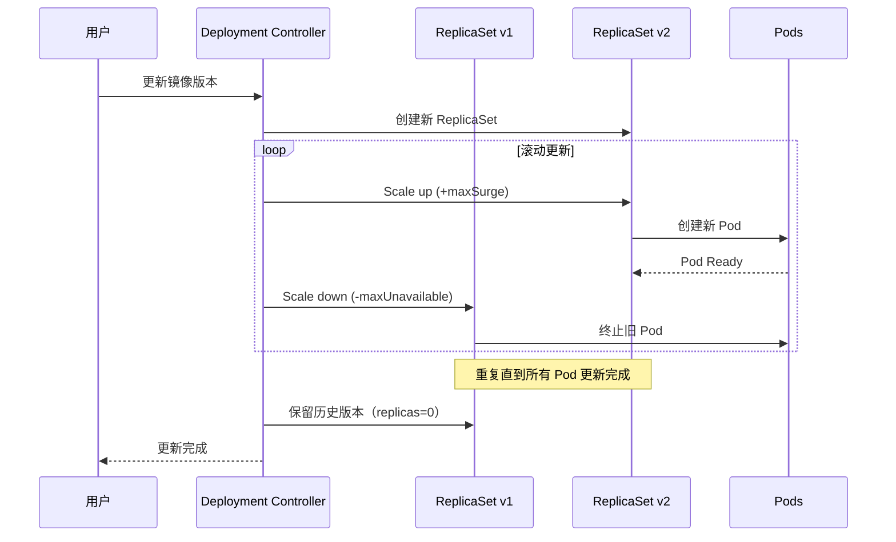
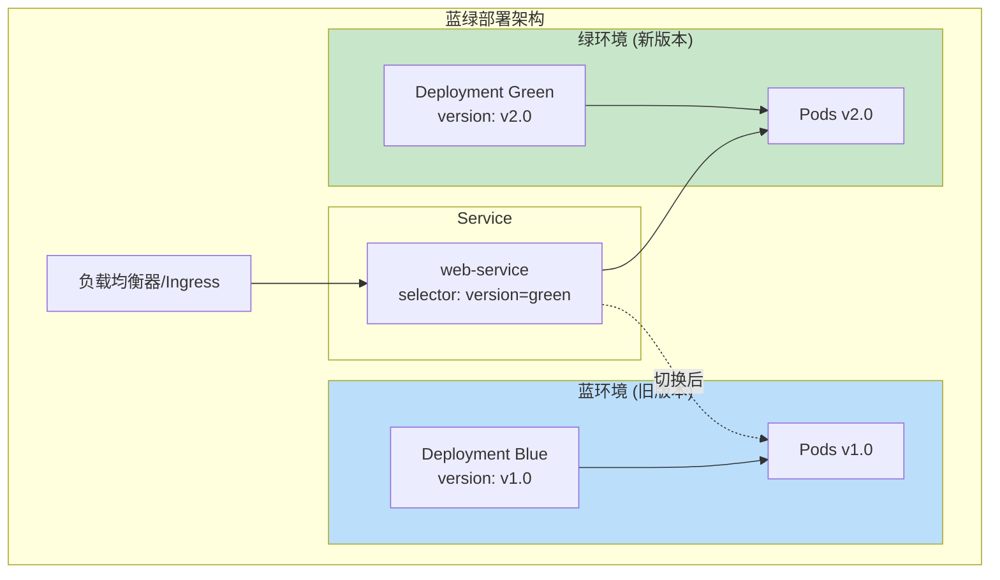
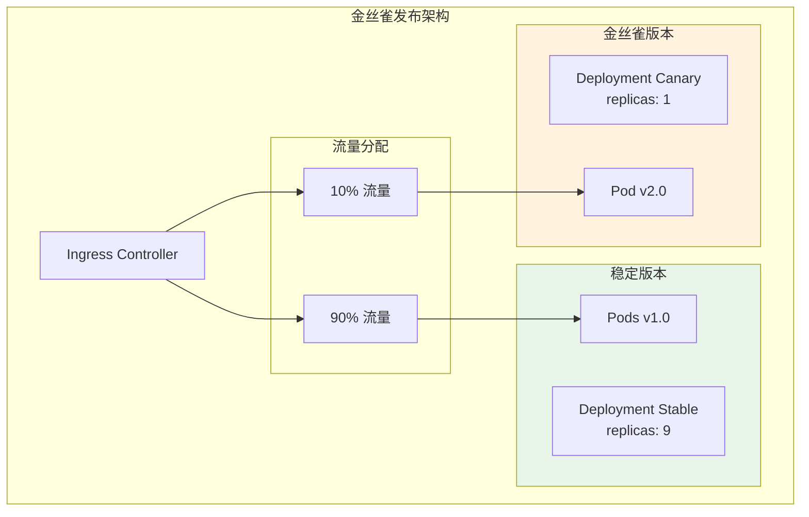
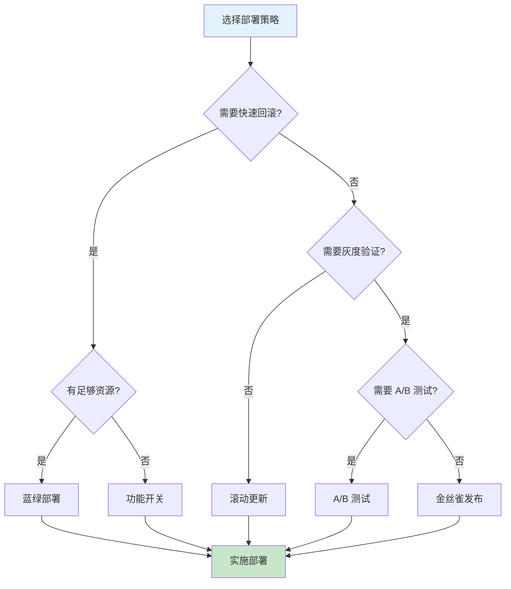

## 概述

Kubernetes 提供了灵活的部署能力，支持多种发布策略以满足不同的业务需求。本文深入解析蓝绿部署、金丝雀发布、滚动更新、A/B 测试等常见部署模式，帮助读者选择和实施最适合的发布策略。

## 滚动更新

### 基础滚动更新

滚动更新是 Kubernetes Deployment 的默认更新策略，通过逐步替换 Pod 实现零停机更新。

```yaml
# rolling-update-deployment.yaml
apiVersion: apps/v1
kind: Deployment
metadata:
  name: web-app
  namespace: production
spec:
  replicas: 6
  selector:
    matchLabels:
      app: web-app

  # 滚动更新策略
  strategy:
    type: RollingUpdate
    rollingUpdate:
      # 更新期间最多额外创建的 Pod 数量
      # 可以是数字或百分比
      maxSurge: 2  # 或 "25%"

      # 更新期间最多不可用的 Pod 数量
      maxUnavailable: 1  # 或 "20%"

  # 部署进度检查
  progressDeadlineSeconds: 600  # 10 分钟内必须完成

  # 保留的历史版本数
  revisionHistoryLimit: 10

  template:
    metadata:
      labels:
        app: web-app
        version: v2.0.0
    spec:
      containers:
        - name: web-app
          image: web-app:v2.0.0
          ports:
            - containerPort: 8080

          # 就绪探针 - 确保新 Pod 就绪后才继续更新
          readinessProbe:
            httpGet:
              path: /healthz
              port: 8080
            initialDelaySeconds: 5
            periodSeconds: 5
            successThreshold: 1
            failureThreshold: 3

          # 存活探针
          livenessProbe:
            httpGet:
              path: /healthz
              port: 8080
            initialDelaySeconds: 15
            periodSeconds: 10

          resources:
            requests:
              cpu: "100m"
              memory: "128Mi"
            limits:
              cpu: "500m"
              memory: "512Mi"

      # 优雅终止
      terminationGracePeriodSeconds: 30
```

### 滚动更新过程



### 控制更新速度

```yaml
# slow-rolling-update.yaml
apiVersion: apps/v1
kind: Deployment
metadata:
  name: critical-service
spec:
  replicas: 10
  strategy:
    type: RollingUpdate
    rollingUpdate:
      # 保守策略：每次只更新一个 Pod
      maxSurge: 1
      maxUnavailable: 0

  # 更长的进度检查时间
  progressDeadlineSeconds: 1800  # 30 分钟

  template:
    spec:
      containers:
        - name: app
          image: critical-service:v2.0.0

          # 较长的就绪检查，确保服务完全就绪
          readinessProbe:
            httpGet:
              path: /healthz
              port: 8080
            initialDelaySeconds: 30
            periodSeconds: 10
            successThreshold: 3  # 需要连续 3 次成功
            failureThreshold: 3

          # 启动探针，给予足够的启动时间
          startupProbe:
            httpGet:
              path: /healthz
              port: 8080
            initialDelaySeconds: 10
            periodSeconds: 10
            failureThreshold: 30  # 最多等待 5 分钟启动

      # 较长的优雅终止时间
      terminationGracePeriodSeconds: 60
```

## 蓝绿部署

### 蓝绿部署架构

蓝绿部署维护两套完全相同的环境，通过切换 Service 选择器实现瞬间切换。



### 蓝绿部署实现

```yaml
# blue-deployment.yaml
apiVersion: apps/v1
kind: Deployment
metadata:
  name: web-app-blue
  namespace: production
  labels:
    app: web-app
    slot: blue
spec:
  replicas: 3
  selector:
    matchLabels:
      app: web-app
      slot: blue
  template:
    metadata:
      labels:
        app: web-app
        slot: blue
        version: v1.0.0
    spec:
      containers:
        - name: web-app
          image: web-app:v1.0.0
          ports:
            - containerPort: 8080
          readinessProbe:
            httpGet:
              path: /healthz
              port: 8080
            initialDelaySeconds: 5
            periodSeconds: 5
---
# green-deployment.yaml
apiVersion: apps/v1
kind: Deployment
metadata:
  name: web-app-green
  namespace: production
  labels:
    app: web-app
    slot: green
spec:
  replicas: 3
  selector:
    matchLabels:
      app: web-app
      slot: green
  template:
    metadata:
      labels:
        app: web-app
        slot: green
        version: v2.0.0
    spec:
      containers:
        - name: web-app
          image: web-app:v2.0.0
          ports:
            - containerPort: 8080
          readinessProbe:
            httpGet:
              path: /healthz
              port: 8080
            initialDelaySeconds: 5
            periodSeconds: 5
---
# service.yaml - 通过切换 selector 实现流量切换
apiVersion: v1
kind: Service
metadata:
  name: web-app
  namespace: production
spec:
  selector:
    app: web-app
    slot: green  # 切换这里的值
  ports:
    - port: 80
      targetPort: 8080
```

### 蓝绿部署脚本

```bash
#!/bin/bash
# blue-green-switch.sh

set -e

NAMESPACE="production"
SERVICE_NAME="web-app"
CURRENT_SLOT=$(kubectl -n $NAMESPACE get svc $SERVICE_NAME -o jsonpath='{.spec.selector.slot}')

if [ "$CURRENT_SLOT" = "blue" ]; then
    NEW_SLOT="green"
else
    NEW_SLOT="blue"
fi

echo "Current slot: $CURRENT_SLOT"
echo "Switching to: $NEW_SLOT"

# 1. 检查目标环境是否就绪
echo "Checking $NEW_SLOT deployment readiness..."
READY_REPLICAS=$(kubectl -n $NAMESPACE get deployment web-app-$NEW_SLOT \
    -o jsonpath='{.status.readyReplicas}')
DESIRED_REPLICAS=$(kubectl -n $NAMESPACE get deployment web-app-$NEW_SLOT \
    -o jsonpath='{.spec.replicas}')

if [ "$READY_REPLICAS" != "$DESIRED_REPLICAS" ]; then
    echo "Error: $NEW_SLOT deployment is not fully ready ($READY_REPLICAS/$DESIRED_REPLICAS)"
    exit 1
fi
echo "$NEW_SLOT deployment is ready: $READY_REPLICAS/$DESIRED_REPLICAS"

# 2. 切换 Service 选择器
echo "Switching service to $NEW_SLOT..."
kubectl -n $NAMESPACE patch svc $SERVICE_NAME \
    -p "{\"spec\":{\"selector\":{\"slot\":\"$NEW_SLOT\"}}}"

# 3. 验证切换
echo "Verifying switch..."
sleep 5
NEW_SELECTOR=$(kubectl -n $NAMESPACE get svc $SERVICE_NAME -o jsonpath='{.spec.selector.slot}')
if [ "$NEW_SELECTOR" = "$NEW_SLOT" ]; then
    echo "Switch successful! Traffic now goes to $NEW_SLOT"
else
    echo "Error: Switch verification failed"
    exit 1
fi

# 4. 可选：缩容旧环境
read -p "Scale down $CURRENT_SLOT deployment? (yes/no): " SCALE_DOWN
if [ "$SCALE_DOWN" = "yes" ]; then
    kubectl -n $NAMESPACE scale deployment web-app-$CURRENT_SLOT --replicas=0
    echo "$CURRENT_SLOT scaled down"
fi

echo "Blue-green switch completed!"
```

### 蓝绿回滚

```bash
#!/bin/bash
# blue-green-rollback.sh

NAMESPACE="production"
SERVICE_NAME="web-app"

# 获取当前活跃环境
CURRENT_SLOT=$(kubectl -n $NAMESPACE get svc $SERVICE_NAME -o jsonpath='{.spec.selector.slot}')

if [ "$CURRENT_SLOT" = "blue" ]; then
    ROLLBACK_SLOT="green"
else
    ROLLBACK_SLOT="blue"
fi

echo "Rolling back from $CURRENT_SLOT to $ROLLBACK_SLOT"

# 1. 确保回滚目标有足够副本
echo "Scaling up $ROLLBACK_SLOT..."
kubectl -n $NAMESPACE scale deployment web-app-$ROLLBACK_SLOT --replicas=3

# 2. 等待就绪
echo "Waiting for $ROLLBACK_SLOT to be ready..."
kubectl -n $NAMESPACE rollout status deployment/web-app-$ROLLBACK_SLOT --timeout=300s

# 3. 切换流量
echo "Switching traffic to $ROLLBACK_SLOT..."
kubectl -n $NAMESPACE patch svc $SERVICE_NAME \
    -p "{\"spec\":{\"selector\":{\"slot\":\"$ROLLBACK_SLOT\"}}}"

echo "Rollback completed!"
```

## 金丝雀发布

### 金丝雀部署架构

金丝雀发布通过逐步增加新版本的流量比例，实现渐进式发布。



### 基于 Ingress 的金丝雀发布

```yaml
# canary-with-nginx-ingress.yaml

# 稳定版本 Deployment
apiVersion: apps/v1
kind: Deployment
metadata:
  name: web-app-stable
  namespace: production
spec:
  replicas: 9
  selector:
    matchLabels:
      app: web-app
      track: stable
  template:
    metadata:
      labels:
        app: web-app
        track: stable
        version: v1.0.0
    spec:
      containers:
        - name: web-app
          image: web-app:v1.0.0
          ports:
            - containerPort: 8080
---
# 金丝雀版本 Deployment
apiVersion: apps/v1
kind: Deployment
metadata:
  name: web-app-canary
  namespace: production
spec:
  replicas: 1
  selector:
    matchLabels:
      app: web-app
      track: canary
  template:
    metadata:
      labels:
        app: web-app
        track: canary
        version: v2.0.0
    spec:
      containers:
        - name: web-app
          image: web-app:v2.0.0
          ports:
            - containerPort: 8080
---
# 稳定版本 Service
apiVersion: v1
kind: Service
metadata:
  name: web-app-stable
  namespace: production
spec:
  selector:
    app: web-app
    track: stable
  ports:
    - port: 80
      targetPort: 8080
---
# 金丝雀版本 Service
apiVersion: v1
kind: Service
metadata:
  name: web-app-canary
  namespace: production
spec:
  selector:
    app: web-app
    track: canary
  ports:
    - port: 80
      targetPort: 8080
---
# 主 Ingress（稳定版本）
apiVersion: networking.k8s.io/v1
kind: Ingress
metadata:
  name: web-app
  namespace: production
spec:
  ingressClassName: nginx
  rules:
    - host: web.example.com
      http:
        paths:
          - path: /
            pathType: Prefix
            backend:
              service:
                name: web-app-stable
                port:
                  number: 80
---
# 金丝雀 Ingress（流量权重）
apiVersion: networking.k8s.io/v1
kind: Ingress
metadata:
  name: web-app-canary
  namespace: production
  annotations:
    # NGINX Ingress 金丝雀注解
    nginx.ingress.kubernetes.io/canary: "true"
    # 基于权重的流量分配（10%）
    nginx.ingress.kubernetes.io/canary-weight: "10"
spec:
  ingressClassName: nginx
  rules:
    - host: web.example.com
      http:
        paths:
          - path: /
            pathType: Prefix
            backend:
              service:
                name: web-app-canary
                port:
                  number: 80
```

### 基于 Header 的金丝雀

```yaml
# canary-by-header.yaml
apiVersion: networking.k8s.io/v1
kind: Ingress
metadata:
  name: web-app-canary-header
  namespace: production
  annotations:
    nginx.ingress.kubernetes.io/canary: "true"
    # 基于 Header 路由
    nginx.ingress.kubernetes.io/canary-by-header: "X-Canary"
    nginx.ingress.kubernetes.io/canary-by-header-value: "true"
spec:
  ingressClassName: nginx
  rules:
    - host: web.example.com
      http:
        paths:
          - path: /
            pathType: Prefix
            backend:
              service:
                name: web-app-canary
                port:
                  number: 80
```

### 金丝雀发布自动化

```bash
#!/bin/bash
# canary-rollout.sh

set -e

NAMESPACE="production"
CANARY_DEPLOYMENT="web-app-canary"
STABLE_DEPLOYMENT="web-app-stable"
CANARY_INGRESS="web-app-canary"
NEW_IMAGE="$1"

if [ -z "$NEW_IMAGE" ]; then
    echo "Usage: $0 <new-image>"
    exit 1
fi

# 阶段性增加金丝雀流量
WEIGHTS=(5 10 25 50 75 100)

# 更新金丝雀部署
echo "Deploying canary with image: $NEW_IMAGE"
kubectl -n $NAMESPACE set image deployment/$CANARY_DEPLOYMENT web-app=$NEW_IMAGE
kubectl -n $NAMESPACE rollout status deployment/$CANARY_DEPLOYMENT --timeout=300s

for weight in "${WEIGHTS[@]}"; do
    echo ""
    echo "Setting canary weight to ${weight}%..."

    # 更新 Ingress 权重
    kubectl -n $NAMESPACE annotate ingress $CANARY_INGRESS \
        nginx.ingress.kubernetes.io/canary-weight="$weight" \
        --overwrite

    # 监控指标（简化示例）
    echo "Monitoring for 2 minutes..."
    sleep 120

    # 检查错误率（需要实际的监控系统）
    # ERROR_RATE=$(curl -s "http://prometheus:9090/api/v1/query?query=..." | jq '.data.result[0].value[1]')
    # if (( $(echo "$ERROR_RATE > 0.01" | bc -l) )); then
    #     echo "Error rate too high ($ERROR_RATE), rolling back!"
    #     kubectl -n $NAMESPACE annotate ingress $CANARY_INGRESS \
    #         nginx.ingress.kubernetes.io/canary-weight="0" --overwrite
    #     exit 1
    # fi

    if [ "$weight" -lt 100 ]; then
        read -p "Continue to ${WEIGHTS[$((${#WEIGHTS[@]}-1))]}%? (yes/no): " CONTINUE
        if [ "$CONTINUE" != "yes" ]; then
            echo "Paused at ${weight}%"
            exit 0
        fi
    fi
done

# 完成发布：更新稳定版本
echo "Canary successful! Updating stable deployment..."
kubectl -n $NAMESPACE set image deployment/$STABLE_DEPLOYMENT web-app=$NEW_IMAGE
kubectl -n $NAMESPACE rollout status deployment/$STABLE_DEPLOYMENT --timeout=300s

# 重置金丝雀
kubectl -n $NAMESPACE annotate ingress $CANARY_INGRESS \
    nginx.ingress.kubernetes.io/canary-weight="0" --overwrite

echo "Rollout completed successfully!"
```

## A/B 测试

### 基于 Cookie 的 A/B 测试

```yaml
# ab-testing.yaml

# A 版本（控制组）
apiVersion: apps/v1
kind: Deployment
metadata:
  name: web-app-control
  namespace: production
spec:
  replicas: 3
  selector:
    matchLabels:
      app: web-app
      variant: control
  template:
    metadata:
      labels:
        app: web-app
        variant: control
    spec:
      containers:
        - name: web-app
          image: web-app:v1.0.0-control
          env:
            - name: AB_VARIANT
              value: "control"
---
# B 版本（实验组）
apiVersion: apps/v1
kind: Deployment
metadata:
  name: web-app-experiment
  namespace: production
spec:
  replicas: 3
  selector:
    matchLabels:
      app: web-app
      variant: experiment
  template:
    metadata:
      labels:
        app: web-app
        variant: experiment
    spec:
      containers:
        - name: web-app
          image: web-app:v1.0.0-experiment
          env:
            - name: AB_VARIANT
              value: "experiment"
---
# 基于 Cookie 路由的 Ingress
apiVersion: networking.k8s.io/v1
kind: Ingress
metadata:
  name: web-app-ab
  namespace: production
  annotations:
    nginx.ingress.kubernetes.io/canary: "true"
    # 基于 Cookie 路由
    nginx.ingress.kubernetes.io/canary-by-cookie: "ab_variant"
spec:
  ingressClassName: nginx
  rules:
    - host: web.example.com
      http:
        paths:
          - path: /
            pathType: Prefix
            backend:
              service:
                name: web-app-experiment
                port:
                  number: 80
```

### A/B 测试流量分配器

```go
// A/B 测试中间件示例
package main

import (
    "crypto/rand"
    "encoding/hex"
    "net/http"
    "time"
)

const (
    ABCookieName = "ab_variant"
    ControlVariant = "control"
    ExperimentVariant = "experiment"
    ExperimentPercent = 50 // 实验组比例
)

type ABTestMiddleware struct {
    next http.Handler
}

func (m *ABTestMiddleware) ServeHTTP(w http.ResponseWriter, r *http.Request) {
    // 检查是否已有分组
    cookie, err := r.Cookie(ABCookieName)
    if err == nil && (cookie.Value == ControlVariant || cookie.Value == ExperimentVariant) {
        // 已分组，继续处理
        m.next.ServeHTTP(w, r)
        return
    }

    // 新用户，随机分组
    variant := ControlVariant
    if randomPercent() < ExperimentPercent {
        variant = ExperimentVariant
    }

    // 设置 Cookie
    http.SetCookie(w, &http.Cookie{
        Name:     ABCookieName,
        Value:    variant,
        Path:     "/",
        Expires:  time.Now().Add(30 * 24 * time.Hour), // 30 天
        HttpOnly: true,
        Secure:   true,
        SameSite: http.SameSiteLaxMode,
    })

    // 记录分组用于分析
    r.Header.Set("X-AB-Variant", variant)

    m.next.ServeHTTP(w, r)
}

func randomPercent() int {
    b := make([]byte, 1)
    rand.Read(b)
    return int(b[0]) * 100 / 256
}
```

## 功能开关

### 基于 ConfigMap 的功能开关

```yaml
# feature-flags.yaml
apiVersion: v1
kind: ConfigMap
metadata:
  name: feature-flags
  namespace: production
data:
  # JSON 格式的功能开关配置
  features.json: |
    {
      "new_checkout_flow": {
        "enabled": true,
        "rollout_percentage": 50,
        "allowed_users": ["user1", "user2"],
        "allowed_groups": ["beta_testers"]
      },
      "dark_mode": {
        "enabled": true,
        "rollout_percentage": 100
      },
      "new_search_algorithm": {
        "enabled": false,
        "rollout_percentage": 0
      }
    }
---
apiVersion: apps/v1
kind: Deployment
metadata:
  name: web-app
  namespace: production
spec:
  replicas: 3
  selector:
    matchLabels:
      app: web-app
  template:
    metadata:
      labels:
        app: web-app
      annotations:
        # 配置变更时触发重启
        checksum/config: "{{ sha256sum .Values.featureFlags }}"
    spec:
      containers:
        - name: web-app
          image: web-app:v1.0.0
          volumeMounts:
            - name: feature-flags
              mountPath: /etc/features
              readOnly: true
          env:
            - name: FEATURE_FLAGS_PATH
              value: /etc/features/features.json
      volumes:
        - name: feature-flags
          configMap:
            name: feature-flags
```

### 功能开关客户端实现

```go
// feature_flags.go
package features

import (
    "encoding/json"
    "hash/fnv"
    "os"
    "sync"
    "time"
)

type FeatureFlag struct {
    Enabled          bool     `json:"enabled"`
    RolloutPercent   int      `json:"rollout_percentage"`
    AllowedUsers     []string `json:"allowed_users"`
    AllowedGroups    []string `json:"allowed_groups"`
}

type FeatureFlagManager struct {
    flags    map[string]FeatureFlag
    mu       sync.RWMutex
    filePath string
}

func NewFeatureFlagManager(filePath string) *FeatureFlagManager {
    m := &FeatureFlagManager{
        flags:    make(map[string]FeatureFlag),
        filePath: filePath,
    }

    // 初始加载
    m.reload()

    // 定期重新加载
    go m.watchChanges()

    return m
}

func (m *FeatureFlagManager) reload() error {
    data, err := os.ReadFile(m.filePath)
    if err != nil {
        return err
    }

    var flags map[string]FeatureFlag
    if err := json.Unmarshal(data, &flags); err != nil {
        return err
    }

    m.mu.Lock()
    m.flags = flags
    m.mu.Unlock()

    return nil
}

func (m *FeatureFlagManager) watchChanges() {
    ticker := time.NewTicker(30 * time.Second)
    for range ticker.C {
        m.reload()
    }
}

// IsEnabled 检查功能是否对用户启用
func (m *FeatureFlagManager) IsEnabled(featureName, userID string, groups []string) bool {
    m.mu.RLock()
    flag, exists := m.flags[featureName]
    m.mu.RUnlock()

    if !exists || !flag.Enabled {
        return false
    }

    // 检查用户白名单
    for _, u := range flag.AllowedUsers {
        if u == userID {
            return true
        }
    }

    // 检查组白名单
    for _, g := range flag.AllowedGroups {
        for _, ug := range groups {
            if g == ug {
                return true
            }
        }
    }

    // 基于百分比的灰度发布
    if flag.RolloutPercent >= 100 {
        return true
    }
    if flag.RolloutPercent <= 0 {
        return false
    }

    // 使用用户 ID 的哈希确保一致性
    return m.hashPercent(userID) < flag.RolloutPercent
}

func (m *FeatureFlagManager) hashPercent(s string) int {
    h := fnv.New32a()
    h.Write([]byte(s))
    return int(h.Sum32() % 100)
}
```

## 部署策略对比

### 策略选择矩阵

| 策略 | 回滚速度 | 资源开销 | 复杂度 | 风险 | 适用场景 |
|------|----------|----------|--------|------|----------|
| 滚动更新 | 中 | 低 | 低 | 中 | 常规更新 |
| 蓝绿部署 | 快 | 高 | 中 | 低 | 关键服务 |
| 金丝雀发布 | 中 | 中 | 高 | 低 | 大规模服务 |
| A/B 测试 | 中 | 中 | 高 | 低 | 功能验证 |
| 功能开关 | 最快 | 低 | 中 | 最低 | 渐进发布 |

### 决策流程图



## 总结

选择合适的部署策略需要综合考虑多个因素：

1. **滚动更新**：最简单的策略，适合大多数场景，但回滚速度较慢
2. **蓝绿部署**：提供最快的回滚能力，但需要双倍资源
3. **金丝雀发布**：在正式发布前进行小规模验证，降低风险
4. **A/B 测试**：用于功能验证和用户行为分析
5. **功能开关**：提供最细粒度的发布控制，支持即时回滚

实际生产环境中，通常会组合使用多种策略，例如：使用功能开关进行功能级别控制，结合金丝雀发布进行版本级别的渐进发布。
