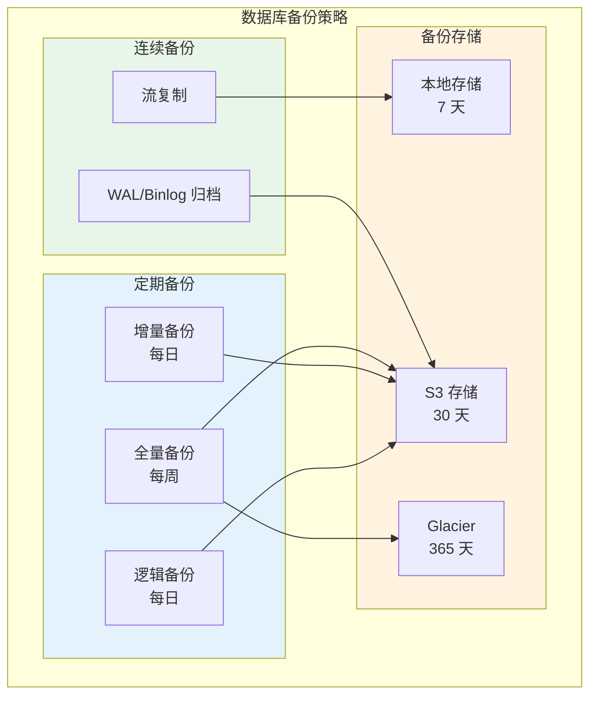

## 概述

有状态应用的 Kubernetes 部署是一个复杂但重要的话题。本文通过实际案例详细解析如何在 Kubernetes 中部署和管理数据库、消息队列、缓存等有状态服务，包括高可用配置、数据持久化、备份恢复等关键技术。

## 数据库部署

### MySQL 主从部署

```yaml
# mysql-statefulset.yaml
apiVersion: v1
kind: Secret
metadata:
  name: mysql-secret
  namespace: production
type: Opaque
stringData:
  root-password: "your-root-password"
  replication-user: "repl"
  replication-password: "repl-password"
---
apiVersion: v1
kind: ConfigMap
metadata:
  name: mysql-config
  namespace: production
data:
  primary.cnf: |
    [mysqld]
    server-id=1
    log-bin=mysql-bin
    binlog_format=ROW
    gtid_mode=ON
    enforce_gtid_consistency=ON
    log_slave_updates=ON

    # 性能优化
    innodb_buffer_pool_size=1G
    innodb_log_file_size=256M
    innodb_flush_log_at_trx_commit=1
    sync_binlog=1

    # 字符集
    character-set-server=utf8mb4
    collation-server=utf8mb4_unicode_ci

  replica.cnf: |
    [mysqld]
    server-id=2
    log-bin=mysql-bin
    binlog_format=ROW
    gtid_mode=ON
    enforce_gtid_consistency=ON
    log_slave_updates=ON
    read_only=ON
    super_read_only=ON

    # 性能优化
    innodb_buffer_pool_size=1G
    innodb_log_file_size=256M
---
apiVersion: apps/v1
kind: StatefulSet
metadata:
  name: mysql
  namespace: production
spec:
  serviceName: mysql
  replicas: 3
  selector:
    matchLabels:
      app: mysql
  template:
    metadata:
      labels:
        app: mysql
    spec:
      initContainers:
        # 初始化配置
        - name: init-mysql
          image: mysql:8.0
          command:
            - bash
            - -c
            - |
              set -ex
              # 根据 Pod 序号确定角色
              [[ $HOSTNAME =~ -([0-9]+)$ ]] || exit 1
              ordinal=${BASH_REMATCH[1]}

              # 生成 server-id
              echo "[mysqld]" > /mnt/conf.d/server-id.cnf
              echo "server-id=$((100 + $ordinal))" >> /mnt/conf.d/server-id.cnf

              # 复制对应的配置文件
              if [[ $ordinal -eq 0 ]]; then
                cp /mnt/config-map/primary.cnf /mnt/conf.d/
              else
                cp /mnt/config-map/replica.cnf /mnt/conf.d/
              fi
          volumeMounts:
            - name: conf
              mountPath: /mnt/conf.d
            - name: config-map
              mountPath: /mnt/config-map

        # 从备份或主节点克隆数据
        - name: clone-mysql
          image: gcr.io/google-samples/xtrabackup:1.0
          command:
            - bash
            - -c
            - |
              set -ex
              # 如果数据已存在则跳过
              [[ -d /var/lib/mysql/mysql ]] && exit 0

              # 首个节点跳过（无数据可克隆）
              [[ $HOSTNAME =~ -([0-9]+)$ ]] || exit 1
              ordinal=${BASH_REMATCH[1]}
              [[ $ordinal -eq 0 ]] && exit 0

              # 从前一个节点克隆
              ncat --recv-only mysql-$(($ordinal-1)).mysql 3307 | xbstream -x -C /var/lib/mysql
              xtrabackup --prepare --target-dir=/var/lib/mysql
          volumeMounts:
            - name: data
              mountPath: /var/lib/mysql
              subPath: mysql
            - name: conf
              mountPath: /etc/mysql/conf.d

      containers:
        - name: mysql
          image: mysql:8.0
          env:
            - name: MYSQL_ROOT_PASSWORD
              valueFrom:
                secretKeyRef:
                  name: mysql-secret
                  key: root-password
          ports:
            - name: mysql
              containerPort: 3306
          volumeMounts:
            - name: data
              mountPath: /var/lib/mysql
              subPath: mysql
            - name: conf
              mountPath: /etc/mysql/conf.d
          resources:
            requests:
              cpu: "500m"
              memory: "1Gi"
            limits:
              cpu: "2"
              memory: "4Gi"
          livenessProbe:
            exec:
              command:
                - mysqladmin
                - ping
                - -uroot
                - -p${MYSQL_ROOT_PASSWORD}
            initialDelaySeconds: 30
            periodSeconds: 10
            timeoutSeconds: 5
          readinessProbe:
            exec:
              command:
                - bash
                - -c
                - |
                  mysql -uroot -p${MYSQL_ROOT_PASSWORD} -e "SELECT 1"
            initialDelaySeconds: 5
            periodSeconds: 2
            timeoutSeconds: 1

        # xtrabackup sidecar 用于数据克隆
        - name: xtrabackup
          image: gcr.io/google-samples/xtrabackup:1.0
          ports:
            - name: xtrabackup
              containerPort: 3307
          command:
            - bash
            - -c
            - |
              set -ex
              cd /var/lib/mysql

              # 启动数据克隆服务
              exec ncat --listen --keep-open --send-only --max-conns=1 3307 -c \
                "xtrabackup --backup --slave-info --stream=xbstream --host=127.0.0.1 --user=root --password=${MYSQL_ROOT_PASSWORD}"
          volumeMounts:
            - name: data
              mountPath: /var/lib/mysql
              subPath: mysql
            - name: conf
              mountPath: /etc/mysql/conf.d
          resources:
            requests:
              cpu: "100m"
              memory: "100Mi"

      volumes:
        - name: conf
          emptyDir: {}
        - name: config-map
          configMap:
            name: mysql-config

  volumeClaimTemplates:
    - metadata:
        name: data
      spec:
        accessModes: ["ReadWriteOnce"]
        storageClassName: fast-ssd
        resources:
          requests:
            storage: 100Gi
---
# Headless Service for StatefulSet
apiVersion: v1
kind: Service
metadata:
  name: mysql
  namespace: production
  labels:
    app: mysql
spec:
  clusterIP: None
  selector:
    app: mysql
  ports:
    - name: mysql
      port: 3306
---
# Service for read traffic (load balanced across replicas)
apiVersion: v1
kind: Service
metadata:
  name: mysql-read
  namespace: production
spec:
  selector:
    app: mysql
  ports:
    - name: mysql
      port: 3306
```

### PostgreSQL 高可用集群

```yaml
# postgres-ha.yaml

# 使用 Patroni 实现 PostgreSQL HA
apiVersion: v1
kind: ConfigMap
metadata:
  name: postgres-config
  namespace: production
data:
  PATRONI_KUBERNETES_LABELS: "{app: postgres}"
  PATRONI_KUBERNETES_NAMESPACE: production
  PATRONI_KUBERNETES_USE_ENDPOINTS: "true"
  PATRONI_NAME: "${HOSTNAME}"
  PATRONI_POSTGRESQL_DATA_DIR: /var/lib/postgresql/data/pgdata
  PATRONI_POSTGRESQL_PGPASS: /tmp/pgpass
  PATRONI_REPLICATION_USERNAME: replicator
  PATRONI_SCOPE: postgres-cluster
  PATRONI_SUPERUSER_USERNAME: postgres

  patroni.yaml: |
    bootstrap:
      dcs:
        ttl: 30
        loop_wait: 10
        retry_timeout: 10
        maximum_lag_on_failover: 1048576
        postgresql:
          use_pg_rewind: true
          use_slots: true
          parameters:
            wal_level: replica
            hot_standby: "on"
            max_wal_senders: 10
            max_replication_slots: 10
            wal_log_hints: "on"
            archive_mode: "on"
            archive_timeout: 60s
            archive_command: "/bin/true"

      initdb:
        - encoding: UTF8
        - data-checksums

      pg_hba:
        - host replication replicator 0.0.0.0/0 md5
        - host all all 0.0.0.0/0 md5

    postgresql:
      listen: 0.0.0.0:5432
      connect_address: '${HOSTNAME}.postgres:5432'
      authentication:
        superuser:
          username: postgres
          password: '${PATRONI_SUPERUSER_PASSWORD}'
        replication:
          username: replicator
          password: '${PATRONI_REPLICATION_PASSWORD}'
---
apiVersion: apps/v1
kind: StatefulSet
metadata:
  name: postgres
  namespace: production
spec:
  serviceName: postgres
  replicas: 3
  selector:
    matchLabels:
      app: postgres
  template:
    metadata:
      labels:
        app: postgres
    spec:
      serviceAccountName: postgres
      containers:
        - name: postgres
          image: registry.opensource.zalan.do/acid/spilo-15:3.0-p1
          ports:
            - containerPort: 8008
              name: patroni
            - containerPort: 5432
              name: postgresql
          env:
            - name: PATRONI_SUPERUSER_PASSWORD
              valueFrom:
                secretKeyRef:
                  name: postgres-secret
                  key: superuser-password
            - name: PATRONI_REPLICATION_PASSWORD
              valueFrom:
                secretKeyRef:
                  name: postgres-secret
                  key: replication-password
          envFrom:
            - configMapRef:
                name: postgres-config
          volumeMounts:
            - name: data
              mountPath: /var/lib/postgresql/data
            - name: config
              mountPath: /etc/patroni
          resources:
            requests:
              cpu: "500m"
              memory: "1Gi"
            limits:
              cpu: "2"
              memory: "4Gi"
          readinessProbe:
            httpGet:
              path: /readiness
              port: 8008
            initialDelaySeconds: 5
            periodSeconds: 10
          livenessProbe:
            httpGet:
              path: /liveness
              port: 8008
            initialDelaySeconds: 60
            periodSeconds: 10

      volumes:
        - name: config
          configMap:
            name: postgres-config

  volumeClaimTemplates:
    - metadata:
        name: data
      spec:
        accessModes: ["ReadWriteOnce"]
        storageClassName: fast-ssd
        resources:
          requests:
            storage: 100Gi
---
# Master Service (points to current leader)
apiVersion: v1
kind: Service
metadata:
  name: postgres-master
  namespace: production
spec:
  selector:
    app: postgres
    role: master
  ports:
    - port: 5432
      targetPort: 5432
---
# Replica Service
apiVersion: v1
kind: Service
metadata:
  name: postgres-replica
  namespace: production
spec:
  selector:
    app: postgres
    role: replica
  ports:
    - port: 5432
      targetPort: 5432
```

## 消息队列部署

### Kafka 集群

```yaml
# kafka-cluster.yaml
apiVersion: v1
kind: ConfigMap
metadata:
  name: kafka-config
  namespace: production
data:
  server.properties: |
    # Broker 基础配置
    broker.id=${KAFKA_BROKER_ID}
    listeners=PLAINTEXT://:9092,CONTROLLER://:9093
    advertised.listeners=PLAINTEXT://${HOSTNAME}.kafka-headless:9092
    listener.security.protocol.map=PLAINTEXT:PLAINTEXT,CONTROLLER:PLAINTEXT

    # KRaft 模式配置
    process.roles=broker,controller
    controller.quorum.voters=0@kafka-0.kafka-headless:9093,1@kafka-1.kafka-headless:9093,2@kafka-2.kafka-headless:9093
    controller.listener.names=CONTROLLER

    # 日志配置
    log.dirs=/var/lib/kafka/data
    num.partitions=3
    default.replication.factor=3
    min.insync.replicas=2
    log.retention.hours=168
    log.segment.bytes=1073741824
    log.retention.check.interval.ms=300000

    # 性能配置
    num.network.threads=8
    num.io.threads=16
    socket.send.buffer.bytes=102400
    socket.receive.buffer.bytes=102400
    socket.request.max.bytes=104857600
---
apiVersion: apps/v1
kind: StatefulSet
metadata:
  name: kafka
  namespace: production
spec:
  serviceName: kafka-headless
  replicas: 3
  podManagementPolicy: Parallel
  selector:
    matchLabels:
      app: kafka
  template:
    metadata:
      labels:
        app: kafka
    spec:
      affinity:
        podAntiAffinity:
          requiredDuringSchedulingIgnoredDuringExecution:
            - labelSelector:
                matchLabels:
                  app: kafka
              topologyKey: kubernetes.io/hostname

      initContainers:
        - name: init-config
          image: busybox:1.35
          command:
            - sh
            - -c
            - |
              set -ex
              # 从 hostname 提取 broker ID
              export KAFKA_BROKER_ID=${HOSTNAME##*-}

              # 生成配置文件
              envsubst < /etc/kafka-config/server.properties > /etc/kafka/server.properties

              # 生成集群 ID（仅首次）
              if [ ! -f /var/lib/kafka/data/meta.properties ]; then
                CLUSTER_ID=$(cat /etc/kafka-config/cluster-id)
                /opt/kafka/bin/kafka-storage.sh format \
                  -t $CLUSTER_ID \
                  -c /etc/kafka/server.properties \
                  --ignore-formatted
              fi
          env:
            - name: HOSTNAME
              valueFrom:
                fieldRef:
                  fieldPath: metadata.name
          volumeMounts:
            - name: config
              mountPath: /etc/kafka-config
            - name: kafka-config
              mountPath: /etc/kafka
            - name: data
              mountPath: /var/lib/kafka/data

      containers:
        - name: kafka
          image: apache/kafka:3.6.0
          ports:
            - containerPort: 9092
              name: client
            - containerPort: 9093
              name: controller
          command:
            - /opt/kafka/bin/kafka-server-start.sh
            - /etc/kafka/server.properties
          volumeMounts:
            - name: kafka-config
              mountPath: /etc/kafka
            - name: data
              mountPath: /var/lib/kafka/data
          resources:
            requests:
              cpu: "500m"
              memory: "2Gi"
            limits:
              cpu: "2"
              memory: "4Gi"
          readinessProbe:
            tcpSocket:
              port: 9092
            initialDelaySeconds: 30
            periodSeconds: 10
          livenessProbe:
            tcpSocket:
              port: 9092
            initialDelaySeconds: 60
            periodSeconds: 20

      volumes:
        - name: config
          configMap:
            name: kafka-config
        - name: kafka-config
          emptyDir: {}

  volumeClaimTemplates:
    - metadata:
        name: data
      spec:
        accessModes: ["ReadWriteOnce"]
        storageClassName: fast-ssd
        resources:
          requests:
            storage: 100Gi
---
# Headless Service
apiVersion: v1
kind: Service
metadata:
  name: kafka-headless
  namespace: production
spec:
  clusterIP: None
  selector:
    app: kafka
  ports:
    - name: client
      port: 9092
    - name: controller
      port: 9093
---
# Bootstrap Service
apiVersion: v1
kind: Service
metadata:
  name: kafka-bootstrap
  namespace: production
spec:
  selector:
    app: kafka
  ports:
    - name: client
      port: 9092
```

### RabbitMQ 集群

```yaml
# rabbitmq-cluster.yaml
apiVersion: v1
kind: ConfigMap
metadata:
  name: rabbitmq-config
  namespace: production
data:
  enabled_plugins: |
    [rabbitmq_management,rabbitmq_peer_discovery_k8s].

  rabbitmq.conf: |
    ## Cluster formation
    cluster_formation.peer_discovery_backend = rabbit_peer_discovery_k8s
    cluster_formation.k8s.host = kubernetes.default.svc.cluster.local
    cluster_formation.k8s.address_type = hostname
    cluster_formation.k8s.service_name = rabbitmq-headless
    cluster_formation.k8s.hostname_suffix = .rabbitmq-headless.production.svc.cluster.local
    cluster_formation.node_cleanup.interval = 30
    cluster_formation.node_cleanup.only_log_warning = true
    cluster_partition_handling = autoheal

    ## Queue mirroring
    queue_master_locator = min-masters

    ## Memory
    vm_memory_high_watermark.relative = 0.8
    vm_memory_high_watermark_paging_ratio = 0.5

    ## Disk
    disk_free_limit.absolute = 2GB

    ## Networking
    listeners.tcp.default = 5672
    management.tcp.port = 15672

    ## Default user
    default_user = admin
    default_pass = ${RABBITMQ_DEFAULT_PASS}
---
apiVersion: apps/v1
kind: StatefulSet
metadata:
  name: rabbitmq
  namespace: production
spec:
  serviceName: rabbitmq-headless
  replicas: 3
  selector:
    matchLabels:
      app: rabbitmq
  template:
    metadata:
      labels:
        app: rabbitmq
    spec:
      serviceAccountName: rabbitmq
      terminationGracePeriodSeconds: 120

      affinity:
        podAntiAffinity:
          requiredDuringSchedulingIgnoredDuringExecution:
            - labelSelector:
                matchLabels:
                  app: rabbitmq
              topologyKey: kubernetes.io/hostname

      containers:
        - name: rabbitmq
          image: rabbitmq:3.12-management
          ports:
            - containerPort: 5672
              name: amqp
            - containerPort: 15672
              name: management
            - containerPort: 25672
              name: clustering
          env:
            - name: RABBITMQ_DEFAULT_PASS
              valueFrom:
                secretKeyRef:
                  name: rabbitmq-secret
                  key: password
            - name: RABBITMQ_ERLANG_COOKIE
              valueFrom:
                secretKeyRef:
                  name: rabbitmq-secret
                  key: erlang-cookie
            - name: MY_POD_NAME
              valueFrom:
                fieldRef:
                  fieldPath: metadata.name
            - name: RABBITMQ_NODENAME
              value: "rabbit@$(MY_POD_NAME).rabbitmq-headless.production.svc.cluster.local"
            - name: K8S_SERVICE_NAME
              value: rabbitmq-headless
          volumeMounts:
            - name: config
              mountPath: /etc/rabbitmq
            - name: data
              mountPath: /var/lib/rabbitmq
          resources:
            requests:
              cpu: "500m"
              memory: "1Gi"
            limits:
              cpu: "2"
              memory: "2Gi"
          readinessProbe:
            exec:
              command:
                - rabbitmq-diagnostics
                - check_port_connectivity
            initialDelaySeconds: 30
            periodSeconds: 10
            timeoutSeconds: 10
          livenessProbe:
            exec:
              command:
                - rabbitmq-diagnostics
                - status
            initialDelaySeconds: 60
            periodSeconds: 30
            timeoutSeconds: 15

          lifecycle:
            preStop:
              exec:
                command:
                  - bash
                  - -c
                  - |
                    rabbitmqctl stop_app
                    rabbitmqctl reset
                    rabbitmqctl stop

      volumes:
        - name: config
          configMap:
            name: rabbitmq-config

  volumeClaimTemplates:
    - metadata:
        name: data
      spec:
        accessModes: ["ReadWriteOnce"]
        storageClassName: fast-ssd
        resources:
          requests:
            storage: 20Gi
```

## 缓存服务部署

### Redis 集群

```yaml
# redis-cluster.yaml
apiVersion: v1
kind: ConfigMap
metadata:
  name: redis-cluster-config
  namespace: production
data:
  redis.conf: |
    # 集群配置
    cluster-enabled yes
    cluster-config-file nodes.conf
    cluster-node-timeout 5000
    cluster-require-full-coverage no
    cluster-migration-barrier 1

    # 持久化
    appendonly yes
    appendfsync everysec
    auto-aof-rewrite-percentage 100
    auto-aof-rewrite-min-size 64mb

    # 内存配置
    maxmemory 2gb
    maxmemory-policy allkeys-lru

    # 网络
    bind 0.0.0.0
    protected-mode no
    port 6379
    tcp-backlog 511
    timeout 0
    tcp-keepalive 300
---
apiVersion: apps/v1
kind: StatefulSet
metadata:
  name: redis-cluster
  namespace: production
spec:
  serviceName: redis-cluster-headless
  replicas: 6  # 3 主 + 3 从
  selector:
    matchLabels:
      app: redis-cluster
  template:
    metadata:
      labels:
        app: redis-cluster
    spec:
      affinity:
        podAntiAffinity:
          preferredDuringSchedulingIgnoredDuringExecution:
            - weight: 100
              podAffinityTerm:
                labelSelector:
                  matchLabels:
                    app: redis-cluster
                topologyKey: kubernetes.io/hostname

      containers:
        - name: redis
          image: redis:7.2
          ports:
            - containerPort: 6379
              name: client
            - containerPort: 16379
              name: gossip
          command:
            - redis-server
            - /etc/redis/redis.conf
            - --cluster-announce-ip
            - $(POD_IP)
          env:
            - name: POD_IP
              valueFrom:
                fieldRef:
                  fieldPath: status.podIP
          volumeMounts:
            - name: config
              mountPath: /etc/redis
            - name: data
              mountPath: /data
          resources:
            requests:
              cpu: "500m"
              memory: "2Gi"
            limits:
              cpu: "1"
              memory: "3Gi"
          readinessProbe:
            exec:
              command:
                - redis-cli
                - ping
            initialDelaySeconds: 5
            periodSeconds: 5
          livenessProbe:
            exec:
              command:
                - redis-cli
                - ping
            initialDelaySeconds: 30
            periodSeconds: 10

      volumes:
        - name: config
          configMap:
            name: redis-cluster-config

  volumeClaimTemplates:
    - metadata:
        name: data
      spec:
        accessModes: ["ReadWriteOnce"]
        storageClassName: fast-ssd
        resources:
          requests:
            storage: 10Gi
---
# 初始化 Redis 集群的 Job
apiVersion: batch/v1
kind: Job
metadata:
  name: redis-cluster-init
  namespace: production
spec:
  template:
    spec:
      restartPolicy: OnFailure
      containers:
        - name: redis-cli
          image: redis:7.2
          command:
            - sh
            - -c
            - |
              set -ex

              # 等待所有节点就绪
              for i in $(seq 0 5); do
                until redis-cli -h redis-cluster-$i.redis-cluster-headless ping; do
                  echo "Waiting for redis-cluster-$i..."
                  sleep 5
                done
              done

              # 获取所有节点 IP
              NODES=""
              for i in $(seq 0 5); do
                IP=$(getent hosts redis-cluster-$i.redis-cluster-headless | awk '{print $1}')
                NODES="$NODES $IP:6379"
              done

              # 创建集群
              echo "Creating cluster with nodes: $NODES"
              redis-cli --cluster create $NODES --cluster-replicas 1 --cluster-yes
```

### Redis Sentinel

```yaml
# redis-sentinel.yaml

# Redis Master
apiVersion: apps/v1
kind: StatefulSet
metadata:
  name: redis-master
  namespace: production
spec:
  serviceName: redis-master
  replicas: 1
  selector:
    matchLabels:
      app: redis
      role: master
  template:
    metadata:
      labels:
        app: redis
        role: master
    spec:
      containers:
        - name: redis
          image: redis:7.2
          ports:
            - containerPort: 6379
          command:
            - redis-server
            - --appendonly yes
            - --maxmemory 2gb
            - --maxmemory-policy allkeys-lru
          volumeMounts:
            - name: data
              mountPath: /data
          resources:
            requests:
              cpu: "500m"
              memory: "2Gi"

  volumeClaimTemplates:
    - metadata:
        name: data
      spec:
        accessModes: ["ReadWriteOnce"]
        storageClassName: fast-ssd
        resources:
          requests:
            storage: 10Gi
---
# Redis Replicas
apiVersion: apps/v1
kind: StatefulSet
metadata:
  name: redis-replica
  namespace: production
spec:
  serviceName: redis-replica
  replicas: 2
  selector:
    matchLabels:
      app: redis
      role: replica
  template:
    metadata:
      labels:
        app: redis
        role: replica
    spec:
      containers:
        - name: redis
          image: redis:7.2
          ports:
            - containerPort: 6379
          command:
            - redis-server
            - --appendonly yes
            - --replicaof redis-master-0.redis-master 6379
            - --replica-read-only yes
          volumeMounts:
            - name: data
              mountPath: /data

  volumeClaimTemplates:
    - metadata:
        name: data
      spec:
        accessModes: ["ReadWriteOnce"]
        storageClassName: fast-ssd
        resources:
          requests:
            storage: 10Gi
---
# Sentinel
apiVersion: apps/v1
kind: Deployment
metadata:
  name: redis-sentinel
  namespace: production
spec:
  replicas: 3
  selector:
    matchLabels:
      app: redis-sentinel
  template:
    metadata:
      labels:
        app: redis-sentinel
    spec:
      affinity:
        podAntiAffinity:
          requiredDuringSchedulingIgnoredDuringExecution:
            - labelSelector:
                matchLabels:
                  app: redis-sentinel
              topologyKey: kubernetes.io/hostname
      containers:
        - name: sentinel
          image: redis:7.2
          ports:
            - containerPort: 26379
          command:
            - sh
            - -c
            - |
              cat > /tmp/sentinel.conf << EOF
              sentinel monitor mymaster redis-master-0.redis-master 6379 2
              sentinel down-after-milliseconds mymaster 5000
              sentinel failover-timeout mymaster 60000
              sentinel parallel-syncs mymaster 1
              EOF

              redis-sentinel /tmp/sentinel.conf
          resources:
            requests:
              cpu: "100m"
              memory: "128Mi"
```

## 存储配置

### StorageClass 选择

```yaml
# storage-classes.yaml

# 高性能 SSD（用于数据库）
apiVersion: storage.k8s.io/v1
kind: StorageClass
metadata:
  name: fast-ssd
  annotations:
    storageclass.kubernetes.io/is-default-class: "false"
provisioner: ebs.csi.aws.com
parameters:
  type: gp3
  iops: "16000"
  throughput: "1000"
  encrypted: "true"
reclaimPolicy: Retain
volumeBindingMode: WaitForFirstConsumer
allowVolumeExpansion: true
---
# 标准存储（用于日志、临时数据）
apiVersion: storage.k8s.io/v1
kind: StorageClass
metadata:
  name: standard
provisioner: ebs.csi.aws.com
parameters:
  type: gp3
  encrypted: "true"
reclaimPolicy: Delete
volumeBindingMode: WaitForFirstConsumer
allowVolumeExpansion: true
---
# 低成本存储（用于归档）
apiVersion: storage.k8s.io/v1
kind: StorageClass
metadata:
  name: cold-storage
provisioner: ebs.csi.aws.com
parameters:
  type: sc1
  encrypted: "true"
reclaimPolicy: Retain
volumeBindingMode: WaitForFirstConsumer
```

### PVC 扩容

```bash
#!/bin/bash
# expand-pvc.sh

PVC_NAME="$1"
NEW_SIZE="$2"
NAMESPACE="${3:-production}"

if [ -z "$PVC_NAME" ] || [ -z "$NEW_SIZE" ]; then
    echo "Usage: $0 <pvc-name> <new-size> [namespace]"
    exit 1
fi

echo "Expanding PVC $PVC_NAME to $NEW_SIZE in namespace $NAMESPACE"

# 1. 检查 StorageClass 是否支持扩容
SC=$(kubectl -n $NAMESPACE get pvc $PVC_NAME -o jsonpath='{.spec.storageClassName}')
ALLOW_EXPANSION=$(kubectl get sc $SC -o jsonpath='{.allowVolumeExpansion}')

if [ "$ALLOW_EXPANSION" != "true" ]; then
    echo "Error: StorageClass $SC does not allow volume expansion"
    exit 1
fi

# 2. 获取当前大小
CURRENT_SIZE=$(kubectl -n $NAMESPACE get pvc $PVC_NAME -o jsonpath='{.spec.resources.requests.storage}')
echo "Current size: $CURRENT_SIZE"

# 3. 执行扩容
kubectl -n $NAMESPACE patch pvc $PVC_NAME \
    -p "{\"spec\":{\"resources\":{\"requests\":{\"storage\":\"$NEW_SIZE\"}}}}"

# 4. 等待扩容完成
echo "Waiting for PVC expansion..."
while true; do
    STATUS=$(kubectl -n $NAMESPACE get pvc $PVC_NAME -o jsonpath='{.status.conditions[?(@.type=="Resizing")].status}')
    if [ "$STATUS" != "True" ]; then
        break
    fi
    sleep 10
done

# 5. 验证新大小
FINAL_SIZE=$(kubectl -n $NAMESPACE get pvc $PVC_NAME -o jsonpath='{.status.capacity.storage}')
echo "Final size: $FINAL_SIZE"
```

## 备份与恢复

### 数据库备份策略



### MySQL 备份 CronJob

```yaml
# mysql-backup-cronjob.yaml
apiVersion: batch/v1
kind: CronJob
metadata:
  name: mysql-backup
  namespace: production
spec:
  schedule: "0 2 * * *"
  concurrencyPolicy: Forbid
  successfulJobsHistoryLimit: 3
  failedJobsHistoryLimit: 1
  jobTemplate:
    spec:
      template:
        spec:
          restartPolicy: OnFailure
          containers:
            - name: backup
              image: mysql:8.0
              command:
                - /bin/bash
                - -c
                - |
                  set -e

                  TIMESTAMP=$(date +%Y%m%d%H%M%S)
                  BACKUP_FILE="/backup/mysql-backup-${TIMESTAMP}.sql.gz"

                  echo "Starting MySQL backup..."

                  # 执行备份
                  mysqldump \
                      --host=mysql-0.mysql \
                      --user=root \
                      --password="${MYSQL_ROOT_PASSWORD}" \
                      --single-transaction \
                      --routines \
                      --triggers \
                      --all-databases | gzip > "$BACKUP_FILE"

                  # 上传到 S3
                  aws s3 cp "$BACKUP_FILE" "s3://${S3_BUCKET}/mysql/"

                  # 清理本地文件
                  rm -f "$BACKUP_FILE"

                  echo "Backup completed: mysql-backup-${TIMESTAMP}.sql.gz"

              env:
                - name: MYSQL_ROOT_PASSWORD
                  valueFrom:
                    secretKeyRef:
                      name: mysql-secret
                      key: root-password
                - name: S3_BUCKET
                  value: "my-backups"
                - name: AWS_ACCESS_KEY_ID
                  valueFrom:
                    secretKeyRef:
                      name: aws-credentials
                      key: access-key
                - name: AWS_SECRET_ACCESS_KEY
                  valueFrom:
                    secretKeyRef:
                      name: aws-credentials
                      key: secret-key

              volumeMounts:
                - name: backup
                  mountPath: /backup

          volumes:
            - name: backup
              emptyDir:
                sizeLimit: 50Gi
```

## 监控与告警

### 有状态应用监控

```yaml
# stateful-app-monitoring.yaml
apiVersion: monitoring.coreos.com/v1
kind: PrometheusRule
metadata:
  name: stateful-apps-alerts
  namespace: monitoring
spec:
  groups:
    - name: mysql.rules
      rules:
        - alert: MySQLDown
          expr: mysql_up == 0
          for: 1m
          labels:
            severity: critical
          annotations:
            summary: "MySQL instance is down"
            description: "MySQL instance {{ $labels.instance }} is down"

        - alert: MySQLReplicationLag
          expr: mysql_slave_status_seconds_behind_master > 60
          for: 5m
          labels:
            severity: warning
          annotations:
            summary: "MySQL replication lag"
            description: "MySQL replica lag is {{ $value }} seconds"

        - alert: MySQLConnectionsHigh
          expr: mysql_global_status_threads_connected / mysql_global_variables_max_connections > 0.8
          for: 5m
          labels:
            severity: warning
          annotations:
            summary: "MySQL connections high"
            description: "MySQL connections usage is {{ $value | humanizePercentage }}"

    - name: redis.rules
      rules:
        - alert: RedisDown
          expr: redis_up == 0
          for: 1m
          labels:
            severity: critical
          annotations:
            summary: "Redis instance is down"

        - alert: RedisMemoryHigh
          expr: redis_memory_used_bytes / redis_memory_max_bytes > 0.9
          for: 5m
          labels:
            severity: warning
          annotations:
            summary: "Redis memory usage high"

    - name: kafka.rules
      rules:
        - alert: KafkaConsumerLag
          expr: kafka_consumergroup_lag_sum > 10000
          for: 5m
          labels:
            severity: warning
          annotations:
            summary: "Kafka consumer lag is high"

        - alert: KafkaUnderReplicatedPartitions
          expr: kafka_server_replicamanager_underreplicatedpartitions > 0
          for: 5m
          labels:
            severity: warning
          annotations:
            summary: "Kafka has under-replicated partitions"
```

## 总结

有状态应用在 Kubernetes 中的部署需要特别注意以下几点：

1. **使用 StatefulSet**：保证 Pod 的稳定网络标识和持久存储
2. **配置反亲和性**：确保副本分布在不同节点/可用区
3. **选择合适的存储**：根据性能需求选择 StorageClass
4. **实现高可用**：配置主从复制、集群模式
5. **备份策略**：建立完善的备份和恢复机制
6. **监控告警**：监控关键指标，及时发现问题

通过合理的架构设计和配置，可以在 Kubernetes 中运行生产级别的有状态应用。
