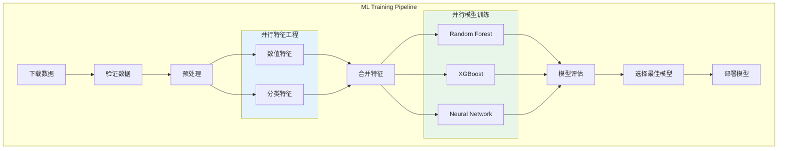
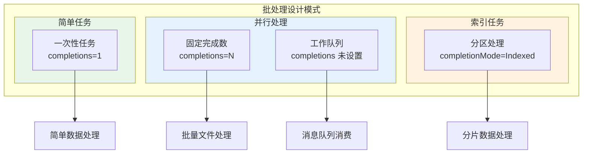

## 概述

Kubernetes 提供了强大的批处理作业支持，适用于数据处理、ETL 任务、机器学习训练等场景。本文深入解析 Job、CronJob 的使用方法，以及如何与 Argo Workflows、Spark 等大数据框架集成。

## Job 基础使用

### 简单 Job

```yaml
# simple-job.yaml
apiVersion: batch/v1
kind: Job
metadata:
  name: data-processing
  namespace: batch
spec:
  # 完成条件
  completions: 1  # 需要成功完成的 Pod 数量
  parallelism: 1  # 并行运行的 Pod 数量

  # 重试配置
  backoffLimit: 3  # 失败重试次数

  # 超时配置
  activeDeadlineSeconds: 3600  # 1 小时超时

  # 完成后清理（v1.23+）
  ttlSecondsAfterFinished: 86400  # 完成后 24 小时删除

  template:
    spec:
      restartPolicy: Never  # Job 必须是 Never 或 OnFailure

      containers:
        - name: processor
          image: data-processor:v1.0
          command:
            - python
            - /app/process.py
          args:
            - --input=/data/input
            - --output=/data/output
          env:
            - name: BATCH_SIZE
              value: "1000"
          resources:
            requests:
              cpu: "500m"
              memory: "1Gi"
            limits:
              cpu: "2"
              memory: "4Gi"
          volumeMounts:
            - name: data
              mountPath: /data

      volumes:
        - name: data
          persistentVolumeClaim:
            claimName: batch-data-pvc
```

### 并行 Job

```yaml
# parallel-job.yaml
apiVersion: batch/v1
kind: Job
metadata:
  name: parallel-processing
  namespace: batch
spec:
  # 固定完成数模式
  completions: 10  # 总共需要 10 个成功的 Pod
  parallelism: 3   # 同时运行 3 个 Pod

  # 完成模式
  completionMode: Indexed  # 或 NonIndexed

  template:
    spec:
      restartPolicy: Never
      containers:
        - name: worker
          image: batch-worker:v1.0
          command:
            - /bin/sh
            - -c
            - |
              echo "Processing batch ${JOB_COMPLETION_INDEX}"
              # 使用索引处理不同的数据分片
              python /app/process.py --partition=${JOB_COMPLETION_INDEX}
          env:
            # 自动注入的索引变量
            - name: JOB_COMPLETION_INDEX
              valueFrom:
                fieldRef:
                  fieldPath: metadata.annotations['batch.kubernetes.io/job-completion-index']
          resources:
            requests:
              cpu: "1"
              memory: "2Gi"
```

### 工作队列模式

```yaml
# work-queue-job.yaml
apiVersion: batch/v1
kind: Job
metadata:
  name: queue-worker
  namespace: batch
spec:
  # 工作队列模式：completions 未设置
  parallelism: 5  # 5 个并行 worker

  template:
    spec:
      restartPolicy: Never
      containers:
        - name: worker
          image: queue-worker:v1.0
          command:
            - python
            - /app/worker.py
          env:
            - name: REDIS_URL
              value: "redis://redis:6379"
            - name: QUEUE_NAME
              value: "work-queue"
          # Worker 自行检测队列是否为空来决定退出
```

### 工作队列 Worker 实现

```go
// worker.go
package main

import (
    "context"
    "fmt"
    "os"
    "os/signal"
    "syscall"
    "time"

    "github.com/redis/go-redis/v9"
)

func main() {
    ctx, cancel := context.WithCancel(context.Background())
    defer cancel()

    // 处理终止信号
    sigCh := make(chan os.Signal, 1)
    signal.Notify(sigCh, syscall.SIGTERM, syscall.SIGINT)
    go func() {
        <-sigCh
        fmt.Println("Received shutdown signal")
        cancel()
    }()

    // 连接 Redis
    rdb := redis.NewClient(&redis.Options{
        Addr: os.Getenv("REDIS_URL"),
    })
    defer rdb.Close()

    queueName := os.Getenv("QUEUE_NAME")
    emptyCount := 0
    maxEmptyCount := 10  // 连续 10 次空队列则退出

    for {
        select {
        case <-ctx.Done():
            fmt.Println("Worker shutting down")
            return
        default:
        }

        // 从队列获取任务（阻塞 5 秒）
        result, err := rdb.BLPop(ctx, 5*time.Second, queueName).Result()
        if err == redis.Nil {
            emptyCount++
            fmt.Printf("Queue empty (%d/%d)\n", emptyCount, maxEmptyCount)
            if emptyCount >= maxEmptyCount {
                fmt.Println("Queue consistently empty, worker exiting")
                return
            }
            continue
        }
        if err != nil {
            fmt.Printf("Error reading from queue: %v\n", err)
            time.Sleep(time.Second)
            continue
        }

        emptyCount = 0  // 重置空计数
        taskData := result[1]

        // 处理任务
        if err := processTask(ctx, taskData); err != nil {
            fmt.Printf("Error processing task: %v\n", err)
            // 可以选择将失败任务放入死信队列
            rdb.RPush(ctx, queueName+"-failed", taskData)
        } else {
            fmt.Printf("Task completed: %s\n", taskData)
        }
    }
}

func processTask(ctx context.Context, data string) error {
    // 实际的任务处理逻辑
    fmt.Printf("Processing: %s\n", data)
    time.Sleep(2 * time.Second)  // 模拟处理时间
    return nil
}
```

## CronJob 定时任务

### 基础 CronJob

```yaml
# basic-cronjob.yaml
apiVersion: batch/v1
kind: CronJob
metadata:
  name: daily-report
  namespace: batch
spec:
  # Cron 表达式: 分 时 日 月 周
  schedule: "0 8 * * *"  # 每天早上 8 点

  # 时区（v1.27+）
  timeZone: "Asia/Shanghai"

  # 并发策略
  concurrencyPolicy: Forbid  # Allow, Forbid, Replace

  # 启动截止时间
  startingDeadlineSeconds: 300  # 5 分钟内必须启动

  # 历史保留
  successfulJobsHistoryLimit: 3
  failedJobsHistoryLimit: 1

  # 挂起
  suspend: false

  jobTemplate:
    spec:
      backoffLimit: 2
      activeDeadlineSeconds: 7200  # 2 小时超时
      ttlSecondsAfterFinished: 86400

      template:
        spec:
          restartPolicy: OnFailure
          containers:
            - name: report-generator
              image: report-generator:v1.0
              command:
                - /bin/sh
                - -c
                - |
                  set -e
                  echo "Generating daily report..."
                  python /app/generate_report.py \
                    --date=$(date -d "yesterday" +%Y-%m-%d) \
                    --output=/reports/daily-$(date +%Y%m%d).pdf

                  echo "Sending report..."
                  python /app/send_report.py \
                    --recipients="${RECIPIENTS}" \
                    --attachment=/reports/daily-$(date +%Y%m%d).pdf
              env:
                - name: RECIPIENTS
                  valueFrom:
                    configMapKeyRef:
                      name: report-config
                      key: recipients
              resources:
                requests:
                  cpu: "500m"
                  memory: "1Gi"
```

### 常见 Cron 表达式

```yaml
# cron-examples.yaml

# 每小时执行
# schedule: "0 * * * *"

# 每天凌晨 2 点
# schedule: "0 2 * * *"

# 每周一早上 9 点
# schedule: "0 9 * * 1"

# 每月 1 号凌晨
# schedule: "0 0 1 * *"

# 每 5 分钟
# schedule: "*/5 * * * *"

# 工作日每天早上 8 点
# schedule: "0 8 * * 1-5"

# 每季度第一天
# schedule: "0 0 1 1,4,7,10 *"
```

### CronJob 并发策略


## Argo Workflows

### 工作流基础

```yaml
# argo-workflow-basic.yaml
apiVersion: argoproj.io/v1alpha1
kind: Workflow
metadata:
  name: data-pipeline
  namespace: argo
spec:
  entrypoint: main
  serviceAccountName: argo-workflow

  # 工作流级别参数
  arguments:
    parameters:
      - name: input-path
        value: "s3://bucket/input"
      - name: output-path
        value: "s3://bucket/output"

  # 工作流模板
  templates:
    # 主工作流
    - name: main
      dag:
        tasks:
          - name: extract
            template: extract-data
            arguments:
              parameters:
                - name: source
                  value: "{{workflow.parameters.input-path}}"

          - name: transform
            template: transform-data
            dependencies: [extract]
            arguments:
              artifacts:
                - name: raw-data
                  from: "{{tasks.extract.outputs.artifacts.data}}"

          - name: load
            template: load-data
            dependencies: [transform]
            arguments:
              artifacts:
                - name: processed-data
                  from: "{{tasks.transform.outputs.artifacts.data}}"
              parameters:
                - name: destination
                  value: "{{workflow.parameters.output-path}}"

    # 数据提取模板
    - name: extract-data
      inputs:
        parameters:
          - name: source
      outputs:
        artifacts:
          - name: data
            path: /tmp/raw-data
      container:
        image: data-extractor:v1.0
        command: [python, /app/extract.py]
        args:
          - --source={{inputs.parameters.source}}
          - --output=/tmp/raw-data
        resources:
          requests:
            cpu: "500m"
            memory: "1Gi"

    # 数据转换模板
    - name: transform-data
      inputs:
        artifacts:
          - name: raw-data
            path: /tmp/input
      outputs:
        artifacts:
          - name: data
            path: /tmp/output
      container:
        image: data-transformer:v1.0
        command: [python, /app/transform.py]
        args:
          - --input=/tmp/input
          - --output=/tmp/output
        resources:
          requests:
            cpu: "2"
            memory: "4Gi"

    # 数据加载模板
    - name: load-data
      inputs:
        parameters:
          - name: destination
        artifacts:
          - name: processed-data
            path: /tmp/data
      container:
        image: data-loader:v1.0
        command: [python, /app/load.py]
        args:
          - --input=/tmp/data
          - --destination={{inputs.parameters.destination}}
```

### DAG 工作流

```yaml
# argo-dag-workflow.yaml
apiVersion: argoproj.io/v1alpha1
kind: Workflow
metadata:
  name: ml-training-pipeline
spec:
  entrypoint: ml-pipeline

  templates:
    - name: ml-pipeline
      dag:
        tasks:
          # 数据准备阶段
          - name: download-data
            template: download

          - name: validate-data
            template: validate
            dependencies: [download-data]

          - name: preprocess-data
            template: preprocess
            dependencies: [validate-data]

          # 并行特征工程
          - name: feature-engineering-1
            template: feature-eng
            arguments:
              parameters:
                - name: feature-set
                  value: "numerical"
            dependencies: [preprocess-data]

          - name: feature-engineering-2
            template: feature-eng
            arguments:
              parameters:
                - name: feature-set
                  value: "categorical"
            dependencies: [preprocess-data]

          # 合并特征
          - name: merge-features
            template: merge
            dependencies:
              - feature-engineering-1
              - feature-engineering-2

          # 并行模型训练
          - name: train-model-rf
            template: train
            arguments:
              parameters:
                - name: model-type
                  value: "random-forest"
            dependencies: [merge-features]

          - name: train-model-xgb
            template: train
            arguments:
              parameters:
                - name: model-type
                  value: "xgboost"
            dependencies: [merge-features]

          - name: train-model-nn
            template: train
            arguments:
              parameters:
                - name: model-type
                  value: "neural-network"
            dependencies: [merge-features]

          # 模型评估
          - name: evaluate-models
            template: evaluate
            dependencies:
              - train-model-rf
              - train-model-xgb
              - train-model-nn

          # 选择最佳模型
          - name: select-best-model
            template: select
            dependencies: [evaluate-models]

          # 部署模型
          - name: deploy-model
            template: deploy
            dependencies: [select-best-model]

    # 模板定义
    - name: download
      container:
        image: ml-pipeline:v1.0
        command: [python, /app/download.py]

    - name: validate
      container:
        image: ml-pipeline:v1.0
        command: [python, /app/validate.py]

    - name: preprocess
      container:
        image: ml-pipeline:v1.0
        command: [python, /app/preprocess.py]
        resources:
          requests:
            cpu: "2"
            memory: "8Gi"

    - name: feature-eng
      inputs:
        parameters:
          - name: feature-set
      container:
        image: ml-pipeline:v1.0
        command: [python, /app/feature_engineering.py]
        args:
          - --feature-set={{inputs.parameters.feature-set}}
        resources:
          requests:
            cpu: "2"
            memory: "4Gi"

    - name: merge
      container:
        image: ml-pipeline:v1.0
        command: [python, /app/merge_features.py]

    - name: train
      inputs:
        parameters:
          - name: model-type
      container:
        image: ml-pipeline:v1.0
        command: [python, /app/train.py]
        args:
          - --model-type={{inputs.parameters.model-type}}
        resources:
          requests:
            cpu: "4"
            memory: "16Gi"
            nvidia.com/gpu: "1"

    - name: evaluate
      container:
        image: ml-pipeline:v1.0
        command: [python, /app/evaluate.py]

    - name: select
      container:
        image: ml-pipeline:v1.0
        command: [python, /app/select_best.py]

    - name: deploy
      container:
        image: ml-pipeline:v1.0
        command: [python, /app/deploy.py]
```

### 工作流可视化



## Spark on Kubernetes

### Spark 应用部署

```yaml
# spark-application.yaml
apiVersion: sparkoperator.k8s.io/v1beta2
kind: SparkApplication
metadata:
  name: spark-etl-job
  namespace: spark
spec:
  type: Scala
  mode: cluster
  image: spark:3.5.0
  imagePullPolicy: IfNotPresent
  mainClass: com.example.ETLJob
  mainApplicationFile: "s3a://my-bucket/jars/etl-job.jar"

  # Spark 配置
  sparkConf:
    spark.kubernetes.authenticate.driver.serviceAccountName: spark
    spark.eventLog.enabled: "true"
    spark.eventLog.dir: "s3a://my-bucket/spark-events"
    spark.hadoop.fs.s3a.impl: org.apache.hadoop.fs.s3a.S3AFileSystem
    spark.hadoop.fs.s3a.aws.credentials.provider: com.amazonaws.auth.WebIdentityTokenCredentialsProvider
    spark.sql.adaptive.enabled: "true"
    spark.sql.adaptive.coalescePartitions.enabled: "true"

  # 应用参数
  arguments:
    - "--input=s3a://my-bucket/input/"
    - "--output=s3a://my-bucket/output/"
    - "--date=2024-01-15"

  # Driver 配置
  driver:
    cores: 2
    coreLimit: "2"
    memory: "4g"
    labels:
      version: "3.5.0"
    serviceAccount: spark
    volumeMounts:
      - name: spark-config
        mountPath: /opt/spark/conf

  # Executor 配置
  executor:
    cores: 2
    instances: 5
    memory: "8g"
    labels:
      version: "3.5.0"
    volumeMounts:
      - name: spark-config
        mountPath: /opt/spark/conf

  # 卷配置
  volumes:
    - name: spark-config
      configMap:
        name: spark-config

  # 重试配置
  restartPolicy:
    type: OnFailure
    onFailureRetries: 3
    onFailureRetryInterval: 10
    onSubmissionFailureRetries: 5
    onSubmissionFailureRetryInterval: 20

  # 动态资源分配
  dynamicAllocation:
    enabled: true
    initialExecutors: 2
    minExecutors: 1
    maxExecutors: 10
---
# Spark 配置
apiVersion: v1
kind: ConfigMap
metadata:
  name: spark-config
  namespace: spark
data:
  spark-defaults.conf: |
    spark.master k8s://https://kubernetes.default.svc
    spark.submit.deployMode cluster
    spark.kubernetes.container.image spark:3.5.0
    spark.kubernetes.namespace spark
    spark.kubernetes.authenticate.driver.serviceAccountName spark
```

### 定期 Spark 任务

```yaml
# spark-scheduled-job.yaml
apiVersion: sparkoperator.k8s.io/v1beta2
kind: ScheduledSparkApplication
metadata:
  name: daily-etl
  namespace: spark
spec:
  # Cron 调度
  schedule: "0 2 * * *"
  concurrencyPolicy: Forbid
  suspend: false
  successfulRunHistoryLimit: 5
  failedRunHistoryLimit: 3

  template:
    type: Python
    mode: cluster
    image: spark-etl:v1.0
    imagePullPolicy: Always
    mainApplicationFile: "local:///app/etl.py"

    sparkConf:
      spark.kubernetes.authenticate.driver.serviceAccountName: spark
      spark.sql.adaptive.enabled: "true"

    arguments:
      - "--date={{ .Time.Format \"2006-01-02\" }}"

    driver:
      cores: 1
      memory: "2g"
      serviceAccount: spark

    executor:
      cores: 2
      instances: 3
      memory: "4g"

    restartPolicy:
      type: OnFailure
      onFailureRetries: 3
```

## 错误处理与重试

### Job 重试策略

```yaml
# job-retry-strategy.yaml
apiVersion: batch/v1
kind: Job
metadata:
  name: resilient-job
spec:
  # 重试配置
  backoffLimit: 6  # 最多重试 6 次

  # Pod 失败策略（v1.26+）
  podFailurePolicy:
    rules:
      # OOM 杀死时不重试
      - action: FailJob
        onExitCodes:
          containerName: main
          operator: In
          values: [137]  # SIGKILL (OOM)

      # 配置错误不重试
      - action: FailJob
        onPodConditions:
          - type: ConfigIssue

      # 可恢复错误继续重试
      - action: Count
        onExitCodes:
          containerName: main
          operator: In
          values: [1, 2, 3]  # 可重试的退出码

      # 临时错误忽略计数
      - action: Ignore
        onPodConditions:
          - type: DisruptionTarget

  template:
    spec:
      restartPolicy: Never
      containers:
        - name: main
          image: batch-job:v1.0
          resources:
            requests:
              memory: "2Gi"
            limits:
              memory: "4Gi"  # 设置内存限制防止 OOM
```

### 指数退避重试

```go
// retry.go
package main

import (
    "context"
    "fmt"
    "math"
    "math/rand"
    "time"
)

type RetryConfig struct {
    MaxRetries     int
    InitialDelay   time.Duration
    MaxDelay       time.Duration
    BackoffFactor  float64
    Jitter         float64
}

func DefaultRetryConfig() RetryConfig {
    return RetryConfig{
        MaxRetries:    5,
        InitialDelay:  time.Second,
        MaxDelay:      5 * time.Minute,
        BackoffFactor: 2.0,
        Jitter:        0.1,
    }
}

func WithRetry(ctx context.Context, config RetryConfig, operation func() error) error {
    var lastErr error

    for attempt := 0; attempt <= config.MaxRetries; attempt++ {
        // 执行操作
        err := operation()
        if err == nil {
            return nil
        }

        lastErr = err
        fmt.Printf("Attempt %d failed: %v\n", attempt+1, err)

        // 最后一次尝试不需要等待
        if attempt == config.MaxRetries {
            break
        }

        // 计算退避时间
        delay := config.calculateDelay(attempt)
        fmt.Printf("Retrying in %v...\n", delay)

        select {
        case <-ctx.Done():
            return ctx.Err()
        case <-time.After(delay):
        }
    }

    return fmt.Errorf("operation failed after %d attempts: %w", config.MaxRetries+1, lastErr)
}

func (c RetryConfig) calculateDelay(attempt int) time.Duration {
    // 指数退避
    delay := float64(c.InitialDelay) * math.Pow(c.BackoffFactor, float64(attempt))

    // 添加抖动
    jitter := delay * c.Jitter * (rand.Float64()*2 - 1)
    delay += jitter

    // 限制最大延迟
    if delay > float64(c.MaxDelay) {
        delay = float64(c.MaxDelay)
    }

    return time.Duration(delay)
}

// 使用示例
func main() {
    ctx := context.Background()
    config := DefaultRetryConfig()

    err := WithRetry(ctx, config, func() error {
        // 执行可能失败的操作
        return processData()
    })

    if err != nil {
        fmt.Printf("Final error: %v\n", err)
    }
}
```

## 监控与日志

### 批处理作业监控

```yaml
# batch-monitoring.yaml
apiVersion: monitoring.coreos.com/v1
kind: PrometheusRule
metadata:
  name: batch-job-alerts
  namespace: monitoring
spec:
  groups:
    - name: batch-jobs
      rules:
        # Job 失败告警
        - alert: BatchJobFailed
          expr: |
            kube_job_status_failed{namespace="batch"} > 0
          for: 1m
          labels:
            severity: warning
          annotations:
            summary: "Batch job failed"
            description: "Job {{ $labels.job_name }} in namespace {{ $labels.namespace }} has failed"

        # Job 运行时间过长
        - alert: BatchJobRunningTooLong
          expr: |
            time() - kube_job_status_start_time{namespace="batch"}
            > on(job_name) group_left()
            kube_job_spec_active_deadline_seconds{namespace="batch"} * 0.8
          for: 5m
          labels:
            severity: warning
          annotations:
            summary: "Batch job running too long"
            description: "Job {{ $labels.job_name }} has been running for more than 80% of its deadline"

        # CronJob 错过调度
        - alert: CronJobMissedSchedule
          expr: |
            time() - kube_cronjob_status_last_schedule_time > 3600
          for: 10m
          labels:
            severity: warning
          annotations:
            summary: "CronJob missed schedule"
            description: "CronJob {{ $labels.cronjob }} has not been scheduled in the last hour"

        # Job 积压
        - alert: JobQueueBacklog
          expr: |
            sum(kube_job_status_active{namespace="batch"}) > 10
          for: 30m
          labels:
            severity: warning
          annotations:
            summary: "Too many active batch jobs"
            description: "There are {{ $value }} active jobs in the batch namespace"
```

### 日志聚合

```yaml
# job-logging.yaml
apiVersion: batch/v1
kind: Job
metadata:
  name: logged-job
  namespace: batch
spec:
  template:
    metadata:
      labels:
        app: batch-job
        job-type: etl
    spec:
      restartPolicy: Never
      containers:
        - name: main
          image: batch-job:v1.0
          env:
            # 结构化日志配置
            - name: LOG_FORMAT
              value: "json"
            - name: LOG_LEVEL
              value: "info"
            # 添加元数据
            - name: JOB_NAME
              valueFrom:
                fieldRef:
                  fieldPath: metadata.labels['job-name']
            - name: POD_NAME
              valueFrom:
                fieldRef:
                  fieldPath: metadata.name
```

## 最佳实践

### 批处理作业检查清单

| 检查项 | 说明 | 推荐配置 |
|--------|------|----------|
| 重试策略 | 设置合理的重试次数 | backoffLimit: 3-6 |
| 超时设置 | 防止任务无限运行 | activeDeadlineSeconds |
| 资源限制 | 防止资源耗尽 | requests/limits |
| 清理策略 | 自动清理完成的 Job | ttlSecondsAfterFinished |
| 幂等性 | 确保重试安全 | 实现幂等操作 |
| 监控告警 | 及时发现问题 | Prometheus 规则 |
| 日志结构化 | 便于分析 | JSON 格式日志 |

### Job 设计模式



## 总结

Kubernetes 批处理能力涵盖了从简单的一次性任务到复杂的工作流编排：

1. **Job**：适用于一次性或并行批处理任务
2. **CronJob**：适用于定时调度任务
3. **Argo Workflows**：适用于复杂的 DAG 工作流
4. **Spark on Kubernetes**：适用于大数据处理

关键要点：
- 合理设置重试和超时策略
- 确保任务的幂等性
- 建立完善的监控和告警
- 使用工作队列模式处理大量任务
- 利用并行处理提高效率

通过合理选择和配置批处理方案，可以在 Kubernetes 中高效地运行各种数据处理任务。
