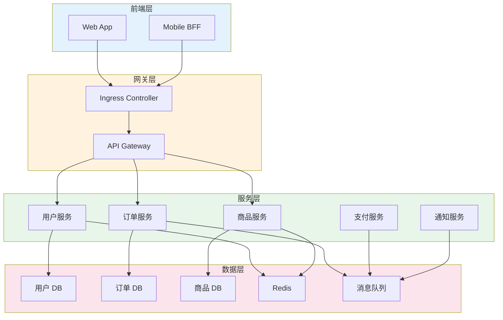

## 概述

Kubernetes 为微服务架构提供了理想的运行平台。本文深入解析如何在 Kubernetes 中设计和部署微服务，包括服务拆分、通信模式、配置管理、可观测性等关键实践。

## 服务拆分策略

### 微服务架构示例



### 服务定义示例

```yaml
# user-service.yaml
apiVersion: apps/v1
kind: Deployment
metadata:
  name: user-service
  namespace: microservices
  labels:
    app: user-service
    tier: backend
spec:
  replicas: 3
  selector:
    matchLabels:
      app: user-service
  template:
    metadata:
      labels:
        app: user-service
        tier: backend
      annotations:
        prometheus.io/scrape: "true"
        prometheus.io/port: "8080"
        prometheus.io/path: "/metrics"
    spec:
      serviceAccountName: user-service

      affinity:
        podAntiAffinity:
          preferredDuringSchedulingIgnoredDuringExecution:
            - weight: 100
              podAffinityTerm:
                labelSelector:
                  matchLabels:
                    app: user-service
                topologyKey: kubernetes.io/hostname

      containers:
        - name: user-service
          image: myregistry/user-service:v1.2.0
          ports:
            - name: http
              containerPort: 8080
            - name: grpc
              containerPort: 9090

          env:
            - name: SERVICE_NAME
              value: "user-service"
            - name: SERVICE_VERSION
              value: "v1.2.0"
            - name: POD_NAME
              valueFrom:
                fieldRef:
                  fieldPath: metadata.name
            - name: POD_NAMESPACE
              valueFrom:
                fieldRef:
                  fieldPath: metadata.namespace

          envFrom:
            - configMapRef:
                name: user-service-config
            - secretRef:
                name: user-service-secrets

          resources:
            requests:
              cpu: "100m"
              memory: "256Mi"
            limits:
              cpu: "500m"
              memory: "512Mi"

          readinessProbe:
            httpGet:
              path: /health/ready
              port: 8080
            initialDelaySeconds: 5
            periodSeconds: 10

          livenessProbe:
            httpGet:
              path: /health/live
              port: 8080
            initialDelaySeconds: 15
            periodSeconds: 20

          lifecycle:
            preStop:
              exec:
                command: ["/bin/sh", "-c", "sleep 10"]

      terminationGracePeriodSeconds: 30
---
apiVersion: v1
kind: Service
metadata:
  name: user-service
  namespace: microservices
  labels:
    app: user-service
spec:
  selector:
    app: user-service
  ports:
    - name: http
      port: 80
      targetPort: 8080
    - name: grpc
      port: 9090
      targetPort: 9090
```

## 服务通信

### REST API 通信

```yaml
# api-gateway.yaml
apiVersion: apps/v1
kind: Deployment
metadata:
  name: api-gateway
  namespace: microservices
spec:
  replicas: 3
  selector:
    matchLabels:
      app: api-gateway
  template:
    metadata:
      labels:
        app: api-gateway
    spec:
      containers:
        - name: gateway
          image: myregistry/api-gateway:v1.0.0
          ports:
            - containerPort: 8080
          env:
            # 上游服务配置
            - name: USER_SERVICE_URL
              value: "http://user-service.microservices.svc.cluster.local"
            - name: ORDER_SERVICE_URL
              value: "http://order-service.microservices.svc.cluster.local"
            - name: PRODUCT_SERVICE_URL
              value: "http://product-service.microservices.svc.cluster.local"

          # 熔断器配置
            - name: CIRCUIT_BREAKER_ENABLED
              value: "true"
            - name: CIRCUIT_BREAKER_THRESHOLD
              value: "5"
            - name: CIRCUIT_BREAKER_TIMEOUT
              value: "30s"
---
apiVersion: networking.k8s.io/v1
kind: Ingress
metadata:
  name: api-gateway
  namespace: microservices
  annotations:
    nginx.ingress.kubernetes.io/ssl-redirect: "true"
    nginx.ingress.kubernetes.io/proxy-body-size: "10m"
    nginx.ingress.kubernetes.io/proxy-read-timeout: "60"
spec:
  ingressClassName: nginx
  tls:
    - hosts:
        - api.example.com
      secretName: api-tls-secret
  rules:
    - host: api.example.com
      http:
        paths:
          - path: /
            pathType: Prefix
            backend:
              service:
                name: api-gateway
                port:
                  number: 80
```

### gRPC 通信

```yaml
# grpc-service.yaml
apiVersion: apps/v1
kind: Deployment
metadata:
  name: order-service
  namespace: microservices
spec:
  replicas: 3
  selector:
    matchLabels:
      app: order-service
  template:
    metadata:
      labels:
        app: order-service
    spec:
      containers:
        - name: order-service
          image: myregistry/order-service:v1.0.0
          ports:
            - name: grpc
              containerPort: 9090
          env:
            # gRPC 客户端配置
            - name: USER_SERVICE_GRPC
              value: "user-service.microservices.svc.cluster.local:9090"
            - name: PRODUCT_SERVICE_GRPC
              value: "product-service.microservices.svc.cluster.local:9090"

          # gRPC 健康检查
          readinessProbe:
            grpc:
              port: 9090
            initialDelaySeconds: 5
          livenessProbe:
            grpc:
              port: 9090
            initialDelaySeconds: 15
---
# Headless Service for gRPC (支持客户端负载均衡)
apiVersion: v1
kind: Service
metadata:
  name: order-service
  namespace: microservices
spec:
  clusterIP: None  # Headless
  selector:
    app: order-service
  ports:
    - name: grpc
      port: 9090
```

### gRPC 客户端负载均衡

```go
// grpc_client.go
package client

import (
    "context"
    "time"

    "google.golang.org/grpc"
    "google.golang.org/grpc/credentials/insecure"
    "google.golang.org/grpc/resolver"
    "google.golang.org/grpc/balancer/roundrobin"
    _ "google.golang.org/grpc/health"
)

func NewGRPCClient(target string) (*grpc.ClientConn, error) {
    // 使用 DNS 解析器实现客户端负载均衡
    resolver.SetDefaultScheme("dns")

    conn, err := grpc.Dial(
        target,
        // 使用轮询负载均衡
        grpc.WithDefaultServiceConfig(`{"loadBalancingPolicy":"round_robin"}`),
        // 连接配置
        grpc.WithTransportCredentials(insecure.NewCredentials()),
        // 连接保活
        grpc.WithKeepaliveParams(keepalive.ClientParameters{
            Time:                10 * time.Second,
            Timeout:             3 * time.Second,
            PermitWithoutStream: true,
        }),
        // 重试配置
        grpc.WithDefaultCallOptions(
            grpc.WaitForReady(true),
        ),
    )
    if err != nil {
        return nil, err
    }

    return conn, nil
}

// 使用示例
func main() {
    // DNS 格式: dns:///service-name:port
    conn, err := NewGRPCClient("dns:///user-service.microservices.svc.cluster.local:9090")
    if err != nil {
        log.Fatal(err)
    }
    defer conn.Close()

    // 创建服务客户端
    client := pb.NewUserServiceClient(conn)

    // 调用服务
    resp, err := client.GetUser(context.Background(), &pb.GetUserRequest{
        UserId: "123",
    })
}
```

### 异步消息通信

```yaml
# message-consumer.yaml
apiVersion: apps/v1
kind: Deployment
metadata:
  name: notification-service
  namespace: microservices
spec:
  replicas: 3
  selector:
    matchLabels:
      app: notification-service
  template:
    metadata:
      labels:
        app: notification-service
    spec:
      containers:
        - name: notification-service
          image: myregistry/notification-service:v1.0.0
          env:
            # Kafka 配置
            - name: KAFKA_BROKERS
              value: "kafka-0.kafka.microservices.svc.cluster.local:9092,kafka-1.kafka.microservices.svc.cluster.local:9092,kafka-2.kafka.microservices.svc.cluster.local:9092"
            - name: KAFKA_CONSUMER_GROUP
              value: "notification-service"
            - name: KAFKA_TOPICS
              value: "order-events,user-events"

          # 消费者配置
            - name: KAFKA_AUTO_OFFSET_RESET
              value: "earliest"
            - name: KAFKA_MAX_POLL_RECORDS
              value: "100"

          resources:
            requests:
              cpu: "100m"
              memory: "256Mi"
            limits:
              cpu: "500m"
              memory: "512Mi"
```

### 消息生产者示例

```go
// producer.go
package messaging

import (
    "context"
    "encoding/json"
    "time"

    "github.com/segmentio/kafka-go"
)

type OrderEvent struct {
    EventType string    `json:"event_type"`
    OrderID   string    `json:"order_id"`
    UserID    string    `json:"user_id"`
    Status    string    `json:"status"`
    Timestamp time.Time `json:"timestamp"`
}

type EventProducer struct {
    writer *kafka.Writer
}

func NewEventProducer(brokers []string, topic string) *EventProducer {
    writer := &kafka.Writer{
        Addr:         kafka.TCP(brokers...),
        Topic:        topic,
        Balancer:     &kafka.LeastBytes{},
        BatchSize:    100,
        BatchTimeout: 10 * time.Millisecond,
        RequiredAcks: kafka.RequireOne,
        Async:        false,
    }

    return &EventProducer{writer: writer}
}

func (p *EventProducer) PublishOrderEvent(ctx context.Context, event OrderEvent) error {
    data, err := json.Marshal(event)
    if err != nil {
        return err
    }

    msg := kafka.Message{
        Key:   []byte(event.OrderID),
        Value: data,
        Headers: []kafka.Header{
            {Key: "event_type", Value: []byte(event.EventType)},
            {Key: "timestamp", Value: []byte(event.Timestamp.Format(time.RFC3339))},
        },
    }

    return p.writer.WriteMessages(ctx, msg)
}

func (p *EventProducer) Close() error {
    return p.writer.Close()
}
```

## 配置管理

### 分层配置

```yaml
# base-config.yaml - 基础配置
apiVersion: v1
kind: ConfigMap
metadata:
  name: microservices-base-config
  namespace: microservices
data:
  LOG_LEVEL: "info"
  LOG_FORMAT: "json"
  METRICS_ENABLED: "true"
  TRACING_ENABLED: "true"
  HEALTH_CHECK_INTERVAL: "10s"
---
# service-config.yaml - 服务特定配置
apiVersion: v1
kind: ConfigMap
metadata:
  name: user-service-config
  namespace: microservices
data:
  # 数据库配置
  DB_HOST: "postgres-user.microservices.svc.cluster.local"
  DB_PORT: "5432"
  DB_NAME: "users"
  DB_POOL_SIZE: "10"

  # 缓存配置
  REDIS_HOST: "redis.microservices.svc.cluster.local"
  REDIS_PORT: "6379"
  REDIS_DB: "0"

  # 服务配置
  HTTP_PORT: "8080"
  GRPC_PORT: "9090"
  REQUEST_TIMEOUT: "30s"
---
# secrets.yaml - 敏感配置
apiVersion: v1
kind: Secret
metadata:
  name: user-service-secrets
  namespace: microservices
type: Opaque
stringData:
  DB_PASSWORD: "secure-password"
  REDIS_PASSWORD: "redis-password"
  JWT_SECRET: "jwt-secret-key"
```

### 外部配置中心

```yaml
# external-secrets.yaml
# 使用 External Secrets Operator 从 AWS Secrets Manager 同步
apiVersion: external-secrets.io/v1beta1
kind: ExternalSecret
metadata:
  name: user-service-external-secrets
  namespace: microservices
spec:
  refreshInterval: 1h
  secretStoreRef:
    name: aws-secrets-manager
    kind: ClusterSecretStore
  target:
    name: user-service-secrets
    creationPolicy: Owner
  data:
    - secretKey: DB_PASSWORD
      remoteRef:
        key: microservices/user-service
        property: db_password
    - secretKey: JWT_SECRET
      remoteRef:
        key: microservices/user-service
        property: jwt_secret
---
# ClusterSecretStore 配置
apiVersion: external-secrets.io/v1beta1
kind: ClusterSecretStore
metadata:
  name: aws-secrets-manager
spec:
  provider:
    aws:
      service: SecretsManager
      region: us-west-2
      auth:
        jwt:
          serviceAccountRef:
            name: external-secrets
            namespace: external-secrets
```

### 配置热更新

```go
// config_watcher.go
package config

import (
    "context"
    "encoding/json"
    "log"
    "os"
    "sync"
    "time"

    "github.com/fsnotify/fsnotify"
)

type Config struct {
    LogLevel       string        `json:"log_level"`
    RequestTimeout time.Duration `json:"request_timeout"`
    FeatureFlags   FeatureFlags  `json:"feature_flags"`
}

type FeatureFlags struct {
    NewCheckoutFlow bool `json:"new_checkout_flow"`
    DarkMode        bool `json:"dark_mode"`
}

type ConfigWatcher struct {
    config     *Config
    configPath string
    mu         sync.RWMutex
    callbacks  []func(*Config)
}

func NewConfigWatcher(configPath string) (*ConfigWatcher, error) {
    cw := &ConfigWatcher{
        configPath: configPath,
        callbacks:  make([]func(*Config), 0),
    }

    // 初始加载
    if err := cw.reload(); err != nil {
        return nil, err
    }

    // 启动文件监听
    go cw.watch()

    return cw, nil
}

func (cw *ConfigWatcher) reload() error {
    data, err := os.ReadFile(cw.configPath)
    if err != nil {
        return err
    }

    var config Config
    if err := json.Unmarshal(data, &config); err != nil {
        return err
    }

    cw.mu.Lock()
    cw.config = &config
    cw.mu.Unlock()

    // 触发回调
    for _, cb := range cw.callbacks {
        cb(&config)
    }

    log.Printf("Config reloaded: %+v\n", config)
    return nil
}

func (cw *ConfigWatcher) watch() {
    watcher, err := fsnotify.NewWatcher()
    if err != nil {
        log.Printf("Failed to create watcher: %v\n", err)
        return
    }
    defer watcher.Close()

    if err := watcher.Add(cw.configPath); err != nil {
        log.Printf("Failed to watch config file: %v\n", err)
        return
    }

    for {
        select {
        case event, ok := <-watcher.Events:
            if !ok {
                return
            }
            if event.Op&fsnotify.Write == fsnotify.Write {
                log.Println("Config file modified, reloading...")
                if err := cw.reload(); err != nil {
                    log.Printf("Failed to reload config: %v\n", err)
                }
            }
        case err, ok := <-watcher.Errors:
            if !ok {
                return
            }
            log.Printf("Watcher error: %v\n", err)
        }
    }
}

func (cw *ConfigWatcher) Get() *Config {
    cw.mu.RLock()
    defer cw.mu.RUnlock()
    return cw.config
}

func (cw *ConfigWatcher) OnChange(callback func(*Config)) {
    cw.callbacks = append(cw.callbacks, callback)
}
```

## 可观测性

### 分布式追踪

```yaml
# tracing-deployment.yaml
apiVersion: apps/v1
kind: Deployment
metadata:
  name: user-service
  namespace: microservices
spec:
  template:
    metadata:
      annotations:
        # Jaeger sidecar 注入
        sidecar.jaegertracing.io/inject: "true"
    spec:
      containers:
        - name: user-service
          env:
            # OpenTelemetry 配置
            - name: OTEL_SERVICE_NAME
              value: "user-service"
            - name: OTEL_EXPORTER_OTLP_ENDPOINT
              value: "http://otel-collector.observability.svc.cluster.local:4317"
            - name: OTEL_TRACES_SAMPLER
              value: "parentbased_traceidratio"
            - name: OTEL_TRACES_SAMPLER_ARG
              value: "0.1"  # 10% 采样率
            - name: OTEL_RESOURCE_ATTRIBUTES
              value: "service.namespace=microservices,deployment.environment=production"
```

### OpenTelemetry 集成

```go
// tracing.go
package observability

import (
    "context"
    "log"

    "go.opentelemetry.io/otel"
    "go.opentelemetry.io/otel/exporters/otlp/otlptrace/otlptracegrpc"
    "go.opentelemetry.io/otel/propagation"
    "go.opentelemetry.io/otel/sdk/resource"
    sdktrace "go.opentelemetry.io/otel/sdk/trace"
    semconv "go.opentelemetry.io/otel/semconv/v1.17.0"
    "go.opentelemetry.io/otel/trace"
)

func InitTracer(ctx context.Context, serviceName, endpoint string) (func(context.Context) error, error) {
    // 创建 OTLP 导出器
    exporter, err := otlptracegrpc.New(ctx,
        otlptracegrpc.WithEndpoint(endpoint),
        otlptracegrpc.WithInsecure(),
    )
    if err != nil {
        return nil, err
    }

    // 创建资源
    res, err := resource.New(ctx,
        resource.WithAttributes(
            semconv.ServiceName(serviceName),
            semconv.ServiceVersion("v1.0.0"),
        ),
    )
    if err != nil {
        return nil, err
    }

    // 创建 TracerProvider
    tp := sdktrace.NewTracerProvider(
        sdktrace.WithBatcher(exporter),
        sdktrace.WithResource(res),
        sdktrace.WithSampler(sdktrace.ParentBased(
            sdktrace.TraceIDRatioBased(0.1),
        )),
    )

    otel.SetTracerProvider(tp)
    otel.SetTextMapPropagator(propagation.NewCompositeTextMapPropagator(
        propagation.TraceContext{},
        propagation.Baggage{},
    ))

    return tp.Shutdown, nil
}

// HTTP 中间件
func TracingMiddleware(next http.Handler) http.Handler {
    return http.HandlerFunc(func(w http.ResponseWriter, r *http.Request) {
        tracer := otel.Tracer("http")

        ctx, span := tracer.Start(r.Context(), r.URL.Path,
            trace.WithSpanKind(trace.SpanKindServer),
            trace.WithAttributes(
                semconv.HTTPMethod(r.Method),
                semconv.HTTPRoute(r.URL.Path),
            ),
        )
        defer span.End()

        // 包装 ResponseWriter 以捕获状态码
        sw := &statusWriter{ResponseWriter: w}
        next.ServeHTTP(sw, r.WithContext(ctx))

        span.SetAttributes(
            semconv.HTTPStatusCode(sw.status),
        )
    })
}
```

### 日志聚合

```yaml
# fluent-bit-config.yaml
apiVersion: v1
kind: ConfigMap
metadata:
  name: fluent-bit-config
  namespace: logging
data:
  fluent-bit.conf: |
    [SERVICE]
        Flush         1
        Log_Level     info
        Daemon        off
        Parsers_File  parsers.conf

    [INPUT]
        Name              tail
        Tag               kube.*
        Path              /var/log/containers/*.log
        Parser            docker
        DB                /var/log/flb_kube.db
        Mem_Buf_Limit     5MB
        Skip_Long_Lines   On
        Refresh_Interval  10

    [FILTER]
        Name                kubernetes
        Match               kube.*
        Kube_URL            https://kubernetes.default.svc:443
        Kube_CA_File        /var/run/secrets/kubernetes.io/serviceaccount/ca.crt
        Kube_Token_File     /var/run/secrets/kubernetes.io/serviceaccount/token
        Merge_Log           On
        Keep_Log            Off
        K8S-Logging.Parser  On
        K8S-Logging.Exclude On

    [FILTER]
        Name          nest
        Match         kube.*
        Operation     lift
        Nested_under  kubernetes
        Add_prefix    k8s_

    [OUTPUT]
        Name            es
        Match           kube.*
        Host            elasticsearch.logging.svc.cluster.local
        Port            9200
        Logstash_Format On
        Logstash_Prefix k8s
        Retry_Limit     False

  parsers.conf: |
    [PARSER]
        Name        docker
        Format      json
        Time_Key    time
        Time_Format %Y-%m-%dT%H:%M:%S.%L
        Time_Keep   On
```

### 服务指标

```go
// metrics.go
package observability

import (
    "net/http"
    "time"

    "github.com/prometheus/client_golang/prometheus"
    "github.com/prometheus/client_golang/prometheus/promauto"
    "github.com/prometheus/client_golang/prometheus/promhttp"
)

var (
    httpRequestsTotal = promauto.NewCounterVec(
        prometheus.CounterOpts{
            Name: "http_requests_total",
            Help: "Total number of HTTP requests",
        },
        []string{"method", "path", "status"},
    )

    httpRequestDuration = promauto.NewHistogramVec(
        prometheus.HistogramOpts{
            Name:    "http_request_duration_seconds",
            Help:    "HTTP request duration in seconds",
            Buckets: prometheus.ExponentialBuckets(0.001, 2, 15),
        },
        []string{"method", "path"},
    )

    grpcRequestsTotal = promauto.NewCounterVec(
        prometheus.CounterOpts{
            Name: "grpc_requests_total",
            Help: "Total number of gRPC requests",
        },
        []string{"method", "status"},
    )

    databaseQueryDuration = promauto.NewHistogramVec(
        prometheus.HistogramOpts{
            Name:    "database_query_duration_seconds",
            Help:    "Database query duration in seconds",
            Buckets: prometheus.ExponentialBuckets(0.0001, 2, 15),
        },
        []string{"operation", "table"},
    )

    cacheHits = promauto.NewCounterVec(
        prometheus.CounterOpts{
            Name: "cache_hits_total",
            Help: "Total number of cache hits",
        },
        []string{"cache"},
    )

    cacheMisses = promauto.NewCounterVec(
        prometheus.CounterOpts{
            Name: "cache_misses_total",
            Help: "Total number of cache misses",
        },
        []string{"cache"},
    )
)

// HTTP 指标中间件
func MetricsMiddleware(next http.Handler) http.Handler {
    return http.HandlerFunc(func(w http.ResponseWriter, r *http.Request) {
        start := time.Now()
        sw := &statusWriter{ResponseWriter: w, status: http.StatusOK}

        next.ServeHTTP(sw, r)

        duration := time.Since(start).Seconds()
        httpRequestsTotal.WithLabelValues(r.Method, r.URL.Path, http.StatusText(sw.status)).Inc()
        httpRequestDuration.WithLabelValues(r.Method, r.URL.Path).Observe(duration)
    })
}

// 指标端点
func MetricsHandler() http.Handler {
    return promhttp.Handler()
}
```

## 弹性设计

### 熔断器

```go
// circuit_breaker.go
package resilience

import (
    "context"
    "errors"
    "sync"
    "time"
)

type State int

const (
    StateClosed State = iota
    StateOpen
    StateHalfOpen
)

type CircuitBreaker struct {
    name          string
    maxFailures   int
    timeout       time.Duration
    halfOpenMax   int

    mu            sync.RWMutex
    state         State
    failures      int
    lastFailure   time.Time
    halfOpenCount int
}

func NewCircuitBreaker(name string, maxFailures int, timeout time.Duration) *CircuitBreaker {
    return &CircuitBreaker{
        name:        name,
        maxFailures: maxFailures,
        timeout:     timeout,
        halfOpenMax: 3,
        state:       StateClosed,
    }
}

func (cb *CircuitBreaker) Execute(ctx context.Context, fn func() error) error {
    if !cb.allowRequest() {
        return errors.New("circuit breaker is open")
    }

    err := fn()

    cb.recordResult(err)
    return err
}

func (cb *CircuitBreaker) allowRequest() bool {
    cb.mu.Lock()
    defer cb.mu.Unlock()

    switch cb.state {
    case StateClosed:
        return true
    case StateOpen:
        if time.Since(cb.lastFailure) > cb.timeout {
            cb.state = StateHalfOpen
            cb.halfOpenCount = 0
            return true
        }
        return false
    case StateHalfOpen:
        if cb.halfOpenCount < cb.halfOpenMax {
            cb.halfOpenCount++
            return true
        }
        return false
    }
    return false
}

func (cb *CircuitBreaker) recordResult(err error) {
    cb.mu.Lock()
    defer cb.mu.Unlock()

    if err != nil {
        cb.failures++
        cb.lastFailure = time.Now()

        if cb.failures >= cb.maxFailures {
            cb.state = StateOpen
        }
    } else {
        if cb.state == StateHalfOpen {
            cb.state = StateClosed
        }
        cb.failures = 0
    }
}
```

### 限流

```yaml
# rate-limit-config.yaml
apiVersion: v1
kind: ConfigMap
metadata:
  name: rate-limit-config
  namespace: microservices
data:
  config.yaml: |
    domain: microservices
    descriptors:
      # 全局限流
      - key: generic_key
        value: default
        rate_limit:
          unit: second
          requests_per_unit: 1000

      # 按用户限流
      - key: user_id
        rate_limit:
          unit: minute
          requests_per_unit: 100

      # 按 API 限流
      - key: api_path
        value: /api/v1/orders
        rate_limit:
          unit: second
          requests_per_unit: 50

      # 组合限流
      - key: user_id
        descriptors:
          - key: api_path
            value: /api/v1/expensive
            rate_limit:
              unit: minute
              requests_per_unit: 10
```

## 总结

微服务架构在 Kubernetes 中的最佳实践：

1. **服务拆分**：按业务领域划分，保持服务独立性
2. **通信模式**：根据场景选择同步（REST/gRPC）或异步（消息队列）
3. **配置管理**：使用 ConfigMap/Secret 和外部配置中心
4. **可观测性**：集成分布式追踪、日志聚合、指标监控
5. **弹性设计**：实现熔断器、限流、重试等容错机制

通过合理的架构设计和运维实践，可以在 Kubernetes 上构建高可用、可扩展的微服务系统。
