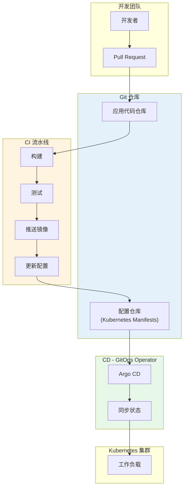

## 概述

Kubernetes 与 CI/CD 工具链的深度集成是实现云原生应用持续交付的关键。本文深入解析 GitOps 模式、镜像构建最佳实践、多环境管理、以及如何构建完整的 Kubernetes CI/CD 流水线。

## GitOps 模式

### GitOps 架构



### Argo CD 配置

```yaml
# argocd-application.yaml
apiVersion: argoproj.io/v1alpha1
kind: Application
metadata:
  name: web-app
  namespace: argocd
  finalizers:
    - resources-finalizer.argocd.argoproj.io
spec:
  project: default

  source:
    repoURL: https://github.com/myorg/k8s-configs.git
    targetRevision: main
    path: apps/web-app/overlays/production

    # Kustomize 配置
    kustomize:
      images:
        - myregistry/web-app:v1.2.0

  destination:
    server: https://kubernetes.default.svc
    namespace: production

  # 同步策略
  syncPolicy:
    automated:
      prune: true       # 删除不在 Git 中的资源
      selfHeal: true    # 自动修复漂移
      allowEmpty: false

    syncOptions:
      - CreateNamespace=true
      - PrunePropagationPolicy=foreground
      - PruneLast=true
      - ApplyOutOfSyncOnly=true

    retry:
      limit: 5
      backoff:
        duration: 5s
        factor: 2
        maxDuration: 3m

  # 健康检查
  ignoreDifferences:
    - group: apps
      kind: Deployment
      jsonPointers:
        - /spec/replicas  # 忽略 HPA 管理的副本数

  # 资源钩子
  info:
    - name: url
      value: https://web-app.example.com
---
# ApplicationSet for multi-environment
apiVersion: argoproj.io/v1alpha1
kind: ApplicationSet
metadata:
  name: web-app-environments
  namespace: argocd
spec:
  generators:
    - list:
        elements:
          - env: development
            namespace: dev
            cluster: https://dev-cluster.example.com
          - env: staging
            namespace: staging
            cluster: https://staging-cluster.example.com
          - env: production
            namespace: production
            cluster: https://kubernetes.default.svc

  template:
    metadata:
      name: 'web-app-{{env}}'
    spec:
      project: default
      source:
        repoURL: https://github.com/myorg/k8s-configs.git
        targetRevision: main
        path: 'apps/web-app/overlays/{{env}}'
      destination:
        server: '{{cluster}}'
        namespace: '{{namespace}}'
      syncPolicy:
        automated:
          prune: true
          selfHeal: true
```

### Flux 配置

```yaml
# flux-source.yaml
apiVersion: source.toolkit.fluxcd.io/v1
kind: GitRepository
metadata:
  name: k8s-configs
  namespace: flux-system
spec:
  interval: 1m
  url: https://github.com/myorg/k8s-configs.git
  ref:
    branch: main
  secretRef:
    name: git-credentials
---
# flux-kustomization.yaml
apiVersion: kustomize.toolkit.fluxcd.io/v1
kind: Kustomization
metadata:
  name: web-app
  namespace: flux-system
spec:
  interval: 5m
  path: ./apps/web-app/overlays/production
  prune: true
  sourceRef:
    kind: GitRepository
    name: k8s-configs

  # 健康检查
  healthChecks:
    - apiVersion: apps/v1
      kind: Deployment
      name: web-app
      namespace: production

  # 依赖
  dependsOn:
    - name: infrastructure

  # 替换镜像
  images:
    - name: myregistry/web-app
      newTag: v1.2.0

  # 超时设置
  timeout: 5m

  # 重试
  retryInterval: 1m
---
# 镜像自动更新
apiVersion: image.toolkit.fluxcd.io/v1beta1
kind: ImageRepository
metadata:
  name: web-app
  namespace: flux-system
spec:
  image: myregistry/web-app
  interval: 1m
  secretRef:
    name: registry-credentials
---
apiVersion: image.toolkit.fluxcd.io/v1beta1
kind: ImagePolicy
metadata:
  name: web-app
  namespace: flux-system
spec:
  imageRepositoryRef:
    name: web-app
  policy:
    semver:
      range: '>=1.0.0'
---
apiVersion: image.toolkit.fluxcd.io/v1beta1
kind: ImageUpdateAutomation
metadata:
  name: web-app
  namespace: flux-system
spec:
  interval: 5m
  sourceRef:
    kind: GitRepository
    name: k8s-configs
  git:
    checkout:
      ref:
        branch: main
    commit:
      author:
        email: flux@example.com
        name: Flux
      messageTemplate: 'Update image to {{.NewImage}}'
    push:
      branch: main
  update:
    path: ./apps/web-app
    strategy: Setters
```

## 镜像构建

### Dockerfile 最佳实践

```dockerfile
# Dockerfile

# 阶段 1: 构建
FROM golang:1.21-alpine AS builder

# 安装构建依赖
RUN apk add --no-cache git ca-certificates

# 设置工作目录
WORKDIR /app

# 复制依赖文件并下载依赖（利用缓存）
COPY go.mod go.sum ./
RUN go mod download

# 复制源代码
COPY . .

# 构建二进制文件
RUN CGO_ENABLED=0 GOOS=linux GOARCH=amd64 go build \
    -ldflags="-w -s -X main.version=${VERSION}" \
    -o /app/server ./cmd/server

# 阶段 2: 运行
FROM gcr.io/distroless/static:nonroot

# 复制二进制文件
COPY --from=builder /app/server /server

# 复制配置文件
COPY --from=builder /app/configs /configs

# 使用非 root 用户
USER nonroot:nonroot

# 暴露端口
EXPOSE 8080

# 健康检查
HEALTHCHECK --interval=30s --timeout=5s --start-period=5s --retries=3 \
    CMD ["/server", "healthcheck"]

# 入口点
ENTRYPOINT ["/server"]
```

### 多架构构建

```yaml
# GitHub Actions: multi-arch-build.yaml
name: Build and Push Multi-arch Image

on:
  push:
    tags:
      - 'v*'

jobs:
  build:
    runs-on: ubuntu-latest
    steps:
      - name: Checkout
        uses: actions/checkout@v4

      - name: Set up QEMU
        uses: docker/setup-qemu-action@v3

      - name: Set up Docker Buildx
        uses: docker/setup-buildx-action@v3

      - name: Login to Registry
        uses: docker/login-action@v3
        with:
          registry: ${{ secrets.REGISTRY }}
          username: ${{ secrets.REGISTRY_USERNAME }}
          password: ${{ secrets.REGISTRY_PASSWORD }}

      - name: Extract version
        id: version
        run: echo "VERSION=${GITHUB_REF#refs/tags/}" >> $GITHUB_OUTPUT

      - name: Build and push
        uses: docker/build-push-action@v5
        with:
          context: .
          platforms: linux/amd64,linux/arm64
          push: true
          tags: |
            ${{ secrets.REGISTRY }}/web-app:${{ steps.version.outputs.VERSION }}
            ${{ secrets.REGISTRY }}/web-app:latest
          build-args: |
            VERSION=${{ steps.version.outputs.VERSION }}
          cache-from: type=gha
          cache-to: type=gha,mode=max

      - name: Scan image
        uses: aquasecurity/trivy-action@master
        with:
          image-ref: '${{ secrets.REGISTRY }}/web-app:${{ steps.version.outputs.VERSION }}'
          format: 'sarif'
          output: 'trivy-results.sarif'

      - name: Upload scan results
        uses: github/codeql-action/upload-sarif@v2
        with:
          sarif_file: 'trivy-results.sarif'
```

### Kaniko 集群内构建

```yaml
# kaniko-build-job.yaml
apiVersion: batch/v1
kind: Job
metadata:
  name: build-web-app
  namespace: ci
spec:
  backoffLimit: 2
  template:
    spec:
      restartPolicy: Never
      containers:
        - name: kaniko
          image: gcr.io/kaniko-project/executor:latest
          args:
            - "--dockerfile=Dockerfile"
            - "--context=git://github.com/myorg/web-app.git#refs/tags/v1.2.0"
            - "--destination=myregistry/web-app:v1.2.0"
            - "--cache=true"
            - "--cache-repo=myregistry/web-app/cache"
            - "--snapshot-mode=redo"
            - "--use-new-run"
          volumeMounts:
            - name: docker-config
              mountPath: /kaniko/.docker
          resources:
            requests:
              cpu: "1"
              memory: "2Gi"
            limits:
              cpu: "2"
              memory: "4Gi"
      volumes:
        - name: docker-config
          secret:
            secretName: registry-credentials
            items:
              - key: .dockerconfigjson
                path: config.json
```

## CI/CD 流水线

### GitHub Actions 完整流水线

```yaml
# .github/workflows/ci-cd.yaml
name: CI/CD Pipeline

on:
  push:
    branches: [main, develop]
  pull_request:
    branches: [main]

env:
  REGISTRY: ghcr.io
  IMAGE_NAME: ${{ github.repository }}

jobs:
  # 测试
  test:
    runs-on: ubuntu-latest
    steps:
      - uses: actions/checkout@v4

      - name: Set up Go
        uses: actions/setup-go@v4
        with:
          go-version: '1.21'

      - name: Run tests
        run: |
          go test -v -race -coverprofile=coverage.out ./...

      - name: Upload coverage
        uses: codecov/codecov-action@v3
        with:
          file: ./coverage.out

  # 代码检查
  lint:
    runs-on: ubuntu-latest
    steps:
      - uses: actions/checkout@v4

      - name: golangci-lint
        uses: golangci/golangci-lint-action@v3
        with:
          version: latest

  # 安全扫描
  security:
    runs-on: ubuntu-latest
    steps:
      - uses: actions/checkout@v4

      - name: Run Gosec Security Scanner
        uses: securego/gosec@master
        with:
          args: ./...

      - name: Run Trivy vulnerability scanner in repo mode
        uses: aquasecurity/trivy-action@master
        with:
          scan-type: 'fs'
          ignore-unfixed: true
          format: 'sarif'
          output: 'trivy-results.sarif'

  # 构建镜像
  build:
    needs: [test, lint, security]
    runs-on: ubuntu-latest
    outputs:
      image-tag: ${{ steps.meta.outputs.tags }}
      image-digest: ${{ steps.build.outputs.digest }}
    steps:
      - uses: actions/checkout@v4

      - name: Set up Docker Buildx
        uses: docker/setup-buildx-action@v3

      - name: Login to Registry
        uses: docker/login-action@v3
        with:
          registry: ${{ env.REGISTRY }}
          username: ${{ github.actor }}
          password: ${{ secrets.GITHUB_TOKEN }}

      - name: Extract metadata
        id: meta
        uses: docker/metadata-action@v5
        with:
          images: ${{ env.REGISTRY }}/${{ env.IMAGE_NAME }}
          tags: |
            type=sha,prefix=
            type=ref,event=branch
            type=semver,pattern={{version}}

      - name: Build and push
        id: build
        uses: docker/build-push-action@v5
        with:
          context: .
          push: true
          tags: ${{ steps.meta.outputs.tags }}
          labels: ${{ steps.meta.outputs.labels }}
          cache-from: type=gha
          cache-to: type=gha,mode=max

  # 更新 GitOps 仓库
  deploy:
    needs: build
    runs-on: ubuntu-latest
    if: github.ref == 'refs/heads/main'
    steps:
      - name: Checkout GitOps repo
        uses: actions/checkout@v4
        with:
          repository: myorg/k8s-configs
          token: ${{ secrets.GITOPS_TOKEN }}
          path: k8s-configs

      - name: Update image tag
        run: |
          cd k8s-configs
          IMAGE_TAG=$(echo "${{ needs.build.outputs.image-tag }}" | head -1)
          yq e -i ".images[0].newTag = \"${IMAGE_TAG}\"" apps/web-app/overlays/production/kustomization.yaml

      - name: Commit and push
        run: |
          cd k8s-configs
          git config user.name "GitHub Actions"
          git config user.email "actions@github.com"
          git add .
          git commit -m "Update web-app image to ${{ github.sha }}"
          git push

  # 验证部署
  verify:
    needs: deploy
    runs-on: ubuntu-latest
    steps:
      - name: Wait for sync
        run: sleep 60

      - name: Check deployment
        run: |
          # 使用 kubectl 或 Argo CD CLI 验证部署状态
          echo "Deployment verification would go here"
```

### Tekton 流水线

```yaml
# tekton-pipeline.yaml
apiVersion: tekton.dev/v1beta1
kind: Pipeline
metadata:
  name: build-and-deploy
  namespace: tekton-pipelines
spec:
  params:
    - name: git-url
      type: string
    - name: git-revision
      type: string
      default: main
    - name: image-name
      type: string
    - name: environment
      type: string
      default: staging

  workspaces:
    - name: shared-workspace
    - name: docker-credentials

  tasks:
    # 克隆代码
    - name: clone
      taskRef:
        name: git-clone
        kind: ClusterTask
      params:
        - name: url
          value: $(params.git-url)
        - name: revision
          value: $(params.git-revision)
      workspaces:
        - name: output
          workspace: shared-workspace

    # 运行测试
    - name: test
      runAfter: [clone]
      taskRef:
        name: golang-test
      params:
        - name: package
          value: ./...
      workspaces:
        - name: source
          workspace: shared-workspace

    # 构建镜像
    - name: build
      runAfter: [test]
      taskRef:
        name: kaniko
        kind: ClusterTask
      params:
        - name: IMAGE
          value: $(params.image-name):$(params.git-revision)
        - name: DOCKERFILE
          value: ./Dockerfile
        - name: CONTEXT
          value: .
      workspaces:
        - name: source
          workspace: shared-workspace
        - name: dockerconfig
          workspace: docker-credentials

    # 扫描镜像
    - name: scan
      runAfter: [build]
      taskRef:
        name: trivy-scanner
      params:
        - name: IMAGE
          value: $(params.image-name):$(params.git-revision)

    # 更新 GitOps 仓库
    - name: update-gitops
      runAfter: [scan]
      taskRef:
        name: update-manifest
      params:
        - name: image
          value: $(params.image-name):$(params.git-revision)
        - name: environment
          value: $(params.environment)
---
# Tekton Trigger
apiVersion: triggers.tekton.dev/v1beta1
kind: TriggerTemplate
metadata:
  name: build-trigger-template
  namespace: tekton-pipelines
spec:
  params:
    - name: git-url
    - name: git-revision
  resourcetemplates:
    - apiVersion: tekton.dev/v1beta1
      kind: PipelineRun
      metadata:
        generateName: build-run-
      spec:
        pipelineRef:
          name: build-and-deploy
        params:
          - name: git-url
            value: $(tt.params.git-url)
          - name: git-revision
            value: $(tt.params.git-revision)
          - name: image-name
            value: myregistry/web-app
        workspaces:
          - name: shared-workspace
            volumeClaimTemplate:
              spec:
                accessModes:
                  - ReadWriteOnce
                resources:
                  requests:
                    storage: 1Gi
          - name: docker-credentials
            secret:
              secretName: registry-credentials
```

## 多环境管理

### Kustomize 多环境结构

```
apps/web-app/
├── base/
│   ├── kustomization.yaml
│   ├── deployment.yaml
│   ├── service.yaml
│   └── configmap.yaml
└── overlays/
    ├── development/
    │   ├── kustomization.yaml
    │   ├── replica-patch.yaml
    │   └── env-patch.yaml
    ├── staging/
    │   ├── kustomization.yaml
    │   ├── replica-patch.yaml
    │   └── env-patch.yaml
    └── production/
        ├── kustomization.yaml
        ├── replica-patch.yaml
        ├── env-patch.yaml
        ├── hpa.yaml
        └── pdb.yaml
```

### Base 配置

```yaml
# base/kustomization.yaml
apiVersion: kustomize.config.k8s.io/v1beta1
kind: Kustomization

resources:
  - deployment.yaml
  - service.yaml
  - configmap.yaml

commonLabels:
  app: web-app

images:
  - name: web-app
    newName: myregistry/web-app
---
# base/deployment.yaml
apiVersion: apps/v1
kind: Deployment
metadata:
  name: web-app
spec:
  selector:
    matchLabels:
      app: web-app
  template:
    metadata:
      labels:
        app: web-app
    spec:
      containers:
        - name: web-app
          image: web-app
          ports:
            - containerPort: 8080
          envFrom:
            - configMapRef:
                name: web-app-config
          resources:
            requests:
              cpu: "100m"
              memory: "128Mi"
          readinessProbe:
            httpGet:
              path: /health
              port: 8080
          livenessProbe:
            httpGet:
              path: /health
              port: 8080
```

### 环境 Overlay

```yaml
# overlays/production/kustomization.yaml
apiVersion: kustomize.config.k8s.io/v1beta1
kind: Kustomization

namespace: production

resources:
  - ../../base
  - hpa.yaml
  - pdb.yaml

images:
  - name: web-app
    newName: myregistry/web-app
    newTag: v1.2.0

replicas:
  - name: web-app
    count: 5

patches:
  - path: replica-patch.yaml
  - path: env-patch.yaml

configMapGenerator:
  - name: web-app-config
    behavior: merge
    literals:
      - LOG_LEVEL=info
      - ENVIRONMENT=production
---
# overlays/production/env-patch.yaml
apiVersion: apps/v1
kind: Deployment
metadata:
  name: web-app
spec:
  template:
    spec:
      containers:
        - name: web-app
          resources:
            requests:
              cpu: "500m"
              memory: "512Mi"
            limits:
              cpu: "2"
              memory: "2Gi"
---
# overlays/production/hpa.yaml
apiVersion: autoscaling/v2
kind: HorizontalPodAutoscaler
metadata:
  name: web-app
spec:
  scaleTargetRef:
    apiVersion: apps/v1
    kind: Deployment
    name: web-app
  minReplicas: 5
  maxReplicas: 20
  metrics:
    - type: Resource
      resource:
        name: cpu
        target:
          type: Utilization
          averageUtilization: 70
---
# overlays/production/pdb.yaml
apiVersion: policy/v1
kind: PodDisruptionBudget
metadata:
  name: web-app
spec:
  minAvailable: 3
  selector:
    matchLabels:
      app: web-app
```

### Helm 多环境管理

```yaml
# values-base.yaml
replicaCount: 1

image:
  repository: myregistry/web-app
  pullPolicy: IfNotPresent
  tag: ""

service:
  type: ClusterIP
  port: 80

resources:
  requests:
    cpu: 100m
    memory: 128Mi

autoscaling:
  enabled: false
---
# values-production.yaml
replicaCount: 5

image:
  tag: v1.2.0

resources:
  requests:
    cpu: 500m
    memory: 512Mi
  limits:
    cpu: 2
    memory: 2Gi

autoscaling:
  enabled: true
  minReplicas: 5
  maxReplicas: 20
  targetCPUUtilizationPercentage: 70

podDisruptionBudget:
  enabled: true
  minAvailable: 3

ingress:
  enabled: true
  className: nginx
  hosts:
    - host: app.example.com
      paths:
        - path: /
          pathType: Prefix
  tls:
    - secretName: app-tls
      hosts:
        - app.example.com
```

## 测试集成

### 集成测试

```yaml
# integration-test-job.yaml
apiVersion: batch/v1
kind: Job
metadata:
  name: integration-test
  namespace: testing
spec:
  backoffLimit: 1
  template:
    spec:
      restartPolicy: Never
      containers:
        - name: test-runner
          image: myregistry/integration-tests:latest
          env:
            - name: API_URL
              value: "http://web-app.staging.svc.cluster.local"
            - name: TEST_TIMEOUT
              value: "300s"
          command:
            - /bin/sh
            - -c
            - |
              set -e

              echo "Waiting for service to be ready..."
              until curl -sf ${API_URL}/health; do
                sleep 5
              done

              echo "Running integration tests..."
              go test -v ./tests/integration/... -timeout ${TEST_TIMEOUT}

              echo "Tests completed successfully!"
          resources:
            requests:
              cpu: "500m"
              memory: "512Mi"
```

### 冒烟测试

```yaml
# smoke-test-job.yaml
apiVersion: batch/v1
kind: Job
metadata:
  name: smoke-test
  namespace: production
  annotations:
    argocd.argoproj.io/hook: PostSync
    argocd.argoproj.io/hook-delete-policy: HookSucceeded
spec:
  backoffLimit: 2
  template:
    spec:
      restartPolicy: Never
      containers:
        - name: smoke-test
          image: curlimages/curl:latest
          command:
            - /bin/sh
            - -c
            - |
              set -e

              echo "Running smoke tests..."

              # 健康检查
              echo "Checking health endpoint..."
              curl -sf http://web-app/health || exit 1

              # API 检查
              echo "Checking API endpoint..."
              status=$(curl -s -o /dev/null -w "%{http_code}" http://web-app/api/v1/status)
              if [ "$status" != "200" ]; then
                echo "API check failed with status: $status"
                exit 1
              fi

              echo "All smoke tests passed!"
```

## 回滚策略

### 自动回滚

```yaml
# argo-rollout.yaml
apiVersion: argoproj.io/v1alpha1
kind: Rollout
metadata:
  name: web-app
  namespace: production
spec:
  replicas: 5
  selector:
    matchLabels:
      app: web-app
  template:
    metadata:
      labels:
        app: web-app
    spec:
      containers:
        - name: web-app
          image: myregistry/web-app:v1.2.0
          ports:
            - containerPort: 8080

  strategy:
    canary:
      steps:
        - setWeight: 10
        - pause: {duration: 2m}
        - setWeight: 30
        - pause: {duration: 2m}
        - setWeight: 50
        - pause: {duration: 2m}
        - setWeight: 100

      # 分析模板
      analysis:
        templates:
          - templateName: success-rate
        startingStep: 2
        args:
          - name: service-name
            value: web-app

      # 自动回滚
      autoPromotionEnabled: true
      autoPromotionSeconds: 120

      # 流量管理
      trafficRouting:
        nginx:
          stableIngress: web-app
          additionalIngressAnnotations:
            canary-by-header: X-Canary
---
# 分析模板
apiVersion: argoproj.io/v1alpha1
kind: AnalysisTemplate
metadata:
  name: success-rate
  namespace: production
spec:
  args:
    - name: service-name
  metrics:
    - name: success-rate
      interval: 30s
      successCondition: result[0] >= 0.99
      failureLimit: 3
      provider:
        prometheus:
          address: http://prometheus.monitoring.svc.cluster.local:9090
          query: |
            sum(rate(http_requests_total{service="{{args.service-name}}",status=~"2.."}[5m]))
            /
            sum(rate(http_requests_total{service="{{args.service-name}}"}[5m]))
```

## 总结

Kubernetes CI/CD 最佳实践：

1. **GitOps**：将 Git 作为单一事实来源，实现声明式部署
2. **镜像构建**：使用多阶段构建、最小化基础镜像、安全扫描
3. **流水线**：自动化测试、构建、部署、验证的完整流程
4. **多环境**：使用 Kustomize/Helm 管理环境差异
5. **渐进发布**：金丝雀发布、自动化分析、自动回滚

通过合理设计 CI/CD 流水线，可以实现安全、可靠、高效的持续交付。
