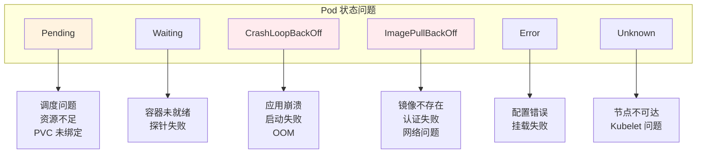
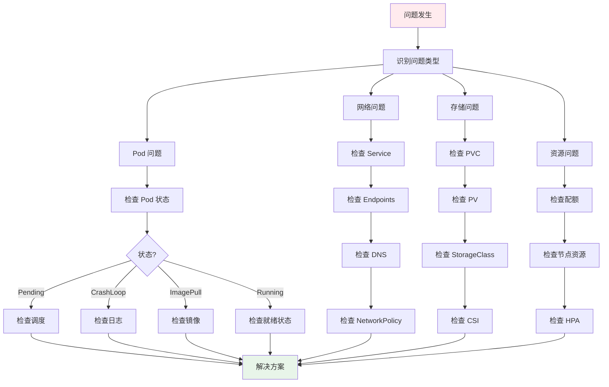

## 概述

Kubernetes 环境中的问题排查是运维工作的重要组成部分。本文系统性地介绍常见问题的诊断方法和解决方案，包括 Pod 问题、网络问题、存储问题、资源问题等，帮助读者快速定位和解决生产环境中的各类故障。

## Pod 问题排查

### 常见 Pod 状态问题



### Pending 状态排查

```bash
#!/bin/bash
# diagnose-pending-pod.sh

POD_NAME="$1"
NAMESPACE="${2:-default}"

echo "=== Diagnosing Pending Pod: $POD_NAME ==="
echo ""

# 1. 获取 Pod 事件
echo "--- Pod Events ---"
kubectl describe pod $POD_NAME -n $NAMESPACE | grep -A 20 "Events:"
echo ""

# 2. 检查 Pod 调度状态
echo "--- Scheduling Status ---"
kubectl get pod $POD_NAME -n $NAMESPACE -o jsonpath='{.status.conditions[?(@.type=="PodScheduled")]}' | jq .
echo ""

# 3. 检查资源请求
echo "--- Resource Requests ---"
kubectl get pod $POD_NAME -n $NAMESPACE -o jsonpath='{.spec.containers[*].resources}' | jq .
echo ""

# 4. 检查节点资源
echo "--- Node Resources ---"
kubectl top nodes
echo ""

# 5. 检查节点选择器和亲和性
echo "--- Node Selector and Affinity ---"
kubectl get pod $POD_NAME -n $NAMESPACE -o jsonpath='{.spec.nodeSelector}' | jq .
kubectl get pod $POD_NAME -n $NAMESPACE -o jsonpath='{.spec.affinity}' | jq .
echo ""

# 6. 检查 PVC 状态
echo "--- PVC Status ---"
kubectl get pod $POD_NAME -n $NAMESPACE -o jsonpath='{.spec.volumes[*].persistentVolumeClaim.claimName}' | tr ' ' '\n' | while read pvc; do
    if [ -n "$pvc" ]; then
        echo "PVC: $pvc"
        kubectl get pvc $pvc -n $NAMESPACE
    fi
done
echo ""

# 7. 检查污点和容忍
echo "--- Taints and Tolerations ---"
echo "Node Taints:"
kubectl get nodes -o custom-columns=NAME:.metadata.name,TAINTS:.spec.taints
echo ""
echo "Pod Tolerations:"
kubectl get pod $POD_NAME -n $NAMESPACE -o jsonpath='{.spec.tolerations}' | jq .
```

### CrashLoopBackOff 排查

```bash
#!/bin/bash
# diagnose-crashloop.sh

POD_NAME="$1"
NAMESPACE="${2:-default}"
CONTAINER="${3:-}"

echo "=== Diagnosing CrashLoopBackOff: $POD_NAME ==="
echo ""

# 1. 获取 Pod 状态
echo "--- Pod Status ---"
kubectl get pod $POD_NAME -n $NAMESPACE -o wide
echo ""

# 2. 获取容器状态详情
echo "--- Container Status ---"
kubectl get pod $POD_NAME -n $NAMESPACE -o jsonpath='{.status.containerStatuses}' | jq .
echo ""

# 3. 获取退出码和原因
echo "--- Exit Code and Reason ---"
if [ -n "$CONTAINER" ]; then
    EXIT_CODE=$(kubectl get pod $POD_NAME -n $NAMESPACE -o jsonpath="{.status.containerStatuses[?(@.name==\"$CONTAINER\")].lastState.terminated.exitCode}")
    REASON=$(kubectl get pod $POD_NAME -n $NAMESPACE -o jsonpath="{.status.containerStatuses[?(@.name==\"$CONTAINER\")].lastState.terminated.reason}")
else
    EXIT_CODE=$(kubectl get pod $POD_NAME -n $NAMESPACE -o jsonpath='{.status.containerStatuses[0].lastState.terminated.exitCode}')
    REASON=$(kubectl get pod $POD_NAME -n $NAMESPACE -o jsonpath='{.status.containerStatuses[0].lastState.terminated.reason}')
fi
echo "Exit Code: $EXIT_CODE"
echo "Reason: $REASON"

# 解释常见退出码
case $EXIT_CODE in
    0)   echo "正常退出" ;;
    1)   echo "应用错误" ;;
    137) echo "SIGKILL (OOM 或强制终止)" ;;
    139) echo "SIGSEGV (段错误)" ;;
    143) echo "SIGTERM (优雅终止)" ;;
esac
echo ""

# 4. 获取当前日志
echo "--- Current Logs ---"
if [ -n "$CONTAINER" ]; then
    kubectl logs $POD_NAME -n $NAMESPACE -c $CONTAINER --tail=50
else
    kubectl logs $POD_NAME -n $NAMESPACE --tail=50
fi
echo ""

# 5. 获取上一次崩溃的日志
echo "--- Previous Crash Logs ---"
if [ -n "$CONTAINER" ]; then
    kubectl logs $POD_NAME -n $NAMESPACE -c $CONTAINER --previous --tail=50 2>/dev/null || echo "No previous logs available"
else
    kubectl logs $POD_NAME -n $NAMESPACE --previous --tail=50 2>/dev/null || echo "No previous logs available"
fi
echo ""

# 6. 检查资源限制
echo "--- Resource Limits ---"
kubectl get pod $POD_NAME -n $NAMESPACE -o jsonpath='{.spec.containers[*].resources}' | jq .
echo ""

# 7. 检查 Pod 事件
echo "--- Pod Events ---"
kubectl describe pod $POD_NAME -n $NAMESPACE | grep -A 30 "Events:"
```

### ImagePullBackOff 排查

```bash
#!/bin/bash
# diagnose-imagepull.sh

POD_NAME="$1"
NAMESPACE="${2:-default}"

echo "=== Diagnosing ImagePullBackOff: $POD_NAME ==="
echo ""

# 1. 获取镜像信息
echo "--- Image Information ---"
kubectl get pod $POD_NAME -n $NAMESPACE -o jsonpath='{range .spec.containers[*]}{.name}: {.image}{"\n"}{end}'
echo ""

# 2. 获取拉取错误详情
echo "--- Pull Error Details ---"
kubectl describe pod $POD_NAME -n $NAMESPACE | grep -A 5 "Warning.*Failed.*pull"
echo ""

# 3. 检查 imagePullSecrets
echo "--- Image Pull Secrets ---"
SECRETS=$(kubectl get pod $POD_NAME -n $NAMESPACE -o jsonpath='{.spec.imagePullSecrets[*].name}')
if [ -z "$SECRETS" ]; then
    echo "No imagePullSecrets configured"
else
    for secret in $SECRETS; do
        echo "Secret: $secret"
        kubectl get secret $secret -n $NAMESPACE -o jsonpath='{.data.\.dockerconfigjson}' | base64 -d | jq '.auths | keys'
    done
fi
echo ""

# 4. 测试镜像拉取
echo "--- Testing Image Pull ---"
IMAGE=$(kubectl get pod $POD_NAME -n $NAMESPACE -o jsonpath='{.spec.containers[0].image}')
echo "Testing pull for: $IMAGE"

# 在节点上测试（需要 SSH 权限）
# kubectl debug node/<node-name> -it --image=busybox -- crictl pull $IMAGE
```

### OOMKilled 排查

```bash
#!/bin/bash
# diagnose-oom.sh

POD_NAME="$1"
NAMESPACE="${2:-default}"

echo "=== Diagnosing OOMKilled: $POD_NAME ==="
echo ""

# 1. 确认 OOM 状态
echo "--- Confirming OOM ---"
kubectl get pod $POD_NAME -n $NAMESPACE -o jsonpath='{.status.containerStatuses[*].lastState.terminated}' | jq .
echo ""

# 2. 获取资源配置
echo "--- Resource Configuration ---"
kubectl get pod $POD_NAME -n $NAMESPACE -o yaml | grep -A 10 "resources:"
echo ""

# 3. 获取历史内存使用
echo "--- Memory Usage History (if available) ---"
kubectl top pod $POD_NAME -n $NAMESPACE --containers 2>/dev/null || echo "Metrics not available"
echo ""

# 4. 检查节点内存压力
NODE=$(kubectl get pod $POD_NAME -n $NAMESPACE -o jsonpath='{.spec.nodeName}')
echo "--- Node Memory Status: $NODE ---"
kubectl describe node $NODE | grep -A 5 "Conditions:" | grep -E "(Memory|Ready)"
echo ""

# 5. 建议
echo "--- Recommendations ---"
echo "1. 增加内存限制"
echo "2. 检查应用内存泄漏"
echo "3. 优化应用内存使用"
echo "4. 配置 JVM/GC 参数（如果是 Java 应用）"
```

## 网络问题排查

### 服务连接问题

```bash
#!/bin/bash
# diagnose-service-connectivity.sh

SERVICE_NAME="$1"
NAMESPACE="${2:-default}"

echo "=== Diagnosing Service Connectivity: $SERVICE_NAME ==="
echo ""

# 1. 检查 Service 是否存在
echo "--- Service Information ---"
kubectl get svc $SERVICE_NAME -n $NAMESPACE -o wide
echo ""

# 2. 检查 Endpoints
echo "--- Endpoints ---"
kubectl get endpoints $SERVICE_NAME -n $NAMESPACE
echo ""

# 3. 检查 EndpointSlice
echo "--- EndpointSlice ---"
kubectl get endpointslice -n $NAMESPACE -l kubernetes.io/service-name=$SERVICE_NAME
echo ""

# 4. 检查后端 Pod 状态
echo "--- Backend Pods ---"
SELECTOR=$(kubectl get svc $SERVICE_NAME -n $NAMESPACE -o jsonpath='{.spec.selector}' | jq -r 'to_entries | map("\(.key)=\(.value)") | join(",")')
kubectl get pods -n $NAMESPACE -l $SELECTOR -o wide
echo ""

# 5. 测试 DNS 解析
echo "--- DNS Resolution ---"
kubectl run -i --rm --restart=Never dns-test --image=busybox:1.28 -- nslookup $SERVICE_NAME.$NAMESPACE.svc.cluster.local
echo ""

# 6. 测试连接
echo "--- Connection Test ---"
PORT=$(kubectl get svc $SERVICE_NAME -n $NAMESPACE -o jsonpath='{.spec.ports[0].port}')
kubectl run -i --rm --restart=Never conn-test --image=busybox:1.28 -- wget -qO- --timeout=5 http://$SERVICE_NAME.$NAMESPACE.svc.cluster.local:$PORT/health 2>&1 || echo "Connection failed"
```

### DNS 问题排查

```bash
#!/bin/bash
# diagnose-dns.sh

echo "=== Diagnosing DNS Issues ==="
echo ""

# 1. 检查 CoreDNS 状态
echo "--- CoreDNS Status ---"
kubectl get pods -n kube-system -l k8s-app=kube-dns
echo ""

# 2. 检查 CoreDNS 日志
echo "--- CoreDNS Logs ---"
kubectl logs -n kube-system -l k8s-app=kube-dns --tail=20
echo ""

# 3. 检查 DNS 配置
echo "--- DNS ConfigMap ---"
kubectl get configmap coredns -n kube-system -o yaml
echo ""

# 4. 测试 DNS 解析
echo "--- DNS Resolution Tests ---"
kubectl run -i --rm --restart=Never dns-test --image=busybox:1.28 -- sh -c '
echo "Testing internal DNS..."
nslookup kubernetes.default.svc.cluster.local

echo ""
echo "Testing external DNS..."
nslookup google.com
'
echo ""

# 5. 检查 resolv.conf
echo "--- Pod resolv.conf ---"
kubectl run -i --rm --restart=Never dns-test --image=busybox:1.28 -- cat /etc/resolv.conf
```

### NetworkPolicy 排查

```bash
#!/bin/bash
# diagnose-network-policy.sh

POD_NAME="$1"
NAMESPACE="${2:-default}"

echo "=== Diagnosing NetworkPolicy for: $POD_NAME ==="
echo ""

# 1. 获取 Pod 标签
echo "--- Pod Labels ---"
kubectl get pod $POD_NAME -n $NAMESPACE -o jsonpath='{.metadata.labels}' | jq .
echo ""

# 2. 列出命名空间中的 NetworkPolicy
echo "--- NetworkPolicies in Namespace ---"
kubectl get networkpolicy -n $NAMESPACE
echo ""

# 3. 检查影响该 Pod 的 NetworkPolicy
echo "--- NetworkPolicies Affecting Pod ---"
POD_LABELS=$(kubectl get pod $POD_NAME -n $NAMESPACE -o jsonpath='{.metadata.labels}')
for np in $(kubectl get networkpolicy -n $NAMESPACE -o name); do
    SELECTOR=$(kubectl get $np -n $NAMESPACE -o jsonpath='{.spec.podSelector.matchLabels}')
    echo "NetworkPolicy: $np"
    echo "  Selector: $SELECTOR"
    kubectl get $np -n $NAMESPACE -o yaml | grep -A 20 "spec:"
    echo ""
done

# 4. 测试连接
echo "--- Connection Tests ---"
TARGET_IP=$(kubectl get pod $POD_NAME -n $NAMESPACE -o jsonpath='{.status.podIP}')
kubectl run -i --rm --restart=Never test-conn --image=busybox:1.28 -- sh -c "
echo 'Testing TCP connection...'
nc -zv $TARGET_IP 8080 2>&1 || echo 'Connection failed'
"
```

## 存储问题排查

### PVC 问题排查

```bash
#!/bin/bash
# diagnose-pvc.sh

PVC_NAME="$1"
NAMESPACE="${2:-default}"

echo "=== Diagnosing PVC: $PVC_NAME ==="
echo ""

# 1. 获取 PVC 状态
echo "--- PVC Status ---"
kubectl get pvc $PVC_NAME -n $NAMESPACE -o wide
echo ""

# 2. 获取 PVC 详情
echo "--- PVC Details ---"
kubectl describe pvc $PVC_NAME -n $NAMESPACE
echo ""

# 3. 检查关联的 PV
echo "--- Associated PV ---"
PV_NAME=$(kubectl get pvc $PVC_NAME -n $NAMESPACE -o jsonpath='{.spec.volumeName}')
if [ -n "$PV_NAME" ]; then
    kubectl get pv $PV_NAME
    echo ""
    kubectl describe pv $PV_NAME
fi
echo ""

# 4. 检查 StorageClass
echo "--- StorageClass ---"
SC_NAME=$(kubectl get pvc $PVC_NAME -n $NAMESPACE -o jsonpath='{.spec.storageClassName}')
kubectl get storageclass $SC_NAME -o yaml
echo ""

# 5. 检查 CSI 驱动
echo "--- CSI Driver Status ---"
kubectl get csidrivers
echo ""

# 6. 检查 VolumeAttachment
echo "--- VolumeAttachments ---"
kubectl get volumeattachment | grep $PV_NAME
```

### 挂载问题排查

```bash
#!/bin/bash
# diagnose-mount.sh

POD_NAME="$1"
NAMESPACE="${2:-default}"

echo "=== Diagnosing Mount Issues: $POD_NAME ==="
echo ""

# 1. 检查 Pod 卷配置
echo "--- Volume Configuration ---"
kubectl get pod $POD_NAME -n $NAMESPACE -o jsonpath='{.spec.volumes}' | jq .
echo ""

# 2. 检查卷挂载点
echo "--- Volume Mounts ---"
kubectl get pod $POD_NAME -n $NAMESPACE -o jsonpath='{.spec.containers[*].volumeMounts}' | jq .
echo ""

# 3. 检查 Pod 事件中的挂载错误
echo "--- Mount Events ---"
kubectl describe pod $POD_NAME -n $NAMESPACE | grep -i -A 2 "mount\|volume"
echo ""

# 4. 检查节点上的挂载状态
NODE=$(kubectl get pod $POD_NAME -n $NAMESPACE -o jsonpath='{.spec.nodeName}')
echo "--- Node Mount Status ($NODE) ---"
# 需要节点访问权限
# ssh $NODE "mount | grep kubelet"
echo ""

# 5. 检查 CSI 节点插件日志
echo "--- CSI Node Plugin Logs ---"
kubectl logs -n kube-system -l app=ebs-csi-node --tail=20 2>/dev/null || echo "CSI logs not available"
```

## 资源问题排查

### 资源配额问题

```bash
#!/bin/bash
# diagnose-quota.sh

NAMESPACE="${1:-default}"

echo "=== Diagnosing Resource Quota: $NAMESPACE ==="
echo ""

# 1. 检查资源配额
echo "--- Resource Quotas ---"
kubectl get resourcequota -n $NAMESPACE
echo ""

# 2. 检查配额使用情况
echo "--- Quota Usage ---"
kubectl describe resourcequota -n $NAMESPACE
echo ""

# 3. 检查 LimitRange
echo "--- Limit Ranges ---"
kubectl get limitrange -n $NAMESPACE
kubectl describe limitrange -n $NAMESPACE
echo ""

# 4. 当前资源使用
echo "--- Current Resource Usage ---"
kubectl top pods -n $NAMESPACE
echo ""

# 5. 资源请求汇总
echo "--- Resource Requests Summary ---"
kubectl get pods -n $NAMESPACE -o json | jq '
  [.items[].spec.containers[].resources.requests // {}] |
  {
    cpu: (map(.cpu // "0") | add),
    memory: (map(.memory // "0") | add)
  }
'
```

### 节点资源问题

```bash
#!/bin/bash
# diagnose-node-resources.sh

NODE_NAME="$1"

echo "=== Diagnosing Node Resources: $NODE_NAME ==="
echo ""

# 1. 节点状态
echo "--- Node Status ---"
kubectl get node $NODE_NAME
echo ""

# 2. 节点条件
echo "--- Node Conditions ---"
kubectl get node $NODE_NAME -o jsonpath='{.status.conditions}' | jq '.[] | {type, status, message}'
echo ""

# 3. 节点资源容量和可分配量
echo "--- Resource Capacity ---"
kubectl get node $NODE_NAME -o jsonpath='{.status.capacity}' | jq .
echo ""
echo "--- Allocatable Resources ---"
kubectl get node $NODE_NAME -o jsonpath='{.status.allocatable}' | jq .
echo ""

# 4. 当前资源使用
echo "--- Current Usage ---"
kubectl top node $NODE_NAME
echo ""

# 5. 节点上的 Pod
echo "--- Pods on Node ---"
kubectl get pods --all-namespaces --field-selector spec.nodeName=$NODE_NAME -o wide
echo ""

# 6. 资源分配详情
echo "--- Resource Allocation ---"
kubectl describe node $NODE_NAME | grep -A 20 "Allocated resources:"
```

## 调试工具

### kubectl debug

```bash
# 调试运行中的 Pod
kubectl debug -it <pod-name> --image=busybox --target=<container-name>

# 调试崩溃的 Pod（创建副本）
kubectl debug <pod-name> -it --copy-to=debug-pod --container=debug -- sh

# 调试节点
kubectl debug node/<node-name> -it --image=ubuntu
```

### 临时容器

```yaml
# ephemeral-container-debug.yaml
apiVersion: v1
kind: Pod
metadata:
  name: app-pod
spec:
  containers:
    - name: app
      image: myapp:v1.0
  # 临时容器通过 kubectl debug 添加
  # 或者通过 API 添加
  ephemeralContainers:
    - name: debugger
      image: busybox
      command: ["sh"]
      stdin: true
      tty: true
      targetContainerName: app  # 共享进程命名空间
```

### 网络诊断 Pod

```yaml
# network-debug-pod.yaml
apiVersion: v1
kind: Pod
metadata:
  name: network-debug
  namespace: default
spec:
  containers:
    - name: debug
      image: nicolaka/netshoot:latest
      command: ["sleep", "infinity"]
      securityContext:
        capabilities:
          add:
            - NET_ADMIN
            - SYS_PTRACE
  hostNetwork: false
  dnsPolicy: ClusterFirst
```

使用网络诊断 Pod：

```bash
# 创建诊断 Pod
kubectl apply -f network-debug-pod.yaml

# 进入诊断 Pod
kubectl exec -it network-debug -- bash

# 常用诊断命令
# DNS 测试
nslookup kubernetes.default.svc.cluster.local

# 连接测试
curl -v http://service-name.namespace.svc.cluster.local:port

# 网络路径追踪
traceroute <ip>

# 抓包
tcpdump -i eth0 -n port 8080

# 查看网络连接
ss -tulpn

# 测试 TCP 连接
nc -zv <host> <port>
```

## 排查流程图

### 通用排查流程



## 常见问题速查表

| 问题 | 症状 | 可能原因 | 解决方法 |
|------|------|----------|----------|
| Pod Pending | 长时间 Pending | 资源不足、调度失败 | 检查节点资源、调度约束 |
| CrashLoopBackOff | 容器反复重启 | 应用错误、配置问题 | 检查日志、配置 |
| ImagePullBackOff | 镜像拉取失败 | 镜像不存在、认证失败 | 检查镜像名、凭证 |
| OOMKilled | 容器被杀死 | 内存不足 | 增加内存限制 |
| Service 不通 | 无法访问服务 | Endpoints 为空、DNS 问题 | 检查 Endpoints、DNS |
| PVC Pending | 卷未绑定 | StorageClass 问题、配额 | 检查 SC、配额 |
| 节点 NotReady | 节点不可用 | Kubelet 问题、资源压力 | 检查 Kubelet、节点状态 |

## 总结

Kubernetes 问题排查的关键：

1. **系统化方法**：按照问题类型选择对应的排查流程
2. **善用工具**：kubectl describe、logs、debug 是基础工具
3. **事件分析**：Events 通常包含关键的错误信息
4. **日志追踪**：应用日志和组件日志是问题定位的关键
5. **网络诊断**：使用专门的诊断 Pod 进行网络测试
6. **资源监控**：实时监控资源使用，及时发现瓶颈

建立完善的监控告警体系，可以在问题发生前预警，大大减少故障排查时间。
