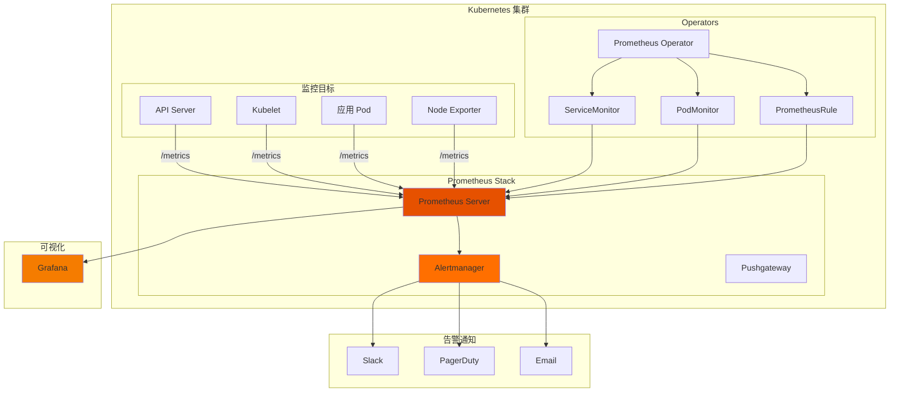

## 概述

Prometheus 是 Kubernetes 生态系统中最流行的监控解决方案。本文深入解析 Prometheus 与 Kubernetes 的集成方式、指标收集机制、告警配置以及 Grafana 可视化，帮助读者构建完善的 Kubernetes 监控体系。

## Prometheus 架构

### 整体架构



### Prometheus Operator 安装

```yaml
# prometheus-operator-values.yaml
# helm install prometheus prometheus-community/kube-prometheus-stack -f values.yaml

prometheus:
  prometheusSpec:
    # 资源配置
    resources:
      requests:
        cpu: 500m
        memory: 2Gi
      limits:
        cpu: 2
        memory: 8Gi

    # 存储配置
    storageSpec:
      volumeClaimTemplate:
        spec:
          storageClassName: fast-ssd
          accessModes: ["ReadWriteOnce"]
          resources:
            requests:
              storage: 100Gi

    # 数据保留
    retention: 30d
    retentionSize: 90GB

    # 副本和高可用
    replicas: 2
    podAntiAffinity: hard

    # 外部标签
    externalLabels:
      cluster: production
      environment: prod

    # 远程写入
    remoteWrite:
      - url: http://thanos-receive:19291/api/v1/receive

    # ServiceMonitor 选择器
    serviceMonitorSelector: {}
    serviceMonitorNamespaceSelector: {}

    # PodMonitor 选择器
    podMonitorSelector: {}
    podMonitorNamespaceSelector: {}

alertmanager:
  alertmanagerSpec:
    replicas: 3
    resources:
      requests:
        cpu: 100m
        memory: 256Mi

    storage:
      volumeClaimTemplate:
        spec:
          storageClassName: standard
          accessModes: ["ReadWriteOnce"]
          resources:
            requests:
              storage: 10Gi

grafana:
  enabled: true
  adminPassword: admin
  persistence:
    enabled: true
    size: 10Gi

  dashboardProviders:
    dashboardproviders.yaml:
      apiVersion: 1
      providers:
        - name: 'default'
          orgId: 1
          folder: ''
          type: file
          disableDeletion: false
          editable: true
          options:
            path: /var/lib/grafana/dashboards

nodeExporter:
  enabled: true

kubeStateMetrics:
  enabled: true
```

## 服务发现与指标收集

### ServiceMonitor

```yaml
# servicemonitor.yaml
apiVersion: monitoring.coreos.com/v1
kind: ServiceMonitor
metadata:
  name: web-app
  namespace: monitoring
  labels:
    release: prometheus
spec:
  # 选择要监控的 Service
  selector:
    matchLabels:
      app: web-app

  # 命名空间选择器
  namespaceSelector:
    matchNames:
      - production
      - staging

  # 端点配置
  endpoints:
    - port: http-metrics  # Service 端口名称
      path: /metrics
      interval: 30s
      scrapeTimeout: 10s

      # 重标签配置
      relabelings:
        - sourceLabels: [__meta_kubernetes_pod_node_name]
          targetLabel: node
        - sourceLabels: [__meta_kubernetes_namespace]
          targetLabel: namespace
        - sourceLabels: [__meta_kubernetes_pod_name]
          targetLabel: pod

      # 指标重标签
      metricRelabelings:
        # 删除不需要的指标
        - sourceLabels: [__name__]
          regex: 'go_.*'
          action: drop
        # 添加标签
        - targetLabel: environment
          replacement: production

      # TLS 配置
      scheme: https
      tlsConfig:
        insecureSkipVerify: false
        caFile: /etc/prometheus/secrets/ca.crt
        certFile: /etc/prometheus/secrets/tls.crt
        keyFile: /etc/prometheus/secrets/tls.key

      # Bearer Token 认证
      bearerTokenFile: /var/run/secrets/kubernetes.io/serviceaccount/token

  # 目标标签
  targetLabels:
    - app
    - version
```

### PodMonitor

```yaml
# podmonitor.yaml
apiVersion: monitoring.coreos.com/v1
kind: PodMonitor
metadata:
  name: app-pods
  namespace: monitoring
spec:
  # 选择要监控的 Pod
  selector:
    matchLabels:
      monitoring: enabled

  # 命名空间选择器
  namespaceSelector:
    any: true

  # Pod 指标端点
  podMetricsEndpoints:
    - port: metrics
      path: /metrics
      interval: 15s

      # 过滤条件
      filterRunning: true

      relabelings:
        - sourceLabels: [__meta_kubernetes_pod_label_app]
          targetLabel: app
        - sourceLabels: [__meta_kubernetes_pod_label_version]
          targetLabel: version
```

### 自定义指标暴露

```go
// metrics.go
package main

import (
    "net/http"
    "time"

    "github.com/prometheus/client_golang/prometheus"
    "github.com/prometheus/client_golang/prometheus/promauto"
    "github.com/prometheus/client_golang/prometheus/promhttp"
)

var (
    // Counter - 计数器
    httpRequestsTotal = promauto.NewCounterVec(
        prometheus.CounterOpts{
            Name: "http_requests_total",
            Help: "Total number of HTTP requests",
        },
        []string{"method", "path", "status"},
    )

    // Histogram - 直方图
    httpRequestDuration = promauto.NewHistogramVec(
        prometheus.HistogramOpts{
            Name:    "http_request_duration_seconds",
            Help:    "HTTP request duration in seconds",
            Buckets: prometheus.ExponentialBuckets(0.001, 2, 15),
        },
        []string{"method", "path"},
    )

    // Gauge - 仪表盘
    activeConnections = promauto.NewGauge(
        prometheus.GaugeOpts{
            Name: "active_connections",
            Help: "Number of active connections",
        },
    )

    // Summary - 摘要
    requestSize = promauto.NewSummaryVec(
        prometheus.SummaryOpts{
            Name:       "http_request_size_bytes",
            Help:       "HTTP request size in bytes",
            Objectives: map[float64]float64{0.5: 0.05, 0.9: 0.01, 0.99: 0.001},
        },
        []string{"method"},
    )
)

// HTTP 中间件
func metricsMiddleware(next http.Handler) http.Handler {
    return http.HandlerFunc(func(w http.ResponseWriter, r *http.Request) {
        start := time.Now()

        // 记录活跃连接
        activeConnections.Inc()
        defer activeConnections.Dec()

        // 包装 ResponseWriter
        sw := &statusWriter{ResponseWriter: w, status: http.StatusOK}

        next.ServeHTTP(sw, r)

        duration := time.Since(start).Seconds()

        // 记录指标
        httpRequestsTotal.WithLabelValues(r.Method, r.URL.Path, http.StatusText(sw.status)).Inc()
        httpRequestDuration.WithLabelValues(r.Method, r.URL.Path).Observe(duration)
        requestSize.WithLabelValues(r.Method).Observe(float64(r.ContentLength))
    })
}

type statusWriter struct {
    http.ResponseWriter
    status int
}

func (w *statusWriter) WriteHeader(status int) {
    w.status = status
    w.ResponseWriter.WriteHeader(status)
}

func main() {
    mux := http.NewServeMux()

    // 应用路由
    mux.HandleFunc("/api/", handleAPI)

    // 指标端点
    mux.Handle("/metrics", promhttp.Handler())

    // 应用中间件
    handler := metricsMiddleware(mux)

    http.ListenAndServe(":8080", handler)
}
```

## 告警规则

### PrometheusRule

```yaml
# prometheusrule.yaml
apiVersion: monitoring.coreos.com/v1
kind: PrometheusRule
metadata:
  name: kubernetes-alerts
  namespace: monitoring
  labels:
    release: prometheus
spec:
  groups:
    # Pod 相关告警
    - name: pod.rules
      rules:
        - alert: PodCrashLooping
          expr: |
            increase(kube_pod_container_status_restarts_total[1h]) > 5
          for: 10m
          labels:
            severity: warning
          annotations:
            summary: "Pod {{ $labels.namespace }}/{{ $labels.pod }} is crash looping"
            description: "Pod {{ $labels.pod }} in namespace {{ $labels.namespace }} has restarted {{ $value }} times in the last hour"
            runbook_url: "https://wiki.example.com/runbooks/pod-crash-looping"

        - alert: PodNotReady
          expr: |
            kube_pod_status_ready{condition="true"} == 0
          for: 15m
          labels:
            severity: warning
          annotations:
            summary: "Pod {{ $labels.namespace }}/{{ $labels.pod }} is not ready"
            description: "Pod {{ $labels.pod }} in namespace {{ $labels.namespace }} has been not ready for more than 15 minutes"

        - alert: PodOOMKilled
          expr: |
            kube_pod_container_status_last_terminated_reason{reason="OOMKilled"} == 1
          for: 0m
          labels:
            severity: critical
          annotations:
            summary: "Pod {{ $labels.namespace }}/{{ $labels.pod }} was OOM killed"
            description: "Container {{ $labels.container }} in pod {{ $labels.pod }} was killed due to OOM"

    # 节点相关告警
    - name: node.rules
      rules:
        - alert: NodeNotReady
          expr: |
            kube_node_status_condition{condition="Ready",status="true"} == 0
          for: 5m
          labels:
            severity: critical
          annotations:
            summary: "Node {{ $labels.node }} is not ready"
            description: "Node {{ $labels.node }} has been not ready for more than 5 minutes"

        - alert: NodeMemoryPressure
          expr: |
            kube_node_status_condition{condition="MemoryPressure",status="true"} == 1
          for: 5m
          labels:
            severity: warning
          annotations:
            summary: "Node {{ $labels.node }} has memory pressure"

        - alert: NodeDiskPressure
          expr: |
            kube_node_status_condition{condition="DiskPressure",status="true"} == 1
          for: 5m
          labels:
            severity: warning
          annotations:
            summary: "Node {{ $labels.node }} has disk pressure"

        - alert: NodeHighCPU
          expr: |
            100 - (avg by(instance) (rate(node_cpu_seconds_total{mode="idle"}[5m])) * 100) > 80
          for: 10m
          labels:
            severity: warning
          annotations:
            summary: "Node {{ $labels.instance }} CPU usage is high"
            description: "CPU usage is {{ $value }}%"

        - alert: NodeHighMemory
          expr: |
            (1 - node_memory_MemAvailable_bytes / node_memory_MemTotal_bytes) * 100 > 90
          for: 10m
          labels:
            severity: warning
          annotations:
            summary: "Node {{ $labels.instance }} memory usage is high"
            description: "Memory usage is {{ $value }}%"

    # 应用相关告警
    - name: application.rules
      rules:
        - alert: HighErrorRate
          expr: |
            sum(rate(http_requests_total{status=~"5.."}[5m])) by (service)
            /
            sum(rate(http_requests_total[5m])) by (service)
            > 0.05
          for: 5m
          labels:
            severity: critical
          annotations:
            summary: "High error rate for service {{ $labels.service }}"
            description: "Error rate is {{ $value | humanizePercentage }}"

        - alert: HighLatency
          expr: |
            histogram_quantile(0.99, sum(rate(http_request_duration_seconds_bucket[5m])) by (le, service))
            > 1
          for: 5m
          labels:
            severity: warning
          annotations:
            summary: "High latency for service {{ $labels.service }}"
            description: "P99 latency is {{ $value }}s"

        - alert: ServiceDown
          expr: |
            up{job=~".*"} == 0
          for: 2m
          labels:
            severity: critical
          annotations:
            summary: "Service {{ $labels.job }} is down"
            description: "Service {{ $labels.job }} has been down for more than 2 minutes"
```

### Alertmanager 配置

```yaml
# alertmanager-config.yaml
apiVersion: v1
kind: Secret
metadata:
  name: alertmanager-main
  namespace: monitoring
stringData:
  alertmanager.yaml: |
    global:
      resolve_timeout: 5m
      slack_api_url: 'https://hooks.slack.com/services/xxx'
      pagerduty_url: 'https://events.pagerduty.com/v2/enqueue'

    # 路由配置
    route:
      group_by: ['alertname', 'namespace', 'severity']
      group_wait: 30s
      group_interval: 5m
      repeat_interval: 4h
      receiver: 'default-receiver'

      routes:
        # Critical 告警走 PagerDuty
        - match:
            severity: critical
          receiver: 'pagerduty-critical'
          continue: true

        # Warning 告警走 Slack
        - match:
            severity: warning
          receiver: 'slack-warning'

        # 特定命名空间走专门通道
        - match:
            namespace: production
          receiver: 'production-team'

    # 告警抑制
    inhibit_rules:
      # 如果有 critical 告警，抑制同 alertname 的 warning
      - source_match:
          severity: 'critical'
        target_match:
          severity: 'warning'
        equal: ['alertname', 'namespace']

      # 节点宕机时抑制该节点上的 Pod 告警
      - source_match:
          alertname: 'NodeNotReady'
        target_match_re:
          alertname: 'Pod.*'
        equal: ['node']

    # 接收器配置
    receivers:
      - name: 'default-receiver'
        slack_configs:
          - channel: '#alerts-default'
            send_resolved: true
            title: '{{ template "slack.title" . }}'
            text: '{{ template "slack.text" . }}'

      - name: 'slack-warning'
        slack_configs:
          - channel: '#alerts-warning'
            send_resolved: true
            color: '{{ if eq .Status "firing" }}warning{{ else }}good{{ end }}'
            title: '[{{ .Status | toUpper }}] {{ .CommonLabels.alertname }}'
            text: |
              *Summary:* {{ .CommonAnnotations.summary }}
              *Description:* {{ .CommonAnnotations.description }}
              *Severity:* {{ .CommonLabels.severity }}

      - name: 'pagerduty-critical'
        pagerduty_configs:
          - service_key: '<pagerduty-service-key>'
            severity: critical
            description: '{{ .CommonAnnotations.summary }}'
            details:
              alertname: '{{ .CommonLabels.alertname }}'
              namespace: '{{ .CommonLabels.namespace }}'
              description: '{{ .CommonAnnotations.description }}'

      - name: 'production-team'
        slack_configs:
          - channel: '#production-alerts'
            send_resolved: true
        email_configs:
          - to: 'production-team@example.com'
            send_resolved: true

    # 告警模板
    templates:
      - '/etc/alertmanager/templates/*.tmpl'
```

## Grafana 可视化

### Dashboard 配置

```yaml
# grafana-dashboard-configmap.yaml
apiVersion: v1
kind: ConfigMap
metadata:
  name: kubernetes-overview-dashboard
  namespace: monitoring
  labels:
    grafana_dashboard: "1"
data:
  kubernetes-overview.json: |
    {
      "title": "Kubernetes Overview",
      "uid": "k8s-overview",
      "tags": ["kubernetes"],
      "timezone": "browser",
      "refresh": "30s",
      "panels": [
        {
          "title": "Cluster CPU Usage",
          "type": "gauge",
          "gridPos": {"h": 8, "w": 6, "x": 0, "y": 0},
          "targets": [
            {
              "expr": "sum(rate(container_cpu_usage_seconds_total{container!=\"\"}[5m])) / sum(kube_node_status_allocatable{resource=\"cpu\"}) * 100",
              "legendFormat": "CPU Usage"
            }
          ],
          "fieldConfig": {
            "defaults": {
              "unit": "percent",
              "min": 0,
              "max": 100,
              "thresholds": {
                "steps": [
                  {"value": 0, "color": "green"},
                  {"value": 70, "color": "yellow"},
                  {"value": 85, "color": "red"}
                ]
              }
            }
          }
        },
        {
          "title": "Cluster Memory Usage",
          "type": "gauge",
          "gridPos": {"h": 8, "w": 6, "x": 6, "y": 0},
          "targets": [
            {
              "expr": "sum(container_memory_working_set_bytes{container!=\"\"}) / sum(kube_node_status_allocatable{resource=\"memory\"}) * 100",
              "legendFormat": "Memory Usage"
            }
          ]
        },
        {
          "title": "Pod Status",
          "type": "piechart",
          "gridPos": {"h": 8, "w": 6, "x": 12, "y": 0},
          "targets": [
            {
              "expr": "sum by (phase) (kube_pod_status_phase)",
              "legendFormat": "{{ phase }}"
            }
          ]
        },
        {
          "title": "Node Status",
          "type": "stat",
          "gridPos": {"h": 8, "w": 6, "x": 18, "y": 0},
          "targets": [
            {
              "expr": "sum(kube_node_status_condition{condition=\"Ready\",status=\"true\"})",
              "legendFormat": "Ready"
            },
            {
              "expr": "sum(kube_node_status_condition{condition=\"Ready\",status=\"false\"})",
              "legendFormat": "Not Ready"
            }
          ]
        },
        {
          "title": "HTTP Request Rate",
          "type": "timeseries",
          "gridPos": {"h": 8, "w": 12, "x": 0, "y": 8},
          "targets": [
            {
              "expr": "sum(rate(http_requests_total[5m])) by (service)",
              "legendFormat": "{{ service }}"
            }
          ]
        },
        {
          "title": "HTTP Error Rate",
          "type": "timeseries",
          "gridPos": {"h": 8, "w": 12, "x": 12, "y": 8},
          "targets": [
            {
              "expr": "sum(rate(http_requests_total{status=~\"5..\"}[5m])) by (service) / sum(rate(http_requests_total[5m])) by (service) * 100",
              "legendFormat": "{{ service }}"
            }
          ],
          "fieldConfig": {
            "defaults": {
              "unit": "percent"
            }
          }
        }
      ]
    }
```

### 常用 PromQL 查询

```yaml
# 常用 PromQL 查询

# === 资源使用 ===

# CPU 使用率（按 Pod）
sum(rate(container_cpu_usage_seconds_total{container!=""}[5m])) by (namespace, pod)

# 内存使用（按 Pod）
sum(container_memory_working_set_bytes{container!=""}) by (namespace, pod)

# CPU 请求使用率
sum(rate(container_cpu_usage_seconds_total{container!=""}[5m])) by (namespace, pod)
/
sum(kube_pod_container_resource_requests{resource="cpu"}) by (namespace, pod)
* 100

# === 网络 ===

# 网络接收速率
sum(rate(container_network_receive_bytes_total[5m])) by (namespace, pod)

# 网络发送速率
sum(rate(container_network_transmit_bytes_total[5m])) by (namespace, pod)

# === 存储 ===

# PV 使用率
kubelet_volume_stats_used_bytes
/
kubelet_volume_stats_capacity_bytes
* 100

# === API Server ===

# API 请求延迟 P99
histogram_quantile(0.99, sum(rate(apiserver_request_duration_seconds_bucket[5m])) by (le, verb))

# API 请求错误率
sum(rate(apiserver_request_total{code=~"5.."}[5m])) / sum(rate(apiserver_request_total[5m])) * 100

# === etcd ===

# etcd Leader 变更
changes(etcd_server_leader_changes_seen_total[1h])

# etcd 磁盘同步延迟
histogram_quantile(0.99, rate(etcd_disk_wal_fsync_duration_seconds_bucket[5m]))

# === 调度器 ===

# 调度延迟 P99
histogram_quantile(0.99, sum(rate(scheduler_scheduling_algorithm_duration_seconds_bucket[5m])) by (le))

# 待调度 Pod 数量
scheduler_pending_pods
```

## 高可用配置

### Thanos 集成

```yaml
# thanos-sidecar.yaml
apiVersion: monitoring.coreos.com/v1
kind: Prometheus
metadata:
  name: prometheus
  namespace: monitoring
spec:
  replicas: 2

  # Thanos Sidecar
  thanos:
    image: quay.io/thanos/thanos:v0.32.0
    version: v0.32.0
    objectStorageConfig:
      key: thanos.yaml
      name: thanos-objstore-config

  # 外部标签用于区分副本
  externalLabels:
    cluster: production
    prometheus_replica: $(POD_NAME)

  # 保留策略（本地）
  retention: 24h
---
# Thanos 对象存储配置
apiVersion: v1
kind: Secret
metadata:
  name: thanos-objstore-config
  namespace: monitoring
stringData:
  thanos.yaml: |
    type: S3
    config:
      bucket: thanos-data
      endpoint: s3.amazonaws.com
      region: us-west-2
      access_key: ${AWS_ACCESS_KEY_ID}
      secret_key: ${AWS_SECRET_ACCESS_KEY}
---
# Thanos Query
apiVersion: apps/v1
kind: Deployment
metadata:
  name: thanos-query
  namespace: monitoring
spec:
  replicas: 2
  selector:
    matchLabels:
      app: thanos-query
  template:
    metadata:
      labels:
        app: thanos-query
    spec:
      containers:
        - name: thanos-query
          image: quay.io/thanos/thanos:v0.32.0
          args:
            - query
            - --log.level=info
            - --query.replica-label=prometheus_replica
            - --store=dnssrv+_grpc._tcp.thanos-sidecar.monitoring.svc.cluster.local
            - --store=dnssrv+_grpc._tcp.thanos-store.monitoring.svc.cluster.local
          ports:
            - name: http
              containerPort: 10902
            - name: grpc
              containerPort: 10901
```

## 总结

Prometheus 与 Kubernetes 的集成要点：

1. **服务发现**：使用 ServiceMonitor 和 PodMonitor 自动发现监控目标
2. **指标标准化**：遵循 Prometheus 命名规范，使用标准标签
3. **告警规则**：设计合理的告警阈值和分级
4. **高可用**：使用 Thanos 实现长期存储和跨集群查询
5. **可视化**：通过 Grafana 构建直观的监控仪表盘

完善的监控体系是保障 Kubernetes 集群稳定运行的基础。
