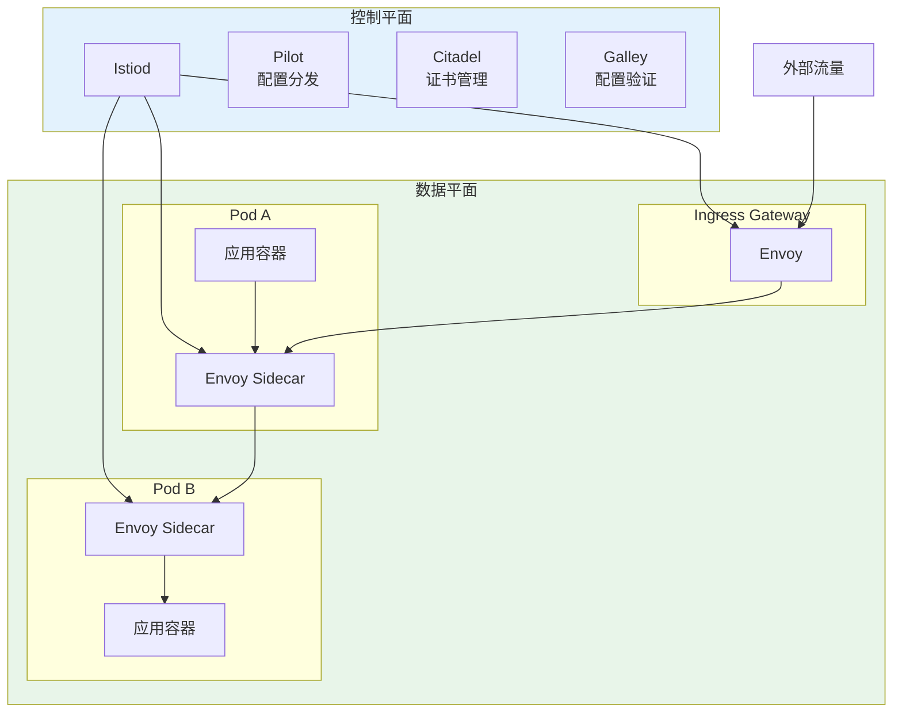

## 概述

Istio 是最流行的 Kubernetes 服务网格解决方案，提供流量管理、安全、可观测性等能力。本文深入解析 Istio 的架构原理、核心功能配置以及与 Kubernetes 的集成方式。

## Istio 架构

### 整体架构



### Istio 安装

```yaml
# istio-operator.yaml
apiVersion: install.istio.io/v1alpha1
kind: IstioOperator
metadata:
  name: istio
  namespace: istio-system
spec:
  profile: default

  # 组件配置
  components:
    pilot:
      enabled: true
      k8s:
        resources:
          requests:
            cpu: 500m
            memory: 2Gi
          limits:
            cpu: 2
            memory: 4Gi
        hpaSpec:
          minReplicas: 2
          maxReplicas: 5

    ingressGateways:
      - name: istio-ingressgateway
        enabled: true
        k8s:
          resources:
            requests:
              cpu: 500m
              memory: 512Mi
          hpaSpec:
            minReplicas: 2
            maxReplicas: 10
          service:
            type: LoadBalancer

    egressGateways:
      - name: istio-egressgateway
        enabled: true

  # 网格配置
  meshConfig:
    # 访问日志
    accessLogFile: /dev/stdout
    accessLogEncoding: JSON

    # 默认配置
    defaultConfig:
      # 追踪采样率
      tracing:
        sampling: 10.0
      # 协议检测超时
      protocolDetectionTimeout: 5s

    # 出站流量策略
    outboundTrafficPolicy:
      mode: REGISTRY_ONLY

    # 启用自动 mTLS
    enableAutoMtls: true

  # 全局配置
  values:
    global:
      # 代理配置
      proxy:
        resources:
          requests:
            cpu: 100m
            memory: 128Mi
          limits:
            cpu: 500m
            memory: 512Mi

      # 日志级别
      logging:
        level: "default:info"

    # Sidecar 注入
    sidecarInjectorWebhook:
      rewriteAppHTTPProbe: true
```

## 流量管理

### VirtualService

```yaml
# virtualservice.yaml
apiVersion: networking.istio.io/v1beta1
kind: VirtualService
metadata:
  name: reviews
  namespace: production
spec:
  hosts:
    - reviews
    - reviews.production.svc.cluster.local

  http:
    # 金丝雀路由
    - match:
        - headers:
            x-canary:
              exact: "true"
      route:
        - destination:
            host: reviews
            subset: v2

    # 基于权重的路由
    - route:
        - destination:
            host: reviews
            subset: v1
          weight: 90
        - destination:
            host: reviews
            subset: v2
          weight: 10

    # 超时和重试
    timeout: 10s
    retries:
      attempts: 3
      perTryTimeout: 3s
      retryOn: connect-failure,reset,retriable-4xx,503
---
# 高级路由配置
apiVersion: networking.istio.io/v1beta1
kind: VirtualService
metadata:
  name: api-routing
  namespace: production
spec:
  hosts:
    - api.example.com

  gateways:
    - api-gateway

  http:
    # URL 重写
    - match:
        - uri:
            prefix: /api/v1/users
      rewrite:
        uri: /users
      route:
        - destination:
            host: user-service
            port:
              number: 80

    # Header 操作
    - match:
        - uri:
            prefix: /api/v1/orders
      headers:
        request:
          add:
            x-request-id: "%REQ(x-request-id)%"
            x-forwarded-for: "%DOWNSTREAM_REMOTE_ADDRESS_WITHOUT_PORT%"
          remove:
            - x-internal-header
      route:
        - destination:
            host: order-service

    # 故障注入
    - match:
        - headers:
            x-fault-inject:
              exact: "true"
      fault:
        delay:
          percentage:
            value: 100
          fixedDelay: 5s
        abort:
          percentage:
            value: 10
          httpStatus: 503
      route:
        - destination:
            host: test-service

    # 镜像流量
    - match:
        - uri:
            prefix: /api/v1/products
      route:
        - destination:
            host: product-service-v1
      mirror:
        host: product-service-v2
      mirrorPercentage:
        value: 50
```

### DestinationRule

```yaml
# destinationrule.yaml
apiVersion: networking.istio.io/v1beta1
kind: DestinationRule
metadata:
  name: reviews
  namespace: production
spec:
  host: reviews

  # 流量策略
  trafficPolicy:
    # 连接池
    connectionPool:
      tcp:
        maxConnections: 100
        connectTimeout: 30s
      http:
        h2UpgradePolicy: UPGRADE
        http1MaxPendingRequests: 100
        http2MaxRequests: 1000
        maxRequestsPerConnection: 100
        maxRetries: 3

    # 负载均衡
    loadBalancer:
      simple: ROUND_ROBIN
      # 或使用一致性哈希
      # consistentHash:
      #   httpHeaderName: x-user-id
      # 或基于 Cookie
      # consistentHash:
      #   httpCookie:
      #     name: user_session
      #     ttl: 0s

    # 异常点检测（熔断）
    outlierDetection:
      consecutive5xxErrors: 5
      interval: 30s
      baseEjectionTime: 30s
      maxEjectionPercent: 50
      minHealthPercent: 30

    # TLS 配置
    tls:
      mode: ISTIO_MUTUAL

  # 子集定义
  subsets:
    - name: v1
      labels:
        version: v1
      trafficPolicy:
        loadBalancer:
          simple: LEAST_CONN

    - name: v2
      labels:
        version: v2
      trafficPolicy:
        connectionPool:
          http:
            http2MaxRequests: 500
```

### Gateway

```yaml
# gateway.yaml
apiVersion: networking.istio.io/v1beta1
kind: Gateway
metadata:
  name: api-gateway
  namespace: production
spec:
  selector:
    istio: ingressgateway

  servers:
    # HTTPS 入口
    - port:
        number: 443
        name: https
        protocol: HTTPS
      tls:
        mode: SIMPLE
        credentialName: api-tls-cert
      hosts:
        - api.example.com
        - "*.api.example.com"

    # HTTP 重定向到 HTTPS
    - port:
        number: 80
        name: http
        protocol: HTTP
      tls:
        httpsRedirect: true
      hosts:
        - api.example.com
---
# Egress Gateway
apiVersion: networking.istio.io/v1beta1
kind: Gateway
metadata:
  name: external-gateway
  namespace: istio-system
spec:
  selector:
    istio: egressgateway

  servers:
    - port:
        number: 443
        name: tls
        protocol: TLS
      hosts:
        - external-api.example.com
      tls:
        mode: PASSTHROUGH
---
# 外部服务访问
apiVersion: networking.istio.io/v1beta1
kind: ServiceEntry
metadata:
  name: external-api
  namespace: production
spec:
  hosts:
    - external-api.example.com
  location: MESH_EXTERNAL
  ports:
    - number: 443
      name: tls
      protocol: TLS
  resolution: DNS
---
apiVersion: networking.istio.io/v1beta1
kind: VirtualService
metadata:
  name: external-api
  namespace: production
spec:
  hosts:
    - external-api.example.com
  gateways:
    - mesh
    - istio-system/external-gateway
  tls:
    - match:
        - gateways:
            - mesh
          port: 443
          sniHosts:
            - external-api.example.com
      route:
        - destination:
            host: istio-egressgateway.istio-system.svc.cluster.local
            port:
              number: 443
    - match:
        - gateways:
            - istio-system/external-gateway
          port: 443
          sniHosts:
            - external-api.example.com
      route:
        - destination:
            host: external-api.example.com
            port:
              number: 443
```

## 安全功能

### PeerAuthentication

```yaml
# peer-authentication.yaml

# 命名空间级别 mTLS
apiVersion: security.istio.io/v1beta1
kind: PeerAuthentication
metadata:
  name: default
  namespace: production
spec:
  mtls:
    mode: STRICT  # STRICT, PERMISSIVE, DISABLE
---
# 工作负载级别 mTLS
apiVersion: security.istio.io/v1beta1
kind: PeerAuthentication
metadata:
  name: db-mtls
  namespace: production
spec:
  selector:
    matchLabels:
      app: database
  mtls:
    mode: STRICT
  portLevelMtls:
    # 特定端口配置
    3306:
      mode: STRICT
```

### AuthorizationPolicy

```yaml
# authorization-policy.yaml

# 拒绝所有流量（默认）
apiVersion: security.istio.io/v1beta1
kind: AuthorizationPolicy
metadata:
  name: deny-all
  namespace: production
spec:
  {}  # 空 spec 表示拒绝所有
---
# 允许特定流量
apiVersion: security.istio.io/v1beta1
kind: AuthorizationPolicy
metadata:
  name: allow-frontend
  namespace: production
spec:
  selector:
    matchLabels:
      app: backend

  action: ALLOW

  rules:
    # 允许来自 frontend 的请求
    - from:
        - source:
            principals:
              - cluster.local/ns/production/sa/frontend
      to:
        - operation:
            methods: ["GET", "POST"]
            paths: ["/api/*"]

    # 允许来自特定命名空间
    - from:
        - source:
            namespaces: ["monitoring"]
      to:
        - operation:
            paths: ["/metrics", "/health"]
---
# JWT 认证
apiVersion: security.istio.io/v1beta1
kind: RequestAuthentication
metadata:
  name: jwt-auth
  namespace: production
spec:
  selector:
    matchLabels:
      app: api-gateway
  jwtRules:
    - issuer: "https://auth.example.com"
      jwksUri: "https://auth.example.com/.well-known/jwks.json"
      audiences:
        - "api.example.com"
      forwardOriginalToken: true
---
# 基于 JWT 的授权
apiVersion: security.istio.io/v1beta1
kind: AuthorizationPolicy
metadata:
  name: jwt-policy
  namespace: production
spec:
  selector:
    matchLabels:
      app: api-gateway
  action: ALLOW
  rules:
    - from:
        - source:
            requestPrincipals: ["https://auth.example.com/*"]
      when:
        - key: request.auth.claims[role]
          values: ["admin", "user"]
```

## 可观测性

### 分布式追踪

```yaml
# tracing-config.yaml
apiVersion: install.istio.io/v1alpha1
kind: IstioOperator
spec:
  meshConfig:
    defaultConfig:
      tracing:
        sampling: 100.0  # 100% 采样用于测试
        zipkin:
          address: jaeger-collector.observability:9411
    enableTracing: true

  values:
    global:
      tracer:
        zipkin:
          address: jaeger-collector.observability:9411
---
# 应用程序追踪传播
# 需要传播以下 Header:
# - x-request-id
# - x-b3-traceid
# - x-b3-spanid
# - x-b3-parentspanid
# - x-b3-sampled
# - x-b3-flags
# - x-ot-span-context
```

### Kiali 仪表盘

```yaml
# kiali-config.yaml
apiVersion: kiali.io/v1alpha1
kind: Kiali
metadata:
  name: kiali
  namespace: istio-system
spec:
  auth:
    strategy: anonymous  # 或 openid, openshift, token

  deployment:
    accessible_namespaces:
      - "**"
    resources:
      requests:
        cpu: 100m
        memory: 128Mi

  external_services:
    prometheus:
      url: http://prometheus.monitoring:9090

    grafana:
      enabled: true
      url: http://grafana.monitoring:3000

    tracing:
      enabled: true
      url: http://jaeger-query.observability:16686

  server:
    web_root: /kiali
```

### 访问日志

```yaml
# envoy-filter-access-log.yaml
apiVersion: networking.istio.io/v1alpha3
kind: EnvoyFilter
metadata:
  name: access-log
  namespace: istio-system
spec:
  configPatches:
    - applyTo: NETWORK_FILTER
      match:
        context: ANY
        listener:
          filterChain:
            filter:
              name: envoy.filters.network.http_connection_manager
      patch:
        operation: MERGE
        value:
          typed_config:
            "@type": type.googleapis.com/envoy.extensions.filters.network.http_connection_manager.v3.HttpConnectionManager
            access_log:
              - name: envoy.access_loggers.file
                typed_config:
                  "@type": type.googleapis.com/envoy.extensions.access_loggers.file.v3.FileAccessLog
                  path: /dev/stdout
                  log_format:
                    json_format:
                      timestamp: "%START_TIME%"
                      method: "%REQ(:METHOD)%"
                      path: "%REQ(X-ENVOY-ORIGINAL-PATH?:PATH)%"
                      protocol: "%PROTOCOL%"
                      response_code: "%RESPONSE_CODE%"
                      response_flags: "%RESPONSE_FLAGS%"
                      bytes_received: "%BYTES_RECEIVED%"
                      bytes_sent: "%BYTES_SENT%"
                      duration: "%DURATION%"
                      upstream_service_time: "%RESP(X-ENVOY-UPSTREAM-SERVICE-TIME)%"
                      x_forwarded_for: "%REQ(X-FORWARDED-FOR)%"
                      user_agent: "%REQ(USER-AGENT)%"
                      request_id: "%REQ(X-REQUEST-ID)%"
                      upstream_host: "%UPSTREAM_HOST%"
                      upstream_cluster: "%UPSTREAM_CLUSTER%"
```

## 流量镜像与故障注入

### 流量镜像

```yaml
# traffic-mirroring.yaml
apiVersion: networking.istio.io/v1beta1
kind: VirtualService
metadata:
  name: product-service
  namespace: production
spec:
  hosts:
    - product-service
  http:
    - route:
        - destination:
            host: product-service
            subset: v1
      # 镜像 50% 流量到 v2
      mirror:
        host: product-service
        subset: v2
      mirrorPercentage:
        value: 50.0
```

### 故障注入

```yaml
# fault-injection.yaml
apiVersion: networking.istio.io/v1beta1
kind: VirtualService
metadata:
  name: ratings
  namespace: production
spec:
  hosts:
    - ratings
  http:
    # 注入延迟
    - match:
        - headers:
            x-test-delay:
              exact: "true"
      fault:
        delay:
          percentage:
            value: 100
          fixedDelay: 7s
      route:
        - destination:
            host: ratings

    # 注入错误
    - match:
        - headers:
            x-test-abort:
              exact: "true"
      fault:
        abort:
          percentage:
            value: 100
          httpStatus: 500
      route:
        - destination:
            host: ratings

    # 组合注入
    - match:
        - headers:
            x-chaos:
              exact: "true"
      fault:
        delay:
          percentage:
            value: 50
          fixedDelay: 2s
        abort:
          percentage:
            value: 10
          httpStatus: 503
      route:
        - destination:
            host: ratings

    # 正常流量
    - route:
        - destination:
            host: ratings
```

## 总结

Istio 服务网格的核心功能：

1. **流量管理**：通过 VirtualService 和 DestinationRule 实现精细的流量控制
2. **安全**：自动 mTLS、授权策略、JWT 认证
3. **可观测性**：分布式追踪、访问日志、服务拓扑
4. **弹性**：熔断、重试、超时、故障注入

Istio 为微服务架构提供了强大的流量治理能力，但也增加了系统复杂性。在引入 Istio 前，需要权衡其带来的运维成本和收益。
