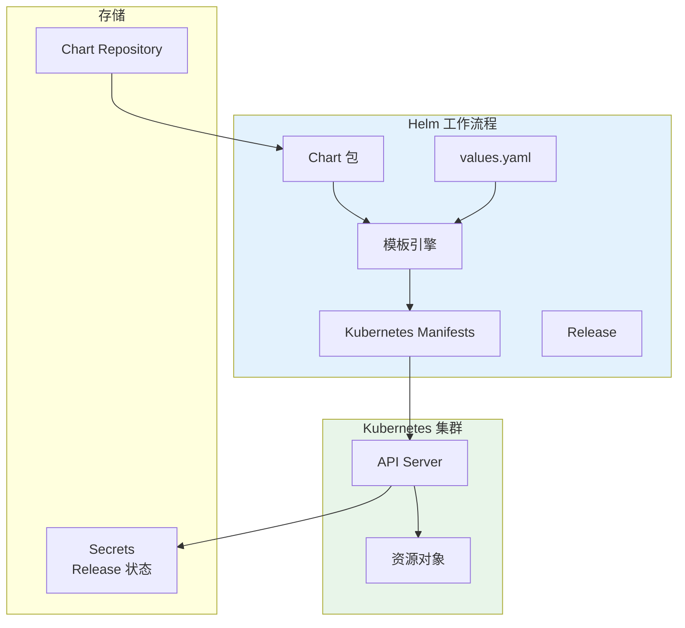

## 概述

Helm 是 Kubernetes 的包管理器，类似于 Linux 的 apt 或 yum。本文深入解析 Helm 的工作原理、Chart 开发最佳实践以及在生产环境中的使用方法。

## Helm 架构

### 工作原理



### Chart 结构

```
mychart/
├── Chart.yaml          # Chart 元数据
├── Chart.lock          # 依赖锁定文件
├── values.yaml         # 默认配置值
├── values.schema.json  # 值的 JSON Schema 验证
├── charts/             # 依赖的 Chart
├── crds/               # CRD 定义
├── templates/          # 模板文件
│   ├── NOTES.txt       # 安装说明
│   ├── _helpers.tpl    # 模板辅助函数
│   ├── deployment.yaml
│   ├── service.yaml
│   ├── ingress.yaml
│   ├── configmap.yaml
│   ├── secret.yaml
│   ├── serviceaccount.yaml
│   ├── hpa.yaml
│   └── tests/
│       └── test-connection.yaml
└── .helmignore         # 忽略文件
```

## Chart 开发

### Chart.yaml

```yaml
# Chart.yaml
apiVersion: v2
name: web-app
description: A Helm chart for web application
type: application
version: 1.2.0
appVersion: "2.0.0"

# 关键词
keywords:
  - web
  - application
  - nodejs

# 维护者
maintainers:
  - name: DevOps Team
    email: devops@example.com
    url: https://example.com

# 图标
icon: https://example.com/icon.png

# 源代码
sources:
  - https://github.com/example/web-app

# 主页
home: https://example.com

# 注解
annotations:
  category: Web Application
  licenses: Apache-2.0

# 依赖
dependencies:
  - name: postgresql
    version: "12.x.x"
    repository: "https://charts.bitnami.com/bitnami"
    condition: postgresql.enabled
    tags:
      - database

  - name: redis
    version: "17.x.x"
    repository: "https://charts.bitnami.com/bitnami"
    condition: redis.enabled
    alias: cache
```

### values.yaml

```yaml
# values.yaml

# 副本数
replicaCount: 3

# 镜像配置
image:
  repository: myregistry/web-app
  pullPolicy: IfNotPresent
  tag: ""  # 默认使用 Chart appVersion

# 镜像拉取凭证
imagePullSecrets: []

# 名称覆盖
nameOverride: ""
fullnameOverride: ""

# ServiceAccount
serviceAccount:
  create: true
  annotations: {}
  name: ""

# Pod 注解
podAnnotations: {}

# Pod 安全上下文
podSecurityContext:
  fsGroup: 1000

# 容器安全上下文
securityContext:
  runAsNonRoot: true
  runAsUser: 1000
  readOnlyRootFilesystem: true
  allowPrivilegeEscalation: false
  capabilities:
    drop:
      - ALL

# Service 配置
service:
  type: ClusterIP
  port: 80
  targetPort: 8080
  annotations: {}

# Ingress 配置
ingress:
  enabled: false
  className: nginx
  annotations: {}
  hosts:
    - host: chart-example.local
      paths:
        - path: /
          pathType: Prefix
  tls: []

# 资源限制
resources:
  limits:
    cpu: 500m
    memory: 512Mi
  requests:
    cpu: 100m
    memory: 128Mi

# 自动扩缩
autoscaling:
  enabled: false
  minReplicas: 2
  maxReplicas: 10
  targetCPUUtilizationPercentage: 80
  targetMemoryUtilizationPercentage: 80

# 节点选择器
nodeSelector: {}

# 容忍
tolerations: []

# 亲和性
affinity: {}

# 拓扑分布约束
topologySpreadConstraints: []

# 探针配置
probes:
  liveness:
    enabled: true
    path: /health/live
    initialDelaySeconds: 15
    periodSeconds: 10
  readiness:
    enabled: true
    path: /health/ready
    initialDelaySeconds: 5
    periodSeconds: 5

# 环境变量
env: []
envFrom: []

# 配置
config:
  logLevel: info
  environment: production

# 数据库配置
postgresql:
  enabled: true
  auth:
    username: webapp
    database: webapp

# 缓存配置
redis:
  enabled: false
```

### 模板文件

```yaml
# templates/_helpers.tpl
{{/*
生成完整名称
*/}}
{{- define "web-app.fullname" -}}
{{- if .Values.fullnameOverride }}
{{- .Values.fullnameOverride | trunc 63 | trimSuffix "-" }}
{{- else }}
{{- $name := default .Chart.Name .Values.nameOverride }}
{{- if contains $name .Release.Name }}
{{- .Release.Name | trunc 63 | trimSuffix "-" }}
{{- else }}
{{- printf "%s-%s" .Release.Name $name | trunc 63 | trimSuffix "-" }}
{{- end }}
{{- end }}
{{- end }}

{{/*
生成通用标签
*/}}
{{- define "web-app.labels" -}}
helm.sh/chart: {{ include "web-app.chart" . }}
{{ include "web-app.selectorLabels" . }}
{{- if .Chart.AppVersion }}
app.kubernetes.io/version: {{ .Chart.AppVersion | quote }}
{{- end }}
app.kubernetes.io/managed-by: {{ .Release.Service }}
{{- end }}

{{/*
生成选择器标签
*/}}
{{- define "web-app.selectorLabels" -}}
app.kubernetes.io/name: {{ include "web-app.name" . }}
app.kubernetes.io/instance: {{ .Release.Name }}
{{- end }}

{{/*
生成 Chart 名称和版本
*/}}
{{- define "web-app.chart" -}}
{{- printf "%s-%s" .Chart.Name .Chart.Version | replace "+" "_" | trunc 63 | trimSuffix "-" }}
{{- end }}

{{/*
ServiceAccount 名称
*/}}
{{- define "web-app.serviceAccountName" -}}
{{- if .Values.serviceAccount.create }}
{{- default (include "web-app.fullname" .) .Values.serviceAccount.name }}
{{- else }}
{{- default "default" .Values.serviceAccount.name }}
{{- end }}
{{- end }}
```

```yaml
# templates/deployment.yaml
apiVersion: apps/v1
kind: Deployment
metadata:
  name: {{ include "web-app.fullname" . }}
  labels:
    {{- include "web-app.labels" . | nindent 4 }}
spec:
  {{- if not .Values.autoscaling.enabled }}
  replicas: {{ .Values.replicaCount }}
  {{- end }}
  selector:
    matchLabels:
      {{- include "web-app.selectorLabels" . | nindent 6 }}
  template:
    metadata:
      annotations:
        checksum/config: {{ include (print $.Template.BasePath "/configmap.yaml") . | sha256sum }}
        {{- with .Values.podAnnotations }}
        {{- toYaml . | nindent 8 }}
        {{- end }}
      labels:
        {{- include "web-app.selectorLabels" . | nindent 8 }}
    spec:
      {{- with .Values.imagePullSecrets }}
      imagePullSecrets:
        {{- toYaml . | nindent 8 }}
      {{- end }}
      serviceAccountName: {{ include "web-app.serviceAccountName" . }}
      securityContext:
        {{- toYaml .Values.podSecurityContext | nindent 8 }}

      {{- with .Values.topologySpreadConstraints }}
      topologySpreadConstraints:
        {{- toYaml . | nindent 8 }}
      {{- end }}

      containers:
        - name: {{ .Chart.Name }}
          securityContext:
            {{- toYaml .Values.securityContext | nindent 12 }}
          image: "{{ .Values.image.repository }}:{{ .Values.image.tag | default .Chart.AppVersion }}"
          imagePullPolicy: {{ .Values.image.pullPolicy }}
          ports:
            - name: http
              containerPort: {{ .Values.service.targetPort }}
              protocol: TCP

          {{- if .Values.probes.liveness.enabled }}
          livenessProbe:
            httpGet:
              path: {{ .Values.probes.liveness.path }}
              port: http
            initialDelaySeconds: {{ .Values.probes.liveness.initialDelaySeconds }}
            periodSeconds: {{ .Values.probes.liveness.periodSeconds }}
          {{- end }}

          {{- if .Values.probes.readiness.enabled }}
          readinessProbe:
            httpGet:
              path: {{ .Values.probes.readiness.path }}
              port: http
            initialDelaySeconds: {{ .Values.probes.readiness.initialDelaySeconds }}
            periodSeconds: {{ .Values.probes.readiness.periodSeconds }}
          {{- end }}

          resources:
            {{- toYaml .Values.resources | nindent 12 }}

          envFrom:
            - configMapRef:
                name: {{ include "web-app.fullname" . }}
            {{- with .Values.envFrom }}
            {{- toYaml . | nindent 12 }}
            {{- end }}

          {{- with .Values.env }}
          env:
            {{- toYaml . | nindent 12 }}
          {{- end }}

      {{- with .Values.nodeSelector }}
      nodeSelector:
        {{- toYaml . | nindent 8 }}
      {{- end }}

      {{- with .Values.affinity }}
      affinity:
        {{- toYaml . | nindent 8 }}
      {{- end }}

      {{- with .Values.tolerations }}
      tolerations:
        {{- toYaml . | nindent 8 }}
      {{- end }}
```

```yaml
# templates/service.yaml
apiVersion: v1
kind: Service
metadata:
  name: {{ include "web-app.fullname" . }}
  labels:
    {{- include "web-app.labels" . | nindent 4 }}
  {{- with .Values.service.annotations }}
  annotations:
    {{- toYaml . | nindent 4 }}
  {{- end }}
spec:
  type: {{ .Values.service.type }}
  ports:
    - port: {{ .Values.service.port }}
      targetPort: {{ .Values.service.targetPort }}
      protocol: TCP
      name: http
  selector:
    {{- include "web-app.selectorLabels" . | nindent 4 }}
```

```yaml
# templates/ingress.yaml
{{- if .Values.ingress.enabled -}}
apiVersion: networking.k8s.io/v1
kind: Ingress
metadata:
  name: {{ include "web-app.fullname" . }}
  labels:
    {{- include "web-app.labels" . | nindent 4 }}
  {{- with .Values.ingress.annotations }}
  annotations:
    {{- toYaml . | nindent 4 }}
  {{- end }}
spec:
  {{- if .Values.ingress.className }}
  ingressClassName: {{ .Values.ingress.className }}
  {{- end }}
  {{- if .Values.ingress.tls }}
  tls:
    {{- range .Values.ingress.tls }}
    - hosts:
        {{- range .hosts }}
        - {{ . | quote }}
        {{- end }}
      secretName: {{ .secretName }}
    {{- end }}
  {{- end }}
  rules:
    {{- range .Values.ingress.hosts }}
    - host: {{ .host | quote }}
      http:
        paths:
          {{- range .paths }}
          - path: {{ .path }}
            pathType: {{ .pathType }}
            backend:
              service:
                name: {{ include "web-app.fullname" $ }}
                port:
                  number: {{ $.Values.service.port }}
          {{- end }}
    {{- end }}
{{- end }}
```

### values.schema.json

```json
{
  "$schema": "https://json-schema.org/draft/2020-12/schema",
  "type": "object",
  "required": ["replicaCount", "image"],
  "properties": {
    "replicaCount": {
      "type": "integer",
      "minimum": 1,
      "description": "Number of replicas"
    },
    "image": {
      "type": "object",
      "required": ["repository"],
      "properties": {
        "repository": {
          "type": "string",
          "description": "Container image repository"
        },
        "tag": {
          "type": "string",
          "description": "Container image tag"
        },
        "pullPolicy": {
          "type": "string",
          "enum": ["Always", "IfNotPresent", "Never"],
          "default": "IfNotPresent"
        }
      }
    },
    "service": {
      "type": "object",
      "properties": {
        "type": {
          "type": "string",
          "enum": ["ClusterIP", "NodePort", "LoadBalancer"],
          "default": "ClusterIP"
        },
        "port": {
          "type": "integer",
          "minimum": 1,
          "maximum": 65535,
          "default": 80
        }
      }
    },
    "ingress": {
      "type": "object",
      "properties": {
        "enabled": {
          "type": "boolean",
          "default": false
        }
      }
    },
    "resources": {
      "type": "object",
      "properties": {
        "limits": {
          "type": "object",
          "properties": {
            "cpu": {"type": "string"},
            "memory": {"type": "string"}
          }
        },
        "requests": {
          "type": "object",
          "properties": {
            "cpu": {"type": "string"},
            "memory": {"type": "string"}
          }
        }
      }
    }
  }
}
```

## Helm 生命周期管理

### 常用命令

```bash
# 添加仓库
helm repo add bitnami https://charts.bitnami.com/bitnami
helm repo update

# 搜索 Chart
helm search repo nginx
helm search hub nginx

# 安装 Chart
helm install my-release bitnami/nginx
helm install my-release ./mychart -f custom-values.yaml

# 升级 Release
helm upgrade my-release bitnami/nginx --set replicaCount=3
helm upgrade my-release ./mychart -f production-values.yaml

# 回滚
helm rollback my-release 1
helm history my-release

# 卸载
helm uninstall my-release

# 调试模板
helm template my-release ./mychart -f values.yaml
helm install my-release ./mychart --debug --dry-run

# 验证 Chart
helm lint ./mychart

# 打包 Chart
helm package ./mychart

# 查看 Release
helm list
helm status my-release
helm get manifest my-release
helm get values my-release
```

### Hooks

```yaml
# templates/pre-install-job.yaml
apiVersion: batch/v1
kind: Job
metadata:
  name: {{ include "web-app.fullname" . }}-db-migrate
  labels:
    {{- include "web-app.labels" . | nindent 4 }}
  annotations:
    "helm.sh/hook": pre-install,pre-upgrade
    "helm.sh/hook-weight": "-5"
    "helm.sh/hook-delete-policy": before-hook-creation,hook-succeeded
spec:
  template:
    spec:
      restartPolicy: Never
      containers:
        - name: db-migrate
          image: "{{ .Values.image.repository }}:{{ .Values.image.tag | default .Chart.AppVersion }}"
          command: ["./migrate.sh"]
          env:
            - name: DATABASE_URL
              valueFrom:
                secretKeyRef:
                  name: {{ include "web-app.fullname" . }}-db
                  key: url
---
# templates/post-install-test.yaml
apiVersion: v1
kind: Pod
metadata:
  name: {{ include "web-app.fullname" . }}-test
  labels:
    {{- include "web-app.labels" . | nindent 4 }}
  annotations:
    "helm.sh/hook": test
    "helm.sh/hook-delete-policy": before-hook-creation,hook-succeeded
spec:
  restartPolicy: Never
  containers:
    - name: test
      image: busybox
      command: ['sh', '-c', 'wget -qO- http://{{ include "web-app.fullname" . }}:{{ .Values.service.port }}/health']
```

### 子 Chart 和依赖

```yaml
# Chart.yaml
dependencies:
  - name: postgresql
    version: "12.x.x"
    repository: "https://charts.bitnami.com/bitnami"
    condition: postgresql.enabled
    import-values:
      - child: primary.service
        parent: postgresqlService
---
# values.yaml
postgresql:
  enabled: true
  auth:
    username: myapp
    password: secret
    database: myappdb
  primary:
    persistence:
      enabled: true
      size: 10Gi
```

```bash
# 更新依赖
helm dependency update ./mychart
helm dependency build ./mychart
```

## Chart 仓库管理

### OCI 仓库

```bash
# 登录 OCI 仓库
helm registry login registry.example.com

# 推送到 OCI 仓库
helm push mychart-1.0.0.tgz oci://registry.example.com/charts

# 从 OCI 仓库安装
helm install my-release oci://registry.example.com/charts/mychart --version 1.0.0
```

### ChartMuseum

```yaml
# chartmuseum-deployment.yaml
apiVersion: apps/v1
kind: Deployment
metadata:
  name: chartmuseum
  namespace: helm-repo
spec:
  replicas: 1
  selector:
    matchLabels:
      app: chartmuseum
  template:
    metadata:
      labels:
        app: chartmuseum
    spec:
      containers:
        - name: chartmuseum
          image: ghcr.io/helm/chartmuseum:v0.16.0
          ports:
            - containerPort: 8080
          env:
            - name: STORAGE
              value: local
            - name: STORAGE_LOCAL_ROOTDIR
              value: /charts
            - name: ALLOW_OVERWRITE
              value: "true"
          volumeMounts:
            - name: charts
              mountPath: /charts
      volumes:
        - name: charts
          persistentVolumeClaim:
            claimName: chartmuseum-pvc
```

## 最佳实践

### Chart 开发检查清单

| 检查项 | 说明 |
|--------|------|
| 版本管理 | 遵循 SemVer，Chart 版本和 App 版本分离 |
| 默认值安全 | 不在 values.yaml 中包含敏感信息 |
| 资源命名 | 使用 Release 名称前缀避免冲突 |
| 标签规范 | 使用标准 Kubernetes 标签 |
| 资源限制 | 提供合理的默认资源限制 |
| 安全上下文 | 默认以非 root 用户运行 |
| 文档 | 完整的 README 和 NOTES.txt |
| 测试 | 包含 helm test 测试用例 |
| Schema | 使用 JSON Schema 验证 values |

### 多环境配置

```bash
# 目录结构
config/
├── values-base.yaml
├── values-dev.yaml
├── values-staging.yaml
└── values-prod.yaml

# 安装命令
helm install my-app ./mychart \
  -f config/values-base.yaml \
  -f config/values-prod.yaml \
  --set image.tag=v1.2.0
```

## 总结

Helm 是 Kubernetes 应用打包和部署的标准工具：

1. **Chart 开发**：遵循最佳实践创建可维护的 Chart
2. **模板技巧**：合理使用模板函数和辅助模板
3. **依赖管理**：使用 Chart 依赖组合复杂应用
4. **生命周期 Hooks**：实现部署前后的自动化任务
5. **仓库管理**：使用 OCI 或 ChartMuseum 管理私有 Chart

掌握 Helm 能够大大提高 Kubernetes 应用的部署效率和可维护性。
