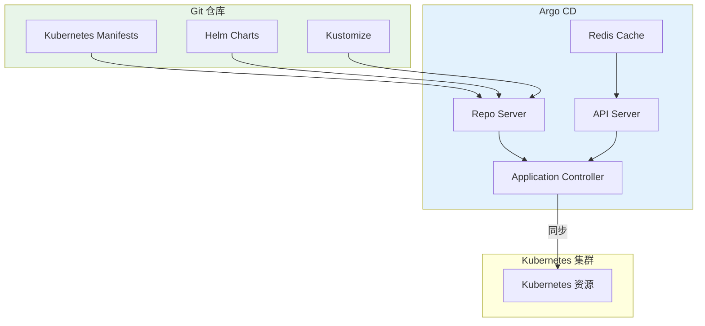

## 概述

Argo 项目是 Kubernetes 原生的工作流和 GitOps 工具集，包括 Argo CD、Argo Workflows、Argo Rollouts 和 Argo Events。本文深入解析 Argo 生态的核心组件和使用方法。

## Argo CD - GitOps 持续交付

### 架构概览



### Application 配置

```yaml
# application.yaml
apiVersion: argoproj.io/v1alpha1
kind: Application
metadata:
  name: web-app
  namespace: argocd
  finalizers:
    - resources-finalizer.argocd.argoproj.io
spec:
  project: default

  # 源配置
  source:
    repoURL: https://github.com/myorg/k8s-configs.git
    targetRevision: main
    path: apps/web-app/overlays/production

    # Helm 配置
    # helm:
    #   releaseName: web-app
    #   valueFiles:
    #     - values.yaml
    #     - values-production.yaml
    #   parameters:
    #     - name: replicaCount
    #       value: "3"

    # Kustomize 配置
    kustomize:
      images:
        - myregistry/web-app:v1.2.0

  # 目标集群
  destination:
    server: https://kubernetes.default.svc
    namespace: production

  # 同步策略
  syncPolicy:
    automated:
      prune: true
      selfHeal: true
      allowEmpty: false
    syncOptions:
      - CreateNamespace=true
      - PrunePropagationPolicy=foreground
      - PruneLast=true
      - ServerSideApply=true
    retry:
      limit: 5
      backoff:
        duration: 5s
        factor: 2
        maxDuration: 3m

  # 资源忽略差异
  ignoreDifferences:
    - group: apps
      kind: Deployment
      jsonPointers:
        - /spec/replicas
    - group: ""
      kind: ConfigMap
      jqPathExpressions:
        - '.data["config.json"]'

  # 健康检查
  revisionHistoryLimit: 10
```

### ApplicationSet

```yaml
# applicationset.yaml
apiVersion: argoproj.io/v1alpha1
kind: ApplicationSet
metadata:
  name: cluster-apps
  namespace: argocd
spec:
  generators:
    # 列表生成器
    - list:
        elements:
          - cluster: production
            url: https://prod-cluster.example.com
            values:
              environment: prod
              replicas: "5"
          - cluster: staging
            url: https://staging-cluster.example.com
            values:
              environment: staging
              replicas: "2"

    # Git 目录生成器
    # - git:
    #     repoURL: https://github.com/myorg/k8s-configs.git
    #     revision: main
    #     directories:
    #       - path: apps/*

    # 集群生成器
    # - clusters:
    #     selector:
    #       matchLabels:
    #         environment: production

    # 矩阵生成器
    # - matrix:
    #     generators:
    #       - list:
    #           elements:
    #             - app: web-app
    #             - app: api-service
    #       - clusters:
    #           selector:
    #             matchLabels:
    #               environment: production

  template:
    metadata:
      name: '{{cluster}}-web-app'
      labels:
        environment: '{{values.environment}}'
    spec:
      project: default
      source:
        repoURL: https://github.com/myorg/k8s-configs.git
        targetRevision: main
        path: 'apps/web-app/overlays/{{values.environment}}'
        helm:
          parameters:
            - name: replicaCount
              value: '{{values.replicas}}'
      destination:
        server: '{{url}}'
        namespace: production
      syncPolicy:
        automated:
          prune: true
          selfHeal: true
```

### Project 配置

```yaml
# appproject.yaml
apiVersion: argoproj.io/v1alpha1
kind: AppProject
metadata:
  name: production
  namespace: argocd
spec:
  description: Production applications

  # 源仓库限制
  sourceRepos:
    - https://github.com/myorg/*
    - https://charts.example.com

  # 目标集群和命名空间限制
  destinations:
    - namespace: production
      server: https://kubernetes.default.svc
    - namespace: production-*
      server: https://kubernetes.default.svc

  # 集群资源白名单
  clusterResourceWhitelist:
    - group: ''
      kind: Namespace
    - group: rbac.authorization.k8s.io
      kind: ClusterRole
    - group: rbac.authorization.k8s.io
      kind: ClusterRoleBinding

  # 命名空间资源黑名单
  namespaceResourceBlacklist:
    - group: ''
      kind: ResourceQuota
    - group: ''
      kind: LimitRange

  # 角色
  roles:
    - name: developer
      description: Developer role
      policies:
        - p, proj:production:developer, applications, get, production/*, allow
        - p, proj:production:developer, applications, sync, production/*, allow
      groups:
        - developers

    - name: admin
      description: Admin role
      policies:
        - p, proj:production:admin, applications, *, production/*, allow
      groups:
        - platform-team
```

## Argo Workflows - 工作流引擎

### 工作流定义

```yaml
# workflow.yaml
apiVersion: argoproj.io/v1alpha1
kind: Workflow
metadata:
  generateName: data-pipeline-
  namespace: argo
spec:
  entrypoint: main
  serviceAccountName: argo-workflow

  # 工作流参数
  arguments:
    parameters:
      - name: input-bucket
        value: "s3://data-lake/raw"
      - name: output-bucket
        value: "s3://data-lake/processed"
      - name: date
        value: "2024-01-15"

  # 卷声明
  volumeClaimTemplates:
    - metadata:
        name: work-volume
      spec:
        accessModes: ["ReadWriteOnce"]
        resources:
          requests:
            storage: 10Gi

  # 模板定义
  templates:
    # 主 DAG
    - name: main
      dag:
        tasks:
          - name: extract
            template: extract-data
            arguments:
              parameters:
                - name: source
                  value: "{{workflow.parameters.input-bucket}}"
                - name: date
                  value: "{{workflow.parameters.date}}"

          - name: validate
            template: validate-data
            dependencies: [extract]
            arguments:
              artifacts:
                - name: data
                  from: "{{tasks.extract.outputs.artifacts.raw-data}}"

          - name: transform
            template: transform-data
            dependencies: [validate]
            arguments:
              artifacts:
                - name: data
                  from: "{{tasks.extract.outputs.artifacts.raw-data}}"

          - name: load
            template: load-data
            dependencies: [transform]
            arguments:
              artifacts:
                - name: data
                  from: "{{tasks.transform.outputs.artifacts.processed-data}}"
              parameters:
                - name: destination
                  value: "{{workflow.parameters.output-bucket}}"

    # 数据提取模板
    - name: extract-data
      inputs:
        parameters:
          - name: source
          - name: date
      outputs:
        artifacts:
          - name: raw-data
            path: /tmp/output
            s3:
              key: "{{workflow.name}}/raw-data"
      container:
        image: data-pipeline:v1.0
        command: [python, /app/extract.py]
        args:
          - --source={{inputs.parameters.source}}
          - --date={{inputs.parameters.date}}
          - --output=/tmp/output
        resources:
          requests:
            cpu: "1"
            memory: "2Gi"

    # 数据验证模板
    - name: validate-data
      inputs:
        artifacts:
          - name: data
            path: /tmp/input
      container:
        image: data-pipeline:v1.0
        command: [python, /app/validate.py]
        args:
          - --input=/tmp/input
      # 失败时重试
      retryStrategy:
        limit: 3
        retryPolicy: OnError

    # 数据转换模板
    - name: transform-data
      inputs:
        artifacts:
          - name: data
            path: /tmp/input
      outputs:
        artifacts:
          - name: processed-data
            path: /tmp/output
      container:
        image: data-pipeline:v1.0
        command: [python, /app/transform.py]
        args:
          - --input=/tmp/input
          - --output=/tmp/output
        resources:
          requests:
            cpu: "2"
            memory: "4Gi"
        volumeMounts:
          - name: work-volume
            mountPath: /tmp

    # 数据加载模板
    - name: load-data
      inputs:
        parameters:
          - name: destination
        artifacts:
          - name: data
            path: /tmp/input
      container:
        image: data-pipeline:v1.0
        command: [python, /app/load.py]
        args:
          - --input=/tmp/input
          - --destination={{inputs.parameters.destination}}
```

### WorkflowTemplate

```yaml
# workflowtemplate.yaml
apiVersion: argoproj.io/v1alpha1
kind: WorkflowTemplate
metadata:
  name: ci-pipeline
  namespace: argo
spec:
  entrypoint: ci

  arguments:
    parameters:
      - name: repo
      - name: branch
        value: main
      - name: image

  templates:
    - name: ci
      steps:
        - - name: clone
            template: git-clone
            arguments:
              parameters:
                - name: repo
                  value: "{{workflow.parameters.repo}}"
                - name: branch
                  value: "{{workflow.parameters.branch}}"

        - - name: test
            template: run-tests

        - - name: build
            template: build-image
            arguments:
              parameters:
                - name: image
                  value: "{{workflow.parameters.image}}"

        - - name: scan
            template: security-scan
            arguments:
              parameters:
                - name: image
                  value: "{{workflow.parameters.image}}"

    - name: git-clone
      inputs:
        parameters:
          - name: repo
          - name: branch
      container:
        image: alpine/git
        command: [sh, -c]
        args:
          - git clone --branch {{inputs.parameters.branch}} {{inputs.parameters.repo}} /workspace
        volumeMounts:
          - name: workspace
            mountPath: /workspace

    - name: run-tests
      container:
        image: golang:1.21
        command: [sh, -c]
        args:
          - cd /workspace && go test ./...
        volumeMounts:
          - name: workspace
            mountPath: /workspace

    - name: build-image
      inputs:
        parameters:
          - name: image
      container:
        image: gcr.io/kaniko-project/executor:latest
        args:
          - --dockerfile=/workspace/Dockerfile
          - --context=/workspace
          - --destination={{inputs.parameters.image}}
        volumeMounts:
          - name: workspace
            mountPath: /workspace

    - name: security-scan
      inputs:
        parameters:
          - name: image
      container:
        image: aquasec/trivy
        args:
          - image
          - --severity=HIGH,CRITICAL
          - "{{inputs.parameters.image}}"
```

## Argo Rollouts - 渐进式交付

### Rollout 配置

```yaml
# rollout.yaml
apiVersion: argoproj.io/v1alpha1
kind: Rollout
metadata:
  name: web-app
  namespace: production
spec:
  replicas: 10
  selector:
    matchLabels:
      app: web-app
  template:
    metadata:
      labels:
        app: web-app
    spec:
      containers:
        - name: web-app
          image: myregistry/web-app:v1.0.0
          ports:
            - containerPort: 8080
          resources:
            requests:
              cpu: "100m"
              memory: "128Mi"

  # 金丝雀策略
  strategy:
    canary:
      # 步骤定义
      steps:
        - setWeight: 5
        - pause: {duration: 2m}
        - setWeight: 20
        - pause: {duration: 5m}
        - setWeight: 50
        - pause: {duration: 10m}
        - setWeight: 80
        - pause: {duration: 5m}

      # 分析
      analysis:
        templates:
          - templateName: success-rate
          - templateName: latency
        startingStep: 2
        args:
          - name: service-name
            value: web-app

      # 流量路由
      canaryService: web-app-canary
      stableService: web-app-stable
      trafficRouting:
        nginx:
          stableIngress: web-app-stable
          annotationPrefix: nginx.ingress.kubernetes.io
          additionalIngressAnnotations:
            canary-by-header: X-Canary
            canary-by-header-value: "true"

      # 自动回滚
      autoPromotionEnabled: false
      autoPromotionSeconds: 300

      # 反亲和性
      antiAffinity:
        preferredDuringSchedulingIgnoredDuringExecution:
          weight: 100

      # 缩放策略
      maxSurge: "25%"
      maxUnavailable: 0
---
# 蓝绿策略
apiVersion: argoproj.io/v1alpha1
kind: Rollout
metadata:
  name: api-service
  namespace: production
spec:
  replicas: 5
  selector:
    matchLabels:
      app: api-service
  template:
    metadata:
      labels:
        app: api-service
    spec:
      containers:
        - name: api-service
          image: myregistry/api-service:v1.0.0

  strategy:
    blueGreen:
      activeService: api-service-active
      previewService: api-service-preview

      # 自动晋升
      autoPromotionEnabled: false
      autoPromotionSeconds: 600

      # 预览副本数
      previewReplicaCount: 1

      # 缩放策略
      scaleDownDelaySeconds: 30
      scaleDownDelayRevisionLimit: 2

      # 预检分析
      prePromotionAnalysis:
        templates:
          - templateName: smoke-test
        args:
          - name: service-name
            value: api-service-preview

      # 晋升后分析
      postPromotionAnalysis:
        templates:
          - templateName: success-rate
        args:
          - name: service-name
            value: api-service-active
```

### AnalysisTemplate

```yaml
# analysistemplate.yaml
apiVersion: argoproj.io/v1alpha1
kind: AnalysisTemplate
metadata:
  name: success-rate
  namespace: production
spec:
  args:
    - name: service-name
  metrics:
    - name: success-rate
      interval: 1m
      count: 5
      successCondition: result[0] >= 0.99
      failureLimit: 3
      provider:
        prometheus:
          address: http://prometheus.monitoring:9090
          query: |
            sum(rate(http_requests_total{service="{{args.service-name}}",status=~"2.."}[5m]))
            /
            sum(rate(http_requests_total{service="{{args.service-name}}"}[5m]))
---
apiVersion: argoproj.io/v1alpha1
kind: AnalysisTemplate
metadata:
  name: latency
  namespace: production
spec:
  args:
    - name: service-name
  metrics:
    - name: latency-p99
      interval: 1m
      count: 5
      successCondition: result[0] < 0.5
      failureLimit: 3
      provider:
        prometheus:
          address: http://prometheus.monitoring:9090
          query: |
            histogram_quantile(0.99,
              sum(rate(http_request_duration_seconds_bucket{service="{{args.service-name}}"}[5m])) by (le)
            )
---
apiVersion: argoproj.io/v1alpha1
kind: AnalysisTemplate
metadata:
  name: smoke-test
  namespace: production
spec:
  args:
    - name: service-name
  metrics:
    - name: smoke-test
      count: 1
      provider:
        job:
          spec:
            backoffLimit: 0
            template:
              spec:
                restartPolicy: Never
                containers:
                  - name: smoke-test
                    image: curlimages/curl
                    command:
                      - sh
                      - -c
                      - |
                        curl -sf http://{{args.service-name}}/health || exit 1
                        curl -sf http://{{args.service-name}}/api/v1/status || exit 1
```

## Argo Events - 事件驱动

### EventSource

```yaml
# eventsource.yaml
apiVersion: argoproj.io/v1alpha1
kind: EventSource
metadata:
  name: webhook-events
  namespace: argo-events
spec:
  webhook:
    github:
      port: "12000"
      endpoint: /github
      method: POST
      # GitHub Secret
      webhookSecret:
        key: secret
        name: github-webhook-secret

    gitlab:
      port: "12001"
      endpoint: /gitlab
      method: POST
---
apiVersion: argoproj.io/v1alpha1
kind: EventSource
metadata:
  name: kafka-events
  namespace: argo-events
spec:
  kafka:
    order-events:
      url: kafka.default.svc.cluster.local:9092
      topic: orders
      partition: "0"
      consumerGroup:
        groupName: argo-events
        rebalanceStrategy: sticky
      tls:
        caCertSecret:
          name: kafka-tls
          key: ca.crt
---
apiVersion: argoproj.io/v1alpha1
kind: EventSource
metadata:
  name: s3-events
  namespace: argo-events
spec:
  s3:
    data-uploads:
      bucket:
        name: data-uploads
      endpoint: s3.amazonaws.com
      region: us-west-2
      events:
        - s3:ObjectCreated:*
      filter:
        prefix: incoming/
        suffix: .csv
      accessKey:
        name: aws-credentials
        key: accesskey
      secretKey:
        name: aws-credentials
        key: secretkey
```

### Sensor

```yaml
# sensor.yaml
apiVersion: argoproj.io/v1alpha1
kind: Sensor
metadata:
  name: ci-sensor
  namespace: argo-events
spec:
  dependencies:
    - name: github-push
      eventSourceName: webhook-events
      eventName: github
      filters:
        data:
          - path: body.ref
            type: string
            value:
              - refs/heads/main
              - refs/heads/develop

  triggers:
    - template:
        name: ci-workflow
        k8s:
          operation: create
          source:
            resource:
              apiVersion: argoproj.io/v1alpha1
              kind: Workflow
              metadata:
                generateName: ci-
              spec:
                workflowTemplateRef:
                  name: ci-pipeline
                arguments:
                  parameters:
                    - name: repo
                      value: ""
                    - name: branch
                      value: ""
                    - name: image
                      value: ""
          parameters:
            - src:
                dependencyName: github-push
                dataKey: body.repository.clone_url
              dest: spec.arguments.parameters.0.value
            - src:
                dependencyName: github-push
                dataTemplate: "{{ .Input.body.ref | replace \"refs/heads/\" \"\" }}"
              dest: spec.arguments.parameters.1.value
            - src:
                dependencyName: github-push
                dataTemplate: "myregistry/app:{{ .Input.body.after | substr 0 7 }}"
              dest: spec.arguments.parameters.2.value
---
apiVersion: argoproj.io/v1alpha1
kind: Sensor
metadata:
  name: data-pipeline-sensor
  namespace: argo-events
spec:
  dependencies:
    - name: new-data-file
      eventSourceName: s3-events
      eventName: data-uploads

  triggers:
    - template:
        name: process-data
        k8s:
          operation: create
          source:
            resource:
              apiVersion: argoproj.io/v1alpha1
              kind: Workflow
              metadata:
                generateName: data-pipeline-
              spec:
                entrypoint: process
                arguments:
                  parameters:
                    - name: bucket
                      value: ""
                    - name: key
                      value: ""
                templates:
                  - name: process
                    container:
                      image: data-processor:v1.0
                      command: [python, /app/process.py]
                      args:
                        - --bucket={{workflow.parameters.bucket}}
                        - --key={{workflow.parameters.key}}
          parameters:
            - src:
                dependencyName: new-data-file
                dataKey: notification.s3.bucket.name
              dest: spec.arguments.parameters.0.value
            - src:
                dependencyName: new-data-file
                dataKey: notification.s3.object.key
              dest: spec.arguments.parameters.1.value
```

## 总结

Argo 生态提供了完整的 Kubernetes 原生工具链：

1. **Argo CD**：GitOps 持续交付，实现声明式应用部署
2. **Argo Workflows**：强大的工作流引擎，支持复杂的 DAG 编排
3. **Argo Rollouts**：渐进式交付，支持金丝雀和蓝绿部署
4. **Argo Events**：事件驱动架构，连接各种事件源和触发器

这些工具可以单独使用，也可以组合构建完整的 CI/CD 和 GitOps 解决方案。
