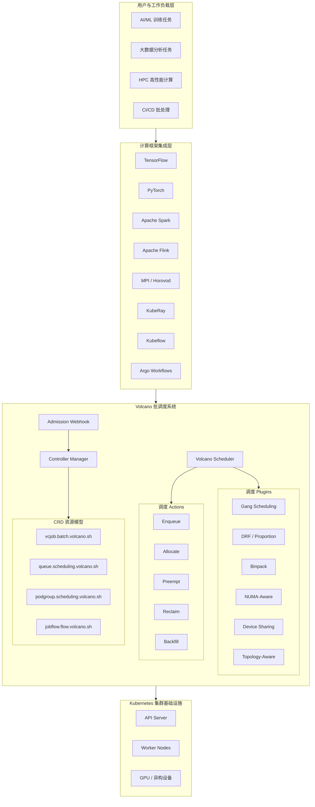

> 本文是 Volcano 内核解析系列的第一篇，旨在为读者建立对 Volcano 项目的系统性认知，理解其在 Kubernetes 生态中的定位、核心能力与适用场景。

## 1. 什么是 Volcano

Volcano 是一个基于 Kubernetes 的云原生批调度系统（Batch Scheduling System），隶属于 CNCF（Cloud Native Computing Foundation）孵化项目。它在 Kubernetes 原生调度器 kube-scheduler 的基础上进行了深度扩展，专门面向 AI/ML 训练、大数据分析、高性能计算（HPC）以及批处理等高密度计算场景提供调度能力。

从技术演进角度来看，Volcano 脱胎于 Kubernetes SIG Scheduling 下的 [kube-batch](https://github.com/kubernetes-sigs/kube-batch) 项目，并在此基础上构建了完整的 Job 生命周期管理、多队列资源调度、丰富的插件体系以及对主流计算框架的原生集成。截至目前，Volcano 已在互联网、金融、制造、医疗等多个行业得到规模化生产落地，数百位贡献者持续参与项目迭代。

Volcano 的核心架构由三大组件构成：

- **Volcano Scheduler** - 负责批调度决策的调度器，采用 Session-based 调度模型，通过 Action + Plugin 的可插拔架构实现调度策略的灵活编排
- **Volcano Controller Manager** - 负责 CRD 资源（Job、Queue、PodGroup、JobFlow 等）的生命周期管理
- **Volcano Admission Webhook** - 负责 CRD 资源的准入校验与默认值注入

## 2. 为什么 Kubernetes 需要批调度

Kubernetes 原生调度器 kube-scheduler 的设计初衷是面向长时间运行的微服务（Long-Running Services），采用逐 Pod 的调度模型 -- 即每个 Pod 独立经历 Filter、Score、Bind 流程。这种设计对于 Deployment、StatefulSet 等典型微服务工作负载足够高效，但在批计算场景下存在以下根本性局限：

**缺乏 Gang Scheduling 能力。** 分布式训练任务（如 TensorFlow ParameterServer 模式或 PyTorch DistributedDataParallel）要求所有 Worker 同时就绪才能启动计算。kube-scheduler 逐个调度 Pod，可能导致部分 Worker 已占用资源但因剩余 Worker 无法调度而整体阻塞，造成资源死锁。

**缺乏跨队列公平共享机制。** 在多租户环境下，不同团队或业务线的工作负载需要共享集群资源。kube-scheduler 没有内置 Queue 概念，无法实现基于 DRF（Dominant Resource Fairness）或 Proportion 策略的资源公平分配与隔离。

**缺乏 Job 级别的资源管理。** kube-scheduler 以 Pod 为最小调度单元，没有 Job 层面的语义。批计算场景需要的 minAvailable（最少可用实例数）、Task 间依赖关系、Job 状态机管理等能力均无法直接表达。

**缺乏跨队列抢占与资源回收。** 当高优先级任务提交时，需要能够跨队列抢占低优先级任务的资源。kube-scheduler 的 Preemption 机制仅限于 PriorityClass 级别的 Pod 抢占，无法实现队列维度的资源弹性调度。

**缺乏拓扑感知能力。** GPU 密集型训练任务对节点内 GPU 拓扑、NUMA 亲和性、网络拓扑等有强需求，kube-scheduler 在这些维度的调度感知能力有限。

Volcano 正是为解决这些问题而生，它在保持与 Kubernetes 生态完全兼容的前提下，补齐了批调度领域的关键能力。

## 3. 核心特性概览

### 3.1 Gang Scheduling

Gang Scheduling 是 Volcano 最核心的调度语义。通过 PodGroup 资源定义 `minAvailable` 字段，确保一组关联 Pod 要么全部调度成功，要么全部不调度，从根本上避免资源死锁。在 Volcano Scheduler 的 `Allocate` Action 中，Gang Plugin 会在 Pipeline 阶段暂存调度决策，待所有满足条件的 Task 就绪后才统一提交 Bind 操作。

### 3.2 Fair Sharing - DRF 与 Proportion

Volcano 提供两种主要的公平共享策略。**DRF**（Dominant Resource Fairness）Plugin 关注各 Job 的主导资源占比，确保多维资源（CPU、Memory、GPU）的公平分配。**Proportion** Plugin 则基于 Queue 维度的 `weight` 配置按比例分配集群总资源，支持 `capability`（资源上限）与 `guarantee`（资源保障）的精细控制。

### 3.3 Queue Management

Queue 是 Volcano 的多租户资源隔离单元。每个 Queue 拥有独立的 `weight`、`capability`、`guarantee` 配置以及 Open / Closed / Unknown 状态管理。Queue 支持层级化（Hierarchical Queue）配置，实现组织架构级别的资源分层分配。

### 3.4 Preempt 与 Reclaim

Volcano 的 **Preempt** Action 处理同一 Queue 内高优先级 Job 对低优先级 Job 的资源抢占。**Reclaim** Action 则实现跨 Queue 的资源回收 -- 当某个 Queue 的实际用量超过其 `deserved` 份额时，资源不足的 Queue 可以回收这部分超用资源。两者协同工作，确保集群资源的高效利用与公平分配。

### 3.5 Topology-Aware Scheduling

Volcano 提供多层次的拓扑感知调度能力。**NUMA-Aware** Plugin 优化 CPU 与内存的 NUMA 亲和性，降低跨 NUMA 访问延迟。**Network Topology-Aware** 调度感知节点间网络拓扑，将通信密集型任务调度到同一交换机域或同一机架内，对大规模分布式训练的通信效率提升显著。**HyperNode** 机制进一步抽象了多层网络拓扑，支持自动发现与建模。

### 3.6 GPU 与异构设备共享

**Device Sharing** Plugin 支持 GPU 的细粒度共享调度，允许多个任务共享同一块 GPU 的显存与算力资源，大幅提升 GPU 利用率。同时支持 Dynamic MIG（Multi-Instance GPU）等 NVIDIA 高级特性的集成。

### 3.7 Job Workflow - JobFlow 与 JobTemplate

**JobFlow** Controller 提供基于 DAG 的 Job 编排能力，用户可定义多个 Job 之间的依赖关系与执行顺序。配合 **JobTemplate** 机制，实现作业模板的复用与参数化覆盖。**CronJob** Controller 进一步支持批计算任务的周期性调度。

### 3.8 其他关键特性

- **Backfill** Action - 利用碎片资源调度小规模任务，提升集群整体利用率
- **Binpack** Plugin - 优先将 Pod 紧凑调度到已有负载的节点，减少资源碎片
- **SLA** Plugin - 支持 Job 级别的等待超时策略
- **Elastic Scheduling** - 支持 Job 的弹性伸缩（Scale Up / Scale Down）
- **Rescheduling** - 支持运行中工作负载的重调度优化

## 4. 支持的工作负载类型

### 4.1 AI/ML 分布式训练

这是 Volcano 最典型的应用场景。TensorFlow 的 ParameterServer / AllReduce 模式、PyTorch 的 DistributedDataParallel、Horovod 分布式训练等均可通过 Volcano Job 进行统一调度。Gang Scheduling 保证所有 Worker 同时启动，Topology-Aware 调度优化通信效率，Device Sharing 提升 GPU 利用率。Kubeflow Training Operator 已原生支持以 Volcano 作为调度后端。

### 4.2 大数据分析

Apache Spark 已将 Volcano 作为 Kubernetes 上的内置批调度器（Built-in Batch Scheduler）。Spark on Kubernetes 场景下，Driver 与 Executor 的协同调度、动态资源分配、多租户队列隔离均由 Volcano 提供支持。Apache Flink、KubeRay 等框架同样已完成与 Volcano 的集成。

### 4.3 HPC 高性能计算

MPI 作业、基因组分析（KubeGene）、生物信息学流水线（Cromwell）等 HPC 场景对 Gang Scheduling 和 NUMA-Aware 调度有强依赖。Volcano 通过 MPI Plugin 与 Task Topology Plugin 为此类工作负载提供专项优化。

### 4.4 CI/CD 批处理

大规模 CI/CD 流水线、自动化测试集群等场景可利用 Volcano 的 Queue 管理与 Fair Sharing 能力实现多团队资源共享，通过 Preempt/Reclaim 机制保障紧急构建任务的资源供给。

## 5. 生态与集成

Volcano 已与云原生计算生态中的主流框架建立了深度集成关系：

| 领域 | 集成框架 |
|------|----------|
| AI/ML 训练 | TensorFlow, PyTorch, MindSpore, PaddlePaddle, Horovod, MXNet |
| 大数据 | Apache Spark (原生内置), Apache Flink, KubeRay |
| HPC | MPI, KubeGene, Cromwell |
| Workflow 编排 | Argo Workflows, Kubeflow Pipelines |
| ML 平台 | Kubeflow Training Operator, Kubeflow Arena |
| 云厂商 | AWS EMR on EKS, Azure Machine Learning, 华为云 |

在云厂商层面，AWS EMR on EKS 支持使用 Volcano 作为 Spark 自定义调度器，Azure Machine Learning 在 AKS 部署中集成了 Volcano 调度能力。多家国内云厂商也将 Volcano 作为其 AI 平台的底层调度引擎。

Volcano 的插件化架构（Action + Plugin）使其具备良好的可扩展性。用户可通过实现自定义 Plugin 接口，在不修改核心调度逻辑的前提下扩展调度策略，这一设计将在后续章节中详细展开。

---

> 下一篇：[Volcano 整体架构解析](./02-architecture.md) -- 深入剖析 Volcano Scheduler、Controller Manager、Admission Webhook 三大组件的内部结构与协作机制。
