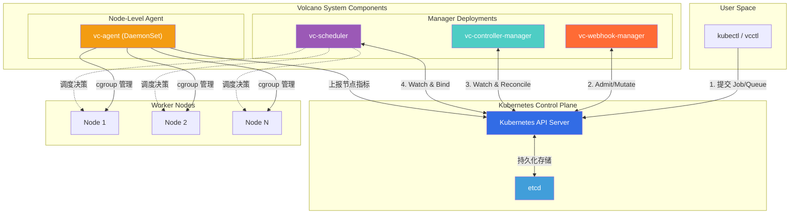
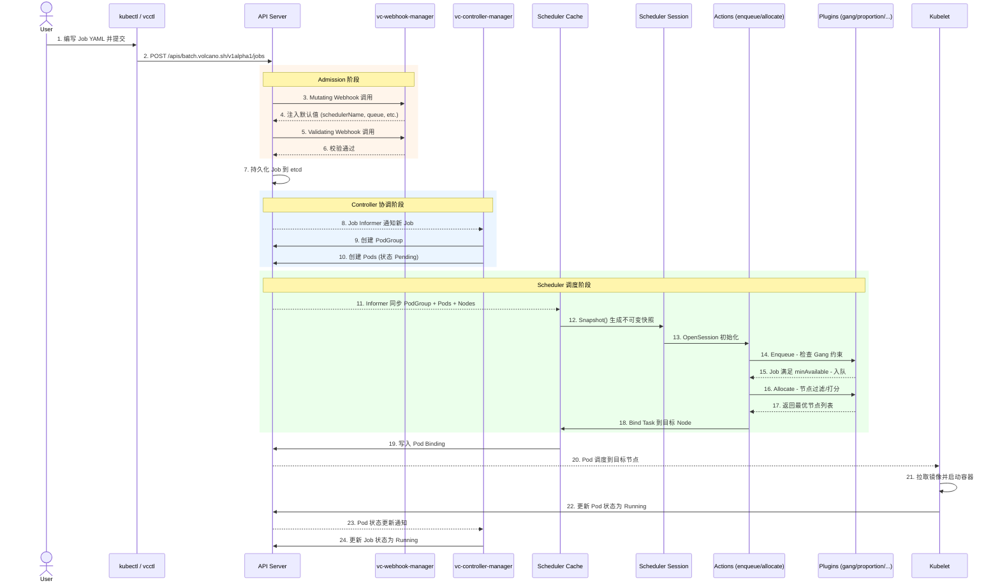
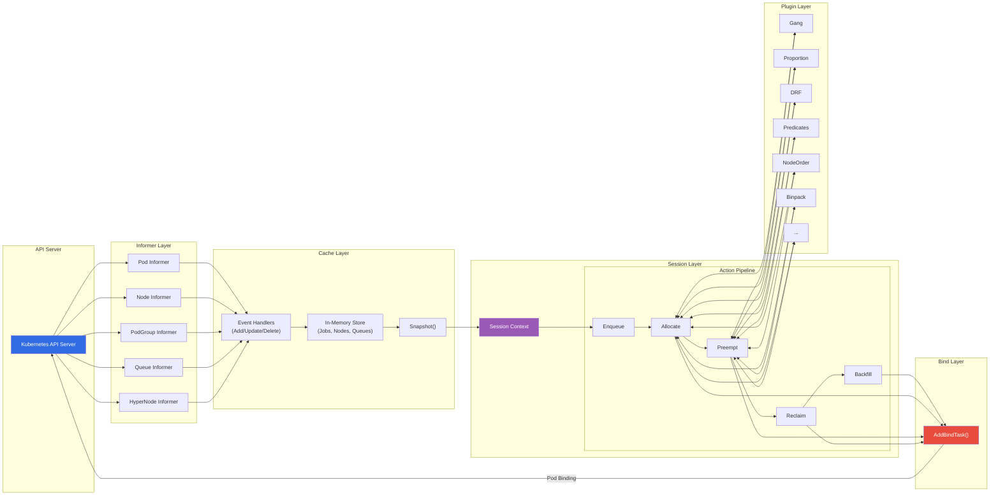
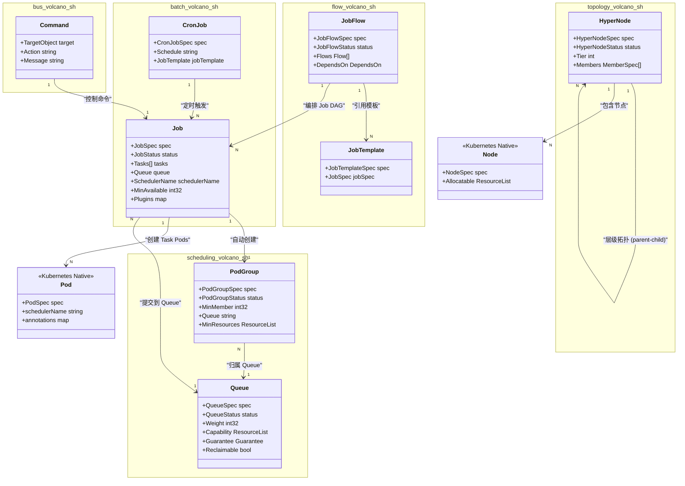

## 1. 整体架构

Volcano 是一个构建在 Kubernetes 之上的高性能批量计算调度引擎，专为 AI/ML、大数据、HPC 等高吞吐计算场景设计。在 Kubernetes 集群中，Volcano 以一组协作组件的形式部署，通过 CRD（Custom Resource Definition）扩展 Kubernetes 原生 API，提供 Job 生命周期管理、Gang Scheduling、队列管理、公平调度等核心能力。

Volcano 的整体架构由 **5 个核心组件** 构成，所有组件均通过 Kubernetes API Server 进行通信和协调：

| 组件 | 部署形态 | 核心职责 |
|------|---------|---------|
| **vc-scheduler** | Deployment | 批量调度器，执行 Action/Plugin 调度流水线 |
| **vc-controller-manager** | Deployment | 控制器管理器，管理 Job、Queue、PodGroup 等资源的生命周期 |
| **vc-webhook-manager** | Deployment | Admission Webhook，负责资源的校验（Validate）与变更（Mutate） |
| **vc-agent** | DaemonSet | 节点代理，负责混部场景下的资源监控与 cgroup 管理 |
| **vcctl** | CLI 工具 | 命令行客户端，提供 Job 管理操作接口 |

以下架构图展示了这 5 个组件在 Kubernetes 集群中的部署关系及其与 API Server 的交互模式：



从架构图中可以看出，Volcano 遵循 Kubernetes 的 **声明式 API + 控制器** 设计范式。所有组件都不直接相互通信，而是以 API Server 作为唯一的数据交换中心。这种松耦合的架构设计使得各组件可以独立扩缩容、独立升级，同时保证了系统的高可用性。

---

## 2. 核心组件

### 2.1 vc-scheduler - 调度器

**入口文件**：`cmd/scheduler/main.go`

vc-scheduler 是 Volcano 的核心调度引擎，负责将待调度的 Pod（以 PodGroup 为调度单位）分配到合适的节点上运行。与 Kubernetes 默认调度器逐 Pod 调度不同，vc-scheduler 采用批量调度模式，在每个调度周期内同时处理多个 Job 和 PodGroup。

**核心包结构**：

- **`pkg/scheduler/scheduler.go`** - 调度器主循环。`Scheduler` 结构体持有 Cache 引用、Action 列表和 Plugin 配置，通过 `runOnce()` 方法驱动每个调度周期。
- **`pkg/scheduler/cache/`** - 集群状态缓存层。通过 Informer 机制 Watch API Server 中的 Pod、Node、PodGroup、Queue、HyperNode 等资源变更，维护一份集群状态的本地副本。对外提供 `Snapshot()` 接口生成不可变快照。
- **`pkg/scheduler/framework/`** - 调度框架核心。`Session` 是每个调度周期的上下文，包含快照数据（Jobs、Nodes、Queues）和所有注册的 Plugin 回调函数（PredicateFn、NodeOrderFn、PreemptableFn 等）。
- **`pkg/scheduler/actions/`** - 调度动作。每个 Action 实现一个调度阶段：
  - `enqueue` - 将满足条件的 Job 从 Pending 状态入队为 Inqueue
  - `allocate` - 为 Inqueue 的 Job 分配节点资源
  - `preempt` - 同一 Queue 内高优先级 Job 抢占低优先级 Job
  - `reclaim` - 跨 Queue 资源回收（当某 Queue 资源不足时从超额使用的 Queue 回收）
  - `backfill` - 回填调度，利用碎片资源调度小任务
  - `shuffle` - 打乱任务调度顺序，避免饥饿
- **`pkg/scheduler/plugins/`** - 调度算法插件，共 20+ 个，包括：
  - `gang` - Gang Scheduling 保证
  - `proportion` - Queue 资源配额分配
  - `drf` - Dominant Resource Fairness
  - `binpack` - 装箱调度
  - `nodeorder` - 节点打分排序
  - `predicates` - 节点过滤断言
  - `priority` - 任务优先级
  - `numaaware` - NUMA 拓扑感知
  - `network-topology-aware` - 网络拓扑感知（HyperNode）
  - `capacity` - 层级队列容量管理

**调度主循环**的核心逻辑如下：

```go
// pkg/scheduler/scheduler.go - runOnce()
func (pc *Scheduler) runOnce() {
    ssn := framework.OpenSession(pc.cache, plugins, configurations)
    defer framework.CloseSession(ssn)

    for _, action := range actions {
        action.Execute(ssn)
    }
}
```

每个调度周期：先通过 `OpenSession` 从 Cache 创建 Snapshot 并初始化 Session，然后依次执行配置的 Action 序列，最后在 `CloseSession` 时将调度决策刷回 Cache。

### 2.2 vc-controller-manager - 控制器管理器

**入口文件**：`cmd/controller-manager/main.go`

vc-controller-manager 是 Volcano 的资源生命周期管理中心，以多控制器模式运行，每个控制器负责一类 CRD 资源的协调（Reconcile）。

**包路径**：`pkg/controllers/`

管理的控制器列表：

| 控制器 | 包路径 | 职责 |
|-------|-------|------|
| Job Controller | `pkg/controllers/job/` | 管理 Volcano Job 生命周期，创建 PodGroup 和 Pod |
| PodGroup Controller | `pkg/controllers/podgroup/` | 为非 Volcano Job 的 workload 自动创建 PodGroup |
| Queue Controller | `pkg/controllers/queue/` | 管理 Queue 状态，计算资源配额 |
| JobFlow Controller | `pkg/controllers/jobflow/` | 管理 JobFlow 工作流编排 |
| JobTemplate Controller | `pkg/controllers/jobtemplate/` | 管理 JobTemplate 模板资源 |
| CronJob Controller | `pkg/controllers/cronjob/` | 定时任务管理 |
| HyperNode Controller | `pkg/controllers/hypernode/` | 管理网络拓扑 HyperNode 资源 |
| Sharding Controller | `pkg/controllers/sharding/` | 多调度器分片管理 |
| GC Controller | `pkg/controllers/garbagecollector/` | 资源垃圾回收 |

其中 **Job Controller** 是最核心的控制器，它以有限状态机（FSM）的模式管理 Volcano Job 的完整生命周期。当用户创建 Volcano Job 后，Job Controller 自动创建对应的 PodGroup 和所有 Task 对应的 Pod，并持续监控 Pod 状态以更新 Job 状态。

### 2.3 vc-webhook-manager - Webhook 管理器

**入口文件**：`cmd/webhook-manager/main.go`

vc-webhook-manager 实现了 Kubernetes Admission Webhook，在资源创建/更新请求到达 API Server 时进行拦截处理。

**包路径**：`pkg/webhooks/`

支持的 Webhook 类型：

| 资源类型 | 操作 | 说明 |
|---------|------|------|
| Jobs | Validate + Mutate | 校验 Job 配置合法性，自动填充默认值 |
| Queues | Validate + Mutate | 校验 Queue 配置，设置默认权重 |
| PodGroups | Validate + Mutate | 校验 PodGroup 参数 |
| Pods | Mutate | 为 Pod 注入调度器名称等标注 |
| CronJobs | Validate | 校验 CronJob Spec |
| HyperNodes | Validate | 校验 HyperNode 拓扑配置 |
| JobFlows | Validate | 校验 JobFlow DAG 配置 |

Webhook 管理器在资源进入 etcd 之前提供了一道安全屏障，确保所有 Volcano CRD 资源的配置正确性和完整性。

### 2.4 vc-agent - 节点代理

**入口文件**：`cmd/agent/main.go`

vc-agent 以 DaemonSet 形式部署在每个 Worker 节点上，主要服务于**混部（Colocation）** 场景。

**包路径**：`pkg/agent/`

核心能力：
- **资源超卖（Oversubscription）**：监控节点实际资源利用率，计算可超卖资源量并上报
- **cgroup 管理**：对混部场景下的离线任务进行 cgroup 级别的资源隔离和限制
- **健康检查**：节点级别的健康状态监控和上报
- **事件上报**：节点资源变更事件的采集和汇报

### 2.5 vcctl - CLI 工具

**入口文件**：`cmd/cli/`

vcctl 是 Volcano 提供的命令行管理工具，封装了对 Volcano CRD 的常用操作：

- `vsub` - 提交 Job
- `vjobs` - 查看 Job 列表和状态
- `vqueues` - 查看 Queue 列表和状态
- `vcancel` - 取消 Job
- `vsuspend` / `vresume` - 暂停/恢复 Job

---

## 3. 组件交互

Volcano 的各组件通过 Kubernetes API Server 进行间接通信，遵循 Kubernetes 的 Watch-Reconcile 模式。以下是各组件的交互关系：

1. **用户提交 Job**：用户通过 `kubectl` 或 `vcctl` 向 API Server 提交 Volcano Job
2. **Webhook 拦截**：vc-webhook-manager 拦截请求，执行 Validate（校验合法性）和 Mutate（注入默认值）
3. **Controller 协调**：vc-controller-manager 的 Job Controller Watch 到新 Job 后，创建对应的 PodGroup 和 Pods
4. **Scheduler 调度**：vc-scheduler 的 Cache 层 Watch 到新的 PodGroup 和 Pods，在下一个调度周期通过 Action/Plugin 流水线完成调度决策
5. **绑定执行**：Scheduler 将调度结果（Pod-Node Binding）写回 API Server，kubelet 拉起 Pod

以下序列图展示了一个 Volcano Job 从提交到 Pod 运行的完整端到端流程：



### 关键交互说明

**Admission 阶段**（步骤 3-6）：Webhook 管理器作为 API Server 的准入控制插件，在 Job 写入 etcd 之前完成校验和变更注入。Mutating Webhook 会自动为 Job 设置 `schedulerName: volcano`、默认 Queue 名称等字段；Validating Webhook 则校验 Task 配置、minAvailable 值等参数的合法性。

**Controller 协调阶段**（步骤 8-10）：Job Controller 通过 Informer Watch Job 资源变更。当新 Job 到达时，控制器首先创建与 Job 对应的 PodGroup（包含 minAvailable、Queue 等调度元信息），然后根据 Job Spec 中的 Tasks 定义创建对应数量的 Pod。此时 Pod 处于 Pending 状态，等待调度器分配。

**Scheduler 调度阶段**（步骤 11-18）：调度器的 Cache 层通过 Informer 持续同步集群中的 Pod、Node、PodGroup、Queue 等资源。每个调度周期开始时，Cache 生成一份不可变的 Snapshot，用于构建 Session。Session 中依次执行 Enqueue（入队判断）和 Allocate（资源分配）等 Action，每个 Action 内部调用注册的 Plugin 函数完成实际的调度逻辑。

---

## 4. 数据流

Volcano 调度器的数据流形成了一条从 API Server 出发、经过多层处理、最终回到 API Server 的闭环链路：

```
API Server → Informers → Cache → Snapshot → Session → Actions → Plugins → Bind → API Server
```

各层的职责如下：

1. **API Server** - Kubernetes 集群状态的唯一真实来源（Source of Truth）
2. **Informers** - 基于 Watch 机制的增量同步层，将 API Server 中的资源变更推送到 Cache
3. **Cache** - 集群状态的本地缓存，维护 Pod、Node、PodGroup、Queue、HyperNode 等资源的内存表示。Cache 通过 Event Handler 处理资源的 Add/Update/Delete 事件，保持与 API Server 的最终一致性
4. **Snapshot** - Cache 的深拷贝不可变快照。每个调度周期开始时由 `Cache.Snapshot()` 生成，确保调度过程中数据不被并发修改
5. **Session** - 调度周期的运行时上下文。在 `framework.OpenSession()` 中基于 Snapshot 初始化，包含所有 Jobs、Nodes、Queues 数据以及注册的 Plugin 回调函数
6. **Actions** - 调度阶段执行器。按配置顺序依次执行（通常为 enqueue → allocate → preempt → reclaim → backfill），每个 Action 操作 Session 中的数据
7. **Plugins** - 调度算法提供者。Action 执行过程中通过 Session 上注册的回调函数（PredicateFn、NodeOrderFn 等）调用 Plugin 逻辑
8. **Bind** - 调度结果持久化。将 Pod-to-Node 的绑定关系通过 Cache 写回 API Server

以下是 Cache 内部的事件驱动数据流详细展示：



**数据一致性保证**：Cache 层的 Snapshot 机制是调度器数据一致性的关键。由于调度决策可能耗时较长，直接操作 Cache 中的实时数据会导致并发问题。通过在每个调度周期开始时创建 Snapshot 深拷贝，调度过程中所有的状态查询和修改都在这份隔离的快照上进行，不影响 Cache 接收新的 Informer 事件。调度结束后，最终的绑定结果通过 `AddBindTask` 写回 Cache 并提交到 API Server。

---

## 5. CRD 类型关系

Volcano 通过多组 CRD 扩展 Kubernetes API，每组 CRD 属于不同的 API Group，服务于不同的功能域。以下是所有 CRD 类型的分类和关系：

### 5.1 API Group 概览

| API Group | 版本 | 资源类型 | 用途 |
|-----------|------|---------|------|
| `batch.volcano.sh` | v1alpha1 | Job, CronJob | 批量作业定义与定时执行 |
| `scheduling.volcano.sh` | v1beta1 | PodGroup, Queue | 调度单元与队列管理 |
| `topology.volcano.sh` | v1alpha1 | HyperNode | 网络拓扑感知调度 |
| `flow.volcano.sh` | v1alpha1 | JobFlow, JobTemplate | 工作流编排 |
| `bus.volcano.sh` | v1alpha1 | Command | Job 控制命令传递 |

### 5.2 CRD 关系图

以下类图展示了 Volcano 各 CRD 类型之间的关联关系：



### 5.3 核心 CRD 关系说明

**Job 与 PodGroup 的一对一关系**：当用户提交 Volcano Job 后，Job Controller 自动为其创建一个同名的 PodGroup。PodGroup 是调度器的基本调度单元，它定义了 Gang Scheduling 所需的最小就绪 Pod 数量（`minMember`）和队列归属。调度器以 PodGroup 而非单个 Pod 为粒度进行调度决策。

**Job 与 Queue 的多对一关系**：所有 Job 通过 `spec.queue` 字段指定其归属的 Queue。Queue 定义了资源配额（`capability`）、权重（`weight`）和资源保障（`guarantee`），调度器的 proportion 等插件基于 Queue 维度进行资源划分和公平调度。

**JobFlow 的 DAG 编排**：JobFlow 通过引用 JobTemplate 定义一组有依赖关系的 Job 执行图。每个 Flow 节点可以指定 `dependsOn` 来声明前置依赖，JobFlow Controller 根据依赖关系按序创建和管理 Job。

**HyperNode 的层级拓扑**：HyperNode 是 Volcano 的网络拓扑抽象，通过 `tier` 字段表示拓扑层级（如 Rack、Switch、DataCenter），通过 `members` 字段关联子 HyperNode 或 Node。调度器在 Session 初始化时构建完整的 HyperNode 拓扑树，用于网络拓扑感知调度 -- 将同一 Job 的 Pod 尽量调度到网络距离最近的节点上。

**Command 的控制传递**：Command 是 Volcano 的内部控制信号 CRD，属于 `bus.volcano.sh` API Group。当用户通过 vcctl 执行 `vsuspend`、`vresume` 等操作时，实际是创建一个 Command 对象指向目标 Job，Job Controller Watch 到 Command 后执行对应的状态转换。

---

## 6. 小结

Volcano 的架构设计体现了以下几个关键原则：

1. **松耦合通信**：所有组件通过 API Server 间接通信，无组件间直连依赖
2. **可扩展的调度流水线**：Action + Plugin 架构允许灵活组合调度策略，用户可自定义 Plugin 扩展调度算法
3. **批量调度优先**：以 PodGroup 而非 Pod 为调度单位，原生支持 Gang Scheduling
4. **多层缓存与快照隔离**：Informer → Cache → Snapshot 的多层数据流设计，兼顾实时性和一致性
5. **声明式资源管理**：通过 CRD 扩展 Kubernetes 原生 API，所有资源管理遵循 Kubernetes 的声明式设计模式

理解这些架构核心后，可以进一步深入各组件的实现细节。建议的阅读路径为：先从 vc-scheduler 的调度主循环入手（`pkg/scheduler/scheduler.go`），再深入 Action 和 Plugin 的执行逻辑，最后研究 Controller 和 Webhook 的实现。
