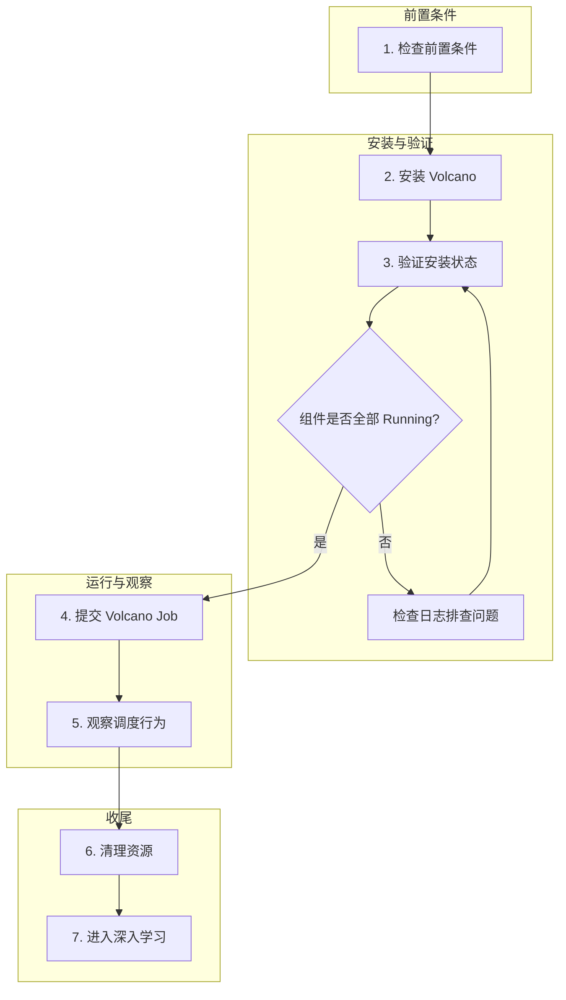
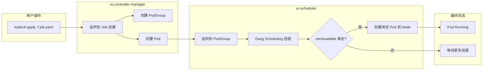

本文档将引导你在 Kubernetes 集群中完成 Volcano 的安装、验证，并提交第一个 Volcano Job，帮助你快速理解 Volcano 的核心调度流程。

## 整体流程

以下流程图展示了从环境准备到成功运行第一个 Volcano Job 的完整步骤。



---

## 1. 前置条件

在开始之前，请确保你的环境满足以下要求：

| 依赖项 | 最低版本 | 说明 |
|--------|---------|------|
| Kubernetes 集群 | v1.24+ | 可以使用 Kind、Minikube 或云厂商托管集群 |
| kubectl | 与集群版本匹配 | 用于与集群交互的命令行工具 |
| Helm | v3.0+ | 仅在使用 Helm 方式安装时需要 |

验证环境是否就绪：

```bash
# 检查 Kubernetes 集群版本
kubectl version --short

# 检查集群节点状态
kubectl get nodes

# 检查 Helm 版本（如使用 Helm 安装）
helm version
```

确保集群节点处于 `Ready` 状态，且 Kubernetes 版本不低于 v1.24。

---

## 2. 安装 Volcano

Volcano 提供两种安装方式，你可以根据实际需求选择其中一种。

### 方式一 - 通过 Helm 安装（推荐）

Helm 安装方式提供了更灵活的配置能力，适合生产环境使用。

```bash
# 添加 Volcano Helm 仓库
helm repo add volcano-sh https://volcano-sh.github.io/helm-charts

# 更新仓库索引
helm repo update

# 安装 Volcano 到 volcano-system 命名空间
helm install volcano volcano-sh/volcano -n volcano-system --create-namespace
```

如果需要自定义配置，可以通过 `--set` 参数或自定义 `values.yaml` 文件进行覆盖：

```bash
# 示例 - 自定义调度器副本数
helm install volcano volcano-sh/volcano \
  -n volcano-system \
  --create-namespace \
  --set custom.scheduler_replicas=2
```

### 方式二 - 通过 Manifest 安装

适用于快速体验或不便使用 Helm 的环境。

```bash
kubectl apply -f https://raw.githubusercontent.com/volcano-sh/volcano/master/installer/volcano-development.yaml
```

> **注意**：Manifest 方式使用的是开发版本配置，默认会创建 `volcano-system` 命名空间并部署所有核心组件。生产环境建议使用 Helm 方式安装以获得更好的配置管理能力。

---

## 3. 验证安装

安装完成后，检查 Volcano 核心组件的运行状态：

```bash
kubectl get pods -n volcano-system
```

预期输出如下（Pod 名称中的哈希值会有所不同）：

```
NAME                                       READY   STATUS    RESTARTS   AGE
volcano-admission-5bd5756f79-kbtmk         1/1     Running   0          60s
volcano-controllers-687948d9c8-ls4jg       1/1     Running   0          60s
volcano-scheduler-6c5f8d8c9d-wghdp        1/1     Running   0          60s
```

你应该看到以下三个核心组件均处于 `Running` 状态：

| 组件 | 对应 Deployment | 职责 |
|------|----------------|------|
| **vc-scheduler** | `volcano-scheduler` | Volcano 调度器，负责 Pod 的批量调度决策 |
| **vc-controller-manager** | `volcano-controllers` | 控制器管理器，负责 Job、Queue 等资源的生命周期管理 |
| **vc-webhook-manager** | `volcano-admission` | Webhook 准入控制器，负责资源校验与默认值注入 |

如果某个组件未处于 `Running` 状态，可以通过以下命令查看详细日志：

```bash
# 查看调度器日志
kubectl logs -n volcano-system -l app=volcano-scheduler

# 查看控制器日志
kubectl logs -n volcano-system -l app=volcano-controller

# 查看 Webhook 日志
kubectl logs -n volcano-system -l app=volcano-admission
```

同时验证 Volcano 的 CRD 已正确注册：

```bash
kubectl get crd | grep volcano
```

应当看到 `jobs.batch.volcano.sh`、`podgroups.scheduling.volcano.sh`、`queues.scheduling.volcano.sh` 等自定义资源定义。

---

## 4. 提交第一个 Volcano Job

### 编写 Job YAML

创建一个名为 `hello-volcano.yaml` 的文件，定义一个包含两个 Task 的 Volcano Job：

```yaml
apiVersion: batch.volcano.sh/v1alpha1
kind: Job
metadata:
  name: hello-volcano
spec:
  minAvailable: 2
  schedulerName: volcano
  queue: default
  tasks:
    - replicas: 1
      name: "task-a"
      template:
        spec:
          containers:
            - name: hello
              image: busybox:1.36
              imagePullPolicy: IfNotPresent
              command: ["sh", "-c", "echo 'Hello Volcano from Task A'; sleep 30"]
              resources:
                requests:
                  cpu: "100m"
                  memory: "128Mi"
          restartPolicy: OnFailure
    - replicas: 1
      name: "task-b"
      template:
        spec:
          containers:
            - name: hello
              image: busybox:1.36
              imagePullPolicy: IfNotPresent
              command: ["sh", "-c", "echo 'Hello Volcano from Task B'; sleep 30"]
              resources:
                requests:
                  cpu: "100m"
                  memory: "128Mi"
          restartPolicy: OnFailure
```

**关键字段说明**：

- `apiVersion: batch.volcano.sh/v1alpha1` - Volcano Job 的 API 版本
- `kind: Job` - 资源类型为 Volcano Job（非 Kubernetes 原生 Job）
- `spec.minAvailable: 2` - 最少需要 2 个 Pod 同时可调度，Job 才会开始运行（Gang Scheduling 的核心参数）
- `spec.schedulerName: volcano` - 指定使用 Volcano 调度器
- `spec.queue: default` - 将 Job 提交到 `default` 队列
- `spec.tasks` - 定义了两个 Task，每个 Task 包含 1 个副本

### 提交 Job

```bash
kubectl apply -f hello-volcano.yaml
```

### 监控 Job 状态

```bash
# 查看 Volcano Job 状态
kubectl get vcjob

# 预期输出
# NAME             STATUS    MINAVAILABLE   RUNNINGS   AGE
# hello-volcano    Running   2              2          30s

# 查看 Job 创建的 Pod
kubectl get pods -l volcano.sh/job-name=hello-volcano

# 预期输出
# NAME                        READY   STATUS    RESTARTS   AGE
# hello-volcano-task-a-0      1/1     Running   0          25s
# hello-volcano-task-b-0      1/1     Running   0          25s
```

当 Job 的 `STATUS` 变为 `Running` 且 `RUNNINGS` 等于 `minAvailable` 值时，说明 Gang Scheduling 条件已满足，所有 Task 已被同时调度。

---

## 5. 观察调度行为

### 查看 Job 详情

```bash
kubectl describe vcjob hello-volcano
```

在 `Events` 部分可以观察到 Job 的完整生命周期事件，包括 Job 创建、PodGroup 创建、Pod 调度等关键事件。

### 查看 PodGroup

PodGroup 是 Volcano 实现 Gang Scheduling 的核心资源。每个 Volcano Job 会自动创建一个对应的 PodGroup。

```bash
kubectl get podgroup

# 预期输出
# NAME             STATUS    MINMEMBER   RUNNINGS   AGE
# hello-volcano    Running   2           2          45s
```

`MINMEMBER` 对应 Job 中的 `minAvailable`，`RUNNINGS` 表示当前正在运行的 Pod 数量。只有当 `RUNNINGS >= MINMEMBER` 时，PodGroup 才会进入 `Running` 状态。

### 查看 Queue

Queue 是 Volcano 的资源管理单元，用于控制资源配额和调度优先级。

```bash
kubectl get queue

# 预期输出
# NAME      WEIGHT   STATE   INQUEUE   PENDING   RUNNING   UNKNOWN   AGE
# default   1        Open    0         0         1         0         5m
```

### 调度流程解析

从提交 Job 到 Pod 运行，Volcano 内部的调度流程如下：



整个调度过程可以总结为以下步骤：

1. **Job 创建** - 用户通过 `kubectl apply` 提交 Volcano Job 到 API Server
2. **Controller 响应** - `vc-controller-manager` 监听到新的 Job 资源，自动创建对应的 PodGroup 和 Pod
3. **调度决策** - `vc-scheduler` 监听到待调度的 PodGroup，执行 Gang Scheduling 策略检查
4. **资源检查** - 调度器检查集群中是否有足够资源同时满足 `minAvailable` 个 Pod 的需求
5. **批量调度** - 如果资源满足条件，调度器将所有 Pod 批量绑定到合适的 Node；否则所有 Pod 保持 Pending 状态，避免资源死锁
6. **Pod 运行** - Pod 被调度后由 kubelet 拉起容器，Job 进入 `Running` 状态

这种 "全部满足才调度" 的机制就是 **Gang Scheduling**（成组调度），是 Volcano 区别于 Kubernetes 默认调度器的核心特性之一。

---

## 6. 清理资源

实验完成后，清理创建的 Volcano Job 及其关联资源：

```bash
# 删除 Volcano Job（关联的 Pod 和 PodGroup 会被自动清理）
kubectl delete vcjob hello-volcano

# 验证资源已清理
kubectl get vcjob
kubectl get pods -l volcano.sh/job-name=hello-volcano
```

如果需要卸载 Volcano：

```bash
# Helm 安装方式卸载
helm uninstall volcano -n volcano-system
kubectl delete namespace volcano-system

# Manifest 安装方式卸载
kubectl delete -f https://raw.githubusercontent.com/volcano-sh/volcano/master/installer/volcano-development.yaml
```

---

## 7. 下一步

完成快速开始后，建议按照以下路径继续深入学习：

- **[核心概念](./04-key-concepts.md)** - 深入理解 Job、PodGroup、Queue、Action、Plugin 等 Volcano 核心抽象
- **[架构概览](./01-architecture.md)** - 了解 Volcano 的整体架构设计和各组件的协作关系
- **[调度器源码解析](../02-scheduler/01-overview.md)** - 从源码层面理解 vc-scheduler 的调度流程
- **[控制器源码解析](../03-controller/01-overview.md)** - 深入 vc-controller-manager 的 Job 生命周期管理逻辑
- **[Queue 管理](../01-queue/01-overview.md)** - 学习如何通过 Queue 实现多租户资源隔离与共享

> **提示**：如果你希望在本地搭建开发环境并参与 Volcano 的开发，请参考项目根目录下的 `DEVELOPMENT.md` 文档。
