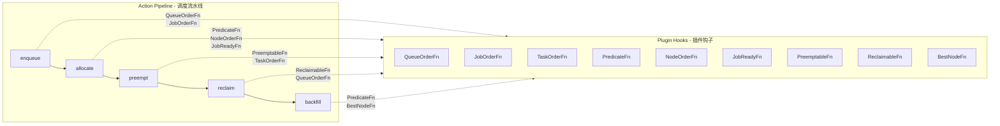
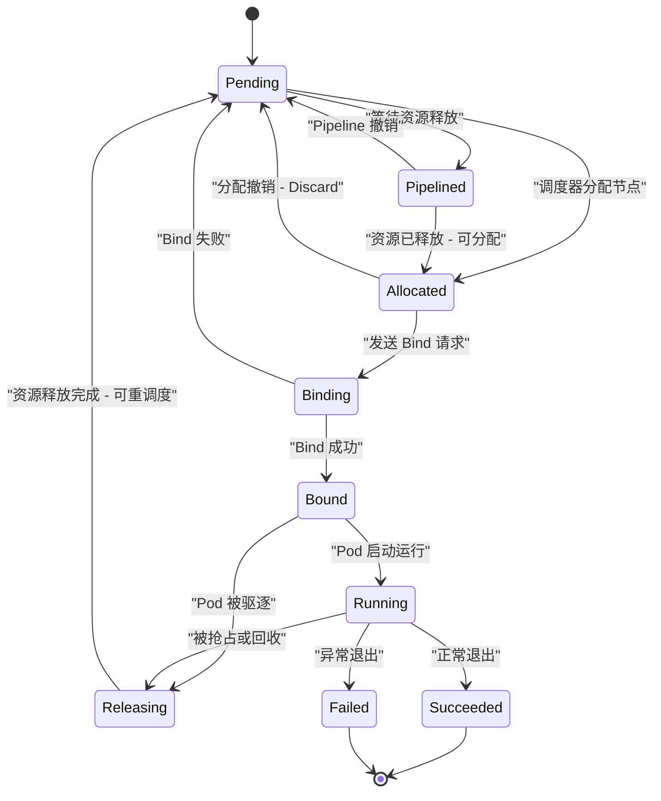

本文档系统性地介绍 Volcano 调度系统中的核心概念与设计原语。理解这些概念是深入阅读 Volcano 源码、进行二次开发与生产调优的前提。文中涉及的所有技术术语均保留英文原名以保持与代码的一致性。

---

## 1. Volcano Job 与 Kubernetes Job 的区别

Kubernetes 原生 Job 面向的是单一容器模板的批处理场景：一个 Job 定义一种 Pod 模板，通过 `completions` 和 `parallelism` 控制并发与完成数量。这一模型在传统的 MapReduce、批量数据处理等场景下已经足够，但在分布式机器学习训练、大规模科学计算等场景中存在明显局限。

Volcano Job（`vcjob`，API Group `batch.volcano.sh/v1alpha1`）在以下维度进行了根本性增强：

- **多 Task 支持**：一个 Volcano Job 可以包含多个 Task，每个 Task 拥有独立的 Pod 模板、副本数（`replicas`）和资源需求。例如一个分布式训练作业可同时定义 `ps`（Parameter Server）和 `worker` 两种 Task，各自使用不同的镜像和资源配额。
- **Gang Scheduling 语义**：Volcano Job 天然关联 PodGroup，支持"全部或无"的调度语义，确保一个作业的所有关键 Pod 要么同时获得资源，要么全部不被调度，从根本上避免资源死锁。
- **生命周期策略（Lifecycle Policies）**：通过 `policies` 字段，用户可以声明作业在特定事件（如某个 Task 失败、Pod 被驱逐）发生时的行为——重启整个作业、终止作业、或仅重启失败的 Task。
- **插件体系**：Volcano Job 控制器内置了 `svc`、`ssh`、`env` 等插件，可自动为作业创建 Headless Service、注入 SSH 免密配置或环境变量，大幅简化分布式作业的部署复杂度。
- **队列绑定**：每个 Volcano Job 必须指定所属 Queue，从而纳入集群级别的资源配额管理与公平调度体系。

相比之下，Kubernetes 原生 Job 不具备 Gang 语义，无法在多 Task 间协调调度，也缺乏队列级别的资源隔离能力。

---

## 2. PodGroup - 调度单元

PodGroup 是 Volcano 调度系统的核心调度单元（API `scheduling.volcano.sh/v1beta1`）。它将一组逻辑上属于同一作业的 Pod 聚合在一起，为 Gang Scheduling 提供分组基础。

### 2.1 核心字段

| 字段 | 说明 |
|------|------|
| `spec.minMember` | 该 PodGroup 至少需要同时调度成功的 Pod 数量，是 Gang Scheduling 的阈值 |
| `spec.minResources` | PodGroup 请求的最小资源总量，用于 Enqueue 阶段判断集群资源是否充足 |
| `spec.queue` | 所属 Queue 名称，决定该 PodGroup 的资源配额来源 |
| `spec.priorityClassName` | 优先级类名，影响调度排序 |

### 2.2 创建方式

PodGroup 的创建存在两种路径：

1. **自动创建**：当用户提交 Volcano Job 时，`vcjob-controller` 会根据 Job 的 `minAvailable` 和 Task 定义自动创建对应的 PodGroup。
2. **手动定义**：对于非 Volcano Job 管理的工作负载（如 Spark Operator、PyTorch Operator 等），用户可手动创建 PodGroup，并在 Pod 的 Annotation 中通过 `scheduling.k8s.io/group-name` 将 Pod 关联到该 PodGroup。

### 2.3 生命周期阶段

PodGroup 在其生命周期中经历以下阶段（定义于 `scheduling/types.go`）：

| 阶段 | 含义 |
|------|------|
| **Pending** | PodGroup 已被系统接受，但调度器尚无法为其分配足够资源 |
| **Inqueue** | 调度器判定集群资源可能满足该 PodGroup 的最小需求，将其放入调度队列，控制器可以开始创建 Pod |
| **Running** | PodGroup 中至少 `minMember` 个 Pod 已处于 Running 状态 |
| **Completed** | PodGroup 中所有 Pod 已完成 |
| **Unknown** | 部分 `minMember` Pod 正在运行，但其余 Pod 无法被调度，状态异常 |

这一状态模型中，**Inqueue 阶段**是 Volcano 的独特设计——它在 Pending 与 Running 之间引入了一个"准入就绪"状态，避免了在资源不足时盲目创建 Pod 导致的资源浪费。

---

## 3. Queue - 资源隔离与共享

Queue 是 Volcano 集群级别的资源管理单元（API `scheduling.volcano.sh/v1beta1`），用于在多租户场景下对集群资源进行逻辑分区。

### 3.1 核心属性

| 属性 | 说明 |
|------|------|
| **Weight** | Queue 的权重值，Proportion 插件根据各 Queue 的权重按比例分配集群资源 |
| **Capability** | Queue 可使用的资源上限（硬上限），防止单个 Queue 过度占用集群资源 |
| **Guarantee** | Queue 的资源保证量（硬下限），即使集群负载很高也会为该 Queue 预留的最低资源量 |
| **Reclaimable** | 是否允许其他 Queue 回收该 Queue 的空闲资源，默认为 `true` |

### 3.2 层级队列

Volcano 支持通过 Annotation（`volcano.sh/hierarchy` 和 `volcano.sh/hierarchy-weights`）定义队列的层级结构（Parent/Child 关系）。层级队列允许组织按部门、项目进行多级资源划分，每一级都有独立的权重配置。DRF 插件支持层级感知的资源公平分配（Hierarchical DRF）。

### 3.3 队列状态

| 状态 | 含义 |
|------|------|
| **Open** | 队列正常工作，接受新作业提交 |
| **Closed** | 队列已关闭，不接受新作业，且队列内无运行中的作业 |
| **Closing** | 队列正在关闭中，不接受新作业，但已有作业仍在运行 |
| **Unknown** | 队列状态未知 |

### 3.4 资源分配插件

Queue 的资源分配逻辑由调度插件实现，主要包括：

- **Proportion**：根据 Weight 按比例分配集群总资源，是默认的队列资源分配方案。
- **Capacity**：提供更精细的容量管理，支持 Guarantee 和 Capability 的严格约束。
- **DRF**：在 Queue 内部按照 Dominant Resource Fairness 算法分配资源。

---

## 4. Actions 与 Plugins - 调度流水线

Volcano 调度器的核心架构是一个由 **Actions** 和 **Plugins** 组成的可扩展流水线。每个调度周期（Session），调度器按配置顺序依次执行各 Action，每个 Action 在执行过程中调用 Plugin 注册的 Hook 函数来获取调度决策。

### 4.1 Actions 执行顺序

调度器默认的 Action 执行顺序为：

1. **enqueue** - 将满足条件的 PodGroup 从 Pending 状态转为 Inqueue，允许控制器开始创建 Pod
2. **allocate** - 核心分配阶段，为待调度的 Task 选择合适的节点并绑定资源
3. **preempt** - 同一 Queue 内的抢占，高优先级作业抢占低优先级作业的资源
4. **reclaim** - 跨 Queue 的资源回收，资源使用超额的 Queue 向资源不足的 Queue 让渡资源
5. **backfill** - 回填阶段，为不需要 Gang Scheduling 的小作业（如 BestEffort Pod）填充空闲资源

此外还有 **shuffle** Action，用于在调度周期中随机打乱作业顺序以避免饥饿。

### 4.2 Plugin Hook 机制

Plugin 通过在 `OnSessionOpen` 方法中向 Session 注册各类 Hook 函数来参与调度决策。主要的 Hook 接口包括：

| Hook 函数 | 作用 |
|-----------|------|
| `JobOrderFn` | 决定作业的调度优先级排序 |
| `QueueOrderFn` | 决定 Queue 的处理顺序 |
| `TaskOrderFn` | 决定 Task 在 Job 内的调度顺序 |
| `PredicateFn` | 节点过滤，判断 Task 是否可以运行在指定节点 |
| `NodeOrderFn` | 节点打分，为候选节点排序 |
| `PreemptableFn` | 判断 Task 是否可被抢占 |
| `ReclaimableFn` | 判断 Task 是否可被回收 |
| `JobReadyFn` | 判断 Job 是否满足调度就绪条件（如 Gang 约束） |
| `JobPipelinedFn` | 判断 Job 是否处于 Pipelined 状态 |
| `BestNodeFn` | 在所有候选节点中选择最优节点 |

### 4.3 Tier 组织

Plugins 通过 `Tier` 进行分层组织（定义于 `conf.SchedulerConfiguration`）。同一 Tier 内的 Plugin 按注册顺序执行，Tier 之间按优先级从高到低排列。这种分层设计允许用户灵活控制不同插件的执行优先级。

### 4.4 当前注册的 Plugins

截至当前代码版本，Volcano 注册了 22 个 Plugin（定义于 `plugins/factory.go`）：

**作业调度类**：`drf`、`gang`、`deviceshare`、`predicates`、`priority`、`nodeorder`、`conformance`、`binpack`、`resource-strategy-fit`、`tdm`、`overcommit`、`sla`、`task-topology`、`numaaware`、`cdp`、`rescheduling`、`usage`、`pdb`、`nodegroup`、`network-topology-aware`

**队列管理类**：`proportion`、`capacity`

**扩展类**：`extender`、`resourcequota`

---

## 5. Gang Scheduling - 全部或无

Gang Scheduling 是 Volcano 最核心的调度语义之一，其基本原则是：**一个 PodGroup 中的所有必需 Pod 要么同时被调度，要么全部不被调度**。

### 5.1 工作原理

Gang Scheduling 由 `gang` 插件实现。该插件通过注册 `JobReadyFn`、`JobPipelinedFn` 和 `JobValidFn` 等 Hook 函数，在 allocate Action 的执行过程中强制执行 Gang 约束：

1. 调度器为 PodGroup 中的每个 Task 尝试分配节点资源。
2. 分配完成后，检查已成功分配的 Task 数量是否达到 `minAvailable` 阈值。
3. 若达到阈值，调度器执行 Commit 操作，将所有分配结果提交到 API Server。
4. 若未达到阈值，调度器执行 Discard 操作，撤销本轮所有分配，所有资源归还。

### 5.2 MinAvailable 阈值

`minAvailable` 定义了 PodGroup 中至少需要同时运行的 Pod 数量。该值可以在 Volcano Job 的 `spec.minAvailable` 字段中指定，也可以在 PodGroup 的 `spec.minMember` 字段中直接设定。

Volcano 还支持 Task 级别的 `minAvailable`（通过 `spec.tasks[*].minAvailable`），允许更细粒度地控制每种 Task 类型的最低副本数。

### 5.3 防止资源死锁

在没有 Gang Scheduling 的情况下，分布式训练场景中极易发生死锁。例如：集群剩余 4 个 GPU，两个作业各需要 4 个 GPU。如果每个作业各被分配了 2 个 GPU，两个作业都无法启动，4 个 GPU 被浪费。Gang Scheduling 通过"全部或无"语义从根本上杜绝了此类问题。

---

## 6. 公平分享 - DRF 与 Proportion

### 6.1 DRF - Dominant Resource Fairness

DRF（Dominant Resource Fairness）算法是 Volcano 实现多资源维度公平调度的核心算法。在多资源（CPU、内存、GPU 等）场景下，不同作业对资源的需求比例不同。DRF 的核心思想是：

1. 对于每个作业，计算其在各类资源上的占用份额（share）。
2. 取占用份额最大的资源维度作为该作业的 **Dominant Resource**（支配性资源）。
3. 调度时优先将资源分配给 Dominant Resource Share 最小的作业，从而实现全局公平。

Volcano 的 DRF 插件（`pkg/scheduler/plugins/drf`）还支持 **Hierarchical DRF（HDRF）**，即层级感知的公平调度。在层级队列场景下，HDRF 按照队列树的层级结构逐层进行 DRF 计算，确保每一级的资源分配都是公平的。

### 6.2 Proportion - 基于权重的资源分配

Proportion 插件（`pkg/scheduler/plugins/proportion`）实现了基于 Queue Weight 的资源按比例分配：

1. 收集集群总可用资源和所有 Queue 的 Weight。
2. 按照 `queue.weight / totalWeight` 的比例计算每个 Queue 应得的资源量（`deserved`）。
3. 同时考虑 Guarantee（保证量）和 Capability（上限），确保 `deserved` 不低于 Guarantee、不超过 Capability。
4. 在 Enqueue 和 Allocate 阶段，依据 `deserved` 判断 Queue 是否还有配额可用。

---

## 7. 抢占与回收 - Preemption 与 Reclaim

Volcano 区分了两种不同的资源争用机制：**Preemption**（抢占）和 **Reclaim**（回收），二者的作用域和触发条件不同。

### 7.1 Preemption - 同队列抢占

Preemption 发生在 **同一 Queue 内部**，由 `preempt` Action 执行：

- 高优先级的作业可以抢占同一 Queue 中低优先级作业的资源。
- `gang` 插件通过 `PreemptableFn` 控制哪些 Task 可以被抢占（例如不能抢占到导致被抢占作业的 Running Pod 数低于其 `minAvailable`）。
- 被抢占的 Pod 会被驱逐（Evict），其资源被释放后分配给抢占者。

### 7.2 Reclaim - 跨队列回收

Reclaim 发生在 **不同 Queue 之间**，由 `reclaim` Action 执行：

- 当某个 Queue 的实际资源使用量超过其 `deserved`（应得资源量）时，该 Queue 的部分 Task 可以被其他资源不足的 Queue 回收。
- Reclaim 仅在目标 Queue 的 `reclaimable` 属性为 `true` 时才允许执行。
- `proportion` 或 `capacity` 插件通过 `ReclaimableFn` 判断哪些 Task 属于"超额使用"的部分，可以安全回收。

这种区分使得 Volcano 能够在保证队列间公平性的同时，允许队列内部按优先级灵活调度。

---

## 8. 网络拓扑 - HyperNode

HyperNode 是 Volcano 引入的网络拓扑感知调度抽象（API `topology.volcano.sh/v1alpha1`），用于建模数据中心的物理网络拓扑层级（交换机、机架、机房等）。

### 8.1 层级拓扑模型

HyperNode 将集群节点组织为一棵多层级的拓扑树：

- **Tier 1**（叶子层）：直接包含物理节点（Kubernetes Node），通常对应同一 ToR 交换机下的节点。
- **Tier 2**：聚合多个 Tier 1 HyperNode，通常对应一个机架或 Pod 交换机。
- **Tier N**（更高层）：逐级聚合，可建模整个数据中心的网络拓扑。

每个 HyperNode 通过 `spec.members` 声明其子节点（可以是 Node 或下级 HyperNode），通过 `spec.tier` 声明其所在层级。

### 8.2 拓扑调度模式

`network-topology-aware` 插件支持两种拓扑约束模式：

- **Hard 模式**：严格要求同一 PodGroup 的所有 Pod 必须调度到同一个指定 Tier 的 HyperNode 内部。如果无法满足拓扑约束，调度将失败。
- **Soft 模式**：尽量将 Pod 调度到网络拓扑相近的节点上，但不强制。通过 NodeOrder 打分机制，网络距离更近的节点获得更高分数。

### 8.3 应用场景

HyperNode 在大规模 GPU 训练场景中尤为重要：同一训练作业的多个 Worker 之间需要频繁进行 AllReduce 通信，将它们调度到同一 ToR 交换机下（低延迟、高带宽）可以显著提升训练效率。

---

## 9. Task 状态生命周期

在 Volcano 调度器内部，每个 Task（对应一个 Pod）都有明确的状态流转模型（定义于 `pkg/scheduler/api/types.go`）。理解 Task 的状态机是理解调度器内部行为的关键。

### 9.1 状态定义

| 状态 | 含义 |
|------|------|
| **Pending** | Task 已存在于 API Server 中，等待调度器处理 |
| **Allocated** | 调度器已为 Task 选定目标节点，资源已从节点账本中扣除 |
| **Pipelined** | 调度器为 Task 预留了目标节点，但该节点正在等待其他 Task 释放资源（Preempt/Reclaim 的中间状态） |
| **Binding** | 调度器已向 API Server 发送 Bind 请求，等待确认 |
| **Bound** | Task 已成功绑定到目标节点 |
| **Running** | Task 对应的 Pod 正在目标节点上运行 |
| **Releasing** | Task 对应的 Pod 正在被删除或驱逐 |
| **Succeeded** | Pod 中所有容器正常退出（exit code 0） |
| **Failed** | Pod 中至少一个容器异常退出 |
| **Unknown** | Task 状态未知 |

### 9.2 状态流转图

### 9.3 关键状态转换说明

- **Pending -> Allocated**：这是调度器 `allocate` Action 的核心输出。调度器通过 Predicate 过滤和 NodeOrder 打分选择最优节点后，将 Task 状态设为 Allocated，同时从节点的可用资源中扣减相应资源量。
- **Pending -> Pipelined**：当 Preempt 或 Reclaim Action 决定驱逐某些低优先级 Task 时，等待被释放资源的新 Task 进入 Pipelined 状态。这是一种"乐观预留"——资源尚未真正释放，但已经承诺给了新 Task。
- **Allocated -> Binding -> Bound -> Running**：这是 Task 从调度决策到实际运行的完整路径。Statement 的 Commit 操作触发 Bind 请求，API Server 确认后 Task 进入 Bound 状态，随后 kubelet 拉起容器，Task 进入 Running 状态。
- **Running -> Releasing**：当 Task 被抢占或回收时，其状态转为 Releasing，对应的 Pod 会被删除。释放的资源可以被其他 Task 使用。

---

## 总结

Volcano 通过 Volcano Job、PodGroup、Queue、Actions、Plugins 等核心概念构建了一个完整的高性能批处理调度体系。这些概念彼此配合：Job 定义作业结构，PodGroup 提供 Gang Scheduling 分组，Queue 实现资源隔离与共享，Actions 和 Plugins 构成可扩展的调度流水线，而 HyperNode 将调度决策扩展到网络拓扑维度。理解这些概念之间的关联关系，是掌握 Volcano 调度器工作原理的基础。
