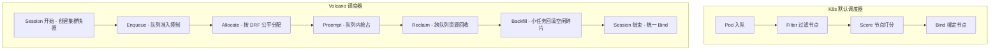
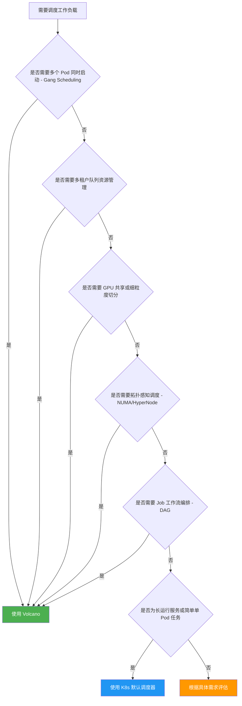

## 概述

Kubernetes 默认调度器（kube-scheduler）是一个通用型 Pod 调度器，其设计目标是满足大多数无状态服务和简单工作负载的调度需求。Volcano 是 CNCF 下的高性能批处理调度系统，专门面向 AI/ML 训练、大数据处理、HPC 等对调度能力有更高要求的场景。本文从功能、调度模型、适用场景等维度对两者进行系统性对比，为技术选型和迁移提供参考。

---

## 1. 功能对比矩阵

| 特性 | K8s 默认调度器 | Volcano |
|------|---------------|---------|
| Gang Scheduling | 不支持 | 支持 - 基于 PodGroup 的 minAvailable 语义，确保一组 Pod 同时获得资源或全部等待 |
| Queue Management | 不支持（仅有 ResourceQuota 做命名空间级别的硬限制） | 支持 - 提供 Weight、Capability、Guarantee 三级队列资源管控，支持层级队列（Hierarchical Queue） |
| Fair Sharing (DRF) | 不支持 | 支持 - 实现 Dominant Resource Fairness 算法，按主导资源比例在队列间公平分配资源 |
| 跨队列抢占 | 不支持 | 支持 - 通过 Reclaim Action 实现跨队列资源回收，空闲队列的资源可被繁忙队列临时借用 |
| Job 级别管理 | 有限（仅支持 K8s Job 基本重试策略） | 丰富 - 提供 Volcano Job CRD，支持 Lifecycle Policies、多 Task 类型、错误处理策略、弹性伸缩（minAvailable/maxAvailable） |
| 拓扑感知调度 | 基础（Pod Topology Spread Constraints） | 高级 - 支持 HyperNode 多层拓扑建模（NVLink/PCIe/RDMA/机架/机房）以及 NUMA-Aware 调度 |
| GPU 共享 | 不支持 | 支持 - 提供 GPU Share 和 vGPU 插件，实现 GPU 显存与算力的细粒度切分 |
| Job 工作流 | 不支持 | 支持 - 通过 JobFlow 和 JobTemplate CRD 编排多 Job DAG 工作流 |
| 批处理调度 | 基础（逐 Pod 调度） | 高级 - 多 Action Pipeline（Enqueue、Allocate、Preempt、Reclaim、Backfill）协同调度 |
| 弹性调度 | 不支持 | 支持 - Job 可在 minAvailable 和 maxAvailable 之间弹性伸缩，配合 Elastic Scheduling 插件动态调整 |
| 调度扩展机制 | Scheduling Framework（Plugin 模式） | Session Plugin 机制 + 外部 Extender，可自定义 Job/Task 排序、Predicate、Proportion 等逻辑 |

---

## 2. 调度模型差异

### 2.1 K8s 默认调度器 - 逐 Pod 调度模型

K8s 默认调度器采用 **Pod-by-Pod** 的调度模式。每个 Pod 被视为独立的调度单元，调度器从待调度队列中取出一个 Pod，依次执行 Filter、Score、Bind 阶段，将其绑定到最优节点。该模型的核心特征如下：

- **单 Pod 决策粒度**：每次调度决策仅关注当前 Pod，无法感知同一 Job 中其他 Pod 的状态
- **即时绑定**：Pod 一旦通过打分选择到最优节点，立即执行 Bind，不存在全局性的资源预留
- **无组调度语义**：无法保证一组关联 Pod 同时获得资源，可能导致分布式训练任务部分 Pod 被调度而其余 Pod 持续 Pending，造成资源浪费（资源死锁问题）

### 2.2 Volcano - Session 批处理调度模型

Volcano 采用 **Session-Based Batch Scheduling** 模型。调度器以固定周期（默认 1 秒）打开一个 Session，在该 Session 内对所有待调度的 Job 和 PodGroup 进行全局性批量决策。核心特征如下：

- **Job/PodGroup 决策粒度**：调度的基本单位是 PodGroup 而非单个 Pod，调度器在一次 Session 中综合评估一组 Pod 的资源需求
- **多 Action Pipeline**：每个 Session 内依次执行 Enqueue（入队控制）、Allocate（分配）、Preempt（抢占）、Reclaim（回收）、Backfill（回填）等 Action，形成完整的调度流水线
- **全局视图决策**：Session 开始时创建集群状态的快照（Queue、Job、Node 的本地副本），所有 Action 基于同一份快照进行决策，避免调度过程中的状态不一致
- **Pipeline 机制**：Pod 在 Session 中先进入 Pipeline 状态（资源预占），待整个 PodGroup 满足 minAvailable 条件后再统一 Bind，从根本上解决了 Gang Scheduling 问题



---

## 3. 何时使用 Volcano

以下场景建议使用 Volcano 作为调度器：

**AI/ML 分布式训练**：分布式训练（如 PyTorch DDP、TensorFlow PS-Worker、MPI Job）要求所有 Worker 同时就绪后才能开始通信和计算。默认调度器无法保证 Gang 语义，当集群资源紧张时，部分 Worker 被调度而其余 Pending，已分配的资源被空耗。Volcano 的 Gang Scheduling 确保要么全部 Worker 同时获得资源，要么全部等待，彻底消除资源死锁。

**多租户资源共享**：当多个团队或业务线共享同一集群时，需要队列级别的资源配额、权重分配和公平调度。Volcano 的 Queue 体系提供 Guarantee（保底资源）、Capability（资源上限）和 Weight（权重比例）三维资源管控，配合 DRF 算法和 Reclaim Action，实现队列间的弹性共享和公平调度。

**HPC 高性能计算**：HPC 工作负载对网络拓扑和硬件亲和性有严格要求。Volcano 的 HyperNode 功能可以建模多层拓扑结构（NVLink、PCIe Switch、RDMA 网络、机架、机房），实现拓扑感知的最优放置。NUMA-Aware 调度进一步优化单节点内的内存访问延迟。

**复杂批处理流水线**：数据处理和模型训练经常涉及多阶段依赖，例如数据预处理完成后触发模型训练，训练完成后触发评估。Volcano 的 JobFlow CRD 支持定义多 Job DAG 工作流，自动管理 Job 间的依赖关系和触发顺序。

**GPU 资源精细化管理**：当需要将单张 GPU 切分给多个推理任务共享时，Volcano 提供 GPU Share 和 vGPU 插件，支持按显存和算力比例分配 GPU 资源。

---

## 4. 何时使用默认调度器

以下场景建议继续使用 K8s 默认调度器：

**长运行服务**：Web Server、API Gateway、微服务等长期运行的无状态服务，通常是逐个 Pod 水平扩缩容，不需要组调度语义。默认调度器配合 HPA 和 PDB 即可满足需求。

**简单单 Pod 任务**：CronJob、一次性脚本等独立运行的单 Pod 任务，不涉及多 Pod 协同，使用默认调度器更为轻量。

**无多租户资源隔离需求**：如果集群由单一团队使用，不需要队列间的资源划分和公平调度，默认调度器配合 ResourceQuota 和 LimitRange 足以满足基本的资源管控。

**已深度集成 Scheduling Framework 插件**：如果团队已经基于 K8s Scheduling Framework 开发了大量自定义插件并且运行稳定，迁移到 Volcano 需要评估插件兼容性成本。

---

## 5. 共存策略

Volcano 与 K8s 默认调度器可以在同一集群中共存运行，两者互不干扰。共存的关键机制是 **schedulerName** 字段：

- K8s 默认调度器处理 `schedulerName` 为 `default-scheduler`（或未指定）的 Pod
- Volcano 只调度 `schedulerName` 为 `volcano` 的 Pod
- 每个 Pod 只会被一个调度器处理，不存在调度冲突

推荐的共存实践：

1. **按工作负载类型分流**：长运行服务使用默认调度器，批处理和训练任务使用 Volcano
2. **通过 Namespace 约定**：在特定 Namespace 下统一使用 Volcano，通过 Admission Webhook 自动注入 `schedulerName`
3. **渐进式迁移**：先在非生产环境验证 Volcano，再逐步将批处理负载切换到 Volcano 调度

```yaml
# 使用默认调度器的 Deployment
apiVersion: apps/v1
kind: Deployment
metadata:
  name: web-server
spec:
  template:
    spec:
      # schedulerName 不指定，默认为 default-scheduler
      containers:
        - name: nginx
          image: nginx:latest

---
# 使用 Volcano 调度器的训练任务
apiVersion: batch.volcano.sh/v1alpha1
kind: Job
metadata:
  name: training-job
spec:
  schedulerName: volcano
  minAvailable: 4
  tasks:
    - replicas: 4
      name: worker
      template:
        spec:
          containers:
            - name: worker
              image: training:latest
```

---

## 6. 迁移注意事项

从默认调度器迁移到 Volcano 时，需要注意以下要点：

**创建 Queue 资源**：Volcano 的所有 Job 必须归属于某个 Queue。迁移前需要规划队列结构并创建对应的 Queue CRD。未指定 Queue 的 Job 默认进入 `default` 队列。

```yaml
apiVersion: scheduling.volcano.sh/v1beta1
kind: Queue
metadata:
  name: training-queue
spec:
  weight: 4
  guarantee:
    resource:
      cpu: "20"
      memory: "40Gi"
  capability:
    cpu: "80"
    memory: "160Gi"
```

**工作负载转换**：

- **方式一 - 使用 Volcano Job**：将 K8s Job 转换为 Volcano Job CRD，可获得完整的 Gang Scheduling、Lifecycle Policy、多 Task 管理等能力
- **方式二 - 添加 PodGroup Annotation**：对于不便修改为 Volcano Job 的工作负载（如 Kubeflow TFJob、PyTorchJob），可以创建 PodGroup 并在 Pod 上添加 `scheduling.volcano.sh/group-name` 注解，同时设置 `schedulerName: volcano`

**调度插件配置**：根据业务需求在 Volcano 的 ConfigMap 中启用对应插件。常用组合如下：

- 基础配置：`gang, priority, drf, predicates, proportion, nodeorder`
- GPU 共享场景追加：`gpu-share` 或 `vgpu`
- 拓扑感知场景追加：`numa-aware` 或 `topology`

**监控与可观测性**：Volcano 暴露丰富的 Prometheus Metrics，迁移后应配置对应的监控告警，重点关注调度延迟、Queue 资源使用率、PodGroup 状态等指标。

**回滚预案**：迁移初期建议保留默认调度器，通过修改 `schedulerName` 即可快速将工作负载切换回默认调度器，降低迁移风险。

---

## 调度器选择决策树



---

## 总结

K8s 默认调度器和 Volcano 面向不同的工作负载场景，并非替代关系。默认调度器适合通用的在线服务调度，Volcano 则在批处理、分布式训练、多租户资源管理等场景下提供了显著更强的调度能力。在实际生产环境中，推荐两者共存运行，根据工作负载类型选择合适的调度器，以充分发挥各自的优势。
