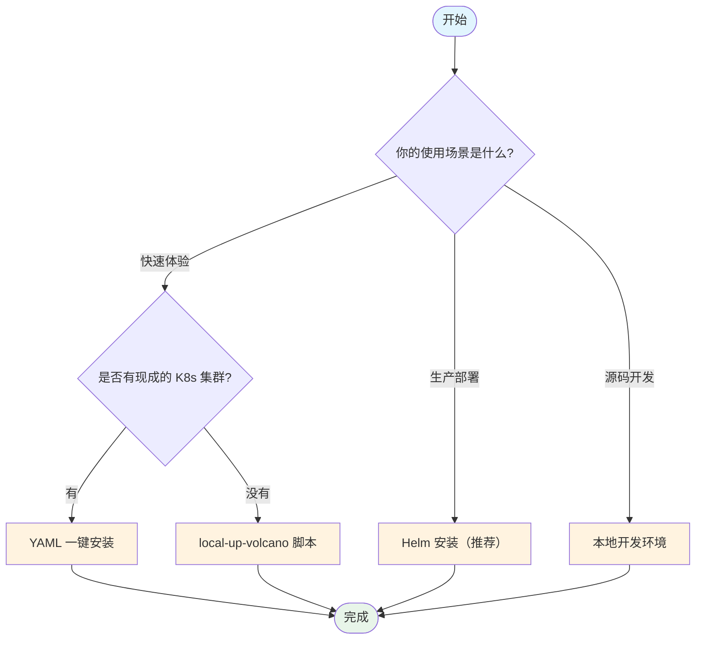

## 概述

本文档介绍如何搭建 Volcano 的开发和运行环境，涵盖从快速安装到本地开发集群搭建的完整流程。无论你是希望在现有集群上部署 Volcano 进行使用，还是需要搭建本地开发环境参与社区贡献，都可以在这里找到对应的指引。

## 前置条件

### 软件依赖

| 工具 | 最低版本 | 用途 | 安装参考 |
|------|---------|------|---------|
| **kubectl** | 1.23+ | 与 Kubernetes 集群交互 | [kubernetes.io/docs](https://kubernetes.io/docs/tasks/tools/) |
| **Kubernetes 集群** | 1.23+ | 运行 Volcano 的基础平台 | Kind / Minikube / 云厂商 |
| **Helm 3** | 3.0+ | Helm 方式安装 Volcano（可选） | [helm.sh/docs](https://helm.sh/docs/intro/install/) |
| **Go** | 1.24+ | 源码编译（仅开发者需要） | [go.dev/dl](https://go.dev/dl/) |
| **Docker** | 20.10+ | 构建镜像（仅开发者需要） | [docker.com](https://docs.docker.com/get-docker/) |
| **Kind** | 0.30+ | 本地 K8s 集群（仅开发者需要） | `go install sigs.k8s.io/kind@v0.30.0` |

### Kubernetes 版本兼容矩阵

| Volcano 版本 | 支持的 Kubernetes 范围 |
|-------------|----------------------|
| v1.12 | 1.21 ~ 1.32 |
| v1.11 | 1.21 ~ 1.31 |
| v1.10 | 1.21 ~ 1.30 |
| v1.9  | 1.21 ~ 1.29 |
| master (HEAD) | 1.23 ~ 1.33 |

> **CRD 版本说明**：Kubernetes v1.17+ 使用 `config/crd/bases/` 下的 CRD（推荐）；Kubernetes v1.16 及以下使用 `config/crd/v1beta1/`（已废弃）。

---

## 安装方式选择

根据使用场景选择合适的安装方式：



---

## 方式一：YAML 一键安装（最简单）

适用于已有 Kubernetes 集群，想要快速体验 Volcano 的场景。

```bash
kubectl apply -f https://raw.githubusercontent.com/volcano-sh/volcano/master/installer/volcano-development.yaml
```

安装完成后，Volcano 会在 `volcano-system` 命名空间下创建以下资源：

```
NAME                                       READY   STATUS    AGE
pod/volcano-admission-5bd5756f79-dnr4l     1/1     Running   96s
pod/volcano-controllers-687948d9c8-nw4b4   1/1     Running   96s
pod/volcano-scheduler-94998fc64-4z8kh      1/1     Running   96s

NAME                                TYPE        CLUSTER-IP      PORT(S)   AGE
service/volcano-admission-service   ClusterIP   10.98.152.108   443/TCP   96s

NAME                                  READY   UP-TO-DATE   AVAILABLE   AGE
deployment.apps/volcano-admission     1/1     1            1           96s
deployment.apps/volcano-controllers   1/1     1            1           96s
deployment.apps/volcano-scheduler     1/1     1            1           96s
```

**三个核心组件**：

| 组件 | 功能 |
|------|------|
| `volcano-scheduler` | 核心批调度器，执行 Action/Plugin 流水线 |
| `volcano-controllers` | 管理 Job、PodGroup、Queue 等资源的控制器 |
| `volcano-admission` | Admission Webhook，校验和变更资源请求 |

**验证安装**：

```bash
# 检查所有 Pod 是否 Running
kubectl get pods -n volcano-system

# 检查 CRD 是否注册
kubectl get crd | grep volcano
```

预期输出应包含以下 CRD：

```
jobs.batch.volcano.sh
podgroups.scheduling.volcano.sh
queues.scheduling.volcano.sh
```

---

## 方式二：Helm 安装（推荐用于生产环境）

### 从官方 Helm 仓库安装

```bash
# 添加 Volcano Helm 仓库
helm repo add volcano-sh https://volcano-sh.github.io/helm-charts
helm repo update

# 安装到 volcano-system 命名空间
helm install volcano volcano-sh/volcano -n volcano-system --create-namespace
```

### 从源码安装（开发者）

```bash
# 克隆代码后，从本地 Helm Chart 安装
helm install volcano installer/helm/chart/volcano \
  --namespace volcano-system \
  --create-namespace
```

### Helm Chart 关键配置参数

Helm Chart 位于 `installer/helm/chart/volcano/`，以下是常用的自定义参数：

| 参数 | 说明 | 默认值 |
|------|------|--------|
| `basic.image_tag_version` | 镜像版本 | `latest` |
| `basic.image_registry` | 镜像仓库地址 | `docker.io` |
| `basic.image_pull_policy` | 镜像拉取策略 | `Always` |
| `custom.scheduler_enable` | 启用调度器 | `true` |
| `custom.scheduler_replicas` | 调度器副本数 | `1` |
| `custom.scheduler_log_level` | 调度器日志级别（1-5） | `3` |
| `custom.controller_enable` | 启用控制器 | `true` |
| `custom.controller_replicas` | 控制器副本数 | `1` |
| `custom.admission_enable` | 启用 Admission Webhook | `true` |
| `custom.admission_replicas` | Admission 副本数 | `1` |
| `custom.leader_elect_enable` | 启用 Leader 选举（HA） | `false` |
| `custom.vap_enable` | 启用 ValidatingAdmissionPolicy | `false` |
| `custom.colocation_enable` | 启用混部功能 | `false` |
| `custom.scheduler_config_override` | 覆盖调度器配置 | `~` |

**自定义安装示例**：

```bash
helm install volcano volcano-sh/volcano \
  -n volcano-system --create-namespace \
  --set basic.image_pull_policy=IfNotPresent \
  --set custom.scheduler_log_level=5 \
  --set custom.leader_elect_enable=true \
  --set custom.scheduler_replicas=2
```

### 管理 Helm Release

```bash
# 查看已安装的 release
helm list -n volcano-system

# 升级配置
helm upgrade volcano volcano-sh/volcano \
  -n volcano-system \
  --set custom.scheduler_log_level=4

# 卸载
helm uninstall volcano -n volcano-system
```

---

## 方式三：本地开发集群（一键脚本）

适用于没有现成 Kubernetes 集群，想要快速搭建本地环境的场景。脚本会自动创建 Kind 集群并安装 Volcano。

```bash
# 克隆 Volcano 代码
git clone https://github.com/volcano-sh/volcano.git
cd volcano

# 一键搭建本地集群 + 安装 Volcano
./hack/local-up-volcano.sh
```

**脚本自动完成的操作**：

1. 检查并安装 Kind（如果未安装）
2. 创建本地 Kubernetes 集群
3. 构建 Volcano Docker 镜像
4. 将镜像加载到 Kind 集群
5. 通过 Helm 安装 Volcano

**可配置的环境变量**：

```bash
# 自定义集群名称（默认: volcano）
CLUSTER_NAME=my-cluster ./hack/local-up-volcano.sh

# 使用已有 K8s 集群而非创建新的
INSTALL_MODE=existing ./hack/local-up-volcano.sh

# 自定义命名空间（默认: volcano-system）
VOLCANO_NAMESPACE=my-namespace ./hack/local-up-volcano.sh
```

---

## 方式四：完整开发环境搭建

适用于需要修改 Volcano 源码、运行测试、提交 PR 的开发者。

### 步骤 1：获取源码

```bash
git clone https://github.com/volcano-sh/volcano.git
cd volcano
```

### 步骤 2：构建二进制

```bash
# 构建所有组件
make all

# 产物位于 _output/bin/ 目录
ls _output/bin/
# vc-scheduler  vc-controller-manager  vc-webhook-manager  vcctl  ...
```

**单独构建特定组件**：

```bash
make vc-scheduler           # 构建调度器
make vc-controller-manager  # 构建控制器管理器
make vc-webhook-manager     # 构建 Webhook 管理器
make vcctl                  # 构建 CLI 工具（构建为主机 OS 平台）
make vc-agent               # 构建 Agent + network-qos
```

> **CGO 插件支持**：如需构建支持 CGO 动态加载插件的调度器，使用 `SUPPORT_PLUGINS=yes make vc-scheduler`。

### 步骤 3：构建 Docker 镜像

```bash
# 构建所有镜像
make images

# 镜像命名格式: volcanosh/<component>:<git-sha>
# 例如: volcanosh/vc-scheduler:abc1234
```

**自定义镜像参数**：

```bash
# 自定义镜像前缀和标签
IMAGE_PREFIX=myregistry/volcano TAG=v1.0.0 make images

# 指定目标平台
DOCKER_PLATFORMS=linux/amd64 make images
```

### 步骤 4：搭建测试集群

```bash
# 方式 A: 使用 local-up-volcano 脚本（推荐）
./hack/local-up-volcano.sh

# 方式 B: 手动创建 Kind 集群
kind create cluster --name volcano --config hack/e2e-kind-config.yaml

# 将构建好的镜像加载到 Kind 集群
kind load docker-image volcanosh/vc-scheduler:latest --name volcano
kind load docker-image volcanosh/vc-controller-manager:latest --name volcano
kind load docker-image volcanosh/vc-webhook-manager:latest --name volcano

# 通过 Helm 安装
helm install volcano installer/helm/chart/volcano \
  --namespace volcano-system --create-namespace \
  --set basic.image_tag_version=latest \
  --set basic.image_pull_policy=IfNotPresent
```

### 步骤 5：代码验证与测试

```bash
# 代码格式检查
make verify

# Lint 检查
make lint

# 运行所有单元测试
make unit-test

# 运行特定包的单元测试
go test ./pkg/scheduler/plugins/gang/...
go test -run TestSpecificFunc ./pkg/scheduler/actions/allocate/...
```

### 步骤 6：运行 E2E 测试

```bash
# 运行完整 E2E 测试套件（自动构建镜像、创建 Kind 集群）
make e2e

# 运行特定 E2E 子集
make e2e-test-schedulingbase      # 调度基础测试
make e2e-test-schedulingaction    # 调度 Action 测试
make e2e-test-jobp                # Job 并行测试
make e2e-test-jobseq              # Job 顺序测试
make e2e-test-vcctl               # CLI 工具测试
make e2e-test-hypernode           # HyperNode 测试
make e2e-test-admission-webhook   # Admission Webhook 测试
```

**E2E 集群配置**（`hack/e2e-kind-config.yaml`）：

- 1 个控制平面节点 + 4 个工作节点
- 支持 MutatingAdmissionPolicy（Feature Gate 已开启）
- CDI 已在 containerd 中启用

---

## 代码生成

修改了 `staging/src/volcano.sh/apis/` 下的 API 类型后，需要重新生成代码：

```bash
# 重新生成 deepcopy、clients、informers、listers
make generate-code

# 重新生成 CRD YAML 定义
make manifests

# 重新生成部署 YAML
make generate-yaml

# 验证生成的代码是否最新
make verify
```

---

## 安装监控系统（可选）

Volcano 提供了 Prometheus + Grafana 的监控方案：

```bash
kubectl create -f installer/volcano-monitoring.yaml
```

---

## 项目目录结构速览

```
volcano/
├── cmd/                              # 各组件的 main 入口
│   ├── scheduler/                    # 调度器入口
│   ├── controller-manager/           # 控制器管理器入口
│   ├── webhook-manager/              # Webhook 管理器入口
│   ├── agent/                        # Node Agent 入口
│   └── cli/                          # CLI 工具入口
│
├── pkg/                              # 核心业务逻辑
│   ├── scheduler/                    # 调度器核心（Cache/Session/Action/Plugin）
│   ├── controllers/                  # 各种控制器实现
│   └── webhooks/                     # Admission Webhook 处理器
│
├── staging/src/volcano.sh/apis/      # API 类型定义（CRD）
│   └── pkg/apis/
│       ├── batch/v1alpha1/           # Job、CronJob
│       ├── scheduling/v1beta1/       # PodGroup、Queue
│       ├── topology/v1alpha1/        # HyperNode
│       └── flow/v1alpha1/            # JobFlow、JobTemplate
│
├── installer/                        # 安装相关文件
│   ├── helm/chart/volcano/           # Helm Chart
│   ├── dockerfile/                   # Dockerfile
│   └── volcano-development.yaml      # 一键安装 YAML
│
├── config/crd/                       # CRD 定义
├── hack/                             # 开发辅助脚本
├── test/e2e/                         # E2E 测试
└── example/                          # 示例 YAML
```

---

## 常见问题

### Q: Kind 集群创建失败怎么办？

确保 Docker 正在运行且有足够资源。可以尝试清理后重新创建：

```bash
kind delete cluster --name volcano
./hack/local-up-volcano.sh
```

### Q: Webhook 启动失败（证书问题）？

Admission Webhook 需要 TLS 证书。安装时会自动创建 `volcano-admission-init` Job 来生成证书。如果该 Job 失败，可以检查其日志：

```bash
kubectl logs -n volcano-system job/volcano-admission-init
```

### Q: 如何切换调度器日志级别？

通过 Helm 修改：

```bash
helm upgrade volcano volcano-sh/volcano \
  -n volcano-system \
  --set custom.scheduler_log_level=5
```

或直接修改 Deployment：

```bash
kubectl edit deployment volcano-scheduler -n volcano-system
# 修改 args 中的 --logtostderr --v=<level>
```

### Q: macOS 上 make unit-test 与 Linux 有什么区别？

macOS 使用 `GOOS=darwin` 构建；Linux 额外带 `-p 8 -race` 参数（并行 + 竞态检测）。

---

## 下一步

环境搭建完成后，你可以：

- [创建第一个 Volcano Job](./02-first-volcano-job.md) -- 学习 Job YAML 编写与提交
- [队列管理基础](./03-queue-management-basics.md) -- 了解队列创建与资源分配
- [调度器配置](./05-scheduler-configuration.md) -- 配置 Actions 和 Plugins
