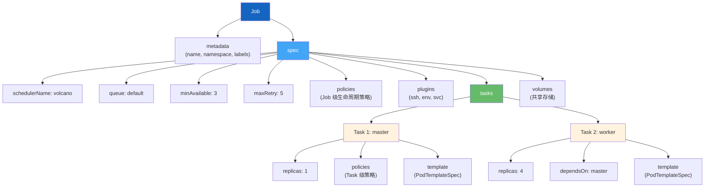
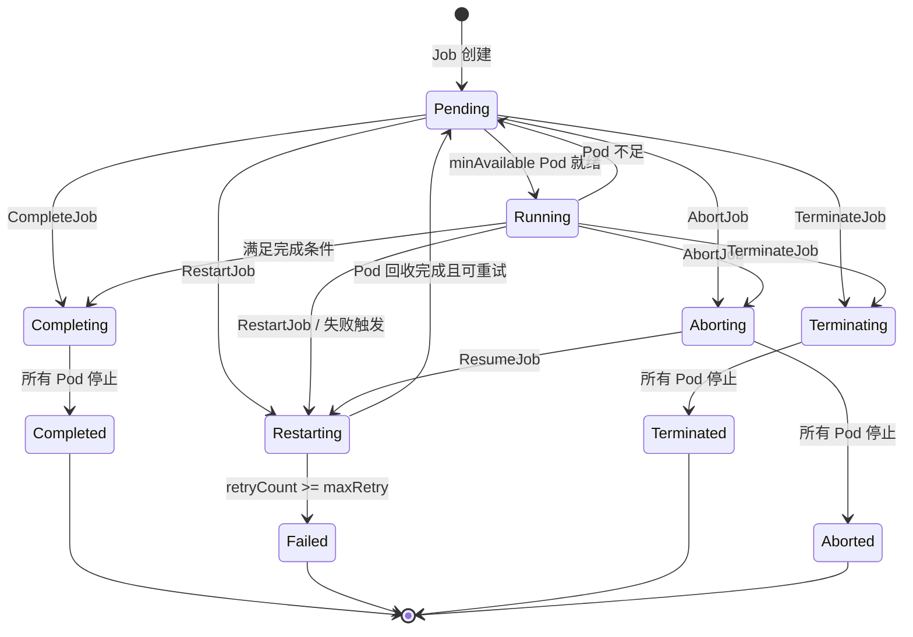
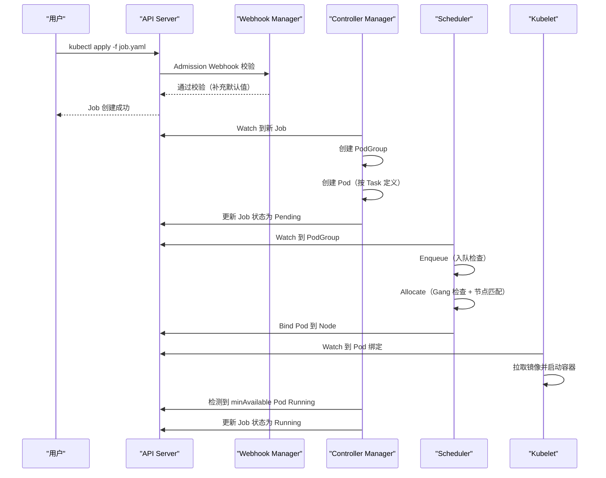

## 概述

Volcano Job 是 Volcano 的核心工作负载类型，对 Kubernetes 原生 Job 进行了大幅增强，支持多 Task 定义、Gang Scheduling、生命周期策略、插件系统等特性。本文将从零开始，带你理解 Job 的完整结构，并通过实际示例学会创建、监控和调试 Volcano Job。

## Volcano Job 与 Kubernetes Job 的区别

| 特性 | Kubernetes Job | Volcano Job |
|------|---------------|-------------|
| 多角色 Task | 不支持（单一 Pod 模板） | 支持（多 Task，不同角色） |
| Gang Scheduling | 不支持 | 原生支持（`minAvailable`） |
| 队列调度 | 不支持 | 支持（`queue` 字段） |
| 生命周期策略 | 有限（`backoffLimit`） | 丰富（Event + Action 组合） |
| 插件系统 | 无 | 内置 SSH/SVC/ENV 等插件 |
| Task 依赖 | 不支持 | 支持（`dependsOn`） |
| 网络拓扑感知 | 不支持 | 支持（`networkTopology`） |

---

## Job YAML 结构剖析

一个典型的 Volcano Job YAML 结构如下：



### 最小化示例

```yaml
apiVersion: batch.volcano.sh/v1alpha1
kind: Job
metadata:
  name: my-first-job
spec:
  minAvailable: 1
  schedulerName: volcano
  queue: default
  tasks:
    - replicas: 1
      name: worker
      template:
        spec:
          containers:
            - name: busybox
              image: busybox:latest
              command: ["echo", "Hello from Volcano!"]
          restartPolicy: OnFailure
```

### 完整示例

以下示例展示了 Job 的完整能力，包含多 Task、插件、生命周期策略：

```yaml
apiVersion: batch.volcano.sh/v1alpha1
kind: Job
metadata:
  name: distributed-job
spec:
  # --- 调度配置 ---
  schedulerName: volcano            # 使用 Volcano 调度器
  queue: default                    # 提交到 default 队列
  minAvailable: 3                   # Gang Scheduling: 至少 3 个 Pod 才开始
  maxRetry: 5                       # 最大重试 5 次
  priorityClassName: high-priority  # 优先级类

  # --- 生命周期策略（Job 级，适用于所有 Task）---
  policies:
    - event: PodEvicted
      action: RestartJob            # Pod 被驱逐时重启整个 Job

  # --- 插件配置 ---
  plugins:
    ssh: []                         # 启用 SSH 免密（生成密钥对）
    env: []                         # 注入环境变量（VK_TASK_INDEX 等）
    svc: []                         # 创建 Headless Service（Pod 间网络发现）

  # --- Task 定义 ---
  tasks:
    # Task 1: Master 节点
    - replicas: 1
      name: master
      policies:
        - event: TaskCompleted
          action: CompleteJob       # Master 完成时标记 Job 完成
      template:
        spec:
          containers:
            - name: master
              image: nginx:latest
              resources:
                requests:
                  cpu: "1"
                  memory: "1Gi"
          restartPolicy: OnFailure

    # Task 2: Worker 节点
    - replicas: 6
      name: worker
      template:
        spec:
          containers:
            - name: worker
              image: nginx:latest
              resources:
                requests:
                  cpu: "500m"
                  memory: "512Mi"
          restartPolicy: OnFailure
```

---

## Job Spec 字段详解

### 核心字段

> **源码参考**：`staging/src/volcano.sh/apis/pkg/apis/batch/v1alpha1/job.go`

| 字段 | 类型 | 必填 | 说明 |
|------|------|------|------|
| `schedulerName` | string | 否 | 调度器名称，默认 `volcano`，最长 63 字符 |
| `queue` | string | 否 | 目标队列，默认 `default`，命名需符合 DNS 子域名规范 |
| `minAvailable` | int32 | 否 | Gang Scheduling 最小可用 Pod 数，默认为所有 Task 的 replicas 之和 |
| `minSuccess` | int32 | 否 | 成功完成所需的最少 Pod 数（最小值 1） |
| `maxRetry` | int32 | 否 | 最大重试次数，默认 3 |
| `tasks` | []TaskSpec | 是 | Task 列表，至少 1 个 |
| `policies` | []LifecyclePolicy | 否 | Job 级生命周期策略 |
| `plugins` | map[string][]string | 否 | 插件配置 |
| `volumes` | []VolumeSpec | 否 | 共享存储卷 |
| `priorityClassName` | string | 否 | Kubernetes PriorityClass 引用 |
| `ttlSecondsAfterFinished` | *int32 | 否 | 完成后自动删除的秒数（0 = 立即删除，nil = 不删除） |
| `networkTopology` | NetworkTopologySpec | 否 | 网络拓扑感知配置 |

### Task 字段

| 字段 | 类型 | 必填 | 说明 |
|------|------|------|------|
| `name` | string | 否 | Task 名称，最长 63 字符 |
| `replicas` | int32 | 否 | Pod 副本数 |
| `minAvailable` | int32 | 否 | Task 级最小可用数（默认等于 replicas） |
| `template` | PodTemplateSpec | 否 | 标准 Kubernetes Pod 模板 |
| `policies` | []LifecyclePolicy | 否 | Task 级策略（覆盖 Job 级） |
| `topologyPolicy` | NumaPolicy | 否 | NUMA 拓扑策略：`none`/`best-effort`/`restricted`/`single-numa-node` |
| `maxRetry` | int32 | 否 | Task 级最大重试次数，默认 3 |
| `dependsOn` | DependsOn | 否 | Task 启动依赖 |

### Task 依赖（dependsOn）

```yaml
tasks:
  - name: data-loader
    replicas: 1
    template: ...

  - name: trainer
    replicas: 4
    dependsOn:
      name: ["data-loader"]       # 等待 data-loader 完成后启动
      iteration: "all"            # "all" = 所有依赖完成; "any" = 任一完成
    template: ...
```

---

## 生命周期策略

生命周期策略定义了 Job 在遇到特定事件时的自动响应行为。可以在 Job 级和 Task 级分别配置。

> **源码参考**：`staging/src/volcano.sh/apis/pkg/apis/bus/v1alpha1/events.go` 和 `actions.go`

### 支持的 Event

| Event | 说明 |
|-------|------|
| `*` (AnyEvent) | 匹配所有事件 |
| `PodFailed` | Pod 运行失败 |
| `PodEvicted` | Pod 被驱逐或删除 |
| `PodPending` | Pod 处于 Pending 状态 |
| `PodRunning` | Pod 进入 Running 状态 |
| `JobUnknown` | Job 状态未知（如长时间无法调度） |
| `TaskCompleted` | 某个 Task 的所有副本执行成功 |
| `TaskFailed` | Task 意外失败 |

### 支持的 Action

| Action | 说明 |
|--------|------|
| `AbortJob` | 终止 Job，驱逐所有 Pod，不重启 |
| `RestartJob` | 重启整个 Job |
| `RestartTask` | 重启指定 Task |
| `RestartPod` | 重启特定 Pod（仅 Pod 级事件有效） |
| `RestartPartition` | 重启分区组中的 Pod |
| `TerminateJob` | 强制终止 Job，驱逐所有 Pod，不可恢复 |
| `CompleteJob` | 终止未完成的 Pod，标记 Job 为完成 |
| `ResumeJob` | 恢复已 Abort 的 Job |

### 常用策略组合

```yaml
policies:
  # Pod 被驱逐时重启整个 Job
  - event: PodEvicted
    action: RestartJob

  # 使用超时：Job 未知状态超过 5 分钟后 Abort
  - event: JobUnknown
    action: AbortJob
    timeout: 5m

  # 基于退出码的策略：退出码 137（OOMKilled）时重启 Job
  - exitCode: 137
    action: RestartJob
```

> **注意**：`event`/`events` 和 `exitCode` 是互斥的，不能同时配置。

---

## Job 状态与生命周期

### Job 阶段（Phase）

> **源码参考**：`pkg/controllers/job/state/` 目录



### 各阶段说明

| 阶段 | 说明 |
|------|------|
| **Pending** | Job 已创建，等待调度器分配资源 |
| **Running** | 至少 `minAvailable` 个 Pod 已运行 |
| **Restarting** | Job 正在重启，回收旧 Pod 并创建新 Pod |
| **Completing** | 必要 Task 已完成，正在清理剩余 Pod |
| **Completed** | Job 成功完成 |
| **Aborting** | 正在终止所有 Pod（可恢复） |
| **Aborted** | Job 已被 Abort（可通过 ResumeJob 恢复） |
| **Terminating** | 正在终止所有 Pod（不可恢复） |
| **Terminated** | Job 已终止 |
| **Failed** | 重试次数耗尽，Job 最终失败 |

---

## 插件系统

Volcano Job 内置了几个常用插件，通过在 `plugins` 字段中声明来启用：

### env 插件

注入环境变量到每个容器：

```yaml
plugins:
  env: []
```

注入的环境变量：
- `VK_TASK_INDEX` / `VC_TASK_INDEX`：Task 在 Job 中的索引

### ssh 插件

在 Pod 之间建立 SSH 免密认证（分布式计算必需）：

```yaml
plugins:
  ssh: []

# 自定义 SSH 密钥路径
plugins:
  ssh: ["--ssh-key-file-path=/home/user/.ssh"]
```

插件自动完成：
1. 生成 SSH 密钥对
2. 创建 ConfigMap 存储公钥
3. 挂载到每个 Pod 的指定目录

### svc 插件

创建 Headless Service，支持 Pod 间通过 DNS 相互发现：

```yaml
plugins:
  svc: []

# 自定义选项
plugins:
  svc: ["--publish-not-ready-addresses=true", "--disable-network-policy=false"]
```

---

## 提交 Job 的完整流程

### 提交

```bash
# 使用 kubectl
kubectl apply -f my-job.yaml

# 使用 Volcano CLI（vcctl）
vcctl job run --filename my-job.yaml
```

### 提交后的内部流程



### 监控 Job 状态

```bash
# 查看 Job 状态
kubectl get job.batch.volcano.sh -o wide

# 查看详细信息
kubectl describe job.batch.volcano.sh my-first-job

# 查看 Job 关联的 Pod
kubectl get pods -l volcano.sh/job-name=my-first-job

# 查看 PodGroup 状态
kubectl get podgroup

# 查看 Pod 日志
kubectl logs <pod-name>
```

### 管理 Job

```bash
# 暂停 Job（使用 vcctl）
vcctl job suspend --name my-first-job

# 恢复 Job
vcctl job resume --name my-first-job

# 删除 Job
kubectl delete job.batch.volcano.sh my-first-job
```

---

## 实战示例

### 示例 1：简单的批处理计算

```yaml
apiVersion: batch.volcano.sh/v1alpha1
kind: Job
metadata:
  name: pi-calculation
spec:
  minAvailable: 3
  schedulerName: volcano
  queue: default
  tasks:
    - replicas: 3
      name: compute
      template:
        spec:
          containers:
            - name: pi
              image: perl:5.34
              command: ["perl", "-Mbignum=bpi", "-wle", "print bpi(2000)"]
              resources:
                requests:
                  cpu: "1"
          restartPolicy: Never
```

### 示例 2：MPI 分布式计算

```yaml
apiVersion: batch.volcano.sh/v1alpha1
kind: Job
metadata:
  name: mpi-job
spec:
  minAvailable: 3
  schedulerName: volcano
  plugins:
    ssh: []
    svc: []
  tasks:
    # MPI Master
    - replicas: 1
      name: mpimaster
      policies:
        - event: TaskCompleted
          action: CompleteJob
      template:
        spec:
          containers:
            - name: mpimaster
              image: volcanosh/example-mpi:0.0.3
              command:
                - /bin/sh
                - -c
                - |
                  MPI_HOST=`cat /etc/volcano/mpiworker.host | tr "\n" ","`;
                  mkdir -p /var/run/sshd; /usr/sbin/sshd;
                  mpiexec --allow-run-as-root --host ${MPI_HOST} -np 2 mpi_hello_world;
              ports:
                - containerPort: 22
                  name: mpijob-port
          restartPolicy: OnFailure

    # MPI Worker
    - replicas: 2
      name: mpiworker
      template:
        spec:
          containers:
            - name: mpiworker
              image: volcanosh/example-mpi:0.0.3
              command:
                - /bin/sh
                - -c
                - |
                  mkdir -p /var/run/sshd; /usr/sbin/sshd -D;
              ports:
                - containerPort: 22
                  name: mpijob-port
          restartPolicy: OnFailure
```

### 示例 3：带 Task 依赖的流水线

```yaml
apiVersion: batch.volcano.sh/v1alpha1
kind: Job
metadata:
  name: pipeline-job
spec:
  schedulerName: volcano
  queue: default
  minAvailable: 1
  tasks:
    # 阶段 1：数据准备
    - replicas: 1
      name: data-prep
      template:
        spec:
          containers:
            - name: prep
              image: busybox:latest
              command: ["sh", "-c", "echo 'Preparing data...' && sleep 10"]
          restartPolicy: OnFailure

    # 阶段 2：训练（依赖阶段 1）
    - replicas: 5
      name: trainer
      dependsOn:
        name: ["data-prep"]
      template:
        spec:
          containers:
            - name: train
              image: busybox:latest
              command: ["sh", "-c", "echo 'Training...' && sleep 30"]
          restartPolicy: OnFailure

    # 阶段 3：评估（依赖阶段 2）
    - replicas: 1
      name: evaluator
      dependsOn:
        name: ["trainer"]
      policies:
        - event: TaskCompleted
          action: CompleteJob
      template:
        spec:
          containers:
            - name: eval
              image: busybox:latest
              command: ["sh", "-c", "echo 'Evaluating...' && sleep 5"]
          restartPolicy: OnFailure
```

---

## 调试技巧

### 查看调度原因

```bash
# 查看 PodGroup 状态，了解为什么 Job 没有被调度
kubectl describe podgroup <job-name>

# 查看 Pod 事件
kubectl describe pod <pod-name> | grep -A 20 "Events"
```

### 查看调度器日志

```bash
kubectl logs -n volcano-system deployment/volcano-scheduler -f | grep <job-name>
```

### 常见问题排查

| 现象 | 可能原因 | 排查方法 |
|------|---------|---------|
| Job 卡在 Pending | 资源不足 / minAvailable 设置过高 | 检查 PodGroup 状态和事件 |
| Pod 反复重启 | 容器启动失败 / OOMKilled | 查看 Pod 日志和事件 |
| Job 卡在 Running | 没有配置完成条件 | 检查 policies 中的 CompleteJob |
| Job 直接 Failed | maxRetry 耗尽 | 增大 maxRetry 或检查失败原因 |

---

## 下一步

- [队列管理基础](./03-queue-management-basics.md) -- 学习如何创建和管理队列
- [理解 PodGroup](./04-understanding-podgroups.md) -- 深入理解 Gang Scheduling 的基础
- [调度器配置](./05-scheduler-configuration.md) -- 配置 Actions 和 Plugins
