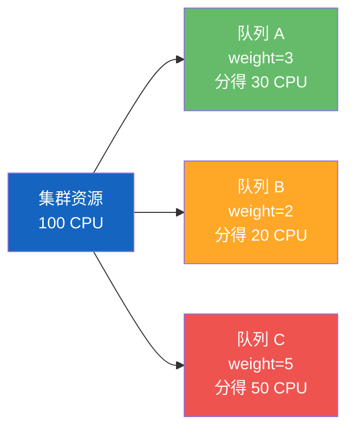
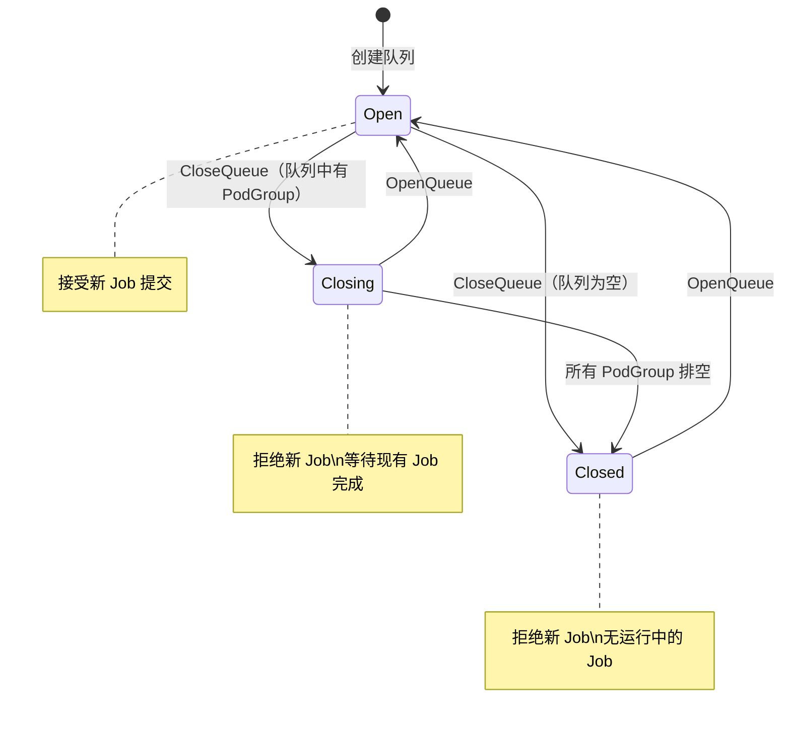
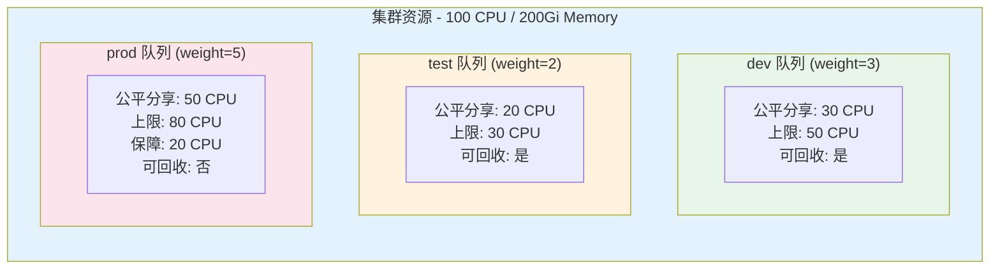

## 概述

Queue（队列）是 Volcano 资源调度的核心组织单位。每个 Volcano Job 都必须属于一个队列，调度器通过队列来管理资源分配、公平共享和优先级调度。本文介绍队列的基本概念、创建管理方法和关键配置项。

## 为什么需要队列

在多租户、多团队共享 Kubernetes 集群的场景中，队列提供了以下能力：

- **资源隔离**：为不同团队/项目划分资源边界
- **公平共享**：通过权重（weight）实现资源的公平分配
- **资源上限**：通过 capability 限制队列的最大资源使用量
- **资源保障**：通过 guarantee 预留最低资源
- **优先级管理**：通过 priority 控制队列的调度优先级
- **层级管理**：支持父子队列的层级结构

---

## Queue 资源结构

> **源码参考**：`staging/src/volcano.sh/apis/pkg/apis/scheduling/v1beta1/types.go`

### 基础示例

```yaml
apiVersion: scheduling.volcano.sh/v1beta1
kind: Queue
metadata:
  name: my-queue
spec:
  weight: 2
  reclaimable: true
  capability:
    cpu: "32"
    memory: "64Gi"
```

### 完整字段参考

| 字段 | 类型 | 默认值 | 说明 |
|------|------|--------|------|
| `weight` | int32 | 1 | 队列权重（1~65535），决定资源公平分配比例 |
| `capability` | ResourceList | 空 | 队列可分配的最大资源上限 |
| `reclaimable` | *bool | nil | 空闲资源是否可被其他队列回收 |
| `guarantee` | Guarantee | - | 资源预留配置 |
| `priority` | int32 | 0 | 队列优先级（越高越优先调度，越晚被回收） |
| `parent` | string | "root" | 父队列名称（层级队列结构） |
| `type` | string | - | 队列类型分类 |
| `deserved` | ResourceList | - | 用户配置的公平分享资源量 |
| `affinity` | *Affinity | nil | 节点组亲和/反亲和规则 |
| `dequeueStrategy` | DequeueStrategy | "traverse" | 出队策略 |

### 关键字段详解

#### weight（权重）

权重决定了队列在集群总资源中的公平分享比例。例如：

```
集群总 CPU: 100 核
队列 A: weight=3  →  分到 100 × 3/(3+2+5) = 30 核
队列 B: weight=2  →  分到 100 × 2/(3+2+5) = 20 核
队列 C: weight=5  →  分到 100 × 5/(3+2+5) = 50 核
```



#### capability（资源上限）

限制队列可使用的最大资源量，即使有空闲资源也不会超过此限制：

```yaml
spec:
  capability:
    cpu: "32"
    memory: "64Gi"
    nvidia.com/gpu: "4"
```

#### guarantee（资源保障）

为队列预留最低资源，确保即使集群繁忙，该队列也能获得保障的资源：

```yaml
spec:
  guarantee:
    resource:
      cpu: "8"
      memory: "16Gi"
```

#### reclaimable（可回收）

控制队列空闲资源是否可被其他队列借用：

- `true`：空闲资源可被回收（Reclaim Action 可从此队列回收资源）
- `false`：资源不可回收，其他队列不能借用此队列的空闲资源
- `nil`（未设置）：按调度器默认行为处理

#### dequeueStrategy（出队策略）

| 策略 | 说明 |
|------|------|
| `traverse`（默认） | 遍历策略：跳过暂时无法调度的 Job，尝试调度后续 Job |
| `fifo` | 严格先进先出：如果队首 Job 无法调度，后续 Job 也会阻塞 |

---

## Queue 状态机

> **源码参考**：`pkg/controllers/queue/state/`

队列有四种状态，通过 Open/Close 操作进行转换：



### 各状态说明

| 状态 | 说明 |
|------|------|
| **Open** | 正常状态，接受新的 Job 提交 |
| **Closing** | 正在关闭，拒绝新 Job 提交，等待现有 PodGroup 排空 |
| **Closed** | 已关闭，拒绝新 Job 提交，队列中无 PodGroup |
| **Unknown** | 异常状态 |

### Queue Status 信息

Queue 的 Status 字段自动维护 PodGroup 的统计信息：

```yaml
status:
  state: Open
  pending: 2       # Pending 阶段的 PodGroup 数
  inqueue: 3       # Inqueue 阶段的 PodGroup 数
  running: 5       # Running 阶段的 PodGroup 数
  completed: 10    # Completed 阶段的 PodGroup 数
  unknown: 0
  allocated:
    cpu: "16"
    memory: "32Gi"
```

---

## 队列操作

### 创建队列

```yaml
# queue-example.yaml
apiVersion: scheduling.volcano.sh/v1beta1
kind: Queue
metadata:
  name: ml-training
spec:
  weight: 3
  reclaimable: true
  capability:
    cpu: "64"
    memory: "128Gi"
    nvidia.com/gpu: "8"
  guarantee:
    resource:
      cpu: "16"
      memory: "32Gi"
```

```bash
kubectl apply -f queue-example.yaml
```

### 查看队列

```bash
# 列出所有队列
kubectl get queues

# 查看队列详情
kubectl describe queue ml-training

# 使用 Volcano CLI
vcctl queue list
```

输出示例：

```
NAME          WEIGHT   STATE   PENDING   RUNNING   INQUEUE   COMPLETED
default       1        Open    0         2         1         5
ml-training   3        Open    1         3         2         8
```

### 关闭队列

```bash
# 关闭队列（停止接受新 Job）
vcctl queue operate --name ml-training --action close

# 或者通过 annotation
kubectl annotate queue ml-training scheduling.volcano.sh/queue-action=close
```

### 重新打开队列

```bash
vcctl queue operate --name ml-training --action open
```

### 删除队列

```bash
# 注意：队列中有运行中的 Job 时无法直接删除
kubectl delete queue ml-training
```

---

## Job 与 Queue 的关联

在 Job 的 spec 中通过 `queue` 字段指定所属队列：

```yaml
apiVersion: batch.volcano.sh/v1alpha1
kind: Job
metadata:
  name: training-job
spec:
  schedulerName: volcano
  queue: ml-training       # 提交到 ml-training 队列
  minAvailable: 3
  tasks:
    - replicas: 3
      name: worker
      template:
        spec:
          containers:
            - name: trainer
              image: training:latest
              resources:
                requests:
                  cpu: "4"
                  nvidia.com/gpu: "1"
          restartPolicy: OnFailure
```

如果不指定 `queue`，Job 会被分配到 `default` 队列。

---

## 多队列资源分配示例

假设集群有 100 CPU、200Gi 内存，配置三个队列：

```yaml
# 研发队列（权重 3，上限 50 CPU）
apiVersion: scheduling.volcano.sh/v1beta1
kind: Queue
metadata:
  name: dev
spec:
  weight: 3
  reclaimable: true
  capability:
    cpu: "50"
    memory: "100Gi"
---
# 测试队列（权重 2，上限 30 CPU）
apiVersion: scheduling.volcano.sh/v1beta1
kind: Queue
metadata:
  name: test
spec:
  weight: 2
  reclaimable: true
  capability:
    cpu: "30"
    memory: "60Gi"
---
# 生产队列（权重 5，保障 20 CPU）
apiVersion: scheduling.volcano.sh/v1beta1
kind: Queue
metadata:
  name: prod
spec:
  weight: 5
  reclaimable: false
  capability:
    cpu: "80"
    memory: "160Gi"
  guarantee:
    resource:
      cpu: "20"
      memory: "40Gi"
```

资源分配行为：



**场景分析**：

1. **所有队列都有负载时**：按 3:2:5 的比例分配（dev=30, test=20, prod=50）
2. **只有 prod 有负载时**：prod 最多使用 80 CPU（capability 限制），剩余 20 CPU 空闲
3. **dev 和 test 空闲时**：prod 可以借用 dev/test 的空闲资源（但 dev/test 新 Job 到来时，可以从 dev 回收但无法从 prod 回收）

---

## 层级队列（Hierarchical Queue）

Volcano 支持通过 `parent` 字段或注解配置层级队列结构：

### 通过 parent 字段

```yaml
# 根队列
apiVersion: scheduling.volcano.sh/v1beta1
kind: Queue
metadata:
  name: engineering
spec:
  weight: 6
  parent: root
---
# 子队列
apiVersion: scheduling.volcano.sh/v1beta1
kind: Queue
metadata:
  name: eng-frontend
spec:
  weight: 3
  parent: engineering
---
apiVersion: scheduling.volcano.sh/v1beta1
kind: Queue
metadata:
  name: eng-backend
spec:
  weight: 7
  parent: engineering
```

### 通过 annotation（旧方式）

```yaml
apiVersion: scheduling.volcano.sh/v1beta1
kind: Queue
metadata:
  name: root-eng-prod
  annotations:
    "volcano.sh/hierarchy": "root/eng/prod"
    "volcano.sh/hierarchy-weights": "1/2/8"
spec:
  weight: 1
```

### 层级队列行为

- 父队列关闭时，所有子队列自动关闭
- 父队列打开时，所有子队列自动打开
- 子队列的资源分配在父队列的份额内按权重分配

---

## default 队列

Volcano 安装后会自动创建一个 `default` 队列，weight 为 1。所有未指定队列的 Job 会被分配到此队列。

```bash
kubectl get queue default -o yaml
```

> **注意**：`default` 队列不能删除。建议在生产环境中创建专用队列，而非都使用 default 队列。

---

## 常见问题

### Q: Job 提交后卡在 Pending，队列状态是 Open？

可能原因：
1. 队列 capability 已用尽 -- 检查 `kubectl describe queue <name>` 中的 allocated 资源
2. 集群资源不足 -- 检查节点可用资源
3. minAvailable 设置过高 -- Gang Scheduling 要求一次性分配足够的 Pod

### Q: 队列删除失败？

确保队列中没有运行中的 PodGroup：

```bash
kubectl get podgroup --field-selector status.phase!=Completed -l volcano.sh/queue-name=<queue-name>
```

### Q: 如何查看队列的实际资源使用情况？

```bash
kubectl get queue -o custom-columns=\
NAME:.metadata.name,\
WEIGHT:.spec.weight,\
STATE:.status.state,\
ALLOCATED_CPU:.status.allocated.cpu,\
ALLOCATED_MEM:.status.allocated.memory
```

---

## 下一步

- [理解 PodGroup](./04-understanding-podgroups.md) -- 深入理解 Gang Scheduling 的基础概念
- [调度器配置](./05-scheduler-configuration.md) -- 配置 proportion/capacity 插件实现公平分享
- [常见使用场景](./06-common-use-cases.md) -- 多队列在 AI/大数据场景中的实战应用
