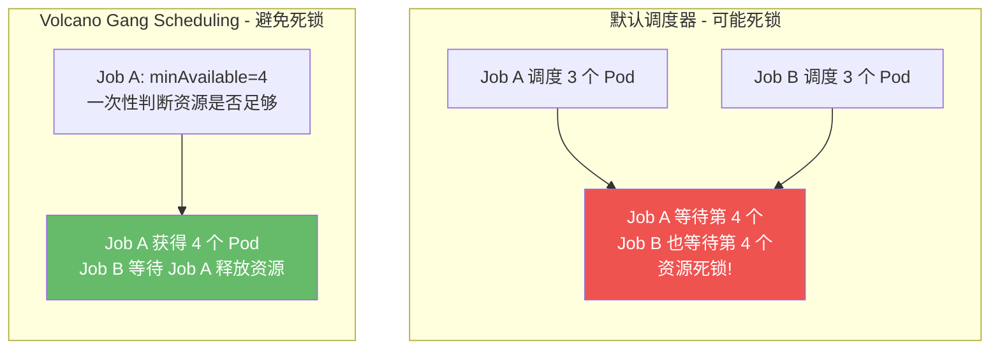
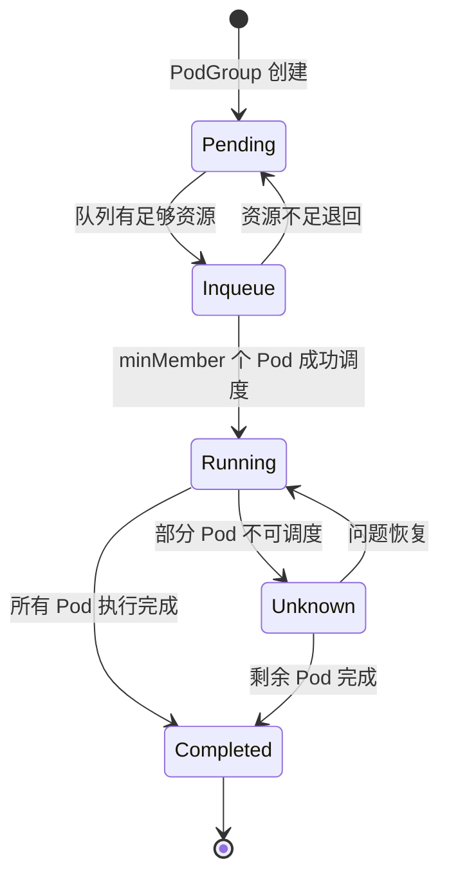
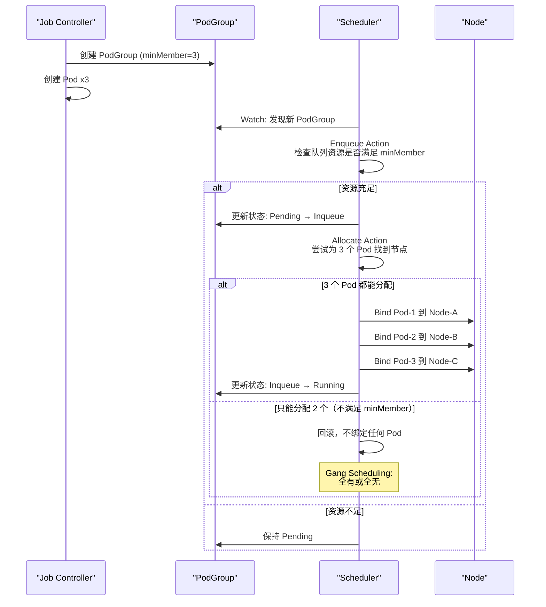

## 概述

PodGroup 是 Volcano 实现 Gang Scheduling（全有或全无调度）的核心机制。它将一组需要协同运行的 Pod 组织在一起，确保要么所有 Pod（或至少满足 `minMember` 数量的 Pod）都能被调度，要么一个都不调度。这种机制有效避免了分布式计算中的资源死锁和部分调度浪费问题。

## 为什么需要 PodGroup

在分布式计算场景中，Kubernetes 默认调度器逐个调度 Pod，这会导致严重问题：

### 资源死锁场景

假设两个 Job 各需要 4 个 Pod，集群只有 6 个空位：



**Gang Scheduling 通过 PodGroup 解决此问题**：调度器在分配前检查是否有足够资源满足 `minMember`，确保要么全部分配，要么不分配。

---

## PodGroup 资源结构

> **源码参考**：`staging/src/volcano.sh/apis/pkg/apis/scheduling/v1beta1/types.go`

### 基础示例

```yaml
apiVersion: scheduling.volcano.sh/v1beta1
kind: PodGroup
metadata:
  name: my-podgroup
  namespace: default
spec:
  minMember: 3
  queue: default
  minResources:
    cpu: "3"
    memory: "6Gi"
```

### 完整字段参考

| 字段 | 类型 | 说明 |
|------|------|------|
| `minMember` | int32 | 最小可用 Pod 数，低于此数不进行调度 |
| `queue` | string | 所属队列名称，默认 `default` |
| `priorityClassName` | string | Kubernetes PriorityClass 引用 |
| `minResources` | *ResourceList | 最小总资源需求 |
| `networkTopology` | *NetworkTopologySpec | 网络拓扑约束 |
| `subGroupPolicy` | []SubGroupPolicySpec | 子组策略（高级拓扑感知 Gang Scheduling） |

---

## PodGroup 生命周期

### 阶段（Phase）定义



### 各阶段说明

| 阶段 | 说明 |
|------|------|
| **Pending** | 等待资源，尚未进入调度流程 |
| **Inqueue** | 已入队，调度器已确认资源充足，Controller 可以开始创建 Pod |
| **Running** | 至少 `minMember` 个 Pod 已调度运行 |
| **Unknown** | 部分 Pod 在运行，但有 Pod 处于不可调度状态 |
| **Completed** | 所有 Pod 执行完成 |

### 状态转换条件

| 从 | 到 | 条件 |
|----|-----|------|
| Pending | Inqueue | Enqueue Action 确认队列有足够资源 |
| Inqueue | Running | 已调度 Pod 数 >= minMember |
| Running | Completed | 所有已调度 Pod 都已完成 |
| Running | Unknown | 有 Pod 正在运行但同时有 Pod 不可调度 |
| Inqueue | Pending | 资源不足，退回等待 |

### PodGroup Condition

PodGroup 的 Status 中包含 Condition，记录调度事件：

| Condition Type | 说明 |
|---------------|------|
| `Unschedulable` | PodGroup 无法调度（资源不足等） |
| `Scheduled` | PodGroup 已成功调度 |

常见 Reason：
- `NotEnoughResources` -- 集群资源不足
- `NotEnoughPods` -- Pod 数量不满足 minMember
- `PodFailed` -- Pod 运行失败
- `PodDeleted` -- Pod 被删除

---

## PodGroup 的创建方式

### 方式一：Volcano Job 自动创建

当你创建一个 Volcano Job 时，Controller 会自动创建对应的 PodGroup：

```yaml
apiVersion: batch.volcano.sh/v1alpha1
kind: Job
metadata:
  name: my-job
spec:
  minAvailable: 3     # 自动创建 PodGroup，minMember=3
  schedulerName: volcano
  queue: default
  tasks:
    - replicas: 3
      name: worker
      template: ...
```

Controller 自动创建的 PodGroup：
- 名称与 Job 名称相同
- `minMember` = Job 的 `minAvailable`
- `queue` = Job 的 `queue`

### 方式二：手动创建（普通 Pod 使用 Volcano 调度）

对于非 Volcano Job 的工作负载（如 Deployment、StatefulSet），可以手动创建 PodGroup 并将 Pod 关联：

```yaml
# 1. 创建 PodGroup
apiVersion: scheduling.volcano.sh/v1beta1
kind: PodGroup
metadata:
  name: my-deployment-pg
spec:
  minMember: 3
  queue: default
  minResources:
    cpu: "3"
    memory: "6Gi"
---
# 2. 在 Pod 中通过 annotation 关联
apiVersion: apps/v1
kind: Deployment
metadata:
  name: my-deployment
spec:
  replicas: 3
  selector:
    matchLabels:
      app: my-app
  template:
    metadata:
      annotations:
        scheduling.k8s.io/group-name: my-deployment-pg  # 关联 PodGroup
      labels:
        app: my-app
    spec:
      schedulerName: volcano    # 使用 Volcano 调度器
      containers:
        - name: app
          image: nginx:latest
          resources:
            requests:
              cpu: "1"
              memory: "2Gi"
```

### 方式三：自动创建（PodGroup Controller）

> **源码参考**：`pkg/controllers/podgroup/pg_controller_handler.go`

PodGroup Controller 会自动为使用 Volcano 调度器的普通 Pod 创建 PodGroup：

**自动创建的触发条件**：
1. Pod 指定了 `schedulerName: volcano`
2. Pod 没有 `scheduling.k8s.io/group-name` annotation
3. 支持的 Owner 类型：普通 Pod、ReplicaSet、StatefulSet

**自动创建的 PodGroup 属性**：

| 属性 | 来源 |
|------|------|
| 名称 | `{namespace}-{pod-name}` |
| `minMember` | 1（默认），或 Owner 上的 `volcano.sh/group-min-member` annotation |
| `queue` | Pod 的 `volcano.sh/queue-name` annotation 或 Owner 的对应 annotation |
| `priorityClassName` | Pod Spec 中的 priorityClassName |
| `minResources` | Pod 资源 requests × minMember |
| `networkTopology` | 从 Pod annotation 解析 |

**在 Owner（ReplicaSet/Deployment）上配置**：

```yaml
apiVersion: apps/v1
kind: Deployment
metadata:
  name: my-app
  annotations:
    volcano.sh/group-min-member: "3"    # 自动创建的 PodGroup minMember=3
    volcano.sh/queue-name: "ml-queue"   # 分配到 ml-queue 队列
spec:
  replicas: 5
  template:
    spec:
      schedulerName: volcano
      containers:
        - name: app
          image: nginx:latest
```

---

## PodGroup 与调度流程

PodGroup 在 Volcano 的调度流程中扮演关键角色：



---

## minMember 的设计考量

`minMember` 是 PodGroup 最核心的字段，决定了 Gang Scheduling 的粒度：

### 场景 1：严格 Gang（全部 Pod 必须同时调度）

```yaml
spec:
  minMember: 10   # 等于总 Pod 数
```

适用于 MPI、AllReduce 等所有 Worker 必须同时存在的场景。

### 场景 2：弹性 Gang（部分 Pod 即可启动）

```yaml
spec:
  minMember: 3    # 小于总 Pod 数 10
```

适用于 Parameter Server 等可以用部分 Worker 先开始训练的场景。

### 场景 3：单 Pod（无 Gang 约束）

```yaml
spec:
  minMember: 1
```

等同于普通调度，不需要 Gang Scheduling。

---

## 查看 PodGroup 状态

### 基本查看

```bash
# 列出所有 PodGroup
kubectl get podgroup

# 输出示例
NAME        STATUS    MINMEMBER   RUNNING   SUCCEEDED   FAILED   AGE
my-job      Running   3           3         0           0        5m
test-job    Pending   5           0         0           0        2m
```

### 详细信息

```bash
kubectl describe podgroup my-job
```

输出包含关键信息：

```
Name:         my-job
Namespace:    default
Status:
  Phase:      Running
  Running:    3
  Succeeded:  0
  Failed:     0
  Conditions:
    Type:               Scheduled
    Status:             True
    Last Transition Time: 2024-01-15T10:30:00Z
Spec:
  Min Member:    3
  Queue:         default
```

### 调试不可调度的 PodGroup

```bash
# 查看 PodGroup 的 Condition 和事件
kubectl describe podgroup <name> | grep -A 10 "Conditions"

# 查看关联的 Pod 状态
kubectl get pods -l volcano.sh/job-name=<job-name>

# 查看调度器日志
kubectl logs -n volcano-system deployment/volcano-scheduler | grep <podgroup-name>
```

---

## 关键 Annotation 参考

### Pod 级别

| Annotation | 说明 |
|-----------|------|
| `scheduling.k8s.io/group-name` | 将 Pod 绑定到指定 PodGroup |
| `volcano.sh/queue-name` | 指定 Pod 所属队列 |
| `volcano.sh/preemptable` | 标记 Pod 是否可被抢占 |
| `volcano.sh/numa-topology-policy` | NUMA 拓扑策略 |

### Owner 级别（Deployment / ReplicaSet / StatefulSet）

| Annotation | 说明 |
|-----------|------|
| `volcano.sh/group-min-member` | 自动创建的 PodGroup 的 minMember 值 |
| `volcano.sh/queue-name` | 自动创建的 PodGroup 所属队列 |

---

## 实战示例

### 示例 1：Spark 作业使用 PodGroup

```yaml
# PodGroup
apiVersion: scheduling.volcano.sh/v1beta1
kind: PodGroup
metadata:
  name: spark-pi-group
spec:
  minMember: 3          # 1 Driver + 2 Executor
  queue: data-processing
---
# Spark Driver Pod
apiVersion: v1
kind: Pod
metadata:
  name: spark-driver
  annotations:
    scheduling.k8s.io/group-name: spark-pi-group
spec:
  schedulerName: volcano
  containers:
    - name: driver
      image: spark:3.5.0
      resources:
        requests:
          cpu: "2"
          memory: "4Gi"
  restartPolicy: Never
```

### 示例 2：带最小资源约束

```yaml
apiVersion: scheduling.volcano.sh/v1beta1
kind: PodGroup
metadata:
  name: gpu-training-pg
spec:
  minMember: 4
  queue: ml-training
  priorityClassName: high-priority
  minResources:
    cpu: "16"
    memory: "64Gi"
    nvidia.com/gpu: "4"
```

`minResources` 的作用：
- 在 Enqueue 阶段，调度器检查队列是否有足够资源满足 `minResources`
- 如果队列可用资源不满足 `minResources`，PodGroup 保持 Pending
- 避免在明显资源不足时进入不必要的调度尝试

---

## 常见问题

### Q: PodGroup 一直处于 Pending 状态？

排查步骤：
1. 检查队列是否 Open：`kubectl get queue <queue-name>`
2. 检查集群资源是否充足：`kubectl describe nodes | grep -A 5 "Allocated resources"`
3. 检查 minMember 是否过大
4. 查看 PodGroup Condition：`kubectl describe podgroup <name>`

### Q: PodGroup 可以手动删除吗？

可以，但如果 PodGroup 关联了 Volcano Job，删除 PodGroup 可能导致 Job 状态异常。通常应该删除 Job，让 Controller 自动清理 PodGroup。

### Q: 一个 Pod 可以属于多个 PodGroup 吗？

不可以。每个 Pod 通过 `scheduling.k8s.io/group-name` annotation 只能属于一个 PodGroup。

### Q: PodGroup 的 minMember 可以在运行时修改吗？

PodGroup 的 spec 在创建后不建议修改。如果需要调整 Gang 粒度，应该重新创建 Job。

---

## 下一步

- [调度器配置](./05-scheduler-configuration.md) -- 配置 Gang 插件和调度策略
- [常见使用场景](./06-common-use-cases.md) -- PodGroup 在不同分布式框架中的应用
- [Gang Scheduling 深度解析](../04-plugin-analysis/02-gang-scheduling.md) -- Gang 插件的算法和实现原理
