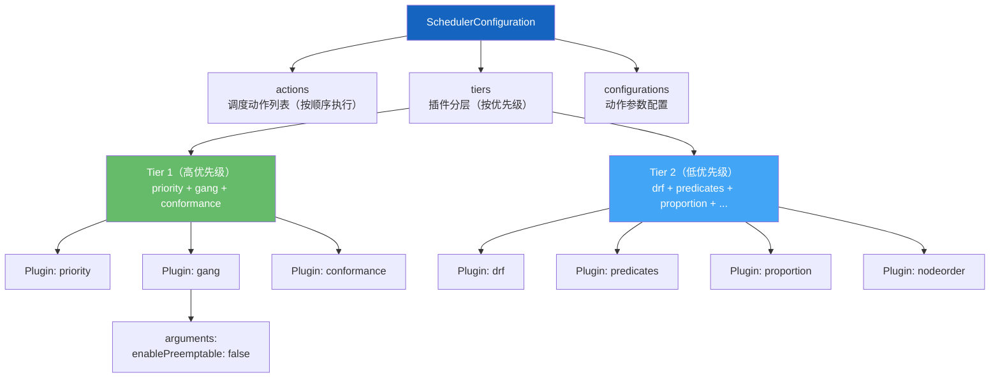
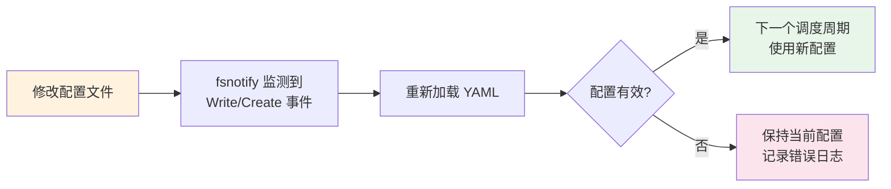

## 概述

Volcano 调度器通过配置文件定义调度流水线的行为，包括 Action（调度动作）的执行顺序和 Plugin（插件）的启用与参数。配置文件支持热加载，修改后无需重启调度器即可生效。本文介绍配置文件的结构、可用的 Action 和 Plugin、以及常见场景的配置模板。

## 配置文件结构

> **源码参考**：`pkg/scheduler/conf/scheduler_conf.go`

调度器配置文件使用 YAML 格式，包含三个主要部分：

```yaml
# Action 列表：按顺序执行的调度动作
actions: "enqueue, allocate, backfill"

# Tier 列表：按优先级组织的插件
tiers:
- plugins:
  - name: priority
  - name: gang
  - name: conformance
- plugins:
  - name: drf
  - name: predicates
  - name: proportion
  - name: nodeorder

# Action 配置（可选）
configurations:
- name: preempt
  arguments:
    enableTopologyAwarePreemption: false
```

### 配置结构图



---

## Action（调度动作）

Action 是调度流水线的执行单元，按配置顺序依次执行。每轮调度周期依次运行所有 Action。

> **源码参考**：`pkg/scheduler/actions/factory.go`

### 可用 Action 列表

| Action | 说明 | 典型使用场景 |
|--------|------|-------------|
| **enqueue** | 将 Pending 的 Job/PodGroup 入队为 Inqueue | 每次必需，控制入队门控 |
| **allocate** | 核心分配动作，为 Task 匹配节点 | 每次必需，主调度逻辑 |
| **backfill** | 回填 BestEffort Pod 到剩余资源 | 提高资源利用率 |
| **preempt** | 高优先级 Job 抢占低优先级 Job 的资源 | 优先级调度场景 |
| **reclaim** | 跨队列资源回收（从超用队列回收到饥饿队列） | 多队列公平共享场景 |
| **shuffle** | 重调度，驱逐并重新安排 Pod | 负载均衡 / 碎片整理 |

### Action 执行顺序

Action 的配置顺序决定了执行顺序。推荐的执行顺序：

```
enqueue → allocate → backfill → reclaim → preempt
```

**不同场景的 Action 配置**：

| 场景 | 推荐 Action 列表 |
|------|-----------------|
| 基础批调度 | `enqueue, allocate, backfill` |
| 多队列公平共享 | `enqueue, allocate, backfill, reclaim` |
| 带抢占的调度 | `enqueue, allocate, backfill, reclaim, preempt` |
| 带重调度 | `enqueue, allocate, backfill, reclaim, preempt, shuffle` |

---

## Plugin（插件）

Plugin 通过 Extension Point（扩展点）参与调度决策。插件按 Tier（层级）组织，高层级 Tier 优先评估。

### Tier 机制

- 每个 Tier 包含一组 Plugin
- Tier 1 的插件优先级高于 Tier 2
- 同一 Tier 内的插件协同工作
- Job/Task 必须通过 Tier 中所有插件的检查才能进入下一步

### 核心 Plugin 列表

#### 调度决策类

| Plugin | 功能 | 关键参数 |
|--------|------|---------|
| **priority** | 按 PriorityClass 排序 Job 和 Task | 无 |
| **gang** | Gang Scheduling，验证 minAvailable | `enablePreemptable` |
| **conformance** | 保护 K8s 关键 Pod（kube-system 等） | 无 |
| **drf** | Dominant Resource Fairness 公平调度 | `enableHierarchy` |
| **proportion** | 队列权重公平分享，计算 Deserved 资源 | 无 |
| **capacity** | 层级队列容量管理（替代 proportion） | 无 |
| **overcommit** | 资源超卖，允许入队时超额分配 | `overcommit-factor`（默认 1.2） |

#### 节点选择类

| Plugin | 功能 | 关键参数 |
|--------|------|---------|
| **predicates** | K8s 原生过滤（亲和性、污点等） | 见下方详细参数 |
| **nodeorder** | K8s 原生评分（最少请求、均衡等） | 见下方详细参数 |
| **binpack** | Bin Packing，优先填满节点 | `binpack.weight`, `binpack.cpu`, `binpack.memory` |
| **numaaware** | NUMA 拓扑感知调度 | 无 |
| **network-topology-aware** | 网络拓扑感知（HyperNode） | 无 |

#### 其他

| Plugin | 功能 | 关键参数 |
|--------|------|---------|
| **sla** | SLA 等待时间强制 | `sla-waiting-time` |
| **tdm** | 时分复用调度 | 无 |
| **pdb** | 尊重 PodDisruptionBudget | 无 |
| **deviceshare** | GPU/设备共享 | 无 |
| **rescheduling** | 重调度策略 | `lowNodeUtilization` 策略 |
| **task-topology** | Task 亲和/反亲和 | 无 |
| **usage** | 基于实际使用率调度 | `usage.weight`, `cpu.weight`, `memory.weight`, thresholds |
| **resourcequota** | ResourceQuota 强制 | 无 |
| **extender** | 外部扩展点 | 自定义 |

---

## 常用 Plugin 参数详解

### predicates 参数

控制启用哪些 Kubernetes 原生 Filter：

```yaml
- name: predicates
  arguments:
    predicate.NodeAffinityEnable: true              # 节点亲和性
    predicate.TaintTolerationEnable: true            # 污点容忍
    predicate.PodAffinityEnable: true                # Pod 亲和/反亲和
    predicate.NodePortsEnable: true                  # 端口冲突检查
    predicate.NodeVolumeLimitsEnable: true            # 卷数量限制
    predicate.VolumeZoneEnable: true                  # 卷可用区
    predicate.PodTopologySpreadEnable: true           # Pod 拓扑分布
    predicate.VolumeBindingEnable: true               # 卷绑定
    predicate.DynamicResourceAllocationEnable: false   # 动态资源分配（DRA）
    predicate.CacheEnable: false                       # Predicate 结果缓存
```

### nodeorder 参数

控制节点评分权重（值越大影响越大）：

```yaml
- name: nodeorder
  arguments:
    leastrequested.weight: 1      # 优先选资源空闲多的节点
    mostrequested.weight: 0       # 优先选资源使用多的节点（与 leastrequested 互斥）
    nodeaffinity.weight: 1        # 节点亲和性评分权重
    podaffinity.weight: 1         # Pod 亲和性评分权重
    balancedresource.weight: 1    # 资源均衡评分权重
    tainttoleration.weight: 1     # 污点容忍评分权重
    imagelocality.weight: 1       # 镜像本地性评分权重
    podtopologyspread.weight: 1   # Pod 拓扑分布评分权重
```

### binpack 参数

Bin Packing 策略，优先将 Pod 调度到已有负载的节点：

```yaml
- name: binpack
  arguments:
    binpack.weight: 10            # Binpack 总体权重
    binpack.cpu: 5                # CPU 维度权重
    binpack.memory: 1             # 内存维度权重
    binpack.resources: nvidia.com/gpu    # 额外资源维度
    binpack.resources.nvidia.com/gpu: 2  # GPU 维度权重
```

### overcommit 参数

```yaml
- name: overcommit
  arguments:
    overcommit-factor: 1.2    # 允许入队的资源量 = 实际资源 × 1.2
```

### sla 参数

```yaml
- name: sla
  arguments:
    sla-waiting-time: "10m"    # Job 最大等待时间，超时后提升优先级
```

---

## Plugin 扩展点开关

每个 Plugin 可以通过布尔标志精细控制参与的扩展点：

```yaml
- name: gang
  enableJobOrder: true         # 参与 Job 排序
  enableJobReady: true         # 参与 Job 就绪检查
  enableJobPipelined: true     # 参与 Pipeline 模式
  enablePreemptable: false     # 不参与抢占判断
  enableReclaimable: false     # 不参与回收判断
```

常用的扩展点开关：

| 开关 | 作用 |
|------|------|
| `enableJobOrder` | 控制 Job 排序逻辑 |
| `enableTaskOrder` | 控制 Task 排序逻辑 |
| `enableJobReady` | 控制 Job 是否就绪的判断 |
| `enablePreemptable` | 控制是否参与抢占决策 |
| `enableReclaimable` | 控制是否参与回收决策 |
| `enablePredicate` | 控制节点过滤 |
| `enableNodeOrder` | 控制节点评分排序 |
| `enableBestNode` | 控制最优节点选择 |
| `enableQueueOrder` | 控制队列排序 |

---

## 默认配置

> **源码参考**：`pkg/scheduler/util.go`

Volcano 调度器内置默认配置，当未提供配置文件时使用：

```yaml
actions: "enqueue, allocate, backfill"
tiers:
- plugins:
  - name: priority
  - name: gang
  - name: conformance
- plugins:
  - name: overcommit
  - name: drf
  - name: predicates
  - name: proportion
  - name: nodeorder
```

通过 `--disable-default-scheduler-config` 启动参数可以禁用默认配置，此时必须提供配置文件。

---

## 配置热加载

Volcano 调度器支持配置文件热加载，修改配置后无需重启：



**实现细节**：
- 使用 `fsnotify` 库监控配置文件目录
- 捕获 `Write` 和 `Create` 事件
- 通过 Mutex 保证线程安全
- 仅影响下一个调度周期，不中断当前调度

---

## 配置加载优先级

```
1. 默认配置（内置在代码中）
     ↓ 被覆盖
2. 配置文件（--scheduler-conf 指定路径）
     ↓ 被覆盖
3. 热加载（文件修改后自动加载）
```

- 如果配置文件无效，保持上一次有效配置
- 如果禁用了默认配置且配置文件无效，调度器将退出

---

## 在 Helm 中配置

### 使用 Helm values 覆盖

```bash
helm install volcano volcano-sh/volcano \
  -n volcano-system --create-namespace \
  --set custom.scheduler_config_override="$(cat my-scheduler.conf)"
```

### 配置文件位置

Helm 安装后，配置文件挂载在 Pod 内的 ConfigMap 中：

```bash
# 查看调度器 ConfigMap
kubectl get configmap -n volcano-system volcano-scheduler-configmap -o yaml

# 直接修改 ConfigMap（会触发热加载）
kubectl edit configmap -n volcano-system volcano-scheduler-configmap
```

---

## 常见场景配置模板

### 场景 1：基础批调度（默认推荐）

适用于简单的批处理计算，不需要抢占和回收。

```yaml
actions: "enqueue, allocate, backfill"
tiers:
- plugins:
  - name: priority
  - name: gang
  - name: conformance
- plugins:
  - name: overcommit
  - name: drf
  - name: predicates
  - name: proportion
  - name: nodeorder
```

### 场景 2：多队列公平共享 + 抢占

适用于多团队共享集群，需要队列公平分享和优先级抢占。

```yaml
actions: "enqueue, allocate, backfill, reclaim, preempt"
tiers:
- plugins:
  - name: priority
  - name: gang
    enablePreemptable: false     # Gang Job 不可被抢占
  - name: conformance
  - name: sla
    arguments:
      sla-waiting-time: "10m"
- plugins:
  - name: overcommit
  - name: drf
    enablePreemptable: false
  - name: predicates
  - name: proportion
  - name: nodeorder
  - name: binpack
```

### 场景 3：GPU 集群优化

适用于 GPU 密集型工作负载，优先填满节点以减少 GPU 碎片化。

```yaml
actions: "enqueue, allocate, backfill, reclaim"
tiers:
- plugins:
  - name: priority
  - name: gang
  - name: conformance
- plugins:
  - name: overcommit
  - name: drf
  - name: predicates
  - name: proportion
  - name: nodeorder
    arguments:
      leastrequested.weight: 0
      mostrequested.weight: 5      # 优先选已有负载的节点
  - name: binpack
    arguments:
      binpack.weight: 10
      binpack.cpu: 1
      binpack.memory: 1
      binpack.resources: nvidia.com/gpu
      binpack.resources.nvidia.com/gpu: 5    # GPU 维度权重最高
  - name: deviceshare
```

### 场景 4：网络拓扑感知 + 层级队列

适用于大规模 AI 训练，需要网络拓扑感知和层级队列管理。

```yaml
actions: "enqueue, allocate, backfill, reclaim, preempt"
tiers:
- plugins:
  - name: priority
  - name: gang
    enablePreemptable: false
  - name: conformance
  - name: sla
- plugins:
  - name: overcommit
  - name: drf
    enablePreemptable: false
  - name: predicates
    arguments:
      predicate.DynamicResourceAllocationEnable: true
  - name: proportion
  - name: nodeorder
  - name: binpack
  - name: network-topology-aware
```

---

## 验证配置

### 检查调度器日志

```bash
# 查看配置加载日志
kubectl logs -n volcano-system deployment/volcano-scheduler | grep -i "config\|scheduler conf"

# 查看调度周期日志
kubectl logs -n volcano-system deployment/volcano-scheduler | grep "runOnce"
```

### 验证 Action 执行

```bash
# 查看 Action 执行顺序
kubectl logs -n volcano-system deployment/volcano-scheduler | grep "action"
```

### 验证 Plugin 加载

```bash
# 查看已加载的 Plugin
kubectl logs -n volcano-system deployment/volcano-scheduler | grep "plugin"
```

---

## 常见问题

### Q: 修改 ConfigMap 后没有生效？

检查调度器日志是否有配置加载错误：

```bash
kubectl logs -n volcano-system deployment/volcano-scheduler | grep -i "error\|fail"
```

常见原因：YAML 格式错误、Plugin 名称拼写错误、参数类型不匹配。

### Q: proportion 和 capacity 可以同时使用吗？

不建议。`proportion` 使用扁平权重模型，`capacity` 使用层级容量模型，两者的资源计算逻辑不同。选择一个即可：
- 扁平队列结构 → 使用 `proportion`
- 层级队列结构 → 使用 `capacity`

### Q: binpack 和 nodeorder 的 leastrequested 冲突吗？

是的。`binpack` 倾向于填满节点，`leastrequested` 倾向于分散到空闲节点。如果同时启用，效果取决于各自的权重配置。推荐选择一种策略：
- 希望填满节点（减少碎片）→ 调高 `binpack.weight`，设 `leastrequested.weight: 0`
- 希望分散负载（高可用）→ 调高 `leastrequested.weight`，不启用 `binpack`

### Q: 如何调试调度器为什么没有调度某个 Job？

1. 提高日志级别：`--v=5`（通过 Helm `custom.scheduler_log_level` 设置）
2. 查看 PodGroup 状态和 Condition
3. 查看调度器日志中关于该 Job 的记录

---

## 下一步

- [常见使用场景](./06-common-use-cases.md) -- 不同场景的完整配置实践
- [调度器深度解析](../02-scheduler-deep-dive/01-scheduler-lifecycle.md) -- 调度器启动与运行机制
- [Plugin 算法解析](../04-plugin-analysis/01-plugin-extension-points.md) -- 插件扩展点详解
