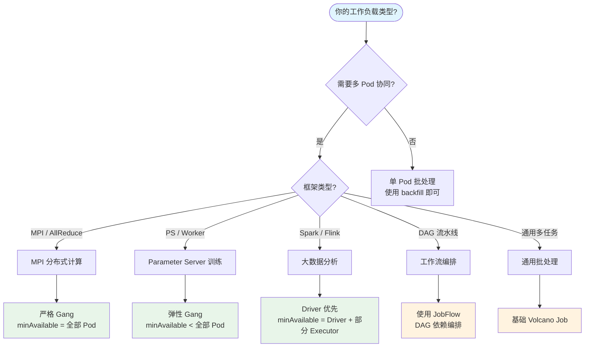

## 概述

Volcano 广泛应用于 AI/ML 训练、大数据分析、科学计算、CI/CD 批处理等场景。本文通过具体的实战示例，展示如何在这些场景中使用 Volcano 的核心能力：Gang Scheduling、队列管理、插件配置和生命周期控制。

## 场景选择决策



---

## 场景一：AI/ML 分布式训练

### 1.1 PyTorch 分布式训练（AllReduce）

AllReduce 模式要求所有 Worker 同时存在，使用严格 Gang Scheduling：

```yaml
apiVersion: batch.volcano.sh/v1alpha1
kind: Job
metadata:
  name: pytorch-distributed
spec:
  minAvailable: 4               # 所有 Worker 必须同时调度
  schedulerName: volcano
  queue: ml-training
  plugins:
    ssh: []                      # Worker 间通信
    svc: []                      # DNS 发现
    env: []                      # 注入 Task 索引
  policies:
    - event: PodEvicted
      action: RestartJob         # 任一 Worker 丢失则重启
  tasks:
    - replicas: 4
      name: worker
      template:
        spec:
          containers:
            - name: pytorch
              image: pytorch/pytorch:2.1.0-cuda12.1-cudnn8-runtime
              command:
                - python
                - -m
                - torch.distributed.launch
                - --nproc_per_node=1
                - --nnodes=4
                - --node_rank=$(VC_TASK_INDEX)
                - --master_addr=$(worker-0.pytorch-distributed)
                - --master_port=23456
                - train.py
              resources:
                requests:
                  cpu: "4"
                  memory: "16Gi"
                  nvidia.com/gpu: "1"
                limits:
                  nvidia.com/gpu: "1"
          restartPolicy: OnFailure
```

**关键配置点**：
- `minAvailable: 4` = 全部 Worker 数，确保 AllReduce 所有参与者同时就绪
- `ssh` + `svc` 插件：提供 Worker 间 SSH 通信和 DNS 发现
- `env` 插件：注入 `VC_TASK_INDEX`，用作 `node_rank`
- `PodEvicted → RestartJob`：任何 Worker 被驱逐则重启整个训练

### 1.2 TensorFlow Parameter Server 模式

PS 模式可以使用弹性 Gang，Worker 数量可弹性伸缩：

```yaml
apiVersion: batch.volcano.sh/v1alpha1
kind: Job
metadata:
  name: tensorflow-ps
spec:
  minAvailable: 3               # 1 PS + 至少 2 Worker（弹性）
  schedulerName: volcano
  queue: ml-training
  plugins:
    svc: []
    env: []
  tasks:
    # Parameter Server
    - replicas: 1
      name: ps
      template:
        spec:
          containers:
            - name: ps
              image: tensorflow/tensorflow:2.15.0-gpu
              command: ["python", "ps_server.py"]
              resources:
                requests:
                  cpu: "4"
                  memory: "8Gi"
          restartPolicy: OnFailure

    # Worker
    - replicas: 4
      name: worker
      policies:
        - event: TaskCompleted
          action: CompleteJob    # 所有 Worker 完成即 Job 完成
      template:
        spec:
          containers:
            - name: worker
              image: tensorflow/tensorflow:2.15.0-gpu
              command: ["python", "worker.py"]
              resources:
                requests:
                  cpu: "4"
                  memory: "16Gi"
                  nvidia.com/gpu: "1"
          restartPolicy: OnFailure
```

**关键配置点**：
- `minAvailable: 3` < 总 Pod 数 5，允许弹性调度
- PS Task 不设 `TaskCompleted`，只在 Worker 全部完成时结束 Job

### 1.3 Horovod / MPI 训练

```yaml
apiVersion: batch.volcano.sh/v1alpha1
kind: Job
metadata:
  name: horovod-job
spec:
  minAvailable: 5               # 1 Master + 4 Worker
  schedulerName: volcano
  queue: ml-training
  plugins:
    ssh: []
    svc: []
  tasks:
    - replicas: 1
      name: mpimaster
      policies:
        - event: TaskCompleted
          action: CompleteJob
      template:
        spec:
          containers:
            - name: mpimaster
              image: horovod/horovod:latest
              command:
                - /bin/sh
                - -c
                - |
                  MPI_HOST=`cat /etc/volcano/mpiworker.host | tr "\n" ","`;
                  mkdir -p /var/run/sshd; /usr/sbin/sshd;
                  horovodrun --gloo -np 4 -H ${MPI_HOST} python train.py;
              ports:
                - containerPort: 22
                  name: mpijob-port
          restartPolicy: OnFailure

    - replicas: 4
      name: mpiworker
      template:
        spec:
          containers:
            - name: mpiworker
              image: horovod/horovod:latest
              command:
                - /bin/sh
                - -c
                - |
                  mkdir -p /var/run/sshd; /usr/sbin/sshd -D;
              ports:
                - containerPort: 22
                  name: mpijob-port
              resources:
                requests:
                  nvidia.com/gpu: "1"
          restartPolicy: OnFailure
```

---

## 场景二：大数据分析

### 2.1 Spark on Volcano

Spark 从 3.3 开始原生支持 Volcano 作为调度器。

**PodGroup（手动创建）**：

```yaml
apiVersion: scheduling.volcano.sh/v1beta1
kind: PodGroup
metadata:
  name: spark-pi-group
spec:
  minMember: 3                   # 1 Driver + 2 Executor
  queue: data-processing
```

**Spark 提交配置**：

```bash
spark-submit \
  --master k8s://https://<k8s-api>:6443 \
  --deploy-mode cluster \
  --conf spark.kubernetes.scheduler.name=volcano \
  --conf spark.kubernetes.driver.podTemplateFile=driver-template.yaml \
  --conf spark.kubernetes.executor.podTemplateFile=executor-template.yaml \
  --conf spark.kubernetes.scheduler.volcano.podGroupTemplateFile=podgroup-template.yaml \
  --conf spark.executor.instances=2 \
  local:///opt/spark/examples/jars/spark-examples.jar
```

**Driver Pod Template（关键部分）**：

```yaml
apiVersion: v1
kind: Pod
metadata:
  annotations:
    scheduling.k8s.io/group-name: spark-pi-group
spec:
  schedulerName: volcano
```

### 2.2 Flink on Volcano

```yaml
apiVersion: batch.volcano.sh/v1alpha1
kind: Job
metadata:
  name: flink-job
spec:
  minAvailable: 3
  schedulerName: volcano
  queue: data-processing
  plugins:
    svc: []
    env: []
  tasks:
    # JobManager
    - replicas: 1
      name: jobmanager
      template:
        spec:
          containers:
            - name: jobmanager
              image: flink:1.18
              command: ["jobmanager.sh", "start-foreground"]
              resources:
                requests:
                  cpu: "2"
                  memory: "4Gi"
          restartPolicy: OnFailure

    # TaskManager
    - replicas: 2
      name: taskmanager
      template:
        spec:
          containers:
            - name: taskmanager
              image: flink:1.18
              command: ["taskmanager.sh", "start-foreground"]
              resources:
                requests:
                  cpu: "4"
                  memory: "8Gi"
          restartPolicy: OnFailure
```

---

## 场景三：CI/CD 批处理

### 3.1 批量构建任务

适用于 CI/CD 流水线中的批量编译、测试、镜像构建：

```yaml
apiVersion: batch.volcano.sh/v1alpha1
kind: Job
metadata:
  name: ci-build-batch
spec:
  minAvailable: 1               # 不需要 Gang，逐个调度
  schedulerName: volcano
  queue: ci-cd
  maxRetry: 2
  ttlSecondsAfterFinished: 3600  # 完成 1 小时后自动清理
  tasks:
    - replicas: 10
      name: builder
      template:
        spec:
          containers:
            - name: build
              image: golang:1.24
              command: ["make", "build"]
              resources:
                requests:
                  cpu: "2"
                  memory: "4Gi"
          restartPolicy: OnFailure
```

### 3.2 带依赖的流水线

```yaml
apiVersion: batch.volcano.sh/v1alpha1
kind: Job
metadata:
  name: ci-pipeline
spec:
  schedulerName: volcano
  queue: ci-cd
  minAvailable: 1
  tasks:
    # 阶段 1：代码检查
    - replicas: 1
      name: lint
      template:
        spec:
          containers:
            - name: lint
              image: golangci/golangci-lint:latest
              command: ["golangci-lint", "run"]
          restartPolicy: Never

    # 阶段 2：单元测试（依赖 lint）
    - replicas: 3
      name: unit-test
      dependsOn:
        name: ["lint"]
      template:
        spec:
          containers:
            - name: test
              image: golang:1.24
              command: ["go", "test", "./..."]
          restartPolicy: Never

    # 阶段 3：构建镜像（依赖 unit-test）
    - replicas: 1
      name: build-image
      dependsOn:
        name: ["unit-test"]
      policies:
        - event: TaskCompleted
          action: CompleteJob
      template:
        spec:
          containers:
            - name: build
              image: docker:24
              command: ["docker", "build", "-t", "myapp:latest", "."]
          restartPolicy: Never
```

---

## 场景四：科学计算 / HPC

### 4.1 基因组学计算

```yaml
apiVersion: batch.volcano.sh/v1alpha1
kind: Job
metadata:
  name: genome-analysis
spec:
  minAvailable: 8
  schedulerName: volcano
  queue: hpc
  plugins:
    svc: []
  policies:
    - event: PodEvicted
      action: RestartJob
    - exitCode: 137              # OOM Killed
      action: RestartJob
  tasks:
    - replicas: 8
      name: compute
      template:
        spec:
          containers:
            - name: analysis
              image: broadinstitute/gatk:latest
              command: ["gatk", "HaplotypeCaller", "--input", "/data/sample.bam"]
              resources:
                requests:
                  cpu: "8"
                  memory: "32Gi"
              volumeMounts:
                - name: data
                  mountPath: /data
          volumes:
            - name: data
              persistentVolumeClaim:
                claimName: genome-data
          restartPolicy: OnFailure
```

### 4.2 数值模拟（MPI）

```yaml
apiVersion: batch.volcano.sh/v1alpha1
kind: Job
metadata:
  name: weather-simulation
spec:
  minAvailable: 16
  schedulerName: volcano
  queue: hpc
  plugins:
    ssh: []
    svc: []
  tasks:
    - replicas: 1
      name: master
      policies:
        - event: TaskCompleted
          action: CompleteJob
      template:
        spec:
          containers:
            - name: master
              image: weather-sim:latest
              command:
                - mpirun
                - --host
                - "$(cat /etc/volcano/worker.host | tr '\n' ',')"
                - -np
                - "15"
                - /app/simulate
              resources:
                requests:
                  cpu: "16"
                  memory: "64Gi"
          restartPolicy: OnFailure

    - replicas: 15
      name: worker
      template:
        spec:
          containers:
            - name: worker
              image: weather-sim:latest
              command: ["/usr/sbin/sshd", "-D"]
              resources:
                requests:
                  cpu: "16"
                  memory: "64Gi"
          restartPolicy: OnFailure
```

---

## 场景五：多队列资源管理

### 5.1 多团队集群配置

```yaml
# 队列配置
apiVersion: scheduling.volcano.sh/v1beta1
kind: Queue
metadata:
  name: ml-team
spec:
  weight: 5
  reclaimable: true
  capability:
    cpu: "200"
    memory: "800Gi"
    nvidia.com/gpu: "16"
  guarantee:
    resource:
      cpu: "50"
      memory: "200Gi"
      nvidia.com/gpu: "4"
---
apiVersion: scheduling.volcano.sh/v1beta1
kind: Queue
metadata:
  name: data-team
spec:
  weight: 3
  reclaimable: true
  capability:
    cpu: "150"
    memory: "600Gi"
---
apiVersion: scheduling.volcano.sh/v1beta1
kind: Queue
metadata:
  name: dev-team
spec:
  weight: 2
  reclaimable: true
  capability:
    cpu: "100"
    memory: "400Gi"
```

**对应的调度器配置**：

```yaml
actions: "enqueue, allocate, backfill, reclaim, preempt"
tiers:
- plugins:
  - name: priority
  - name: gang
    enablePreemptable: false
  - name: conformance
- plugins:
  - name: overcommit
  - name: drf
  - name: predicates
  - name: proportion           # 队列公平分享
  - name: nodeorder
  - name: binpack
```

### 5.2 层级队列配置

```yaml
# 一级部门队列
apiVersion: scheduling.volcano.sh/v1beta1
kind: Queue
metadata:
  name: engineering
spec:
  weight: 6
  parent: root
---
# 二级团队队列
apiVersion: scheduling.volcano.sh/v1beta1
kind: Queue
metadata:
  name: eng-ml
spec:
  weight: 4
  parent: engineering
---
apiVersion: scheduling.volcano.sh/v1beta1
kind: Queue
metadata:
  name: eng-infra
spec:
  weight: 6
  parent: engineering
```

---

## 场景六：CronJob 定时任务

```yaml
apiVersion: batch.volcano.sh/v1alpha1
kind: CronJob
metadata:
  name: daily-report
spec:
  schedule: "0 2 * * *"           # 每天凌晨 2 点
  concurrencyPolicy: Forbid        # 不允许并发执行
  successfulJobsHistoryLimit: 7    # 保留最近 7 次成功记录
  failedJobsHistoryLimit: 3
  jobTemplate:
    spec:
      schedulerName: volcano
      queue: data-processing
      minAvailable: 1
      tasks:
        - replicas: 1
          name: report
          template:
            spec:
              containers:
                - name: report-generator
                  image: report-tool:latest
                  command: ["python", "generate_report.py"]
                  resources:
                    requests:
                      cpu: "2"
                      memory: "8Gi"
              restartPolicy: OnFailure
      policies:
        - event: PodEvicted
          action: RestartJob
```

---

## 生态集成概览

Volcano 与以下主流框架和平台集成：

| 框架 | 集成方式 | 说明 |
|------|---------|------|
| **Spark** | 原生支持 (3.3+) | `spark.kubernetes.scheduler.name=volcano` |
| **PyTorch (Kubeflow)** | Training Operator | `schedulerName: volcano` |
| **TensorFlow (Kubeflow)** | Training Operator | `schedulerName: volcano` |
| **Horovod** | MPI Job | SSH + SVC 插件 |
| **Ray (KubeRay)** | KubeRay Operator | 配置 Volcano 为调度器 |
| **Flink** | Flink Operator | PodGroup 集成 |
| **PaddlePaddle** | PaddlePaddle Operator | 原生支持 |
| **MPI** | 直接使用 Volcano Job | SSH + SVC 插件 |
| **Argo Workflows** | Plugin 集成 | 通过 annotation 使用 Volcano |

---

## 最佳实践

### 资源配置

1. **始终设置 resources.requests**：Volcano 调度器依赖 requests 进行资源计算
2. **合理设置 minAvailable**：不要设置过高，避免大量资源空等
3. **使用队列 capability 限制**：防止单个队列垄断集群资源

### Gang Scheduling

1. **MPI/AllReduce 用严格 Gang**：`minAvailable` = 总 Pod 数
2. **PS 模式用弹性 Gang**：`minAvailable` < 总 Pod 数
3. **独立任务不需要 Gang**：`minAvailable: 1`

### 生命周期策略

1. **分布式训练**：`PodEvicted → RestartJob`（保持一致性）
2. **Master-Worker 模式**：Master Task 配 `TaskCompleted → CompleteJob`
3. **OOM 处理**：`exitCode: 137 → RestartJob`

### 队列管理

1. **为每个团队/项目创建独立队列**
2. **设置 guarantee 保障关键业务**
3. **生产队列设 `reclaimable: false`**
4. **开发/测试队列设 `reclaimable: true`**

---

## 下一步

完成入门教程后，你可以深入学习：

- [调度器深度解析](../02-scheduler-deep-dive/01-scheduler-lifecycle.md) -- 理解调度器的运行机制
- [Action 详解](../03-actions-analysis/01-enqueue-action.md) -- 深入理解 Enqueue/Allocate 等核心 Action
- [Plugin 算法解析](../04-plugin-analysis/01-plugin-extension-points.md) -- Gang/DRF/Proportion 等核心算法
- [代码链路调试](../07-code-path-debug/01-job-submission-to-scheduling.md) -- 端到端调度链路跟踪
