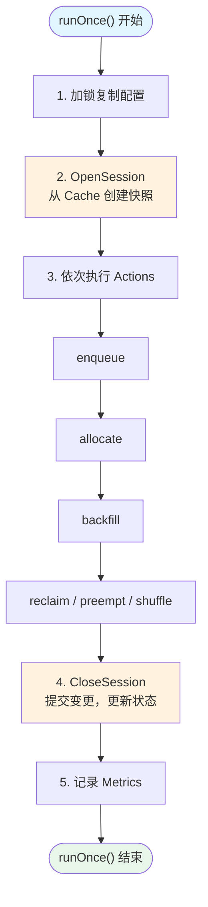
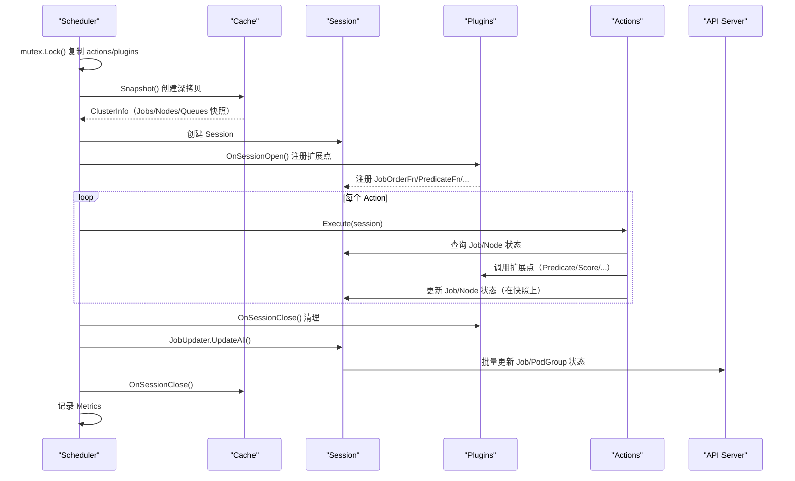
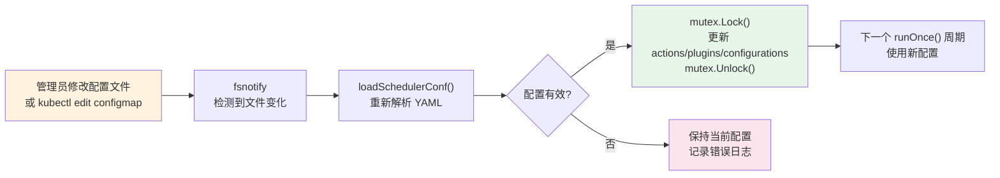

## 概述

Volcano 调度器是整个系统的核心组件，负责将 Job 中的 Task（Pod）分配到合适的节点上运行。调度器以周期性循环方式运行，每个周期执行一轮完整的调度决策：创建 Session、执行 Action 流水线、提交结果。本文深入分析调度器的启动流程、核心调度循环 `runOnce()` 的每一步细节、配置热加载机制和性能指标采集。

## 调度器结构

> **源码参考**：`pkg/scheduler/scheduler.go`

### Scheduler 结构体

```go
type Scheduler struct {
    cache              schedcache.Cache           // 集群状态缓存
    schedulerConf      string                     // 配置文件路径
    fileWatcher        filewatcher.FileWatcher    // 配置文件监听器
    schedulePeriod     time.Duration              // 调度周期（默认 1s）
    once               sync.Once                  // 确保默认配置只加载一次

    mutex              sync.Mutex                 // 保护下方字段的并发访问
    actions            []framework.Action         // 当前 Action 列表
    plugins            []conf.Tier                // 当前 Plugin Tier 配置
    configurations     []conf.Configuration       // Action 参数配置
    metricsConf        map[string]string          // Metrics 配置
    dumper             schedcache.Dumper           // Cache 调试转储器
    disableDefaultConf bool                       // 是否禁用默认配置
}
```

---

## 启动流程

### 整体启动序列

```mermaid
sequenceDiagram
    participant Main as "main()"
    participant Sched as "Scheduler"
    participant Cache as "SchedulerCache"
    participant Informer as "Informers"
    participant Loop as "调度循环"

    Main->>Sched: NewScheduler(options)
    Sched->>Cache: NewSchedulerCache(config)
    Cache->>Informer: 注册 Pod/Node/Queue/PodGroup Informer

    Main->>Sched: Run(stopCh)
    Sched->>Sched: loadSchedulerConf()
    Sched->>Sched: watchSchedulerConf(stopCh)
    Sched->>Cache: Run(stopCh)
    Cache->>Informer: 启动所有 Informer
    Cache->>Cache: WaitForCacheSync()
    Cache->>Cache: 启动 Node Worker / Bind Worker / 清理协程

    Sched->>Loop: wait.Until(runOnce, schedulePeriod, stopCh)
    Note over Loop: 每 1 秒执行一次 runOnce()
```

### NewScheduler 初始化

`NewScheduler()` 完成以下初始化：

1. 创建 REST Config（Kubernetes API 连接配置）
2. 初始化 FileWatcher（如果提供了配置文件路径）
3. 创建 SchedulerCache，传入：
   - `schedulerNames`：本调度器负责的 Pod（按 schedulerName 过滤）
   - `defaultQueue`：默认队列名称
   - `nodeSelector`：节点过滤标签
   - `ignoredProvisioners`：忽略的 CSI Provisioner 列表
4. 初始化 Cache Dumper（用于调试时转储缓存状态）

### Run 方法

`Run()` 是调度器的入口方法：

1. **加载配置**：`loadSchedulerConf()` 读取 Action/Plugin/Configuration
2. **启动文件监听**：`watchSchedulerConf(stopCh)` 在后台 goroutine 中监听配置变化
3. **设置 Metrics 配置**：`cache.SetMetricsConf(metricsConf)`
4. **启动 Cache**：`cache.Run(stopCh)` 启动所有 Informer 和后台 Worker
5. **启动调度循环**：`wait.Until(pc.runOnce, pc.schedulePeriod, stopCh)` 周期性执行
6. **可选**：启动 Cache Dumper 和 Socket Server

---

## 核心调度循环：runOnce()

`runOnce()` 是调度器最核心的方法，每个调度周期执行一次。默认每 **1 秒**执行一次（可通过 `--schedule-period` 调整）。

### 执行流程



### 详细步骤

#### 步骤 1：加锁复制配置

```go
pc.mutex.Lock()
actions := pc.actions
plugins := pc.plugins
configurations := pc.configurations
pc.mutex.Unlock()
```

将当前配置复制到局部变量，立即释放锁。这个设计允许配置热加载在调度周期执行期间安全更新配置，新配置在下一个周期生效。

#### 步骤 2：OpenSession

```go
ssn := framework.OpenSession(pc.cache, plugins, configurations)
```

OpenSession 是调度周期的核心准备阶段：

1. **创建快照**（`cache.Snapshot()`）：深拷贝当前集群状态（Jobs、Nodes、Queues）
2. **构建辅助数据**：NodeMap（K8s Framework 兼容）、PodLister、HyperNode 拓扑
3. **初始化 Plugin**：按 Tier 顺序实例化每个 Plugin，调用 `OnSessionOpen()` 注册扩展点
4. **初始化 CycleState**：为每个待调度 Pod 创建 CycleState

> **关键设计**：调度操作在快照上进行，不直接修改 Cache。这保证了调度过程中 Cache 可以继续接收 Informer 事件更新，互不干扰。

#### 步骤 3：执行 Action 流水线

```go
for _, action := range actions {
    actionStartTime := time.Now()
    action.Execute(ssn)
    metrics.UpdateActionDuration(action.Name(), time.Since(actionStartTime))
}
```

按配置顺序依次执行每个 Action，每个 Action 在 Session 的快照上进行调度决策。典型的执行顺序：

```
enqueue → allocate → backfill → reclaim → preempt → shuffle
```

每个 Action 的执行时间被记录为 Metrics。

#### 步骤 4：CloseSession

```go
defer framework.CloseSession(ssn)
```

通过 `defer` 确保在 `runOnce()` 返回时一定执行：

1. **调用 Plugin 清理**：每个 Plugin 的 `OnSessionClose()` 方法
2. **提交 Job 变更**：通过 JobUpdater 将调度决策批量更新到 API Server
3. **更新 Queue 状态**：更新各队列的资源分配信息
4. **通知 Cache**：`cache.OnSessionClose()` 同步状态
5. **清理内存**：释放 Session 持有的大数据结构

#### 步骤 5：记录 Metrics

```go
metrics.UpdateE2eDuration(time.Since(scheduleStartTime))
```

记录整个调度周期的端到端延迟。

---

## 调度周期时序图



---

## 配置热加载

### 机制

Volcano 调度器支持配置文件的热加载，修改配置后无需重启：



### 实现细节

- 使用 `fsnotify` 库监控配置文件目录
- 捕获 `Write` 和 `Create` 事件（覆盖写入和新文件创建）
- 配置更新通过 Mutex 保护，与 `runOnce()` 的配置读取互不冲突
- 无效配置不会导致调度器崩溃，而是保持上一次有效配置

### 配置加载优先级

```
默认内置配置 → 文件配置 → 热加载更新
```

- **默认配置**：代码中硬编码，作为兜底（可通过 `--disable-default-scheduler-config` 禁用）
- **文件配置**：通过 `--scheduler-conf` 指定路径
- **热加载**：运行期间文件修改自动生效

---

## 关键启动参数

| 参数 | 默认值 | 说明 |
|------|--------|------|
| `--schedule-period` | `1s` | 调度周期间隔 |
| `--scheduler-conf` | - | 配置文件路径 |
| `--disable-default-scheduler-config` | `false` | 禁用默认配置 |
| `--scheduler-name` | `volcano` | 调度器名称（过滤 Pod） |
| `--default-queue` | `default` | 默认队列名 |
| `--node-selector` | - | 节点过滤标签 |
| `--node-worker-threads` | `20` | 节点处理 Worker 数量 |
| `--listen-address` | `:8080` | Metrics 和健康检查监听地址 |

---

## Metrics 指标

调度器暴露以下 Prometheus Metrics：

| Metric | 类型 | 说明 |
|--------|------|------|
| `e2e_scheduling_duration` | Histogram | runOnce() 完整调度周期的端到端延迟 |
| `action_duration` | Histogram | 每个 Action 的执行时间（按 action name 标签） |
| `plugin_duration` | Histogram | Plugin OnSessionOpen/Close 的执行时间 |
| `task_scheduling_duration` | Histogram | 单个 Task 从入队到绑定的延迟 |

---

## 常见问题

### Q: 调度周期 1 秒会不会太慢？

对于大多数批调度场景，1 秒是合适的。原因：
- 批调度关注吞吐量而非延迟
- Gang Scheduling 需要收集足够的 Pod 才能做决策
- 过短的周期可能导致频繁的无效调度（资源尚未就绪）

可以通过 `--schedule-period` 调整，例如 `500ms` 提高响应速度。

### Q: 调度过程中如果有新 Pod 创建会怎样？

新 Pod 的事件会被 Informer 捕获并更新到 Cache 中，但当前调度周期操作的是快照，不会看到新 Pod。新 Pod 会在下一个调度周期被调度。

### Q: 如何判断调度器是否有性能问题？

查看 `e2e_scheduling_duration` 指标，如果持续超过 `schedulePeriod`（默认 1 秒），说明调度器存在性能瓶颈。可以通过提高日志级别（`--v=5`）查看每个 Action 的耗时。

---

## 下一步

- [Cache 与快照](./02-cache-and-snapshot.md) -- 深入理解 Cache 的数据管理和 Snapshot 机制
- [Session 框架](./03-session-framework.md) -- Session 结构和扩展点注册
- [Action 流水线](./04-action-pipeline.md) -- 各 Action 的调度算法
